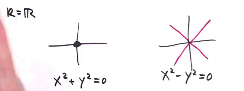

\newcommand{\dx}{\,dx}
\newcommand{\dt}{\,dt}
\newcommand{\dy}{\,dy}
\newcommand{\ds}{\,ds}
\newcommand{\dz}{\,dz}
\newcommand{\textoperatorname}[1]{
  \operatorname{\textnormal{#1}}
}
\newcommand{\et}{\text{ét}}
\newcommand{\Et}{\text{Ét}}
\newcommand\stacksymbol[3]{
  \mathrel{\stackunder[2pt]{\stackon[4pt]{$#3$}{$\scriptscriptstyle#1$}}{
  $\scriptscriptstyle#2$}}
}
\renewcommand{\AA}[0]{{\mathbb{A}}}
\newcommand{\Af}[0]{{\mathbb{A}}}
\newcommand{\CC}[0]{{\mathbb{C}}}
\newcommand{\BB}[0]{{\mathbb{B}}}
\newcommand{\CP}[0]{{\mathbb{CP}}}
\newcommand{\DD}[0]{{\mathbb{D}}}
\newcommand{\FF}[0]{{\mathbb{F}}}
\newcommand{\fq}[0]{{\mathbb{F}_{q}}}
\newcommand{\fqr}[0]{{\mathbb{F}_{q^r}}}
\newcommand{\GF}[0]{{\mathbb{GF}}}
\newcommand{\GG}[0]{{\mathbb{G}}}
\newcommand{\KK}[0]{{\mathbb{K}}}
\newcommand{\kk}[0]{{\mathbb{k}}}
\newcommand{\bbm}[0]{{\mathbb{M}}}
\newcommand{\NN}[0]{{\mathbb{N}}}
\newcommand{\OP}[0]{{\mathbb{OP}}}
\newcommand{\PP}[0]{{\mathbb{P}}}
\newcommand{\QQ}[0]{{\mathbb{Q}}}
\newcommand{\RP}[0]{{\mathbb{RP}}}
\newcommand{\RR}[0]{{\mathbb{R}}}
\newcommand{\SpSp}[0]{{\mathbb{S}}}
\renewcommand{\SS}[0]{{\mathbb{S}}}
\newcommand{\TT}[0]{{\mathbb{T}}}
\newcommand{\ZZ}[0]{{\mathbb{Z}}}
\newcommand{\znz}[0]{\mathbb{Z}/n\mathbb{Z}}
\newcommand{\zpz}[0]{\mathbb{Z}/p\mathbb{Z}}
\newcommand{\zlz}[0]{\mathbb{Z}/\ell\mathbb{Z}}
\newcommand{\zlnz}[0]{\mathbb{Z}/\ell^n\mathbb{Z}}
\newcommand{\Qp}[0]{\mathbb{Q}_{(p)}}
\newcommand{\Zp}[0]{\mathbb{Z}_{(p)}}
\newcommand{\ZpZ}[0]{\mathbb{Z}/p}
\newcommand{\SF}[0]{\operatorname{SF}}
\newcommand{\vol}[0]{\operatorname{vol}}
\newcommand{\Cx}[0]{\operatorname{Cx}}
\newcommand{\Ch}[0]{\operatorname{Ch}}
\newcommand{\ks}[0]{\operatorname{ks}}
\newcommand{\Arg}[0]{\operatorname{Arg}}
\newcommand{\PGL}[0]{\operatorname{PGL}}
\newcommand{\GL}[0]{\operatorname{GL}}
\newcommand{\Gl}[0]{\operatorname{GL}}
\newcommand{\gl}[0]{\operatorname{GL}}
\newcommand{\mat}[0]{\operatorname{Mat}}
\newcommand{\Mat}[0]{\operatorname{Mat}}
\newcommand{\Rat}[0]{\operatorname{Rat}}
\newcommand{\Perv}[0]{\operatorname{Perv}}
\newcommand{\Gal}[0]{\operatorname{Gal}}
\newcommand{\Hilb}[0]{\operatorname{Hilb}}
\newcommand{\Quot}[0]{\operatorname{Quot}}
\newcommand{\Art}[0]{\operatorname{Art}}
\newcommand{\red}[0]{\operatorname{red}}
\newcommand{\Pic}[0]{{\operatorname{Pic}}}
\newcommand{\lcm}[0]{\operatorname{lcm}}
\newcommand{\maps}[0]{\operatorname{Maps}}
\newcommand{\maxspec}[0]{{\operatorname{maxSpec}}}
\newcommand{\Tr}[0]{\operatorname{Tr}}
\newcommand{\adj}[0]{\operatorname{adj}}
\newcommand{\ad}[0]{\operatorname{ad}}
\newcommand{\ann}[0]{\operatorname{Ann}}
\newcommand{\Ann}[0]{\operatorname{Ann}}
\newcommand{\arcsec}[0]{\operatorname{arcsec}}
\newcommand{\ch}[0]{\operatorname{ch}}
\newcommand{\Sp}[0]{{\operatorname{Sp}}}
\newcommand{\syl}[0]{{\operatorname{Syl}}}
\newcommand{\ff}[0]{\operatorname{ff}}
\newcommand{\txand}[0]{{\operatorname{ and }}}
\newcommand{\Tot}[0]{\mathrm{\operatorname{Tot}}}
\newcommand{\fppf}[0]{\mathrm{\operatorname{fppf}}}
\newcommand{\Fppf}[0]{\mathrm{\operatorname{Fppf}}}
\newcommand{\zar}[0]{{\mathrm{zar}}}
\newcommand{\afp}[0]{A_{/\FF_p}}
\newcommand{\Fp}[0]{{\FF_p}}
\newcommand{\HP}[0]{{\operatorname{HP}}}
\newcommand{\TP}[0]{{\operatorname{TP}}}
\newcommand{\HC}[0]{{\operatorname{HC}}}
\newcommand{\HH}[0]{{\operatorname{HH}}}
\newcommand{\THH}[0]{{\operatorname{THH}}}
\newcommand{\GW}[0]{{\operatorname{GW}}}
\newcommand{\TCH}[0]{{\operatorname{TCH}}}
\newcommand{\Zar}[0]{{\mathrm{Zar}}}
\newcommand{\qcoh}[0]{{\mathrm{QCoh}}}
\newcommand{\Qcoh}[0]{{\mathrm{QCoh}}}
\newcommand{\QCoh}[0]{{\mathrm{QCoh}}}
\newcommand{\ssets}[0]{\operatorname{sSets}}
\newcommand{\Ring}[0]{\mathbf{Ring}}
\newcommand{\Cat}[0]{\mathbf{Cat}}
\newcommand{\codim}[0]{\operatorname{codim}}
\newcommand{\coim}[0]{\operatorname{coim}}
\newcommand{\dom}[0]{\operatorname{dom}}
\newcommand{\txor}[0]{{\operatorname{ or }}}
\newcommand{\txt}[1]{{\operatorname{ {#1} }}}
\newcommand{\Gr}[0]{{\operatorname{Gr}}}
\newcommand{\gr}[0]{{\operatorname{gr}}}
\newcommand{\grMod}[0]{{\operatorname{grMod}}}
\newcommand{\bimod}[2]{({#1}, {#2})\dash\mathbf{biMod}}
\newcommand{\dcoset}[3]{
    {\textstyle #1}
    \mkern-4mu\scalebox{1.5}{$\diagdown$}\mkern-5mu^{\textstyle #2}
    \mkern-4mu\scalebox{1.5}{$\diagup$}\mkern-5mu{\textstyle #3} }
\newcommand{\grdim}[0]{{\operatorname{gr\,dim}}}
\newcommand{\Aut}[0]{{\operatorname{Aut}}}
\newcommand{\aut}[0]{\operatorname{Aut}}
\newcommand{\Inn}[0]{{\operatorname{Inn}}}
\newcommand{\Out}[0]{{\operatorname{Out}}}
\newcommand{\mltext}[1]{\left\{\begin{array}{c}#1\end{array}\right\}}
\newcommand{\Fun}[0]{{\operatorname{Fun}}}
\newcommand{\SL}[0]{{\operatorname{SL}}}
\newcommand{\PSL}[0]{{\operatorname{PSL}}}
\newcommand{\SO}[0]{{\operatorname{SO}}}
\newcommand{\SU}[0]{{\operatorname{SU}}}
\newcommand{\SP}[0]{{\operatorname{SP}}}
\newcommand{\per}[0]{{\operatorname{Per}}}
\newcommand{\loc}[0]{{\operatorname{loc}}}
\newcommand{\Spin}[0]{{\operatorname{Spin}}}
\newcommand{\mcTop}[0]{\mathcal{T}\operatorname{op}}
\newcommand{\Sing}[0]{{\operatorname{Sing}}}
\newcommand{\sing}[0]{{\operatorname{Sing}}}
\newcommand{\alg}[0]{\mathrm{Alg}}
\newcommand{\scalg}[0]{\mathrm{sCAlg}}
\newcommand{\calg}[0]{\mathrm{CAlg}}
\newcommand{\dR}[0]{\mathrm{dR}}
\newcommand{\poly}[0]{\operatorname{poly}}
\newcommand{\Vect}[0]{{\operatorname{Vect}}}
\newcommand{\Sh}[0]{{\operatorname{Sh}}}
\newcommand{\presh}[0]{{\operatorname{Presh}}}
\newcommand{\Presh}[0]{{\operatorname{Presh}}}
\newcommand{\ab}[0]{{\operatorname{ab}}}
\newcommand{\op}[0]{^{\operatorname{op}}}
\newcommand{\Op}[0]{{\operatorname{Op}}}
\newcommand{\Ob}[0]{{\operatorname{Ob}}}
\newcommand{\prim}[0]{{\operatorname{prim}}}
\newcommand{\Set}[0]{{\operatorname{Set}}}
\newcommand{\Sets}[0]{{\operatorname{Set}}}
\newcommand{\Grp}[0]{{\operatorname{Grp}}}
\newcommand{\Groups}[0]{{\operatorname{Groups}}}
\newcommand{\Homeo}[0]{{\operatorname{Homeo}}}
\newcommand{\Diffeo}[0]{{\operatorname{Diffeo}}}
\newcommand{\MCG}[0]{{\operatorname{MCG}}}
\newcommand{\set}[0]{{\operatorname{Set}}}
\newcommand{\Tor}[0]{\operatorname{Tor}}
\newcommand{\ext}{\operatorname{Ext} }
\newcommand{\Ext}{\operatorname{Ext}}
\newcommand{\sets}[0]{{\operatorname{Set}}}
\newcommand{\Sm}[0]{{\operatorname{Sm}}}
\newcommand{\fin}[0]{{\operatorname{fin}}}
\newcommand{\orr}[0]{{\operatorname{ or }}}
\newcommand{\annd}[0]{{\operatorname{ and }}}
\newcommand{\bung}[0]{\operatorname{Bun}_G}
\newcommand{\const}[0]{{\operatorname{const.}}}
\newcommand{\disc}[0]{{\operatorname{disc}}}
\newcommand{\id}[0]{\operatorname{id}}
\newcommand{\Id}[0]{\operatorname{Id}}
\newcommand{\im}[0]{\operatorname{im}}
\newcommand{\pt}[0]{{\{\operatorname{pt}\}}}
\newcommand{\sep}[0]{^\operatorname{sep}}
\newcommand{\tors}[0]{{\operatorname{tors}}}
\newcommand{\tor}[0]{\operatorname{Tor}}
\newcommand{\height}[0]{\operatorname{ht}}
\newcommand{\cpt}[0]{\operatorname{compact}}
\newcommand{\abs}[1]{{\left\lvert {#1} \right\rvert}}
\newcommand{\stack}[1]{\mathclap{\substack{ #1 }}} 
\newcommand{\qtext}[1]{{\quad \operatorname{#1} \quad}}
\newcommand{\qst}[0]{{\quad \operatorname{such that} \quad}}
\newcommand{\actsonl}[0]{\curvearrowleft}
\newcommand{\actson}[0]{\curvearrowright}
\newcommand{\bd}[0]{{\del}}
\newcommand{\bigast}[0]{{\mathop{\text{\Large $\ast$}}}}
\newcommand{\convolve}[0]{\ast}
\newcommand{\coker}[0]{\operatorname{coker}}
\newcommand{\Mor}[0]{\operatorname{Mor}}
\newcommand{\cone}[0]{\operatorname{cone}}
\newcommand{\cok}[0]{\operatorname{coker}}
\newcommand{\conjugate}[1]{{\overline{{#1}}}}
\newcommand{\converges}[1]{\overset{#1}}
\newcommand{\bundle}[1]{\mathcal{#1}}
\newcommand{\td}[0]{\mathrm{td}}
\newcommand{\correspond}[1]{\theset{\substack{#1}}}
\newcommand{\cross}[0]{\times}
\newcommand{\by}[0]{\times}
\newcommand{\dash}[0]{{\hbox{-}}}
\newcommand{\dd}[2]{{\frac{\partial #1}{\partial #2}\,}}
\newcommand{\definedas}[0]{\coloneqq}
\newcommand{\da}[0]{\coloneqq}
\newcommand{\del}[0]{{\partial}}
\newcommand{\directlim}[0]{\varinjlim}
\newcommand{\inverselim}[0]{\varprojlim}
\newcommand{\disjoint}[0]{{\coprod}}
\newcommand{\Disjoint}[0]{\displaystyle\coprod}
\newcommand{\dual}[0]{^\vee}
\newcommand{\sm}[0]{\setminus}
\newcommand{\smz}[0]{\setminus\theset{0}}
\newcommand{\smts}[1]{\setminus\theset{#1}}
\newcommand{\eps}[0]{\varepsilon}
\newcommand{\floor}[1]{{\left\lfloor #1 \right\rfloor}}
\newcommand{\up}[0]{\uparrow}
\newcommand{\generators}[1]{\left\langle{#1}\right\rangle}
\newcommand{\gs}[1]{\left\langle{#1}\right\rangle}
\newcommand{\homotopic}[0]{\simeq}
\newcommand{\injectivelim}[0]{\varinjlim}
\newcommand{\inner}[2]{{\left\langle {#1},~{#2} \right\rangle}}
\newcommand{\ip}[2]{{\left\langle {#1},~{#2} \right\rangle}}
\newcommand{\union}[0]{\cup}
\newcommand{\Union}[0]{\bigcup}
\newcommand{\intersect}[0]{\cap}
\newcommand{\Intersect}[0]{\bigcap}
\newcommand{\into}[0]{\to}
\newcommand{\inv}[0]{^{-1}}
\newcommand{\mfa}[0]{{\mathfrak{a}}}
\newcommand{\mfb}[0]{{\mathfrak{b}}}
\newcommand{\mfc}[0]{{\mathfrak{c}}}
\newcommand{\mff}[0]{{\mathfrak{f}}}
\newcommand{\mfi}[0]{{\mathfrak{I}}}
\newcommand{\mfm}[0]{{\mathfrak{m}}}
\newcommand{\mfn}[0]{{\mathfrak{n}}}
\newcommand{\mfp}[0]{{\mathfrak{p}}}
\newcommand{\mfq}[0]{{\mathfrak{q}}}
\newcommand{\mfr}[0]{{\mathfrak{r}}}
\newcommand{\lieb}[0]{{\mathfrak{b}}}
\newcommand{\liegl}[0]{{\mathfrak{gl}}}
\newcommand{\lieg}[0]{{\mathfrak{g}}}
\newcommand{\lieh}[0]{{\mathfrak{h}}}
\newcommand{\lien}[0]{{\mathfrak{n}}}
\newcommand{\liesl}[0]{{\mathfrak{sl}}}
\newcommand{\lieso}[0]{{\mathfrak{so}}}
\newcommand{\liesp}[0]{{\mathfrak{sp}}}
\newcommand{\lieu}[0]{{\mathfrak{u}}}
\newcommand{\Lie}[0]{\operatorname{Lie}}
\newcommand{\nilrad}[0]{{\mathfrak{N}}}
\newcommand{\jacobsonrad}[0]{{\mathfrak{J}}}
\newcommand{\mm}[0]{{\mathfrak{m}}}
\newcommand{\pr}[0]{{\operatorname{pr}}}
\newcommand{\mapsvia}[1]{\xrightarrow{#1}}
\newcommand{\fromvia}[1]{\xleftarrow{#1}}
\newcommand{\mapstovia}[1]{\xmapsto{#1}}
\newcommand{\ms}[0]{\xrightarrow{\sim}}
\newcommand{\from}[0]{\leftarrow}
\newcommand{\mapstofrom}[0]{\rightleftharpoons}
\newcommand{\mapscorrespond}[2]{\mathrel{\operatorname*{\rightleftharpoons}_{#1}^{#2}}}
\newcommand{\injects}[0]{\hookrightarrow}
\newcommand{\diagonal}[0]{\Delta}
\newcommand{\embeds}[0]{\hookrightarrow}
\newcommand{\injectsvia}[1]{\xhookrightarrow{#1}}
\newcommand{\surjects}[0]{\twoheadrightarrow}
\newcommand{\surjectsvia}[2][]{
  \xrightarrow[#1]{#2}\mathrel{\mkern-14mu}\rightarrow
}
\newcommand{\adjoint}[0]{\leftrightarrows}
\newcommand{\kx}[1]{k[x_1, \cdots, x_{#1}]}
\newcommand{\kxn}[0]{k[x_1, \cdots, x_{n}]}
\newcommand{\MM}[0]{{\mathcal{M}}}
\newcommand{\OO}[0]{{\mathcal{O}}}
\newcommand{\OX}[0]{{\mathcal{O}_X}}
\newcommand{\imaginarypart}[1]{{\mathcal{Im}({#1})}}
\newcommand{\mca}[0]{{\mathcal{A}}}
\newcommand{\mcb}[0]{{\mathcal{B}}}
\newcommand{\mcc}[0]{{\mathcal{C}}}
\newcommand{\mcd}[0]{{\mathcal{D}}}
\newcommand{\mce}[0]{{\mathcal{E}}}
\newcommand{\mcf}[0]{{\mathcal{F}}}
\newcommand{\mcg}[0]{{\mathcal{G}}}
\newcommand{\mch}[0]{{\mathcal{H}}}
\newcommand{\mci}[0]{{\mathcal{I}}}
\newcommand{\mcj}[0]{{\mathcal{J}}}
\newcommand{\mck}[0]{{\mathcal{K}}}
\newcommand{\mcl}[0]{{\mathcal{L}}}
\newcommand{\mcm}[0]{{\mathcal{M}}}
\newcommand{\mcp}[0]{{\mathcal{P}}}
\newcommand{\mcs}[0]{{\mathcal{S}}}
\newcommand{\mct}[0]{{\mathcal{T}}}
\newcommand{\mcu}[0]{{\mathcal{U}}}
\newcommand{\mcv}[0]{{\mathcal{V}}}
\newcommand{\mcx}[0]{{\mathcal{X}}}
\newcommand{\mcz}[0]{{\mathcal{Z}}}
\newcommand{\kfq}[0]{K_{/\mathbb{F}_q}}
\newcommand{\cl}[0]{\operatorname{cl}}
\newcommand{\Cl}[0]{\operatorname{Cl}}
\newcommand{\St}[0]{\operatorname{St}}
\newcommand{\trdeg}[0]{\operatorname{trdeg}}
\newcommand{\dist}[0]{\operatorname{dist}}
\newcommand{\Dist}[0]{\operatorname{Dist}}
\newcommand{\crit}[0]{\operatorname{crit}}
\newcommand{\Crit}[0]{\operatorname{Crit}}
\newcommand{\diam}[0]{{\operatorname{diam}}}
\newcommand{\gal}[0]{\operatorname{Gal}}
\newcommand{\diff}[0]{\operatorname{Diff}}
\newcommand{\diag}[0]{\operatorname{diag}}
\newcommand{\soc}[0]{\operatorname{Soc}}
\newcommand{\hd}[0]{\operatorname{Head}}
\newcommand{\grad}[0]{\operatorname{grad}}
\newcommand{\hilb}[0]{\operatorname{Hilb}}
\newcommand{\minpoly}[0]{{\operatorname{minpoly}}}
\newcommand{\Frame}[0]{{\operatorname{Frame}}}
\newcommand{\OFrame}[0]{{\operatorname{OFrame}}}
\newcommand{\UFrame}[0]{{\operatorname{UFrame}}}
\newcommand{\smooth}[0]{{\operatorname{sm}}}
\newcommand{\Hom}[0]{{\operatorname{Hom}}}
\newcommand{\shom}{\mathscr{H}\operatorname{\kern -3pt {\calligra\large om}}}
\newcommand{\HHom}{\mathscr{H}\kern-2pt\operatorname{om}}
\newcommand{\Map}[0]{{\operatorname{Map}}}
\newcommand{\multinomial}[1]{\left(\!\!{#1}\!\!\right)}
\newcommand{\nil}[0]{{\operatorname{nil}}}
\newcommand{\normalneq}{\mathrel{\reflectbox{$\trianglerightneq$}}}
\newcommand{\normal}[0]{{~\trianglelefteq~}}
\newcommand{\norm}[1]{{\left\lVert {#1} \right\rVert}}
\newcommand{\pnorm}[2]{{\left\lVert {#1} \right\rVert}_{#2}}
\newcommand{\notimplies}[0]{\centernot\implies}
\newcommand{\onto}[0]{\twoheadhthtarrow}
\newcommand{\ord}[0]{{\operatorname{Ord}}}
\newcommand{\pic}[0]{{\operatorname{Pic}}}
\newcommand{\projectivelim}[0]{\varprojlim}
\newcommand{\rad}[0]{{\operatorname{rad}}}
\newcommand{\ralg}[0]{\operatorname{R-alg}}
\newcommand{\kalg}[0]{k\dash\operatorname{alg}}
\newcommand{\rank}[0]{\operatorname{rank}}
\newcommand{\realpart}[1]{{\mathcal{Re}({#1})}}
\newcommand{\Log}[0]{\operatorname{Log}}
\newcommand{\reg}[0]{\operatorname{Reg}}
\newcommand{\restrictionof}[2]{ {\left.{{#1}} \right|_{{#2}} } }
\newcommand{\ro}[2]{{ \left.{{#1}} \right|_{{#2}} }}
\newcommand{\rk}[0]{{\operatorname{rank}}}
\newcommand{\evalfrom}[0]{\Big|}
\renewcommand{\mod}{\pmod}
\newcommand{\Top}[0]{{\mathbf{Top}}}
\newcommand{\Mfd}[0]{{\mathbf{Mfd}}}
\newcommand{\Ab}[0]{{\mathbf{Ab}}}
\newcommand{\hoTop}[0]{{\mathbf{hoTop}}}
\newcommand{\Sch}[0]{{\mathbf{Sch}}}
\newcommand{\sch}[0]{{\mathbf{Sch}}}
\newcommand{\rmod}[0]{{R\dash\mathbf{Mod}}}
\newcommand{\modr}[0]{{\mathbf{Mod}\dash R}}
\newcommand{\mmod}[0]{{\dash\operatorname{Mod}}}
\newcommand{\mods}[1]{{{#1}\dash\mathbf{Mod}}}
\newcommand{\modsright}[1]{\mathbf{Mod}\dash{#1}}
\newcommand{\modsleft}[1]{{#1}\dash\mathbf{<od}}
\newcommand{\kmod}[0]{{k\dash\mathbf{Mod}}}
\newcommand{\Mod}[0]{{\operatorname{Mod}}}
\newcommand{\rotate}[2]{{\style{display: inline-block; transform: rotate(#1deg)}{#2}}}
\newcommand{\selfmap}[0]{{\circlearrowleft}}
\newcommand{\semidirect}[0]{\rtimes}
\newcommand{\sgn}[0]{\operatorname{sgn}}
\newcommand{\sign}[0]{\operatorname{sign}}
\newcommand{\spanof}[0]{{\operatorname{span}}}
\newcommand{\spec}[0]{\operatorname{Spec}}
\newcommand{\mspec}[0]{\operatorname{mSpec}}
\newcommand{\Jac}[0]{\operatorname{Jac}}
\newcommand{\stab}[0]{{\operatorname{Stab}}}
\newcommand{\stirlingfirst}[2]{\genfrac{[}{]}{0pt}{}{#1}{#2}}
\newcommand{\stirling}[2]{\genfrac\{\}{0pt}{}{#1}{#2}}
\newcommand{\strike}[1]{{\enclose{horizontalstrike}{#1}}}
\newcommand{\st}[0]{{~\mathrel{\Big|}~}}
\newcommand{\supp}[0]{{\operatorname{supp}}}
\newcommand{\sym}[0]{\operatorname{Sym}}
\newcommand{\Sym}[0]{\operatorname{Sym}}
\newcommand{\Wedge}[0]{\bigwedge}
\newcommand{\wedgeprod}[0]{\vee}
\newcommand{\Wedgeprod}[0]{\bigvee}
\newcommand{\Vee}[0]{\bigvee}
\newcommand{\tensor}[0]{\otimes}
\newcommand{\connectsum}[0]{\mathop{ \text{\Large \#} }}
\newcommand{\theset}[1]{\left\{{#1}\right\}}
\newcommand{\ts}[1]{\left\{{#1}\right\}}
\newcommand{\infsum}[1]{\sum_{{#1=0}}^\infty}
\newcommand{\gens}[1]{\left\langle{#1}\right\rangle}
\newcommand{\thevector}[1]{{\left[ {#1} \right]}}
\newcommand{\tv}[1]{{\left[ {#1} \right]}}
\newcommand{\too}[1]{{\xrightarrow{#1}}}
\newcommand{\transverse}[0]{\pitchfork}
\newcommand{\trianglerightneq}{\mathrel{\ooalign{\raisebox{-0.5ex}{\reflectbox{\rotatebox{90}{$\nshortmid$}}}\cr$\triangleright$\cr}\mkern-3mu}}
\newcommand{\tr}[0]{\operatorname{Tr}}
\newcommand{\uniformlyconverges}[0]{\rightrightarrows}
\newcommand{\abuts}[0]{\Rightarrow}
\newcommand{\covers}[0]{\rightrightarrows}
\newcommand{\units}[0]{^{\times}}
\newcommand{\nonzero}[0]{^{\bullet}}
\newcommand{\wait}[0]{{\,\cdot\,}}
\newcommand{\wt}[0]{{\operatorname{wt}}}
\renewcommand{\bar}[1]{\mkern 1.5mu\overline{\mkern-1.5mu#1\mkern-1.5mu}\mkern 1.5mu}
\renewcommand{\div}[0]{\operatorname{Div}}
\newcommand{\Div}[0]{\operatorname{Div}}
\newcommand{\Prin}[0]{\operatorname{Prin}}
\newcommand{\Frac}[0]{\operatorname{Frac}}
\renewcommand{\hat}[1]{\widehat{#1}}
\newcommand{\fourier}[1]{\widehat{#1}}
\renewcommand{\mid}[0]{\mathrel{\Big|}}
\renewcommand{\qed}[0]{\hfill\blacksquare}
\renewcommand{\too}[0]{\longrightarrow}
\renewcommand{\vector}[1]{\mathbf{#1}}
\newcommand*\dif{\mathop{}\!\operatorname{d}}
\newcommand{\ddt}{\tfrac{\dif}{\dif t}}
\newcommand{\ddx}{\tfrac{\dif}{\dif x}}
\renewcommand{\labelitemiii}{$\diamondsuit$}
\renewcommand{\labelitemiv}{$\diamondsuit$}
\newcommand\vecc[2]{\textcolor{#1}{\textbf{#2}}}
\newcommand*{\vertbar}{\rule[-1ex]{0.5pt}{2.5ex}}
\newcommand*{\horzbar}{\rule[.5ex]{2.5ex}{0.5pt}}
\newcommand\aug{\fboxsep=-\fboxrule\!\!\!\fbox{\strut}\!\!\!}
\newcommand\rref{\operatorname{RREF}}
\newcommand{\interior}[0]{^\circ}
\newcommand{\increasesto}[0]{\nearrow}
\newcommand{\decreasesto}[0]{\searrow}
\newcommand\jan{\operatorname{Jan}}
\DeclareMathOperator{\righttriplearrows} {{\; \tikz{ \foreach \y in {0, 0.1, 0.2} { \draw [-stealth] (0, \y) -- +(0.5, 0);}} \; }}
\DeclareMathOperator{\Exists}{\exists}
\DeclareMathOperator{\Forall}{\forall}
\DeclarePairedDelimiter{\ceil}{\lceil}{\rceil}
\DeclareMathOperator*{\hocolim}{hocolim}
\DeclareMathOperator*{\mapbackforth}{\rightleftharpoons}
\DeclareMathOperator*{\eq}{=}
\DeclareMathOperator{\Endo}{End}
\DeclareMathOperator{\Ind}{Ind}
\DeclareMathOperator{\ind}{Ind}
\DeclareMathOperator{\coind}{Coind}
\DeclareMathOperator{\proj}{Proj}
\DeclareMathOperator{\Proj}{Proj}
\DeclareMathOperator{\res}{Res}
\DeclareMathOperator{\Res}{Res}
\DeclareMathOperator{\Hol}{Hol}
\DeclareMathOperator{\Br}{Br}
\DeclareMathOperator{\coh}{coh}
\DeclareMathOperator{\colspace}{colspace}
\DeclareMathOperator{\rowspace}{rowspace}
\DeclareMathOperator{\codom}{codom}
\DeclareMathOperator{\range}{range}
\DeclareMathOperator{\nullspace}{nullspace}
\DeclareMathOperator{\nullity}{nullspace}
\DeclareMathOperator{\projection}{Proj}
\DeclareMathOperator{\Der}{Der}
\newcommand{\Suchthat}[0]{\middle\vert}
\newcommand{\suchthat}[0]{{~\mathrel{\Big|}~}}
\newcommand{\delbar}[0]{\bar{\del}}

\newcommand{\contains}[0]{\supseteq}
\newcommand{\containing}[0]{\supseteq}

\newcommand{\cat}[1]{\mathcal{#1}}
\newcommand{\thecat}[1]{\mathbf{#1}}
\newcommand{\sheaf}[1]{\operatorname{\mathcal{#1}}}

\newcommand\rrarrows{\rightrightarrows}
\newcommand\rrrarrows{
    \mathrel{\substack{\textstyle\rightarrow\\[-0.6ex]
        \textstyle\rightarrow \\[-0.6ex]
        \textstyle\rightarrow}}
}

\newcommand\colim{\mathop{\mathrm{colim}}\nolimits}

\newcommand\fp[1]{\underset{\scriptscriptstyle {#1} }{\times}}
\newcommand\ul[1]{\underline{#1}}
\newcommand\constantsheaf[1]{\underline{#1}}
\newcommand\holomorphic[0]{\text{holo}}
\newcommand\Mero[0]{\operatorname{Mero}}
\newcommand\compact[0]{\text{cpt}}
\newcommand\ol[1]{\overline{#1}}
\newcommand\univcover[1]{\overline{#1}}
\newcommand\closure[1]{\overline{#1}}
\newcommand\capprod{\frown}
\newcommand\cupprod{\smile}
\newcommand\Path{\mathcal{P}}
\newcommand\gradient{\nabla}

\newcommand\Hc[0]{{\check{H}}}
\newcommand\Cc[0]{{\check{C}}}
\newcommand\cupp[0]{\smile}
\newcommand\capp[0]{\frown}
\newcommand\sig[0]{\operatorname{sig}}

\def\contradiction
{
\tikz[baseline, x=0.2em, y=0.2em, line width=0.04em]
\draw (0,0) -- ({4*cos(45)},{4*sin(45)})
    (-1,1) -- ({-1 + 4*cos(45)},{1 + 4*sin(45)})
    (-1,3) -- ({-1 + 4*cos(315)},{3 + 4*sin(315)})
    (0,4) -- ({0 + 4*cos(315)},{4 + 4*sin(315)});
}

\newcommand{\RM}[1]{%
  \textup{\uppercase\expandafter{\romannumeral#1}}%
}
\newcommand{\divides}{\mid}
\newcommand{\notdivides}{\nmid}
\newcommand{\fractional}[1]{\theset{#1}}
\newcommand{\zadjoin}[1]{\mathbb{Z}\left[ {#1} \right]}
\newcommand{\Wedgepower}[0]{\bigwedge\nolimits}
\newcommand{\Bl}[0]{\operatorname{Bl}}

# Lecture 1: $\AA^1$ Enumerative Geometry

Enumerative geometry counts algebro-geometric objects, and in order to actually obtain an invariant number at the end of the day one uses an algebraically closed field $k$ or $\CC$. This is essentially because the conditions imposed are polynomial, and polynomials of degree $n$ over a closed field always have $n$ roots.

The goal here is to record information about the fields of definition. However, since we may no longer have invariant numbers as solutions to polynomial equations, we replace this with a notion of *weights* to get an "invariance of bilinear form" principle instead. Over characteristic not 2, we can use quadratic forms, which ties to Lurie's first talk.

## Example: Lines on a Smooth Cubic Surface

> Joint work with Jesse Kass

:::{.definition title="Smooth Cubic Surfaces"}
A **cubic surface** $X$ consists of the $\CC$ solutions to a polynomial in three variables, i.e.
$$
X = \theset{(x,y,z) \in \CC^3 \suchthat f(x,y,z) = 0},
$$

where $f$ is degree 3. In general, we want to compactify, so we view $X \injects \CP^3$ as
$$
\CP^3 = \theset{\vector x = [w,x,y,z]\neq \vector 0 \suchthat \forall \lambda \in \CC^\times,~\vector x = \lambda \vector x}
$$

and so
$$
X = \theset{[w,x,y,z] \in \CP^3 \suchthat f(w,x,y,z) = 0}
$$
where $f$ is homogeneous.
The surface $X$ is **smooth** if the underlying points form a manifold, or equivalently if the partials don't simultaneously vanish.
:::

:::{.theorem title="Salmon-Cayley, 1849"}
If $X$ is a smooth cubic surface, then $X$ contains exactly 27 lines.
:::

:::{.example title="?"}
The Fermat cubic $f(w,x,y,z) = w^3 + x^3 + y^3 + z^3$.
We can find one line, given by
$$
L = \theset{[s,-s,t,-t] \suchthat s,t \in \CP^1},
$$

and in fact this works for any $\lambda, \omega$ such that $\lambda^3 = \omega^3 = -1$, yielding
$$
L' = \theset{[s,\lambda s,t,\omega t] \suchthat s,t \in \CP^1}.
$$

We can also permute $s,t$ around to get more lines, and by counting this yields 27 distinct possibilities: 3 choices for $\lambda$, 3 choices for $\omega$, and $\frac 1 2 {4\choose 2}$ ways to pair them with the $s,t$ in the original $L$.

> There is a proof in the notes that these are the only lines, which is relatively elementary.

:::

### Modern Proof

We'll use characteristic classes, which we'll later replace by an $\Af^1$ homotopy theory variant.
Let $\Gr(1,3)$ be the Grassmannian parametrizing 1-dimensional subspaces of $\CP^3$, where the $\CC$ points of this space parameterize 2-dimensional subspaces $W \subseteq \CC^4$. This is a moduli space of the lines we're looking for.
Let $$S \to \Gr(1,3)$$ be the tautological bundle where the fiber is simply given by $S_W = W$. We can also form the bundle
$$
(\sym^3 S)\dual \to \Gr(1,3)
$$ where the fiber over the point corresponding to $W$ is all of the cubic polynomials on $W$, i.e. $$(\sym^3 S)\dual_W = (\sym^3 W)\dual.$$
Explicitly, we have the following two bundles to work with:

\begin{tikzcd}
W \ar[r] & S \ar[r] & \Gr(1, 3) \\
\qty{\sym^3 W}\dual \ar[r] & \qty{\sym^3 S}\dual \ar[r] & \Gr(1, 3)
\end{tikzcd}

Our chosen $f$ determines an element of $(\sym^3 \CC^4)\dual$, which is thus a section $\sigma_f$ of the second bundle above, where
$$
\sigma_f(W) = \restrictionof{f}{W}.
$$
We thus have
$$
\PP W \in X \iff \sigma_f(W) = 0,
$$
i.e. the line corresponding to $W$ is in our surface exactly when this section is zero. We now want to count the zeros of $\sigma_f$, which is exactly what the Euler class does.
To be precise, the Euler class counts the zeros of a section of a properly oriented vector bundle with a given weight. Let $V\to M$ be a rank $r$ $\RR\dash$ vector bundle over a dimension $r$ real manifold where we assume that $V$ is oriented.

> We choose $\RR$ here because $\CC$ is slightly too nice and gives us a preferred orientation (which we'll want to track later.)

For any section $\sigma$ with only isolated zero, we'll assign a weight to each zero which comes from the topological degree function
$$
\deg: [S^{r-1}, S^{r-1}] \to \ZZ,
$$

where we use the brackets to denote homotopy classes of maps.

:::{.definition title="Degrees"}
Let $p\in M$ where $\sigma(p) = 0$, and define $\deg_p(\sigma)$ in the following way:
Choose local coordinates near $p$. Since the zeros are isolated, we can choose a ball $B_\varepsilon(p)$ such that $x\in B_\varepsilon(p) - \theset{p} \implies \sigma(x) \neq 0$. Choose a local trivialization of the total space $V$. This allows us to view $\sigma: \RR^r \to \RR^r$ as a real function.
We can choose coordinates such that $p = 0$ in the domain, so $\sigma(0) = 0$, and moreover the image $\sigma(B_\varepsilon(p)) = \RR - \theset{0}$. We can then form a function
$$
\bar\sigma: \del B_\varepsilon(p) = S^{r-1} &\to S^{r-1} = \del \sigma(B_\varepsilon(p)) \\
x &\mapsto \frac{\sigma(x)} {\norm{\sigma(x)}},
$$
and so we can take $\deg_p(\sigma) \definedas \deg \bar \sigma$.
:::

:::{.remark}
There is indeterminacy here up to elements of $\GL(r, \RR)$ which could possibly affect the sign, however, but this can be fixed using the assumption that $V$ is oriented and choosing local trivializations for which the orientations are compatible. This gives us a well-defined local degree of a section at a zero.
:::

:::{.definition title="Euler Class"}
The Euler class, which only depends on the bundle and not the section, is given by
$$
e(V) = \sum_{\theset{p\suchthat \sigma(p) = 0}} \deg_p(\sigma).
$$
:::

It can be shown that because $X$ is smooth, the zeros are all simple and so in the complex case, the degrees are all 1. 
We thus obtain
$$
\abs{\theset{\text{Lines on } X}} = e((\sym^3 S)\dual),
$$

where the RHS is independent of $X$ and can be computed using the splitting principle and the cohomology of $\Gr$.

## What about $\RR$?

:::{.theorem title="Schlafli, 19th century"}
$X$ can have $3,7,15$ or $27$ lines. 
:::

So it's not constant, and thus there's not an invariant number here, but Segre (1942) distinguished between hyperbolic and elliptic lines.
Recall the characterization of elements in $\Aut L$ for $L=\RP^1$ (real lines) as elliptic/hyperbolic: we have $\Aut L \cong \mathrm{PGL}(2, \RR)$, so pick some $I$ corresponding to a matrix
$$
[I] = \begin{pmatrix}a & b \\ c & d\end{pmatrix},\quad  z\mapsto \frac{az+b}{cz+d}
$$
where the second formulation above shows that there are two fixed points, since solving for $z\mapsto z$ yields a quadratic equation. So we have
$$
\mathrm{Fix}(I) = \theset{z \in \CC \suchthat cz^2 + (d-z)z + b = 0},
$$
and we characterize $I$ by the following cases:

- $\mathrm{Fix}(I)$ contains two real points: hyperbolic
- A complex conjugate pair: elliptic

So we'll associate an involution to $L$, and port over these notions of hyperbolic/elliptic. As we'll see later, for each point on $L$, there will be a unique other point that has the tangent space, and this involution will swap them.
Let $p\in L$, and consider $T_pX \intersect X$ . Since $L$ is in both of the varieties we're intersecting here, and we can apply Bezout's theorem, we know that its complement will some degree 2 variety $Q$ (since the total degree is 3).

So we can write $T_pX \intersect X = L \union Q$. We know that $L \intersect Q$ will be the intersection of a degree 1 and a degree 2 curve, which will have 2 points of intersection. At one of these points, say $p$, $Q$ and $L$ will intersect transversally, and so the tangent vectors $T_pQ$ and $T_pL$ give a 2-dimensional frame, which yields a plane $P \subseteq T_pX$. Since $X$ is smooth, we get equality and $P = T_pX$.
This also holds for the second point of intersection, $p'$, and so we take the involution $I(p) = p'$ and vice-versa. We then say $L$ is elliptic/hyperbolic exactly when $I$ is.
A natural way to see that there should be a distinction between two types of lines is to use spin structures. Consider a physical cubic surface sitting inside $\RR^3$, and push the tangent plane alone a line. There are two things that can happen -- one is a twisting by a nontrivial element of $\pi_1 SO_3(\RR)$, the other is no twisting at all.

:::{.example title="?"}
Look at the Fermat cubic surface $x^3+y^3+z^3=-1$

Interpretation of this image: $X \subset \RR^3$ is a surface, which has 3 lines that are contained in a plane. We this view $X$ from above this plane, marking a plus/minus to denote the relative height of the surface within each bounded region. Plus denotes part of the surface that bubbles up over the plane, having positive height/$z$ coordinates, etc.

> (DZG) This took me a while to visualize -- what worked for me was thinking about "egg crate" padding:

:::

After thinking about what physically happens as you push a plane around, it becomes clear that these three lines are all hyperbolic. Note that this question is the same as asking if a path in the frame bundle lifts.

Although the number of lines isn't a constant, we can take a "signature" sort of formula to obtain an invariant. In this case, the number hyperbolic lines minus the number of elliptic lines *is* constant. In this case, the constant is 3.

:::{.slogan}
If you have a result that works over $\CC$ and $\RR$, it may be a result in $\Af^1$ homotopy theory that has realizations recovering the original results.
:::

## $\Af^1$ Homotopy Theory

This will allow us to do with schemes much of what we can do in $\mathbf{Top}$. Smooth schemes behave like manifolds, where there are balls around points. The convention here will be that we're working over smooth schemes, denoted $\mathrm{Sm}_k$ where $k$ is a field.

> Remark: in my notation I use $\RP^n, \CP^n$, and $\PP^n(k)$ to denote various projective spaces. I'll adopt Kirsten's convention here and just denote $\PP^n(k)$ as $\PP^n$.

We'll get spheres from $S_\Af^n \definedas \PP^n/\PP^{n-1}$.
One nice result due to Morel is that there is a degree map
$$
[S_\Af^n, S_\Af^n] \to GW(k),
$$

where the target is not the integers in this case, but rather a group of bilinear forms that are quadratic in characteristic not equal to 2.
It is the Grothendieck-Witt group, whose elements are formal difference of bilinear forms.

Thus the group itself is the group completion of nondegenerate symmetric isomorphism classes of bilinear forms $V^2 \to k$ where $V$ is a finite-dimensional $k\dash$vector space.

The group structure arises because if we have two bilinear forms $B, B'$ on vector spaces $V, W$ respectively, then we can define a new form on $V \oplus W$ by working in components and declaring orthogonality between any of the factors. We then take formal differences of these, and inherit a ring structure from the tensor product of forms.

Bilinear forms over fields can all be diagonalized, although in characteristic 2, this only holds in a stable sense.

## The Grothendieck-Witt Group
Since we can diagonalize, the group $GW(k)$ has a presentation coming from the one dimensional forms. Any of these work as a generator, so we have

- Generators: $\generators{a}$ where $a\in k^\times$, corresponding to the form
  \begin{align*}
  \generators{a} : k^2 &\to k\\
  (x,y) &\mapsto axy
  .\end{align*}

- Relations: if we change the basis of $k$ using a multiplication by $b\in k^\times$, we get $\generators{ab^2} = \generators{a}$.
  > This means that $a \in k^\times/(k^\times)^2$
  - We also get $\generators{a} + \generators{b} = \generators{a+b} + \generators{ab(a+b)}$

There are many concrete computations of this known for global fields, local fields, finite fields, function fields, etc.

:::{.example title="The Complex Numbers"}
Computing $GW(\CC)$:
The generators are in bijection with $k^\times/(k^\times)^2$, but since every element of $\CC$ is a square, so there's only one element here. 
We thus obtain
$$
GW(\CC) &\mapsvia{\sim} \ZZ \\
\beta &\mapsto \dim V
$$
which is realized by taking the rank.

:::

:::{.example title="The Real Number"}
Computing $GW(\RR)$:
We still have the rank, but now we can also take the signature, so we have
$$
GW(\RR) \mapsvia{\text{rank} \times \text{signature}} \ZZ^2,
$$
although a minor parity issue crops up here that can be fixed without damaging the isomorphism type.
:::

:::{.example title="Finite Fields"}
Computing $GW(\FF_q)$:
We can make a matrix out of how $\beta$ acts on basis elements and take the determinant of it to obtain an invariant called the *discriminant*, and so
$$
GW(\FF_q) \mapsvia{\text{discriminant} \times \text{rank}} \FF_q^\times/(\FF_q^\times)^2 \times \ZZ
$$
Note that the quotient is needed because we can change basis in $\FF_q$, which amounts to conjugating by a matrix $A$, and so this discriminant is only well-defined up to squares.
:::

## Euler Class

There is an Euler class in this setting,
$$
e(V) = \sum_{p\suchthat \sigma(p) = 0} \deg_p(\sigma).
$$
Letting $X$ be a smooth cubic surface over $k$, then a line $L\subset X$ will be a closed point of the Grassmannian $\Gr(1,3)$, so we can think of it as points of the form
$$
L = \theset{[a,b,c,d]s + [a',b',c',d']t \suchthat s,t \in \PP^1(k(L}
$$
where the extension field $k(L) = k(a,b,c,d,a',b',c',d')$ is obtained by adjoining the coefficients to $k$.

> DZG: I think these are always separable, mentioned later in the talk.

We thus get
$$
\PP^1(k(L)) \cong L \underset{\substack{\text{closed}\\\text{subscheme}}}\subseteq X_{k(L)} \subseteq \PP^3(k(L)).
$$

Given such a line $L\subseteq X$, similar to the real setting, we obtain an involution $I \in \Aut L \cong PGL(2, k(L))$ after choosing coordinates. We also find that $\mathrm{Fix}(L)$ again falls into two cases:

- $2 k(L)$ points, or
- 2 conjugate points in some quadratic extension $k(L)[\sqrt D]$ where $D \in k(L)^\times / (k(L)^\times)^2$. These correspond to the oddities in the tangent plane in the real case.

We then define
$$
\mathrm{Type}(L) = \generators{D} \in GW(k(L)),
$$

or equivalently $D=ab-cd$ when $I = \begin{pmatrix}a&b\\c&d\end{pmatrix}$, in which case $\mathrm{Type}(L) = \gs{-1} \deg I$.

## An Analogous Trace Formula

:::{.theorem title="?"}
Supposing $X$ is a smooth cubic surface over $k$ of characteristic not equal to 2, we then have
$$
\sum_{L \in X}\mathrm{Tr}_{k(L) / k}\mathrm{Type}(L) = \text{One fixed quadratic form} = 15 \gs{1} + 12 \gs{-1}
$$

where the trace/transfer maps are defined as

$$
\mathrm{Tr}_{k(L) / k}: GW(k(L)) &\to GW(k) \\
(V^2 \mapsvia{\beta} k(L)) &\mapsto (V^2 \mapsvia{\beta} k) \circ \mathrm{Trace}_\text{Galois}
$$

where $\mathrm{Trace}_\text{Galois}$ comes from summing the conjugates. Note that we can do this because we can view $V$ as a vector space over either $k$ or $k(L)$, so we end up with a quadratic form over $k$.
:::

:::{.remark}
Note: we have a well-defined map in the other direction, since the $GW$ is a stable homotopy group of spheres.
:::

:::{.example title="Complex Number"}
Let $k=\CC$, then apply rank to get $15+12=27$ on the RHS, while since every element is a square, the Type is just 1, so we get 27 total.
:::

:::{.example title="Reals"}
Let $k=\RR$, apply signature.
If $L$ is defined over $C$, so the type is 1, and we're just left with the trace of $\CC/\RR$ -- but this contributes a $+1$ and $-1$, so there is no contribution.
What's left are the lines of $\RR$, and since we set it up so type 1 lines are hyperbolic, we just get the trace $15-12=3$.
:::

:::{.example title="Finite Fields"}
Let $k=\FF_q$.
We can define lines in $\FF_q^n$, and the "begin a square" partitions $(\FF_q^n)^\times$ into two disjoint subsets, we can assign types and we let squares be the hyperbolic elements.
We thus get
$$
\mltext{
\text{Elliptic lines $L$ } \\
\text{with $k(L) = \FF_\text{odd}$}
} -
\mltext{
\text{Hyperbolic lines $L$} \\
\text{with $k(L) = \FF_\text{even}$}
}
\equiv 0 \mod 2
$$
which follows from computing the discriminant of the given form.
:::

  

# Lecture 2: User's Guide to $\Af^1$ Homotopy Theory

Particularly, arithmetically enriching enumerative results. The first part of this talk focuses on setting up the correct category for this theory.

## Adding Colimits
Recall from last time that we wanted to form a space analogous to a sphere, given by $\PP^n/ \PP^{n-1}$, which we get from a **colimit**

$$
\begin{CD}
  \PP^{n-1} @>>> \PP^n \\
  @VVV @VVV \\
  \pt @>>> \PP^n/ \PP^{n-1}
\end{CD}
$$

which is the same as requiring that for maps from the total space into the quotient, maps coming from the quotiented space and maps coming from the point agree when the compositions are taken.

:::{.example title="?"}
Another example of a colimit is the union, which is given by

$$
\begin{CD}
  U\intersect V @>>> U \\
  @VVV @VVV \\
  V @>>> U \union V
\end{CD}
$$

These correspond to crushing and gluing operations, which we can do with topological spaces and would like to do with schemes as well. We'd also like smooth schemes to behave like smooth manifolds, in the sense that we can take an open ball around each point. This is part of what $\Af^1$ homotopy theory buys us.
:::

We want colimits, so we add them: let $\Sm$ to be the category of smooth schemes over $k$. There is a Yoneda embedding

\begin{align*}
\Sm &\mapsvia{Y} \mathrm{Func}(\Sm^\text{op}, \mathrm{Sset}) = \text{PreSh}(\Sm) \\
X &\mapsto \hom(\wait, X)
.\end{align*}

where one might normally require the target to be sets, but since we'd like homotopy colimits and to be able to do things analogous to fibrant/cofibrant replacements, we aim for simplicial sets instead which can essentially be regarded as topological spaces. We can also identify the target with presheaves on the category of smooth schemes.
We're building a category for a homotopy theory, which means we need either

- A simplicial model category, or
- An $\infty\dash$category

Both have notions of fibrations, cofibrations, an associated homotopy category, weak equivalences, etc, and $\text{PreSh}(\Sm)$ has this structure.

## Preserving Old Colimits: Picking a Topology

This construction is essentially "freely adding colimits". Since $\Sm$ had colimits (e.g. the union/intersection of open sets), we want $Y$ to preserve these. We fix this be forcing certain maps to be equivalences using **Bousfield localization**.

This is carried out by looking at open covers
$$
U = \coprod_{\alpha} U_\alpha \to X
$$

and making a simplicial object out of this map and forcing a weak equivalence
$$
\text{cos}^0_x \coprod_\alpha U_\alpha \mapsvia{\homotopic} X
$$

> (DZG) Note: this may be the Cech nerve, not entirely sure. Pretty sure I got the notation wrong though.

This gives us a localization functor
$$
\mathrm{PreSh}(\Sm) \mapsvia{L_\tau} \mathrm{Sh}_k
$$

for $\tau$ a Grothendieck topology which declares certain classes of maps to be covers. 
We have some choices of topology here, roughly in order of increasing number of open sets:

- Zariski (on schemes)
- Nisnevich
- étale

:::{.definition title="Étale Maps"}
A map $f\in \hom(X,Y) \in \Sm$ (not necessarily smooth) is **étale** at a point $x\in X$ if the induced map on tangent/cotangent spaces is an isomorphism:
$$
T_x X \mapsvia{f^*} T_{f(x)}Y
$$
:::

:::{.definition title="Étale Covers"}
A map $f: \coprod_\alpha U_\alpha \to X$ is an **étale cover** if it is étale and surjective.
:::

:::{.definition title="Nisnevich Covers"}
A map $f: \coprod_\alpha U_\alpha \to X$ is a **Nisnevich cover** if it is an étale cover and 
\[
x\in X \implies \exists u\in U \text{ such that } f^*: k(x) \mapsvia{\sim}k(u)
.\]
:::

:::{.remark}
This topology has a few nice properties:

- Smooth schemes have étale maps into $\Af^n$, inclusions/closed immersions $Z \injects X$ induce maps $\Af^d \injects \Af^n$
- Satisfies descent for K-theory
- The cohomological dimension equals the Krull dimension
- Cohomology can be computed Čech complexes
- More listed in Voevodsky's original paper

:::

## Contracting the Affine Line

The last step is forcing $\Af^1$ to be contractible, i.e. $\Af^1 \cross X \homotopic X$, which will come from another localization $L_\Af$. This composition will land us in the homotopy theory we want:
$$
\Sm \mapsvia{Y} \text{PreSh}_k \mapsvia{L_\tau} \text{Sh}_k \mapsvia{L_{\Af}} \text{Spc}_k
$$

where $\tau$ is the choice of the Nisnevich topology, and so we'll call $\text{Spc}_k$ our $\Af^1$ homotopy theory.

## Making Spheres

Given two pointed spaces $X, Y$, we have
$$
X \wedge Y = \frac{X \cross Y}{(X\cross \pt) \union (\pt \cross Y)}
$$

In topology, we have $S^m \wedge S^n = S^{m+n}$. In $\Af^1$ homotopy theory, we have functors to simplicial sets, and so we can take constant functors, and in particular any element space living in simplicial sets is in our new homotopy theory as well. So we have $S^1$, we can also take $\GG_m = \Af^1 - \theset{0}$, and so we have spheres
$$
S^{p+q,q} = (S^1)^{\wedge p} \wedge (\GG_m)^{\wedge q} .
$$

Some of these end up being familiar spaces. 
For example, we can look at the colimit
$$
\begin{CD}
  \GG_m @>>> \Af^1 \homotopic \pt \\
  @VVV @VVV \\
  \pt \homotopic \AA^1 @>>> \PP^1
\end{CD}
$$

which follows from the fact that $\PP^1 = \Af^1 \union \theset{\infty}$ (yielding the top-right copy of $\Af^1$), and we can take a neighborhood around the point at $\infty$ to obtain the bottom-left copy -- these intersect in $\GG_m$.

So $\PP^1$ is the colimit of maps from $\GG_m$ to a point, so we can conclude that
$$
\PP^1 \homotopic \Sigma \GG_m = S^1 \wedge \GG_m
.$$

We can also show 
\[
\Af^n - \theset{0} \homotopic (S^1)^{\wedge n-1}\wedge (\GG_m)^{\wedge n}
.\]
This will rely on a general fact about the colimit of $X\cross Y$ with its projections is a suspension, given by
$$
\begin{CD}
  X\cross Y @>>> X \\
  @VVV @VVV \\
  Y @>>> \therefore \Sigma X\wedge Y
\end{CD}
$$

and so we can proceed by induction on the following diagram:
$$
\begin{CD}
  (\Af^{n-1} - \theset{0} )\cross(\Af^1 -\theset{0}) @>>> (\Af^{n-1} -\theset{0}) \cross \Af^1 \\
  @VVV @VVV \\
  \Af^n \cross (\Af^1 -\theset{0}) @>>> \Af^n - \theset{0}
\end{CD}
$$

We also have 
\[
\PP^{n} / \PP^{n-1} \homotopic (S^1)^{\wedge n}\wedge (\GG_m)^{\wedge n}
.\]
This can be shown because $\PP^{n} / \PP^{n-1} \homotopic \PP^n / \PP^n-\theset{0}$ because $\Af^1$ is trivial and we can homotop the embedded $\PP^{n-1}$ down to the origin, giving a line bundle over $\PP^{n-1}$. We can then cut out the copy of $\PP^{n-1}$ at infinity, yielding 
\[
\Af^n / \Af^{n} - \theset{0} \homotopic \pt / \Af^{n} - \theset{0} = \Sigma (\Af^{n} - \theset{0})
,\]
where the last equality comes from looking at a similar colimit diagram as earlier.

## Thom Spaces
These can be made out of vector bundles, which will prove to be useful in viewing smooth schemes like manifolds. Let $V \to X$ be an algebraic vector bundle. Then the Thom space

$$
\text{Th}(V) = \frac{V} {V-X} \homotopic \frac{\PP(V \oplus \mathcal O)}{\PP V}
$$
where $X$ here corresponds to the zero section, $\mathcal O$ is the trivial line bundle, and $\PP V$ is the projectivization of $V$ where the coordinate is zero.

> Note: If this was a virtual vector bundle, we could make a Thom spectrum.

The next theorem gives us neighborhoods around points

:::{.theorem title="Purity Theorem"}
Let $Z \injects X$ be a closed immersion in $\Sm$.
Consider $\frac X {X-Z}$, in topology we could take a tubular neighborhood around $Z$ and view this as a neighborhood mod its boundary.
This is equivalent to $\text{Th}(N_Z X)$, the Thom space of the normal bundle of $Z$ in $X$.
:::

:::{.example title="?"}
Let $Z =\spec(k)$ and $X \in \Sm$, then let $U$ be a Zariski open neighborhood of $z$.
Then 
\[
U/U-Z \homotopic \PP^n / \PP^{n-1}
\]
since the Thom space is just a vector space here.
So this produces a sphere around $z$.
:::

:::{.example title="?"}
Replace $\spec k$ with $\spec(k(z))$, this yields 
\[
\PP^n_{k(z)} / \PP^{n-1}_{k(z)} \homotopic \PP^n / \PP^{n-1} \wedge (\spec (k(z)\coprod \pt)
.\]
:::

> (DZG) Note: video says "disjoint basepoint" here and uses different notation, so what I've written may not be correct.

Compare to manifolds: if $z\in U$ a small ball, then $\Sigma \del U \homotopic U / U - z$. So if we wanted to look at maps between boundaries, we could suspend and take degrees.

## The Grothendieck-Witt Group

Recall that the target of the degree map was $\GW(k)$; we'll also talk a bit about Milnor K-theory $K^M_*(k)$.
From yesterday, we defined $\GW(k)$ as the isomorphism classes of symmetric nondegenerate bilinear forms over $k$, which had a generators

\begin{align*}
\generators{a}, \quad a &\in k^\times\\
\generators{a}: k^2 &\to k\\
(x,y) &\mapsto axy
.\end{align*}

and relations

\begin{align*}
\generators{ab^2} &= \generators{a} \quad&(b\neq 0)\\
\generators{a}\tensor\generators{b} &= \generators{ab} &\\
\generators{a} + \generators b &= \generators{a+b} + \generators{ab(a+b)} \quad&(a+b\neq 0)
\end{align*}

which follows because we're in $k^\times/(k^\times)^2$. Note that the last relation is very important.

These relations imply a special relation concerning a **hyperbolic form,** which is given by
$$
h\definedas \generators {1} + \generators {-1} = \generators a + \generators{-a}
$$
for any $a$.

We'll look at invariants on bilinear forms -- for many common fields, there are algorithms to determine equality of sums of generators, and thus in $\GW$ there are many tools to work with. Some of these tools are invariants arising from the Milnor conjecture, which involves this group and is a huge achievement in $\Af^1$ homotopy theory.

We have a **rank homomorphism:**
$$
\text{rank}: \GW(k) \to \ZZ \\
(B: V^2 \to k) \mapsto \dim V
$$

and the **fundamental ideal** is defined as $I \definedas \ker \text{rank}$. This yields a filtration
$$
\GW(k) \supseteq I \supseteq I^2 \supseteq \cdots
$$

where the associated graded are étale cohomology groups and (by the Milnor conjecture) Milnor K-theory groups.

## Milnor K-Theory

We define **Milnor K-theory** as
$$
K_i^M \definedas \frac{\bigoplus_{i=1}^\infty  (k^\times)^{\tensor i} } {\generators{a\tensor(1-a)}}
$$

which is tensor algebra on $k^\times$, modded out by the Steinberg relation.

:::{.theorem title="The Milnor Conjecture (Voevodsky)"}
There is a map
\begin{align*}
K_n^M &\to I^n/I^{n+1} \\
\bigotimes_{i=1}^n a_i &\mapsto \prod_{i=1}^n \left(\generators{1} - \generators{a_i}\right)
.\end{align*}

We can also look at the Kummer map coming from the short exact sequence
$$
1\to \ZZ/2\ZZ \to \overline {k^\times} \to \overline{k^\times} \to 1
$$

which lets us make a map
$$
k^\times \to H_\text{et}^1(k;~\ZZ/2\ZZ)
$$

where we can use that fact that $k^\times \cong K^M_1$ to land in Milnor K-theory,
$$
K_1^M \to H_\text{et}^1(k;~\ZZ/2\ZZ),
$$

where we can use the cup product to lift this to a map to the $n$th graded piece
$$
K_n^M \to H_\text{et}^n(k;~\ZZ/2\ZZ).
$$

Fitting all of this together, we get maps
$$
I^n/I^{n+1} \from K_n^M \to H_\text{et}^n(k;~\ZZ/2\ZZ),
$$
and the Milnor conjecture states that these are isomorphisms.
:::

In other words, the associated graded of this filtration is the étale cohomology or Milnor K-theory, and if you have a field for which the $n$th étale cohomology in $\ZZ/2\ZZ$ coefficients doesn't vanish, then there is a nontrivial piece in the associated graded.

## Grothendieck-Witt Group Invariants

This lets us view maps $I^n \to I^n/I^{n+1}$ as invariants on $\GW(k)$.

- For $n=0$, this is the rank homomorphism.
- For $n=1$ we get the discriminant, which is the determinant of the linear map associated to the bilinear form obtained after choosing a basis.
- For $n=2$ this is the Hasse-Witt invariant (see written notes)
- For $n=3$ this is the Arason invariant

For higher $n$ these invariants don't have names, but for various fields, the lower degrees form a complete invariant -- for example, for finite fields, one needs only check $n=0,1$, while $\QQ$ requires $n=0,1,2$.

The Grothendieck-Witt group is the 0th graded piece of Milnor-Witt K-theory, $M_*^{MW}(k)$, which is also a homotopy group of spheres in $\Af^1$ homotopy theory (due to Hopkins and Morel).

This group has generators

\begin{align*}
\generators{a}, &\quad a\in k^\times, &\deg a = 1\\
\eta, & & \quad\deg \eta = -1
\end{align*}

and relations

\begin{align*}
\eta \generators{a} &= \generators{a} \eta\\
\generators{a}\generators{1-a} &= 0&\\
\generators{ab} &= \generators{a} + \generators{b} + \eta \generators{a}\generators{b}\\
\eta h &= 0
\end{align*}

where $h$ is the same as earlier, but since it's in the wrong group, we need to define this using the isomorphism

\begin{align*}
G W ( k ) &\cong K _ { 0 } ^ { MW } ( k ) \\
\generators{a} &\mapsto 1 + n \generators{a}\\
h\definedas \generators{1} + \generators{-1} &\mapsto 2 + \eta\generators{-1}\definedas h.
\end{align*}

## Degree Theorem

This theorem says that $\eta$ corresponds to a Hopf map.

:::{.theorem title="Morel"}
$$
[(S^1)^{\wedge n} \wedge (\GG_m)^{\wedge j},~ (S^1)^{\wedge n} \wedge (\GG_m)^{\wedge r}] \cong K^{MW}_{r-j}
$$
where the square brackets correspond to homotopy classes of maps.
In particular, when $j=r=n$, we obtain
$$
[\PP^n /\PP^{n-1},~ \PP^n /\PP^{n-1}] \cong \GW(k)
$$
:::

This is a fantastic theorem, which we will see again later when doing oriented Chow groups.
A nice consequence is that if we let $k=\RR$, the degrees behave nicely, characterized by the commutativity of this diagram:

\begin{tikzcd}
	{[S^{2n}, S^{2n}]} && {[\PP^n /\PP^{n-1},~ \PP^n /\PP^{n-1}] } && {[S^{n}, S^{n}]} \\
	\\
	\ZZ && {\GW(k)} && \ZZ
	\arrow["{\text{signature}}", from=3-3, to=3-5]
	\arrow["{\text{rank}}"', from=3-3, to=3-1]
	\arrow["{\CC\dash\text{points}}"', from=1-3, to=1-1]
	\arrow["{\RR\dash\text{points}}", from=1-3, to=1-5]
	\arrow["\deg", from=1-5, to=3-5]
	\arrow["\deg", from=1-1, to=3-1]
	\arrow["\deg", from=1-3, to=3-3]
\end{tikzcd}

> [Link to Diagram](https://q.uiver.app/?q=WzAsNixbMCwwLCJbU157Mm59LCBTXnsybn1dIl0sWzAsMiwiXFxaWiJdLFsyLDIsIlxcR1coaykiXSxbMiwwLCJbXFxQUF5uIC9cXFBQXntuLTF9LH4gXFxQUF5uIC9cXFBQXntuLTF9XSAiXSxbNCwwLCJbU157bn0sIFNee259XSJdLFs0LDIsIlxcWloiXSxbMiw1LCJcXHRleHR7c2lnbmF0dXJlfSJdLFsyLDEsIlxcdGV4dHtyYW5rfSIsMl0sWzMsMCwiXFxDQ1xcZGFzaFxcdGV4dHtwb2ludHN9IiwyXSxbMyw0LCJcXFJSXFxkYXNoXFx0ZXh0e3BvaW50c30iXSxbNCw1LCJcXGRlZyJdLFswLDEsIlxcZGVnIl0sWzMsMiwiXFxkZWciXV0=)

where the edge degree maps are just the topological degree of maps between spheres and the middle is the $\Af^1$ degree. The signature is the usual difference in $\pm 1$s occurring after diagonalization. Thus $\GW(k)$ lets us simultaneously read off the real and complex degrees of maps between schemes over $\RR$.
So these homotopy groups are actually homotopy sheaves (not just global sections of sheaves), where we can form a sheaf by taking smash with $U^+$ and sheafifying. Thus $\GW(k), K^{MW}_*(k),$ and $K^M_*(k)$ are all global sections of sheaves.

> DZG: Not sure what $U^+$ is here.

## Producing a Sheaf

There is a procedure in Morel's book for producing an unramified sheaf $K^{MW}_*$ from the values on fields, i.e. $K^{MW}_*(E)$ for some $E \supset k$ of finite type. It proceeds as follows:
We want to know what the sections are on some scheme $Y$, so we look at its function field and check $K^{MW}_*$ on it to see which sections are defined over all of $Y$ and not over the generic point. This produces the additional data of boundary/residue maps that determine when sections extend globally.
So let $V:E \to \ZZ \union \theset\infty$ be a valuation and 
\[
\mathcal O_V = \theset{e\in E \suchthat V(e) \geq 0}
\]
and choose a uniformizer $\pi$ such that $v(\pi)=1$. 
Then form the residue field $k(V) \definedas \mathcal O_V / \generators{\pi}$. Then this residue map plus the sections will allow us to define a sheaf, so define the **residue homomorphism**

\begin{align*}
\del_V^\pi: K_*^{MW}(E) &\to K_*^{MW}(k(V))[-1] \\
\generators{\pi}\generators{a_1}\cdots\generators{a_n} &\mapsto \generators{\overline a_1} \cdots\generators{\overline a_n} \\
\generators{a_1} \cdots \generators{a_n} &\mapsto 0 \\
\generators{\eta} &\mapsto 0
\end{align*}

where $a_i \in \mathcal{O}_V^\times$ and $\overline a_i$ is the reduction.

> Note that it is true that $\del_V^\pi \eta = \eta \del_V^\pi$, and this is part of what uniquely defines this map. However, we can't have $\eta \mapsto \eta$, because this does not decrease the degree by 1.

So then the sections on $\mathcal O$ are given by
$$
K^{MW}_*(\mathcal O_V) \definedas \ker \del_V^\pi
$$
and there is a procedure for making a sheaf from this denoted $K_*^{MW}$.
The fact this is a stable homotopy sheaf provides some transfers (seen last time), which we'll start with next time.

# Lecture 3: Transfers

## Defining Some Transfers

Recall that we have the sheaves $K^{MW}_*, GW$, and the sheaf property means that an inclusion $K \injects L$ induces a map $\spec(L) \to \spec(K)$. We can take $GW(\spec(L) \to \spec(K))$, and this is exactly the restriction/base change given by $\wait \tensor_k L$ of bilinear forms.
We also saw that these were stable homotopy sheaves, so there should be transfers, and we want to use them for field extensions. Let $K\subset L$ be a finite extension of finite-type schemes over $k$. This leads to transfer maps
$$
\Tr_{L/K}: GW(K) \to GW(L).
$$

There is also a geometric transfer (which is the prettiest!) which we'll define momentarily, given by with multiplication by one of those brackets to define a cohomological transfer. The geometric transfer will depend on a sequence of generators, while, while this choice can be removed for the cohomological transfer. If you use the twisting data you can get an absolute transfer.
In the case where $K\subset L$ is separable, there is a canonical way to explicitly untwist, and the absolute and cohomological transfers agree.  For these two, we took
$$
\Tr(B: V^2 \to L) = V^2 \mapsvia{B} L \mapsvia{\Tr_{W^k}}
$$
where we now view $V$ as a $k\dash$vector space, and $\Tr_{W^k}$ is the trace from Galois theory, the sum of the Galois conjugates.
We'll show that we have this structure for the geometric transfer. If $L = K[z]/\generators{f}$, so we've chosen some generator, then we get an induced map $\spec(L) \overset{z}\injects \PP^1_K$. Since this is a closed immersion corresponding to $z$, we can form a backwards map
$$
\PP^1_K \to {\PP^1_K \over \PP^1_K-\theset{z}} \homotopic \PP^1_L
$$
by crushing everything but $z$, where the last equivalence was seen in the previous lecture. But now we can take $K^{MW}_1(\PP^1_K \to \PP^1_L)$, which is a map
$$
\Tr_{L/K}^{\text{geom}}:  GW(L) \to GW(K)
$$
So we have some transfers.

## Bilinear Forms on Chow Groups

The finale of this morning was going to be adding bilinear forms to Chow groups for the purposes of having a tool in enumerative geometry. So let $X\in\Sm$ and $X^{(i)}$ codimension $i$ reduced, irreducible subschemes of $X$. Then
$$
CH^i(X) = {\bigoplus_{X^{(i)}} \ZZ \over \sim}
$$

where $\sim$ is rational equivalence, the equivalence relation generated by taking subvarieties of $V\subset X\cross \PP^1$ and equating the fibers and the endpoints 
\[
V_{\theset{1}} \sim V_{\theset{0}}
,\]
i.e. $V\intersect (X\cross\theset{1}) \sim V\intersect (X\cross\theset{0})$.

These are useful in enumerative geometry -- there are Chern classes, pushforwards, pullbacks, a ring structure, etc. This ring structure lets us do intersection theory, providing some machinery to help with enumerative questions.
The $i$th Chow group, in addition to being a motivic homology group, also has a nice formula due to Bloch that applies in the case of smooth schemes: $CH^i(X) \cong H^i(X; K^{M}_i)$ where the RHS is the Nisnevich cohomology of $X$ with coefficients in Milnor $K\dash$theory.
Oriented Chow groups (AKA Chow-Witt groups) which are the original Chow groups together with a bilinear form. By Borge and Morel, motivated by the Bloch formula above, these can be defined as
$$
\widetilde{CH}{}^i(X) \definedas H^i(X; K_i^{MW}).
$$

This can be computed by a complex (as in Morel's book):

\begin{align*}
\cdots \to \bigoplus_{z\in X^{(ii1)}} K^{MW}_{1}(K(z), ~\det_{k(z)} T_z X) \to \bigoplus_{z\in X^{(i)}} GW(K(z), ~\det_{k(z)} T_z X)  \\
\to \bigoplus_{z\in X^{(i+1)}} K^{MW}_{-1}(K(z), ~\det_{k(z)} T_z X)  \to \cdots
\end{align*}

where $k(z)$ is the function field, and since $z$ has a generic point, we can take the highest wedge power of the tangent space of $X$ at $z$ to yield the determinant term, which serves as an added twist. This explains why elements of the oriented Chow are formal combinations of codimension $i$ subvarieties $z\in X^{(i)}$ and a bilinear form over $k(z)$, $B\in GW(k(z))$.
There's structure here -- Fasel developed ring structure and pushforwards, while in the context of enumerative geometry, Mark Levine works with these. All in all, we have pullbacks, pushforwards, a noncommutative ring structure, and we can twist these groups as well.

## Twisted Chow

First we'll define the twists appearing in the complex above, and then we can define how to do twisted Chow so we can do pushforwards.
If $E$ is a field of finite type over $k$, then $K^{MW}_i(E; \Lambda)$ ("twisted by $\Lambda$") where $\Lambda$ is a 1-dimensional $E\dash$vector space can be defined as
$$
K^{MW}_i(E) \underset{\ZZ[E^\times]}\tensor \ZZ[\Lambda - \theset{0}]
$$
since $E^\times$ acts of the LHS due to the bracket $E$ in the Grothendieck-Witt group, and the RHS is possible because we can act on the nonzero elements of the vector space.
We can also twist by line bundles $L \to X$, leading to a definition of **oriented Chow groups twisted by local coefficients** via 
\[
\widetilde{CH}{}^i(X; L) \definedas H^i(X; K^{MW}_i(L))
\]
where we just take $K\dash$Milnor-Witt and twist by $L$.
For any proper $f: X\to Y$ where $\dim Y - \dim X = r$, then we have a pushforward map

\begin{align*}
f_*: \widetilde{CH}{}^i(X, \omega_{X/k}\tensor f^* \mathcal L) \to \widetilde{CH}{}^{i-r}(Y, \omega_{Y/k}\tensor \mathcal L)
.\end{align*}

where $\omega_{X/K}$ is the canonical line bundle of $X$ over $k$ given by $\det TX$, the determinant of the tangent bundle of $X$, and $f^* \mathcal L$ is the pullback of any line bundle from $f$.
Note that the bilinear form here acts like an orientation (which is exciting!), hence the name.

## Degree by Local Degree

Recall from Algebraic Topology that if we have a smooth map $f:S^n \to S^n$, then there is a notion of degree given picking regular values $p\in S^n$, so the preimage consists of finitely many points $f\inv(p) = \theset{q_1, \cdots, q_n}$, and we define $\deg f = \sum \underset{q_i}\deg f$ to be the sum of local degrees.
There is a formula for computing the degree from differential topology,  given by choosing coordinates $x_1, \cdots, x_n$ near $q_i$ and $y_1, \cdots, y_n$ near $p$ which are compatible with orientations.
Then $f:\RR^n\to\RR^n$, so we can form its Jacobian $\mathrm{Jac}(f) = \det J$ where that matrix $J$ is given by $(J)_{i,j} = \dd{f_i}{x_j}$. We then have

\[
\underset{q_i}\deg f = \begin{cases}
    1,  & \operatorname{Jac}(f) > 0 \\
    -1, & \operatorname{Jac}(f) < 0
\end{cases}
.\]

In $\Af^1$ algebraic topology, instead of just remembering the sign (like the signature), the idea of Lannes-Morel is to remember the entirety of $\operatorname{Jac}(f)$. Take $f: \PP^1 \to \PP^1$ over a field $k$, then let $p\in \PP^1(k)$ be a $k\dash$rational point so that $f\inv(p) = \theset{q_1, \cdots, q_n}$. We can then define
$$
\deg^{\Af^1}(f) = \sum \langle \underset{q_i}{\operatorname{Jac}} f\rangle \in GW(k)
$$
which doesn't depend on $p$. 
We then make an analogous definition for higher dimensions.

:::{.proposition title="?"}
The global degree is a sum of local degrees.
:::

Let $f: \PP^n \to \PP^n$ be finite such that $f\inv(\Af^n) = \Af^n$ for some chosen copy of $\Af^n \subset \PP^n$. This yields an induced map $\overline f :\PP^{n}/\PP^{n-1} \to \PP^{n}/\PP^{n-1}$. We then define the global degree by picking some $p\in \Af^n$ and setting
$$
\deg^{\Af^1}(\overline f) = \sum_{q\in f\inv(p)}\underset{q}\deg{\Af^1}(f)
$$
where the local degree can be define using balls (as in the first lecture), and we let $\underset{q}\deg{\Af^1}(f)$ be the degree of the composite map
$$
{\PP^{n} \over \PP^{n-1}} \homotopic {U \over U-\theset{q}} \to {\Af^n \over \Af^n - \theset{p}} \homotopic \operatorname{Th}(N_p\Af^n) \homotopic {\PP^{n} \over \PP^{n-1}}
$$
where $U$ is an open set chosen such that the preimage of $p$ only contains $q$, and $\operatorname{Th}(N_p\Af^n)$ is the Thom space of the normal bundle (here, the tangent bundle) and the last equality follows from the purity theorem and the fact that everything is $k\dash$rational (i.e. $k(q) = k$).
This can also be made to work at a non-rational point, using the Hatcher-style proof, of taking a collapsing map to yield the composite
$$
{\PP^{n} \over \PP^{n-1}} \to {\PP^{n} \over \PP^{n-1} -\theset{q}}\to {U \over U-\theset{q}} \to {\Af^n \over \Af^n - \theset{p}} \homotopic {\PP^{n} \over \PP^{n-1}}.
$$
This yields a notion of local degree in terms of global degree, by taking boundaries of balls, and we have the following facts:

- If $f$ is etale at $q$, and $k \subseteq k(q)$ is separable then

  $$
  \underset q \deg^{\Af^1} (f) = \Tr_{k(q)/k} \langle \operatorname{Jac}(q) \rangle
  $$
  - Depending on what you mean by transfer, the hypothesis of separability can be dropped, but it's needed here to take the composition with the Galois theory trace.
  - We could use this to compute the degree, but we are missing something

:::{.question}
What happens if $\operatorname{Jac}(f) = 0$
:::

:::{.answer}
The Eisenbud-Levine-Khimshiashvili signature formula, which says that if $f: \RR^n \to \RR^n$ where $0\mapsto 0$ is an isolated zero, then $\underset 0 \deg(f) = \operatorname{signature} (\omega^{EKL})$ which is a bilinear quadratic form on
$$
Q \definedas \RR[x_1, \cdots, x_n]_0 \over \generators{f_1, \cdots, f_n}
$$

where the numerator is localized at zero. Since the zero was isolated in its fiber, $Q$ is a finite-dimensional $\RR\dash$vector space, and $\operatorname{Jac}(f) \in Q$ (which may lie in the maximal ideal $\generators{x_1, \cdots, x_n})$. So we can pick any $\RR\dash$linear $\eta: Q \to \RR$ such that $\eta(\operatorname{Jac}(f)) = \dim Q$. This allows us to define
\begin{align*}
\omega^{EKL}: Q^2 \to \RR \\
(a,b) \mapsto \eta(ab).
.\end{align*}

:::

A question of Eisenbud was whether or not this whole form could be used as a degree over an arbitrary field $k$, not just its signature. So does it have an interpretation in algebraic topology? The answer is that it does, as a local degree in $\Af^1$ homotopy theory (which wasn't around at the time).

:::{.theorem title="Kass-Wickelgren"}
$$
\underset 0 \deg^{\Af^1}(f) = \omega^{EKL}
,$$
constructed in the same way.
:::

This works for any rational point, and one of the projects is to remove the hypothesis that $k(x) = k$.

:::{.example title="?"}
Let $f(x) = x^2$, and consider $\omega^{EKL}$ for this form. Form $Q = k[x]/\generators{x^2}$, where we don't need to localize at zero since $0$ is the only preimage of $0$. Then $\operatorname{Jac}(f) = 2x$. Note that $Q$ has a basis $\theset{1, x}$, and so we can choose

\begin{align*}
\eta: k[x]/\generators{x^2} \to k \\
\eta(2x) = 2\\
\eta(1) = 0
.\end{align*}

where we claim can send 1 wherever we want without altering the isomorphism class of $\omega^{EKL}$. We do this by forming the Gram matrix

$$
\begin{array}{cc}
 &  \begin{matrix}1 & x\end{matrix} \\
    \begin{matrix}1 \\ x\end{matrix} &
    \begin{bmatrix}
      0 & 1 \\
      1 & 0
    \end{bmatrix}
\end{array}
$$

where the 1s appear since we require $x\mapsto 1$, the bottom-right 0 because $x^2$ in the ring, and no matter what the top-left corner is, we can change basis by adding a multiple of $x$ to it.

Thus we can diagonalize this matrix to yield $\omega^{EKL} = \generators{1} + \generators{-1}$. Note that we needed to assume $\ch k$ does not divide $\dim Q$, otherwise we could have used a distinguished socle element instead in place of the Jacobian.

So now we have a way to concretely calculate degrees of maps $\PP^n /\PP^{n-1}\selfmap$, so here's an enumerative application.

:::

## $\Af^1$ Milnor Numbers

> Joint with Jesse Kass.

:::{.definition title="Nodes"}
A point $p$ on a scheme $X$ is a **node** if after base changing to the separable closure $k^s$ and looking at all of the preimages, the completed local ring
$$
\OO_{X, p} \cong k^s[[x_1, \cdots, x_n]] / \generators{\sum x_i^2 + o(x_i^3)}
,$$
where $o(x_i^3)$ just denotes higher order terms.
:::

Let $X = \theset{f=0}$ be a hypersurface, which is a scheme determined by a single equation, then if we perturb the equation near a complicated singularity, that singularity would bifurcate into nodes. So let $p\in X$ be a singularity; as $X$ is perturbed within a family $P$, $p$ bifurcates into nodes.
More specifically, for any $a_1, \cdots, a_n$, we have a family of varieties/hypersurfaces given by
$$
f(x_1, \cdots x_n) + \sum a_i x_i = t
$$
parameterized by $t$.
One definition of the Milnor number is that in any such family, it counts the number of nodes.

Let $k=\CC$, then a result of Milnor says that for any sufficiently small $a_1, \cdots, a_n$, the family $P$ contains $\mu(p)$ nodes, where $\mu$ denotes taking the Milnor number.
To find nodes, one can look at the gradient and see where all of the coefficients of the linear terms vanish. What remains is $o(x_i^2)$, so we're looking for zeros of the gradient, which requires looking at the inverse image of the gradient, so we're picking up the degree of the gradient. This gives us another definition,
$$
\mu(p) = \deg(\grad f)(p)
.$$

However, when $k\neq \CC$ and generally not algebraically closed, nodes have interesting information, including arithmetic data.
For example, consider $x^2+y^2$ and $x^2-y^2$. The first carves out just the origin, the latter, two diagonal lines.

\

The LHS is a non-split node, meaning the tangent is not defined over $k$, while the RHS is a split node. So we can use the $\Af^1$ degree in place of the topological degree, since we want to count the zeros of the gradient, and it will naturally pick up information about the node.

:::{.definition title="Type of a Node"}
The **type** of a node $p = \theset{f=0}$ is given by
$$
\operatorname{Type}(p) = \underset p \deg^{\Af^1} (\grad f) \in GW(k).
$$
:::

:::{.example title="?"}
Choose a preimage of $p$ after base change to $k(p)$, suppose the node is cut out by the $f = \sum x_i^2 + o(x_i^3)$.
Then we have the local ring $\widehat\OO_{X. p} = k[[p]] / \generators{f}$.
Then $\operatorname{Type}(p) = \Tr_{k(p)/ k}\generators{2^n a_1 \cdots a_n}$, where $k(p)$ is always a separable extension of $k$.

Then $\operatorname{Type}(x^2+ay^2) = \generators{a}$.
This picks up the two tangent directions in the field of definition, and when it's not rational, it picks up the trace from $k$ with a 2-tangent direction.
So this contains geometric/arithmetic information about both the node and its tangent directions.
:::

:::{.definition title="Milnor Number"}
For $p$ a singularity on a hypersurface, we can define **the Milnor number**
$$
\mu^{\Af^1}(p) \definedas \underset p \deg (\grad f)
.$$
:::

:::{.theorem title="Kass-Wickelgren"}
It then follows that for a generic $a_1,\cdots,a_n$, for a singularity $p$, we have
$$
\sum_{x \in \text{a family of nodes}} \operatorname{Type} (x) = \mu^{\Af^1}(p) \in GW(k),
$$
which is a fixed element.
:::

### Example of Kass-Wickelgren Theorem

Let $f(x,y) = y^2-x^3$, supposing $\ch(k) \neq 2,3$ and consider computing the $\Af^1$ Milnor number.
We compute $\grad(f) = (-3x^2, 2y)$. We can choose $p=0$ as a singularity, then

\begin{align*}
\mu^{\Af^1}(0)
&= \underset 0 \deg(\grad f) \\
&= \underset 0 \deg(x\mapsto -3x^2) \underset 0 \deg(y\mapsto 2y),
.\end{align*}

since the two variables being split apart implies that we can decompose $\grad f$ into the smash product of two maps into spheres. We know that the latter map is etale, so its degree is $\generators{2}$. For the former, we can use the prior computation for $x\mapsto x^2$ and just post-compose with $x\mapsto 3x$, so we obtain

\begin{align*}
\mu^{\Af^1}(0) &= \generators{3}(\generators{1} + \generators{-1}) \generators{2} \\
&= \generators{-6} + \generators{6}\\
&= \generators{1} + \generators{-1}\\
&= h,
\end{align*}

the hyperbolic form from earlier.

Alternatively, take a family $y^2 = x^3 + ax  + t$. We then have two situations, depending on whether or not $a=0$:

\

The bottom represents the $t$ line, where the LHS shows a cusp at $t=0$ and otherwise some general fibers. For the RHS, there are nodes exactly when $x^3+ax+t$ has a double root, which happens exactly when this polynomial' discriminant is zero, which occurs at $-27t^2-4t$. In particular, $t$ is degree 2, so there are two nodal fibers (which agrees with Milnor's theorem), and moreover if we add up the types we must get $h$.

So for example, over $\FF_5$, we $\generators{1} = \generators{-1}$, so in a family, it is not possible to have one split and one non-split rational node.
For $\FF_7$, this is reversed, and you can't have 2 split or 2 non-split rational nodes.

> Moral of the story: this obstructs certain kinds of arithmetic behavior within these families!

# Lecture 4: The Euler Class

Start with the version from Algebraic Topology. 
Let $X$ be be an $\RR\dash$manifold of dimension $d$ and $V\surjects X$ be a rank $r$ vector bundle with fibers $V_x$ for each $x\in X$.

:::{.definition title="Thom Space"}
Recall the definition of the Thom space of $V$,
$$
\text{Th}(V) \cong \PP(V\oplus \mathcal O)  / \PP(V) \homotopic \frac{V}{V-X}
$$

which can be defined on a fiber
$$
\text{Th}(V_x) \cong \PP(V\oplus \mathcal O)  / \PP(V_x) \homotopic S^r
$$
where $\mathcal O$ is a trivial bundle and $X$ denotes the zero section.
:::

:::{.definition title="Orientation of a Bundle"}
A **bundle** $V$ is **oriented**  by a Thom class $u\in H^r(\text{Th}(V); \ZZ)$ if each restriction $H^r(\text{Th}(V_x); \ZZ)$ yields a generator.
:::

:::{.example title="?"}
This occurs when all transitions functions have positive determinant.
Let $\mathcal U$ be an open cover of $X$, then $V$ is described by clutching (transition) functions

\begin{align*}
\theset{\restrictionof{\varphi}{U \intersect W} \suchthat U,W\in\mathcal U} \text{ where } \det \restrictionof{\varphi}{U\intersect W} > 0
\end{align*}

if and only if $\det V = L^{\tensor 2}$ for some line bundle $L \surjects X$. Note that we can do this because if the determinant is greater than zero, we can take a square root, and if we take a positive square root the cocycle condition is still satisfied.

:::

:::{.definition title="Orientation of a Space"}
A **space** $X$ is **oriented** iff its tangent space $TX$ is oriented.
:::

Assume $X$ is a compact manifold and $d=r$, then by Poincaré duality we obtain an isomorphism $H^r(X; \ZZ) \cong \ZZ$, and so $e(V)\in \ZZ$ is an integer.
We can compute the Euler class in the following way: choose a section $\sigma$ with only isolated zeros, then
$$
e(V) = \sum_{~~x\in X \suchthat \sigma(x) \neq 0} \deg_x(\sigma)
$$
where we sum the local degrees, and $\sigma$ is locally identified with a function

\begin{align*}
\sigma: \RR^d &\to \RR^r \\
\text{coordinates on } X &\mapsto \text{local trivialization}
\end{align*}

by choosing local coordinates and a local trivialization compatible with the standard orientations of the spheres in the domain and codomain.
Note that if we composed the trivialization with an element of $\GL(U)$ with negative determinant, that would change the local degree so this definition wouldn't make sense for relative orientations -- however, if we change coordinates for $\RR^d$ and $\RR^r$ simultaneously, it will.

:::{.definition title="Relatively Oriented Bundle"}
The bundle $V\surjects X$ is **relatively oriented** iff $\hom(\det TX, \det V)$ is oriented.
:::

We know what it means for such a homomorphism to be positive, and this won't change the value of the local index.

Since $V$ has an orientation sheaf, let $\mathcal O(V)$ be a local system on $X$ with
$$
\mathcal O(V)_x = H^r(\text{Th}(V_x); \ZZ)
.$$
We can then use the Thom isomorphism to get a Thom class, so we have $e(V) \in H^r(X; \mathcal O(-V))$ which comes from a canonical map. So when $V\to X$ is relatively oriented, we again have $e(V) \in \ZZ$.

## $\Af^1$ Algebraic Topology

Let $X\in\Sm$ be a smooth scheme of dimension $d$ and $V\surjects X$ an algebraic bundle of rank $r$.

:::{.definition title="Oriented Algebraic Bundle"}
$V$ is *oriented* by the data $L\surjects X$ a line bundle and an isomorphism $\det V \cong L^{\tensor 2}$.
:::

:::{.definition title="Relatively Oriented Algebraic Bundle"}
$V$ is **relatively oriented** if $\hom(\det TX, \det V)$ is oriented.
:::

:::{.example title="?"}
Consider both $X = \PP^n$ and $X = \Gr(m,n)$ be the Grassmannian parametrizing subspaces $\PP^m \leq \PP^n$.
Then $\det TX = \mathcal O(n+1)$, the dual of the tautological tensored $n+1$ times -- for the Grassmannian, you put it in the Plucker embedding and pull back the $\mathcal O(1)$.

$\therefore X$ is orientable $\iff n$ is odd.

This follows because we can take $\mathcal O( \frac{n+1} {2})$ and choose the morphism required in the definition above.

:::

:::{.example title="?"}
$\mathcal O(n) \surjects \PP^1$ is orientable if and only if it is relatively orientable if and only if $n$ is even.
:::

:::{.example title="?"}
Take $\OO(d)\oplus \OO(e) \to \PP^2$. Since $2+1=3$ is odd, this is orientable if and only if $d+e$ is odd.
:::

> Note: S. McKean uses this to make an enriched Bezout's theorem for the intersection of plane curves of degree $d$ and $e$.

## Computing Euler Classes for Relatively Orientable Bundles

> Joint with Jesse Kass

In addition to the prior assumptions, let $\sigma$ be a section of $V$ with only isolated zeros and use the same definition of $e(V)$, which will land in the Grothendieck-Witt group $GW(k)$ instead of $\ZZ$.

what remains is to define the local degree. We'll proceed in the same way by finding a function, which will give us local coordinates and a local trivialization.

:::{.definition title="Nisnevich Coordinates"}
The **Nisnevich** coordinates near $x$ are given by
$$
\varphi: U \to \Af^d
$$
which induces an isomorphism on the function field, so the induced extension of residue fields $k(\varphi(p)) \injects k(p)$ is an isomorphism.
:::

:::{.remark}
\envlist

- Such coordinates determine a distinguished section of $\det TX(U)$
- A local trivialization $\restrictionof{\varphi}{U} \to \OO^r$ determines a distinguished section of $\det V(U)$

And so we can make the following definition:

:::

:::{.definition title="Compatibility of Coordinates and Trivialization"}
Local coordinates and a local trivialization are **compatible** if for these distinguished sections, we have
$$
\hom(\det TX(U), V(U)) \cong L^{\tensor 2}.
$$
:::

So we can get compatibility by varying the trivialization until we get a square (no problem). Nisnevich coordinates will always exist when $k(p)$ is a separable extension of $k$, or the dimension is 1 (by Galois theory).
So suppose we have local coordinates $\phi$ and a local trivialization $\pi$ that are compatible. If $\phi: U \injects \Af^d$ is an open immersion, then our section $\sigma$ is a function can be identified by pulling back $\sigma: \Af^d \to \Af^r$ and defining $\deg_p(\sigma) \definedas \deg_{\phi(p)}(\sigma)$.
Note that we don't actually need the immersion condition here, since the $\Af^1$ local degree is finitely determined, and so modifying the function by something in a high enough power of the maximal ideal doesn't change the degree. So if the $\phi$ given by Nisnevich coordinates is an etale map where the local rings aren't isomorphic, then $\sigma$ could fail to be pulled back from $\Af^d$. However, we could just add something from a really high power of the maximal ideal, and it can be shown that $\sigma$ is pulled back from $\Af^d$. These choices don't affect the outcome, so the assumption is not necessary by "finite determinacy of $\deg_p$".

> Need to show that it is well-defined (i.e. it doesn't depend on choice of section), which it is under some conditions.

## Relations to Chow Groups

Next up: some other perspectives.
Barge Morel has one that lands in the oriented Chow, $e(v) \in \widetilde{\text{Ch}}{}^r(X, \det (-V))$.

> Note that you can use $V$ or $-V$ here, since the action of $GW$ has trivial squares, and the definition of the twist for oriented chow groups means that changing the twist by the square of a bundle doesn't effect the oriented chow groups.

It is defined as follows:
There is a distinguished element $\generators{1}\in \widetilde{\text{Ch}}{}^0(X)$ which is determined by a complex
$$
\cdots \to \bigoplus_{z\in X^{(0)}} GW(k(Z), \det T_zX) \to \bigoplus_{z\in X^{(-1)}} GW(k(Z), \det T_zX)
$$

where $X^{(0)}$ are reduced irreducible subschemes of $X$, and the RHS disappears because it's the generic point.
In Algebraic Topology, the definition of the Thom class involves a canonical map $\text{Th}(-V)\to X$, making the class land in $H^0(\text{Th}(-V)$ which under the Thom isomorphism gives something in $H^r$ with a twist. An analog in this setting is the following pushforward.
Let $\sigma$ denote the zero section of $V\covers X$, then there is a pushforward map
$$
\sigma_*: \widetilde{\text{Ch}}{}^0(X) \to \widetilde{\text{Ch}}{}^r(V, \det p^* V)
$$

where the source with ordinarily have a twist by the canonical, but when pulled back it will disappear.

> Note: the difference between the canonical bundle of $V$ and the twist we had to do to get rid of $X$ is like the difference between $TV$ and $TX$, yielding the determinant appearing on the RHS.

The map $p$ also yields an isomorphism
$$
p^*: \widetilde{\text{Ch}}{}^r(X, \det V) \to \widetilde{\text{Ch}}{}^r(V, \det p^* V)
$$

and so we define
$$
e(V) \definedas (p^*)^{-1}\sigma_*(\generators{1}).
$$

If $V \surjects X$ is relatively oriented, there is a map $X \mapsvia \pi \spec(k)$ and so $\pi_* e(V) \in GW(k)$.

Other perspectives:

- There is a different perspective of Morel and Mark Levine, giving the Euler class as the principal obstruction to having a nonvanishing section. This is known to be equal to the one given above, up to a unit ($\generators{a}$)
- A six functor formalism
- Mike Hopkins
- Raxit and Levine?

## Example Computations

:::{.example title="?"}
Let $n$ be even, and $V = \OO_{\PP^1}(n)$ which can be thought of as meromorphic functions that have a pole of order at most $n$ at some point, say zero. Then in local coordinates, the function 1 looks like $x^n$, and so $e(V) = \deg_0 x^n = {n\over 2} h = {n\over 2}(\generators{1} + \generators{-1})$.
:::

:::{.remark}
Ordinary vector bundles in Algebraic Topology for odd-dimensional vector bundles are 2-torsion. Moreover, by a result of Levine, since this is a line bundle we know that the Euler class will be a multiple of $h$. A similar argument works here?
:::

:::{.example title="?"}
How many lines meet 4 general lines in $\PP^3$?
Follows joint work with Srinivasan, also in Schubert Calculus paper (Mathies Wendt)
Lines in $\PP^3$ are parameterized by $\Gr(1,3)$, which is equivalent to $W \subseteq k^{\oplus 4}, \dim W = 2$. Let

- $L_i$ be 4 lines, no two of which intersect
- $e_i$ be a basis of $k^4$
- $\phi_i$ be the corresponding dual basis

where $L_1 = \PP(ke_3\oplus ke_4) = \theset{\phi_1=\phi_2 = 0}$. Lets find a condition on bundles for lines that intersect $L_1$.
Let $L= \PP(k\tilde e_3 \oplus k\tilde e_4)$, the span of some two linearly independent vectors. If we wrote these out in terms of $e_i$, we'd need to find a combination where the coefficients of $e_1, e_2$ vanish, i.e. there needs to be a linear dependence in the part of their basis expansion involving these two elements. We thus get the condition
$$
L\intersect L_1 \iff (\phi_1 \wedge \phi_2)(\tilde e_3 \wedge \tilde e_4) = 0
$$

So we look at the line bundle $S\dual \wedge S\dual \covers \Gr(1,3)$, where the fiber above a dimension 2 subspace $W$ is given by $(S\dual \wedge S\dual)_{\PP W} = W\dual \wedge W\dual$.
Then $\theset{\phi_1, \phi_2}$ determine a section $\sigma_1$ of $S\dual \wedge S\dual$ by $\sigma_1(\PP W) = \restrictionof{\phi_1}{W} \wedge \restrictionof{\phi_2}{W}$, where lines intersection $L_1$ correspond exactly to zeros of $\sigma_1$.
We can do the same thing for the other $L_i$ and combine them to get a section of $V \definedas \oplus_{i=1}^4S\dual \wedge S\dual$, whose zeros are the lines we're looking for.
Is this bundle relatively orientable? $\det TX =\OO(4), \det V = (S\dual \wedge S\dual)^{\tensor 4}$, which are both tensor squares, so yes.
Following the recipe, we need to identify $\sigma$ with a function. To compute $\deg_{\PP W}(\sigma)$, choose local coordinates on $\Gr(1,3)$. So we need to choose dimension 2 subspaces parameterized by $\Af^4$, so we'll pick the lines which intersect $\theset{\phi_3= \phi_4 = 0}$, yielding a new basis
\begin{align*}
\tilde e_1 &= e_1 \\
\tilde e_2 &= e_2 \\
\tilde e_3 &= xe_1 + ye_2 + e_3 \\
\tilde e_4 &= x'e_1 + y'e_2 + e_4
\end{align*}

We then have an open subset

\begin{align*}
U =\spec(k[x,y,x',y']) \injects \Gr(1,3) \\
(x,y,x',y') \mapsto \PP(k\tilde e_3 +k\tilde e_4)
.\end{align*}

so we have some local coordinates. Let $\tilde \phi_i$ be the dual basis.
Next we choose a local trivialization, where $S\dual \wedge S\dual$ can be locally trivialized by $\tilde\phi_3 \wedge \tilde \phi_4$ which are compatible with some relative orientation.
The expression for the function $\sigma$ will depend on our choice of line, and instead of notating all of them, just assume that $L_1 = \PP(ke_3 \oplus ke_4)$. We then get $\sigma =(\phi_1 \wedge \phi_2, ?, ?, ?)$ where we just didn't notate the other components. So what is this first component in terms of $x', y'$? This amounts to finding the coordinate of $\tilde\phi_3 \wedge \tilde\phi_4$ is in $\phi_1 \wedge \phi_2$, which is just a linear algebra problem.

We want to find the coefficient $c$ in
$$
\restrictionof{(\phi_1 \wedge \phi_2)}{k\tilde e_3 \oplus k\tilde e_4} = c (\tilde\phi_3 \wedge \tilde\phi_4)
$$

How many $\tilde e_3$ are in $\phi_1$? We can evaluate $\phi_1(\tilde e_3)$ to get how many $\tilde \phi_3$s we need, but that's just $x$. So the RHS evaluates to $(x \tilde\phi_3 \wedge y\tilde\phi_4) + (x'\tilde\phi_3 \wedge y'\tilde\phi_4)$, and we obtain $c = xy' -yx'$. We can thus write

\begin{align*}
\sigma: \Af^4 \to \Af^4 \\
\sigma(x,y,x',y') = (xy' -yx', ?, ? , ?)
.\end{align*}

Now we can compute the local degree by taking the Jacobian and taking the determinant, but what AG/Arithmetic information is contained in this huge polynomial in $x,y,x',y'$s? Is there an AG interpretation of this local degree $\deg_P(\sigma)$, where $P=L$ is a point on the Grassmannian?
$L=\PP W$ intersects $L_i$, so we have 4 points on $L\cong \PP^1_{k(L)}$, and therefore we have a cross-ratio $\lambda$.
We can get another cross-ratio by looking at planes in $\PP^3$ containing $L$, i.e. dimension 3 subspaces $V$ containing $W$, so we have
$$
W \subseteq V \subseteq k(L)^4
$$

where $\dim V = 1$, so each plane is a $\PP^1_{k(L)}$. We get 4 planes containing $L$, namely the 4 planes spanned by each pair $(L, L_i)$. This provides a second cross-ratio $\mu$
Although there was choice, since our section was determined not by $L$ but rather by the zero set of some functions, normalizing things correctly yields
$$
\deg_L(\sigma) = \Tr_{k(L) / k}\generators{\lambda-\mu}.
$$

:::

We thus obtain a theorem:

:::{.theorem title="?"}
\begin{align*}
\sum_{\quad L \suchthat L \intersect L_i \neq\emptyset}\tr_{k(L) / k}\generators{\lambda-\mu} = \generators{1} + \generators{-1} = h
.\end{align*}
:::

## Where Things Are Going

- Gromov-Witten invariants with Jake and Jesse
- Welschinger invariants, Mark Levine

These produce more than just the 1s appearing in $h$, and have ties to things like modular forms.
