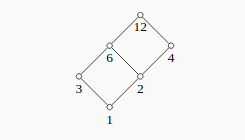
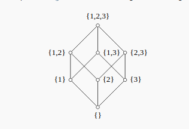
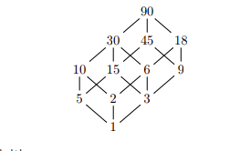

# Posets 
Definition: A *poset*  (partially-ordered set) is a pair $(S, \preceq)$ where $\preceq$ is a relation on $S$ that is

- Transitive:
$$
\forall a,b,c \in S,\quad a \preceq b \text{ and } b \preceq c \implies a \preceq c
$$
- Reflexive:
$$
\forall a\in S,\quad a \preceq a
$$
- Anti-symmetric
$$
\forall a,b\in S,\quad a \preceq b \text{ and } b \preceq a \implies a = b
$$

> Notice that this behaves very much like $(\ZZ, \leq)$, so we'll often used $\leq$ to denote the relation. However, there is an important distinction -- there may be incomparable elements, i.e. pairs $a,b \in S$ such that neither $a\leq b$ or $b\leq a$ holds. This is why the order is "partial". Also note that it makes sense in this setting to write things like $a< b$, which just means $a\leq b$ and $a\neq b$.

> If every two elements are comparable, $\preceq$ is called *total order* and $(S, \preceq)$ is called a *chain*. Weakening this condition slightly, if for every two elements $x,y\in S$ there exists some $s\in S$ such that $s\leq x$ and $s \leq y$, we say $S$ is a *directed* poset.

Examples:

- $(\ZZ, \leq)$ is a chain.
- $(\NN, \mid)$ where $a\mid b \iff a\text{ divides } b$ is a poset.
- $(\mathcal{P}([n]), \subseteq)$ (denoting the powerset) is a poset.
- $(\theset{\text{Set partitions of $[n]$}}, \preceq)$ where $a \preceq b \iff$ every block of $a$ is contained in some block of $b$ is a poset.
  - Note that this says that $b$ can be obtained by merging some blocks of $a$.

An *open section* of a poset is defined as $$S_\alpha = \theset{s \in S \suchthat s < \alpha}.$$ A *closed section* is defined as $$\overline{S_\alpha} = \theset{s \in S \suchthat s \leq \alpha}.$$ The *complement* of a section is given by 
$$
S_x^c = \theset{s\in S \suchthat s \geq a} \\
\overline{S_x}^c = \theset{s\in S \suchthat s > a}
$$

We can define the notions of an *open interval from $\alpha$ to $\beta$*, *closed interval*, and *half-open intervals* respectively:
$$
\begin{aligned}
(\alpha, \beta) &\definedas \theset{s\in S \suchthat \alpha < s < \beta}\\
[\alpha, \beta] &\definedas \theset{s\in S \suchthat \alpha \leq s \leq \beta}\\
(\alpha, \beta] &\definedas \theset{s\in S \suchthat \alpha < s \leq \beta}\\
[\alpha, \beta) &\definedas \theset{s\in S \suchthat \alpha \leq s < \beta}.
\end{aligned}
$$

Definition: we say that $y$ *covers* $x$ if
$$
x \in S_y \text{ (so $x < y$) and } (x,y) = \emptyset.
$$
In other words, this says that $y$ is a *least upper bound* for $x$.

Definition: If $S_x = \emptyset$, $x$ is said to be a *minimal* element. Similarly, if $\overline{S_y} = S$, $y$ is said to be a *maximal* element.

> In a subtle distinction, if $x \in S_s$ for every $s\in S$, then $x$ is unique and is said to be the *minimum element* and denoted $\mathbf 0$. Similarly, if $S_y = S-\theset{y}$, then $y$ is said to be a (not necessarily unique) *maximal* element and is denoted $\mathbf 1$. 

Definition: A *Hasse diagram* for a poset $(S, \leq)$ is an graph obtained by letting the verticies of $G$ be the elements of $S$, connecting a directed edge from $x\to y$ iff $y$ covers $x$, arranging this graph so all arrows point upwards and incomparable elements are lined up horizontally.

> These are generally written without vertex labels or edge directions, yielding an undirected graph on $\# S$ vertices.

Examples:

- $(D(12), \mid)$: the divisors of 12 ordered by divisibility

  

- $(\mathcal{P}([n]), \subseteq)$: Subsets of $[3]$ ordered by inclusion.

  

Definition: A subset of a poset $U \subseteq S$ is called an *upper set* if it "absorbs" everything above it with respect to the partial order, i.e.
$$
u\in U \implies \forall s\in S, \quad s \geq u \implies s \in U,
$$

or in other words, $\overline{S_u^c} \subseteq U$

and similarly, $L$ is called a *lower set* if it absorbs everything below it:
$$
l \in L \implies \forall s\in S, \quad s \leq u \implies s \in U
$$
so $\overline{S_u} \subseteq L$ 

Definition: A subset $L \subseteq S$ is an *order ideal* if it is a non-empty directed lower set.

Given any poset, we can define the *incidence algebra*
$$
\Af(P) = \theset{f: P \cross P \to \RR \suchthat f(x,y) = 0 \iff x \not\leq y },
$$
which are all of the functions on pairs of elements in the poset that take some values on comparable elements and are just zero otherwise. Some examples:

- The indicator/"dirac delta" function: $\delta(x,y) = \indic{x=y}$
- The zeta function: $\zeta(x,y) = \indic{x \leq y}$

This is an *algebra* because it is a vector space over $\RR$, and has a bilinear product:
$$
(f \ast g)(x, y) = \sum_{t\in[x,y]}f(x,t) g(t, y)
$$

Under this product, 

- $f\ast 0 = 0$
- $f\ast\delta = f$
- $f\ast \zeta = \displaystyle\sum_{t\in[x,y]}f(x,t)$

Moreover, if $f(x,x) \neq 0$, then $f^{-1}$ exists such that $f\ast f^{-1} = \delta$, so we can define $\mu = \zeta\inv$, which can be shown has the formula
$$
\mu(x,y) = (-1)\sum_{ t \in [x,y)}\zeta(x, t)
$$
One thus computes this function inductively up a Hasse diagram.

## Example Calculation

- Level 1
  - $\mu(1,1) = 1$ (by definition)
- Level 2
  - $[1, 5) = \theset{1} \implies \mu(1,5) = -(\mu(1,1)) = -1$
  - $[1, 2) = \theset{1} \implies \mu(1,2) = -(\mu(1,1)) = -1$
  - $[1, 3) = \theset{1} \implies \mu(1,3) = -(\mu(1,1)) = -1$
- Level 3
  - $[1, 10)  = \theset{1,5,2} \implies \mu(1,10) = -(\mu(1,1)+\mu(1,5)+\mu(1,2))= -(1-1-1) = 1$
  - $[1, 15)  = \theset{1,5,3} \implies \mu(1,15) = -(\mu(1,1)+\mu(1,5)+\mu(1,3))= -(1-1-1) = 1$
  - $[1, 6)   = \theset{1,2,3} \implies \mu(1,16) = -(\mu(1,1)+\mu(1,2)+\mu(1,3))= -(1-1-1) = 1$
  - $[1, 9)   = \theset{1,3}   \implies \mu(1,19) = -(\mu(1,1)+\mu(1,3)) = -(1-1) = 0$
- Level 4
  - $[1,30) = \theset{10,15,6,5,2,3,1} \implies \mu(1,30) = -(1+1+1-1-1-1+1) = -1$
  - $[1,45) = \theset{15,9,5,3,1}      \implies \mu(1,45) = -(1+0-1-1+1) = 0$
  - $[1,18) = \theset{6,9,2,3,1}       \implies \mu(1,18) = -(1+0-1-1+1) = 0$
- Level 5
  - $[1, 90) = S - \theset{90} \implies \mu(1,90) = -(0+0-1+0+1+1+1-1-1-1+1) = 0$

Note that from this, we find that for the divisibility poset,
$$
\mu(a, b) = \begin{cases}
  (-1)^k & \frac b a \text{ is a product of k distinct primes} \\
  0 & \text{otherwise}
\end{cases}
$$

In general, there is a Mobius inversion formula:
$$
g ( x ) = \sum _ { x y \leq \pi } f ( y ) \quad \forall x \in P \quad \Longleftrightarrow \quad f ( x ) = \sum _ { x y \leq \pi } \mu ( y , x ) g ( y ) \quad \forall x \in P
$$

which says that if we know that $g$ on every element and we also know that it's some linear combination of values of $f$ (where we don't necessarily know what any single $f(x)$ is), we can actually solve for a single $f(x)$ and write it as a (weighted) linear combination of values of $g$. 

If we write the incidence matrix of the poset as $A$, this equivalently says 
$$
g(\vector x) = A f(\vector x) \implies f(\vector x) = A^{-1}g(\vector x) = Mg(\vector x)
$$

where $M = [\mu(x_i, x_j)]$ is the "Gram matrix" of values of the Mobius function.
