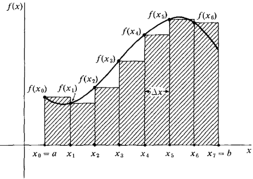
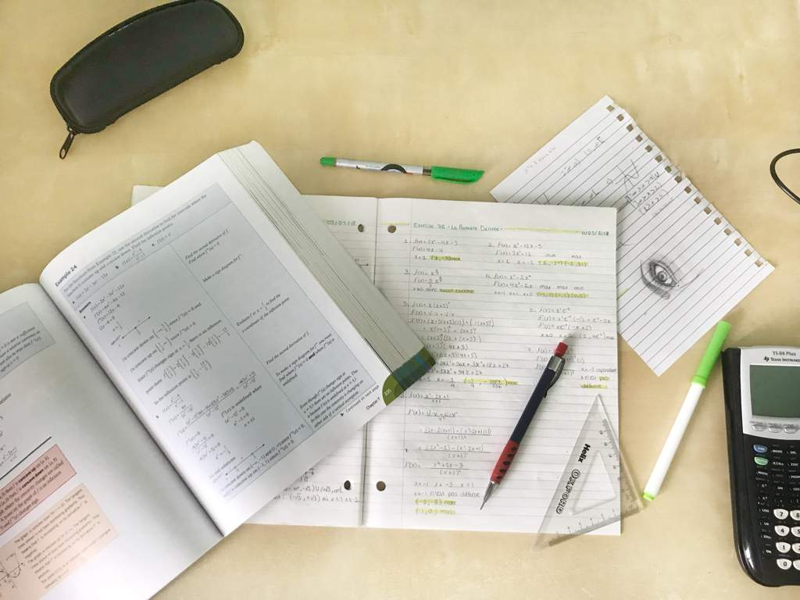
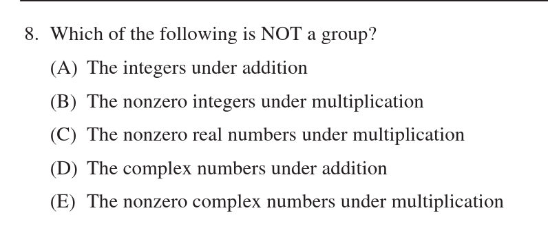
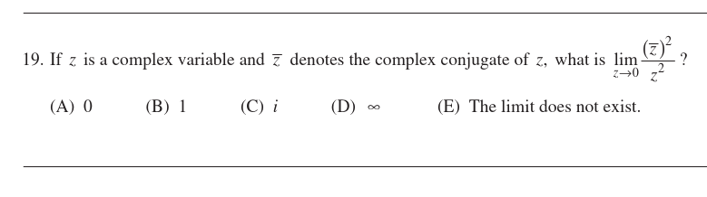
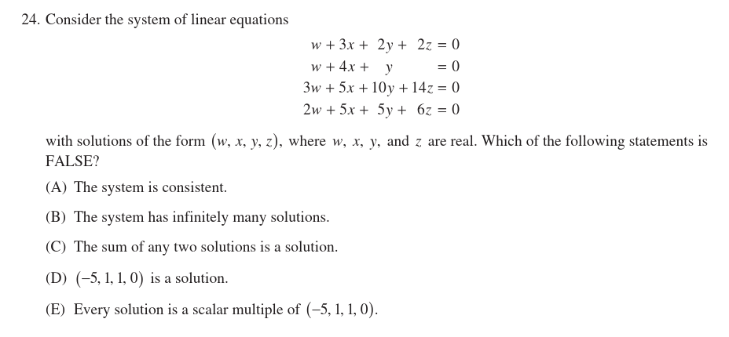
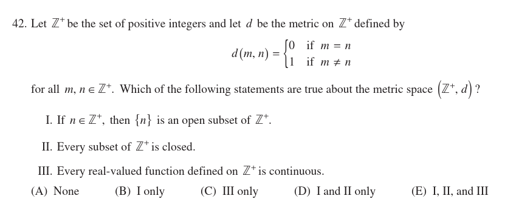

---
presentation:
  margin: 0.0
  theme: serif.css
  width: 1200
  height: 1000
---

<!-- slide -->

# Mathematics Subject GRE Workshop

<!-- slide -->
# Agenda
- Description of Mathematics Subject GRE
- Topics it covers
- Exam logistics
- Recommended resources
- Study techniques/tips
- Review of topics + sample problems

<!-- slide -->

## What is the Mathematics Subject GRE?

- Different from the Math section of the *General* GRE
- Required of graduate student applicants to many Math Ph.D. programs
- Tests a breadth of undergraduate topics

<!-- slide -->
# Topics

- Calculus (50%)
  - Single Variable
  - Multivariable
  - Differential Equations



<!-- slide vertical=true-->
## "Algebra" (25%)
- Linear Algebra
- Abstract Algebra 
- Number Theory


<!-- slide vertical=true-->
## Mixed Topics (25%)
- Real Analysis
- Logic / Set Theory
- Discrete Mathematics
- Point-Set Topology
- Complex Analysis
- Combinatorics
- Probability


<!-- slide -->
# Logistics

- Multiple choice, 5 choices
- 66 questions, 170 minutes
- No downside to guessing
- Only offered 3x/year 
- Need to register ~2 months in advance

<!-- slide -->
# References

<!-- slide vertical=true-->
*Garrity,* [All the Mathematics You Missed (But Need to Know for Graduate School)](https://www.amazon.com/All-Mathematics-You-Missed-Graduate/dp/0521797071)


Good high-level overview of undergrad topics.

<!-- slide vertical=true-->
*The Princeton Review,* [Cracking the Math GRE Subject Test](https://www.amazon.com/Cracking-GRE-Mathematics-Subject-Test/dp/0375429727)


"Calculus: The Greatest Hits", good breadth. 

Shallow treatment of Algebra, Real Analysis, Topology, Number Theory.

<!-- slide vertical=true-->
Five Official Practice Exams (with Solutions)
- GR 1268
- GR 0568
- GR 9367
- GR 8767
- GR 9768

All old and *significantly* easier than exams in recent years.

Aim for 90th percentile in $< 2$ hours.

<!-- slide -->
# General Tips



<!-- slide vertical=true -->
## Math-Specific Tips
- Focus on lower div
- For Calculus, focus on speed: median $\leq 1$ minute
- Drill *a lot* of problems
  - Seriously, a lot.
  - *Seriously.*
- Should memorize formulas and definitions
  - No time to rederive!
- Save actual exams as diagnostic tools

<!-- slide vertical=true -->
## Study Tips
- Start early
  - Steady practice paced over 3-9 months is 100x more effective than 1 month of cramming
- Speed is important
- Spaced repetition, e.g. Anki
- Replicate exam conditions
- Build mental stamina
  - i.e. 2-3 hours of uninterrupted problem solving
- Self care!!
  - Sleep
  - Eat right

<!-- slide -->
# Single Variable Calculus

<!-- slide vertical=true -->
## Differential
- Computing limits
- Showing continuity
- Computing derivatives
- Rolle's Theorem
- Mean Value Theorem
- Extreme Value Theorem
- Implicit Differentiation
- Related Rates
- Optimization
- Computing Taylor expansions
- Computing linear approximations

<!-- slide vertical=true -->
## Integral
- Riemann sum definition of the integral
- The fundamental theorem of Calculus (both forms)
- Computing antiderivatives
  - $u\dash$substitutions
  - Partial fraction decomposition
  - Trigonometric Substitution
  - Integration by parts
  - Specific integrands
- Computing definite integrals
- Solids of revolution
- Series (see real analysis section)

<!-- slide vertical=true -->
## Computing Limits
- Tools for finding $\lim_{x\to a} f(x)$, in order of difficulty:
	- Plug in: equal to $f(a)$ if $f \in C^0(N_\varepsilon(a))$
	- Algebraic Manipulation
	- L'Hopital's Rule (only for indeterminate forms $\frac 0 0, \frac \infty \infty$)
		- For $\lim f(x)^{g(x)} = 1^\infty, \infty^0, 0^0$, let $L = \lim f^g \implies \ln L = \lim g \ln f$
	- Squeeze theorem
	- Take Taylor expansion at $a$
	- Monotonic + bounded (for sequences)
  
<!-- slide vertical=true -->
## Use Simple Techniques
When possible, of course.

$$
\frac{a}{b+\sqrt{c}} = \frac{a}{b+\sqrt{c}} \left( \frac {b-\sqrt c} {b-\sqrt c} \right) = \frac {a(b-\sqrt c)} {b^2 - c} \\
\frac{1}{ax^2 + bx + c} = \frac{1}{(x-r_1)(x-r_2)} = \frac{A}{x-r_1} + \frac{B}{x-r_2}
$$

<!-- slide vertical=true -->
## The Fundamental Theorems of Calculus
$$\begin{align*}
\frac{d}{dx} \int_a^x f(t)~dt &= f(x) \\ \\
\int_a^b \dd{}{x} f(x)~dx &= f(b) - f(a) \\
\end{align*}$$

First form is usually skimmed over, but very important!

<!-- slide vertical=true -->
## FTC Alternative Forms
$$
\frac{\partial}{\partial x} \int_{a(x)}^{b(x)} g(t) dt = g(b(x))b'(x) - g(a(x))a'(x)
$$

<!-- slide vertical=true -->
## Commuting $D$ and $I$
Commuting a derivative with an integral
$$
\frac{d}{dx} \int_{a(x)}^{b(x)} f(x,t) dt = \int_{a(x)}^{b(x)} \frac{\partial}{\partial x} f(x, t) dt \\ + f(x, b(x))\frac{d}{dx}b(x) - f(x, a(x))\frac{d}{dx}a(x)
$$

*(Derived from chain rule)*

<div style="height:50px;"></div>
Set 
$$
a(x) = a, b(x) = b, f(x,t) = f(t) \implies \dd{}{x} f(t) = 0,
$$ 
then commute to derive the FTC.

<!-- slide vertical=true -->
## Applications of Integrals
- Solids of Revolution
	- Disks: $A = \int \pi r(t)^2 ~dt$
	- Cylinders: $A = \int 2\pi r(t)h(t) ~dt$
- Arc Lengths
	- $ds = \sqrt{dx^2 + dy^2},\qquad L = \int ~ds$

<!-- slide vertical=true -->
## Series
There are 6 major tests at our disposal:
- **Comparison Test**
  - $a_n < b_n \and \sum b_n < \infty \implies \sum a_n < \infty$
  - $b_n < a_n \and \sum b_n = \infty \implies \sum a_n = \infty$
  - You should know some examples of series that converge and diverge to compare to.
- **Ratio Test**
$$
R =\lim_{n\to\infty} \abs{\frac{a_{n+1}}{a_n}}
$$
  - $R < 1$: absolutely convergent
  - $R > 1$: divergent
  - $R = 1$: inconclusive

<!-- slide vertical=true -->
## More Series
- **Root Test**
$$
R = \limsup_{n \to \infty} \sqrt[n]{\abs{a_n}}
$$
  - $R < 1$: convergent
  - $R > 1$: divergent
  - $R = 1$: inconclusive
- **Integral Test**
$$
f(n) = a_n \implies \sum a_n < \infty \iff \int_1^\infty f(x) dx < \infty
$$

<!-- slide vertical=true -->
## More Series
- **Limit Test**
$$
\lim_{n\to\infty}\frac{a_n}{b_n} = L < \infty \implies \sum a_n < \infty \iff \sum b_n < \infty
$$
- **Alternating Series Test**
$$
a_n \downarrow 0 \implies \sum (-1)^n a_n < \infty
$$

<!-- slide vertical=true -->
## Advanced Series
- **Cauchy Criteria**:
    - Let $s_k = \sum_{i=1}^k a_i$ be the $k\dash$th partial sum, then
	$$
	\sum a_i \text{ converges } \iff \theset{s_k} \text{ is a Cauchy sequence},
	$$
- **Weierstrass $M$ Test**:
	 $$ 
	 \sum_{n=1}^\infty \abs{\norm{f_n}_\infty} < \infty 
	 \implies \\ \exists f\in C^0 \suchthat \sum_{n=1}^\infty f_n \rightrightarrows f
	 $$
	- i.e. define $M_k = \sup\theset{f_k(x)}$ and require that $\sum \abs{M_k} < \infty$
	- "Absolute convergence in the sup norms implies uniform convergence"


<!-- slide -->
# Multivariable Calculus

<!-- slide vertical=true -->
## General Concepts
- Vectors, div, grad, curl
- Equations of lines, planes, parameterized curves
  - And finding intersections
- Multivariable Taylor series
  - Computing linear approximations
- Multivariable optimization
  - Lagrange Multipliers
- Arc lengths of curves
- Line/surface/flux integrals
- Green's Theorem
- The divergence theorem
- Stoke's Theorem

<!-- slide vertical=true -->
## Geometry in $\RR^3$
Lines
$$
Ax + By + C = 0,~
\vector x = \vector p + t\vector v,\\
\vector x \in L \iff \inner{\vector x-\vector p}{\vector n} = 0
$$

Planes
$$
A x + B y + C z + D = 0,~
\vector x(t,s) = \vector p + t\vector v_1 + s\vector v_2 \\
\vector x \in P \iff \inner{\vector x - \vector p}{\vector n} = 0
$$

Distances to lines/planes: project onto orthogonal complement.

<!-- slide vertical=true -->
## Tangent Planes/Linear Approximations
Let $S \subseteq \RR^3$ be a surface. Generally need a point $\vector{p} \in S$ and a normal $\vector{n}$. 

**Key Insight: The gradient of a function is normal to its level sets.**

$$
\text{Case 1: } S = \theset{[x,y,z] \in \RR^3 \mid f(x,y, z) = 0}
$$ 
i.e. it is the zero set of some function $f:\RR^3 \to \RR$
  - $\nabla f$ is a vector that is normal to the zero level set.
- So just  write the equation for a tangent plane $\inner{\vector n}{\vector x - \vector p_0}$.

<!-- slide vertical=true -->
## Tangent Planes/Linear Approximations

$$
\text{Case 2: } S \text{ is given by } z = g(x,y)
$$
- Let $f(x, y, z) = g(x,y) - z$, then 
    $$
    \vector p \in S \iff \vector p \in \theset{[x,y,z] \in \RR^3 \mid f(x,y, z) = 0}.\\
    $$

- Then $\nabla f$ is normal to level sets, compute $\nabla f = [\dd{}{x}g, \dd{}{y}g, -1]$
- Proceed as in previous case.


<!-- slide vertical=true -->
## Optimization
**Single variable:** solve $\dd{}{x} f(x) = 0$ to find critical points $c_i$ then check min/max by computing $\dd{^2}{x^2}f(c_i)$.

**Multivariable:** solve $\nabla f(\vector x) = 0$ for critical points $\vector c_i$, then check min/max by computing the determinant of the Hessian:
$$
H_f({ \mathbf { a } }) = \left[ \begin{array} { c c c } { \frac { \partial ^ { 2 } f } { \partial x _ { 1 } \partial x _ { 1 } } ( \mathbf { a } ) } & { \dots } & { \frac { \partial ^ { 2 } f } { \partial x _ { 1 } \partial x _ { n } } ( \mathbf { a } ) } \\ { \vdots } & { \ddots } & { \vdots } \\ { \frac { \partial ^ { 2 } f } { \partial x _ { n } \partial x _ { 1 } } ( \mathbf { a } ) } & { \cdots } & { \frac { \partial ^ { 2 } f } { \partial x _ { n } \partial x _ { n } } ( \mathbf { a } ) } \end{array} \right].
$$

<!-- slide vertical=true -->
## Optimization
**Lagrange Multipliers:**
$$ 
\text{Optimize } f(\mathbf x) \text{ subject to } g(\mathbf x) = c \\ \implies \nabla \vector f = \lambda \nabla \vector g
$$
- Generally a system of nonlinear equations
  - But there are a few common tricks to help solve.

<!-- slide vertical=true -->
## Multivariable Chain Rule
```latex {cmd=true, hide=true, run_on_save=true}
\documentclass{standalone}
\usepackage{tikz}
\usepackage{dsfont}
\usepackage{amsmath, amsthm, amssymb}
\usetikzlibrary{cd}
\usepackage{adjustbox}
\begin{document}
\adjustbox{scale=6}{%
  \begin{tikzcd}
  & u \arrow[dd] \arrow[rr] \arrow[rrdd] &  & x \\
  z \arrow[rd] \arrow[ru] \arrow[rrru] \arrow[rrrd] &  &  &  \\
  & v \arrow[rr] \arrow[rruu] &  & y
\end{tikzcd}
}
\end{document}
```

<!-- slide vertical=true -->
## Multivariable Chain Rule
To get any one derivative, sum over all possible paths to it:
$$\begin{align*}
\left(\dd{z}{x}\right)_y &= \left(\dd{z}{x}\right)_{u,y,v} \\
& + \left(\dd{z}{v}\right)_{x,y,u} \left(\dd{v}{x}\right)_y \\
& + \left(\dd{z}{u}\right)_{x,y,v} \left(\dd{u}{x}\right)_{v,y}  \\
& + \left(\dd{z}{u}\right)_{x,y,v} \left(\dd{u}{v}\right)_{x,y} \left(\dd{v}{x}\right)_y
\end{align*}$$

*Subscripts denote variables held constant while differentiating.*

<!-- slide vertical=true -->
## Linear Approximation
Just use Taylor expansions.

### Single variable case:
$$
f(x) = f(p) + f'(p)(x-p) \\+ f''(p)(x-a)^2 + O(x^3)
$$

<div style="height:100px"></div>

### Multivariable case:
$$
f(\vector x) =  f(\vector p) + \nabla f(\vector p)(\vector x - \vector a) \\+ (\vector x - \vector p )^T H_f(p)(\vector x - \vector p) + O(\norm{\vector x - \vector p}_2^3)
$$

<!-- slide -->
# Linear Algebra

<!-- slide vertical=true -->
## Big Theorems
- Rank Nullity:
$$
\abs{\ker(A)} + \abs{\im(A)} = \abs{\mathrm{domain}(A)}
$$

- Fundamental Subspace Theorems
$$
\im(A) \perp \ker(A^T), \qquad \ker(A) \perp \im (A^T)
$$

- Compute
  - Determinant, trace, inverse, subspaces, eigenvalues, etc
  - Know properties too!
- Definitions
  - Vector space, subspace, singular, consistent system, etc

<!-- slide vertical=true -->
## Fundamental Spaces
- Finding bases for various spaces of $A$:
  - $\mathrm{rowspace} A/ \im A^T \subseteq \RR^n$
  	- Reduce to RREF, and take nonzero rows of $\mathrm{RREF}(A)$.
  
  - $\mathrm{colspace} A / \im A \subseteq \RR^m$:
    - Reduce to RREF, and take columns with pivots from original $A$.

<!-- slide vertical=true -->
## Fundamental Spaces
  - $\mathrm{nullspace}(A) / \ker A$: 
    - Reduce to RREF, zero rows are free variables, convert back to equations and pull free variables out as scalar multipliers.

  - Eigenspace: 
    - Recall the equation: 
    $$
    \lambda \in \spec(A) \iff \exists \vector v_\lambda \suchthat A\vector v_\lambda  = \lambda \vector v_\lambda
    $$
    - For each $\lambda \in \spec(A)$, compute $\ker (\lambda I - A)$

<!-- slide vertical=true -->
## Big List of Equivalent Properties
Let $A$ be an $n\times n$ matrix representing a linear map $L: V \to W$ 

TFAE:
- $A$ is invertible and has a unique inverse $A^{-1}$
- $A^T$ is invertible
- $\det(A) \neq 0$
- The linear system $A\vector{x} = \vector{b}$ has a unique solution for every $b\ \in \RR^m$
- The homogeneous system $A\vector{x} = 0$ has only the trivial solution $\vector{x} = 0$
- $\rank(A) = \dim(W) = n$ 
  - i.e. $A$ is full rank
- $\mathrm{nullity}(A) \definedas \dim(\mathrm{nullspace}(A)) = \dim(\ker L)  = 0$

<!-- slide vertical=true -->
## Big List of Equivalent Properties
- $A = \prod_{i=1}^k E_i$ for some finite $k$, where each $E_i$ is an elementary matrix.
- $A$ is row-equivalent to the identity matrix $I_n$
- $A$ has exactly $n$ pivots
- The columns of $A$ are a basis for $W \cong \RR^n$
	- i.e. $\mathrm{colspace}(A) = \RR^n$
- The rows of $A$ are a basis for $V \cong \RR^n$
	- i.e. $\mathrm{rowspace}~(A) = \RR^n$
- $\left(\mathrm{colspace}~(A)\right)^\perp = \left(\mathrm{rowspace}~(A^T)\right)^\perp = \theset{\vector 0}$
- Zero is not an eigenvalue of $A$.
- $A$ has $n$ linearly independent eigenvectors

<!-- slide vertical=true -->
## Various Other Topics
- Quadratic forms
- Projection operators
- Least Squares
- Diagonalizability, similarity
- Canonical forms
- Decompositions ($QR, VDV^{-1}, SVD,$ etc)


<!-- slide -->
# Ordinary Differential Equations

<!-- slide vertical=true -->
## Easy IVPs 
- Should be able to immediately write solutions to any initial value problem of the form 
$$
\sum_{i=0}^n \alpha_i y^{(i)}(x) = f(x)
$$
  - Just write the characteristic polynomial.

<!-- slide vertical=true -->
## Easy IVPs 
- Example: A second order homogeneous equation 
$$
ay'' + by' + cy = 0 \mapsto ax^2 + bx + c = 0
$$
  - Two distinct roots: $$y(x) = c_1 e^{r_1 x} + c_2 e^{r_2 x}$$
  - One real root: $$y(x) = c_1 e^{rx} + c_2 x e^{rx}$$
  - Complex conjugates $\alpha \pm \beta i$: $$y(x) = e^{\alpha x}(c_1 \cos \beta x + c_2 \sin \beta x)$$

<!-- slide vertical=true -->
## More Easy IVPs

- The Logistic Equation
$$
\frac{dP}{dt} = r\left( 1 - \frac{P}{C} \right)P \implies P(t) = \frac{P_0}{\frac{P_0}{C} + e^{-rt}(1 - \frac{P_0}{C})}
$$

- Separable
$$\frac{dy}{dx} = f(x)g(y) \implies \int \frac{1}{g(y)}dy = \int f(x) dx + C$$

<!-- slide vertical=true -->
## More Easy IVPs

- Systems of ODEs
$$
\vector{x}'(t) = A\vector{x}(t) + \vector{b}(t) 
\implies \vector{x}(t) = \sum_{i=1}^n c_i e^{\lambda_i t}~\vector{v}_i
$$
for each eigenvalue/eigenvector pair $(\lambda_i, \vector v_i)$.

<!-- slide vertical=true -->
## Less Common Topics
- Integrating factors
- Change of Variables
- Inhomogeneous ODEs (need a *particular solution*)
  - Variation of parameters
  - Annihilators
  - Undetermined coefficients
  - Reduction of Order
  - Laplace Transforms
  - Series solutions
- Special ODEs
  - Exact
  - Bernoulli
  - Cauchy-Euler


<!-- slide -->
# Topics: Number Theory

<!-- slide vertical=true -->
## Definitions
-  The fundamental theorem of arithmetic: 
$$
n\in\mathbb Z \implies n = \prod_{i=1}^n p_i^{k_i}, \quad p_i \text{ prime}
$$

- Divisibility and modular congruence:
$$
x\mid y \iff y = 0 \mod x \iff \exists c \suchthat y = xc 
$$

- Useful fact:
$$
x = 0 \mod n \iff x = 0 \mod p_i^{k_i} ~\forall i
$$
*(Follows from the Chinese remainder theorem since all of the $p_i^{k_i}$ are coprime)*

<!-- slide vertical=true -->
## Definitions
- GCD, LCM
$$ xy = \gcd{(x,y)}~\mathrm{lcm}{(x,y)} \\
d\mid x \and d\mid y \implies  d \mid \gcd(x,y) \\
\quad \and \gcd(x,y) = d\gcd(\frac x d, \frac y d)
$$
  - Also works for $\mathrm{lcm}(x,y)$
  - Computing $\gcd(x,y)$: 
    - Take prime factorization of $x$ and $y$,
    - Take only the distinct primes they have in common, 
    - Take the minimum exponent appearing

<!-- slide vertical=true -->
## The Euclidean Algorithm
Computes GCD, can also be used to find modular inverses:
$$
\begin{aligned} a & = q _ { 0 } b + r _ { 0 } \\ b & = q _ { 1 } r _ { 0 } + r _ { 1 } \\ r _ { 0 } & = q _ { 2 } r _ { 1 } + r _ { 2 } \\ r _ { 1 } & = q _ { 3 } r _ { 2 } + r _ { 3 } \\ & \vdots \\r_k &= q_{k+2}r_{k+1} + \mathbf{r_{k+2}} \\ r_{k+1} &= q_{k+3}r_{k+2} + 0
\end{aligned}
$$

Back-substitute to write $ax+by = \mathbf{r_{k+2}} = \gcd(a,b)$.

(Also works for polynomials!)

<!-- slide vertical=true -->
## Definitions
- Coprime
$$
a\text{ is coprime to } b \iff \gcd(a,b) = 1 
$$

- Euler's Totient Funtion
$$
\phi(a) = \abs{\theset{x \in \NN \suchthat x \leq a \and \gcd(x,a) = 1}}
$$
  - Computing $\phi$:
$$
\gcd(a,b) = 1 \implies \phi(ab) = \phi(a)\phi(b) \\
\phi(p^k) = p^k - p^{k-1}
$$
  - Just take the prime factorization and apply these.

<!-- slide vertical=true -->
## Definitions
Know some group and ring theoretic properties of $\ZZ/n\ZZ$
- $\ZZ/n\ZZ$ is a field $\iff n$ is prime.
  - So we can solve equations with inverses: $ax = b \mod n \iff x = a^{-1}b \mod n$
- But there will always be *some* units; in general,
$$
\abs{(\ZZ/n\ZZ)^{\times}} = \phi(n)
$$
  and is cyclic when $n=1,2,4,p^k, 2p^k$


<!-- slide vertical=true -->
## Chinese Remainder Theorem

The system
$$
\begin{array} { c } { x \equiv a _ { 1 } \quad \left( \bmod m _ { 1 } \right) } \\ { x \equiv a _ { 2 } \quad \left( \bmod m _ { 2 } \right) } \\ { \vdots } \\ { x \equiv a _ { r } \quad \left( \bmod m _ { r } \right) } \end{array}
$$
has a unique solution $x \mod \prod m_i$ iff $\gcd(m_i, m_j) = 1$ for each pair $i,j$.

<!-- slide vertical=true -->
## Chinese Remainder Theorem

The solution is given by
$$
x = \sum_{j=1}^r a_j \frac{\prod_i m_i}{m_j} \left( \left[ \frac{\prod_i m_i}{m_j} \right]^{-1}_{\mod m_j}\right)
$$

Seems symbolically complex, but actually an easy algorithm to carry out by hand.

<!-- slide vertical=true -->
## Chinese Remainder Theorem

Ring-theoretic interpretation: let $N = \prod n_i$, then
$$
\gcd(i,j) = 1 ~~\forall (i,j)  \implies \ZZ_N \cong \bigoplus \ZZ_{n_i}
$$

<!-- slide vertical=true -->
## Theorems
- Fermat's Little Theorem and Euler's Theorem
$$
a^p = a \mod p \\
p \not\mid a \implies a^{p-1} = 1 \mod p \\
\text{and in general, } \\ a^{\phi(p)} = 1 \mod p 
$$

- Wilson's Theorem
$$
n \text{ is prime } \iff (n-1)! = -1 \mod n
$$

<!-- slide vertical=true -->
## Advanced Topics
- Mobius Inversion
- Quadratic residues
- The Legendre/Jacobi Symbols
- Quadratic Reciprocity


<!-- slide -->
# Topics: Abstract Algebra

<!-- slide vertical=true -->
## Definitions
- Group, ring, subgroup, ideal, homomorphism, etc
- Order, Center, Centralizer, orbits, stabilizers
- Common groups: $S_n, A_n, C_n, D_{2n}, \ZZ_n,$ etc

<!-- slide vertical=true -->
## Structure
- Structure of $S_n$
  - e.g. Every element is a product of disjoint cycles, and the order is the lcm of the order of the cycles.
  - Generated by (e.g.) transpositions
  - Cycle types
  - Inversions
  - Conjugacy classes
  - Sign of a permutation

- Structure of $\ZZ_n$
$$ 
\ZZ_{pq} = \ZZ_p \oplus \ZZ_q \iff (p,q) = 1
$$

<!-- slide vertical=true -->
## Basics
Group Axioms
- Closure: $a,b \in G \implies ab \in G$
- Identity: $\exists e\in G \mid a\in G \implies ae = ea = a$
- Associativity: $a,b,c \in G \implies (ab)c = a(bc)$
- Inverses: $a\in G \implies \exists b \in G \mid ab =ba = e$

One step subgroup test:
	$$
	H \leq G \iff a,b \in H \implies a b^{-1} \in H \\
	$$
  
<!-- slide vertical=true -->
## Useful Theorems

Cauchy's Theorem
- If $\abs{G} = n = \prod p_i^{k_i}$, then for each $i$ there exists a subgroup $H$ of order $p_i$.

The Sylow Theorems
- If $\abs{G} = n = \prod p_i^{k_i}$, for each $i$ and each $1 \leq k_j \leq k_i$ then there exists a subgroup $H_{i,j}$ for all orders $p_i^{k_j}$.
  - Note: partial converse to Cauchy's theorem.

<!-- slide vertical=true -->
## Classification of Abelian Groups
Suppose $\abs{G} = n = \prod_{i=1}^m p_i^{k_i}$
  $$
  G \cong \bigoplus_{i=1}^n G_i \text{ with } \abs{G_i} = p_i^{k_i} \text{ and } \\
  G_i \cong \bigoplus_{j=1}^k \ZZ_{p_i^{\alpha_j}} \text{ where } \sum_{j=1}^k \alpha_j = k_i
  $$
  $G$ decomposes into a direct sum of groups corresponding to its prime factorization. For each component, you take the corresponding prime, write an integer partition of its exponent, and each unique partition yields a unique group.

<!-- slide vertical=true -->
# Ring Theory
- Definition: $(R, +, \times)$ where $(R, +)$ is abelian and $(R, times)$ is a monoid.

- Ideals: $(I, +) \leq (R, +)$ and $r\in R, x\in I \implies rx \in I$

- Noetherian: $I_1 \subseteq I_2 \subseteq \cdots \implies \exists N \suchthat I_N = I_{N+1} = \cdots$

  - (Ascending chain condition)

- Differences between prime and irreducible elements
  - Prime: $p \mid ab \implies \mid a \or p \mid b$
  - Irreducible: $x \text{ irreducible } \iff \not\exists a,b\in R^\times \suchthat p = ab$.
- Various types of rings and their relations:
<div style="height:20px"></div>
$$ 
\text{field} \implies \text{Euclidean Domain} \implies \text{PID} \\ \implies \text{UFD} \implies \text{integral domain}
$$


<!-- slide -->
# Topics: Real Analysis
<!-- slide vertical=true -->
- Properties of Metric Spaces
- The Cauchy-Schwarz Inequality
- Definitions of Sequences and Series
- Testing Convergence of sequences and series
- Cauchy sequences and completeness
- Commuting limiting operations:
	- $[\frac{\partial}{\partial x}, \int dx]$
- Uniform and point-wise continuity
- Lipschitz Continuity

<!-- slide vertical=true -->
## Big Theorems
- **Completeness**: Every Cauchy sequence in $\RR^n$ converges.
- **Generalized Mean Value Theorem**
$$
f,g\text{ differentiable on } [a,b] \implies \\ \exists c\in[a,b] :
\left[f ( b ) - f ( a ) \right] g' ( c ) = \left[g ( b ) - g ( a )\right] f' ( c )
$$
  - Take $g(x) = x$ to recover the usual MVT
- **Bolzano-Weierstrass**: every bounded sequence in $\RR^n$ has a convergent subsequence.
- **Heine-Borel**: in $\RR^n, X$ is compact $\iff X$ is closed and bounded.

<!-- slide -->
# Topics: Point-Set Topology
<!-- slide vertical=true -->
## General Concepts
- Open/closed sets
- Connected, disconnected, totally disconnected, etc
- Mostly topics related to metric spaces

<!-- slide vertical=true -->
## Useful Facts
- Topologies are closed under
  - Arbitrary unions: $$U_j \in \mathcal{T} \implies \union_{j\in J} U_i \in \mathcal{T}$$
  - Finite intersections: $$U_i \in \mathcal{T} \implies \intersect_{i=1}^n U_i \in \mathcal{T}$$
- In $\RR^n$, singletons are closed, and thus so are finite sets of points
  - Useful for constructing counterexamples to statements

<!-- slide -->
# Topics: Complex Analysis
<!-- slide vertical=true -->
# General Concepts
- $n\dash$th roots:
$$e^{\frac{ki}{2\pi n}}, \qquad k = 1, 2, \cdots n-1$$
- The Residue theorem:
$$
\oint_C f(z)~dz = 2\pi i \sum_k \mathrm{Res}(f, z_k)
$$
  - Exams often include one complex integral
  - Need a number of other theorems for actually computing residues
  
<!-- slide -->
# Topics: Discrete Mathematics + Combinatorics
<!-- slide vertical=true -->
## General Concepts
- Graphs, trees
- Recurrence relations
- Counting problems
  - e.g. number of nonisomorphic structures
- Inclusion-exclusion, etc

$$(x+y)^n = \sum_{k=0}^n {n\choose k}x^ky^{n-k}$$


<!-- slide -->
# Example Problems

<!-- slide -->
# Example Problem 1


<!-- slide vertical=true-->
# Example Problem 1

C, because $\ZZ-\theset{0}$ lacks inverses 
(Would need to extend to $\QQ$)

<!-- slide -->
# Example Problem 2


<!-- slide vertical=true-->
# Example Problem 2

$$
L = \lim _ { ( a , b ) \rightarrow 0 } \frac { ( a - b i ) ^ { 2 } } { ( a + b i ) ^ { 2 } } = \lim _ { ( a , b ) \rightarrow 0 } \frac { a ^ { 2 } - b ^ { 2 } - 2 a b i } { a ^ { 2 } - b ^ { 2 } + 2 a b i } \\
a = 0 \implies L = 1 \\
a = b \implies L = -1
$$

So E, because the limit needs to be path-independent.

<!-- slide -->
# Example Problem 3


<!-- slide vertical=true-->
# Example Problem 3


Don't row-reduce or invert! Just one computation
$$\left(
\begin{array}{cccc}
1 & 3 & 2 & 3 \\
1 & 4 & 1 & 0 \\
3 & 5 & 10 & 14 \\
2 & 5 & 5 & 6
\end{array}\right)
\left(\begin{array}{c}-5 \\ 1 \\ 1 \\ 0\end{array}\right) = \vector 0
$$

<!-- slide vertical=true-->
# Example Problem 3
So D, A are true. C is true because it's a homogeneous system. B is true because $A\vector x = 0 \implies A (t\vector x) = tA\vector x = 0$ which means $t\vector x$ is a solution for every $t$. By process of elimination, E must be false.

<!-- slide -->
# Example Problem 4


<!-- slide vertical=true-->
# Example Problem 4


Note $N_{\frac{1}{2}}(x) = \theset{x}$, so every singleton is open. Any subset of $\ZZ$ is a countable union of its singletons, so every subset of $\ZZ$ is open. The complement any set is one such subset, so every subset is clopen. The inverse image of any subset of $\RR$  under any $f:\ZZ \to \RR$ is a subset of $\ZZ$, which is open, so every such $f$ is continuous. So E.