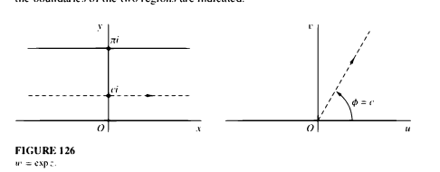
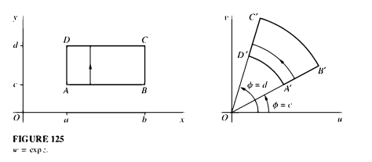
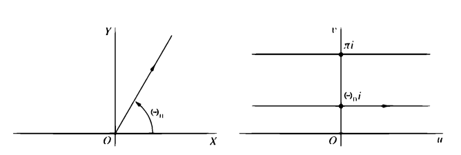
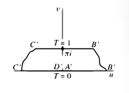
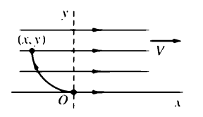

# Complex Analysis

- $\lim_{z\rightarrow z_0} f(z) = x_0 + iy_0$ iff the component functions limit to $x_0$ and $y_0$ respectively. Moreover, both ways are equal!

Notation: $z = a + ib, f(z) = u(x, y) + iv(x, y)$

## Useful Equations and Definitions
\[
\abs{z} &= \sqrt{a^2 + b^2} \\
\abs{z}^2 = z\conjugate{z} &= a^2 + b^2 \\
\frac{z\conjugate{z}}{\abs{z}^2} &= \frac{(a+ib)(a-ib)}{a^2 + b^2} = 1 \\
\frac{1}{z} &= \frac{\conjugate{z}}{\abs{z}^2} = \frac{a-ib}{a^2+b^2}
\\
e^{zx} = e^{(a+ib)x} &= e^{ax}(\cos(bx) + i\sin(bx)) \\
x^z &\definedas e^{z\ln x} \\
\mathrm{Log}(z) &= \ln\abs{z} + i~\mathrm{Arg}(z) \\
\cos z &= \frac{1}{2}(e^{iz} + e^{-iz}) \\
\sin z &= \frac{1}{2i}(e^{iz} - e^{-iz}) \\
(x-z)(x-\conjugate{z}) &= x^2 - 2\realpart{z}x + (a^2+b^2)
\\
\frac { \partial } { \partial z } &= \frac { 1 } { 2 } \left( \frac { \partial } { \partial x } - i \frac { \partial } { \partial y } \right)
\\
\frac { \partial } { \partial \overline { z } } &= \frac { 1 } { 2 } \left( \frac { \partial } { \partial x } + i \frac { \partial } { \partial y } \right)
\]

## Complex Arithmetic and Calculus

- $n\dash$th roots:
$$e^{\frac{ki}{2\pi n}}, \qquad k = 1, 2, \cdots n-1$$

### Complex Differentiability
$$
z' = \lim_{h\to 0} \frac{f(z+h)-f(z)}{h}
$$
- A complex function that is not differentiable at a point: $f(z) = z/\bar{z}$ at $z=0$

- Cauchy-Riemann Equations
$$
u_x = v_y \hspace{4em}u_y = -v_x
$$
- Alternatively:
	- $\dd[f]{\bar z} = 0$
	- $\inner{\nabla u}{\nabla v}  = 0$
	- $\Delta u = \Delta v = 0$ (both components are harmonic)

## Complex Integrals

The main theorem:
$$
\oint_C f(z)~dz = 2\pi i \sum_k \mathrm{Res}(f, z_k)
$$

Computing residues:
$$
\operatorname { Res } ( f , c ) = \frac { 1 } { ( n - 1 ) ! } \lim _ { z \rightarrow c } \frac { d ^ { n - 1 } } { d z ^ { n - 1 } } \left( ( z - c ) ^ { n } f ( z ) \right) \\
f(z) = \frac{g(z)}{h(z)} \implies \operatorname { Res } ( f , c ) = \frac{g(c)}{h'(c)}
$$

Definitions

- Analytic: differentiable everywhere
- Entire
- Holomorphic
- Meromorphic

Complex Analytic $\implies$ smooth and all derivatives are analytic

> Not true in real case, take the everywhere differentiable but not $C^1$ function
\[
f(x) = 
\begin{cases}
-\frac{1}{2}x^2 & x < 0 \\ 
\frac{1}{2}x^2 & x \geq 0
\end{cases}
\]

# Definitions

In these notes, $C$ generally denotes some closed contour, $\mathbb{H}$
is the upper half-plane, $C_R$ is a semicircle of radius $R$ in
$\mathbb{H}$, $f$ will denote a complex function.

1.  **Analytic**

    $f$ is analytic at $z_0$ if it can be expanded as a convergent power
    series in some neighborhood of $z_0$.

2.  **Holomorphic**

    A function $f$ is holomorphic at a point $z_0$ if $f'(z_0)$ exists
    in a neighborhood of $z_0$.

    (Note - this is more than just being differentiable at a single
    point!)

    *Big Theorem*: $f$ is a holomorphic complex function iff $f$ is
    analytic.

3.  **Meromorphic**

    Holomorphic, except for possibly a finite number of singularities.

4.  **Conformal**

    $f$ is conformal at $z_0$ if $f$ is analytic at $z_0$ and
    $f'(z_0) \neq 0$.

5.  **Harmonic**

    A function $u(x,y)$ is harmonic if it satisfies Laplace's equation,
    $$\Delta u = u_{xx} + u_{yy} = 0$$

Some other notions to look up:

- Conformal maps
- Analytic
- Theorem: Analytic $\implies$ conformal
- The Sterographic projection. Is it conformal?
- Branch points and branch cuts
- Loxodromic transformations
- Horocycles
- Analytic Continuation
- The complex logarithm
- Mobius transformations
- Curvature
- Angular Excess

# Preliminary Notions

What is the Complex Derivative?
-------------------------------

In small neighborhoods, the derivative of a function at a point rotates
it by an angle $\Delta\theta$ and scales it by a real number $\lambda$
according to $$\Delta\theta = \arg f'(z_0), ~\lambda = |f'(z_0)|$$

$n$th roots of a complex number
-------------------------------

The $n$th roots of $z_0$ are given by writing $z_0 = re^{i\theta}$, and
are
$$\zeta = \left\{ \sqrt[n]{r} \exp\left[{i\left( \frac{\theta}{n} + \frac{2k\pi}{n}\right)}\right] \mid k = 0,1,2,\ldots, n-1 \right\}$$

or equivalently

$$\zeta = \left\{ \sqrt[n]{r}\omega_n^k \mid k = 0,1,2,\ldots, n-1\right\}~\text{where}~\omega_n = e^{\frac{2\pi i}{n}}$$

This can be derived by looking at
$\left( re^{i\theta + 2k\pi}\right)^{\frac{1}{n}}$.

It is also useful to immediately recognize that
$z^2+a = (z-i\sqrt{a})(z+i\sqrt{a})$.

The Cauchy-Riemann Equations
----------------------------

If $f(x+iy) = u(x,y) + iv(x,y)$ or
$f(re^{i\theta}) = u(r,\theta) + iv(r,\theta)$, then $f$ is complex
differentiable if $u,v$ satisfy

$$\begin{aligned}
    u_x &= v_y &\quad u_y &= -v_x \\
    r u_r &= v_\theta &\quad u_\theta &= -r v_r\end{aligned}$$

In this case, $$f'(x+iy) = u_x(x,y) + iv_x(x,y)$$ or in polar
coordinates,
$$f'(re^{i\theta}) = e^{i\theta}(u_r(r,\theta) + iv_r(r,\theta))$$

# Integration

The Residue Theorem
-------------------

If $f$ is meromorphic inside of a closed contour $C$, then
$$\oint_C f(z) dz = 2\pi i \sum_{z_k} \underset{z=z_k}{\text{Res}} f(z)$$

where $\underset{z=z_k}{\text{Res}} f(z)$ is the coefficient of $z^{-1}$
in the Laurent expansion of $f$.

If $f$ is analytic everywhere in the interior of $C$, then
$\oint_C f(z) dz = 0$.

If $f$ is meromorphic inside of a contour $C$ and analytic everywhere
else, one can equivalently calculate the residue at infinity

$$\oint_C f(z) dz = 2\pi i \sum_{z_k} \underset{z=0}{\text{Res}} ~z^{-2}f(z^{-1})$$

Computing Residues
------------------

Simple Poles
------------------

If $z_0$ is a pole of order $m$, define $g(z) := (z-z_0)^m f(z)$.

[If $g(z)$ is analytic and $g(z_0) \neq 0$]{style="color: Blue"}, then
$$\underset{z=z_0}{\text{Res}} f(z) = \frac{\phi^{(m-1)}(z_0)}{(m-1)!}$$

In the case where $m=1$, this reduces to
$$\underset{z=z_0}{\text{Res}} f(z) = \phi(z_0)$$

To compute residues this way, attempt to write $f$ in the form

$$f(z) = \frac{\phi(z)}{(z-z_0)^m}$$

where $\phi$ only needs to be analytic at $z_0$.

Rational Functions
------------------

If $f(z) = \frac{p(z)}{q(z)}$ where

1.  $p(z_0) \neq 0$

2.  $q(z_0) = 0$

3.  $q'(z_0) \neq 0$

then the residue can be computed as

$$\underset{z=z_0}{\text{Res}} \frac{p(z)}{q(z)} = \frac{p(z_0)}{q'(z_0)}$$

Computing Integrals
-------------------

When computing real integrals, the following contours can be useful:

One often needs bounds, which can come from the following lemmas

**The Arc Length Bound** If $|f(z)| \leq M$ everywhere on $C$, then
$$|\oint_C f(z) dz | \leq M L_C$$ where $L_C$ is the length of $C$.

**Jordan's Lemma:** If $f$ is analytic outside of a semicircle $C_R$ and
$|f(z)| \leq M_R$ on $C_R$ where $M_R \rightarrow 0$, then
$$\int_{C_R} f(z) e^{iaz} dz \rightarrow 0$$.

Can also be used for integrals of the form $\int f(z) \cos az dz$ or
$\int f(z) \sin az dz$, just take real/imaginary parts of $e^{iaz}$
respectively.

# Conformal Maps

1.  Linear Fractional Transformations:

    $$f(z) = \frac{az+b}{cz+d}\qquad f^{-1}(z) = \frac{-dz+b}{cz-a}$$

2.  $[z_1, z_2, z_3] \mapsto [w_1, w_2, w_3]$

    Every linear fractional transformation is determined by its action
    on three points. Given 3 pairs points $z_i \mapsto w_i$, construct
    one using the implicit equation
    $$\frac{(w-w_1)(w_2-w_3)}{(w-w_3)(w_2-w_1)} = \frac{(z-z_1)(z_2-z_3)}{(z-z_3)(z_2-z_1)}$$

3.  $z^k: \text{Wedge} \mapsto \mathbb{H}$

    Just multiplies the angle by $k$. If a wedge makes angle $\theta$,
    use $z^\frac{\pi}{\theta}$.

    It is useful to know that $z\mapsto z^2$ is equivalent to
    $(x,y) \mapsto (x^2-y^2, 2xy)$.

4.  $e^z: \mathbb{C} \mapsto \mathbb{C}$

      ------------------ ----------- ----------------------------
      Horizontal lines    $\mapsto$  rays from origin
      Vertical lines      $\mapsto$  circles at origin
      Rectangles          $\mapsto$  portions of wedges/sectors
      ------------------ ----------- ----------------------------

    {width="\\linewidth"}

    {width="\\linewidth"}

    {width="\\linewidth"}

5.  $\log: \mathbb{H} \mapsto \mathbb{R} + i[0, \pi]$

    Just the inverse of what the exponential map does.

      -------- ----------- -------------------
      Rays      $\mapsto$  Horizontal Lines
      Wedges    $\mapsto$  Horizontal Strips
      -------- ----------- -------------------

    {width="\\linewidth"}

6.  $\sin: [0, \pi/2] + i\mathbb{R} \mapsto \mathbb{H}_{\mathcal{R}(z)>0}$

    Maps the infinite strip to the first quadrant.

    {width="\\linewidth"}

7.  $z\mapsto\frac{i-z}{i+z}: \mathbb{H} \mapsto D^\circ$.

      ------------------- ----------- --------------------------
      $\mathbb{R}_{>0}$    $\mapsto$  Upper half of $D^\circ$
      $\mathbb{R}_{<0}$    $\mapsto$  Bottom half of $D^\circ$
      ------------------- ----------- --------------------------

    Has inverse $w \mapsto i\frac{1-w}{1+w}$

8.  $z\mapsto z + z^{-1}: \partial D \mapsto \mathbb{R}$

    {width="0.5\\linewidth"}

    Maps the boundary of the circle to the real axis, and the plane to
    $\mathbb{H}$.

Applications
------------

It is mostly important to know that composing a harmonic function on one
domain with an analytic function produces a new harmonic function on the
new domain.

Similarly, composing the solution to a boundary value problem on a
domain with a conformal map produces a new solution to a new boundary
problem in the new domain, where the new boundary is given by the
conformal image of the old one.

The general technique is use solutions to the boundary value problem on
a simple domain $D$, and compose one or several conformal maps to map a
given problem into $D$, then pull back the solution.

### Heat Flow: Steady Temperatures

Generally interested in finding a harmonic function $T(x,y)$ which
represents the steady-state temperature at any point. Usually given as a
Dirichlet problem on a domain $D$ of the form

R0.35 {width="35%"}

$$\begin{aligned}
    \Delta T &= 0 \\
    T(\partial D) &= f(\partial D)\end{aligned}$$

where $f$ is a given function that prescribes values on $\partial D$,
the boundary of $D$.

Embed this in an analytic function with its harmonic conjugate to yield
solutions of the form $F(x+iy) = T(x,y) + iS(x,y)$.

The **isotherms** are given by $T(x,y) = c$.

The **lines of flow** are given by $S(x,y) = c$.

R0.35 {width="35%"}

Any easy solution on the domain $\mathbb{R} \times i[0,\pi]$ in the
$u,v$ plane, where

$$\begin{aligned}
    T(x, 0) &= 0 \\
    T(x, \pi) &= 1\end{aligned}$$ is given by $T(u,v) = \frac{1}{\pi}v$.

It is harmonic, as the imaginary part of the analytic
$F(u+iv) = \frac{1}{\pi}(u+iv)$, since every analytic function has
harmonic component functions.

Similar methods work with different domains, just pick a smooth
interpolation between the boundary conditions.

### Fluid Flow

R0.35 {width="35%"}

Write $F(z) = \phi(x,y) + i\psi(x,y)$. Then $F$ is the complex potential
of the flow, $\overline{F'}$ is the velocity, and setting
$\psi(x,y) = c$ yields the streamlines.

A solution in $\mathbb{H}$ is $F(z) = Az$ some some velocity $A$. Apply
conformal mapping appropriately.

R0.35 {width="35%"}

Theorems
--------

### General Theorems

1.  **Liouville's Theorem**:

    If $f$ is entire and bounded on $\mathbb{C}$, then $f$ is constant.

2.  If $f$ is continuous in a region $D$, $f$ is bounded in $D$.

3.  If $f$ is differentiable at $z_0$, $f$ is continuous at $z_0$.

    Note - the converse need not hold!

4.  If $f = u + iv$ , where $u,v$ satisfy the Cauchy-Riemann equations
    **and** have continuous partials, then $f$ is differentiable.

    Note - continuous partials are not enough, consider $f(z) = |z|^2$.

5.  Rouché's Theorem

    If $p(z) = f(z) + g(z)$ and $|g(z)| < |f(z)|$ everywhere on $C$,
    then $f$ and $p$ have the same number of zeros with $C$.

6.  **The Argument Principle**

    If $f$ is analytic on a closed contour $C$ and meromorphic within
    $C$, then $$W := \frac{1}{2\pi}\Delta_C \arg f(z) = Z - P$$

    *Proof:* Evaluate the integral $\oint_C \frac{f'(z)}{f(z)} dz$ first
    by parameterizing, changing to polar, and using the FTC, and second
    by using residues directly from the Laurent series.

7.  **The Main Story**: The following are equivalent

    -   $f$ is continuous

    -   $f'$ exists

    -   $f$ is analytic

    -   $f$ is conformal

    -   $f$ satisfies the Cauchy-Riemann equations

### Theorems About Analytic Functions

1.  If $f$ is analytic on $D$, then $\oint_C f(z) dz = 0$ for any closed
    contour $C \subset D$.

    Note: this does not require $f$ to be $f'$ to be continuous on $C$.

2.  **Maximum Modulus Principle**

    If $f$ is analytic in a region $D$ and not constant, then $|f(z)|$
    attains its maximum on $\partial D$.

3.  If $f$ is analytic, then $f^{(n)}$ is analytic for every $n$. If
    $f = u(x,y) + iv(x,y)$, then all partials of $u,v$ are continuous.

4.  If $f$ is analytic at $z_0$ and $f'(z_0) \neq 0$, then $f$ is
    conformal at $z_0$.

5.  If $f = u+iv$ is analytic, then $u,v$ are harmonic conjugates.

6.  If $f$ is holomorphic, $f$ is $C_\infty$ (smooth).

7.  If $f$ is analytic, $f$ is holomorphic.

    *Proof:* Since $f$ has a power series expansion at $z_0$, its
    derivative is given by the term-by-term differentiation of this
    series.

Some Useful Formulae
--------------------

$$f_{x_0}(x) = f(x_0) + f'(x_0)(x-x_0) + \frac{1}{2!}f''(x_0)(x-x_0)^2 + \ldots$$

$$\frac{1}{1-z} = \sum_k z^k$$

$$e^z = \sum_k \frac{1}{k!} z^k$$

$$\left(\sum_i a_i z^i \right) \left( \sum_j b_j z^j\right) = \sum_n \left( \sum\limits_{i+j=n}a_ib_j \right) z^n$$
$$\begin{aligned}
%   
\cos z 
&= \frac{1}{2}(e^{iz} + e^{-iz})
&
&= 1 - \frac{z^2}{2!} + \frac{z^4}{4!} - \ldots \\
%
\cosh z 
&= \frac{1}{2}(e^{z} + e^{-z}) 
&= \cos iz 
&= 1 + \frac{z^2}{2!} + \frac{z^4}{4!} + \ldots \\
%
\sin z 
&= \frac{1}{2i}(e^{iz} - e^{-iz}) 
&
&= z - \frac{z^3}{3!} + \frac{z^4}{4!} - \ldots \\
%
\sinh z 
&= \frac{1}{2}(e^{z} - e^{-z}) 
&= -i\sin iz 
&= z + \frac{z^3}{3!} + \frac{z^4}{4!} + \ldots \\\end{aligned}$$
Mnemonic: just remember that cosine is an even function, and that the
even terms of $e^z$ are kept. Similarly, sine is an odd function, so
keep the odd terms of $e^z$.

**Harmonic Conjugate**
$$v(x,y) = \int_{(0,0)}^{(x,y)} -u_t(s,t)ds + u_s(s,t)dt$$

**The Gamma Function** $$\Gamma(z) = \int_0^\infty x^{z-1} e^{-x} dx$$

Useful to know: $\Gamma(\frac{1}{2}) = \sqrt\pi$.

Question
========

1.  True or False: If $f$ is analytic and bounded in $\mathbb{H}$, then
    $f$ is constant on $\mathbb{H}$.

    1=1

    False: Take $f(z) = e^{-z}$, where $|f(z)| \leq 1$ in $\mathbb{H}$.

    1=0

2.  Compute $\int_{-\infty}^{\infty} \frac{\sin x}{x(x^2+a^2)}dx$

    1=1

    Two semicircles needed to avoid singularity at zero. Limit equals
    the residue at zero, solution is
    $\pi (\frac{1}{a^2} - \frac{e^{-a}}{a^2})$.

    1=0

3.  Compute $\int_0^{2\pi} \frac{1}{2+\cos\theta}d\theta$

    1=1

    Cosine sub, solution is $\frac{2\pi}{\sqrt{3}}$

    1=0

4.  Find the first three terms of the Laurent expansion of
    $\frac{e^z+1}{e^z-1}$.

    1=1

    Equals $2z^{-1} + 0 + 6^{-1}z + \ldots$

    1=0

5.  Compute $\int_{S_1} \frac{1}{z^2+z-1}dz$

    1=1

    Equals $i\frac{2\pi}{5}$

    1=0

6.  True or false: If f is analytic on the unit disk
    $E = \{z : |z| < 1\}$, then there exists an $a \in E$ such that
    $|f (a)| \geq |f (0)|$.

    1=1

    True, by the maximum modulus principal. Suppose otherwise. Then
    $f(0)$ is a maximum of $f$ inside $S_1$. But by the MMP, $f$ must
    attain its maximum on $\partial S_1$.

    1=0

7.  Prove that if $f(z)$ and $f (\bar{z})$ are both analytic on a domain
    D, then f is constant on D

    1=1

    Analytic $\implies$ Cauchy-Riemann equations are satisfied. Also
    have the identity $f' = u_x + iv_x$, and $f' = 0$ $\implies$ $f$ is
    constant.

    1=0
