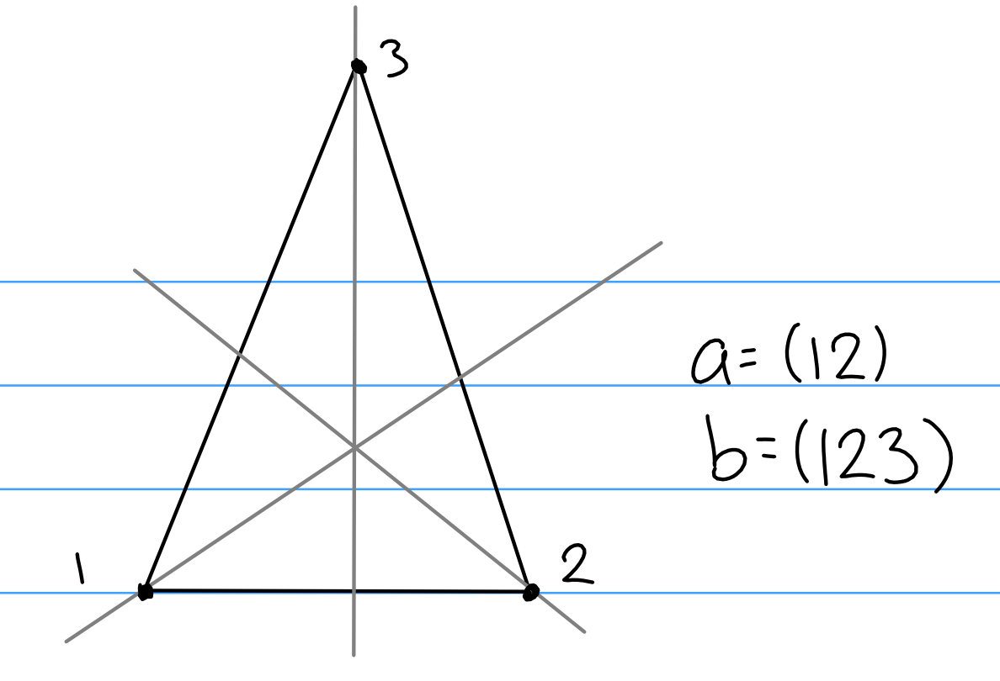

---

# Summary

Groups and rings, including Sylow theorems, classifying small groups, finitely generated abelian groups, Jordan-Holder theorem, solvable groups, simplicity of the alternating group, euclidean domains, principal ideal domains, unique factorization domains, noetherian rings, Hilbert basis theorem, Zorn's lemma, and existence of maximal ideals and vector space bases.

Previous course web pages:

- [Fall 2017, Asilata Bapat](https://asilata.github.io/8000fall17/)

# Major Theorems

\wrapenv{\Begin{theorem}[Cauchy]}
For any prime $p$ dividing the order of $G$, there is an element $x$ of order $p$ (and thus a subgroup $H = \generators{x}$ of order $p$ as well).
\wrapenv{\End{theorem}}

\wrapenv{\Begin{theorem}[Lagrange]}
If $H \leq G$ is a subgroup, then $\abs{H} \divides \abs{G}$. Moreover,
$$
\abs G = [G: H]~~\abs H.
$$
\wrapenv{\End{theorem}}

\wrapenv{\Begin{theorem}[Sylow 1]}
If $\abs{G} = n = \prod p_{i}^{a_{i}}$ as a prime factorization, then $G$ has subgroups of order $p_{i}^{a_{i}}$ for every $i$ and for every $1 \leq r \leq a_{i}$. In particular, $\mathrm{Syl}(p, G) \neq \emptyset$.

Moreover, every subgroup $H$ of order $p^k$ is normal in a subgroup of order $p^{k+1}$ for $1 \leq k \leq \alpha_i$, and thus $H \leq P$ for some $P \in \mathrm{Syl}(p, G)$.
\wrapenv{\End{theorem}}

\wrapenv{\Begin{theorem}[Sylow 2]}
If $P_1, P_2 \in \mathrm{Syl}(p, G)$, then there exists a $g\in G$ such that $gP_1g = P_2$.
\wrapenv{\End{theorem}}

\wrapenv{\Begin{theorem}[Sylow 3]}
Let $\abs G = p^n m$ and $r_p = \abs{\mathrm{Syl}(p, G)}$. Then

- $r_p = 1 \mod p$,
- $r_p \divides m$,
- $r_p = [G: N_G(P)]$.

\wrapenv{\End{theorem}}

\wrapenv{\Begin{theorem}[Classification of finitely generated abelian groups]}
If $G$ is a finitely generated abelian group, then $G \cong F \oplus T$, where $F$ is free abelian and $T$ is a torsion group. If $\abs T = n$, then $T \cong \bigoplus \ZZ_{p_{i}^{\alpha_{i}}}$ where $n = \prod p_{i}^{\alpha_{i}}$ is some factorization of $n$ with the $p_{i}$ **not necessarily distinct**.
\wrapenv{\End{theorem}}

\wrapenv{\Begin{theorem}}
Conjugacy classes partition $G$
\[
\begin{align*}
|G|=|Z(G)| + \sum_{\text{One representative in each orbit}} |C_{G}\left(g_{i}\right) |
= \sum_{asdsa} [G: C(g_{i}) ]
.\end{align*}
\]
\wrapenv{\End{theorem}}

\wrapenv{\Begin{theorem}[Orbit Stabilizer]}
If $G\actson X$, then for any $x\in X$
$$
[G: \mathrm{Stab}(x)] = \abs{\mathcal O_x},\quad \text{i.e.}\quad
\abs{G} = \abs{\mathcal O_x} \abs{\mathrm{Stab}(x)}
$$

where $\mathcal O_x = \theset{g\actson x \suchthat g\in G}\subseteq X$ and $\mathrm{Stab}(x) = \theset{x\in X \suchthat \forall g\in G,~ g\actson x = x} \leq G$.
\wrapenv{\End{theorem}}
Some nice lemmas:

- Every subgroup of a cyclic group is itself cyclic.
- $aH = bH \iff b\inv a \in H$.
- $A \leq G$ and $B \leq G \implies (A\intersect B) \leq G$.
  - Corollary: $\#A = p, \#B = q \implies A\intersect B = \theset{e}$.
  - Corollary: $\#A = p, \#B = p \implies A=B$ or $A\intersect B = \theset{e}$.

# Lecture 1 (Thu 15 Aug 2019)

> We'll be using Hungerford's Algebra text.

## Definitions
The following definitions will be useful to know by heart:

- The order of a group
- Cartesian product
- Relations
- Equivalence relation
- Partition
- Binary operation
- Group
- Isomorphism
- Abelian group
- Cyclic group
- Subgroup
- Greatest common divisor
- Least common multiple
- Permutation
- Transposition
- Orbit
- Cycle
- The symmetric group $S^{n}$
- The alternating group $A_{n}$
- Even and odd permutations
- Cosets
- Index
- The direct product of groups
- Homomorphism
- Image of a function
- Inverse image of a function
- Kernel
- Normal subgroup
- Factor group
- Simple group

Here is a rough outline of the course:

- Group Theory
  - Groups acting on sets
  - Sylow theorems and applications
  - Classification
  - Free and free abelian groups
  - Solvable and simple groups
  - Normal series
- Galois Theory
  - Field extensions
  - Splitting fields
  - Separability
  - Finite fields
  - Cyclotomic extensions
  - Galois groups
  - Solvability by radicals
- Module theory
  - Free modules
  - Homomorphisms
  - Projective and injective modules
  - Finitely generated modules over a PID
- Linear Algebra
  - Matrices and linear transformations
  - Rank and determinants
  - Canonical forms
  - Characteristic polynomials
  - Eigenvalues and eigenvectors

## Preliminaries
\wrapenv{\Begin{definition}}
A **group** is an ordered pair $(G, \wait: G\cross G \to G)$ where $G$ is a set and $\wait$ is a binary operation, which satisfies the following axioms:

- Associativity: $(g_1 g_2)g_3 = g_1(g_2 g_3)$,
- Identity: $\exists e\in G \suchthat  ge = eg = g$,
- Inverses: $g\in G \implies \exists h\in G \suchthat gh = gh = e$.

\wrapenv{\End{definition}}

\wrapenv{\wrapenv{\Begin{example}}}
\hfill
- $(\ZZ, +)$
- $(\QQ, +)$
- $(\QQ\units, \times)$
- $(\RR\units, \times)$
- ($\GL(n, \RR), \times) = \theset{A \in \mathrm{Mat}_n \suchthat \det(A) \neq 0}$
- $(S_n, \circ)$

\wrapenv{\wrapenv{\End{example}}}

\wrapenv{\Begin{definition}}
A subset $S \subseteq G$ is a **subgroup** of $G$ iff

1. $s_1, s_2 \in S \implies s_1 s_2 \in S$
2. $e\in S$
3. $s\in S \implies s\inv \in S$

\wrapenv{\End{definition}}

We denote such a subgroup $S \leq G$.

Examples of subgroups:

- $(\ZZ, +) \leq (\QQ, +)$
- $\SL(n, \RR) \leq \GL(n, \RR)$, where $\SL(n, \RR) = \theset{A\in \GL(n, \RR) \suchthat \det(A) = 1}$

## Cyclic Groups

\wrapenv{\Begin{definition}}
A group $G$ is **cyclic** iff $G$ is generated by a single element.
\wrapenv{\End{definition}}

\wrapenv{\Begin{exercise}}
Show $\generators{g} = \theset{g^n \suchthat n\in\ZZ} \cong \intersect_{g\in G} \theset{H \suchthat H \leq G \text{ and } g\in H}$.
\wrapenv{\End{exercise}}

\wrapenv{\Begin{theorem}}
Let $G$ be a cyclic group, so $G = \generators{g}$.

- If $\abs{G} = \infty$, then $G \cong \ZZ$.
- If $\abs{G} = n < \infty$, then $G \cong \ZZ_n$.

\wrapenv{\End{theorem}}

\wrapenv{\Begin{definition}}
Let $H \leq G$, and define a **right coset of $G$** by $aH = \theset{ah \suchthat H \in H}$. A similar definition can be made for **left cosets**.
\wrapenv{\End{definition}}

Then $aH = bH \iff b\inv a \in H$ and $Ha = Hb \iff ab\inv \in H$.

Some facts:

- Cosets partition $H$, i.e. $b\not\in H \implies aH \intersect bH = \theset{e}$.
- $\abs{H} = \abs{aH} = \abs{Ha}$ for all $a\in G$.

\wrapenv{\Begin{theorem}[Lagrange]}
If $G$ is a finite group and $H \leq G$, then $\abs{H} \divides \abs{G}$.
\wrapenv{\End{theorem}}

\wrapenv{\Begin{definition}}
A subgroup $N \leq G$ is **normal** iff $gN = Ng$ for all $g\in G$, or equivalently $gNg\inv \subseteq N$. I denote this $N \normal G$.

\wrapenv{\End{definition}}

When $N \normal G$, the set of left/right cosets of $N$ themselves have a group structure. So we define
$$G/N = \theset{gN \suchthat g\in G} \text{ where } (g_1 N)(g_2 N) = (g_1 g_2) N.
$$

Given $H, K \leq G$, define $HK = \theset{hk \suchthat h\in H, k\in K}$. We have a general formula,
$$
\abs{HK} = \frac{\abs H \abs K}{\abs{H \intersect K}}.
$$

## Homomorphisms

\wrapenv{\Begin{definition}}
Let $G,G'$ be groups, then $\varphi: G \to G'$ is a **homomorphism** if $\varphi(ab) = \varphi(a) \varphi(b)$.
\wrapenv{\End{definition}}

\wrapenv{\Begin{example}}

- $\exp: (\RR, +) \to (\RR^{> 0}, \wait)$ where $\exp(a+b) = e^{a+b} = e^a e^b = \exp(a) \exp(b)$.
- $\det: (\GL(n, \RR), \times) \to (\RR\units, \times)$ where $\det(AB) = \det(A) \det(B)$.
- Let $N \normal G$ and $\varphi G \to G/N$ given by $\varphi(g) = gN$.
- Let $\varphi: \ZZ \to \ZZ_n$ where $\phi(g) = [g] = g \mod n$ where $\ZZ_n \cong \ZZ/n\ZZ$

\wrapenv{\End{example}}

\wrapenv{\Begin{definition}}
Let $\varphi: G \to G'$. Then $\varphi$ is a **monomorphism** iff it is injective, an **epimorphism** iff it is surjective, and an **isomorphism** iff it is bijective.
\wrapenv{\End{definition}}

## Direct Products
Let $G_1, G_2$ be groups, then define
$$
G_1 \cross G_2 = \theset{(g_1, g_2) \suchthat g_1 \in G, g_2 \in G_2} \text{ where } (g_1, g_2)(h_1, h_2) = (g_1 h_1, g_2 ,h_2).
$$

We have the formula $\abs{G_1 \cross G_2} = \abs{G_1} \abs{G_2}$.

## Finitely Generated Abelian Groups

\wrapenv{\Begin{definition}}
We say a group is **abelian** if $G$ is commutative, i.e. $g_1, g_2 \in G \implies g_1 g_2 = g_2 g_1$.
\wrapenv{\End{definition}}

\wrapenv{\Begin{definition}}
A group is **finitely generated** if there exist $\theset{g_1, g_2, \cdots g_n} \subseteq G$ such that $G = \generators{g_1, g_2, \cdots g_n}$.
\wrapenv{\End{definition}}

This generalizes the notion of a cyclic group, where we can simply intersect all of the subgroups that contain the $g_i$ to define it.

We know what cyclic groups look like -- they are all isomorphic to $\ZZ$ or $\ZZ_n$. So now we'd like a structure theorem for abelian finitely generated groups.

\wrapenv{\Begin{theorem}}
Let $G$ be a finitely generated abelian group. Then
$$G \cong \ZZ^r \times \displaystyle\prod_{i=1}^s \ZZ_{p_i^{\alpha _i}}$$
for some finite $r,s \in \NN$ and $p_i$ are (not necessarily distinct) primes.
\wrapenv{\End{theorem}}

\wrapenv{\Begin{example}}
Let $G$ be a finite abelian group of order 4. Then $G \cong \ZZ_4$ or $\ZZ_2^2$, which are not isomorphic because every element in $\ZZ_2^2$ has order 2 where $\ZZ_4$ contains an element of order 4.
\wrapenv{\End{example}}

## Fundamental Homomorphism Theorem

Let $\varphi: G \to G'$ be a group homomorphism and define
$\ker \varphi = \theset{g\in G \suchthat \varphi(g) = e'}$.

### The First Homomorphism Theorem
\wrapenv{\Begin{theorem}}
There exists a map $\varphi': G/\ker \varphi \to G'$ such that the following diagram commutes:
\[
\begin{center}
\begin{tikzcd}
G \arrow[dd, "\eta"'] \arrow[rr, "\varphi", dotted] &  & G' \\
&  &    \\
G/\ker \varphi \arrow[rruu, "\varphi'"]             &  &
\end{tikzcd}
\end{center}
\]

That is, $\varphi = \varphi' \circ \eta$, and $\varphi'$ is an isomorphism onto its image, so $G/\ker \varphi = \im \varphi$. This map is given by $\varphi'(g(\ker \varphi)) = \varphi(g)$.
\wrapenv{\End{theorem}}

\wrapenv{\Begin{exercise}}
Check that $\varphi$ is well-defined.
\wrapenv{\End{exercise}}

### The Second Theorem
\wrapenv{\Begin{theorem}}
Let $K, N \leq G$ where $N \normal G$. Then
$$
\frac K {N \intersect K} \cong \frac {NK} N
$$
\wrapenv{\End{theorem}}

\wrapenv{\Begin{proof}}
Define a map $K \mapsvia{\varphi} NK/N$ by $\varphi(k) = kN$. You can show that $\varphi$ is onto, then look at $\ker \varphi$; note that $kN = \varphi(k) = N \iff k \in N$, and so $\ker \varphi = N \intersect K$.
\wrapenv{\End{proof}}

# Lecture 2

Last time: the fundamental homomorphism theorems.

Theorem 1:
Let $\varphi: G \to G'$ be a homomorphism. Then there is a canonical homomorphism $\eta: G \to G/\ker \varphi$ such that the usual diagram commutes. Moreover, this map induces an isomorphism $G /\ker \varphi \cong \im \varphi$.

Theorem 2: Let $K, N \leq G$ and suppose $N \normal G$. Then there is an isomorphism
$$
\frac K {K \intersect N} \cong \frac {NK} {N}
$$
(Show that $K \intersect N \normal G$, and $NK$ is a subgroup exactly because $N$ is normal).

Theorem 3: Let $H, K \normal G$ such that $H \leq K$.

1. $H/K$ is normal in $G/K$.
2. The quotient $(G/K) / (H/K) \cong G/H$.

Proof: We'll use the first theorem. First make a map
$$
G/K \to G/H \\
\phi(gk) = gH
$$

Exercise:
Show that this map is onto, and that $\ker \phi \cong H/K$.

## Permutation Groups
Let $A$ be a set, then a *permutation* on $A$ is a bijective map $A \selfmap$. This can be made into a group with a binary operation given by composition of functions. Denote $S_{A}$ the set of permutations on $A$.

Theorem: $S_{A}$ is in fact a group. Check associativity, inverses, identity, etc.

In the special case that $A = \theset{1, 2, \cdots n}$, then $S_{n} \coloneqq S_{A}$.

Recall two line notation
$$
\left(\begin{matrix}
1 & 2 & \cdots & n\\
\sigma(1) & \sigma(2) & \cdots & \sigma(n)
\end{matrix}\right)
$$

Moreover, $\abs{S_{n}} = n!$ by a combinatorial counting argument.

Example: $S_{3}$ is the symmetries of a triangle (see notes).

Example: The symmetries of a square are *not* given by $S_{4}$, it is instead $D_{4}$ (see notes).

## Orbits
Permutations $S_{A}$ "acts" on $A$, and if $\sigma \in S_{A}$, then $\generators{\sigma}$ also acts on $A$.

Define $a \sim b$ iff there is some $n$ such that $\sigma^{n}(a) = b$. This is an equivalence relation, and thus induces a partition of $A$. See notes for diagram. The equivalence classes under this relation are called the *orbits* under $\sigma$.

Example:
$$
\left(\begin{matrix}
1 & 2 & 3 & 4 & 5 & 6 & 7 & 8 \\
8 & 2 & 6 & 3 & 7 & 4 & 5 & 1
\end{matrix}\right) = (1 8)(2)(3 6 4)(5 7).
$$

Definition:
A permutation $\sigma \in S_{n}$ is a *cycle* iff it contains at most one orbit with more than one element. The *length* of a cycle is the number of elements in the largest orbit.

Recall cycle notation: $\sigma = (\sigma(1) \sigma(2) \cdots \sigma(n))$. Note that this is read right-to-left by convention!

Theorem:
Every permutation $\sigma \in S_{n}$ can be written as a product of disjoint cycles.

Definition:
A *transposition* is a cycle of length 2. Moreover, we have
$$
(a_{1} a_{2} \cdots a_{n}) = (a_{1} a_{n}) (a_{1} a_{n-1}) \cdots (a_{1} a_{2}),
$$

and so every permutation is a product of transpositions. This is not a unique decomposition, however, as e.g. $\id = (1 2)^{2} = (3 4)^{2}$.

Theorem:
Any $\sigma \in S_{n}$ can be written as **either** an even number of transpositions or an odd number of transpositions.

Define $A_{n} = \theset{\sigma \in S_{n} \suchthat \sigma\text{ is even}}$. We claim that $A_{n} \normal S_{n}$.

1. Closure: If $\tau_{1}, \tau_{2}$ are both even, then $\tau_{1}\tau_{2}$ also has an even number of transpositions.
2. The identity has an even number of transpositions, since zero is even.
3. Inverses: If $\sigma = \prod_{i=1}^{s} \tau_{i}$ where $s$ is even, then $\sigma\inv = \prod_{i=1}^{s} \tau_{s-i}$. But each $\tau$ is order 2, so $\tau\inv = \tau$, so there are still an even number of transpositions.

So $A_{n}$ is a subgroup. It is normal because it is index 2, or the kernel of a homomorphism, or by a direct computation.

## Groups Acting on Sets

Think of this as a generalization of a $G\dash$module.

Definition:
A group $G$ is said to *act* on a set $X$ if there exists a map $G\cross X \to X$ such that

1. $e\actson x = x$
2. $(g_{1} g_{2})\actson x = g_{1} \actson (g_{2} \actson x)$.

Examples:

1. $G = S_{A} \actson A$
2. $H \leq G$, then $G \actson X = G/H$ where $g \actson xH = (gx)H$.
3. $G \actson G$ by conjugation, i.e. $g\actson x = gxg\inv$.

Definition:
Let $x\in X$, then define the *stabilizer subgroup*
$$
G_{x} = \theset{g\in G \suchthat g\actson x = x} \leq G
$$

We can also look at the dual thing,
$$
X_{g} = \theset{x\in X \suchthat g\actson x = x}.
$$

We then define the *orbit* of an element $x$ as
$$
Gx = \theset{g\actson x \suchthat g\in G}
$$
and we have a similar result where $x\sim y \iff x\in Gy$, and the orbits partition $X$.

Theorem:
Let $G$ act on $X$. We want to know the number of elements in an orbit, and it turns out that
\[
\begin{align}
\abs{Gx} = [G: G_{x}]
\end{align}
\]
Proof:
Construct a map $Gx \mapsvia{\psi} G/Gx$ where $\psi(g\actson x) = g Gx$.
Exercise: Show that this is well-defined, so if 2 elements are equal then they go to the same coset.
Exercise: Show that this is surjective.

Injectivity: $\psi(g_{1} x) = \psi(g_{2} x)$, so $g_{1} Gx = g_{2} Gx$ and $(g_{2}\inv g_{1}) Gx = Gx$ so $g_{2}\inv g_{1} \in Gx \iff g_{2}\inv g_{1} \actson x = x \iff g_{1}x = g_{2} x$.

Next time: Burnside's theorem, proving the Sylow theorems.

# Lecture 3 (Aug 22)

Last time: let $G$ be a group and $X$ be a set; we say $G$ *acts* on $X$ (or that $X$ is a $G\dash$ set) when there is a map $G\cross X \to X$ such that $ex = x$ and $(gh) \actson x = g \actson (h \actson x)$. We then define the *stabilizer of $x$* as
$$
G_x = \theset{g\in G \suchthat g\actson x = x} \leq G,
$$

and the *orbit*
$$
G.x = \mathcal O_x = \theset{g\actson x \suchthat x\in X} \subseteq X.
$$

When $G$ is finite, we have
$$
\# G.x  = \frac{\# G}{\# G_x}.
$$

We can also consider the fixed points of $X$,
$$
X_g = \theset{x\in X \suchthat g\actson x = x \forall g\in G} \subseteq X
$$

## Burnside's Theorem
Theorem (Burnside):
Let $X$ be a $G\dash$set and $v$ be the number of orbits. Then
$$
v \# G = \sum_{g\in G} \# X_g.
$$
Proof:

Define $N = \theset{(g,x) \suchthat g\actson x = x} \subseteq G \cross X$, we then have
\[
\begin{align*}
\abs N &= \sum_{g\in G} \abs{X_g} \\
&= \sum_{x\in X} \abs{G_x} \\
&= \sum_{x\in X} \frac{\abs G}{\abs {G.x}} \\
&= \abs{G} \left( \sum_{x\in X} \frac{1}{\abs{Gx}} \right) \\
&= \abs{G} v
.\end{align*}
\]

Since the orbits partition $X$, say into $X = \union_{i=1}^v \sigma_i$, let $\sigma = \theset{\sigma_i \suchthat 1 \leq i \leq v}$ and abuse notation slightly by replacing each orbit in $\sigma$ with a representative element $x_i\in \sigma_i \subset X$. We then have
$$
\sum_{x \in \sigma} \frac{1}{\abs{G.x}} = \frac{1}{\abs{Gx}} \abs{\sigma}  = 1.
$$

Application:
Consider seating 10 people around a circular table. How many distinct seating arrangements are there?

Let $X$ be the set of configurations, $G = S_{10}$, and let $G\actson X$ by permuting configurations. Then $v$, the number of orbits under this action, yields the number of distinct seating arrangements. By Burnside, we have
$$
v = \frac{1}{\abs{G}} \sum_{g\in G} \abs{Xg} = \frac{1}{10} (10!) = 9!,
$$

since $Xg = \theset{x\in X \suchthat gx = x} = \emptyset$ unless $g = e$, and $X_e = X$.

## Sylow Theory

Recall Lagrange's theorem: If $H \leq G$ and $G$ is finite, then $\# H \mid \# G$.

Consider the converse: if $n \mid \# G$, does there exist a subgroup of size $n$? The answer is no in general, and a counterexample is $A_4$ which has $4!/2 = 12$ elements but no subgroup of order 6.

### Class Functions

Let $X$ be a $G\dash$set, and choose orbit representatives $x_1 \cdots x_v$. Then
$$
\abs{X} = \sum_{i=1}^v \abs{G x_i}.
$$

We can then separately count all orbits with exactly one element, which is exactly
$X_G = \theset{x\in G \suchthat g\actson x = x ~ \forall g\in G}$.

We then have
$$
\abs X = \abs{X_G} + \sum_{i=j}^v
$$
for some $j$ where $\abs{G x_i} > 1$ for all $i \geq j$.

Theorem:
Let $G$ be a group of order $p^n$ for $p$ a prime, then
$$
\abs X = \abs{X_G} \mod p
$$

Proof: We know that $\abs{G x_i} = [G : G_{x_i}]$ for $j \leq i \leq v$, and $\abs{Gx_i} > 1$ implies that $G x_i \neq G$ and thus $p \mid [G: G x_i]$. The result follows.

Application:
If $\abs G = p^n$, then the center $Z(G)$ is nontrivial. Let $X=G$ act on itself by conjugation, so $g\actson x = gxg\inv$. Then
$$
X_G = \theset{x\in G \suchthat gxg\inv = x} = \theset{x\in G \suchthat gx = xg} = Z(G)
$$

But then, by the previous theorem, we have $\abs{Z(G)} \equiv \abs{X}\equiv \abs{G} \mod p$, but since $Z(G) \leq G$ we have $\abs{Z(G)} \cong 0 \mod p$, and so in particular, $Z(G) \neq \theset{e}$.

Definition:
A group $G$ is a $p\dash$group iff every element in $G$ has order $p^k$ for some $k$. A subgroup is a $p\dash$group exactly when it is a $p\dash$group in its own right.

### Cauchy's Theorem
Theorem (Cauchy):
Let $G$ be a finite group, where $p\divides \abs{G}$ is a prime. Then $G$ is an element (and thus a subgroup) of order $p$.

Proof:
Consider $X = \theset{(g_1, g_2, \cdots , g_p) \in G^{\oplus p} \suchthat g_1g_2\cdots g_p = e}$. Given any $p-1$ elements, say $g_1 \cdots g_{p-1}$, the remaining element is completely determined by $g_p = (g_1 \cdots g_{p-1})\inv$. So $\abs X = \abs{G}^{p-1}$.

Since $p \divides \abs{G}$, we have $p \divides \abs X$. Now let $\sigma \in S_p$ the symmetric group act on $X$ by index permutation, i.e. $\sigma \actson (g_1, g_2 \cdots g_p) = (g_{\sigma(1)}, g_{\sigma(2)}, \cdots, g_{\sigma(p)})$.

Exercise: Check that this gives a well-defined group action.

Let $\sigma = (1~2~\cdots~p) \in S_p$, and note $\generators{\sigma} \leq S_p$ also acts on $X$ where $\abs{\generators{\sigma}} = p$. Therefore we have
$$
\abs{X} = \abs{X_{\generators{\sigma}}} \mod p.
$$

Since $p\divides \abs{X}$, it follows that $\abs{X_{\generators{\sigma}}} = 0 \mod p$, and thus $p \divides \abs{X_{\generators{\sigma}}}$.

If $\generators{\sigma}$ fixes $(g_1, g_2, \cdots g_p)$, then $g_1 = g_2 = \cdots g_p$.

Note that $(e, e, \cdots) \in X_{\generators{\sigma}}$, as is $(a, a, \cdots a)$ since $p \divides \abs{X_{\generators{\sigma}}}$. So there is some $a\in G$ such that $a^p = 1$. Moreover, $\generators{a} \leq G$ is a subgroup of size $p$.

### Normalizers
Let $G$ be a group and $X = S$ be the set of subgroups of $G$. Let $G$ act on $X$ by $g\actson H = gHg\inv$. What is the stabilizer? $G_x = G_H = \theset{g\in G \suchthat gHg\inv = H}$, making $G_H$ the largest subgroup such that $H \normal G_H$. So we define $N_G(H) = G_H$.

Lemma:
Let $H$ be a $p\dash$subgroup of $G$ of order $p^n$. Then $[N_G(H) : H] = [G : H] \mod p$.

Proof: Let $S = G/H$ be the set of left $H\dash$cosets in $G$. Now let $H$ act on $S$ by $H\actson x + H = (hx) + H$.

By a previous theorem, $\abs{G/H} = \abs{S} = \abs{S_H} \mod p$, where $\abs{G/H} = [G: H]$. What is $S_H$? Thus is given by $S_H = \theset{x + H \in S \suchthat xHx\inv \in H \forall h\in H}$. Therefore $x\in N_G(H)$.

Corollary: Let $H \leq G$ be a subgroup of order $p^n$. If $p \divides [G: H]$ then $N_G(H) \neq H$.
Proof: Exercise.

Theorem:
Let $G$ be a finite group, then $G$ is a $p\dash$group iff $\abs{G} = p^n$.

Proof:
Suppose $\abs{G} = p^n$ and $a \in G$. Then $\abs{\generators{a}} = p^\alpha$ for some $\alpha$.
Conversely, suppose $G$ is a $p\dash$group. Factor $\abs{G}$ into primes and suppose $\exists q$ such that $q \divides \abs{G}$ but $q \neq p$. By Cauchy, we can then get a subgroup $\generators{c}$ such that $\abs{\generators{c}} \divides q$, but then $\abs{G} \neq p^n$.

# Appendix

### Big List of Notation
\[
\begin{align*}
C(x) 			=       && \theset{g\in G : gxg^{-1} = x}                 && \subseteq G       && \text{Centralizer} \\
C_G(x) 		=     && \theset{gxg^{-1} : g\in G}                     && \subseteq G       && \text{Conjugacy Class} \\
G_x 			=       && \theset{g.x : x\in X}                          && \subseteq X       && \text{Orbit} \\
x_0 			=       && \theset{g\in G : g.x = x}                      && \subseteq G       && \text{Stabilizer} \\
Z(G) 			=       && \theset{x\in G: \forall g\in G,~ gxg^{-1} = x} && \subseteq G       && \text{Center} \\
\mathrm{Inn}(G) = && \theset{\phi_g(x) = gxg^{-1} }                 && \subseteq \Aut(G) && \text{Inner Aut.} \\
\mathrm{Out}(G) = && \Aut(G) / \mathrm{Inn}(G)                      && \injects \Aut(G)  && \text{Outer Aut.} \\
N(H) 			=       && \theset{g\in G: gHg^{-1} = H}                  && \subseteq G       && \text{Normalizer}
\end{align*}
\]

# Lecture 4: TODO

# Lecture 5 (Tuesday 8/27)

Let $G$ be a finite group and $p$ a prime. TFAE:

- $\abs{H} = p^n$ for some $n$
- Every element of $H$ has order $p^\alpha$ for some $\alpha$.

If either of these are true, we say $H$ is a *$p\dash$group*.

Let $H$ be a $p\dash$group, last time we proved that if $p \divides [G : H]$ then $N_G(H) \neq H$.

## Sylow Theorems

Let $G$ be a finite group and suppose $\abs{G} = p^n m$ where $(m, n) = 1$. Then

### Sylow 1
Motto: take a prime factorization of $\abs{G}$, then there are subgroups of order $p^i$ for *every* prime power appearing, up to the maximal power.

1. $G$ contains a subgroup of order $p^i$ for every $1 \leq i \leq n$.
2. Every subgroup $H$ of order $p^i$ where $i < n$ is a normal subgroup in a subgroup of order $p^{i+1}$.

Proof:
By induction on $i$. For $i=1$, we know this by Cauchy's theorem. If we show (2), that shows (1) as a consequence. So suppose this holds for $i < n$. Let $H \leq G$ where $\abs{H} = p^i$, we now want a subgroup of order $p^{i+1}$. Since $p\divides [G: H]$, by the previous theorem, $H < N_G(H)$ is a proper subgroup (?).

Now consider the canonical projection $N_G(H) \to N_G(H) /H$. Since $p \divides [N_G(H) : H] = \abs{N_G(H)/ H}$, by Cauchy there is a subgroup of order $p$ in this quotient. Call it $K$. Then $\pi\inv(K) \leq N_G(H)$.

Exercise: $\abs{\phi\inv(K)} = p^{i+1}$.

It now follows that $H \normal \phi\inv(K)$.
$\qed$

Definition: For $G$ a finite group and $\abs{G} = p^n m$ where $p\not\divides m$. Then a subgroup of order $p^n$ is called a Sylow $p\dash$subgroup. (By Sylow 1, these exist.)

### Sylow 2

If $P_1, P_2$ are Sylow $p\dash$subgroups of $G$, then $P_1$ and $P_2$ are conjugate.

Proof:
Let $\mathcal L$ be the left cosets of $P_1$, i.e. $\mathcal L = G/P_1$. Then let $P_2$ act on $\mathcal L$ by $p_2 \actson (g + P_1) \coloneqq (p_2g) + P_1$.

By a previous theorem about orbits and fixed points, we have
$$
\abs{\mathcal L_{P_2}} = \abs{\mathcal L} \mod p.
$$

Since $p\not\divides \abs{\mathcal L}$, we have $p\not\divides \abs{\mathcal L_{P_2}}$. So $\mathcal L_{P_2}$ is nonempty.

So there exists a coset $xP_1$ such that $xP_1 \in \mathcal L_{P_2}$, and so $yxP_1 = xP_1$ for all $y\in P_2$.

Then $x\inv y x P_1 = P_1$ for all $y\in P_2$, and so $x\inv P_2 x = P_1$. But then $P_1$ and $P_2$ are conjugate.
$\qed$

### Sylow 3

Let $G$ be a finite group, and $p\divides \abs G$. Let $r_p$ be the number of Sylow $p\dash$subgroups of $G$. Then

- $r_p \cong 1 \mod p$.
- $r_p \divides \abs G$.
- $r_p = [G : N_G(P)]$

Let $X = \mathcal S$ be the set of Sylow $p\dash$subgroups, and let $P \in X$ be a fixed Sylow $p\dash$subgroup. Let $P \actson \mathcal S$ by conjugation, so for $\overline P \in \mathcal S$ let $x \actson \overline P = x \overline P x\inv$.

By the same old theorem, we have
$$
\abs{\mathcal S} = \mathcal{S}_P \mod p
$$

What are the fixed points $\mathcal{S}_P$?
$$
\mathcal{S}_P = \theset{T \in \mathcal S \suchthat xTx\inv  = T \quad \forall x\in P}.
$$

Let $\mathcal T \in \mathcal{S}_P$, so $xTx\inv = T$ for all $x\in P$. Then $P \leq N_G(T)$, so both $P$ and $T$ are Sylow $p\dash$ subgroups in $N_G(H)$ as well as $G$.

Then there exists a $f\in N_G(T)$ such that $T = gPg\inv$. But the point is that in the normalizer, there is only **one** Sylow $p\dash$ subgroup. But then $T$ is the unique largest normal subgroup of $N_G(T)$, which forces $T = P$.

But then $\mathcal{S}_P = \theset{P}$, and using the formula, we have $r_p \cong 1 \mod p$.

Now modify this slightly by letting $G$ act on $\mathcal S$ (instead of just $P$) by conjugation.
Since all Sylows are conjugate, by Sylow (1) there is only one orbit, so $\mathcal S = GP$ for $P \in \mathcal S$. But then
$$
r_p = \abs{\mathcal S} = \abs{GP} = [G: G_p] \divides \abs{G}.
$$

Note that this gives a precise formula for $r_p$, although the theorem is just an upper bound of sorts, and $G_p = N_G(P)$.

### Applications

Of interest historically: classifying finite *simple* groups, where a group $G$ is *simple* If $N \normal G$ and $N \neq \theset{e}$, then $N=G$.

Example:
Let $G = \ZZ_p$, any subgroup would need to have order dividing $p$, so $G$ must be simple.

Example:
$G = A_n$ for $n\geq 5$ (see Galois theory)

One major application is proving that groups of a certain order are *not* simple.

Applications:

1. Let $\abs G = p^n q$ with $p > q$. Then $G$ is not simple.

> Strategy: Find a proper normal nontrivial subgroup using Sylow theory. Can either show $r_p = 1$, or produce normal subgroups by intersecting distinct Sylow p-subgroups.

Consider $r_p$, then $r_p = p^\alpha q^\beta$ for some $\alpha, \beta$. But since $r_p \cong 1 \mod p$, $p\not\divides r_p$, we must have $r_p = 1, q$. But since $q < p$ and $q\neq 1 \mod p$, this forces $r_p = 1$.

So let $P$ be a sylow $p\dash$subgroup, then $P < G$. Then $gPg\inv$ is also a sylow, but there's only 1 of them, so $P$ is normal.

2. Let $\abs{G} = 45$, then $G$ is not simple. (Exercise)

3. Let $\abs{G} = p^n$, then $G$ is not simple if $n > 1$.

By Sylow (1), there is a normal subgroup of order $p^{n-1}$ in $G$.

4. Let $\abs{G} = 48$, then $G$ is not simple.

Note $48 = 2^4 3$, so consider $r_2$, the number of Sylow 2-subgroups. Then $r_2 \cong 1 \mod 2$ and $r_2 \divides 48$. So $r_2 = 1, 3$. If $r_2 = 1$, we're done, otherwise suppose $r_2 = 3$.

Let $H \neq K$ be Sylow 2-subgroups, so $\abs H = \abs K = 2^4 = 16$. Now consider $H \intersect K$, which is a subgroup of $G$. How big is it?

Since $H\neq K, \abs{H \intersect K} < 16$. The order has to divides 16, so we in fact have $\abs{H \intersect K} \leq 8$. Suppose it is less than 4, towards a contradiction. Then
$$
\abs{HK} = \frac{\abs H \abs K}{\abs{H \intersect K}} \geq \frac{(16)(16)}{4} = 64 > \abs{G} = 48.
$$

So we can only have $\abs{H \intersect K} = 8$. Since this is an index 2 subgroup in both $H$ and $K$, it is in fact normal. But then $H, K \subseteq N_G(H \intersect K) \coloneqq X$. But then $\abs X$ must be a multiple of 16 *and* divide 48, so it's either 16 or 28. But $\abs X > 16$, because $H \subseteq X$ and $K \subseteq X$. So then $N_G(H \intersect K) = G$, and so $H \intersect K \normal G$.

## Classification of groups of a certain order

We have a classification of finite abelian groups (see table)

# Lecture 6

Recall the Sylow theorems:

- $p$ groups exist for *every* $p^i$ dividing $\abs{G}$, and $H(p) \normal H(p^2) \normal \cdots H(p^n)$.
- All Sylow $p\dash$subgroups are conjugate.
- Numerical constraints
  - $r_p \cong 1 \mod p$,
  - $r_p \divides \abs{G}$ and $r_p \divides m$,

## Internal Direct Products

Suppose $H, K \leq G$, and consider the smallest subgroup containing both $H$ and $K$. Denote this $H \vee K$.

If either $H$ or $K$ is normal in $G$, then we have $H\vee K = HK$. There's a "recipe" for proving you have a direct product of groups:

Lemma:
Let $G$ be a group, $H \normal G$ and $K\normal G$, and

1. $H\vee K = HK = G$,
2. $H \intersect K = \theset{e}$.

Then $G \cong H \times K$.

Proof:

We first want to show that $hk = kh ~\forall k\in K, h\in H$. We then have
$$
hkh\inv k\inv = (hkh\inv)k\inv \in K = h(kh\inv k\inv) \in H \implies hkh\inv k\inv \in H\intersect K = \theset{e}.
$$
So define
\[
\begin{align*}
\phi: H \cross K \to G \\
(h, k) \mapsto hk
,\end{align*}
\]
and (exercise) check that this is a homomorphism, it is surjective, and injective.

Applications:

Theorem:
Every group of order $p^2$ is abelian.

Proof:
If $G$ is cyclic, then it is abelian and $G \cong \ZZ_{p^2}$. So suppose otherwise. By Cauchy, there is an element of order $p$ in $G$. So let $H = \generators{a}$, for which we have $\abs{H} = p$.

Then $H \normal G$ by Sylow 1, since it's normal in $H(p^2)$, which would have to equal $G$.

Now consider $b\not\in H$. By Lagrange, we must have $o(b) = 1, p$, and since $e\in H$, we must have $o(b) = p$ (uses fact that $G$ is not cyclic). Now let $K = \generators{b}$. Then $\abs{K} = p$, and $K \normal G$ by the same argument.

Theorem:
Let $\abs{G} = pq$ where $q\neq 1 \mod p$ and $p < q$. Then $G$ is cyclic (and thus abelian).

Proof:
Use Sylow 1. Let $P$ be a sylow $p\dash$subgroup. We want to show that $P \normal G$ to apply our direct product lemma, so it suffices to show $r_p = 1$.

We know $r_p = 1 \mod p$ and $r_p \divides \abs{G} = pq$, and so $r_p = 1,q$. It can't be $q$ because $p < q$.

Now let $Q$ be a sylow $q\dash$subgroup. Then $r_q \cong 1 \mod 1$ and $r_q \divides pq$, so $r_q = 1, q$. But since $p< q$, we must have $r_q = 1$. So $Q \normal G$ as well.

We now have $P \intersect Q = \emptyset$ (why?) and
$$
\abs{PQ} = \frac{\abs P \abs Q}{ \abs{P \intersect Q} } = \abs P \abs Q = pq,
$$

and so $G = PQ$, and $G \cong \ZZ_p \cross \ZZ_q \cong \ZZ_{pq}$.

Example: every group of order $15 = 5^1 3^1$ is cyclic.

## Determination of groups of a given order

| Order of G 	| Number of Groups 	| List of Distinct Groups                    	|
|------------	|------------------	|--------------------------------------------	|
| 1          	| 1                	| $\theset{e}$                               	|
| 2          	| 1                	| $\ZZ_2$                                    	|
| 3          	| 1                	| $\ZZ_3$                                    	|
| 4          	| 2                	| $\ZZ_4, \ZZ_2^2$                           	|
| 5          	| 1                	| $\ZZ_5$                                    	|
| 6          	| 2                	| $\ZZ_6, S_3$ (*)                           	|
| 7          	| 1                	| $\ZZ_7$                                    	|
| 8          	| 5                	| $\ZZ_8,\ZZ_4 \cross \ZZ_2, \ZZ_2^3, D_8,Q$ 	|
| 9          	| 2                	| $\ZZ_9, \ZZ_3^2$                           	|
| 10         	| 2                	| $\ZZ_{10}, D_5$                            	|
| 11         	| 1                	| $\ZZ_{11}$                                 	|

We still need to justify 6, 8, and 10.

## Free Groups

Define an *alphabet* $A = \theset{a_1, a_2, \cdots a_n}$,
and let a *syllable* be of the form $a_i^m$ for some $m$.
A *word* is any expression of the form $\prod_{n_i} a_{n_i}^{m_i}$.

We have two operations,

- Concatenation, i.e. $(a_1 a_2) \star (a_3^2 a_5) = a_1 a_2 a_3^2 a_5$.
- Contraction, i.e. $(a_1 a_2^2) \star (a_2\inv a_5) = a_1 a_2^2 a_2\inv a_5 = a_1 a_2 a_5$.

If we've contracted a word as much as possible, we say it is *reduced*.

We let $F[A]$ be the set of reduced words and define a binary operation
\[
\begin{align*}
f: F[A] \cross F[A] &\to F[A] \\
(w_1, w_2) &\mapsto w_1 w_2 \text{ (reduced) }
.\end{align*}
\]
Theorem: $(A, f)$ is a group.

Definition:
$F[A]$ is called the *free group generated by $A$*. A group $G$ is called *free* on a subset $A \subseteq G$ iff $G \cong F[A]$.

Examples:

1. $A = \theset{x} \implies F[A] = \theset{x^n \suchthat n \in \ZZ} \cong \ZZ$.
2. $A = \theset{xy} = \ZZ \ast \ZZ$ (not defined yet!). Note that there are not relations, i.e. $xyxyxy$ is reduced. To abelianize, we'd need to introduce a relation $xy = yx$.

Properties:

1. If $G$ is free on $A$ and free on $B$ then we must have $\abs A = \abs B$.
2. Any (nontrivial) subgroup of a free group is free.
	(See Fraleigh or Hungerford for possible Algebraic proofs!)

Theorem:
Let $G$ be generated by some (possibly infinite) subset $A = \theset{A_i}{i\in I}$ and $G'$ be generated by some $A_i' \subseteq A_i$. Then

(a) There is at most one homomorphism $a_i \to a_i'$.

(b) If $G \cong F[A]$, there is exactly *one* homomorphism.

Corollary:
Every group $G'$ is a homomorphic image of a free group.

Proof:

Let $A$ be the generators of $G'$ and $G = F[A]$, then define $\varphi(a_i) = a_i$. This is onto exactly because $G' = \generators{a_i}$, and using the theorem above we're done.

## Generators and Relations

Let $G$ be a group and $A \subseteq G$ be a generating subset so $G = \generators{a \mid a\in A}$.
There exists a $\phi: F[A] \surjects G$, and by the first isomorphism theorem, we have $F[A] / \ker \phi \cong G$.

Let $R = \ker \phi$, these provide the *relations*.

Examples:

Let $G = \ZZ_3 = \generators{[1]_3}$. Let $x = [1]_3$, then define $\phi: F[\theset{x}] \surjects \ZZ_3$, then since $[1] + [1] + [1] = [0] \mod 3$, we have $\ker \phi = \generators{x^3}$.

Let $G = \ZZ \oplus \ZZ$, then $G \cong \generators{x,y \mid [x,y] = 1}$.

> We'll use this for groups of order 6 -- there will be only one presentation that is nonabelian, and we'll exhibit such a group.

# Lecture 7 (Thursday 29th)

Recall the table of distinct small groups we had:

| Order of G 	| Number of Groups 	| List of Distinct Groups                    	|
|------------	|------------------	|--------------------------------------------	|
| 1          	| 1                	| $\theset{e}$                               	|
| 2          	| 1                	| $\ZZ_2$                                    	|
| 3          	| 1                	| $\ZZ_3$                                    	|
| 4          	| 2                	| $\ZZ_4, \ZZ_2^2$                           	|
| 5          	| 1                	| $\ZZ_5$                                    	|
| 6          	| 2                	| $\ZZ_6, S_3$ (*)                           	|
| 7          	| 1                	| $\ZZ_7$                                    	|
| 8          	| 5                	| $\ZZ_8,\ZZ_4 \cross \ZZ_2, \ZZ_2^3, D_4, Q$ |
| 9          	| 2                	| $\ZZ_9, \ZZ_3^2$                           	|
| 10         	| 2                	| $\ZZ_{10}, D_5$                            	|
| 11         	| 1                	| $\ZZ_{11}$                                 	|

> Exercise: show that groups of order $p^2$ are abelian.

We still need to justify $S_3, D_4, Q, D_5$.

Recall that for any group $A$, we can consider the free group on the elements of $A$, $F[A]$. (Note that we can also restrict $A$ to just its generators.)
There is then a homomorphism $F[A] \to A$, where the kernel is the relations.

Example:
$\ZZ \ast \ZZ = \generators{x, y \mid xyx\inv y\inv = e}$ where $x = (1, 0), y = (0, 1)$.

## Groups of Order 6

Let $G$ be nonabelian of order $6$. Idea: look at subgroups of index 2.

Let $P$ be a Sylow 3-subgroup of $G$, then $r_3 = 1$ so $P\normal G$. Moreover, $P$ is cyclic since it is order 3, so $P = \generators{a}$. But since $\abs{G/P} = 2$, it is also cyclic, so $G/P = \generators{bP}$.

Note that $b\not\in P$, but $b^2 \in P$ since $(bP)^2 = P$, so $b^2 \in \theset{e, a, a^2}$. If $b=a, a^2$ then $b$ has order 6, but this would make $G = \generators{b}$ cyclic and thus abelian. So $b^2=1$.

Since $P \normal G$, we have $bPb\inv = P$, and in particular $bab\inv$ has order 3. So either $bab\inv = a$, or $bab\inv = a^2$. If $bab\inv = a$, then $G$ is abelian, so $bab\inv = a^2$.

So $G = \generators{a, b \mid a^3 = e, b^2 = e, bab\inv = a^2}$.

We've shown that *if* there is such a nonabelian group, then it must satisfy these relations -- we still need to produce some group that actually realizes this.

Consider the symmetries of the triangle:

You can check that $a,b$ satisfy the appropriate relations.

For order 10, a similar argument yields

$G = \generators{a, b \mid a^5 = 1, b^2 = 1, ba=a^4b}$, and this is realized by symmetries of the pentagon where $a = (1~2~3~4~5), b=(1~4)(2~3)$.

## Groups of Order 8

Assume $G$ is nonabelian of order 8. $G$ has no elements of order 8, so the only possibilities are 1, 2, 4.

Assume all elements have order 1,2. Let $a,b\in G$, consider $(ab)^2 = abab \implies ab=b\inv a\inv = ba$, so $G$ is abelian. So there must be an element of order 4.

So suppose $a\in G$ has order 4, which is an index 2 subgroup, and so $\generators{a} \normal G$. But $\abs{G/\generators a} = 2$ is cyclic, so $G/\generators a = \generators{bH}$.

Note that $b^2 \in H = \generators a$.

If $b^2=a, a^3$ then $b$ will have order 8, making $G$ cyclic. So $b^2 = 1, a^2$ (these are both valid options!)

Since $H \normal G$, we have $b\generators a b\inv = \generators a$, and since $a$ has order 4, so does $bab\inv$. So $bab\inv = a, a^3$, but $a$ is not an option because this would make $G$ abelian.

So we have two options:
\[
\begin{align*}
G_1 = \generators{a, b \mid a^4 = 1, b^2=1, bab\inv = a^3} \\
G_2 = \generators{a, b \mid a^4 = 1, b^2 = a^2, bab\inv = a^3}
.\end{align*}
\]

Exercise: prove $G_1 \not\cong G_2$.

Now to realize these groups: $G_1$ is the group of symmetries of the square, where $a = (1~2~3~4), b=(1~3)$.

$G_2 \cong Q$, the quaternions, where $Q = \theset{\pm 1,\pm i, \pm j, \pm k}$.
