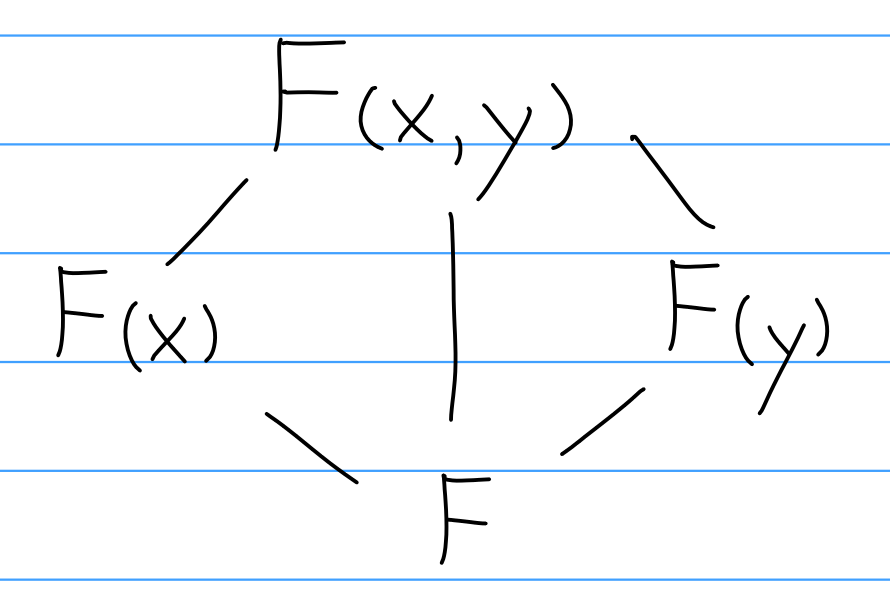
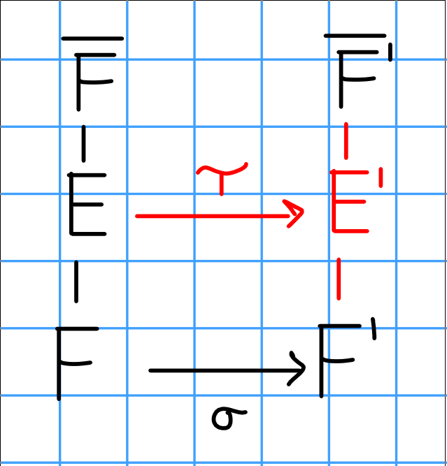
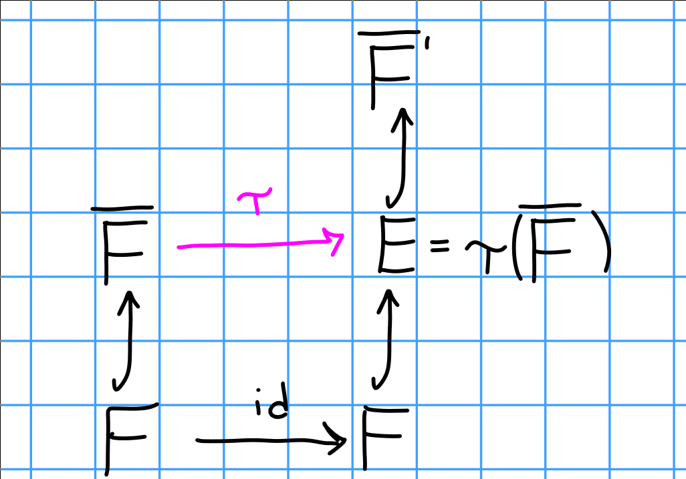
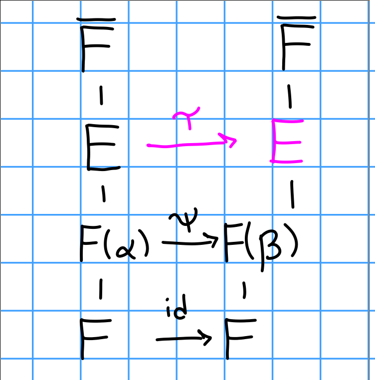
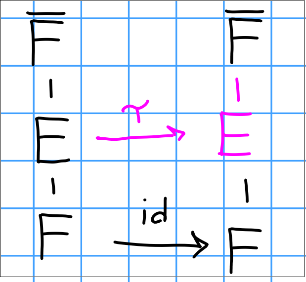
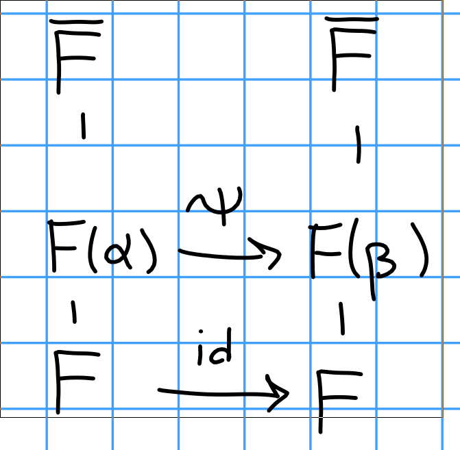
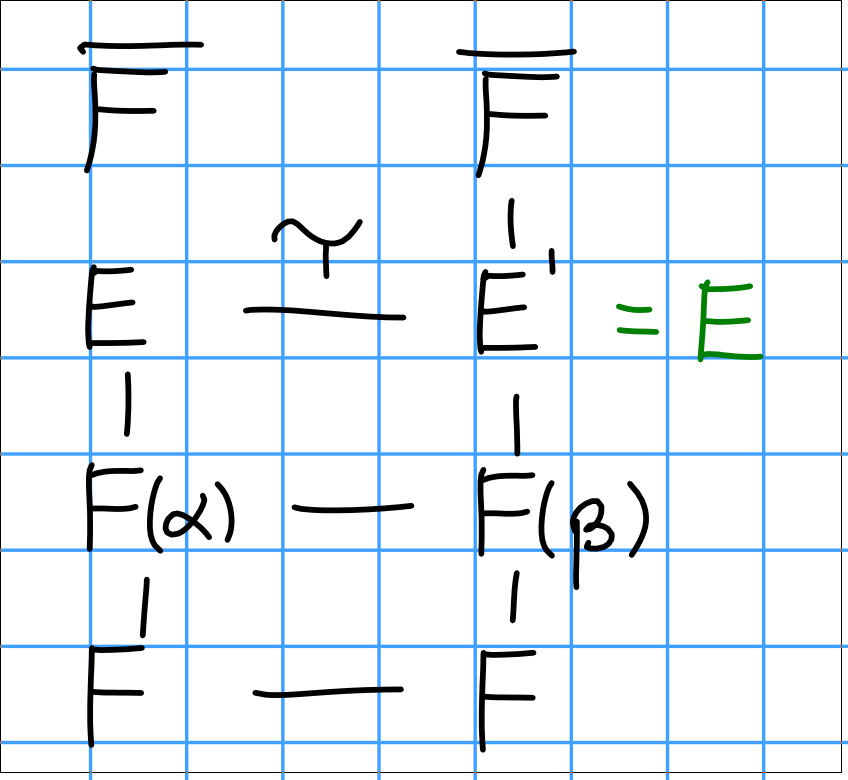
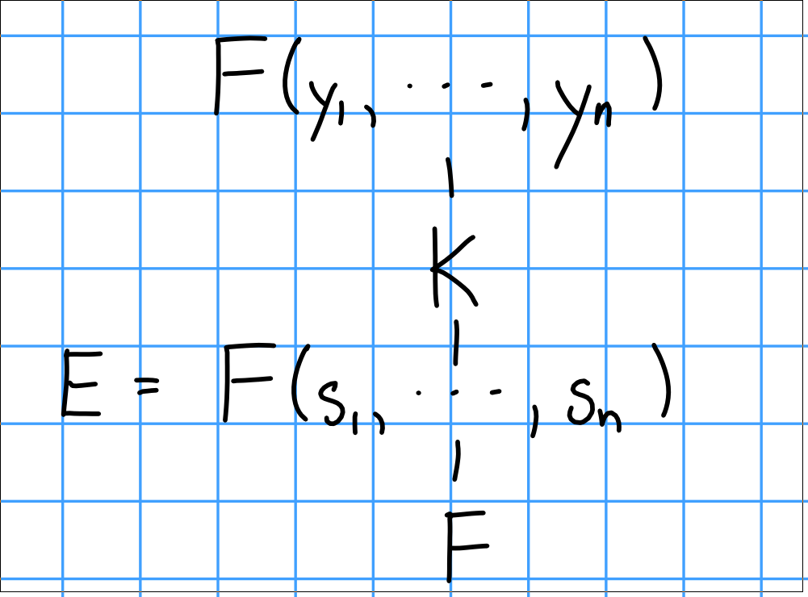

---

# Summary

Groups and rings, including Sylow theorems, classifying small groups, finitely generated abelian groups, Jordan-Holder theorem, solvable groups, simplicity of the alternating group, euclidean domains, principal ideal domains, unique factorization domains, noetherian rings, Hilbert basis theorem, Zorn's lemma, and existence of maximal ideals and vector space bases.

Previous course web pages:

- [Fall 2017, Asilata Bapat](https://asilata.github.io/8000fall17/)

# Major Theorems

\wrapenv{\Begin{theorem}[Cauchy]}
For any prime $p$ dividing the order of $G$, there is an element $x$ of order $p$ (and thus a subgroup $H = \generators{x}$ of order $p$ as well).
\wrapenv{\End{theorem}}

\wrapenv{\Begin{theorem}[Lagrange]}
If $H \leq G$ is a subgroup, then $\abs{H} \divides \abs{G}$. Moreover,
$$
\abs G = [G: H]~~\abs H.
$$
\wrapenv{\End{theorem}}

\wrapenv{\Begin{theorem}[Sylow 1]}
If $\abs{G} = n = \prod p_{i}^{a_{i}}$ as a prime factorization, then $G$ has subgroups of order $p_{i}^{a_{i}}$ for every $i$ and for every $1 \leq r \leq a_{i}$. In particular, $\mathrm{Syl}(p, G) \neq \emptyset$.

Moreover, every subgroup $H$ of order $p^k$ is normal in a subgroup of order $p^{k+1}$ for $1 \leq k \leq \alpha_i$, and thus $H \leq P$ for some $P \in \mathrm{Syl}(p, G)$.
\wrapenv{\End{theorem}}

\wrapenv{\Begin{theorem}[Sylow 2]}
If $P_1, P_2 \in \mathrm{Syl}(p, G)$, then there exists a $g\in G$ such that $gP_1g = P_2$.
\wrapenv{\End{theorem}}

\wrapenv{\Begin{theorem}[Sylow 3]}
Let $\abs G = p^n m$ and $r_p = \abs{\mathrm{Syl}(p, G)}$. Then

- $r_p = 1 \mod p$,
- $r_p \divides m$,
- $r_p = [G: N_G(P)]$.

\wrapenv{\End{theorem}}

\wrapenv{\Begin{theorem}[Classification of finitely generated abelian groups]}
If $G$ is a finitely generated abelian group, then $G \cong F \oplus T$, where $F$ is free abelian and $T$ is a torsion group. If $\abs T = n$, then $T \cong \bigoplus \ZZ_{p_{i}^{\alpha_{i}}}$ where $n = \prod p_{i}^{\alpha_{i}}$ is some factorization of $n$ with the $p_{i}$ **not necessarily distinct**.
\wrapenv{\End{theorem}}

\wrapenv{\Begin{theorem}}
Conjugacy classes partition $G$
\[
\begin{align*}
|G|=|Z(G)| + \sum_{\text{One representative in each orbit}} |C_{G}\left(g_{i}\right) |
= \sum_{asdsa} [G: C(g_{i}) ]
.\end{align*}
\]
\wrapenv{\End{theorem}}

\wrapenv{\Begin{theorem}[Orbit Stabilizer]}
If $G\actson X$, then for any $x\in X$
$$
[G: \mathrm{Stab}(x)] = \abs{\mathcal O_x},\quad \text{i.e.}\quad
\abs{G} = \abs{\mathcal O_x} \abs{\mathrm{Stab}(x)}
$$

where $\mathcal O_x = \theset{g\actson x \suchthat g\in G}\subseteq X$ and $\mathrm{Stab}(x) = \theset{x\in X \suchthat \forall g\in G,~ g\actson x = x} \leq G$.
\wrapenv{\End{theorem}}

\wrapenv{\Begin{theorem}[Eisenstein's Criterion]}
If $f = \sum_{i=0}^n a_i x^i \in \QQ[x]$ and there exists a prime $p$ such that

- $p$ divides $a_i$ for each $0 \leq i \leq n-1$,
- $p$ does not divide $a_n$, and
- $p^2$ does not divide $a_0$,

Then $f$ is irreducible over $\QQ$.
\wrapenv{\End{theorem}}

Some nice lemmas:

- Every subgroup of a cyclic group is itself cyclic.
- $aH = bH \iff b\inv a \in H$.
- $A \leq G$ and $B \leq G \implies (A\intersect B) \leq G$.
  - Corollary: $\#A = p, \#B = q \implies A\intersect B = \theset{e}$.
  - Corollary: $\#A = p, \#B = p \implies A=B$ or $A\intersect B = \theset{e}$.
- The Quaternion group has only one element of order 2, namely $-1$.
  - They also have the presentation $Q = \generators{x,y,z \mid x^2 = y^2 = z^2 = xyz = -1}$ or $Q = \generators{x, y \mid x^4 = y^4 = e, x^2 = y^2, yxy\inv = x\inv}$. 
- A dihedral group always has presentation $D_n = \generators{x, y \mid x^n = y^2 = (xy)^2 = e}$, yielding at least 2 distinct elements of order 2.

# Lecture 1 (Thu 15 Aug 2019)

> We'll be using Hungerford's Algebra text.

## Definitions
The following definitions will be useful to know by heart:

- The order of a group
- Cartesian product
- Relations
- Equivalence relation
- Partition
- Binary operation
- Group
- Isomorphism
- Abelian group
- Cyclic group
- Subgroup
- Greatest common divisor
- Least common multiple
- Permutation
- Transposition
- Orbit
- Cycle
- The symmetric group $S^{n}$
- The alternating group $A_{n}$
- Even and odd permutations
- Cosets
- Index
- The direct product of groups
- Homomorphism
- Image of a function
- Inverse image of a function
- Kernel
- Normal subgroup
- Factor group
- Simple group

Here is a rough outline of the course:

- Group Theory
  - Groups acting on sets
  - Sylow theorems and applications
  - Classification
  - Free and free abelian groups
  - Solvable and simple groups
  - Normal series
- Galois Theory
  - Field extensions
  - Splitting fields
  - Separability
  - Finite fields
  - Cyclotomic extensions
  - Galois groups
  - Solvability by radicals
- Module theory
  - Free modules
  - Homomorphisms
  - Projective and injective modules
  - Finitely generated modules over a PID
- Linear Algebra
  - Matrices and linear transformations
  - Rank and determinants
  - Canonical forms
  - Characteristic polynomials
  - Eigenvalues and eigenvectors

## Preliminaries
\wrapenv{\Begin{definition}}
A **group** is an ordered pair $(G, \wait: G\cross G \to G)$ where $G$ is a set and $\wait$ is a binary operation, which satisfies the following axioms:

- Associativity: $(g_1 g_2)g_3 = g_1(g_2 g_3)$,
- Identity: $\exists e\in G \suchthat  ge = eg = g$,
- Inverses: $g\in G \implies \exists h\in G \suchthat gh = gh = e$.

\wrapenv{\End{definition}}

\wrapenv{\wrapenv{\Begin{example}}}
\hfill
- $(\ZZ, +)$
- $(\QQ, +)$
- $(\QQ\units, \times)$
- $(\RR\units, \times)$
- ($\GL(n, \RR), \times) = \theset{A \in \mathrm{Mat}_n \suchthat \det(A) \neq 0}$
- $(S_n, \circ)$

\wrapenv{\wrapenv{\End{example}}}

\wrapenv{\Begin{definition}}
A subset $S \subseteq G$ is a **subgroup** of $G$ iff

1. $s_1, s_2 \in S \implies s_1 s_2 \in S$
2. $e\in S$
3. $s\in S \implies s\inv \in S$

\wrapenv{\End{definition}}

We denote such a subgroup $S \leq G$.

Examples of subgroups:

- $(\ZZ, +) \leq (\QQ, +)$
- $\SL(n, \RR) \leq \GL(n, \RR)$, where $\SL(n, \RR) = \theset{A\in \GL(n, \RR) \suchthat \det(A) = 1}$

## Cyclic Groups

\wrapenv{\Begin{definition}}
A group $G$ is **cyclic** iff $G$ is generated by a single element.
\wrapenv{\End{definition}}

\wrapenv{\Begin{exercise}}
Show $\generators{g} = \theset{g^n \suchthat n\in\ZZ} \cong \intersect_{g\in G} \theset{H \suchthat H \leq G \text{ and } g\in H}$.
\wrapenv{\End{exercise}}

\wrapenv{\Begin{theorem}}
Let $G$ be a cyclic group, so $G = \generators{g}$.

- If $\abs{G} = \infty$, then $G \cong \ZZ$.
- If $\abs{G} = n < \infty$, then $G \cong \ZZ_n$.

\wrapenv{\End{theorem}}

\wrapenv{\Begin{definition}}
Let $H \leq G$, and define a **right coset of $G$** by $aH = \theset{ah \suchthat H \in H}$. A similar definition can be made for **left cosets**.
\wrapenv{\End{definition}}

Then $aH = bH \iff b\inv a \in H$ and $Ha = Hb \iff ab\inv \in H$.

Some facts:

- Cosets partition $H$, i.e. $b\not\in H \implies aH \intersect bH = \theset{e}$.
- $\abs{H} = \abs{aH} = \abs{Ha}$ for all $a\in G$.

\wrapenv{\Begin{theorem}[Lagrange]}
If $G$ is a finite group and $H \leq G$, then $\abs{H} \divides \abs{G}$.
\wrapenv{\End{theorem}}

\wrapenv{\Begin{definition}}
A subgroup $N \leq G$ is **normal** iff $gN = Ng$ for all $g\in G$, or equivalently $gNg\inv \subseteq N$. I denote this $N \normal G$.

\wrapenv{\End{definition}}

When $N \normal G$, the set of left/right cosets of $N$ themselves have a group structure. So we define
$$G/N = \theset{gN \suchthat g\in G} \text{ where } (g_1 N)(g_2 N) = (g_1 g_2) N.
$$

Given $H, K \leq G$, define $HK = \theset{hk \suchthat h\in H, k\in K}$. We have a general formula,
$$
\abs{HK} = \frac{\abs H \abs K}{\abs{H \intersect K}}.
$$

## Homomorphisms

\wrapenv{\Begin{definition}}
Let $G,G'$ be groups, then $\varphi: G \to G'$ is a **homomorphism** if $\varphi(ab) = \varphi(a) \varphi(b)$.
\wrapenv{\End{definition}}

\wrapenv{\Begin{example}}

- $\exp: (\RR, +) \to (\RR^{> 0}, \wait)$ where $\exp(a+b) = e^{a+b} = e^a e^b = \exp(a) \exp(b)$.
- $\det: (\GL(n, \RR), \times) \to (\RR\units, \times)$ where $\det(AB) = \det(A) \det(B)$.
- Let $N \normal G$ and $\varphi G \to G/N$ given by $\varphi(g) = gN$.
- Let $\varphi: \ZZ \to \ZZ_n$ where $\phi(g) = [g] = g \mod n$ where $\ZZ_n \cong \ZZ/n\ZZ$

\wrapenv{\End{example}}

\wrapenv{\Begin{definition}}
Let $\varphi: G \to G'$. Then $\varphi$ is a **monomorphism** iff it is injective, an **epimorphism** iff it is surjective, and an **isomorphism** iff it is bijective.
\wrapenv{\End{definition}}

## Direct Products
Let $G_1, G_2$ be groups, then define
$$
G_1 \cross G_2 = \theset{(g_1, g_2) \suchthat g_1 \in G, g_2 \in G_2} \text{ where } (g_1, g_2)(h_1, h_2) = (g_1 h_1, g_2 ,h_2).
$$

We have the formula $\abs{G_1 \cross G_2} = \abs{G_1} \abs{G_2}$.

## Finitely Generated Abelian Groups

\wrapenv{\Begin{definition}}
We say a group is **abelian** if $G$ is commutative, i.e. $g_1, g_2 \in G \implies g_1 g_2 = g_2 g_1$.
\wrapenv{\End{definition}}

\wrapenv{\Begin{definition}}
A group is **finitely generated** if there exist $\theset{g_1, g_2, \cdots g_n} \subseteq G$ such that $G = \generators{g_1, g_2, \cdots g_n}$.
\wrapenv{\End{definition}}

This generalizes the notion of a cyclic group, where we can simply intersect all of the subgroups that contain the $g_i$ to define it.

We know what cyclic groups look like -- they are all isomorphic to $\ZZ$ or $\ZZ_n$. So now we'd like a structure theorem for abelian finitely generated groups.

\wrapenv{\Begin{theorem}}
Let $G$ be a finitely generated abelian group. Then
$$G \cong \ZZ^r \times \displaystyle\prod_{i=1}^s \ZZ_{p_i^{\alpha _i}}$$
for some finite $r,s \in \NN$ and $p_i$ are (not necessarily distinct) primes.
\wrapenv{\End{theorem}}

\wrapenv{\Begin{example}}
Let $G$ be a finite abelian group of order 4. Then $G \cong \ZZ_4$ or $\ZZ_2^2$, which are not isomorphic because every element in $\ZZ_2^2$ has order 2 where $\ZZ_4$ contains an element of order 4.
\wrapenv{\End{example}}

## Fundamental Homomorphism Theorem

Let $\varphi: G \to G'$ be a group homomorphism and define
$\ker \varphi = \theset{g\in G \suchthat \varphi(g) = e'}$.

### The First Homomorphism Theorem
\wrapenv{\Begin{theorem}}
There exists a map $\varphi': G/\ker \varphi \to G'$ such that the following diagram commutes:
\[
\begin{center}
\begin{tikzcd}
G \arrow[dd, "\eta"'] \arrow[rr, "\varphi", dotted] &  & G' \\
&  &    \\
G/\ker \varphi \arrow[rruu, "\varphi'"]             &  &
\end{tikzcd}
\end{center}
\]

That is, $\varphi = \varphi' \circ \eta$, and $\varphi'$ is an isomorphism onto its image, so $G/\ker \varphi = \im \varphi$. This map is given by $\varphi'(g(\ker \varphi)) = \varphi(g)$.
\wrapenv{\End{theorem}}

\wrapenv{\Begin{exercise}}
Check that $\varphi$ is well-defined.
\wrapenv{\End{exercise}}

### The Second Theorem
\wrapenv{\Begin{theorem}}
Let $K, N \leq G$ where $N \normal G$. Then
$$
\frac K {N \intersect K} \cong \frac {NK} N
$$
\wrapenv{\End{theorem}}

\wrapenv{\Begin{proof}}
Define a map $K \mapsvia{\varphi} NK/N$ by $\varphi(k) = kN$. You can show that $\varphi$ is onto, then look at $\ker \varphi$; note that $kN = \varphi(k) = N \iff k \in N$, and so $\ker \varphi = N \intersect K$.
\wrapenv{\End{proof}}

# Lecture 2

Last time: the fundamental homomorphism theorems.

Theorem 1:
Let $\varphi: G \to G'$ be a homomorphism. Then there is a canonical homomorphism $\eta: G \to G/\ker \varphi$ such that the usual diagram commutes. Moreover, this map induces an isomorphism $G /\ker \varphi \cong \im \varphi$.

Theorem 2: Let $K, N \leq G$ and suppose $N \normal G$. Then there is an isomorphism
$$
\frac K {K \intersect N} \cong \frac {NK} {N}
$$
(Show that $K \intersect N \normal G$, and $NK$ is a subgroup exactly because $N$ is normal).

Theorem 3: Let $H, K \normal G$ such that $H \leq K$.

1. $H/K$ is normal in $G/K$.
2. The quotient $(G/K) / (H/K) \cong G/H$.

Proof: We'll use the first theorem. First make a map
$$
G/K \to G/H \\
\phi(gk) = gH
$$

Exercise:
Show that this map is onto, and that $\ker \phi \cong H/K$.

## Permutation Groups
Let $A$ be a set, then a *permutation* on $A$ is a bijective map $A \selfmap$. This can be made into a group with a binary operation given by composition of functions. Denote $S_{A}$ the set of permutations on $A$.

Theorem: $S_{A}$ is in fact a group. Check associativity, inverses, identity, etc.

In the special case that $A = \theset{1, 2, \cdots n}$, then $S_{n} \coloneqq S_{A}$.

Recall two line notation
$$
\left(\begin{matrix}
1 & 2 & \cdots & n\\
\sigma(1) & \sigma(2) & \cdots & \sigma(n)
\end{matrix}\right)
$$

Moreover, $\abs{S_{n}} = n!$ by a combinatorial counting argument.

Example: $S_{3}$ is the symmetries of a triangle (see notes).

Example: The symmetries of a square are *not* given by $S_{4}$, it is instead $D_{4}$ (see notes).

## Orbits
Permutations $S_{A}$ "acts" on $A$, and if $\sigma \in S_{A}$, then $\generators{\sigma}$ also acts on $A$.

Define $a \sim b$ iff there is some $n$ such that $\sigma^{n}(a) = b$. This is an equivalence relation, and thus induces a partition of $A$. See notes for diagram. The equivalence classes under this relation are called the *orbits* under $\sigma$.

Example:
$$
\left(\begin{matrix}
1 & 2 & 3 & 4 & 5 & 6 & 7 & 8 \\
8 & 2 & 6 & 3 & 7 & 4 & 5 & 1
\end{matrix}\right) = (1 8)(2)(3 6 4)(5 7).
$$

**Definition:**
A permutation $\sigma \in S_{n}$ is a *cycle* iff it contains at most one orbit with more than one element. The *length* of a cycle is the number of elements in the largest orbit.

Recall cycle notation: $\sigma = (\sigma(1) \sigma(2) \cdots \sigma(n))$. Note that this is read right-to-left by convention!

**Theorem:**
Every permutation $\sigma \in S_{n}$ can be written as a product of disjoint cycles.

**Definition:**
A *transposition* is a cycle of length 2. Moreover, we have
$$
(a_{1} a_{2} \cdots a_{n}) = (a_{1} a_{n}) (a_{1} a_{n-1}) \cdots (a_{1} a_{2}),
$$

and so every permutation is a product of transpositions. This is not a unique decomposition, however, as e.g. $\id = (1 2)^{2} = (3 4)^{2}$.

**Theorem:**
Any $\sigma \in S_{n}$ can be written as **either** an even number of transpositions or an odd number of transpositions.

Define $A_{n} = \theset{\sigma \in S_{n} \suchthat \sigma\text{ is even}}$. We claim that $A_{n} \normal S_{n}$.

1. Closure: If $\tau_{1}, \tau_{2}$ are both even, then $\tau_{1}\tau_{2}$ also has an even number of transpositions.
2. The identity has an even number of transpositions, since zero is even.
3. Inverses: If $\sigma = \prod_{i=1}^{s} \tau_{i}$ where $s$ is even, then $\sigma\inv = \prod_{i=1}^{s} \tau_{s-i}$. But each $\tau$ is order 2, so $\tau\inv = \tau$, so there are still an even number of transpositions.

So $A_{n}$ is a subgroup. It is normal because it is index 2, or the kernel of a homomorphism, or by a direct computation.

## Groups Acting on Sets

Think of this as a generalization of a $G\dash$module.

**Definition:**
A group $G$ is said to *act* on a set $X$ if there exists a map $G\cross X \to X$ such that

1. $e\actson x = x$
2. $(g_{1} g_{2})\actson x = g_{1} \actson (g_{2} \actson x)$.

Examples:

1. $G = S_{A} \actson A$
2. $H \leq G$, then $G \actson X = G/H$ where $g \actson xH = (gx)H$.
3. $G \actson G$ by conjugation, i.e. $g\actson x = gxg\inv$.

**Definition:**
Let $x\in X$, then define the *stabilizer subgroup*
$$
G_{x} = \theset{g\in G \suchthat g\actson x = x} \leq G
$$

We can also look at the dual thing,
$$
X_{g} = \theset{x\in X \suchthat g\actson x = x}.
$$

We then define the *orbit* of an element $x$ as
$$
Gx = \theset{g\actson x \suchthat g\in G}
$$
and we have a similar result where $x\sim y \iff x\in Gy$, and the orbits partition $X$.

**Theorem:**
Let $G$ act on $X$. We want to know the number of elements in an orbit, and it turns out that
\[
\begin{align}
\abs{Gx} = [G: G_{x}]
\end{align}
\]
Proof:
Construct a map $Gx \mapsvia{\psi} G/Gx$ where $\psi(g\actson x) = g Gx$.
Exercise: Show that this is well-defined, so if 2 elements are equal then they go to the same coset.
Exercise: Show that this is surjective.

Injectivity: $\psi(g_{1} x) = \psi(g_{2} x)$, so $g_{1} Gx = g_{2} Gx$ and $(g_{2}\inv g_{1}) Gx = Gx$ so $g_{2}\inv g_{1} \in Gx \iff g_{2}\inv g_{1} \actson x = x \iff g_{1}x = g_{2} x$.

Next time: Burnside's theorem, proving the Sylow theorems.

# Lecture 3 (Aug 22)

Last time: let $G$ be a group and $X$ be a set; we say $G$ *acts* on $X$ (or that $X$ is a $G\dash$ set) when there is a map $G\cross X \to X$ such that $ex = x$ and $(gh) \actson x = g \actson (h \actson x)$. We then define the *stabilizer of $x$* as
$$
G_x = \theset{g\in G \suchthat g\actson x = x} \leq G,
$$

and the *orbit*
$$
G.x = \mathcal O_x = \theset{g\actson x \suchthat x\in X} \subseteq X.
$$

When $G$ is finite, we have
$$
\# G.x  = \frac{\# G}{\# G_x}.
$$

We can also consider the fixed points of $X$,
$$
X_g = \theset{x\in X \suchthat g\actson x = x \forall g\in G} \subseteq X
$$

## Burnside's Theorem
Theorem (Burnside):
Let $X$ be a $G\dash$set and $v$ be the number of orbits. Then
$$
v \# G = \sum_{g\in G} \# X_g.
$$
Proof:

Define $N = \theset{(g,x) \suchthat g\actson x = x} \subseteq G \cross X$, we then have
\[
\begin{align*}
\abs N &= \sum_{g\in G} \abs{X_g} \\
&= \sum_{x\in X} \abs{G_x} \\
&= \sum_{x\in X} \frac{\abs G}{\abs {G.x}} \\
&= \abs{G} \left( \sum_{x\in X} \frac{1}{\abs{Gx}} \right) \\
&= \abs{G} v
.\end{align*}
\]

Since the orbits partition $X$, say into $X = \union_{i=1}^v \sigma_i$, let $\sigma = \theset{\sigma_i \suchthat 1 \leq i \leq v}$ and abuse notation slightly by replacing each orbit in $\sigma$ with a representative element $x_i\in \sigma_i \subset X$. We then have
$$
\sum_{x \in \sigma} \frac{1}{\abs{G.x}} = \frac{1}{\abs{Gx}} \abs{\sigma}  = 1.
$$

Application:
Consider seating 10 people around a circular table. How many distinct seating arrangements are there?

Let $X$ be the set of configurations, $G = S_{10}$, and let $G\actson X$ by permuting configurations. Then $v$, the number of orbits under this action, yields the number of distinct seating arrangements. By Burnside, we have
$$
v = \frac{1}{\abs{G}} \sum_{g\in G} \abs{Xg} = \frac{1}{10} (10!) = 9!,
$$

since $Xg = \theset{x\in X \suchthat gx = x} = \emptyset$ unless $g = e$, and $X_e = X$.

## Sylow Theory

Recall Lagrange's theorem: If $H \leq G$ and $G$ is finite, then $\# H \mid \# G$.

Consider the converse: if $n \mid \# G$, does there exist a subgroup of size $n$? The answer is no in general, and a counterexample is $A_4$ which has $4!/2 = 12$ elements but no subgroup of order 6.

### Class Functions

Let $X$ be a $G\dash$set, and choose orbit representatives $x_1 \cdots x_v$. Then
$$
\abs{X} = \sum_{i=1}^v \abs{G x_i}.
$$

We can then separately count all orbits with exactly one element, which is exactly
$X_G = \theset{x\in G \suchthat g\actson x = x ~ \forall g\in G}$.

We then have
$$
\abs X = \abs{X_G} + \sum_{i=j}^v
$$
for some $j$ where $\abs{G x_i} > 1$ for all $i \geq j$.

**Theorem:**
Let $G$ be a group of order $p^n$ for $p$ a prime, then
$$
\abs X = \abs{X_G} \mod p
$$

Proof: We know that $\abs{G x_i} = [G : G_{x_i}]$ for $j \leq i \leq v$, and $\abs{Gx_i} > 1$ implies that $G x_i \neq G$ and thus $p \mid [G: G x_i]$. The result follows.

Application:
If $\abs G = p^n$, then the center $Z(G)$ is nontrivial. Let $X=G$ act on itself by conjugation, so $g\actson x = gxg\inv$. Then
$$
X_G = \theset{x\in G \suchthat gxg\inv = x} = \theset{x\in G \suchthat gx = xg} = Z(G)
$$

But then, by the previous theorem, we have $\abs{Z(G)} \equiv \abs{X}\equiv \abs{G} \mod p$, but since $Z(G) \leq G$ we have $\abs{Z(G)} \cong 0 \mod p$, and so in particular, $Z(G) \neq \theset{e}$.

**Definition:**
A group $G$ is a $p\dash$group iff every element in $G$ has order $p^k$ for some $k$. A subgroup is a $p\dash$group exactly when it is a $p\dash$group in its own right.

### Cauchy's Theorem
Theorem (Cauchy):
Let $G$ be a finite group, where $p\divides \abs{G}$ is a prime. Then $G$ is an element (and thus a subgroup) of order $p$.

Proof:
Consider $X = \theset{(g_1, g_2, \cdots , g_p) \in G^{\oplus p} \suchthat g_1g_2\cdots g_p = e}$. Given any $p-1$ elements, say $g_1 \cdots g_{p-1}$, the remaining element is completely determined by $g_p = (g_1 \cdots g_{p-1})\inv$. So $\abs X = \abs{G}^{p-1}$.

Since $p \divides \abs{G}$, we have $p \divides \abs X$. Now let $\sigma \in S_p$ the symmetric group act on $X$ by index permutation, i.e. $\sigma \actson (g_1, g_2 \cdots g_p) = (g_{\sigma(1)}, g_{\sigma(2)}, \cdots, g_{\sigma(p)})$.

Exercise: Check that this gives a well-defined group action.

Let $\sigma = (1~2~\cdots~p) \in S_p$, and note $\generators{\sigma} \leq S_p$ also acts on $X$ where $\abs{\generators{\sigma}} = p$. Therefore we have
$$
\abs{X} = \abs{X_{\generators{\sigma}}} \mod p.
$$

Since $p\divides \abs{X}$, it follows that $\abs{X_{\generators{\sigma}}} = 0 \mod p$, and thus $p \divides \abs{X_{\generators{\sigma}}}$.

If $\generators{\sigma}$ fixes $(g_1, g_2, \cdots g_p)$, then $g_1 = g_2 = \cdots g_p$.

Note that $(e, e, \cdots) \in X_{\generators{\sigma}}$, as is $(a, a, \cdots a)$ since $p \divides \abs{X_{\generators{\sigma}}}$. So there is some $a\in G$ such that $a^p = 1$. Moreover, $\generators{a} \leq G$ is a subgroup of size $p$.

### Normalizers
Let $G$ be a group and $X = S$ be the set of subgroups of $G$. Let $G$ act on $X$ by $g\actson H = gHg\inv$. What is the stabilizer? $G_x = G_H = \theset{g\in G \suchthat gHg\inv = H}$, making $G_H$ the largest subgroup such that $H \normal G_H$. So we define $N_G(H) = G_H$.

Lemma:
Let $H$ be a $p\dash$subgroup of $G$ of order $p^n$. Then $[N_G(H) : H] = [G : H] \mod p$.

Proof: Let $S = G/H$ be the set of left $H\dash$cosets in $G$. Now let $H$ act on $S$ by $H\actson x + H = (hx) + H$.

By a previous theorem, $\abs{G/H} = \abs{S} = \abs{S_H} \mod p$, where $\abs{G/H} = [G: H]$. What is $S_H$? Thus is given by $S_H = \theset{x + H \in S \suchthat xHx\inv \in H \forall h\in H}$. Therefore $x\in N_G(H)$.

Corollary: Let $H \leq G$ be a subgroup of order $p^n$. If $p \divides [G: H]$ then $N_G(H) \neq H$.
Proof: Exercise.

**Theorem:**
Let $G$ be a finite group, then $G$ is a $p\dash$group iff $\abs{G} = p^n$.

Proof:
Suppose $\abs{G} = p^n$ and $a \in G$. Then $\abs{\generators{a}} = p^\alpha$ for some $\alpha$.
Conversely, suppose $G$ is a $p\dash$group. Factor $\abs{G}$ into primes and suppose $\exists q$ such that $q \divides \abs{G}$ but $q \neq p$. By Cauchy, we can then get a subgroup $\generators{c}$ such that $\abs{\generators{c}} \divides q$, but then $\abs{G} \neq p^n$.

# Appendix

### Big List of Notation
\[
\begin{align*}
C(x) 			=       && \theset{g\in G : gxg^{-1} = x}                 && \subseteq G       && \text{Centralizer} \\
C_G(x) 		=     && \theset{gxg^{-1} : g\in G}                     && \subseteq G       && \text{Conjugacy Class} \\
G_x 			=       && \theset{g.x : x\in X}                          && \subseteq X       && \text{Orbit} \\
x_0 			=       && \theset{g\in G : g.x = x}                      && \subseteq G       && \text{Stabilizer} \\
Z(G) 			=       && \theset{x\in G: \forall g\in G,~ gxg^{-1} = x} && \subseteq G       && \text{Center} \\
\mathrm{Inn}(G) = && \theset{\phi_g(x) = gxg^{-1} }                 && \subseteq \Aut(G) && \text{Inner Aut.} \\
\mathrm{Out}(G) = && \Aut(G) / \mathrm{Inn}(G)                      && \injects \Aut(G)  && \text{Outer Aut.} \\
N(H) 			=       && \theset{g\in G: gHg^{-1} = H}                  && \subseteq G       && \text{Normalizer}
\end{align*}
\]

# Lecture 4: TODO

# Lecture 5 (Tuesday 8/27)

Let $G$ be a finite group and $p$ a prime. TFAE:

- $\abs{H} = p^n$ for some $n$
- Every element of $H$ has order $p^\alpha$ for some $\alpha$.

If either of these are true, we say $H$ is a *$p\dash$group*.

Let $H$ be a $p\dash$group, last time we proved that if $p \divides [G : H]$ then $N_G(H) \neq H$.

## Sylow Theorems

Let $G$ be a finite group and suppose $\abs{G} = p^n m$ where $(m, n) = 1$. Then

### Sylow 1
Motto: take a prime factorization of $\abs{G}$, then there are subgroups of order $p^i$ for *every* prime power appearing, up to the maximal power.

1. $G$ contains a subgroup of order $p^i$ for every $1 \leq i \leq n$.
2. Every subgroup $H$ of order $p^i$ where $i < n$ is a normal subgroup in a subgroup of order $p^{i+1}$.

Proof:
By induction on $i$. For $i=1$, we know this by Cauchy's theorem. If we show (2), that shows (1) as a consequence. So suppose this holds for $i < n$. Let $H \leq G$ where $\abs{H} = p^i$, we now want a subgroup of order $p^{i+1}$. Since $p\divides [G: H]$, by the previous theorem, $H < N_G(H)$ is a proper subgroup (?).

Now consider the canonical projection $N_G(H) \to N_G(H) /H$. Since $p \divides [N_G(H) : H] = \abs{N_G(H)/ H}$, by Cauchy there is a subgroup of order $p$ in this quotient. Call it $K$. Then $\pi\inv(K) \leq N_G(H)$.

Exercise: $\abs{\phi\inv(K)} = p^{i+1}$.

It now follows that $H \normal \phi\inv(K)$.
$\qed$

**Definition**: 
For $G$ a finite group and $\abs{G} = p^n m$ where $p\not\divides m$. Then a subgroup of order $p^n$ is called a Sylow $p\dash$subgroup. (By Sylow 1, these exist.)

### Sylow 2

If $P_1, P_2$ are Sylow $p\dash$subgroups of $G$, then $P_1$ and $P_2$ are conjugate.

Proof:
Let $\mathcal L$ be the left cosets of $P_1$, i.e. $\mathcal L = G/P_1$. Then let $P_2$ act on $\mathcal L$ by $p_2 \actson (g + P_1) \coloneqq (p_2g) + P_1$.

By a previous theorem about orbits and fixed points, we have
$$
\abs{\mathcal L_{P_2}} = \abs{\mathcal L} \mod p.
$$

Since $p\not\divides \abs{\mathcal L}$, we have $p\not\divides \abs{\mathcal L_{P_2}}$. So $\mathcal L_{P_2}$ is nonempty.

So there exists a coset $xP_1$ such that $xP_1 \in \mathcal L_{P_2}$, and so $yxP_1 = xP_1$ for all $y\in P_2$.

Then $x\inv y x P_1 = P_1$ for all $y\in P_2$, and so $x\inv P_2 x = P_1$. But then $P_1$ and $P_2$ are conjugate.
$\qed$

### Sylow 3

Let $G$ be a finite group, and $p\divides \abs G$. Let $r_p$ be the number of Sylow $p\dash$subgroups of $G$. Then

- $r_p \cong 1 \mod p$.
- $r_p \divides \abs G$.
- $r_p = [G : N_G(P)]$

Let $X = \mathcal S$ be the set of Sylow $p\dash$subgroups, and let $P \in X$ be a fixed Sylow $p\dash$subgroup. Let $P \actson \mathcal S$ by conjugation, so for $\overline P \in \mathcal S$ let $x \actson \overline P = x \overline P x\inv$.

By the same old theorem, we have
$$
\abs{\mathcal S} = \mathcal{S}_P \mod p
$$

What are the fixed points $\mathcal{S}_P$?
$$
\mathcal{S}_P = \theset{T \in \mathcal S \suchthat xTx\inv  = T \quad \forall x\in P}.
$$

Let $\mathcal T \in \mathcal{S}_P$, so $xTx\inv = T$ for all $x\in P$. Then $P \leq N_G(T)$, so both $P$ and $T$ are Sylow $p\dash$ subgroups in $N_G(H)$ as well as $G$.

Then there exists a $f\in N_G(T)$ such that $T = gPg\inv$. But the point is that in the normalizer, there is only **one** Sylow $p\dash$ subgroup. But then $T$ is the unique largest normal subgroup of $N_G(T)$, which forces $T = P$.

But then $\mathcal{S}_P = \theset{P}$, and using the formula, we have $r_p \cong 1 \mod p$.

Now modify this slightly by letting $G$ act on $\mathcal S$ (instead of just $P$) by conjugation.
Since all Sylows are conjugate, by Sylow (1) there is only one orbit, so $\mathcal S = GP$ for $P \in \mathcal S$. But then
$$
r_p = \abs{\mathcal S} = \abs{GP} = [G: G_p] \divides \abs{G}.
$$

Note that this gives a precise formula for $r_p$, although the theorem is just an upper bound of sorts, and $G_p = N_G(P)$.

### Applications

Of interest historically: classifying finite *simple* groups, where a group $G$ is *simple* If $N \normal G$ and $N \neq \theset{e}$, then $N=G$.

Example:
Let $G = \ZZ_p$, any subgroup would need to have order dividing $p$, so $G$ must be simple.

Example:
$G = A_n$ for $n\geq 5$ (see Galois theory)

One major application is proving that groups of a certain order are *not* simple.

Applications:

1. Let $\abs G = p^n q$ with $p > q$. Then $G$ is not simple.

> Strategy: Find a proper normal nontrivial subgroup using Sylow theory. Can either show $r_p = 1$, or produce normal subgroups by intersecting distinct Sylow p-subgroups.

Consider $r_p$, then $r_p = p^\alpha q^\beta$ for some $\alpha, \beta$. But since $r_p \cong 1 \mod p$, $p\not\divides r_p$, we must have $r_p = 1, q$. But since $q < p$ and $q\neq 1 \mod p$, this forces $r_p = 1$.

So let $P$ be a sylow $p\dash$subgroup, then $P < G$. Then $gPg\inv$ is also a sylow, but there's only 1 of them, so $P$ is normal.

2. Let $\abs{G} = 45$, then $G$ is not simple. (Exercise)

3. Let $\abs{G} = p^n$, then $G$ is not simple if $n > 1$.

By Sylow (1), there is a normal subgroup of order $p^{n-1}$ in $G$.

4. Let $\abs{G} = 48$, then $G$ is not simple.

Note $48 = 2^4 3$, so consider $r_2$, the number of Sylow 2-subgroups. Then $r_2 \cong 1 \mod 2$ and $r_2 \divides 48$. So $r_2 = 1, 3$. If $r_2 = 1$, we're done, otherwise suppose $r_2 = 3$.

Let $H \neq K$ be Sylow 2-subgroups, so $\abs H = \abs K = 2^4 = 16$. Now consider $H \intersect K$, which is a subgroup of $G$. How big is it?

Since $H\neq K, \abs{H \intersect K} < 16$. The order has to divides 16, so we in fact have $\abs{H \intersect K} \leq 8$. Suppose it is less than 4, towards a contradiction. Then
$$
\abs{HK} = \frac{\abs H \abs K}{\abs{H \intersect K}} \geq \frac{(16)(16)}{4} = 64 > \abs{G} = 48.
$$

So we can only have $\abs{H \intersect K} = 8$. Since this is an index 2 subgroup in both $H$ and $K$, it is in fact normal. But then $H, K \subseteq N_G(H \intersect K) \coloneqq X$. But then $\abs X$ must be a multiple of 16 *and* divide 48, so it's either 16 or 28. But $\abs X > 16$, because $H \subseteq X$ and $K \subseteq X$. So then $N_G(H \intersect K) = G$, and so $H \intersect K \normal G$.

## Classification of groups of a certain order

We have a classification of finite abelian groups (see table)

# Lecture 6

Recall the Sylow theorems:

- $p$ groups exist for *every* $p^i$ dividing $\abs{G}$, and $H(p) \normal H(p^2) \normal \cdots H(p^n)$.
- All Sylow $p\dash$subgroups are conjugate.
- Numerical constraints
  - $r_p \cong 1 \mod p$,
  - $r_p \divides \abs{G}$ and $r_p \divides m$,

## Internal Direct Products

Suppose $H, K \leq G$, and consider the smallest subgroup containing both $H$ and $K$. Denote this $H \vee K$.

If either $H$ or $K$ is normal in $G$, then we have $H\vee K = HK$. There's a "recipe" for proving you have a direct product of groups:

Lemma:
Let $G$ be a group, $H \normal G$ and $K\normal G$, and

1. $H\vee K = HK = G$,
2. $H \intersect K = \theset{e}$.

Then $G \cong H \times K$.

Proof:

We first want to show that $hk = kh ~\forall k\in K, h\in H$. We then have
$$
hkh\inv k\inv = (hkh\inv)k\inv \in K = h(kh\inv k\inv) \in H \implies hkh\inv k\inv \in H\intersect K = \theset{e}.
$$
So define
\[
\begin{align*}
\phi: H \cross K \to G \\
(h, k) \mapsto hk
,\end{align*}
\]
and (exercise) check that this is a homomorphism, it is surjective, and injective.

Applications:

**Theorem:**
Every group of order $p^2$ is abelian.

Proof:
If $G$ is cyclic, then it is abelian and $G \cong \ZZ_{p^2}$. So suppose otherwise. By Cauchy, there is an element of order $p$ in $G$. So let $H = \generators{a}$, for which we have $\abs{H} = p$.

Then $H \normal G$ by Sylow 1, since it's normal in $H(p^2)$, which would have to equal $G$.

Now consider $b\not\in H$. By Lagrange, we must have $o(b) = 1, p$, and since $e\in H$, we must have $o(b) = p$ (uses fact that $G$ is not cyclic). Now let $K = \generators{b}$. Then $\abs{K} = p$, and $K \normal G$ by the same argument.

**Theorem:**
Let $\abs{G} = pq$ where $q\neq 1 \mod p$ and $p < q$. Then $G$ is cyclic (and thus abelian).

Proof:
Use Sylow 1. Let $P$ be a sylow $p\dash$subgroup. We want to show that $P \normal G$ to apply our direct product lemma, so it suffices to show $r_p = 1$.

We know $r_p = 1 \mod p$ and $r_p \divides \abs{G} = pq$, and so $r_p = 1,q$. It can't be $q$ because $p < q$.

Now let $Q$ be a sylow $q\dash$subgroup. Then $r_q \cong 1 \mod 1$ and $r_q \divides pq$, so $r_q = 1, q$. But since $p< q$, we must have $r_q = 1$. So $Q \normal G$ as well.

We now have $P \intersect Q = \emptyset$ (why?) and
$$
\abs{PQ} = \frac{\abs P \abs Q}{ \abs{P \intersect Q} } = \abs P \abs Q = pq,
$$

and so $G = PQ$, and $G \cong \ZZ_p \cross \ZZ_q \cong \ZZ_{pq}$.

Example: every group of order $15 = 5^1 3^1$ is cyclic.

## Determination of groups of a given order

| Order of G 	| Number of Groups 	| List of Distinct Groups                    	|
|------------	|------------------	|--------------------------------------------	|
| 1          	| 1                	| $\theset{e}$                               	|
| 2          	| 1                	| $\ZZ_2$                                    	|
| 3          	| 1                	| $\ZZ_3$                                    	|
| 4          	| 2                	| $\ZZ_4, \ZZ_2^2$                           	|
| 5          	| 1                	| $\ZZ_5$                                    	|
| 6          	| 2                	| $\ZZ_6, S_3$ (*)                           	|
| 7          	| 1                	| $\ZZ_7$                                    	|
| 8          	| 5                	| $\ZZ_8,\ZZ_4 \cross \ZZ_2, \ZZ_2^3, D_8,Q$ 	|
| 9          	| 2                	| $\ZZ_9, \ZZ_3^2$                           	|
| 10         	| 2                	| $\ZZ_{10}, D_5$                            	|
| 11         	| 1                	| $\ZZ_{11}$                                 	|

We still need to justify 6, 8, and 10.

## Free Groups

Define an *alphabet* $A = \theset{a_1, a_2, \cdots a_n}$,
and let a *syllable* be of the form $a_i^m$ for some $m$.
A *word* is any expression of the form $\prod_{n_i} a_{n_i}^{m_i}$.

We have two operations,

- Concatenation, i.e. $(a_1 a_2) \star (a_3^2 a_5) = a_1 a_2 a_3^2 a_5$.
- Contraction, i.e. $(a_1 a_2^2) \star (a_2\inv a_5) = a_1 a_2^2 a_2\inv a_5 = a_1 a_2 a_5$.

If we've contracted a word as much as possible, we say it is *reduced*.

We let $F[A]$ be the set of reduced words and define a binary operation
\[
\begin{align*}
f: F[A] \cross F[A] &\to F[A] \\
(w_1, w_2) &\mapsto w_1 w_2 \text{ (reduced) }
.\end{align*}
\]
Theorem: $(A, f)$ is a group.

**Definition:**
$F[A]$ is called the *free group generated by $A$*. A group $G$ is called *free* on a subset $A \subseteq G$ iff $G \cong F[A]$.

Examples:

1. $A = \theset{x} \implies F[A] = \theset{x^n \suchthat n \in \ZZ} \cong \ZZ$.
2. $A = \theset{xy} = \ZZ \ast \ZZ$ (not defined yet!). Note that there are not relations, i.e. $xyxyxy$ is reduced. To abelianize, we'd need to introduce a relation $xy = yx$.

Properties:

1. If $G$ is free on $A$ and free on $B$ then we must have $\abs A = \abs B$.
2. Any (nontrivial) subgroup of a free group is free.
	(See Fraleigh or Hungerford for possible Algebraic proofs!)

**Theorem:**
Let $G$ be generated by some (possibly infinite) subset $A = \theset{A_i}{i\in I}$ and $G'$ be generated by some $A_i' \subseteq A_i$. Then

(a) There is at most one homomorphism $a_i \to a_i'$.

(b) If $G \cong F[A]$, there is exactly *one* homomorphism.

Corollary:
Every group $G'$ is a homomorphic image of a free group.

Proof:

Let $A$ be the generators of $G'$ and $G = F[A]$, then define $\varphi(a_i) = a_i$. This is onto exactly because $G' = \generators{a_i}$, and using the theorem above we're done.

## Generators and Relations

Let $G$ be a group and $A \subseteq G$ be a generating subset so $G = \generators{a \mid a\in A}$.
There exists a $\phi: F[A] \surjects G$, and by the first isomorphism theorem, we have $F[A] / \ker \phi \cong G$.

Let $R = \ker \phi$, these provide the *relations*.

Examples:

Let $G = \ZZ_3 = \generators{[1]_3}$. Let $x = [1]_3$, then define $\phi: F[\theset{x}] \surjects \ZZ_3$, then since $[1] + [1] + [1] = [0] \mod 3$, we have $\ker \phi = \generators{x^3}$.

Let $G = \ZZ \oplus \ZZ$, then $G \cong \generators{x,y \mid [x,y] = 1}$.

> We'll use this for groups of order 6 -- there will be only one presentation that is nonabelian, and we'll exhibit such a group.

# Lecture 7 (Thursday 29th)

Recall the table of distinct small groups we had:

| Order of G 	| Number of Groups 	| List of Distinct Groups                    	|
|------------	|------------------	|--------------------------------------------	|
| 1          	| 1                	| $\theset{e}$                               	|
| 2          	| 1                	| $\ZZ_2$                                    	|
| 3          	| 1                	| $\ZZ_3$                                    	|
| 4          	| 2                	| $\ZZ_4, \ZZ_2^2$                           	|
| 5          	| 1                	| $\ZZ_5$                                    	|
| 6          	| 2                	| $\ZZ_6, S_3$ (*)                           	|
| 7          	| 1                	| $\ZZ_7$                                    	|
| 8          	| 5                	| $\ZZ_8,\ZZ_4 \cross \ZZ_2, \ZZ_2^3, D_4, Q$ |
| 9          	| 2                	| $\ZZ_9, \ZZ_3^2$                           	|
| 10         	| 2                	| $\ZZ_{10}, D_5$                            	|
| 11         	| 1                	| $\ZZ_{11}$                                 	|

> Exercise: show that groups of order $p^2$ are abelian.

We still need to justify $S_3, D_4, Q, D_5$.

Recall that for any group $A$, we can consider the free group on the elements of $A$, $F[A]$. (Note that we can also restrict $A$ to just its generators.)
There is then a homomorphism $F[A] \to A$, where the kernel is the relations.

Example:
$\ZZ \ast \ZZ = \generators{x, y \mid xyx\inv y\inv = e}$ where $x = (1, 0), y = (0, 1)$.

## Groups of Order 6

Let $G$ be nonabelian of order $6$. Idea: look at subgroups of index 2.

Let $P$ be a Sylow 3-subgroup of $G$, then $r_3 = 1$ so $P\normal G$. Moreover, $P$ is cyclic since it is order 3, so $P = \generators{a}$. But since $\abs{G/P} = 2$, it is also cyclic, so $G/P = \generators{bP}$.

Note that $b\not\in P$, but $b^2 \in P$ since $(bP)^2 = P$, so $b^2 \in \theset{e, a, a^2}$. If $b=a, a^2$ then $b$ has order 6, but this would make $G = \generators{b}$ cyclic and thus abelian. So $b^2=1$.

Since $P \normal G$, we have $bPb\inv = P$, and in particular $bab\inv$ has order 3. So either $bab\inv = a$, or $bab\inv = a^2$. If $bab\inv = a$, then $G$ is abelian, so $bab\inv = a^2$.

So $G = \generators{a, b \mid a^3 = e, b^2 = e, bab\inv = a^2}$.

We've shown that *if* there is such a nonabelian group, then it must satisfy these relations -- we still need to produce some group that actually realizes this.

Consider the symmetries of the triangle:

You can check that $a,b$ satisfy the appropriate relations.

For order 10, a similar argument yields

$G = \generators{a, b \mid a^5 = 1, b^2 = 1, ba=a^4b}$, and this is realized by symmetries of the pentagon where $a = (1~2~3~4~5), b=(1~4)(2~3)$.

## Groups of Order 8

Assume $G$ is nonabelian of order 8. $G$ has no elements of order 8, so the only possibilities are 1, 2, 4.

Assume all elements have order 1,2. Let $a,b\in G$, consider $(ab)^2 = abab \implies ab=b\inv a\inv = ba$, so $G$ is abelian. So there must be an element of order 4.

So suppose $a\in G$ has order 4, which is an index 2 subgroup, and so $\generators{a} \normal G$. But $\abs{G/\generators a} = 2$ is cyclic, so $G/\generators a = \generators{bH}$.

Note that $b^2 \in H = \generators a$.

If $b^2=a, a^3$ then $b$ will have order 8, making $G$ cyclic. So $b^2 = 1, a^2$ (these are both valid options!)

Since $H \normal G$, we have $b\generators a b\inv = \generators a$, and since $a$ has order 4, so does $bab\inv$. So $bab\inv = a, a^3$, but $a$ is not an option because this would make $G$ abelian.

So we have two options:
\[
\begin{align*}
G_1 = \generators{a, b \mid a^4 = 1, b^2=1, bab\inv = a^3} \\
G_2 = \generators{a, b \mid a^4 = 1, b^2 = a^2, bab\inv = a^3}
.\end{align*}
\]

Exercise: prove $G_1 \not\cong G_2$.

Now to realize these groups:

- $G_1$ is the group of symmetries of the square, where $a = (1~2~3~4), b=(1~3)$.

- $G_2 \cong Q$, the quaternions, where $Q = \theset{\pm 1,\pm i, \pm j, \pm k}$, and there are relations (add picture here).

## Some Nice Facts

- If and $\phi: G\ to G'$, then
  - $N \normal G \implies N \normal \phi(G)$, although not necessarily in $G$.
  - $N' \normal G' \implies \phi\inv(N') \normal G$

**Definition**: 
A *maximal normal subgroup* is a normal subgroup $M \normal G$ that is properly contained in $G$, and if $M \leq N \normal G$ (where $N$ is proper) then $M = N$.

Theorem: $M$ is a maximal normal subgroup of $G$ iff $G/M$ is simple.

## Simple Groups

**Definition**: 
A group $G$ is simple iff $N \normal G \implies N = \theset e, G$.

Note that if an abelian group has *any* subgroups, then it is not simple, so $G = \ZZ_p$ is the only simple abelian group. Another example of a simple group is $A_n$ for $n\geq 5$.

Theorem (Feit-Thompson, 1964):
Every finite nonabelian simple group has even order.

> Note that this is a consequence of the "odd order theorem".

## Series of Groups

A composition series is a descending series of pairwise normal subgroups such that each successive quotient is simple:
\[
\begin{align*}
G_0 \normal G_1 \normal G_2 \cdots \normal \theset e \\
G_i/G_{i+1}~\text{ simple}
.\end{align*}
\]
Example:
\[
\begin{align*}
\ZZ_9 \normal \ZZ_3 \normal \theset e \\
\ZZ_9 / \ZZ_3 = \ZZ_3,\\
\ZZ_3 / \theset e = \ZZ_3
.\end{align*}
\]

Example:
\[
\begin{align*}
\ZZ_6 \normal \ZZ_3 \normal \theset e \\
\ZZ_6 / \ZZ_3 = \ZZ_2 \\
\ZZ_2 / \theset e = \ZZ_2
.\end{align*}
\]

but also
\[
\begin{align*}
\ZZ_6 \normal \ZZ_2 \normal \theset e \\
\ZZ_6 / \ZZ_2 = \ZZ_3 \\
\ZZ_3 / \theset e = \ZZ_3
.\end{align*}
\]

**Theorem (Jordan-Holder):**
Any two composition series are "isomorphic" in the sense that the same quotients appear in both series, up to a permutation.

**Definition:**
A group is *solvable* iff it has a composition series where all factors are abelian.

Exercise: Show that any abelian group is solvable.

Example: $S_n$ is *not* solvable for $n\geq 5$, since

\[
\begin{align*}
S_n &\normal A_n \normal \theset e \\
S_n / A_n &= \ZZ_2~\text{simple} \\
A_n / \theset{e} &= A_n~\text{simple} \iff n\geq 5
.\end{align*}
\]

Example:
\[
\begin{align*}
S_4 &\normal A_4 \normal G \normal \theset e \quad \text{where } \abs H = 4 \\
S_4 / A_4 &= \ZZ_2 \\
A_4 / H &= \ZZ_3 \\
H / \theset e &= \theset{a, b}?
.\end{align*}
\]

# Lecture 8: Series of Groups

Recall that a simple group has no nontrivial normal subgroups.

Example:
\[
\begin{align*}
\ZZ_6 \normal \generators{[3]} \normal \generators{[0]} \\
\ZZ_6 / \generators{[3]} = \ZZ_3 \\
\generators{[3]} / \generators{[0]} = \ZZ_2
.\end{align*}
\]

**Definition:**
A *normal series* (or an *invariant series*) of a group $G$ is a finite sequence $H_i \leq G$ such that $H_i \normal H_{i+1}$ and $H_n = G$, so we obtain
$$
H_1 \normal H_2 \normal \cdots \normal H_n = G
.$$

**Definition:**
A normal series $\theset{K_i}$ is a *refinement* of $\theset{H_i}$ if $K_i \leq H_i$ for each $i$.

**Definition:**
We say two normal series of the same group $G$ are isomorphic if there is a bijection from
$$
\theset{H_i / H_{i+1}} \iff \theset{K_j / K_{j+1}}
$$

Theorem (Schreier):
Two normal series of $G$ has isomorphic refinements.

**Definition:**
A normal series of $G$ is a *composition series* iff all of the successive quotients $H_i / H_{i+1}$ are simple.

Note that every finite group has a composition series, because any group as a maximal normal subgroup.

Theorem (Jordan-Holder):
Any two composition series of a group $G$ are isomorphic.

Proof:
Apply Schreier's refinement theorem.

Example:
Consider $S_n \normal A_n \normal \theset e$. This is a composition series, with quotients $Z_2, A_n$, which are both simple.

**Definition:**
A group $G$ is *solvable* iff it has a composition series in which all of the successive quotients are abelian.

Examples:

- Any abelian group is solvable.
- $S_n$ is not solvable for $n\geq 5$, since $A_n$ is not abelian for $n\geq 5$.(?)

Recall Feit-Thompson:
Any nonabelian simple group is of *even* order.

Consequence:
Every group of *odd* order is solvable.

## The Commutator Subgroup

Let $G$ be a group, and let $[G, G] \leq G$ be the subgroup of $G$ generated by elements $aba\inv b\inv$, i.e. every element is a *product* of commutators. So $[G, G]$ is called *the commutator subgroup*.

**Theorem:**
Let $G$ be a group, then $[G,G] \normal G$ and $G/[G, G]$ is abelian. Also, $[G,G]$ is the smallest normal subgroup such that the quotient is abelian, i.e. if $H \normal G$ and $G/N$ is abelian then $[G, G] \leq N$.

Proof:

1. $[G, G]$ is a subgroup.
  - Closure is clear from definition as generators.
  - The identity is $e = e e\inv e e\inv$.
  - So it suffices to show that $(aba\inv b\inv)\inv \in [G, G]$, but this is given by $bab\inv a\inv$ which is of the correct form.

2. $[G, G]$ is normal

Let $x_i \in [G, G]$, then we want to show $g \prod x_i g\inv \in [G, G]$, but this reduces to just showing $gx g\inv \in [G, G]$ for a single $x\in [G, G]$. Then,
\[
\begin{align*}
g(aba\inv b\inv ) g\inv &= (g\inv aba\inv) e (b\inv g) \\
&= (g\inv aba\inv)(gb\inv b g\inv)(b\inv g) \\
&= [(g\inv a)b (g\inv a)\inv b\inv] [bg\inv b\inv g] \\
&\in [G, G]
.\end{align*}
\]

3. The quotient is abelian

Let $H = [G, G]$. We have $aH bH = (ab) H$ and $bH aH = (ba)H$. But $abH = baH$ because $(ba)\inv(ab) = a\inv b\inv a b \in [G, G]$.

4. Suppose $G/N$ is abelian. Let $aba\inv b\inv \in [G, G]$.
Then $abN = baN$, so $aba\inv b\inv \in N$ and thus $[G, G] \subseteq N$.

## Free Abelian Groups

Example: $\ZZ \cross \ZZ$.

Take $e_1 = (1, 0), e_2 = (0, 1)$. Then $(x,y) \in \ZZ^2$ can be written $x(1,0) + y(0, 1)$, so $\theset{e_i}$ behaves like a basis for a vector space.

**Definition:**
A group $G$ is *free abelian* if there is a subset $X\subseteq G$ such that every $g \in G$ can be represented as
$$
g = \sum_{i=1}^r n_i x_i,\quad x_i \in X,~n_i \in \ZZ.
$$

Equivalently, $X$ generates $G$, so $G = \generators{X}$, and if $\sum n_i x_i = 0 \implies n_i = 0~~\forall i$.

If this is the case, we say $X$ is a *basis* for $G$.

Examples:

- $\ZZ^n$ is free abelian
- $\ZZ_n$ is not free abelian, since $n [1] = 0$ and $n\neq 0$. In general, you can replace $\ZZ_n$ by any finite group and replace $n$ with the order of the group.

**Theorem:**
If $G$ is free abelian on $X$ where $\abs X = r$, then $G \cong \ZZ^r$.

**Theorem:**
If $X = \theset{x_i}_{i=1}^r$, then a basis for $\ZZ^r$ is given by
$$
\theset{(1, 0, 0, \cdots), (0, 1, 0, \cdots), \cdots, (0, \cdots, 0, 1)} \coloneqq \theset{e_1, e_2, \cdots, e_r}
$$
Proof:
Use the map $\phi: G \to \ZZ^r$ where $x_i \mapsto e_i$, and check that this is an isomorphism of groups.

**Theorem:**
Let $G$ be free abelian with two bases $X, X'$, then $\abs X = \abs X'$.

**Definition:**
Let $G$ be free abelian, then if $X$ is a basis then $\abs X$ is called the *rank* of of $G$.

# Another Lecture: On to Rings

Recall the definition of a ring:
A ring $(R, +, \times)$ is a set with binary operations such that

1. $(R, +)$ is a group,
2. $(R, \times)$ is a monoid.

Examples:
$R = \ZZ, \QQ, \RR, \CC$, or the ring of $n\times n$ matrices, or $\ZZ_n$.

A ring is *commutative* iff $ab = ba$ for every $a,b\in R$, and *a ring with unity* is a ring such that $\exists 1 \in R$ such that $a1 = 1a = a$. Exercise: show that $1$ is unique if it exists.

In a ring with unity, an element $a\in R$ is a *unit* iff $\exists b\in R$ such that $ab = ba = 1$.

A ring with unity is a *division ring* iff every nonzero element is a unit. A division ring is said to be a *field* iff it is commutative.

Suppose that $a,b \neq 0$ with $ab = 0$. Then $a,b$ are said to be *zero divisors*. A commutative ring without zero divisors is an *integral domain*.

In $\ZZ_n$, an element $a$ is a zero divisor iff $\gcd(a, n) \neq 1$.

Fact:
In a ring with no zero divisors, we have $ab = ac,~a\neq 0 \implies b=c$.

**Theorem:**
Every field is an integral domain.

Proof:
Let $R$ be a field. If $ab=0$ and $a\neq 0$, then $a\inv$ exists and so $b=0$.

**Theorem:**
Any finite integral domain is a field.

Proof:
(Similar to a pigeonhole principle) Let $D = \theset{0, 1, a_1, \cdots, a_n}$ be an integral domain. Let $a_j \neq 0, 1$ be arbitrary, and consider $a_j D = \theset{a_j x \suchthat x\in D\setminus\theset{0}}$.

Then $a_j D = D\setminus\theset{0}$ as sets. But
$$
a_j D = \theset{a_j, a_j a_1, a_j a_2, \cdots, a_j a_n}.
$$

Since there are no zero divisors, $0$ does not occur among these elements, so some $a_j a_k$ must be equal to 1. $\qed$.

## Extension Fields

If $F \leq E$ are fields, then $E$ is a vector space over $F$, for which the dimension turns out to be important.

We can consider
$$
\aut(E/F) = \theset{\sigma: E \selfmap \suchthat f\in F \implies \sigma(f) = f},
$$
i.e. the field automorphisms of $E$ that fix $F$.

Examples of field extensions:

- $\CC \to \RR \to \QQ$

Let $F(x)$ be the smallest field containing both $F$ and $x$. Given this, we can form a diagram

Let $F[x]$ the polynomials with coefficents in $F$.

**Theorem:**
Let $F$ be a field and $f(x) \in F[x]$ be a non-constant polynomial. Then there exists an $F \to E$ and some $\alpha \in E$ such that $f(\alpha) = 0$.

Proof:
Since $F[x]$ is a unique factorization domain, given $f(x)$ we can find an irreducible $p(x)$ such that $f(x) = p(x) g(x)$ for some $g(x)$.
So consider $E = F[x] / (p)$.
Since $p$ is irreducible, $(p)$ is a prime ideal, but in $F[x]$ prime ideals are maximal and so $E$ is a field.

Then define $\psi: F \to E$ by $\psi(a) = a + (p)$.
Then $\psi$ is a homomorphism of rings: supposing $\psi(\alpha) = 0$, we must have $\alpha \in (p)$.
But all such elements are multiples of a polynomial of degree $d \geq 1$, and $\alpha$ is a scalar, so this can only happen if $\alpha = 0$.

Then consider $\alpha = x + (p)$; the claim is that $p(\alpha) = 0$ and thus $f(\alpha) = 0$. We can compute
\[
\begin{align*}
p(x + (p)) &= a_0 + a_1(x + (p)) + \cdots + a_n(x + (p))^n \\
&= p(x) + (p) = 0
.\end{align*}
\]
Example:
$\RR[x] / (x^2 + 1) \to \RR \cong \CC$ as fields.

## Algebraic and Transcendental Elements

An element $\alpha \in E$ with $F \to E$ is *algebraic* over $F$ iff there is a nonzero polynomial in $f \in F[x]$ such that $f(\alpha) = 0$. Otherwise, $\alpha$ is said to be *transcendental*.

Examples:

- $\sqrt 2 \in \RR \from \QQ$ is algebraic, since it satisfies $x^2 - 2$.
- $\sqrt{-1} \in \CC \from \QQ$ is algebraic, since it satisfies $x^2 + 1$.
- $\pi, e \in \RR \from \QQ$ are transcendental (this takes some work to show).

An *algebraic number* $\alpha \in \CC$ is an element that is algebraic over $\QQ$.

Fact:
The set of algebraic numbers forms a field.

**Theorem:**
Let $F \leq E$ be a field extension and $\alpha \in E$. Define $\phi_\alpha: F[x] \to E$ by $\phi_\alpha(f) = f(\alpha)$; this is a homomorphism of rings and referred to as the *evaluation homomorphism*. Then $\phi_\alpha$ is injective iff $\alpha$ is transcendental.

> Note: otherwise, this map will have a kernel, which will be generated by a single element that is referred to as the *minimal polynomial* of $\alpha$.

## Minimal Polynomial

**Theorem:**
Let $F\leq E$ be a field extension and $\alpha \in E$ algebraic over $F$. Then

1. There exists a polynomial $p\in F[x]$ of minimal degree such that $p(\alpha) = 0$.
2. $p$ is irreducible.
3. $p$ is unique up to a constant.

Proof:

Since $\alpha$ is algebraic, $f(\alpha) = 0$. So write $f$ in terms of its irreducible factors, so $f(x) = \prod p_j(x)$ with each $p_j$ irreducible.
Then $p_i(\alpha) = 0$ for some $i$ because we are in a field and thus don't have zero divisors.

So there exists at least one $p_i(x)$ such that $p(\alpha) = 0$, so let $q$ be one such polynomial of minimal degree.

Suppose that $\deg q < \deg p_i$.
Using the Euclidean algorithm, we can write $p(x) = q(x) c(x) + r(x)$ for some $c$, and some $r$ where $\deg r < \deg q$.
But then $0 = p(\alpha) = q(\alpha)c(\alpha) + r(\alpha)$, but if $q(\alpha) = 0$, then $r(\alpha) = 0$. So $r(x)$ is identically zero, and so $p(x) - q(x) = c(x) = c$, a constant. $\qed$

**Definition:**
Let $\alpha \in E$ be algebraic over $F$, then the unique monic polynomial $p\in F[x]$ of minimal degree such that $p(\alpha) = 0$ is the *minimal polynomial* of $\alpha$.

Example:
$\sqrt{1 + \sqrt 2}$ has minimal polynomial $x^4 + x^2 - 1$, which can be found by raising it to the 2nd and 4th power and finding a linear combination that is constant.

# Lecture ?

## Vector Spaces

**Definition:**
Let $\FF$ be a field. A *vector space* is an abelian group with a map $\FF \cross V \to V$ such that

- $\alpha(\beta \vector v) = (\alpha \beta) \vector v$
- $(\alpha + \beta)\vector v = \alpha \vector v + \beta \vector v$,
- $\alpha(\vector v + \vector w) = \alpha \vector v + \alpha \vector w$
- $1\vector v = \vector v$

Examples:
$\RR^n, \CC^n , F[x] = \mathrm{span}(\theset{1, x, x^2, \cdots}), L^2(\RR)$

**Definition:**
Let $V$ be a vector space over $\FF$; then a set $W \subseteq V$ *spans* $V$ iff for every $\vector v\in V$, one can write $\vector v = \sum \alpha_i \vector w_i$ where $\alpha_i \in \FF,~\vector w_i \in W$.

**Definition:**
$V$ is *finite dimensional* if there exists a finite spanning set.

**Definition:**
A set $W \subseteq V$ is *linearly independent* if $\sum \alpha_i \vector w_i = \vector 0 \implies \alpha_i = 0$ for all $i$.

**Definition:**
A *basis* for $V$ is a set $W \subseteq V$ such that

1. $W$ is linearly independent, and
2. $W$ spans $V$.

> Note a basis is a midpoint between a spanning set and a linearly independent set. We can add vectors to a set until it is spanning, and we can throw out vectors until the remaining set is linearly independent.

**Theorem:**
If $W$ spans $V$ then some subset of $W$ spans $V$.

**Theorem:**
If $W$ is a set of linearly independent vectors, then some superset of $W$ is a basis for $V$.

Fact:
Any finite-dimensional vector spaces has a finite basis.

**Theorem:**
If $W$ is a linearly independent set and $B$ is a basis, then $\abs{B} \leq \abs W$.

Corollary:
Any two bases have the same number of elements.

> So we define the dimension of $V$ to be the number of elements in any basis, which is a unique number.

## Algebraic Extensions

**Definition:**
$E \geq F$ is an algebraic extension iff every $\alpha \in E$ is algebraic of $F$.

**Definition:**
$E \geq F$ is a *finite extension* iff $E$ is finite-dimensional as an $F\dash$vector space.

Notation: 
$[E: F] = \dim_F E$, the dimension of $E$ as an $F\dash$vector space.

Observation: 
If $E = F(\alpha)$ where $\alpha$ is algebraic over $F$, then $E$ is an algebraic extension of $F$.

Observation:
If $E\geq F$ and $[E: F] = 1$, then $E=F$.

**Theorem:**
If $E \geq F$ is a finite extension, then $E$ is algebraic over $F$.

Proof:
Let $\beta \in E$. 
Then the set $\theset{1, \beta, \beta^2, \cdots}$ is not linearly independent.
So $\sum_{i=0}^n c_i \beta^i = 0$ for some $n$ and some $c_i$.
But then $\beta$ is algebraic.

> Note that the converse is not true in general. Example: Let $E = \overline \RR$ be the algebraic numbers. Then $E \geq \QQ$ is algebraic, but $[E : \QQ] = \infty$.

**Theorem:**
Let $K \geq E \geq F$, then $[K: F] = [K: E] [E: F]$.

Proof:
Let $\theset{\alpha_i}^m$ be a basis for $E/F$
Let $\theset{\beta_i}^n$ be a basis for $K / E$.
Then the RHS is $mn$.

Claim:
$\theset{\alpha_i \beta_j}^{m, n}$ is a basis for $K/ F$.

Linear independence:
\[
\begin{align*}
\sum_{i, j} c_{ij} \alpha _i \beta_j &= 0 \\
\implies \sum_j \sum_i c_{ij} \alpha_i \beta_j &= 0 \\
\implies \sum_i c_{ij} \alpha_i &= 0 \quad \text{since $\beta$ form a basis} \\
\implies \sum c_{ij} &= 0 \quad \text{since $\alpha$ form a basis}
.\end{align*}

\]

**Exercise**:
Show this is also a spanning set.

Corollary:
Let $E_r \geq E_{r-1} \geq \cdots \geq E_1 \geq F$, then $[E_r: F]= [E_r: E_{r-1}][E_{r-1}:E_{r-2}] \cdots [E_2: E_1][E_1 : F]$.

Observation:
If $\alpha \in E \geq F$ and $\alpha$ is algebraic over $F$ where $E \geq F(\alpha) \geq F$, then $F(\alpha)$ is algebraic (since $[F(\alpha): F] < \infty$) and $[F(\alpha): F]$ is the degree of the minimal polynomial of $\alpha$ over $F$. 

Corollary:
Let $E = F(\alpha) \geq F$ where $\alpha$ is algebraic. Suppose $\beta \in F(\alpha)$. Then $\deg \min(\beta, F) \divides \deg \min(\alpha, F)$.

Proof:
Since $F(\alpha) \geq F(\beta) \geq F$, we have $[F(\alpha): F] = [F(\alpha): F(\beta)][F(\beta): F]$.
But just note that $[F(\alpha): F] = \deg \min (\alpha, F)$ and $[F(\beta): F] = \deg \min (\beta, F)$. 

**Theorem:**
Let $E \geq F$ be algebraic, then $[E: F] < \infty \iff E = F(\alpha_1, \cdots, \alpha_n)$ for some $\alpha_n \in E$.

## Algebraic Closures

**Definition:**
Let $E \geq F$, and define $\overline{F_E} = \theset{\alpha \in E \suchthat \alpha \text{ is algebraic over } F}$ to be *the algebraic closure of $F$ in $E$*.

Example:
$\QQ \leq \CC$, and $\overline \QQ = \overline {\RR_\CC}$ the algebraic numbers (?).

Claim: 
$\overline{F_E}$ is a field.

Proof:G
Let $\alpha, \beta \in \overline(F_E)$, so $[F(\alpha, \beta): F] < \infty$. 
Then $F(\alpha, \beta) \subseteq \overline{F_E}$ is algebraic over $F$ and $\alpha\pm \beta, \alpha\beta, \frac \alpha \beta \in F(\alpha, \beta)$.
So $\overline(F_E)$ is a subfield of $E$.

**Definition:**
A field $F$ is *algebraically closed* iff every non-constant polynomial in $F[x]$ is a root in $F$.
Equivalently, every polynomial in $F[x]$ can be factored into linear factors.

If $F$ is algebraically closed and $E\geq F$ and $E$ is algebraic, then $E=F$.

**Theorem** (Fundamental Theorem of Algebra):
$\CC$ is an algebraically closed field.

Proof: 
Liouville's theorem: A bounded entire function $f: \CC \selfmap$ is constant.
Bounded means $\exists M \suchthat z\in \CC \implies \abs{f(z)} \leq M$.
Entire means analytic everywhere.

Let $f(z) \in \CC[z]$ be a polynomial without a zero which is non-constant.

Then $\frac 1 {f(z)}: \CC \selfmap$ is analytic and bounded, and thus constant, and contradiction.

## Geometric Constructions:

Given the tools of a straightedge and compass, what real numbers can be constructed? Let $C$ be the set of such numbers.

**Theorem:**
$C$ is a subfield of $\RR$.

# Tuesday Lecture

Today: geometric constructions.

**Definition:**
A real number $\alpha$ is said to be *constructible* iff $\abs \alpha$ is constructible using a ruler and compass. 
Let $\mathcal C$ be the set of constructible numbers.

Note that $\pm 1$ is constructible, and thus so is $\ZZ$.

**Theorem:**
$\mathcal C$ is a field.

Proof:
It suffices to construct $\alpha \pm \beta, \alpha\beta, \alpha/\beta$.

Showing $pm$ and inverses is relatively easy. Showing closure under products:

[Image](figures/2019-09-17-09:48.png)

Corollary: $\QQ \leq \mathcal C$ is a subfield.

Can we get all of $\RR$ with $\mathcal C$? The operations we have are

1. Intersect 2 lines (gives nothing new)
2. Intersect a line and a circle
3. Intersect 2 circles

(3) reduces to (2) by subtracting two equations of a circle ($x^2 + y^2 + ax + by + c$) to get an equation of a line.
(2) reduces to solving quadratic equations.

**Theorem:**
$\mathcal C$ contains precisely the real numbers obtained by adjoining finitely many square roots of elements in $\QQ$.

Proof:
Need to show that $\alpha \in \mathcal C \implies \sqrt \alpha \in \mathcal C$.

- Bisect $PA$ to get $B$.
- Draw a circle centered at $B$.
- Let $Q$ be intersection of circle with $y$ axis and $O$ be the origin.
- Note triangles 1 and 2 are similar, so $\frac{OQ}{OA} = \frac{PO}{OQ} \implies (OQ)^2 = (PO)(OA) = 1\alpha$. $\qed$.

Corollary: Let $\gamma \in \mathcal{C}$ be constructible. Then there exist $\theset{\alpha_i}_{i=1}^n$ such that $\gamma = \prod \alpha_i$, $[\QQ(\alpha_1, \cdots, \alpha_j): \QQ(\alpha_1, \cdots, \alpha_{j-1})] = 2$, and $[\QQ(\alpha): \QQ] = 2^d$ for some $d$.

Applications:

Doubling the cube:
Given a cube of size 1, can we construct one of size 2?
To do this, we'd need $x^3 = 2$.
But note that $\min(\sqrt[3]{2}, \QQ) = x^3 - 2 = f(x)$ is irreducible over $\QQ$.
So $[\QQ(\sqrt[3]{2}): \QQ] = 3 \neq 2^d$ for any $d$, so this can not be constructible.

Trisections of angles:
We want to construct regular polygons, so we'll need to construct angles.
We can get some by bisecting known angles, but can we get all of them?

Example: attempt to construct $20^\circ$ by trisecting the known angle $60^\circ$, which is constructible using a triangle of side lengths $1,2,\sqrt 3$.

If $20^\circ$ were constructible, $\cos 20^\circ$ would be as well.
There is an identity $\cos 3\theta = 4\cos^3 \theta - 3\cos \theta$.
Letting $\theta = 20^\circ$ so $3\theta = 60^\circ$, we obtain
$$
\frac 1 2 = 4(\cos 20^\circ)^3 - 3\cos 20^\circ,
$$

so if we let $x = \cos 20^\circ$ then $x$ satisfies the polynomial $f(x) = 8x^3 - 6x - 1$, which is irreducible.
But then $[\QQ(20^\circ):\QQ] = 3 \neq 2^d$, so $\cos 20^\circ \not\in\mathcal C$.

## Finite Fields

**Definition:**
The *characteristic* of $F$ is the smallest $n\geq 0$ such that $n1 = 0$, or $0$ if such an $n$ does not exist.

Exercise: for a field $F$, $\ch F = 0, p$ where $p$ is a prime.

Note that if $\ch F = 0$, then $\ZZ \in F$ since $1, 1+1, 1+1+1, \cdots$ are all in $F$.
Since inverses must also exist in $F$, we must have $\QQ \in F$ as well.
So $\ch F = 0 \iff F$ is infinite.

If $\ch F = p$, $\ZZ_p \subset F$.

**Theorem:**
Let $E \geq F$ where $[E: F] = n$ and $F$ is finite. If $\abs F = q$, then $\abs E = q^n$.

Proof:
$E$ is a vector space over $F$. 
Let $\theset{v_i}^n$ be a basis.
Then $\alpha \in E \implies \alpha = \sum^n a_i v_i$ where each $a_i \in F$.
There are $q$ choices for each $a_i$, and $n$ coefficients, yielding $q^n$ distinct elements.

Corollary:
Let $E$ be a finite field where $\ch E = p$. Then $\abs E = p^n$ for some $n$.

**Theorem:**
Let $\ZZ_p \leq E$ with $\abs E = p^n$.
If $\alpha \in E$, then $\alpha$ satisfies
$$
x^{p^n} - x \in \ZZ_p[x].
$$

Proof:
If $\alpha = 0$, we're done.
So suppose $\alpha \neq 0$, then $\alpha \in E\units$, which is a group of order $p^n - 1$.
So $\alpha^{p^n - 1} = 1$, and thus $\alpha \alpha^{p^n - 1} = \alpha 1 \implies \alpha^{p^n} = \alpha$. $\qed$.

**Definition:**
$\alpha \in F$ is an *$n$th root of unity* iff $\alpha^n = 1$.
It is a *primitive* root of unity of $n$ iff $k\leq n \implies \alpha^k \neq 1$ (so $n$ is the smallest power for which this holds).

Fact:
If $F$ is a finite field, then $F\units$ is a cyclic group.

Corollary: 
If $E \geq F$ with $[E: F] = n$, then $E = F(\alpha)$ for just a single element $\alpha$.

Proof:
Choose $\alpha \in E\units$ such that $\generators \alpha = E\units$.
Then $E = F(\alpha)$. $\qed$

Next time:
Showing the existence of a field with $p^n$ elements.

For now: derivatives.

Let $f(x) \in F[x]$ by a polynomial with a multiple zero $\alpha \in E$ for some $E \geq F$.
So if it has multiplicity $m \geq 2$, then note that
$$
f(x) = (x-\alpha)^m g(x) \implies f'(x) m(x-\alpha)^{m-1}g(x) + g'(x)(x-\alpha)^m \implies f'(\alpha) = 0.
$$
So $\alpha$ a multiple zero of $f \implies f'(\alpha) = 0$. 
The converse is also useful.

Application:
Let $f(x) = x^{p^n} - x$, then $f'(x) = p^n x^{p^n - 1} - 1 = -1 \neq 0$, so all of the roots are distinct.

# Lecture (Tuesday)

Last time:
Let $\FF$ be a finite field. Then $\FF\units = \FF\setminus\theset{0}$ is *cyclic* (this requires some proof).
Let $f \in \FF[x]$ with $f(\alpha) = 0$. Then $\alpha$ is a *multiple root* if $f'(\alpha) = 0$.

Lemma:
Let $\FF$ be a finite field with characteristic $p > 0$. Then $f(x) = x^{p^n}-x \in \FF[x]$ has $p^n$ distinct roots.

Proof:
$f'(x) = p^n x^{p^n-1}-1 = -1$ since we are in char $p$.
This is identically -1, so $f'(x) \neq 0$ for any $x$.
So there are no multiple roots.
Since there are at most $p^n$ roots, this gives exactly $p^n$ distinct roots.

**Theorem:**
A field with $p^n$ elements exists (denoted $\mathbb{GF}(p^n)$) for every prime $p$ and every $n > 0$.

Consider $\ZZ_p \subseteq K \subseteq \overline{\ZZ}_p$ where $K$ is the set of zeros of $x^{p^n}-x$.
Then we claim $K$ is a field.
Suppose $\alpha, \beta \in K$.
Then $(\alpha \pm \beta)^{p^n} = \alpha^{p^n} \pm \beta^{p^n}$.
We also have $(\alpha\beta)^{p^n} = \alpha^{p^n}\beta^{p^n} - \alpha\beta$
and $\alpha^{-p^n} = \alpha\inv$.
So $K$ is a field and $\abs K = p^n$.

Corollary:
Let $F$ be a finite field. If $n\in\NN^+$, then there exists an $f(x) \in F[x]$ that is irreducible of degree $n$.

Proof:
Let $F$ be a finite field, so $\abs F = p^r$.
By the previous lemma, there exists a $K$ such that $\ZZ_p \subseteq k \subseteq \overline F$.
$K$ is defined as $K \coloneqq \theset{\alpha \in F \suchthat \alpha^{p^n} - \alpha = 0}$.

We also have $F  = \theset{\alpha \in \overline F \suchthat \alpha^{p^n} - \alpha = 0}$.
Moreover, $p^{rs} = p^r p^{r(s-1)}$. 
Let $\alpha \in F$. 
Then $\alpha^{p^r} - \alpha = 0$.

So then $\alpha^{p^{rn}} = \alpha^{p^r p^{r(n-1)}} = (\alpha^{p^r})^{p^{r(n-1)}} = \alpha^{p^{r(n-1)}}$.

And we can continue reducing this way to show that this is equal to $\alpha^{p^r} = \alpha$.

So $\alpha \in K$, and thus $F \leq K$.
We have $[K:F] = n$ by counting elements.
Now $K$ is simple, because $K\units$ is cyclic.
Let $\beta$ be the generator, then $K = F(\beta)$.
This the minimal polynomial of $\beta$ in $F$ has degree $n$, so take this to be the desired $f(x)$. $\qed$

## Simple Extensions
Let $\phi_\alpha: F[x] \to E$ where $F \leq E$ be the evaluation map, i.e $\phi_\alpha(f(x)) = f(\alpha)$.

Case 1: Suppose $\alpha$ is algebraic over $F$.

There is a kernel for this map, and since $F[x]$ is a PID, this ideal is generated by a single element -- namely, the minimal polynomial of $\alpha$.
Thus (applying the first isomorphism theorem), we have $F(\alpha) \supseteq E$ isomorphic for $F[x] / \min(\alpha, F)$.
Moreover, $F(\alpha)$ is the smallest subfield of $E$ containing $F$ and $\alpha$.

Case 2: Suppose $\alpha$ is transcendental over $F$.

Then $\ker \phi_\alpha = 0$, so $F[x] \injects E$.
Thus $F[x] \cong F[\alpha]$.

**Definition:**
$E \geq F$ is a *simple extension* if $E = F(\alpha)$ for some $\alpha \in E$.

**Theorem:**
Let $E = F(\alpha)$ be a simple extension of $F$ where $\alpha$ is algebraic over $F$. 
Then every $\beta \in E$ can be uniquely expressed as $\beta = \sum_{i=0}^{n-1} c_i \alpha^i$ where $n = \deg \min(\alpha, F)$.

Proof:

Existence:

We have $F(\alpha) = \theset{\sum_{i=1}^r \beta_i \alpha^i \suchthat \beta_i \in F}$.
So all elements look like polynomials in $\alpha$.
Using the minimal polynomial, we can reduce the degree of any such element by rewriting $\alpha^n$ in terms of lower degree terms:
\[
\begin{align*}
f(x) = \sum_{i=0}^n a_i x^i &, f(\alpha = 0)\\ 
&\implies \sum_{i=0}^n a_i \alpha^i = 0 \\
&\implies \alpha^n = -\sum_{i=0}^{n-1} a_i \alpha^i
.\end{align*}
\]

Uniqueness:
Suppose $\sum c_i \alpha^i = \sum^{n-1} d_i \alpha^i$. 
Then $\sum^{n-1} (c_i - d_i) \alpha^i = 0$.
But by minimality of the minimal polynomial, this forces $c_i - d_i = 0$ for all $i$. $\qed$

Note that if $\alpha$ is algebraic over $F$, then $\theset{1, \alpha, \cdots \alpha^{n-1}}$ is a basis for $F(\alpha)$ over $F$ where $n = \deg \min(\alpha, F)$.
Moreover, $[F(\alpha):F] = \dim_F F(\alpha) = \deg\min(\alpha, F)$.

> Note that adjoining any root of a minimal polynomial will yield isomorphic (usually not identical) fields. These are distinguished as subfields of (say) the algebraic closure of the base field.

**Theorem:**
Let $F \leq E$ with $\alpha \in E$ algebraic over $F$.
If $\deg\min(\alpha, F) = n$, then $F(\alpha)$ has dimension $n$ over $F$, then $\theset{1, \alpha, \cdots, \alpha^{n-1}}$ is a basis for $F(\alpha)$ over $F$.
Moreover, if $\beta \in F(\alpha)$, then $\beta$ is also algebraic over $F$ and $\deg\min(\beta, F) \divides \deg \min(\alpha, F)$.

Proof:

$\beta$ is algebraic over $F$:

We have $[F(\alpha):F] = [F(\alpha): F(\beta)][F(\beta): F]$, so $[F(\beta) : F]$ is less than $n$ since this is a finite extension, and the division of degrees falls out immediately. $\qed$

## Automorphisms and Galois Theory

Let $F$ be a field and $\overline F$ be its algebraic closure. 
Consider subfields of the algebraic closure, i.e. $E$ such that $F \leq E \leq \overline F$.
Then $E \geq F$ is an algebraic extension.

**Definition:**
$\alpha, \beta \in E$ are *conjugates* iff $\min(\alpha, F) = \min(\beta, F)$.

Examples:

- $\sqrt[3]{3}, \sqrt[3]{3}\zeta, \sqrt[3]{3}\zeta^2$ are all conjugates, where $\zeta = \exp(2\pi i/3)$.
- $\alpha = a+bi \in \CC$ has conjugate $a-bi$, and $\min(\alpha, \RR) = x^2 - 2ax + (a^2 + b^2)$

# Lecture Thursday

## Conjugates

Let $E \geq F$ be a field extension. Then $\alpha,\beta \in E$ are *conjugate* iff $\min(\alpha, F) = \min(\beta, F)$.

Example:
$a + bi, a-bi$ are conjugate in $\CC/\RR$, since they both have minimal polynomial $x^2 - 2ax + (a^2 + b^2)$ over $\RR$.

**Theorem:**
Let $F$ be a field and $\alpha, \beta \in E \geq F$ with $\deg \min (\alpha, F) = \deg \min(\beta, F)$, i.e. $[F(\alpha): F] = ]F(\beta): F]$.
Then $\alpha, \beta$ are conjugates iff $F(\alpha) \cong F(\beta)$ under the map
$$
\phi: F(\alpha) \to F(\beta)\\
\sum a_i \alpha^i \mapsto \sum a_i \beta^i.
$$

Proof:
Suppose $\phi$ is an isomorphism.
Let $f \coloneqq \min (\alpha, F) = \sum c_i x^i$ where $c_i \in F$, so $f(\alpha) = 0$.
Then
\[
\begin{align*}
0 = f(\alpha) = f(\sum c_i \alpha^i) = \sum c_i \beta^i
,\end{align*}
\]
so $\beta$ satisfies $f$ as well, and thus $f = \min(\alpha, F) \divides \min(\beta, F)$.

But we can repeat this argument with $f\inv$ and $g(x) \coloneqq \min(\beta, F)$, and so we get an equality.
Thus $\alpha, \beta$ are conjugates.

Conversely, suppose $\alpha, \beta$ are conjugates so that $f = g$.
Check that $\phi$ is a homomorphism of fields, so that $\phi(x + y) = \phi(x) + \phi(y)$ and $\phi(xy) = \phi(x) \phi(y)$.
Then $\phi$ is clearly surjective, so it remains to check injectivity.

To see that $\phi$ is injective, suppose $f(z) = 0$.
Then $\sum a_i \beta^i = 0$.
But by linear independence, this forces $a_i = 0$ for all $i$, which forces $z=0$. $\qed$

Corollary:
Let $\alpha \in \overline F$ be algebraic over $F$. 
Then

1. $\phi: F(\alpha) \injects \overline F$ for which $\phi(f) = f$ for all $f\in F$ maps $\alpha$ to one of its conjugates.
2. If $\beta \in \overline F$ is a conjugate of $\alpha$, then there exists one isomorphism $\psi: F(\alpha) \to F(\beta)$ such that $\psi(f) = f$ for all $f\in F$.

Corollary:
Let $f \in \RR[x]$ and suppose $f(a+bi) = 0$.
Then $f(a - bi) = 0$ as well.

Proof:
We know $i, -i$ are conjugates since they both have minimal polynomial $f(x) = x^2 + 1$.
By (2), we have an isomorphism $\RR[i] \mapsvia{\psi} \RR[-i]$.
We have $\psi(a+bi) = a-bi$, and if $f(a+bi) = 0$. 
This isomorphism commutes with $f$, so we have $0 = \psi(f(a+bi)) = f(\psi(a-bi)) = f(a-bi)$.

## Fixed Fields and Automorphisms

**Definition:**
Let $F$ be a field and $\psi: F \selfmap$ is an *automorphism* iff $\psi$ is an isomorphism (note that the domain and range are the same).

**Definition:**
Let $\sigma: E\selfmap$ be an automorphism.
Then $\sigma$ is said to *fix* $a\in E$ iff $\sigma(a) = a$.
For any subset $F \subseteq E$, $\sigma$ fixes $F$ iff $\sigma$ fixes every element of $F$.

Example:
Let $E = \QQ(\sqrt 2, \sqrt 5) \supseteq \QQ = F$.
A basis for $E/F$ is given by $\theset{1, \sqrt 2, \sqrt 5, \sqrt {10}}$.
Suppose $\psi: E\selfmap$ fixes $\QQ$.
By the previous theorem, we must have $\psi(\sqrt 2) = \pm \sqrt 2$ and $\psi(\sqrt 5) = \pm \sqrt 5$.

What is fixed by $\psi$?
Suppose we define $\psi$ on generators, $\psi(\sqrt 2) = -\sqrt 2$ and $\psi(\sqrt 5) = \sqrt 5$.
Then $f(c_0 + c_1 \sqrt 2 + c_2 \sqrt 5 + c_3 \sqrt{10}) = c_0 - c_1\sqrt 2 + c_2 \sqrt 5 - c_3\sqrt{10}$.
This forces $c_1 = 0, c_3 = 0$, and so $\psi$ fixes $\theset{ c_0 + c_2 \sqrt 5  } = \QQ(\sqrt 5)$.

**Theorem:**
Let $I$ be a set of automorphisms of $E$ and define
$$
E_I = \theset{\alpha \in E \suchthat \sigma(a) = a ~\forall \sigma \in I}
$$

Then $E_I \leq E$ is a subfield.

Proof:
Let $a,b \in E_i$.
We need to show $a \pm b, ab, b\neq 0 \implies b\inv \in I$.

We have $\sigma(a\pm b) = \sigma(a) \pm \sigma(b) = a + b \in I$ since $\sigma$ fixes everything in $I$.
Moreover $\sigma(ab) = \sigma(a)\sigma(b) = ab \in I$, and $\sigma(b\inv) = \sigma(b)\inv = b\inv \in I$.

**Definition:**
Given a set $I$ of automorphisms of $F$, $E_I$ is called the *fixed field* of $E$ under $I$.

**Theorem:**
Let $E$ be a field and $A = \theset{\sigma:E \selfmap \suchthat \sigma\text{ is an automorphism }}$. 
Then $A$ is a group under function composition.

**Theorem:**
Let $E/F$ be a field extension, and define $G(E/F) = \theset{\sigma:E\selfmap \suchthat f\in F \implies \sigma(f) = f}$.
Then $G(E/F) \leq A$ is a subgroup which contains $F$.

Proof:
This contains the identity function, if $\sigma(f) = f$ then $f = \sigma\inv(f)$, and $\sigma, \tau \in G(E/F) \implies (\sigma \circ \tau)(f) = \sigma(\tau(f)) = \sigma(f) = f$.

> Note $G(E/F)$ is called the group of automorphisms of $E$ fixing $F$, i.e. the Galois Group.

**Theorem (Isomorphism Extension):**
Suppose $F \leq E \leq \overline F$, so $E$ is an algebraic extension of $F$.
Suppose similarly that we have $F' \leq E' \leq \overline F'$, where we want to find $E'$.

Then any $\sigma: F \to F'$ that is an isomorphism can be lifted to some $\tau: E \to E'$, where $\tau(f) = \sigma(f)$ for all $f\in F$.

# Tuesday, October 1

Today:
Isomorphism Extension Theorem

Suppose we have $F\leq E \leq \overline F$ and $F' \leq E' \leq \overline{F}'$.
Supposing also that we have an isomorphism $\sigma: F \to F'$, we want to extend this to an isomorphism from $E$ to *some* subfield of $\overline{F}'$ over $F'$.

**Theorem:**
Let $E$ be an algebraic extension of $F$ and $\sigma: F \to F'$ be an isomorphism of fields.
Let $\overline{F}'$ be the algebraic closure of $F'$. 
Then there exists a $\tau: E \to E'$ where $E' \leq F'$ such that $\tau(f) = \sigma(f)$ for all $f \in F$.

Proof:
See Fraleigh. Uses Zorn's lemma.

Corollary:
Let $F$ be a field and $\overline F, \overline F'$ be algebraic closures of $F$.
Then $\overline F \cong \overline F'$.

Proof:
Take the identity $F \to F$ and lift it to some $\tau: \overline F \to E = \tau(\overline F)$ inside $\overline F '$.

Then $\tau(\overline F)$ is algebraically closed, and $\overline F' \geq \tau(\overline F)$ is an algebraic extension.
But then $\overline F' = \tau(\overline F)$. $\qed$

Corollary:
Let $E \geq F$ be an algebraic extension with $\alpha, \beta \in E$ conjugates. Then the conjugation isomorphism that sends $\alpha \to \beta$ can be extended to $E$. 

Proof:

> Note: Any isomorphism needs to send algebraic elements to algebraic elements, and even more strictly, conjugates to conjugates.

Counting the number of isomorphisms:

Let $E \geq F$ be a finite extension. We want to count the number of isomorphisms from $E$ to a subfield of $\overline F$ that leave $F$ fixed.

I.e., how many ways can we fill in the following diagram?

Let $G(E/F) \coloneqq \mathrm{Gal}(E/F)$; this will be a finite group if $[E: F] < \infty$.

**Theorem:**
Let $E \geq F$ with $[E: F] < \infty$ and $\sigma: F \to F'$ be an isomorphism.
Then the number of isomorphisms $\tau: E \to E'$ extending $\sigma$ is *finite*.

Proof:
Since $[E: F]$ is finite, we have $F_0 \coloneqq F(\alpha_1, \alpha_2, \cdots, \alpha_t)$ for some $t\in \NN$.
Let $\tau: F_0 \to E'$ be an isomorphism extending $\sigma$.
Then $\tau(\alpha_i)$ must be a conjugate of $\alpha_i$, of which there are only finitely many since $\deg \min(\alpha_j, F)$ is finite.
So there are at most $\prod_i \deg\min(\alpha_i, F)$ isomorphisms.

Example:
$f(x) = x^3 - 2$, which has roots $\sqrt[3] 2, \sqrt[3] 2 \zeta, \sqrt[3] \zeta^2$.

Two other concepts to address:

- Separability (multiple roots)
- Splitting Fields (containing all roots)

**Definition:**
Let 
$$
\theset{E: F} \coloneqq \abs{\theset{\sigma: E \to E' \suchthat \sigma \text{ is an isomorphism extending } \id: F \to F}},
$$
and define this to be the *index*.

**Theorem:**
Suppose $F \leq E \leq K$, then
$$
\theset{K: F} = \theset{K: E} \theset{E: F}.
$$

Proof: 
Exercise.

Example:
$\QQ(\sqrt 2, \sqrt 5)/\QQ$, which is an extension of *degree* 4.
It also turns out that $\theset{\QQ(\sqrt 2, \sqrt 5) : \QQ} = 4$ as well.

Questions:

1. When does $[E: F] = \theset{E: F}$? (This is always true in characteristic zero.)
2. When is $\theset{E: F} = \abs{\mathrm{Gal}(E/F)}$?

Note that in this example, $\sqrt 5 \mapsto \pm \sqrt 5$ and likewise for $\sqrt 2$, so any isomorphism extending the identity must in fact be an *automorphism*.

We have automorphisms $\sigma_1: (\sqrt 2, \sqrt 5) \mapsto (-\sqrt 2,\sqrt 5)$ and $\sigma_2: (\sqrt 2, \sqrt 5) \mapsto (\sqrt 2, -\sqrt 5)$, as well as $\id, \sigma_1 \circ \sigma_2$.
Thus $\mathrm{Gal}(E/F) = \ZZ_2^2$.

## Separable Extensions

Goal: When is $\theset{E: F} = [E: F]$? 
We'll first see what happens for simple extensions.

**Definition:**
Let $f \in F[x]$ and $\alpha$ be a zero of $f$ in $\overline F$.
The maximum $\nu$ such that $(x-\alpha)^\nu \divides f$ is called the *multiplicity* of $f$.

**Theorem:**
Let $f$ be irreducible.
Then all zeros of $f$ in $\overline F$ have the same multiplicity.

Proof:
Let $\alpha, \beta$ satisfy $f$, where $f$ is irreducible.
Then consider the following lift:

This induces a map $F(\alpha)[x] \mapsvia{\tau} F(\beta)[x]$ which sends $\sum c_i x^i \mapsto \sum \psi(c_i) x^i$, so $x\mapsto x$ and $\alpha \mapsto \beta$, so $x\mapsto x$ and $\alpha \mapsto \beta$..

Then $\tau(f(x)) = f(x)$ and $\tau((x-\alpha)^\nu) = (x-\beta)^\nu$.
So write $f(x) = (x-\alpha)^\nu h(x)$, then $\tau(f(x)) = \tau((x-\alpha)^\nu) \tau(h(x))$.
Since $\tau(f(x)) = f(x)$, we then have $f(x) = (x-\beta)^\nu \tau(h(x))$.
So we get $\mathrm{mult}(\alpha) \leq \mathrm{mult}(\beta)$.
But repeating the argument with $\alpha, \beta$ switched yields the reverse inequality, so they are equal. $\qed$

Observation:
If $F(\alpha) \to E'$ extends the identity on $F$, then $E' = F(\beta)$ where $\beta$ is a root of $f \coloneqq \min(\alpha, F)$.
Thus we have $\theset{F(\alpha): F} = \abs{\theset{\text{distinct roots of } f}}$.
Moreover,
$$
[F(\alpha): F] = \theset{F(\alpha) : F} \nu
$$
where $\nu$ is the multiplicity of a root of $\min(\alpha, F)$.

**Theorem:**
Let $E \geq F$, then $\theset{E: F} \divides [E: F]$.

# Thursday October 3

When can we guarantee that there is a $\tau: E\selfmap$ lifting the identity?

If $E$ is separable, we have $\abs{ \mathrm{Gal} (E/F) } = \theset{E: F} [E: F]$.

Fact:
$\{F(\alpha): F \}$ is equal to number of *distinct* zeros of $\mathrm{min}(\alpha, F)$. 
If $F$ is algebraic, then $[F(\alpha): F]$ is the degree and $\theset{F(\alpha): F} \divides [F(\alpha): F]$.

**Theorem:**
Let $E \geq F$ be finite, then $\theset{E: F} \divides [E:F]$.

Proof:
If $E \geq F$ is finite, $E = F(\alpha_1, \cdots, \alpha_n) \coloneqq F$.
Then $\mathrm{min}(\alpha_i, F)$ has $a_j$ as a root, $n_j$ distinct roots, and $v_j$ common multiplicities?
Then $[F: F(\alpha_1, \cdots, \alpha_{n-1})] = n_j v_j = v_j \theset{F: F(\alpha_1, \cdots, \alpha_{n-1})}$.
Then $[E: F] = \prod n_j v_j$ and $\theset{E:F} = \prod n_j$, so we obtain divisibility.

**Definitions:**

1. $E \geq F$ is *separable* iff $[E:F] = \{E: F\}$
2. $\alpha \in E$ is *separable* iff $F(\alpha) \geq F$ is separable.
3. $f(x) \in F[x]$ is *separable* iff $f(\alpha) = 0 \implies \alpha$ is separable over $F$.

Lemma:

1. $\alpha$ is separable over $F$ iff $\min(\alpha, F)$ has zeros of multiplicity one.
2. Any irreducible polynomial $f(x) \in F[x]$ is separable iff $f(x)$ has zeros of multiplicity one.

Proof of (1):
Note that $[F(\alpha): F] = \deg \min(\alpha, F)$, and $\theset{F(\alpha): F}$ is the number of distinct zeros of $\min(\alpha, F)$.
Since all zeros have multiplicity 1, we have $[F(\alpha): F] = \theset{F(\alpha): F}$.

Proof of (2):
If $f(x) \in F[x]$ is irreducible and $\alpha\in \overline F$ a root, then $\min(\alpha, F) \divides f(\alpha)$.
But then $f(x) = c \min(\alpha, F)$ for some constant $c\in F$, since $\min(\alpha, F)$ was monic and only had zeros of multiplicity one.

**Theorem:**
If $K \geq E \geq F$ and $[K:F] < \infty$, then $K$ is separable over $F$ iff $K$ is separable over $E$ and $E$ is separable over $F$.

Proof:
\[
\begin{align*}
[K: F] 
&= [K:E] [E: F] \\
&= \{K:E\} \{E: F\} \\
&= \{K: F\}
.\end{align*}
\]
Corollary:
Let $E \geq F$ be a finite extension. 
Then $E$ is separable over $F$ iff every $\alpha \in E$ is separable over $F$.

Proof:
Suppose $E \geq F$ is separable, then $E \geq F(\alpha) \geq F$ implies that $F(\alpha)$ is separable over $F$ and thus $\alpha$ is separable.

Conversely, suppose every $\alpha \in E$ is separable over $F$.
Since $E = F(\alpha_1, \cdots, \alpha_n)$, build a tower of extensions over $F$.
For the first step, consider $F(\alpha_1, \alpha_2) \to F(\alpha_1) \to F$.
We know $F(\alpha_1)$ is separable over $F$.
To see that $F(\alpha_1, \alpha_2)$ is separable over $F(\alpha_1)$, consider $\alpha_2$.
It is separable over $F$ iff $\min(\alpha_2, F)$ has roots of multiplicity one.
Then $\min(\alpha_2, F(\alpha_1)) \divides \min(\alpha_2, F)$.
So $\min(\alpha_2, F(\alpha))$ has roots of multiplicity one.
So $F(\alpha_1, \alpha_2)$ is separable over $F(\alpha_1)$.

## Perfect Fields

Lemma: 
$f(x) \in F[x]$ has a multiple root iff $f(x), f'(x)$ have a nontrivial (multiple) common factor.

Let $K\geq F$ be an extension field of $F$.
Suppose $f(x), g(x)$ have a common factor in $K[x]$; then $f,g$ also have a common factor in $F[x]$.

If $f, g$ do not have a common factor in $F[x]$, then $\gcd(f, g) = 1$ in $F[x]$, and we can find $p(x), q(x) \in F[x]$ such that $f(x)p(x) + g(x)q(x) = 1$.
But this equation holds in $K[x]$ as well, so $\gcd(f, g) = 1$ in $K[x]$.

We can therefore assume that the roots of $f$ lie in $F$.
Let $\alpha\in F$ be a root of $f$.
Then

\[
\begin{align*}
f(x) = (x-\alpha)^m g(x) \\
f'(x) = m(x-\alpha)^{m-1} g(x) + (x-\alpha)^m g'(x)
.\end{align*}
\]

If $\alpha$ is a multiple root, $m > 2$, and thus $(x-\alpha) \divides f'$.

Conversely, suppose $f$ does not have a multiple root.
We can assume all of the roots are in $F$, so we can split $f$ into linear factors.
Then

\[
\begin{align*}
f(x) = \prod_{i=1}^n (x-\alpha_i) \\
f'(x) = \sum_{i=1}^n \prod_{j\neq i} (x-\alpha_j)
.\end{align*}
\]

But then $f'(\alpha_k) = \prod{j\neq k} (x - \alpha_j) \neq 0$.
Thus $f, f'$ can not have a common root. $\qed$

> Thus we can test separability by taking derivatives.

**Definition:**
A field $F$ is *perfect* if every finite extension of $F$ is separable.

**Theorem**:
Every field of characteristic zero is perfect.

Proof:
Let $F$ be a field with $\mathrm{char}(F) = 0$, and let $E \geq F$ be a finite extension.
Let $\alpha \in E$, we want to show that $\alpha$ is separable.
Consider $f = \min(\alpha, F)$.
We know that $f$ is irreducible over $F$, and so its only factors are $1, f$.
If $f$ has a multiple root, then $f, f'$ have a common factor in $F[x]$.
By irreducibility, $f \divides f'$, but $\deg f' < \deg f$, which implies that $f'(x) = 0$.
But this forces $f(x) = c$ for some constant $c\in F$, which means $f$ has no roots -- a contradiction.

So $\alpha$ separable for all $\alpha \in E$, so $E$ is separable over $F$, and $F$ is thus perfect.

**Theorem:**
Every finite field is perfect.

Proof:
Let $F$ be a finite field with $\mathrm{char} F = p > 0$ and let $E \geq F$ be finite.
Then $E = F(\alpha)$ for some $\alpha\in E$, since $E$ is a simple extension (look at $E^*$?)
So $E$ is separable over $F$ iff $\min(\alpha, F)$ has distinct roots.

So $E\units = E\setminus\theset{0}$, and so $\abs{E} = p^n \implies \abs{E} = p^{n-1}$.
Thus all elements of $E$ satisfy $f(x) \coloneqq x^{p^n} - x \in \ZZ_p[x]$.
So $\min(\alpha, F) \divides f(x)$.
One way to see this is that *every* element of $E$ satisfies $f$, since there are exactly $p^n$ distinct roots.
Another way is to note that $f'(x) = p^nx^{p^n - 1} - 1 = -1 \neq 0$.
Since $f(x)$ has no multiple roots, $\min(\alpha, F)$ can not have multiple roots either. $\qed$

Note that $[E: F] < \infty \implies F(\alpha_1, \cdots, \alpha_n)$ for some $\alpha_i \in E$ that are algebraic over $F$.

**Theorem (Primitive Element):**
Let $E\geq F$ be a finite extension and separable.
Then there exists an $\alpha \in E$ such that $E = F(\alpha)$.

Proof:
See textbook.

Corollary:
Every finite extension of a field of characteristic zero is simple.

# Tuesday October 8

## Splitting Fields

For $\overline F \geq E \geq F$, we can use the lifting theorem to get a $\tau: E \to E'$.
What conditions guarantee that $E =E'$?

If $E = F(\alpha)$, then $E' = F(\beta)$ for some $\beta$ a conjugate of $\alpha$.
Thus we need $E$ to contain conjugates of all of its elements.

Definition:
Let $\theset{f_i(x) \in F[x] \suchthat i\in I}$ be any collection of polynomials.
We way that $E$ is a *splitting field* iff $E$ is the smallest subfield of $\overline F$ containing all roots of the $f_i$.

Examples:

- $\QQ(\sqrt 2, \sqrt 3)$ is a splitting field for $\theset{x^-2, x^2 - 5}$.
- $\CC$ is a splitting field for $\theset{x^2 + 1}$.
- $\QQ(\sqrt[3] 2)$ is *not* a splitting field for any collection of polynomials.

Theorem:
Let $F \leq E \leq \overline F$.
Then $E$ is a splitting field over $F$ for some set of polynomials iff every isomorphism of $E$ fixing $F$ is in fact an automorphism.

Proof:

$\implies:$ Let $E$ be a splitting field of $\theset{f_i(x) \suchthat f_i(x) \in F[x], i\in I}$.
Then $E = \generators{\alpha_j \mid j\in J}$ where $\alpha_j$ are the roots of all of the $f_i$.

Suppose $\sigma: E \to E'$ is an isomorphism fixing $F$.
Then consider $\sigma(\alpha_j)$ for some $j \in J$.
We have $\min(\alpha, F) = p(x) = a_0 + a_1 x + \cdots a_{n-1}x^{n-1} + a_n x^n$, and so $p(x) = 0, 0\in F \implies 0 = \sigma(p(\alpha_j)) = \sum a_i \sigma(\alpha_j)^i$.
Thus $\sigma(\alpha_j)$ is a conjugate, and thus a root of some $f_i(x)$.

$\impliedby:$ Suppose any isomorphism of $E$ leaving $F$ fixed is an automorphism.
Let $g(x)$ be an irreducible polynomial and $\alpha \in E$ a root.

Using the lifting theorem, where $F(\alpha \leq E$, we get a map $\tau: E \to E'$ lifting the identity and the conjugation homomorphism.
But this says that $E'$ must contain every conjugate of $\alpha$.
Therefore we can take the collection $S = \theset{g_i(x) \in F[x] \suchthat g_i \text{ irreducible and has a root in } E}$.
This defines a splitting field for $\theset{g_j}$, and we're done. $\qed$

Examples:

1. $x^2 + 1 \in \RR[x]$ splits in $\CC$, i.e. $x^2 + 1 = (x+i)(x-i)$.
2. $x^2 - 2 \in \QQ[x]$ splits in $\QQ(\sqrt 2)$.

Corollary:
Let $E$ be a splitting field over $F$. 
Then every **irreducible** polynomial in $F[x]$ with a root $\alpha \in E$ splits in $E[x]$.

Corollary:
The index $\{ E: F \}$ (the number of distinct lifts of the identity).
If $E$ is a splitting field and $\tau:E \to E'$ lifts the identity on $F$, then $E = E'$.
Thus $\{ E : F \}$ is the number of automorphisms, i.e. $\abs{\mathrm{Gal}(E/F)}$.

When is it the case that 
$$
[E: F] = \{E: F\} = \abs{\mathrm{Gal}(E/F)}?
$$
The first equality occurs when $E$ is separable.
The second equality occurs when $E$ is a splitting field.

> Characteristic zero implies separability

If $E$ satisfies both of these conditions, it is said to be a *Galois extension*.

Some cases where this holds:

- $E \geq F$ a finite algebraic extension with $E$ characteristic zero
- $E$ a finite field, since it is a splitting field for $x^{p^n} - x$.

Examples:

1. $\QQ(\sqrt 2, \sqrt 5)$ is a degree 4 extension, the number of automorphisms was 4, and the Galois group was $\ZZ_2^2$.

2. $E$ the splitting field of $x^3 - 3$ over $\QQ$, which has roots $\sqrt[3] 3, \zeta_3 \sqrt[3] 3, \zeta_3^2 \sqrt[3] 3$ where $\zeta_3^3 = 1$.
  Then $E = \QQ(\sqrt[3] 3, \zeta_3)$, where $\min(\sqrt[3] 3, \QQ) = x^3 - 3, \min(\zeta_3, \QQ) = x^2 + x + 1$, and thus this is a degree 6 extension.
  Since $\mathrm{char} \QQ = 0$, we have $[E: \QQ] = \{E: \QQ\}$ for free.
  We know that any automorphism has to map $\sqrt[3] 3 \mapsto \sqrt[3] 3, \sqrt[3] 3 \zeta_3, \sqrt[3] 3 \zeta_3^2$ and $\zeta_3 \mapsto \zeta_3, \zeta_3^2$.
  You can show this is nonabelian by composing a few of these; thus the Galois group is $S^3$.
 
3. If $[E: F] = 2$, then $E$ is automatically a splitting field.
  Since it's a finite extension, it's algebraic, so let $\alpha \in E\setminus F$.
  Then $\min(\alpha, F)$ has degree 2, and thus $E = F(\alpha)$ contains all of its roots, making $E$ a splitting field.

## Galois Correspondence

Three players: $[E: F], \{E: F\}, \mathrm{Gal}(E/F)$.

Definition:
Let $E \geq F$ be a finite extension.
$E$ is **normal** (or Galois) over $F$ iff $E$ is a separable splitting field over $F$.

Examples:

1. $\QQ(\sqrt 2, \sqrt 3)$ is normal over $\QQ$.
2. $\QQ(\sqrt[3] 3)$ is not normal (not a splitting field of any irreducible polynomial in $\QQ[x]$).
3. $\QQ(\sqrt[3] 3, \zeta_3)$ is normal

Theorem:
Let $F \leq E \leq K \leq \overline F$, where $K$ is a finite normal extension of $F$.
Then

1. $K$ is a normal extension of $E$ as well,
2. $\mathrm{Gal}(K/E) \leq \mathrm{Gal}(K/F)$.
3. For $\sigma, \tau \in \mathrm{Gal}(K/F)$, $\sigma\mid_E = \tau\mid_E$ iff $\sigma, \tau$ are in the same left coset of $\mathrm{Gal}(K/F) / \mathrm{Gal}(K/E)$.

Proof of (1):
Since $K$ is separable over $F$, we have $K$ separable over $E$.
Then $K$ is a splitting field for polynomials in $F[x] \subseteq E[x]$.
Thus $K$ is normal over $E$.

Proof of (2):

[Image](figures/2019-10-08-10:35.png)

So this follows by definition.

Proof of (3):
Let $\sigma, \tau \in \mathrm{Gal}(K/F)$ be in the same left coset.
Then $\tau\inv\sigma \in \mathrm{Gal}(K/E)$, so let $\tau\inv\sigma \coloneqq \mu$.
Note that $\mu$ fixes $E$ by definition.
Then $\sigma = \tau \mu$, and so $\sigma(e) = \tau(\mu(e)) = \tau(e)$ for all $e\in E$.

> Note: We don't know if the intermediate field $E$ is actually a normal extension of $F$. Standard example: $K \geq E \geq F$ where $K = \QQ(\sqrt[3] 3, \zeta_3), E = \QQ(\sqrt[3] 3), F = \QQ$. Then $K \normal E, K\normal F$, but $E\not\normal F$.

# Thursday ???

See notes

# Tuesday October 15th

## Cyclotomic Extensions

Definition:
Let $K$ denote the splitting field of $x^n-1$ over $F$.
Then $K$ is called the *$n$th cyclotomic extension of $F$*.

If we set $f(x) = x^n-1$, then $f'(x) = nx^{n-1}$. 
So if $\mathrm{char} F$ does not divide $n$, then the splitting field is separable.
So this splitting field is normal.

So suppose that $\mathrm{char} F$ doesn't divide $n$, then $f(x)$ has $n$ zeros.
Let $\zeta_1, \zeta_2$ be two zeros.
Then $(\zeta_1 \zeta_2)^n = \zeta_1^n \zeta_2^n = 1$, so the product is a zero as well.
So the zeros form a subgroup in $K^*$.

So let's specialize to $F = \QQ$.

Then the roots of $f$ are the $n$th roots of unity, i.e. $\zeta_n = \exp(\frac{2\pi i}{n})$, and is given by $\theset{\zeta_n, \zeta_n^2, \zeta_n^3, \cdots}$.
The *primitive* roots of unity are given by $\theset{\zeta_n^m \suchthat \gcd(m, n) = 1}$.

Definition:
Let $\Phi_n(x) = \prod_{i=1}^{\varphi(n)} (x-\alpha_i)$, where this product runs over all of the primitive $n$th roots of unity.

Let $G$ be the Galois group of $K$ over $\QQ$.
Then any $\sigma\in G$ will permute the primitive $n$th roots of unity.
Moreover, it only permutes primitive roots, so every $\sigma$ fixes $\Phi_n(x)$.
But this means that the coefficients must lie in $\QQ$.

Since $\zeta$ generates all of the roots of $\Phi_n$, we in fact have $K = \QQ(\zeta)$.
But what is the group structure of $G$?

Since any automorphism is determined by where it sends a generator, we have automorphisms $\tau_m(\zeta) = \zeta^m$ for each $m$ such that $\gcd(m, n) = 1$.
But then $\tau_{m_1} \circ \tau_{m_2} = \tau_{m_1 + m_2}$, and so $G \cong G_m \leq \ZZ_n$ as a ring, where
$G_m = \theset{[m] \suchthat \gcd(m, n) = 1}$ and $\abs G = \varphi(n)$.

> Note that as a *set*, these are the units in $\ZZ_n$.

Theorem:
The Galois group of the $n$th cyclotomic extension over $\QQ$ has $\varphi(n)$ elements and is isomorphic to $G_m$.

Special case: $n=p$ where $p$ is a prime.
Then $\phi(p) = p-1$, and $\Phi_p(x) = \frac{x^p - 1}{x-1} = x^{p-1} + x^{p-2} + \cdots + x + 1$.
Note that $\ZZ_p\units$ is in fact cyclic, although this may not always happen.
In this case, we have $\mathrm{Gal}(K/\QQ) \cong \ZZ_p\units$.

## Construction of n-gons

To construct the vertices of an n-gon, we will need to construct the angle $2\pi/n$, or equivalently, $\zeta_n$.
Note that if $[\QQ(\zeta_n) : \QQ] \neq 2^\ell$ for some $\ell\in\NN$, then the $n\dash$gon is *not* constructible.

Example: 
An 11-gon. Noting that $[\QQ(\zeta_{11}) : \QQ] = 10 \neq 2^\ell$, the 11-gon is not constructible.

Since this is only a sufficient condition, we'll refine this.

Definition:
A prime of the form $p = 2^{2^k}+1$ are called *Fermat primes*.

Theorem:
The regular $n\dash$gon is constructible iff all odd primes dividing $n$ are *Fermat primes* $p$ where $p^2$ does not divide $n$.

Example:
Consider $\Phi_5(x) = x^4 + x^3 + x^2 + x + 1$.
Then take $\zeta = \zeta_5$; we then obtain the roots as $\theset{1, \zeta, \zeta^2, \zeta^3, \zeta^4}$ and $\QQ(\zeta)$ is the splitting field.
Any automorphism is of the form $\sigma_r: \zeta \mapsto \zeta^r$ for $r=1,2,3,4$.
So $\abs{\mathrm{Gal}(K/\QQ)} = 4$, and is cyclic and thus isomorphic to $\ZZ_4$.
Corresponding to $0 \to \ZZ_2 \to \ZZ_4$, we have the extensions $\QQ \to \QQ(\zeta^2) \to \QQ(\zeta)$.

How can we get a basis for the degree 2 extension $\QQ(\zeta^2)/\QQ$?
Let $\lambda(E) = \theset{\sigma \in \mathrm{Gal}(\QQ(\zeta)/\QQ) \suchthat \sigma(e) = e \forall e\in E }$ and
$\lambda(K_H) = H$ where $H$ is a subgroup of $\mathrm{Gal}(\QQ(\zeta)/\QQ)$ and $K_H = \theset{x\in K \suchthat \sigma(x) = x \forall \sigma\in H}$.

Note that if $\ZZ_4 = \generators{\psi}$, then $\ZZ_2 \leq \ZZ_4$ is given by $\ZZ_2 = \generators{\psi^2}$.
We can compute that if $\psi(\zeta) = \zeta^2$, then $\psi^2(\zeta) = \zeta\inv, \psi^2(\zeta^2) = \zeta^{-2}$, and $\psi^2(\zeta^3) = \zeta^{-3}$.
Noting that $\zeta_4$ is a linear combination of the other $\zeta$s, we have a basis $\theset{1, \zeta, \zeta^2, \zeta^3}$.

Then you can explicitly compute the fixed field by writing $\sigma(a + b\zeta + c\zeta^2 + d\zeta^3) = ?$ and checking the restrictions on the coefficients.
In this case, it yields $\QQ(\zeta^2 + \zeta^3)$.

## Frobenius Automorphism
Let $p$ be a prime and $F$ be a field of characteristic $p>0$. 
Then $\sigma_p: F \to F$ defined by $\sigma_p(x) = x^p$ is denoted the *Frobenius map*.

Theorem:
Let $F$ be a finite field of characteristic $p > 0$. 
Then the Frobenius is an automorphism and fixes $F_{\sigma_p} = \ZZ_p$.

Proof:
Since $\sigma_p$ is a field homomorphism, we have $\sigma_p(x+y) = )x+y)^p = x^p + y^p$ and $\sigma(xy) = (xy)^p = x^p y^p$.
Note that $\sigma_p$ is injective, since $\sigma_p(x) =0 \implies x^p=0 \implies x=0$ since we are in a field.
Since $F$ is finite, $\sigma_p$ is also surjective, and is thus an automorphism.
To see the last part, not that if $\sigma(x) = x$, then $x^p = x \implies x^p-x = 0$, which implies that $x$ is a root of $f(x) = x^p - x$.
But these are exactly the elements in the prime ring $\ZZ_p$. $\qed$

# Thursday October 17

> Note: A total of 10 HWs for the class, plus one more midterm and then a final. Midterm covers up to HW7.

Example:
What is the Galois group of $x^4-2$ over $\QQ$?

First step: find the roots.
We can find directly that they are $\theset{\pm \sqrt[4] 2, \pm i \sqrt[4] 2} = \theset{r_i}$.
The splitting field will then be $\QQ(\sqrt[4] 2, i)$, which is separable because we are in characteristic zero.
So this is a normal extension.
We can find 4 automorphisms: $\sqrt[4] 2 \mapsto r_i; i \mapsto \pm i$.

So $\abs G = 8$, and we can see that $G$ can't be abelian because this would require every subgroup to be abelian and thus normal, which would force every intermediate extension to be normal.
But the intermediate extension $\QQ(\sqrt[4] 2)/\QQ$ is not a normal extension since it's not a splitting field.
So the group must be $D_4$. $\qed$

## Insolubility of the Quintic

### Symmetric Functions

Let $F$ be a field, and let $F(y_1, \cdots , y_n) = \theset{\frac{f(y_1, \cdots, y_n)}{g(y_1, \cdots, y_n)} \suchthat f, g \in F[y_1, \cdots, y_n]}$ be the set of *rational* functions over $F$.
Then $S_n \actson F(y_1, \cdots, y_n)$ by permuting the $y_i$, i.e.
\[
\begin{align*}
\sigma(\frac{
f(y_1, \cdots, y_n)
}{
g(y_1, \cdots, y_n)
}) = \frac{
f(\sigma(y_1), \cdots, \sigma(y_n))
}{
g(\sigma(y_1), \cdots, \sigma(y_n))
}
.\end{align*}
\]

**Definition:**
A function $f \in F(\alpha_1, \cdots, \alpha_n)$ is *symmetric* iff $\sigma\actson f = f$ for all $\sigma \in S_n$.

Examples:

1. $f(y_1, \cdots, y_n) = \prod y_i$
2. $f(y_1, \cdots, y_n) = \sum y_i$.

### Elementary Symmetric Functions

Consider $f(x) \in F(y_1, \cdots, y_n)[x]$ given by $\prod (x-y_i)$.
Then $\sigma f = f$, so $f$ is a symmetric function.
Moreover, all coefficients are fixed by $S_n$.
So the coefficients themselves are symmetric functions.

Concretely, we have

Coefficient | Term
---
1         | $(-1)^n$
$x^{n-1}$   | $-y_1 - y_2 - \cdots - y_n$
$x^{n-2}$   | $y_1y_2 + y_1y_3 + \cdots + y_2y_3 + \cdots$

The coefficient of $x^{n-i}$ is referred to as the *$i$th elementary symmetric function*.

Consider an intermediate extension $E$ given by joining all of the elementary symmetric functions:

Then $K \coloneqq$ the field adjoined *all* symmetric functions is an intermediate extension, and we have the following results:

1. $E \leq K$ is a field extension.
2. $E \leq F(y_1, \cdots, y_n)$ is a finite, normal extension since it is the splitting field of $f(x) = \prod (x-y_i)$, which is separable.
  We thus have $[F(y_1, \cdots, y_n): E] \leq n! < \infty$.

We'll show that in fact $E = K$, so all symmetric functions are generated by the elementary symmetric functions.

By definition of symmetric functions, $K$ is exactly the fixed field $F(y_1, \cdots, y_n)_{S_n}$, and $\abs S_n = n!$.
So we have

\[
\begin{align*}
n! &= \abs{ \mathrm{Gal}(F(y_1, \cdots, y_n / K))} \\
& \leq \{F(y_1, \cdots, y_n) : K\} \\
& \leq [F(y_1, \cdots, y_n): K]
.\end{align*}
\]

But now we have
$$
n! \leq [F(y_1, \cdots, y_n):K] \leq [F(y_1, \cdots, y_n) : E] \leq n!
$$
which forces $K=E$.

**Theorem**:

1. Every symmetric function can be written as some combination of sums and products (and possibly quotients) of elementary symmetric functions.
2. $F(y_1, \cdots, y_n)$ is a finite normal extension of $F(s_1, \cdots, s_n)$ of degree $n!$.
3. $\mathrm{Gal}(F(y_1, \cdots, y_n) / F(s_1, \cdots, s_n)) \cong S_n$.

We know that every group $G \injects S_n$.
So there exists an intermediate extension $F(s_1, \cdots, s_n) \leq L \leq F(y_1, \cdots, y_n)$ such that $G = \mathrm{Gal}(F(y_1, \cdots, y_n) / L)$.

> Open question: which groups can be realized as Galois groups over $\QQ$? Old/classic question, possibly some results in the other direction (i.e. which groups *can't* be realized as such Galois groups).

### Insolubility of the Quintic

Let $p(x) = \sum a_i x^i \in \QQ[x]$ be a polynomial of degree $n$.
Can we find a formula for the roots as a function of the coefficients, possibly involving radicals?

For $n = 1$ this is clear, and for $n=2$ we have the quadratic formula.
For $n = 3$, there is a formula by work of Cardano.
For $n = 4$, this is true by work of Ferrari.
For $n \geq 5$, there can *not* be a general equation.

**Definition:**
Let $K \geq F$ be a field extension.
Then $K$ is *an extension of $F$ by radicals* (or a *radical extension*) iff $K = \alpha_1, \cdots, \alpha_n$ for some $\alpha_i$ such that

1. Each $\alpha_i^{m_i} \in F$ for some $m_i > 0$.
2. For each $i$, $\alpha_i^{\ell_i} \in F(\alpha_1, \cdots, \alpha_{i-1})$ for some $\ell_i < m_i$ (?).

**Definition:**
A polynomial $f(x) \in F[x]$ is *solvable by radicals* over $F$ iff the splitting field of $f$ is contained in some radical extension.

Example:
Over $\QQ$, the polynomials $x^5-1$ and $x^3-2$ are solvable by radicals.

Recall that $G$ is *solvable* if there exists a normal series $1 \normal H_1 \normal H_2 \cdots \normal H_n \normal G$ such that $H_n/H_{n-1}$ are all abelian.

**Lemma**:
Let $\mathrm{char}(F) = 0$ and $a\in F$.
If $K$ is the splitting field of $p(x) = x^n-a$, then the Galois group is a solvable group.

Example:
Let $p(x) = x^4-2 / \QQ$, which had Galois group $D_4$.

Proof:
Suppose that $F$ contains all $n$th roots of unity, $\theset{1, \zeta, \zeta^2, \cdots, \zeta^[n-1]}$ where $\zeta$ is a primitive $n$th root of unity.
If $\beta$ is any root of $p(x)$, then $\zeta^i\beta$ is also a root for any $1\leq i \leq n-1$.
This in fact yields $n$ distinct roots, and is thus all of the them.
Since the splitting field $K$ is of the form $F(\beta)$, then if $\sigma \in \mathrm{Gal}(K/F)$, then $\sigma(\beta) = \zeta^i \beta$ for some $i$.
Then if $\tau \in \mathrm{Gal}(K/F)$ is any other automorphism, then $\tau(\beta) = \zeta^k \beta$ and thus (exercise) the Galois group is abelian and thus solvable.

Suppose instead that $F$ does not contain all $n$th roots of unity.
So let $F' = F(\zeta)$, so $F \leq F(\zeta) = F' \leq K$.
Then $F \leq F(\zeta)$ is a splitting field (of $x^n-1$) and separable since we are in characteristic zero and this is a finite extension.
Thus this is a normal extension.

We thus have $\mathrm{Gal}(K/F) / \mathrm{Gal}(K/F(\zeta)) \cong \mathrm{Gal}(F(\zeta)/ F)$.
We know that $\mathrm{Gal}(F(\zeta)/ F)$ is abelian since this is a cyclotomic extension, and so is $\mathrm{Gal}(K/F(\zeta))$.
We thus obtain a normal series
$$
1 \normal \mathrm{Gal}(K/F(\zeta)) \normal \mathrm{Gal}(K/F)
$$
Thus we have a solvable group. $\qed$

# Tuesday October ?

Recall the definition of an extension being *radical* (see above).

We say that a polynomial $f(x) \in K[x]$ is *solvable by radicals* iff its splitting field $L$ is a radical extension of $K$.

Lemma:
Let $F$ be a field of characteristic zero.
If $K$ is a splitting field of $f(x) = x^n - a \in F[x]$, then $\mathrm{Gal}(K/F)$ is a solvable group.

Theorem:
Let $F$ be characteristic zero, and suppose $F \leq E \leq K \leq \overline F$ be algebraic extension where $E/F$ is normal
and $K$ a radical extension of $F$. Moreover, suppose $[K:F] < \infty$.
Then $\mathrm{Gal}(E/F)$ is solvable.

Proof:
The claim is that $K$ is contained in some $L$ where $F \subset L$, $L$ is a finite normal radical extension, and $\mathrm{Gal}{L/F}$ is solvable.

Since $K$ is a radical extension of $F$, we have $F = K(\alpha_1, \cdots, \alpha_n)$ and $\alpha_i^{n_i} \in K(\alpha_1, \cdots, \alpha_{i-1})$ for each $i$ and some $n_i \in \NN$.
Let $L_1$ be the splitting field of $f_1(x) = x^{n_1} - \alpha_1^{n_1}$, then by the previous lemma, $L_1$ is a normal 
extension and $\athrm{Gal}(L_1/F)$ is a solvable group.

Inductively continue this process, and let $f_2(x) = \prod_{\sigma \in \mathrm{Gal}(L_1/F)} x^{n_2} - \sigma(\alpha_2)^{n_2} \in F[x]$.
Note that the action of the Galois group on this polynomial is stable.
Let $L_2$ be the splitting field of $f_2$, then $L_2$ is a finite normal radical extension.

Then $\mathrm{Gal}(L_2/F) / \mathrm{Gal}(L_2/L_1) \cong \mathrm{Gal}(L_1/F)$, which is solvable, and the denominator in this quotient is solvable, so the total group must be solvable as well. $\qed$

