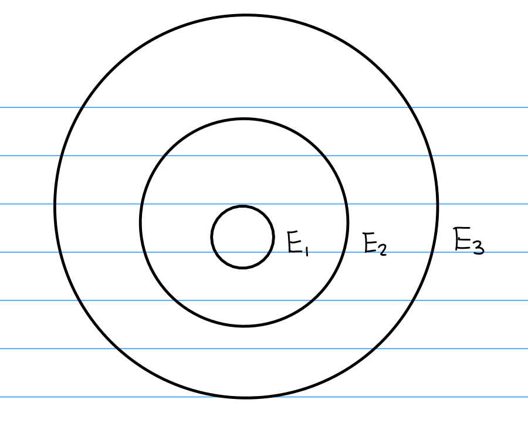
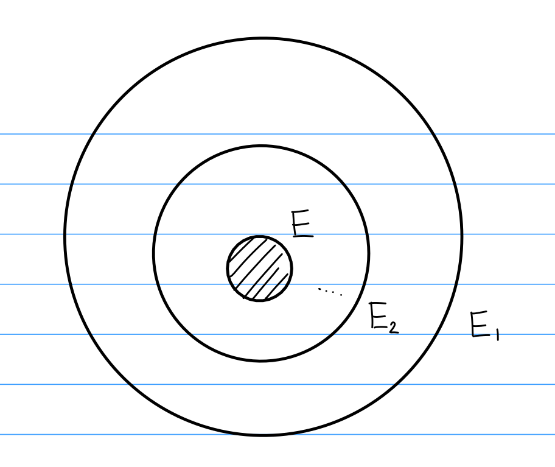
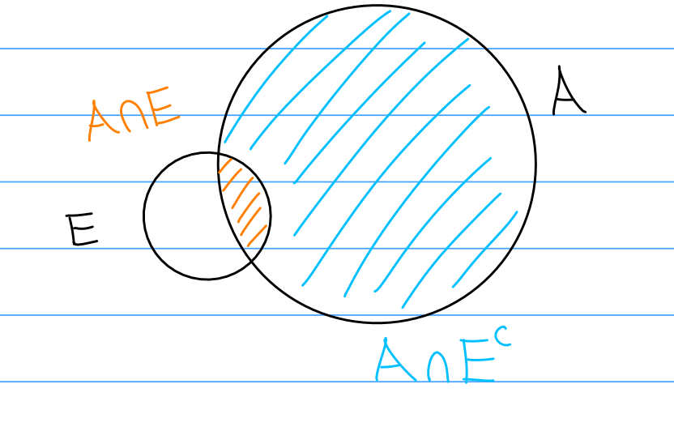
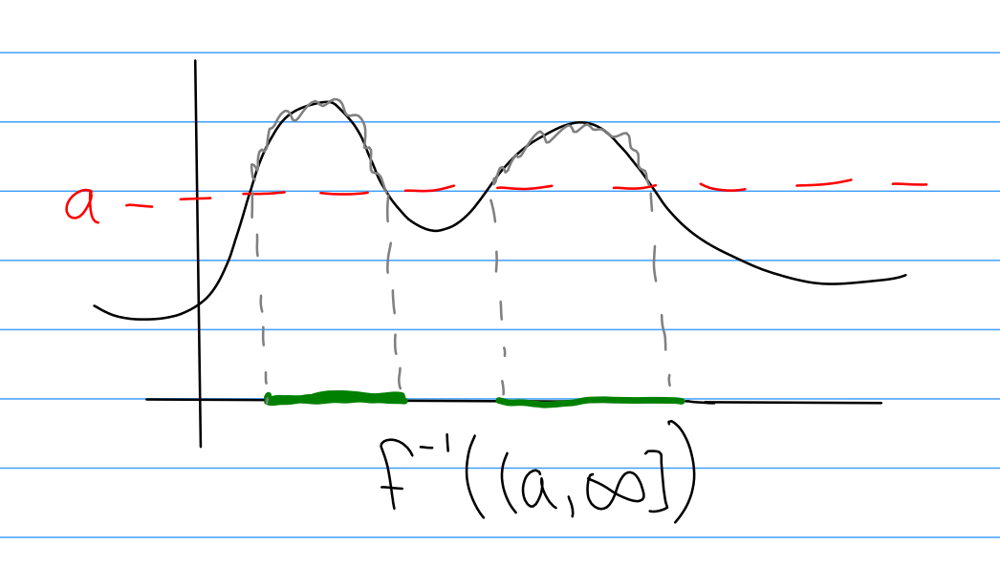
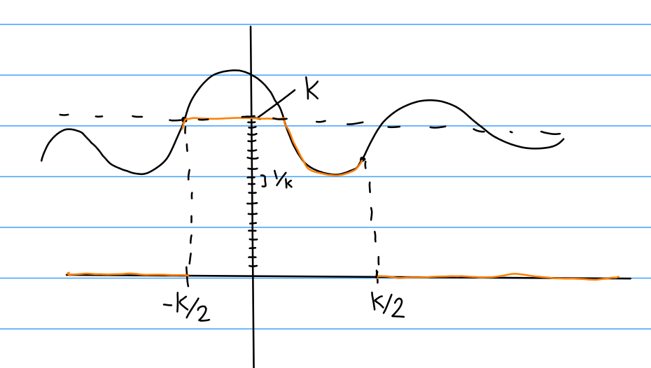

---

# Summary

Measure and integration theory with relevant examples from Lebesgue integration, Hilbert spaces (only with regard to $L^2$), $L^p$ spaces and the related Riesz representation theorem. Hahn, Jordan and Lebesgue decomposition theorems, Radon-Nikodym Theorem and Fubini's Theorem.

*Texts*

- Real Analysis, by E. M. Stein and R. Shakarchi
- Real Analysis, by G. B. Folland
- An introduction to measure theory, by Terrence Tao
- Real and Complex Analysis, by W. Rudin

[An old course page](http://alpha.math.uga.edu/~lyall/8100Fall2014/index.html)

## Big Theorems

- **Bolzano-Weierstrass**: every bounded sequence has a convergent subsequence.
- **Heine-Borel**: in $\RR^n, X$ is compact $\iff X$ is closed and bounded.
- **Monotone Convergence Theorem (MCT)**: If $f_n \in L^+$ and $f_n \nearrow f$ a.e., then $\lim \int f_n = \int \lim f_n = \int f$.
- **Dominated Convergence Theorem (DCT)**: If $f_n \in L^1$ and $f_n \to f$ a.e. with $\abs f_n \leq \abs g$ for some $g\in L^1$, then $\lim \int f_n = \int \lim f_n = \int f$.
- **Fatou**: If $f_n \in L^1$ (with no other real conditions), then $\int \liminf f_n \leq \liminf \int f_n$.

## Big Counterexamples

- Differentiability $\implies$ continuity but not the converse:  The Weierstrass function is continuous but nowhere differentiable.
- $f$ continuous does not imply $f'$ is continuous: $f(x) = x^2 \sin(x)$.
- Limit of derivatives may not equal derivative of limit: $f(x) = \frac{\sin(nx)}{n^c}$ where $0 < c < 1$.
  - Also shows that a sum of differentiable functions may not be differentiable.
- Limit of integrals may not equal integral of limit: $\sum \indic{x = q_n \in \QQ}$.
- A sequence of continuous functions converging to a discontinuous function: $f(x) = x^n$ on $[0, 1]$.

# Lecture 1 (Thu 15 Aug 2019 11:04)

> See Folland's Real Analysis, definitely a recommended reference.

Possible first day question: how can we "measure" a subset of $\RR$? We'd like bigger sets to have a higher measure, we wouldn't want removing points to increase the measure, etc. This is not quite possible, at least something that works on *all* subsets of $\RR$. We'll come back to this in a few lectures.

## Notions of "smallness" in $\RR$

**Definition**Let $E$ be a set, then $E$ is *countable* if it is in a one-to-one correspondence with $E' \subseteq \NN$, which includes $\emptyset, \NN$.

**Definition**A set $E$ is *meager* (or of *1st category*) if it can be written as a countable union of **nowhere dense** sets.

*Exercise*:
Show that any finite subset of $\RR$ is meager.

Intuitively, a set is *nowhere dense* if it is full of holes. Recall that a $X \subseteq Y$ is dense in $Y$ iff the closure of $X$ is all of $Y$. So we'll make the following definition:

**Definition**A set $A \subseteq \RR$ is *nowhere dense* if every interval $I$ contains a subinterval $S \subseteq I$ such that $S \subseteq A^c$.

Note that a finite union of nowhere dense sets is also nowhere dense, which is why we're giving a name to such a countable union above. For example, $\QQ$ is an infinite, countable union of nowhere dense sets that is not itself nowhere dense.

Equivalently,

- $A^c$ contains a dense, open set.
- The interior of the closure is empty.

We'd like to say something is measure zero exactly when it can be covered by intervals whose lengths sum to less than $\varepsilon$.

**Definition**Definition: $E$ is a *null set* (or has *measure zero*) if $\forall \varepsilon >0$, there exists a sequence of intervals $\theset{I_j}_{j=1}^\infty$ such that
$$
E \subseteq \union_{j=1}^\infty \text{ and } \sum \abs{I_j} < \varepsilon.
$$

*Exercise*:
Show that a countable union of null sets is null.

We have several relationships

- Countable $\implies$ Meager, but not the converse.
- Countable $\implies$ Null, but not the converse.

*Exercise*:
Show that the "middle third" Cantor set is not countable, but is both null and meager. Key point: the Cantor set does not contain any intervals.

**Theorem**:
Every $E \subseteq \RR$ can be written as $E = A \disjoint B$ where $A$ is null and $B$ is meager.

> This gives some information about how nullity and meagerness interact -- in particular, $\RR$ itself is neither meager nor null. Idea: if meager $\implies$ null, this theorem allows you to write $\RR$ as the union of two null sets. This is bad!

*Proof*:
We can assume $E = \RR$. Take an enumeration of the rationals, so $\QQ = \theset{q_j}_{j=1}^\infty$. Around each $q_j$, put an interval around it of size $1/2^{j+k}$ where we'll allow $k$ to vary, yielding multiple intervals around $q_j$. To do this, define $I_{j, k} = (q_j - 1/2^{j+k}, q_j + 2^{j+k})$. Now let $G_k = \union_j I_{j, k}$. Finally, let $A = \intersect_k G_k$; we claim that $A$ is null.

Note that $\sum_j \abs{I_{j, k}} = \frac{1} {2^k}$, so just pick $k$ such that $\frac 1 {2^k} < \varepsilon$.

Now we need to show that $A^c \definedas B$ is meager. Note that $G_k$ covers the rationals, and is a countable union of open sets, so it is dense. So $G_k$ is an open and dense set. By one of the equivalent formulations of meagerness, this means that $G_k^c$ is nowhere dense. But then $B = \union_k G_k^c$ is meager.

## $\RR$ is not small

**Theorem**:
$\RR$ is not countable.

**Theorem**:
$\RR$ is not meager. (Baire Category Theorem)

**Theorem**:
$\RR$ is not null.

Note that theorems B and C imply theorem A. You can also replace $\RR$ with any nonempty interval $I = [a,b]$ where $a< b$. This is a strictly stronger statement -- if any subset of $\RR$ is not countable, then certainly $\RR$ isn't, and so on.

*Proof of A:*
Begin by thinking of $I = [0,1]$, then every number here has a unique binary expansion. So we are reduced to showing that the set of all Bernoulli sequences (infinite length strings of 0 or 1) is uncountable. Then you can just apply the usual diagonalization argument by assuming they are countable, constructing the table, and flipping the diagonal bits to produce a sequence differing from every entry.

*Proof (A second proof of A):*
Take an interval $I$, and suppose it is countable so $I = \theset{x_i}$. Choose $I_1 \subseteq I$ that avoids $x_1$, so $x_1\not\in I_1$. Choose $I_2 \subseteq I_1$ avoiding $x_2$ and so on to produce a nested sequence of closed intervals. Since $\RR$ is complete, the intersection $\intersect_{n=1}^\infty I_n$ is nonempty, so say it contains $x$. But then $x\in I_1 \in I$, for example, but $x\neq x_i$ for any $i$, so $x\not\in I$, a contradiction. $\qed$

*Proof of B:*
Suppose $I = \union_{i=1}^\infty A_n$ where each $A_n$ is nowhere dense. We'll again construct a nested sequence of closed sets. Let $I_1 \subseteq I$ be a subinterval that misses all of $A_1$, so $A_1 \intersect I_1 = \emptyset$ using the fact that $A_1$ is nowhere dense. Repeat the same process, let $I_2 \subset I_1 \setminus A_2$. By the nested interval property, there is some $x\in \intersect A_i$.

> Note that we've constructed a meager set here, so this argument shows that the complement of any meager subset of $\RR$ is nonempty. Setting up this argument in the right way in fact shows that this set is dense! Taking the contrapositive yields the usual statement of Baire's Category Theorem.

Consider the Thomae function:
It is continuous on $\QQ$, but discontinuous on $\RR\setminus\QQ$. Can this be switched to get some function $f$ that is continuous on $\RR\setminus \QQ$ and discontinuous on $\QQ$? The answer is no. The set of discontinuities of a function is *always* an $F_\sigma$ set, and $\RR\setminus \QQ$ is not one. Equivalently, the rationals are not a $G_\delta$ set.

Some facts:

- The pointwise limit of continuous functions has a meager set of discontinuities.
- If $f$ is integrable, the set of discontinuities is null.
- If $f$ is monotone, they are countable.
- There is a continuous nowhere differentiable function: let $f(x) = \sum_n \frac{\norm{10^n x}}{10^n}$, and in fact *most* functions are like this.
- If $f$ is continuous and monotone, the discontinuities are null.

**Theorem**:
Let $I = [a,b]$. If $I \subseteq \union_{i=1}^\infty I_i$, then $\abs{I} \leq \sum_{i=1}^\infty \abs{I_i}$.

*Proof*:
The proof is by induction. Assume $I \subseteq \union_n^{N+1} I_n$, where wlog we can assume that $a < a_{N+1} < b \leq b_{N+1}$, then $[a, a_{N+1}] \subset \union_{n=1}^N I_n$ so the inductive hypothesis applies. But then $b-a \leq b_{N+1} - a = (b_{N+1} - a_{N+1}) + (a_{N+1} - a) \leq \sum_{n=1}^{N+1} \abs{I_n}$.

> Note that this proves that the reals are uncountable!

# Lecture 2 (Thursday)

(Find notes for first 15 mins)

- Countable $\implies$ Cantor, all intervals are not countable
- Meager $\implies$ Baire, all intervals are not meager
- Null $\implies$ Borel, all intervals are not null.

Exercise: Verify that $f$ is continuous at $x$ iff $\lim f(x_{n}) = f(x)$ for every sequence $\theset{x_{n}} \to x$.

**Definition:**
If $f: X \to \RR$, the *oscillation* of $f$ at $x \in X$ is given as

\[
\begin{align*}
\omega_{f}(x) = \lim_{\delta \to \infty} \sup_{y \in B_{\delta}(x)} \abs{f(y) - f(z)}
.\end{align*}
\]

Exercise:
Show that $f$ is continuous at $x \iff \omega_f(x) = 0$.

We can then define points of discontinuity as
$$
D_f = \theset{x \in X \suchthat \omega_f(x) > 0} = \union_{n=1}^\infty\theset{x\in X \suchthat \omega_f(x) \geq \frac 1 n}
$$

Exercise: show that $D_f$ is closed.

**Theorem 1:**
$f$ is monotone $\implies D_f$ is countable.

> Hint: we can't cover $\RR$ by uncountable many disjoint intervals.

**Theorem 2:** 
$D_f$ is always an $F_\sigma$ set.

> $\RR - \QQ$ is not at $F_\sigma$ set, i.e. one can not construct a function that is discontinuous on exactly this set.

**Theorem 3:**
$f$ is "1st class" $\implies D_f$ is meager.

> $f$ is first class if $f(x) = \lim_{n\to\infty} f_n(x)$ pointwise and each $f_n$ is continuous.

**Theorem 4 (Lebesgue Criterion):**
Let $f: [a, b] \to \RR$ be bounded, then $f$ is Riemann integrable iff $D_f$ is null.

> So the Dirichlet function is not Riemann integrable.

Exercise: Prove theorems 1 and 2.

## Proof of Theorem 3
Proof of theorem 3: Want to show that $D_f$ is meager. We know it's some countable union of some sets, and it suffices to show that they are nowhere dense.

So let $F_n = \theset{x \suchthat \omega_f(x) \geq 0}$ for some fixed $n$. Let $I$ be an arbitrary closed interval, we will show that there exists a subinterval $J \subseteq I$ with $J \subseteq F_n^c$.

Consider
$$
E_k = \intersect_{i, j \leq k} \theset{x \suchthat \abs{f_i(x) - f_j(x)} \leq \frac 1 {5n}}
$$

Motivation: this comes from working backwards from 4-5 triangle inequalities that will appear later.

Some observations: $E_k$ is closed by the continuity of the $f_i$ (good exercise). We also have $E_k \subseteq E_{k+1}$. Moreover, $\union_k E_k = \RR$ because the $f_i \to f$ are Cauchy.

We'll now look for an interval entirely contained in the complement. Let $I \subset \RR$ be an interval, then write $I = \union_k (I\intersect E_k)$. Baire tells us that $I$ is not meager, so at least one term appearing in this union is *not* nowhere dense, i.e. there is some $k$ for which $I \intersect E_k$ is not nowhere dense, i.e. it contains an open interval (it has a nonempty interior, and its already closed, and thus it contains an interval).

So let $J$ be this open interval. We want to show that $J \subseteq F_n^c$. If $x\in J$, then $x\in E_k$ as well, and so $\abs{f_i(x) - f_j(x)} \leq 1/5n$ for all $i,j \geq k$. So let $i\to \infty$, so $\abs{f(x) - f_j(x)} \leq 1/5n$ for all $j\geq k$.

Now for any $x\in J$, there exists some interval $I(x) \subseteq J$ depending on $x$ such that $\abs{f(y) - f_k(x)} \leq 2/5n$. (where we will rewrite this as $f(y) - f_k(y) + f_k(y) - f_k(x))$.

This implies that $\omega_f(x) \leq 4/5n$. $\qed$.

## Proof of Theorem 4

Suppose that $f: [a,b] \to \RR$ is bounded. Recall that $f$ is Riemann integrable iff for any $\varepsilon$ there exists a partition $P_\varepsilon = \theset{a=x_1 \leq x_2 \leq \cdots x_n = b}$ of $[a,b]$ such that $U(f, P_\varepsilon) - L(f, \varepsilon) \leq \varepsilon$, where this expression is equal to
$$
\sum_n \sup_{y, z \in [x_n, x_{n+1}]} \abs{f(y) - f(z)} (x_{n+1} - x_{n})
$$

$(\Rightarrow)$: Let $\varepsilon > 0$ and $n$ be fixed, and produce a partition $P_\varepsilon$ so that this sum is less than $\varepsilon / n$.

> Recall that we want to show that $F_n$ is null.

Now exclude from this sum all intervals that miss $F_n$, making it no bigger. We also know that in $F_n$, the sups are no greater than $1/n$,
$$
\varepsilon/n \geq \sum \text{stuff} \geq \sum \frac 1 n (x_{n+1} - x_n)
$$

$(\Leftarrow)$: Suppose $D_f$ is null and let $\varepsilon>0$ be arbitrary, we want to construct $P_\varepsilon$. Choose $n > 1/\varepsilon$ and $F_n \subseteq D_f$ is closed and bounded and thus compact. But a compact measure zero interval can in fact be covered by *finitely* many open intervals. So $F_n$ is covered by finitely many intervals $\theset{ I_n }^N$ with $\sum \abs{I_n} \leq \varepsilon$.

Now if $x\not\in F_n$, then $\exists \delta(x) > 0$ where $\sup_{y,z \in B_\delta(x)} \abs{f(y) - f(z)} < \frac 1 n < \varepsilon$

Since $(\union_j I_j)^c$ is compact, there's a finite cover $I_{N+1}, \cdots I_{N'}$ covering $F_n^c$.

# Lecture 3 (Tuesday)

Recall Baire's theorem: $\RR$ can not be written as a countable union of nowhere dense sets. A subset $A\subseteq \RR$ is nowhere dense if every interval contains a subinterval which lies entirely in $A^c$, iff $\overline A$ has empty interior iff $\overline A$ contains no open intervals.

Exercise: show that these definitions are equivalent.

Corollary: $\RR\setminus\QQ$ is not an $F_\sigma$ set. Suppose it was, so $\RR\setminus \QQ = \union_{n\in\NN} F_n$ with $A_n$ closed. 
Then $\RR = \left( \union_n F_n\right) \union \left( \union_i \theset{q_i} \right)$ where $\QQ = \union \theset{q_i}$. 
This exhibits $\RR$ as a countable union of closed sets. 
But the $F_n$ are nowhere dense, since if they contained in interval they'd also contain a rational.

Exercise: Showing that $F_n$ are nowhere dense by constructing a sequence of elements in $F_n$ that converges to an element in $F_n^c \subset \QQ$.

## Riemann Integration

Some good properties:

- Good for approximation (vertical strips)
- Many functions are in $\mathcal R$, e.g. continuous functions.
- $\mathcal R([a, b])$ is a vector space
- The integral is an element of $\mathcal R^\dual$.
- FTC
- $\mathcal R$ is closed under uniform convergence.

Some bad properties:

- The Dirichlet function $\indic{x\in\QQ}$ is not in $\mathcal R$ (Exercise!)
  - **Exercise**: show that $D_f = \RR$ (use sequential continuity)
  - It is in $\mathcal L$ (Lebesgue integral).
- $\mathcal R$ is not closed under pointwise convergence.
  - Example: $g_n(x) = \indic{x\in \QQ,~ x = \frac p q, q \leq n} \in \mathcal R$, but $g_n \not\uniformlyconverges g$. (Exercise)

In fact, there exists a sequence of *continuous* functions $\theset{f_n}$ such that

- $0 \leq f_n(x) \leq 1$ for all $x, n$.
- $f_n(x)$ is decreasing as $n\to\infty$ for all $x$.
- $f \coloneqq \lim f_n \not\in\mathcal R$.

This seems disturbing! The Lebesgue integral fixes this particular problem. Letting
$$
\mathcal L = \theset{f \suchthat f \text{ is Lebesgue integrable }},
$$

we have the following theorem:

**Theorem (Dominated Convergence, Special Case):**

Let $\theset{f_n:[a,b] \to \RR} \subset \mathcal L$, such that $\forall n\in \NN, \forall x, \abs{f_n(x)} \leq M$, if $f_n \to f$ pointwise then $\int f_n \to \int f$.

## Measure Theory

### The Non-Measurable Set
Can we assign a "measure" to all subsets of $\RR^n$?

This should be a function $m: \mathcal P(\RR^n) \to \RR^{\geq 0} \union \infty = [0, \infty]$ with some properties (see handout).

- If $\theset{E_i}_{i\in \NN}$ are disjoint, then $m(\disjoint_{i\in \NN} E_i) = \sum_{i\in\NN} m(E_i)$.
- If $E \simeq F$ by translation/rotation/reflection, then $m(E) = m(F)$.
- $m(Q) = 1$ if $q = [0, 1]^n$.

But so far, this is impossible. There exists a non-measurable set:
Define an equivalence relation $x\sim y \iff x-y \in \QQ$ on $[0, 1)$. Note that each equivalence class bijects with $\QQ$, so each class is countable and there must be an uncountable number of classes. Use the axiom of choice to construct a set $N$ by choosing exactly one element from each equivalence class.

Now let $\QQ \intersect [-1, 1] = \theset{q_j}$, and define $N_j = N + q_j$. Note $j\neq k \implies N_j \intersect N_k = \emptyset$. By translation invariance, $m(N_j) = m(N)$, and $[0, 1) \subseteq \union_j N_j \subseteq [-1, 2]$. But then by taking measures, $1 \leq \sum_j m(N_j) \leq 3$. Using $m(N_i) = m(N)$.

But then $m(N) = 0 \implies 1 > m(N)$, and if $m(N) = \varepsilon$ then $\sum m(N) = \sum \varepsilon
 > 3$.

 Any open set in $\RR$ can be written as a *countable* union of intervals (Exercise). But how do you go to closed sets, or to $\RR^n$? Any open set in $\RR^n$ can be written as an *almost disjoint* union of closed cubes. We can then attempt to ascribe measure by approximating an open set from the inside by cubes, although it's not clear that this is unique (although it is).

# Lecture 4 (Thursday)

Today: 1.2 in Stein, the Lebesgue Outer Measure

Some preliminary results about open sets:

**Theorem 1.3 (Stein):**
Every open subset of $\RR$ can be written as a countable union of disjoint open intervals. Moreover, this representation is unique.

**Theorem 1.4 (Stein):** 
As a partial analog of 1.3, every subset of $\RR^n$ can be written as a countable union of *almost disjoint* closed cubes.

$A, B$ are **almost disjoint** iff $A^\circ \intersect B^\circ = \emptyset$.

We'll now attempt to assign a preliminary notion of measure for all subsets of $\RR$ which extends the notion of volume.

**Definition (Outer Measure):**
If $E \subseteq \RR^n$, then the **Lebesgue outer measure** of $E$, denoted $m_*(E)$, is defined as follows:
$$
m_*(E) = \inf_{\union_{i\in\NN} Q_i \supseteq E, ~ Q_i \text{closed}} \sum_{i\in\NN} \abs{Q_j}
$$
i.e. we take the infimum over all coverings of $E$ by countably many closed cubes.

Remarks:

- $m_*$ is well-defined for *all* subsets $E \subseteq \RR^n$.
- $m_*(E) \in [0, \infty]$
- For all $\varepsilon > 0$, there exists a covering $E \subseteq \union_{i\in \NN}$ such that $\sum_{i\in\NN} \abs{Q_i} \leq m_*(E) + \varepsilon$.
- We would not want to merely require coverings by _finite_ collections of closed cubes.
  (See challenge problem and *Jordan content* of sets)

Examples:
If $E$ is countable, then $m_*(E) = 0$.

This follows from the fact that any point is a closed cube with zero volume

Example:
If $E \subset \RR$, then $E$ is null $\iff m_*(E) = 0$.
$\implies:$ We can cover by open intervals with lengths summing to $<\varepsilon$, so just close them (which doesn't increase the length).

$\impliedby$: Easy exercise. Increase the length of the $n$th open interval by $\varepsilon / 2^n$.

Example:
If $Q$ is a closed cube, the $m_*(Q) = \abs{Q}$, the usual volume.

Since $Q \subseteq Q$, $Q$ covers itself and $m_*(Q) \leq \abs{Q}$. For the other direction, fix $\varepsilon > 0$; we will show $\abs{Q} \leq m_*(G) + \varepsilon$ for every $\varepsilon$.

Let $\theset{Q_j}$ be an arbitrary covering of $Q$ by closed cubes. Idea: enlarge the cubes a bit so they're open, and use compactness to get a finite subcover.

Let $S_j$ denote an open cube with the property that $Q_j \subseteq S_j$ and
$$
\abs{Q_j} \leq \abs{S_j} \leq (1+\varepsilon)\abs{Q_j}
$$
Since $Q$ is compact, there is a finite $N$ such that $E \subseteq \union_{j=1}^N S_j$, and the claim is that $\abs{Q} \leq \sum_{j=1}^N \abs{S_j}$ (Lemma 1.2, Stein).

> Recall 1-dimensional setting, we did the same thing to prove that $\RR$ was not null.

We then have
$$
\abs{Q} \leq \sum_{j=1}^N \abs{S_j} \leq (1+\varepsilon) \sum_{j=1}^N \abs{Q_j} \leq (1+\varepsilon) \sum_{j=1}^\infty \abs{Q_j},
$$

which is what we wanted to show.

Exercise: Let $Q$ be open, show $m_*(Q) = \abs Q$.

1. $m_*(\RR^n) = \infty$
This would follow if we could show that $\abs{Q} \leq m_*(\RR^n)$ for any $Q$, and we can take $Q$ to be arbitrarily large.

This is because any covering of $\RR^n$ is also a covering of $Q$.

Properties of Outer Measure

1. Monotonicity: If $E_1 \subseteq E_2$ then $m_*(E_1) \leq m_*(E_2)$.
2. Countable Subadditivity: If $E = \union_{i\in\NN} E_i$ for any countable union, then
$$
m_*(\union E_i) \leq \sum m_*(E_i)
$$

3. If $E \subseteq \RR^n$ then $\forall \varepsilon > 0$ there exists an *open* set $G \supseteq E$ such that
$$
m_*(E) \leq m_*(G) \leq m_*(E) + \varepsilon.
$$

> Note: This does not imply every set is measurable! It is not the case that $m_*(G) - m_*(E) \neq m(G\setminus E)$. If we try to write $G = E \disjoint (G\setminus E)$, we only get an equality if there's a positive distance between these two sets! Otherwise, we only have subadditivity, and $m_*(G\setminus E) \geq m_*(G) - m_*(E)$. But this is the wrong direction if we want to say something like $m_*(G) - m_*(E) \leq \varepsilon$.

4. If $E_1, E_2 \subseteq \RR^n$ and
\[
\begin{align*}
\mathrm{dist}(E_1, E_2) \coloneqq \inf_{x\in E_1, y\in E_2} \abs{x - y} > 0 \implies \\
m_*(E_1 \union E_2) = m_*(E_1) + m_*(E_2)
.\end{align*}
\]

5. If $E = \union_{j\in \NN}Q_j$ with the $Q_j$ *almost disjoint*, then $m_*(E) = \sum \abs{Q_j}$.

> Remark: Property 4 does not hold in general if we merely assume that $E_1 \intersect E_2 = \emptyset$. It *will* be true if we restrict the collection of sets we consider to be "measurable", so any counterexample will have to involve a pathological set.

> Warning: Any $E_j$ could have $m_*(E) = \infty$, so we have to be careful with our assumptions and how we work with inequalities, particularly when subtracting measures.

Proof:

1. Obvious since any covering of $E_2$ is also a covering of $E_1$. We're taking infimums over *large* collections of sets, so it could only get smaller.

2. If $m_*(E_j) = \infty$ for any $j$, this is vacuous, so assume $m_*(E_j) < \infty$ for every $j$.
Let $\varepsilon > 0$. For each $j$, there exists a covering $E_j \subseteq \union_k Q_{j, k}$ where $\sum_k \abs{Q_{j,k}} \leq m_*(E_j) + \varepsilon / 2^j$.

But now $E \subseteq \union_{j, k} Q_{j, k}$, so
$$
m_*(E) \leq \sum_{j, k} \abs{Q_{j, k}} = \sum_j \sum_k \abs{Q_{i, j}} \leq \sum_j (m_*(E_j) + \varepsilon/2^j) = \varepsilon + \sum_j m_*(E_j).
$$

3. Idea: enlarge open sets in a summable way?

Let $\varepsilon > 0$. Then there exists a covering $E \subseteq \union_{j\in \NN} Q_j$ such that $\sum \abs{Q_j} \leq m_*(E) + \varepsilon/2$. Let $S_j$ be an open cube such that $Q_j \subset S_j$ and $\abs{S_j} \leq \abs{Q_j} + \varepsilon/2^{j+1}$.

So define $G = \union S_j$, which is open. Now using subadditivity, we have
$$
m_*(G) \leq \sum_j \abs{S_j} = \sum_j \left( \abs{Q_j} + \varepsilon/2^{j+1} \right) \leq m_*(E) + \varepsilon.
$$

4. Just need to show $m_*(E_1 \union E_2) \leq m_*(E_1) + m_*(E_2)$, since the reverse direction follows from (2). Key idea: by subdividing cubes, we can assume that no cube intersects both sets.

> Remark: It is possible to construct closed disjoint subsets of $\RR^n$ such that the distance between them is still zero. Take $X = \NN$ and $Y = \theset{n + \frac 1 {2n} \suchthat n \in \NN}$.

Exercise (a good one): Show that if $F$ is closed and $K$ is **compact**, then $\mathrm{dist}(X, Y) > 0$.

# Lecture 5 (Wed 28 Aug 2019, 1:30 PM)

**Definition (Lebesgue Outer Measure):**
For any $E \subseteq \RR^n$ define
$$
m_*(E) = \inf \sum \abs{Q_i}
$$

where the $\inf$ is taken cover all countable coverings of $E$ by closed cubes $Q_i$.

Proof of property (4):
Since we have property (2), we just need to show $m_*(E_1 \union E_2) \geq m_*(E_1) + m_*(E_2)$. Choose $\delta$ such that $0 < \delta < \mathrm{dist}(E_1, E_2)$ and let $\varepsilon > 0$.

Then there exists a covering of $E_1 \union E_2$ such that
$$
m_*(E_1 \union E_2) \leq \sum \abs{Q_i} \leq m_*(E_1 \union E_2) + \varepsilon.
$$

We can assume (possibly after subdividing) that $\mathrm{diam}(Q_i) < \delta$.
Then each $Q_i$ can intersect at most one of $E_1, E_2$.
Let $J_1 = \theset{j \suchthat Q_j \intersect E_1 \neq \emptyset}$ and $J_2 = \theset{j \suchthat Q_j \intersect E_2 \neq \emptyset}$. Note that $J_1, J_2$ are disjoint, and we have $E_1 \subseteq \union_{j\in J_1} Q_j$ and likewise for $E_2$.

But then $m_*(E_1) + M_*(E_2) \leq \sum_{j\in J_1} \abs{Q_j} + \sum_{j\in J_2} \abs{Q_j}$ by definition, since $m_*$ is an infimum. But this is less than summing over *all* $j$, which is the term appearing in the cover we choose above.

Proof of property (5):
Let $\varepsilon > 0$, we will show
$$
\sum \abs{Q_j} \leq m_*(E) + \varepsilon.
$$

Shrink the cubes: choose $\tilde{Q_j} \leq \abs{Q_j} \leq \abs{\tilde{Q_j}} + \varepsilon /2^j$.
Then for any finite $N$, any collection of $N$ different $Q_j$s are disjoint.

> If $K$ is compact, $F$ closed, and $K \intersect F = \emptyset$, the $\mathrm{dist}(K, F) > 0$. (Exercise)

Note that although this is certainly true for the *entire* infinite collection, we take finitely many so we can get a $\delta$ that uniformly bounds the distance between any two from below.

But then
$$
m_*(\union_{j=1}^N \tilde{Q_j}) = \sum_{j=1}^N \abs{\tilde{Q_j}} \geq \sum_{j=1}^N \abs{\tilde{Q_j}} - \varepsilon
$$

and since $\union_{j=1}^N \tilde{Q_j} \subseteq E$, for all $N$ we have $\sum_{j=1}^N \abs{\tilde{Q_j}} -\varepsilon \geq m_*(E)$. (Missing details, finish/fill in.)

**Definition (Measurable):**

A set $E\subseteq \RR^n$ is (Lebesgue) measurable if
$$
\forall \varepsilon >0 \quad \exists G ~\text{open}~ \suchthat \quad m_*(G\setminus E) < \varepsilon.
$$
Observation:
If $m_*(E) = 0$, the $E$ is automatically measurable.
If $F\subseteq E$ and $m_*(E) = 0$, then $F$ _is measurable_.

# Lecture 6

Recall the definition of the Lebesgue measure:

**Definition:**
For any $E \subseteq \RR^n$, we define
$$
\mu(E) = \inf \theset{\sum \abs {Q_i} \suchthat E \subset \union Q_i, Q_i ~\text{a closed cube}}
$$
This satisfies properties (1) through (5).

> Note we don't have finite additivity for the outer measure.

$E$ is said to be *measurable* if
$$
\forall\varepsilon > 0, \exists G \supseteq E ~\text{open}~ \suchthat\quad m_*(G\setminus E) < \varepsilon.
$$

Some observations:

- If $E$ is open, $E$ is measurable
- If $m_*(E) = 0$, then $E$ is measurable. (Quite a special property!)
- If $E$ is closed, $E$ is measurable. (Needs a proof.)

**Theorem:**
The collection $\mathcal M$ of all measurable sets is a *$\sigma\dash$algebra*, i.e. $\mathcal M$ is closed under

- Countable unions,
- Complements,
- Countable intersections.

**Theorem:**
The Lebesgue measure (on measurable sets) is countably additive, i.e. if $\theset{E_i}_{i\in\NN}$ is a countable collection of *pairwise disjoint* measurable sets, then
$$
m(\union E_i) = \sum m(E_i).
$$

Proof of Theorem 1:

Part 1:
Let $E = \union_{i\in \NN} E_i$ with each $E_i$ measurable; we want to show $E$ is measurable. Given $\varepsilon > 0$, for each $j$ choose $G_j \supseteq E_j$ such that $m_*(G_j \setminus E_j) < \varepsilon /2^j$. Then let $G = \union G_j$, which is open and $G \supseteq E$ and $G\setminus E = \union G_j\setminus E_j$. Using monotonicity, and then subadditivity, we have
$$
m_*(G\setminus E) =  m_*(\union G_j \setminus E_j) \leq \sum m_*(G_j - E_j) \leq \sum \varepsilon /2 = \varepsilon.
$$
Part 2:
Let $E \in \mathcal M$. Then for all $k\in \NN$, there is an open $G_k \supseteq E$ with $m_*(G_k\setminus E) \leq \frac 1 k$.

> Lemma to prove later: $G_k^c$ is closed and measurable.

By (1), the set $S \coloneqq \union G_k^c$ is measurable, and $S \subseteq E^c$, since $E^c = S \union (E^c \setminus S)$. So we just need to show that $E^c \setminus S = E^c \intersect S^c$ is measurable.

But where does $S$ live? Since $E^c \setminus S \subset G_k \setminus E = G_k \intersect E^c$ for every $k$, we have $m_*(E^c \setminus S) \leq m_*(G_k\setminus E) < \frac 1 k$ for all $k$, which says that $m_*(E^c\setminus S) = 0$ and thus $E^c \setminus S$ is measurable (think further about why outer measure zero sets should be measurable!)

Next time: closed sets are measurable, proof of theorem 2, and characterizations of measurability.

# Lecture 7

Recall that a set $E$ is *Lebesgue measurable* iff there exists an open set $G$ with $E \subseteq G$ and $m(G\setminus E) < \varepsilon$ for any $\varepsilon > 0$, and the set $\mathcal M$ of all measurable sets forms a $\sigma\dash$algebra.

Fact:
If $F, K \in \RR^n$ with $F$ closed, $K$ compact, and $F \intersect K = \emptyset$, then $\mathrm{Dist}(F, K) > 0$.

Towards a contradiction, suppose the distance in zero. Idea: we'll use sequential compactness.
We can produce sequences $\theset{x_n} \subset F, \theset{y_n}\subset K$ such that $\abs{x_n - y_n} \to 0$.
Since $K$ is compact, it is sequentially compact, so there is a subsequence $\theset{y_{n_k}}$ with $y_{n_k} \to y \in K$.

Then
$$
\abs{x_{n_k} - y} \leq \abs{x_{n_k} - y_{n_k}} + \abs{y_{n_k} - y} \to 0. \qed
$$

We used the following:

Lemma:
Closed sets are measurable.

Proof:
Claim: It suffices to prove this for *compact* sets.
Let $F$ be closed. Then write $F = \union_k (F \intersect B(k, 0))$. But $F\intersect B(k, 0)$ is closed and bounded, thus compact. So if we show compact sets are measurable, we've written $F$ as a countable union of measurable sets, which is thus measurable.

So suppose $K$ is compact, we want to show that $m_*(K) < \infty$. Given $\varepsilon > 0$, we can find an open set $G \supseteq K$ such that $m_*(G) < m_*(K) + \varepsilon$. Now, *since $K$ is bounded*, the outer measure is not infinite, and so we have $m_*(G) - m_*(K) < \varepsilon$.

Goal: we now want to show $m_*(G\setminus K) \leq m_*(G) + m_*(K)$.

Since $G$ is open, $G\setminus K$ is open as well.
We can write any open set as the union of almost disjoint closed cubes, so we have
$$
G\setminus K = \union_j Q_j,\quad \theset{Q_j} \text{ a collection of almost disjoint cubes.}
$$
Now by property (5), we have $m_*(G\setminus K) = \sum_j \abs{Q_j}$.
Since any finite union of closed sets is closed, we have $K \intersect (\union_{j=1}^N Q_j) = \emptyset$.
But then $\mathrm{dist}(K, \union^N Q_j) > 0$. Using (1) and (4),
\[
\begin{align*}
m_*(G) \geq m_*(K \union (\union^N) Q_j) = m(K) = m(\union^N Q_j) = m_*(K) + \sum^N \abs{Q_j},
.\end{align*}
\]

and since $K$ is bounded and thus of finite measure, we obtain
$$
\sum^\infty \abs{Q_j} \leq m_*(G) - m_*(K).
$$

## Characterizations of Measurability

A set $E\subseteq \RR^n$ is measurable iff

1. For any $\varepsilon,~\exists F\subseteq E$ with $F$ closed and $m_*(E\setminus F) < \varepsilon$.
2. There exist $F$ closed, $G$ open, $F \subseteq E \subseteq G$ with $m_*(G\setminus F) < \varepsilon$.

We know that $E$ is measurable iff $E^c$ is measurable, so we'll apply the definition to $E^c$. So we know
$$
\forall \varepsilon > 0,~ \exists \text{ open } G \supseteq E^c \suchthat m_*(G\setminus E^c) < \varepsilon .
$$

and so
$$
\forall \varepsilon > 0,~ \exists \text{ closed } G^c \subseteq E \suchthat m_*(E \setminus G^c) < \varepsilon .
$$

since $G\setminus E^c = G \intersect E = E \setminus G^c$.
So just take $F = G^c$ and we're done.

**Definition:** 
A $\sigma\dash$algebra is any collection of sets which is closed under complements and countable unions.

> Note that if we intersect $\sigma\dash$algebras, we still get a $\sigma\dash$algebra.
Examples:

- $\mathcal P(\RR^n)$
- $\mathcal M$, the collection of all (Lebesgue) measurable sets.
- $\mathcal B(\RR^n)$, the *Borel* subsets of $\RR^n$, i.e. the smallest $\sigma\dash$algebra containing the open sets.

We have the inclusions
$$
\mathcal P(\RR^n) \supsetneq \mathcal M(\RR^n) \supsetneq \mathcal B(\RR^n).
$$

> Qual problem alert!

$E \subseteq \RR^n$ is measurable $\iff E = H \union Z$ where $H \in F_\sigma$ and $Z$ is null $\iff E = V\setminus Z'$ where $V\in G_\delta$ and $Z'$ is null.

Exercise: show both directions!!

Proof: $\impliedby$ is the easy direction.

$\implies$: For all $k \in \NN$, we can find $F_ k\subseteq E \subseteq G_k$ with $F_k$ closed, $G_k$ open, and $m_*(G_k\setminus F_k) < \frac 1 k$.
So let $V = \intersect G_k$ and $H = \union F_k$. Then $H \subseteq E \subseteq V$. Note that $H$ is an $F_\sigma$ and $V$ is a $G_\delta$.

Moreover, $V\setminus H \subseteq G_k \setminus F_k$ for all $k$.
By subadditivity, $m_*(V\setminus H) \leq m_*(G_k \setminus F_k) \to 0$.

Now, $E = H \union(E \setminus H)$ where $E\setminus H \subseteq V\setminus H$ which is a null set. We also have $E = V \setminus (V \setminus E)$ where $V\setminus E \subseteq V\setminus H$, which is null.
$\qed$

Recall that if $E$ is measurable, we define the Lebesgue measure by $m(E) = m_*(E)$.

**Theorem 2:**
The Lebesgue measure is countably additive, i.e.
$$
E_i \intersect E_j = \emptyset \implies m(\union E_i) = \sum m(E_i).
$$

Proof:
Assume each $E_j$ is bounded, so that $m_*(E_j) < \infty$. Given $\varepsilon > 0$, for each $j$ we can find a *compact* $K_j$ such that $m(E_j \setminus K_j) \leq \varepsilon / 2^j$.

Then for any finite $N$, since the $E_j$ are disjoint, then $\theset{K_i}_{i=1}^N$ are also disjoint, so
$m(\union^N K_j) = \sum m(K_j)$.

However, we have $m(E_k) - m(K_j) < \varepsilon / 2^j$, and so $m(K_j) > m(E_j) - \varepsilon / 2^j$. Then
$$
m(\union^N K_j) = \sum m(K_j) \geq \sum m(E_j) - \varepsilon / 2^j = \sum m(E_j) - \varepsilon.
$$

But since $\union^N K_j \subset E \coloneqq \union^\infty E_j$, so
\[
\begin{align*}
m(E) \geq m(\union^N K_j) \geq \sum^N m(E_j) \implies \\
\sum^n m(E_j) \leq m(E) + \varepsilon \forall N \implies \\
\sum^\infty m(E_j) \leq m(E) + \varepsilon,
.\end{align*}
\]

but $\varepsilon > 0$ was arbitrary, so this shows the bounded case.

In general, let
\[
\begin{align*}
A_1 = B(1, 0) \\
A_2 = B(2, 0) \setminus B(1, 0) \\
\cdots
.\end{align*}
\]

Then let $E_{i, j} = E_i \intersect A_j$, so $\union_i E_i = \union_{i, j} E_{i, j}$, where all of the $E_{i, j}$ are still disjoint but also now bounded.

Then
$$
m(\union E_j) = m(\union_{i, j} E_{i, j}) = \sum_j \sum_i m(E_{i, j}) = \sum_j m(E_i),
$$
where we've applied the special bounded case in the last two equalities.

# Lecture n: A Brief Introduction to (Actual) Measure Theory

Instead of just $\RR^n$, just consider a set $X$ with a $\sigma\dash$algebra $\mathcal A$.
Then the pair $(X, \mathcal A)$ is a *measurable* space, i.e. it is ready to be equipped with a measure.

A *measure* space is a measurable space with a *measure*.

**Definition:**
A set function $\mu: \mathcal A \to [0, \infty]$ satisfying

- $\mu(\emptyset) = 0$
- $\mu$ is countably additive,

is said to be a *measure*.

> What we've done so far is construct something we've called "the Lebesgue measure", then verified that it was actually a measure. We constructed a set function on $\RR^n$ called $m$ (the outer measure), then restricted attention to a class of sets $\mathcal M$, and produced a measure space $(\RR^n, \mathcal M, m)$.

Note that countable additivity implies monotonicity and subadditivity, which were what we originally discovered about $m_*$.

**Theorem (Fundamental Theorem of Measure Theory, i.e. continuity from above and below):**

Let $\theset{E_i} \subseteq \mathcal M$.

- If $E_i \nearrow E$, so $E_1 \subseteq E_2 \subseteq \cdots$ and $\union E_i = E$, then $\mu(E) = \lim \mu(E_i)$ (continuity from below).
- If $E_i \searrow E$, so $E_1 \supseteq E_2 \supseteq \cdots$ and $\intersect E_i = E$, then $\mu(E) = \lim \mu(E_i)$ as long as $\mu(E_1) < \infty$i (continuity from above).

Exercise:
Show that $\mu(E_1) < \infty$ is necessary in the 2nd result above.

Proof:

(1)

Let $A_1 = E_1, A_2 = E_2 \setminus E_1, \cdots A_j = E_j \setminus E_{j-1}$.
Then $\theset{A_j}$ are disjoint, and $E = \disjoint A_j$, so
\[
\begin{align*}
m(E) &= \sum_j m(A_j) \\
&= \lim_{k\to\infty} \sum _{j=1}^k \mu (A_j) \\
&= \lim_{k\to\infty} \mu(\union_{j=1}^k A_j) \\
&= \lim_{k\to\infty} \mu (E_k). \quad \qed
\end{align*}
\]
(2)

Let $A_i = E_j\setminus E_{j+1}$, so $\theset{A_i}$ are disjoint.
Then (important!!) $E_1 = \union A_i \union E$, which are disjoint and measurable. Then,
\[
\begin{align*}
\mu(E_1) &= \sum \mu(A_i) + \mu(E) \\
&= \lim_{k\to\infty} \sum_{i=1}^{k-1} \mu(A_j) \\
&= \lim_{k\to\infty} \sum_{i=1}^{k-1} \mu(E_i) - \mu(E_{i+1}) + \mu(E),\quad\text{(which is telescoping)} \\
&= \lim_{k\to\infty} (\mu(E_1) - \mu(E_k)) + \mu(E) \\
\implies \mu(E_1) &= \mu(E_1) - \lim_k \mu(E_k) + \mu(E) \quad\text{since } \mu(E_1) < \infty \\
\implies \mu(E) &= \lim_k \mu(E_k) \hfill \qed
.\end{align*}
\]
Recall that if $E\subseteq \RR^n$, then
\[
\begin{align*}
m_*(E) = \inf\theset{m_*(G) \suchthat E\subset G~\text{open}} \\
\iff \forall \varepsilon > 0,~~ \exists G \supseteq E \suchthat m_*(G) \leq m_*(E) + \varepsilon
.\end{align*}
\]
> Note: this says that the measure is *regular*.

**Theorem:**
If $E\subseteq \RR^n$ is measurable, then
\[
\begin{align*}
m(E) = \sup\theset{m(K) \suchthat K\subseteq E~\text{and $K$ is compact}} \\
\iff \forall \varepsilon \exists K\subseteq~\text{compact}~ \suchthat m(K) \geq m(E) - \varepsilon
.\end{align*}
\]

Proof:

Case 1: Suppose $E$ is bounded.

Let $\varepsilon > 0$, then by the closed characterization of measurability, we have $m(E\setminus F) < \varepsilon$ for some closed set $F\subseteq E$. Since $E$ is bounded, $m(E) < \infty$, and so
\[
\begin{align*}
m(E\setminus F) < \varepsilon \\
m(E) - m(F) < \varepsilon \\
m(F) > m(E) - \varepsilon
.\end{align*}
\]
where since $F$ is a closed and bounded set in $\RR^n$, $F$ is compact.

Case 2:
Suppose $E$ is unbounded.
Write $E_j = E \intersect B(j, 0)$, so $E_j \nearrow E$.
Using continuity from below, we have $m(E) = \lim m(E_j)$.

Suppose $m(E) < \infty$.
Then for some $j$, $m(E_j) \geq m(E) - \varepsilon$.
But $E_j$ is bounded.
By case 1, there is a compact $K \subseteq E_j$ where $m(K) \geq m(E_j) - \varepsilon$.
But then $m(K) \geq m(E) - 2\varepsilon$.

Suppose now that $m(E) = \infty$.
For any $M > 0$, we can find an $E_j$ such that $m(E_j) > M$. Since $E_j$ is bounded, by case 1 we get a compact $K \subseteq E_j \subseteq E$ with $m(K) > M$.

> Note: Very similar arguments are often used on the quals.

## Caratheodory Characterization

A subset $E\subseteq \RR^n$ is measurable iff for all $A\subseteq \RR^n$,
$$
m_*(A) = m_*(E\intersect A) + m_*(E \intersect A^c).
$$

Note that this can be interpreted in terms of *inner measures*, in which we're approximating $E$ with cubes from the inside. If we also think of this in terms of probability spaces, we could interpret the RHS as saying that the probability of an event either happening or *not* happening should be 1.

> Note: $G_\delta$ sets are measurable.

Note that the $\leq$ case is satisfied automatically by subadditivity, and the $\geq$ case comes from if $A\subseteq V$ then
\[
\begin{align*}
m(A) \geq \cdots \text{Exercise!}
.\end{align*}
\]

**Theorem:**
Let $E\subseteq \RR^n$ be measurable. Then

1. For all $h\in \RR^n$, then $E+h$ is measurable, and $\mu(E+h) = \mu(E)$.
2. For every $x\in \RR$, the set $cE$ is measurable and $\mu(cE) = \abs{c}^n \mu(E)$.

We can say more, and determine measures of all linear transformations of a set in terms of the determinant. Note that because we're working with cubes in the outer measure, so the only content here is that these new sets are actually measurable.

If $E$ is measurable, $E = H \union Z$ where $H \in F_\sigma$ and $\mu(Z) = 0$. But then $E+h = (H+h) \union (Z + h)$, but $H+h$ is still $F_\sigma$ because shifts of closed sets are still closed. Moreover, $\mu(Z+h) = \mu(Z) = 0$, so were done.

Moral: it suffices to check things on Borel sets.

# Lecture: Measurable Functions

Let $E\subseteq \RR^n$ be measurable. Then $f: E \to \RR \union \theset{\pm \infty}$ is *Lebesgue measurable* iff $\theset{x \in E \suchthat f(x) > a} = f\inv((a, \infty])) \in \mathcal M$, the collection of Lebesgue measurable sets, for every $a\in\RR$.

Similarly, $E$ is Borel measurable if we replace $\mathcal M$ by $\mathcal B$, the collection of all Borel measurable sets.

As usual, there are many different characterizations:

- $f\inv((a, \infty])) \in \mathcal M \quad\forall a\in \RR$, since we can write this as $\intersect f\inv((a - \frac 1 k, \infty])$, which are all measurable.
- $f\inv([a, \infty]) \in \mathcal M \quad\forall a\in \RR$, by taking complements
- $f\inv([-\infty, a]) \in \mathcal M \quad\forall a\in \RR$.

**Theorem:**
If $f: E\to \RR$ is finite-valued, then $f$ is measurable $\iff f\inv(G) \in \mathcal M$ for all open $G\subseteq \RR$.

Proof:

$\impliedby$: Easy, since $(a, \infty)$ is always an open set.

$\implies$: Suppose $f$ is measurable and let $G\subseteq \RR$ be open, then $G = \disjoint I_i$ where each $I_i$ is an interval. Then $f\inv(G) = \union f\inv(I_i)$.

But if $I_i = (a, b)$, then $f\inv(I_i)= f\inv((a, \infty)) \intersect f\inv((-\infty, b))$, both of which are measurable by definition.

Corollary:
Continuous functions are in fact Borel measurable, and in particular Lebesgue measurable.

**Proposition:**
If $f: E\to \RR$ is measurable and $\varphi: \RR\to \RR$ is continuous, then $\varphi \circ f$ is measurable.

> Note: This condition can not be relaxed to just $\varphi$ being measurable. However, this does work if you require that $\varphi$ is Borel measurable.

Proof:
Let $G \subseteq \RR$ be open. Then $(\varphi \circ f)\inv (G) = f\inv(\varphi\inv(G)) \in \mathcal M$. But $\varphi\inv(G)$ is open since $\varphi$ is continuous, and thus measurable, and since $f$ is a measurable function, this pulls back to a measurable set, so the composition is measurable.

Consequences of this proposition:
If $f$ is measurable, then so is $\abs f, \abs{f}^p, f^2, e^{cf}$, for any constant, etc.

We will show that $\mathcal M$ is closed under most algebraic and limiting operations.

**Theorem 2:**
If $f, g$ are $\RR\dash$valued measurable functions, then $fg$ and $f+g$ are measurable.

> Note that we already know this for $g$ a constant, since $x \mapsto x+c$ and $x\mapsto cx$ are continuous functions.

Proof:
To come later.

An interesting consequence: if $f,g$ are measurable then $\max(f, g)$ is as well, since
$$
\max(f, g) = \frac{(f + g) + \abs{f-g}}{2}.
$$
**Theorem:**
If $\theset{f_n}$ is a sequence of $\overline{\RR}\dash$valued measurable functions, then

1. $\sup_n f_n, \inf_n f_n$ are measurable
2. $\limsup_n f_n \definedas \inf_n \sup_{k\geq n} f_k$ is measurable, as is the $\liminf f_n$.

> Note that this implies that if $f_n \to f$ pointwise and each $f_n$ is measurable, then $f$ is measurable.

Proof of Theorem 2:

Suppose $f,g$ are measurable and finite-valued.
Let $a\in \RR$ and consider $S = \theset{x \suchthat f(x) + g(x) > a }$.
Then $S = \theset{ x \suchthat f(x) > -g(x) + a }$, where $f$ is measurable and so is $-g + a$.
With the following lemma, we'll be done.

Lemma:
If $f, h$ are measurable, then $S = \theset{x \suchthat f(x) > h(x) }$ is always a measurable set.
Since $f(x) > h(x)$, there is a rational $q$ such that $h(x) < q < f(x)$.
But then $S = \union_{q\in\QQ} \theset{x \suchthat f(x) > q > h(x)} = \theset{f > q} \intersect \theset{h < q}$, both of which are measurable.

> For the set equality, just check that $x\in S \implies x \in \union\text{stuff}$, and $x\not\in S \implies x \not \in \union \text{stuff}$.

> Note: $fg = \frac{(f+g)^2 - (f-g)^2}{4}$.

Proof of Theorem 3:

Since $\inf_n f_n(x) = - \sup f_n(x)$, we only need to show that $\sup f_n$ is measurable.

For any given $a$, we want to show that $S = \theset{x \suchthat \sup_n f_n(x) > a}$ is measurable.
Then there is some $n$ for which $f_n(x) >  a$, and the claim is that $S = \union_n \theset{x \suchthat f_n(x) > a}$.
But this follows formally by just checking set inclusions. So $S$ is a countable union of measurable sets and thus measurable.

**Definition:**
If $f,g: E \to \overline \RR, \CC$ then $f=g$ *almost everywhere* (or $f=g$ a.e.) iff $\theset{x \suchthat f(x) \neq g(x)}$ is null.

Fact:
If $f$ is measurable and $f=g$ a.e., then $g$ is measurable.

This follows because $\theset{g > a} = \theset{f > g} \union Z$, where $Z \subseteq \theset{f\neq g}$ which is null, and thus $Z$ is null.

Fact:
If $\theset{f_n}$ is a sequence of measurable functions and $f_n \to f$ pointwise a.e., then $f$ is measurable.

Note that we've replaced open, continuous, uniform etc with a new notion of "measurable" everywhere. A point is that this new notion isn't so far from the original ones, but allows much more to be done.

Littlewood's Principles:

- Every measurable set is *nearly open* (See *Lebesgue density*)
- Every measurable function is *nearly continuous* (See *Lusin's Theorem*)
- Every convergent sequence of measurable functions is *nearly uniformly convergent* (See *Egorov's Theorem*)

# Lecture qqq

Let $E \subseteq \RR^n$ be measurable. Then the *characteristic function* of $E$ is defined as
\[
\begin{align*}
\chi_E(x) \coloneqq \begin{cases} 1 & x \in E \\ 0 & \text{else.} \end{cases}
\end{align*}
\]

A *step function* is a function of the form $S(x) = \sum_{i=1}^N a_i \chi_R(x)$ where $R$ is some rectangle.

A *simple function* is a function of the form $s(x) = \sum_{i=1}^N a_j \chi_E(x)$ where $E$ is measurable.

**Theorem 1:**
If $f: E \to [0, \infty]$ is a measurable function (note that this is positive valued), then there exists a sequence of simple functions $\theset{s_k}$ such that $s_k(x) \leq s_{k+1}(x)$ for all $x$ and $k$, and $\lim_{k\to\infty} s_k(x) = f(x)$ for all $x$.

Corollary: This holds for $f: E \to \overline \RR$, not just positive functions.

Proof: Write $f = f^+ - f^-$, where $f^+(x) = \max\theset{f(x), 0}$.

**Theorem 2:**
If $f: E \to \overline \RR$ is measurable, there exists a sequence $\psi_k$ of *step* functions such that $\psi_k \to f$ a.e.

Proof:
See homework 3, number 1c.

**Theorem (Lebesgue density):**
If $E\subseteq \RR^n$ is measurable, then
\[
\begin{align*}
\lim_{r\to 0^+} \frac{m(E \intersect  B(r, x))}{m(B(r, x))} = 1 \quad  \text{for almost every } x \in E. 
\end{align*} 
\]
**Theorem (Egorov):**
Let $E \subseteq \RR^n$ be measurable with $m(E) > 0$. 
Let $f_k: E \to \RR$ be a sequence of measurable functions such that $f(x) \coloneqq \lim_{k\to\infty}(x)$ exists a.e. and is finite valued. 
Then the convergence is *almost uniform*, i.e.
\[
\begin{align*}
\forall\varepsilon > 0, ~\exists F \subseteq E ~\text{closed}~ \suchthat & 
m(E\setminus F) < \varepsilon ~\text{and}~ f_k \uniformlyconverges  f ~\text{on}~ F
.\end{align*}
\]
Are these conditions really necessary?

1. If $E = \RR$, let $f_k(x)  = \indic{\abs x > k}$. Then $f_k \to 0$ a.e. but not "almost uniformly".
2. If $E = [0, 1]$, let $f_k(x) = k\indic{0 \leq x \leq 1 - \frac 1 k}$. Then $f_k \to \infty \iff 0\leq x < 1,~ 0 \iff x = 1$, but not "almost uniformly".

**Theorem (Lusin):**
If $f$ is measurable and finite-valued on a measurable set $E$ with $m(E) < \infty$. Then $\forall \varepsilon > 0,~\exists F \subseteq E$ closed such that $m(E\setminus F) < \varepsilon$ and $\restrictionof{f}{F}$ is continuous.

> This doesn't mean that the original $f$ is actually continuous on $F$, when thought of as a function on $E$ -- we restrict the universe to only F, so e.g. we can only take sequences that are subsets of $F$ when we go to check continuity. Example to note: $f = \chi_\QQ \intersect [0, 1]$, which is discontinuous at every point.

Proof of Egorov:
Assume wlog that $f_k \to f$ _everywhere_.

Lemma:
Let $E, \theset{f_n}$ and $f$ be as in Egorov's theorem. Then for all $\varepsilon > 0, \alpha > 0$ there exists a closed set $F \subseteq E$ and some $k_0 \in \NN$ such that

- $m(E\setminus F) < \varepsilon$,
- $\abs{f_k(x) - f(x)} < \alpha\quad \forall x\in F,~ k \geq k_0$.

So let $\varepsilon > 0$, then the lemma tells us that for every $j$ we can find  a closed set $F_j \subseteq E$ with $m(E\setminus F_j) < \varepsilon / 2^j$ and $k_j$ such that $\abs{f_k(x) - f(x)} < \frac 1 j$ on $F_j$ for all $k \geq k_j$.

So take $F \coloneqq \intersect F_j$, which is _closed_. 
Then by subadditivity, we have $m(E/F) \leq \sum m(E\setminus F_j) < \varepsilon$ by construction.
Note that the convergence is uniform, since $k_j$ in the lemma already provided the uniform threshold for all points in $F_j$, and $F \subseteq F_j$ for every $j$. $\qed$

Proof of lemma:
Fix $\varepsilon, \alpha$. Define 
\[
\begin{align*}
E_j &\coloneqq \theset{x\in E \suchthat~ \abs{f_k(x) - f(x)} < \alpha~~\forall k > j} \\
&= \intersect_{k=j+1}^\infty \theset{x\in E \suchthat~ \abs{f_k(x) - f(x)} < \alpha}
.\end{align*}
\]

Note $E_j \subseteq E_{j+1}$ and $E = \union E_j$, so we have $E_j \nearrow E$.

Using continuity from below, $\lim_j m(E_j) = m(E)$.

Since $m(E) < \infty$, there exists a $k_0$ such that $j \geq k_0 \implies m(E\setminus E_j) < \varepsilon / 2$.

So choose $F \subset E_{k_0}$ be closed with the property that $m(E_{k_0} \setminus F) \leq \frac \varepsilon  2$.
So if $x\in F$, then $x\in E_{k_0}$ and thus $x\in E_j$ for all $j\geq k_0$ since they are nested.
But then $k \leq k_0 \implies \abs{f_k(x) - f(x)} < \alpha$, and we're done. $\qed$

A note on *convergence in measure*:

Let $E \subseteq \RR^n$ be measurable and $f, \theset{f_k}$ be measurable, finite-valued functions defined on $E$.
We say that $f_k \to^m f$ or $f_k \to f$ *in measure* if for every $\alpha > 0$, we have 
$$
\lim_{k\to\infty} m(\theset{x \in E \suchthat \abs{f_k(x) - f(x)} > \alpha}) = 0 
. \qed$$

How does this relate to pointwise convergence?

**Theorem**:
If $m(E) < \infty$, then $f_k \to f ~a.e$ on $E \iff f_k \to^m f$ on $E$.

Proof: 
Exercise using the previous lemma.

> Note that the converse is false! See homework exercise. There is a partial converse: convergence in measure will yield a *subsequence* that converges a.e.

## Tuesday Lecture

**Definition:**
A simple function $\RR^n \to \RR$ is a finite $\CC\dash$linear combination of characteristic functions of measurable sets, i.e.
$$
s(x) = \sum_{j=1}^N a_j \chi_{E_j}.
$$

Equivalently, $f: \RR^n \to \CC$ is simple $\iff$ $f$ is measurable and the range of $f$ is a *finite* subset of $\CC$.

This lets us write $E_j = f\inv(\theset a_j)$ are all disjoint and the $a_j$ are distinct, and it's not a big jump to also require $\union E_j = \RR^n$ by including the set where $f$ is zero.
This is *standard representation* of a simple function $f$.

**Theorem (Approximation by Simple Functions):**
If $f: E \to [0, \infty]$ is measurable, then there exists a sequence of simple functions $\theset{\phi_i}_{i=1}^\infty$ such that

- $\phi_k(x) \leq \phi_{k+1}(x) \forall x, \forall k$, and
- $\phi_k(x) \to f(x)$ pointwise $\forall x$.

Proof:

First take an initial approximation.
For each $k\in \NN$, let $Q_k \coloneqq [-\frac k 2, \frac k 2]^n$.
Now let

\[
\begin{align*}
F_k(x) = \begin{cases}
f(x) & x\in Q_k \text{ and } f(x) \leq k, \\
k & x\in Q_k \text{ and } f(x) > k, \\
0 & \text{otherwise}.
\end{cases}
\end{align*}
\]
Then $\lim_{k\to\infty} F_k(x) = f(x)$ for all $x$.

Now break the vertical distance $k$ up into pieces of width $\frac 1 k$, and for each $0 \leq j \leq k^2$, define
$$
E_{j, k} \coloneqq \theset{x \in Q_k \suchthat \frac j k < F_k (x) \leq \frac{j+1} k}.
$$

Now let
$$
\phi_k(x) = \sum_{j=0}^{k^2} \frac j k \chi_{E_{k, j}}.
$$
Then $\phi_k(x)$ is a simple function that is increasing, and we have
$$
\abs{f(x) - \phi_k(x)} \leq \abs{f(x) - F_k(x)} + \abs{F_k(x) - \phi_k(x)} \leq 0 + \frac 1 k \to 0.
$$

## Lebesgue Integration

Step 1: Define $\int f$ for $f$ non-negative and simple.

Let 
$$
L^+ \coloneqq \theset{f: \RR^n \to [0, \infty] \suchthat f \text{ is measurable }}.
$$

If $\phi \in L^+$ is written in the standard representation, i.e. $\phi(x) = \sum_{i=1}^N a_i \chi_{E_i}$, then define
\[
\begin{align*}
\int \phi \coloneqq \int \phi(x) ~dx = \sum_{j=1}^N a_j m(E_j)
.\end{align*}
\]

where we may have $a_j = 0$ and $m(E_j) = \infty$ for some $j$, so we do this with the understanding that $0 \times \infty = 0$.

Note that if $A$ is measurable, then $\phi \chi_A$ is also simple and 
$$
\int_A \phi = \int \phi \chi_A.
$$

Properties:

1. If $\phi, \psi \in L^+$ are simple, then
    a. If $c \geq 0$ then $\int c\phi$ is defined and equal to $c\int \phi$. (Easy to show)
2. $\int (\psi + \phi) = \int \psi + \int \phi$.
3. If $\psi \leq \phi$, then $\int \psi \leq \int \phi$.
4. The map $A \mapsvia{\mu_A} \int_A \phi$ is a *measure* ($\phi$ acts like a density).

Proof of (1): 
Easy

Proof of (2):
Write $\phi, \psi$ in standard representation, so
\[
\begin{align*}
\phi = \sum a_i \chi_{E_i} \\
\psi = \sum b_i \chi_{F_i}
.\end{align*}
\]

Then note that $E_j = \union_{k=1}^M E_i \intersect F_k$, and each of these terms are disjoint since the $F_k$ were disjoint, and so
\[
\begin{align*}
\int \phi = \sum_{j=1}^n a_j m(E_j) = \sum_{j=1}^n \sum_{i=1}^M a_j m(E_j \intersect F_k) \\
\int \psi = \sum_{j=1}^n b_j m(F_j) = \sum_{j=1}^n \sum_{i=1}^M b_j m(E_j \intersect F_k)
.\end{align*}
\]

But note that while $\phi = \sum_{j, k} a_j \chi_{E_j \intersect F_k}$ is not a standard representation, and likewise for $\psi$, but the integral takes the expected form. 

So we have
$$
\int\psi + \int\phi = \sum_{j, k}(a_j + b_j)m(E_j \intersect F_k).
$$

But consider the LHS of the original equation. We have $\phi + \psi = \sum_{j, k} (a_j + b_k) \chi_{E_j \intersect F_k}$, which is almost in standard form. The sets are disjoint, but it may occur that $a_j + b_k$ are not distinct. 
But if, for example, 2 occurs twice in these values, and there are two sets in the preimage, we can just take their union. 
Since the sets are disjoint, the measure of the union is the sum of the measures, and so this quantity is still $\int (\psi + \phi)$ as desired.

Proof of (3):
If $\phi \leq \psi$, then $a_j \leq b_k$ when $E_j \intersect F_k \neq \emptyset$.
Then,
$$
\int \phi = \sum_{j, k} a_i m(E_j \intersect F_k) \leq \sum_{j, k} b_k m(E_j \intersect F_k) = \int \psi.
$$
Proof of (4):
Suppose $A\in \mathcal{M}$, so $A$ is measurable.
We want to show $\mu_A \coloneqq \int_A \phi$ is countably additive.

So suppose $A = \disjoint A_k$ is a disjoint union of measurable sets.
We want to show $\int_A \phi = \sum_k \int_{A_k}\phi$.

We have
\[
\begin{align*}
\int_A \phi = \sum a_i m(E_i \intersect A) = \sum_k \sum_j a_j m(E_j \intersect A_k) = \sum_k \int_{A_k} \phi
.\end{align*}
\]

where we note that $E_j \intersect A = \union_k E_j \intersect A_k$, which is a disjoint union of measurable sets.

Extending the definition to all of $L^+$:

If $f\in L^+$, we define
$$
\int f = \sup\theset{\int \phi \suchthat 0 \leq \phi \leq f,~ \phi \text{ simple }}.
$$
Note that if $f$ itself is simple, then by property (3), this definition agrees with the previous definition.

We also have

1. $f \leq g \implies \int f \leq \int g$, since we're taking the supremum over a larger set on the RHS.
2. $c\geq 0 \implies \int cf = c\int f$.

> Note that it is not obvious that $\int (f+g) = \int f + \int g$ for $f,g \in L^+$.

**Incredibly Important Theorem (Monotone Convergence):**
If $\theset f_n \subset L^+$ with $f_n \leq f_{n+1}$ for all $n$ and $f_n \to f$ pointwise, then
$$
\lim \int f_n = \int \lim f_n \coloneqq \int f.
$$

Consequence of this theorem: If $f,g \in L^+$, then $\exists \phi_n \nearrow f, \psi_n \nearrow g$, and so $\phi_n + \psi_n \nearrow f + g$ and
\[
\begin{align*}
\int(f + g) &=_{\text{MCT}} \lim \int (\phi_n + \psi_n) \\
&= \lim( \int \phi_n + \int \psi_n ) \quad\quad\text{ since $\phi_n,\psi_n$ are simple } \\
&= \lim \int \phi_n + \lim \int \psi_n \\
&=_{\text{MCT}} \int f + \int g.
.\end{align*}
\]
