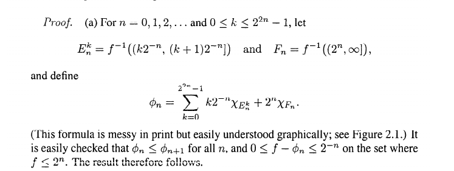

# Problem 1

## Part a

It follows from the definition that $\norm{f}_\infty = 0 \iff f = 0$ almost everywhere, and if $\norm{f}_\infty$ is the best upper bound for $f$ almost everywhere, then $\norm{cf}_\infty$ is the best upper bound for $cf$ almost everywhere. 

So it remains to show the triangle inequality. Suppose that $\abs{f(x)} \leq \norm{f}_\infty$ a.e. and $\abs{g(x)} \keq \norm{g}_\infty$ a.e., then by the triangle inequality for the $\abs{\cdot}_\RR$ we have
\[
\begin{align*}
\abs{(f + g)(x)} &\leq \abs{f(x)} + \abs{g(x)} \quad a.e. \\
&\leq \norm{f}_\infty + \norm{g}_\infty \quad a.e.
,\end{align*}
\]

which means that $\norm{f+g}_\infty \leq \norm{f}_\infty + \norm{g}_\infty$ as desired.

## Part b

$\implies$: Suppose $\norm{f_n - f}_\infty \to 0$, then for every $\varepsilon$, $N$ can be chosen large enough such that $\abs{f_n(x) - f(x)} < \varepsilon$ a.e., which precisely means that there exist sets $E_n$ such that $x\in E_n \implies \abs{f_n(x) - f(x)}$ and $m(E_n^c) = 0$. 

But then $f_n \uniformlyconverges f$ uniformly on $E \definedas \intersect_n E_n$ by definition, and $E^c = \union_n E_n^c$ is still a null set.

$\impliedby$: Suppose $f_n \uniformlyconverges f$ uniformly on some set $E$ and $m(E^c) = 0$. Then for any $\varepsilon$, we can choose $N$ large enough such that $\abs{f_n(x) - f(x)} < \varepsilon$ on $E$; but then $\varepsilon$ is an upper bound for $f_n - f$ almost everywhere, so $\norm{f_n - f}_\infty < \varepsilon \to 0$.

## Part c

To see that simple functions are dense in $L^\infty(X)$, we can use the fact that $f\in L^\infty(X) \iff$ there exists a $g$ that $f=g$ a.e. and $g$ is bounded. 

Then there is a sequence $s_n$ of simple functions such that $\norm{s_n - g}_\infty \to 0$, which follows from a proof in Folland:

However, $C^0_c(X)$ is dense $L^\infty(X) \iff$ every $f \in L^\infty(X)$ can be approximated by a sequence $\theset{g_k} \subset C^0_c(X)$ in the sense that $\norm{f - g_n}_\infty \to 0$. To see why this can not happen, let $f(x) = 1$, so $\norm{f}_\infty = 1$ and let $g_n \to f$ be an arbitrary sequence of $C^0_c$ functions converging to $f$ pointwise. 

Since every $g_n$ has compact support, say $E$, then $\restrictionof{g_n}{E^c} \equiv 0$ and $m(E^c) > 0$. In particular, this means that $\norm{f - g_n}_\infty = 1$ for every $n$, so $g_n$ can not converge to $f$ in the infinity norm.

# Problem 2

# Problem 3

# Problem 4

# Problem 5

# Problem 6