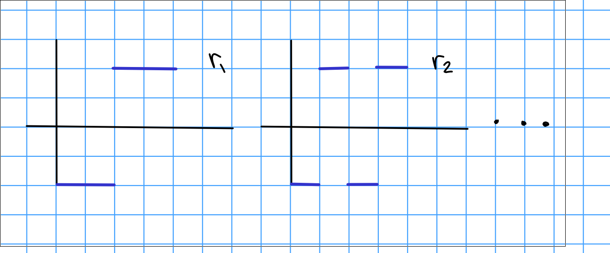

# Tuesday December 3rd

**Lebesgue Differentiation Theorem:**
If $f\in L_{loc}(\RR^n)$, then 
$$
\lim_{m(B) \to 0; x\in B} \frac 1 {m(B)} \int_B f(y) ~dy = f(x) \quad \text{for almost every $x$}
$$

*Definition:* 
The *Rademacher functions* are given by functions $r_n: [0, 1] \to \theset{-1, 1}$:

Note the self-similar nature -- $r_2$ just does $r_1$ on each half-interval.
Then lift these to $\RR^n$ by taking products.

*Facts:*

$\theset{r_n}$ forms an orthonormal system in $L^2([0, 1])$, and

-  $\int_0^1 r_n(x) ~dx = 0$,
-  $\int_0^1 r_n(x) r_m(x) ~dx = 0$ if $n\neq m$,
-  $\int_0^1 r_n(x)^2 ~dx = 1 \forall n$.

> Think of these as modeling a random process, like coin flips.

Consider $a_n(t) \definedas \frac{1}{2}(r_n(t) + 1)$, which essentially sends $-1 \to 0$ and $1\to 1$ in each $r_n$.

Note that when $t = \frac 1 4$, we have $\theset{a_n(t)} = [0, 0, 1, 1, 1, \cdots]$, which is the binary expansion of $t$.

If we define $S_N(t) = \sum_{n=1}^N r_n(t)$, we have $\int_0^1 S_N(t) = 0$ and $\int_0^1 S_N(t)^2 = n$, which says that the expected is zero (as many heads as tails) and the variance adds.

**Strong Law of Large Numbers:**
$$
\frac{S_N(t)}{N} \to 0 \text{ as } N\to \infty \text{ for almost every } t\in [0, 1]
$$

There is in fact a stronger version:
$$
\forall \varepsilon > 0,\quad \frac{S_N(t)}{N^{\frac 1 2 - \varepsilon }} \to 0 \text{ as } N\to \infty \text{ for almost every } t\in [0, 1]
$$

This is a consequence of the following theorem:

**Theorem:**
If $\sum \abs{a_n}^2 < \infty$ then $\sum a_n r_n(t) < \infty$ for almost every $t$.

> Think about $a_n = \frac 1 n$ or $a_n = \frac 1 {n^{\frac 1 2 + \varepsilon }}$.

*Proof of why this theorem implies the Strong Law of Large Numbers:*

Let $\frac 1 2 < \gamma < \frac 1 2 + \varepsilon$, and let $a_n = \frac 1 {n^\gamma}$ and $b_n = n^\gamma$.
Let $\tilde S_N = \sum^N a_n r_n$ and 

\begin{align*}
S_N 
&= \sum^N r_n \\
&= \sum^N a_n r_n b_n \\
&= \tilde S_N b_{n+1} + \sum_{n=1}^N \tilde S_N (b_n - b_{n+1}) \quad \text{by summation by parts} \\
&\leq_{abs} O(1) O(N^\gamma) B_N = O(N^\gamma) + O(N^\gamma)
,\end{align*}
where we use the fact that $b_{n+1} > b_n$ just makes the absolute value switch signs, $\tilde S_N$ is bounded by a constant, and the resulting sum telescopes.
$\qed$

Proof of Theorem:

We want to show $\tilde S_N = \sum a_n r_n \to f$ in $L^2$ since the $\theset{r_n}$ form an orthonormal system.
We have 

\begin{align*}
\norm{\tilde S_N - \tilde S_M}^2
&=\norm{\sum_{n=M+1}^N a_n r_n}^2 \\
&= \sum \norm{a_n r_n}^2 \quad \text{by Pythagoras} \\
&= \sum \abs{a_n}^2
.\end{align*}

The claim is that $\tilde S_N \to f$ almost everywhere.

*Proof:*
Consider $\Bbb{E}_N(f)(t) \definedas \frac 1 {m(I)} \int_I f(y)~dy$ where $I$ is an interval of length $2^{-N}$ containing $t$. 
This replaces $f$ with its average on this interval, and turns out to equal the conditional expectation.

> Exercise: $\Bbb{E}_N(f) = \tilde S_N$.

But then by the Lebesgue differentiation theorem, we have $\Bbb{E}_N(f)(t) \to f(t)$ almost everywhere.

For a proof of the exercise, use the fact that

$$
\Bbb{E}_N(r_n) = \begin{cases}
r_n & n > N \\
0 & n \leq N.
\end{cases}
$$

So then $\Bbb{E}_N(\tilde S_n) = \tilde S_n$ if $n > N$, so just use the fact that $\tilde S_N \to f$ in $L^2$ to complete the argument.

$\qed$

> That's the end of the course!
