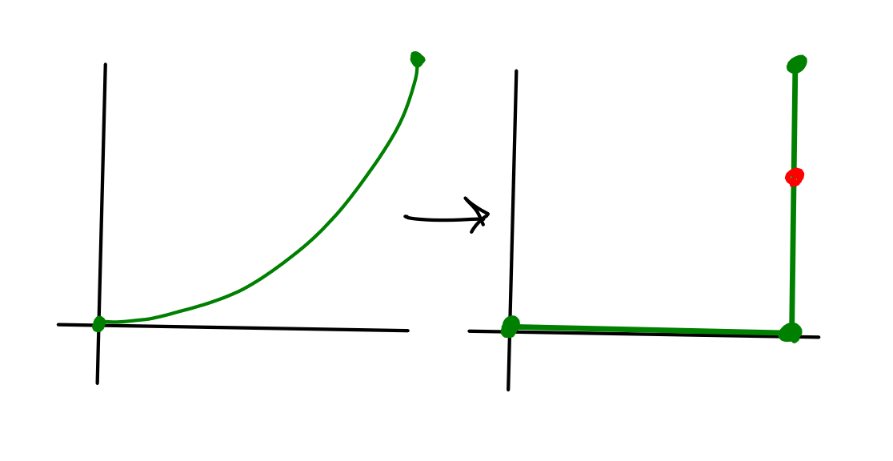
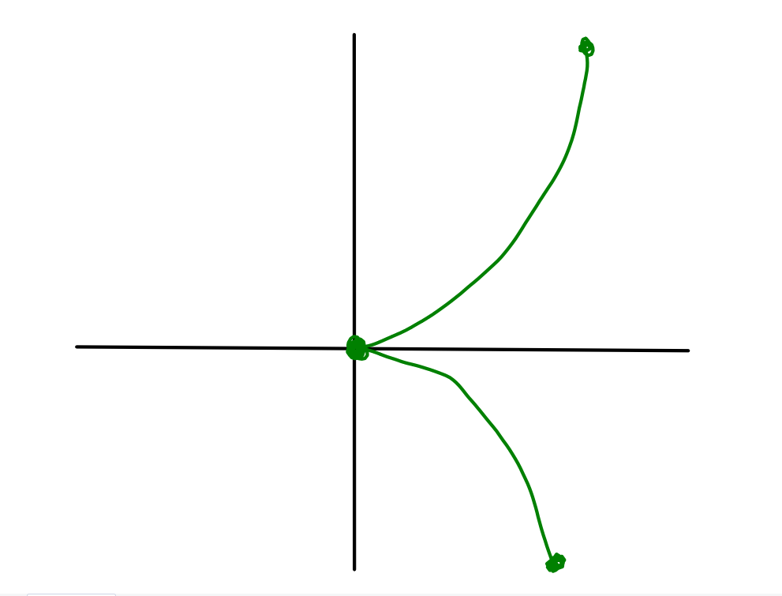
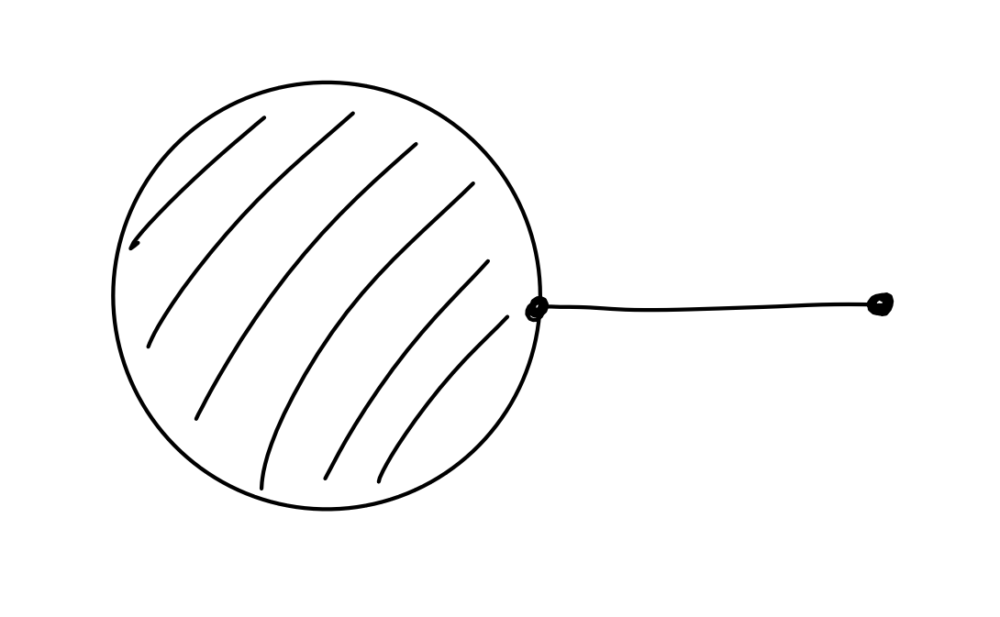

# Lecture 1

The key point of this class will be a discussion of *smooth structures*. As you may recall, a sensational result of Milnor's exhibited exotic spheres with smooth structures -- i.e., a differentiable manifold $M$ which is homeomorphic but *not* diffeomorphic to a sphere.

Summary of this result: Look at bundles $S^3 \to X \to S^4$, then one can construct some $X \cong S^7 \in \mathbf{Top}$ but $X \not \cong S^7 \in \mathbf{Diff}^{\,\infty}$. There are in fact 7 distinct choices for $X$.

> It is not known if there are exotic smooth structures on $S^4$. The Smooth Poincare' conjecture is that these do not exist; this is believed to be false.

The other key point of this course is to show that $X \in \mathbf{Diff}^{\,\infty} \implies X \injects \RR^n$ for some $n$, and is in fact a topological subspace.

A short list of words/topics we hope to describe:

- Differentiable manifolds
- Local charts
- Submanifolds
- Projective spaces
- Lie groups
- Tangent spaces
- Vector fields
- Cotangent spaces
- Differentials of smooth maps $G$
- Differential forms
- de Rham's theorem

---

We'd like a notion of "convergence" for, say, curves in $\RR^2$. Consider the following examples.

\
Note the problematic point on the bottom right, as well as the fact that neither of the usual notions of pointwise or uniform convergence will yield a point on the LHS that converges to the red point on the RHS.

\
Note the problematic point at the origin.

\
Note the problematic point in the middle, for which all neighborhoods of it are not homeomorphic to either a 2-dimensional nor a 1-dimensional space.

\wrapenv{\Begin{definition}}
A topological space $M$ is said to be a **topological manifolds**  when

- $M$ is Hausdorff, so $p\neq q \in M \implies \exists N(p), N(q)$ such that $N(p) \intersect N(q) = \emptyset$.
- $x\in M \implies$ there exists some $U_x \subseteq M$ and a $\varphi: U_x \to \RR^n$ for some $n$ which is a homeomorphism.
- $M$ is 2nd countable

\wrapenv{\End{definition}}

> There are somewhat technical conditions -- most of the theory goes through without $M$ being Hausdorff or 2nd countable, but these are needed to construction *partitions of unity* later.

> Also note that these conditions exclude spaces such as the copy of $D_2 \vee I$ from above.

The intuition here is that we'd like spaces that "locally look like $\RR^n$", and we introduce the additional structure of smoothness in the following way:

\wrapenv{\Begin{definition}}
A family of coordinate systems $\theset{U_\alpha, \varphi_\alpha)}$ is a **smooth atlas** on $M$ exactly when the change-of-coordinate maps $f_{\alpha, \beta}$ are $C^\infty$.
\wrapenv{\End{definition}}

\wrapenv{\Begin{exercise}}
\wrapenv{\End{exercise}}
