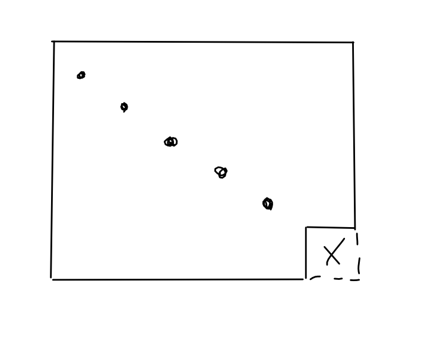
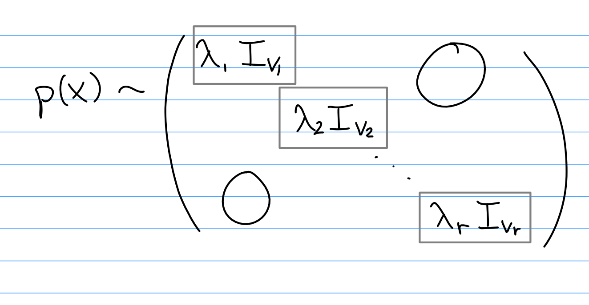
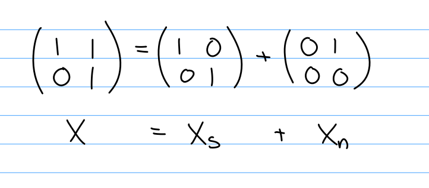
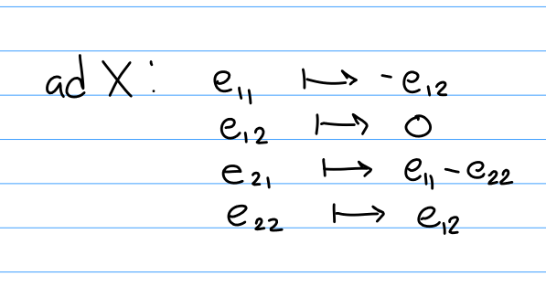
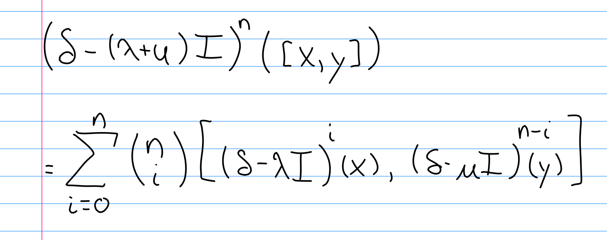
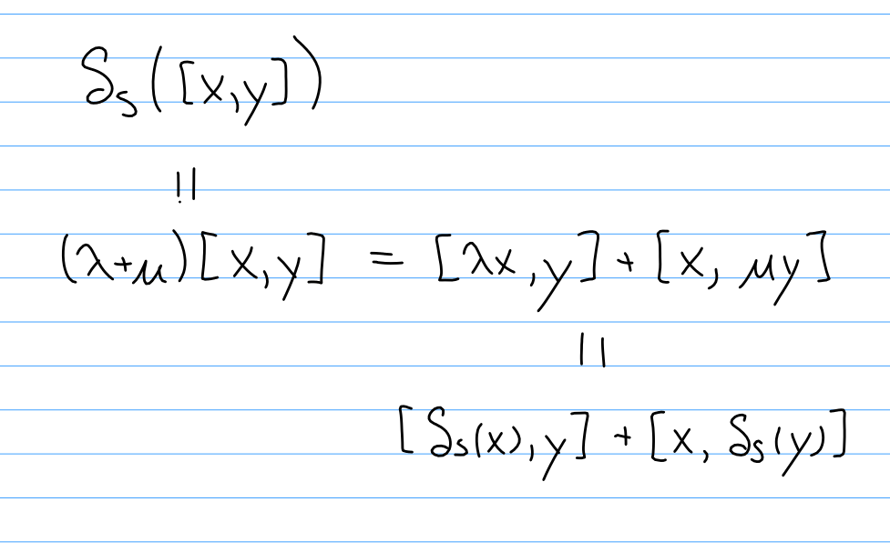

# Lecture 1

> The material for this class will roughly come from Humphrey, Chapters 1 to 5. There is also a useful appendix which has been uploaded to the ELC system online.

## Overview
Here is a short overview of the topics we expect to cover:

### Chapter 2
- Ideals, solvability, and nilpotency
- Semisimple Lie algebras
  - These have a particularly nice structure and representation theory
- Determining if a Lie algebra is semisimple using Killing forms
- Weyl's theorem for complete reducibility for finite dimensional representations
- Root space decompositions

### Chapter 3-4
We will describe the following series of correspondences:

\begin{tikzcd}
\text{Semisimple algebras} \arrow[rr, Leftrightarrow] &  & \text{Root systems} \arrow[rr, Leftrightarrow] & & \text{Dynkin diagrams} \\
& & & & \\
\text{Simple algebras over } \CC \arrow[uu, Rightarrow, "\bigoplus"] \arrow[rr, Leftrightarrow] & & \text{Irreducible root systems} \arrow[uu, Rightarrow, "\coprod"] \arrow[rr, Leftrightarrow] & & \arrow[uu, Rightarrow, "\coprod"] \text{Connected Dynkin diagrams}
\end{tikzcd}

## Classification
The classical Lie algebras can be essentially classified by certain classes of diagrams:

\begin{tikzpicture}
\tikzset{vertex/.style = {shape=circle,draw,minimum size=0.2em,fill=black!60}}
\tikzset{edge/.style = {->,> = latex'}}
\node at (-1,0) {$A_\ell:$};
\node[vertex] (a) at  (0,0) {};
\node[vertex] (b) at  (2,0) {};
\node[vertex] (c) at  (4,0) {};
\node[label=$\ell$, vertex] (d) at  (6,0) {};
\draw[edge] (a) to (b);
\draw[edge] (c) to (d);
\node at ($(b)!0.5!(c)$) {$\cdots$};
\end{tikzpicture}

\begin{tikzpicture}
\tikzset{vertex/.style = {shape=circle,draw,minimum size=0.2em,fill=black!60}}
\tikzset{edge/.style = {->,> = latex'}}
\node at (-1,0) {$B_\ell:$};
\node[vertex] (a) at  (0,0) {};
\node[vertex] (b) at  (2,0) {};
\node[vertex] (c) at  (4,0) {};
\node[label=$\ell$, vertex] (d) at  (6,0) {};
\draw[edge] (a) to (b);
\draw[edge, bend left] (c) to (d);
\draw[edge, bend right] (c) to (d);
\node at ($(b)!0.5!(c)$) {$\cdots$};
\end{tikzpicture}

\begin{tikzpicture}
\tikzset{vertex/.style = {shape=circle,draw,minimum size=0.2em,fill=black!60}}
\tikzset{edge/.style = {->,> = latex'}}
\node at (-1,0) {$C_\ell:$};
\node[vertex] (a) at  (0,0) {};
\node[vertex] (b) at  (2,0) {};
\node[vertex] (c) at  (4,0) {};
\node[label=$\ell$, vertex] (d) at  (6,0) {};
\draw[edge] (a) to (b);
\draw[edge, bend left] (d) to (c);
\draw[edge, bend right] (d) to (c);
\node at ($(b)!0.5!(c)$) {$\cdots$};
\end{tikzpicture}

\begin{tikzpicture}
\tikzset{vertex/.style = {shape=circle,draw,minimum size=0.2em,fill=black!60}}
\tikzset{edge/.style = {->,> = latex'}}
\node at (-1,0) {$D_\ell:$};
\node[vertex] (a) at  (0,0) {};
\node[vertex] (b) at  (2,0) {};
\node[vertex] (c) at  (4,0) {};
\node[label=$\ell$, vertex] (d) at  (6,2) {};
\node[vertex] (e) at  (6,-2) {};
\draw[edge] (a) to (b);
\draw[edge] (c) to (d);
\draw[edge] (c) to (e);
\node at ($(b)!0.5!(c)$) {$\cdots$};
\end{tikzpicture}

\begin{tikzpicture}
\tikzset{vertex/.style = {shape=circle,draw,minimum size=0.2em,fill=black!60}}
\tikzset{edge/.style = {->,> = latex'}}
\node at (-2,0) {$E_6, E_7, E_8:$};
\node[vertex] (a) at  (0,0) {};
\node[vertex] (b) at  (2,0) {};
\node[vertex] (c) at  (4,0) {};
\node[vertex] (cp) at  (4,2) {};
\node[vertex] (d) at  (6,0) {};
\node[label=$\ell$, vertex] (z) at  (8,0) {};
\draw[edge] (d) to (z);
\draw[edge] (a) to (b);
\draw[edge] (b) to (c);
\draw[edge] (c) to (cp);
%\draw[edge] (d) to (c);
\node at ($(c)!0.5!(d)$) {$\cdots$};
\end{tikzpicture}

\begin{tikzpicture}
\tikzset{vertex/.style = {shape=circle,draw,minimum size=0.2em,fill=black!60}}
\tikzset{edge/.style = {->,> = latex'}}
\node at (-1,0) {$F_4$:};
\node[vertex] (a) at  (0,0) {};
\node[vertex] (b) at  (2,0) {};
\node[vertex] (c) at  (4,0) {};
\node[vertex] (d) at  (6,0) {};
\draw[edge] (a) to (b);
\draw[edge, bend left] (b) to (c);
\draw[edge, bend right] (b) to (c);
\draw[edge] (c) to (d);
\end{tikzpicture}

## Chapters 4-5
These cover the following topics:

- Conjugacy classes of Cartan subalgebras
- The PBW theorem for the universal enveloping algebra
- Serre relations

### Chapter 6

Some import topics include:

- Weight space decompositions
- Finite dimensional modules
- Character and the Harish-Chandra theorem
- The Weyl character formula
  - This will be computed for the specific Lie algebras seen earlier

We will also see the type $A_{\ell}$ algebra used for the first time; however, it differs from the other types in several important/significant ways.

### Chapter 7
Skip!

### Topics

Time permitting, we may also cover the following extra topics:

- Infinite dimensional Lie algebras [Carter 05]
- BGG Cat$\dash\mathcal O$ [Humphrey 08]

## Content

Fix $F$ a field of characteristic zero -- note that prime characteristic is closer to a research topic.

\wrapenv{\Begin{definition}}
A **Lie Algebra** $\lieg$ over $F$ is an $F\dash$vector space with an operation denoted the Lie bracket,

\[
\begin{align*}
[\wait, \wait]: \lieg \cross \lieg \to \lieg\\
(x,y) \mapsto [x, y]
.\end{align*}
\]

satisfying the following properties:

- $[\wait, \wait]$ is bilinear
- $[x, x] = 0$
- The Jacobi identity:

\[
\begin{align*}
[x, [y, z]] + [y, [x,z]] + [z, [x, y]] = \vector 0
.\end{align*}
\]

\wrapenv{\End{definition}}

\wrapenv{\Begin{exercise}}
Show that $[x, y] = -[y,x]$.
\wrapenv{\End{exercise}}

\wrapenv{\Begin{definition}}
Two Lie algebras $\lieg, \lieg'$ are said to be isomorphic if $\varphi([x, y]) = [\varphi(x), \varphi(y)]$.
\wrapenv{\End{definition}}

## Linear Lie Algebras

Let $V = \FF^{n}$, and define $\mathrm{End}(V) = \theset{f: V \to V \suchthat V \text{ is linear}}$. We can then define $\liegl(n, V)$ by setting $[x, y] = (x\circ y) - (y\circ x)$.

\wrapenv{\Begin{exercise}}
Verify that $V$ is a Lie algebra.
\wrapenv{\End{exercise}}

\wrapenv{\Begin{definition}}
Define $$\liesl(n, V) = \theset{f \in \liegl(n, V) \suchthat \Tr(f) = 0}.$$
(Note the different in definition compared to the lie *group* $\SL(n, V)$.).
\wrapenv{\End{definition}}

\wrapenv{\Begin{definition}}
A *subalgebra* of a Lie algebra is a vector subspace that is closed under the bracket.
\wrapenv{\End{definition}}

\wrapenv{\Begin{definition}}
The symplectic algebra
\[
\begin{align*}
\liesp(2\ell, F) = \theset{A \in \liegl(2\ell, F)\suchthat MA-A^{T}M = 0} \text{ where }
M = \left(\begin{array}{c|c}{0} & {I_{n}} \\ \hline {-I_{n}} & {0}\end{array}\right)
.\end{align*}
\]
\wrapenv{\End{definition}}

\wrapenv{\Begin{definition}}

The orthogonal algebra
\[
\begin{align*}
  \lieso(2\ell, F) = \theset{A \in \liegl(2\ell, F)\suchthat MA-A^{T}M = 0} \text{ where } \\
  M = \begin{cases}
  \left(\begin{array}{l|l}
  {1} & {0} \\ \hline
  {0} & {\begin{array}{c|c}{0} & {I_{n}} \\\hline {-I_{n}} & {0}\end{array}}
  \end{array}\right) & n=2\ell + 1 \text{ odd},\\ \\
  \left(\begin{array}{c|c}{0} & {I_{n}} \\ \hline {-I_{n}} & {0}\end{array}\right) & \text{ else}.
  \end{cases}
\end{align*}
\]
\wrapenv{\End{definition}}

\wrapenv{\Begin{proposition}} The dimensions of these algebras can be computed;

- The dimension of $\liegl(n, \FF)$ is $n^{2}$, and has basis ${\theset{e_{{i,j}}}}$ the matrices if a 1 in the $i,j$ position and zero elsewhere.

- For type $A_{\ell}$, we have $\dim \liesl(n, \FF) = (\ell+1)^{2} - 1$.

- For type $C_{\ell}$, we have $\abs{}{\liesp(n, \FF)} = \ell^{2} + 2\left(\frac{\ell(\ell+1)}{2} \right )$, and so elements here
\[
\begin{align*}
\left(\begin{array}{ll}{A} & {B=B^{t}} \\ {C = C^{t}} & {A^{t}}\end{array}\right)
.\end{align*}
\]

\wrapenv{\End{proposition}}

- For type $D_{\ell}$ we have
\[
\begin{align*}
\abs{}{\lieso(2\ell, \FF)}
= \dim\theset{ \left(\begin{array}{ll}{A} & {B=-B^{t}} \\ {C = -C^{t}} & {-A^{t}}\end{array}\right)}
,\end{align*}
\]
which turns out to be $2\ell^{2}-\ell$.

- For type $B_{\ell}$, we have $\dim{\lieso}(2\ell, \FF) = 2\ell^{2} -\ell+2\ell = 2\ell^{2} + \ell$, with elements of the form
\[
\begin{align*}
\left(\begin{array}{c|cc}
0 & M & N \\ \hline
-N^{t} & A & C=C^{t} \\
-M^{t} & B=B^{t} & -A^{t}
\end{array}\right)
.\end{align*}
\]
\wrapenv{\Begin{exercise}}
Use the relation $MA =  A^{tM}$ to reduce restrictions on the blocks.
\wrapenv{\End{exercise}}
\[
\begin{tikzcd}
&&  & \lieso(6)             &  &                       \\
&&  & \lieso(5) \arrow[rrd] &  &                       \\
\liesl(4) \arrow[rrruu] & \liesl(2)^2 \arrow[rr] &  & \lieso(4)             &  & \liesp(4)             \\
&&  & \lieso(3)             &  &                       \\
& \liesl(2) \arrow[rru]  &  &                       &  & \liesp(2) \arrow[llu]
\end{tikzcd}
\]

\wrapenv{\Begin{theorem}}
These are *all* of the isomorphisms between any of these types of algebras, in any dimension.
\wrapenv{\End{theorem}}

# Lecture 2

Recall from last time that a Lie Algebra is a vector space with a bilinear bracket, which importantly satisfies the Jacobi identity:
\[
\begin{align*}
[x, [y, z]] + [y, [x,z]] + [z, [x, y]] = \vector 0
.\end{align*}
\]

Also recall the examples from last time:

- $A_\ell \iff \liesl(\ell + 1, F)$
- $B_\ell \iff \lieso(2\ell + 1, F)$
- $C_\ell \iff \liesp(2\ell, F)$
- $D_\ell \iff \lieso(2\ell, F)$

\wrapenv{\Begin{exercise}}
Characterize these matrix subalgebras in terms of basis elements, and compute their dimensions.
\wrapenv{\End{exercise}}

## Lie Algebras of Derivations

\wrapenv{\Begin{definition}}
An **$F\dash$algebra** $A$ is an $F\dash$vector space endowed with a bilinear map
$A^2 \to A,~ (x,y) \mapsto xy$.
\wrapenv{\End{definition}}

\wrapenv{\Begin{definition}}
An algebra is **associative** if $x(yz) = (xy)z$.
\wrapenv{\End{definition}}

> Modern interest: simple Lie algebras, which have a good representation theory. Take a look a Erdmann-Wildon (Springer) for an introductory look at 3-dimensional algebras.

\wrapenv{\Begin{definition}}
Any map $\delta: A^2 \to A$ that satisfies the Leibniz rule is called a **derivation** of $A$, where the rule is given by $\delta(xy) = \delta(x)y + x\delta(y)$.
\wrapenv{\End{definition}}

\wrapenv{\Begin{definition}}
We define $\mathrm{Der}(A) = \theset{\delta \suchthat \delta\text{ is a derivation }}$.
\wrapenv{\End{definition}}

Any Lie algebra $\lieg$ is an $F\dash$algebra, since $[\wait, \wait]$ is bilinear. Moreover, $\lieg$ is associative iff $[x, [y,z]] = 0$.

\wrapenv{\Begin{exercise}}
Show that $\mathrm{Der} \lieg \leq \liegl(\lieg)$ is a Lie subalgebra. One needs to check that $\delta_1, \delta_2 \in \lieg \implies [\delta_1, \delta_2] \in \lieg$.
\wrapenv{\End{exercise}}

\wrapenv{\Begin{exercise}[Turn in]}
Define the adjoint by $\ad_x: \lieg\selfmap,~ y \mapsto [x, y]$. Show that $\ad_x \in \mathrm{Der}(\lieg)$.
\wrapenv{\End{exercise}}

## Abstract Lie Algebras

Fact: Every finite-dimensional Lie algebra is isomorphic to a linear Lie algebra, i.e. a subalgebra of $\liegl(V)$. Each isomorphism type can be specified by certain *structure constants* for the Lie bracket.
\wrapenv{\Begin{example}}
Any $F\dash$vector space can be made into a Lie algebra by setting $[x,y] = 0$; such algebras are referred to as *abelian*.
\wrapenv{\End{example}}

Attempting to classify Lie algebras of dimension at most 2.

- 1 dimensional: We can write $\lieg = Fx$, and so $[x, x] = 0 \implies [\wait, \wait] = 0$. So every bracket must be zero, and thus every Lie algebra is abelian.
- 2 dimensional: Write $\lieg = Fx \oplus Fy$, the only nontrivial bracket here is $[x, y]$. Some cases:
  - $[x, y] = 0 \implies \lieg$ is abelian.
  - $[x, y] = ax + by \neq 0$. Assume $a\neq 0$ and set $x' = ax+by, y' = \frac y a$. Now compute $[x', y'] = [ax+by, \frac y a] = [x,y] = ax+by = x'$. Punchline: $\lieg \cong Fx' \oplus Fy', [x', y'] = x'$.

We can fill in a table with all of the various combinations of brackets:

\begin{center}
\begin{tabular}{l|ll}
$[\wait, \wait]$ & $x'$  & $y'$ \\ \hline
$x'$                                               & $0$   & $x'$ \\
$y'$                                               & $-x'$ & $0$
\end{tabular}
\end{center}

\wrapenv{\Begin{example}}
Let $V = \RR^3$, and define $[a,b] = a\cross b$ to be the usual cross product.
\wrapenv{\End{example}}

\wrapenv{\Begin{exercise}}
Look at notes for basis elements of $\liesl(2, F)$,
\[
\begin{align*}
e=\left[\begin{array}{ll}{0} & {1} \\ {0} & {0}\end{array}\right],\\
h=\left[\begin{array}{cc}{1} & {0} \\ {0} & {-1}\end{array}\right],\\
f=\left[\begin{array}{ll}{0} & {0} \\ {1} & {0}\end{array}\right]
.\end{align*}
\]

Compute the matrices of $\ad(e), \ad(h), \ad(g)$ with respect to this basis.
\wrapenv{\End{exercise}}

## Ideals

\wrapenv{\Begin{definition}}
A subspace $I \subseteq \lieg$ is called an **ideal**, and we write $I \normal \lieg$, if $x,y \in I \implies [x,y]\in I$.
\wrapenv{\End{definition}}

Note that there is no need to distinguish right, left, or two-sided ideals. This can be shown using $[x,y] = [-y, x]$.

\wrapenv{\Begin{exercise}}
Check that the following are all ideals of $\lieg$:

- $\theset 0, \lieg$.
- $\mathfrak z (\lieg) = \theset{z\in \lieg \suchthat [x, z] = 0\quad \forall x\in \lieg}$
- The commutator (or derived) algebra $[\lieg, \lieg] = \theset{\sum_i [x_i, y_i] \suchthat x_i, y_i \in \lieg}$.
  - Moreover, $[\liegl(n, F),\liegl(n, F) ] = \liesl(n, F)$.

\wrapenv{\End{exercise}}

Fact: If $I, J \normal \lieg$, then

- $I+J = \theset{x+y\suchthat x\in I, y\in J} \normal \lieg$
- $I \intersect J \normal \lieg$
- $[I, J] = \theset{\sum_i [x_i, y_i] \suchthat x_i \in I, y_i \in J} \normal \lieg$

\wrapenv{\Begin{definition}}
A Lie algebra is **simple** if $[\lieg, \lieg] \neq 0$ (i.e. when $\lieg$ is not abelian) and has no non-trivial ideals. Note that this implies that $[\lieg, \lieg] = \lieg$.
\wrapenv{\End{definition}}

\wrapenv{\Begin{theorem}}
Suppose that $\ch F \neq 2$, then $\liesl(2, F)$ is not simple.
\wrapenv{\End{theorem}}

\wrapenv{\Begin{proof}}

Recall that we have a basis of $\liesl(2, F)$ given by $B = \theset{e, h, f}$ where

- $[e, f] = h$,
- $[h, e] = 2e$,
- $[h, f] = -2f$.

So think of $[h, e] = \ad_h$, so $h$ is an eigenvector of this map with eigenvalues $\theset{0, \pm 2}$. Since $\ch F \neq 2$, these are all distinct. Suppose $\liesl(2, F)$ has a nontrivial ideal $I$; then pick $x = ae + bh + cf \in I$. Then $[e, x] = 0 - 2be + ch$, and $[e, [e,x]] = 0 - 0 + 2ce$. Again since $\ch F \neq 2$, then if $c\neq 0$ then $e\in I$. Now you can show that $h\in I$ and $f\in I$, but then $I = \liesl(2, F)$, a contradiction. So $c=0$.

Then $x = bh \neq 0$, so $h\in I$, and we can compute

\begin{align*}
2e = [h, e] \in I \implies e \in I, \\
2f = [h, -f] \in I \implies f \in I
.\end{align*}

which implies that $I = \liesl(2, F)$ and thus it is simple.

\wrapenv{\End{proof}}

> Note that there is a homework coming due next Monday, about 4 questions.

# Lecture 3

Last time, we looked at ideals such as $0, \lieg, Z(\lieg),$ and $[\lieg, \lieg]$.

Definition:
If $I \normal \lieg$ is an ideal, then the quotient $\lieg/I$ also yields a Lie algebra with the bracket given by $[x+I, y+I] = [x,y] + I$.

Exercise:
Check that this is well-defined, so that if $x + I = x' + I$ and $y+I = y' + I$ then $[x,y] + I = [x', y'] + I$.

## Homomorphisms and Representations

\wrapenv{\Begin{definition}}
A linear map $\phi: \lieg_{1} \to \lieg_{2}$ is a *Lie homomorphism* if $\phi[x,y] = [\phi(x), \phi()]$.
\wrapenv{\End{definition}}

\wrapenv{\Begin{remark}}
$\ker \phi \normal \lieg_{1}$ and $\im\phi \leq \lieg_{2}$ is a subalgebra.
\wrapenv{\End{remark}}

Fact: There is a canonical way to set up a 1-to-1 correspondence $\theset{I \normal \lieg} \iff \theset{\hom \phi: \lieg \to \lieg'}$ where $I \mapsto (x \mapsto x + I)$ and the inverse is given by $\phi \mapsto \ker \phi$.

Theorem (Isomorphism theorem for Lie algebras):

- If $\phi: \lieg_{1} \to \lieg_{2}$ is a Lie algebra homomorphism, then $\lieg/\ker\phi \cong \im \phi$
- If $I,J \normal \lieg$ are ideals and $I \subset J$ then $J/I \normal \lieg g/I$ and $(\lieg/I)/(J/I) \cong \lieg/J$.
- If $I, J \normal \lieg$ then $(I+J)/J \cong I/(I\intersect J)$.

Definition:
A *representation* of a Lie algebra $\lieg$ is a Lie algebra homomorphism $\phi:\lieg \to \liegl(V)$ into a linear Lie algebra for some vector space $V$.

We call $V$ a $\lieg\dash$module with action $g\cdot v = \phi(g)(v)$.

Example: The *adjoint representation*:
\[
\begin{align*}
\ad: \lieg \to \liegl(\lieg) \\
x \mapsto [x, \wait]
.\end{align*}
\]

\wrapenv{\Begin{corollary}}
Any simple Lie algebra is isomorphic to a linear Lie algebra.
\wrapenv{\End{corollary}}

Proof: Since $\lieg$ is simple, the center $Z(\lieg) = 0$. We can rewrite the center as
\[
\begin{align*}
Z(\lieg) = \theset{x\in\lieg \suchthat \ad_{x(y)} = 0 \quad \forall y\in\lieg} \\
= \ker \ad_{x}
.\end{align*}
\]
Using the first isomorphism theorem, we have $\lieg/Z(\lieg) \cong \im \ad \subseteq \liegl (\lieg)$. But $\lieg/Z(\lieg) = \lieg$ here, so we are done.

## Automorphisms

Definition: An automorphism of $\lieg$ is an isomorphism $\lieg\selfmap$, and we define
\[
\begin{align*}
\Aut(\lieg) = \theset{\phi:\lieg\selfmap \suchthat \phi \text{ is an isomorphism }}
.\end{align*}
\]

Proposition:
If $\delta \in \mathrm{Der}(\lieg)$ is nilpotent, then
$$
\exp(\delta)\coloneqq\sum \frac{\delta^{n}} {n!} \in \Aut(\lieg).
$$

This is well-defined because $\delta$ is nilpotent, and a binomial formula holds:
\[
\begin{align*}
\frac{\delta^{n([x,y])}}{n!} = \sum_{i=0}^{n} [\frac{\delta^{i}(x)}{i!}, \frac{\delta^{n-i}(y)}{(n-i)!}]
.\end{align*}
\]
and for $n=1, \delta([x,y]) = [x, \delta(y)] + [\delta(x), y]$.

Exercise: Show that
\[
\begin{align*}
[(\exp \delta)(x), (\exp\delta)(y)] = \sum_{n=0}^{k-1} \frac {\delta^{n}([x, y])} {n!}
.\end{align*}
\]
Example: Let $\lieg = \liesl(2, \FF)$ and define
\[
\begin{align*}
s = \exp(\ad_{e}) \exp(\ad_{-f}) \exp(\ad_{e}) \in \Aut \lieg
.\end{align*}
\]

where $e,f$ are defined as (todo, see written notes).

Then define the Weyl group $W = \generators{s}$.

Exercise:
Check that $s(e) = -f, s(f) = -e, s(h) = -h$, and so the order of $s$ is 2 and $W = \theset{1, s}$.

# Lecture 4

## Solvability

> Idea: Define a semisimple Lie algebra

Definition:
The derived series for $\lieg$ is given by
\[
\begin{align*}
\lieg^{(0)} = \lieg \\
\lieg^{(1)} = [\lieg^{(0)}, \lieg^{(0)}] \\
\cdots \\
\lieg^{(i+1)} = [\lieg^{(i)}, \lieg^{(i)}]
.\end{align*}
\]

The Lie algebra $\lieg$ is *solvable* if there is some $n$ for which $\lieg^{(n)} = 0$.

Exercise (to turn in):
Check that the Lie algebra of upper triangular matrices in $\liegl(n, \FF)$.

Example: Abelian Lie algebras are solvable

Example: Simple Lie algebras are *not* solvable.

Proposition:
Let $\lieg$ be a Lie algebra, then

1. If $\lieg$ is solvable, then all subalgebras and all homomorphic images of $\lieg$ are also solvable.
2. If $I \normal \lieg$ and both $I$ and $\lieg/I$ are solvable, then so is $\lieg$.
3. If $I, J \normal \lieg$ are solvable, then so is $I+J$.

Corollary (of part 3 above):
Any Lie algebra has a unique maximal solvable ideal, which we denote the *radical* $\mathrm{Rad}(\lieg)$.

Definition:
A Lie algebra is semisimple if $\mathrm{Rad}(\lieg) = 0$.

Example:
Any simple Lie algebra is semisimple.

Example: Using part (2) above, we can deduce that we can construct a semisimple Lie algebra from *any* Lie algebra: for any $\lieg$, the quotient $\lieg/\mathrm{Rad}(\lieg)$ is semisimple.

## Nilpotency
\[
\begin{align*}
\lieg^{0} = \lieg \\
\lieg^{1} = [\lieg^{0}, \lieg^{0}] \\
\cdots \\
\lieg^{i+1} = [\lieg^{i}, \lieg^{i}]
.\end{align*}
\]

Much like the previous case, we have

Example:
Abelian Lie algebras are nilpotent.

Example:
Nilpotent Lie algebras are solvable.

Example:
The *strictly* upper triangular matrices (with zero on the diagonal) are nilpotent.

1. If $\lieg$ is nilpotent, then all subalgebras and all homomorphic images of $\lieg$ are also nilpotent.
2. If $\lieg/Z(\lieg)$ is nilpotent, then so is $\lieg$.
3. If $\lieg \neq 0$ is nilpotent, then $Z(\lieg) \neq 0$.

Claim:
If $\lieg$ is nilpotent, then $\ad_x \in \mathrm{End}(\lieg)$ is nilpotent for all $x\in \lieg$.

Proof:
This is because $\lieg^n = 0 \iff [\lieg, [\lieg, [\lieg, \cdots]]] = 0$, and so for every $x_i, y \in \lieg$ we have $[x_1, [x_2, \cdots [x_n, y]]] = 0$, and so $\ad_{x_1} \circ \ad_{x_2} \circ \cdots \ad_{x_n} = 0$ which implies that $\ad_x^n = 0$ for all $x\in \lieg$.

Theorem [Engel]:
If $\ad_x$ is nilpotent for all $x\in \lieg$, then $\lieg$ is nilpotent.

> Remark: This can be confusing if $\lieg$ is a linear algebra, we can consider elements $x \in\lieg$ and ask if it is the case $x$ being nilpotent (as an endomorphism) iff $\lieg g$ is nilpotent? False, a counterexample is $\lieg = \liegl(2, \CC)$, where there exists an $x$ which is *not* nilpotent while $\ad_x$ *is* nilpotent, which contradicts the above theorem.

Proof:

Lemma:
Let $\lieg \subseteq \liegl(V)$ be a Lie subalgebra for some finite dimensional vector space $V$. If $x$ is nilpotent as an endomorphism on $V$ for all $x\in V$, then there exists a nonzero vector $v\in V$ such that $\lieg v =0$, so $x\in \lieg \implies x(v) = 0$.

Proof of lemma
Use induction on $\dim \lieg$, splitting into two separate base cases:
- Case $\dim \lieg = 0$, then $\lieg = \theset{0}$.
- Case $\dim g = 1$, left as an exercise.

Inductive step: Let $A$ be a maximal proper subalgebra and define $\phi: A \to \liegl(\lieg/A)$ where $a \mapsto (x + A \mapsto [a, x] + A)$. We need to check that $\phi$ is a homomorphism, this just follows from using the Jacobi identity.

We also need to show that $\im \phi \leq \liegl(\lieg/a)$ is a Lie subalgebra, and $\dim \im \phi < \dim \lieg$. The claim is that $\phi(a) \in \mathrm{End}(\lieg/A)$ is nilpotent for all $a\in A$. By the inductive hypothesis, there is a nonzero coset $y + A \in \lieg/A$ such that $(\im \phi) \cdot (y+A) = A$. Since $y\not\in A$, then $\phi(a)(y+A) = A$ for all $a\in A$, and so $[a,y]\in A$.

We want to show that $A$ is a subalgebra of codimension 1, and $A \oplus F_y \leq \lieg$ is a Lie subalgebra.
This is because $[a_1 + c_1y, a_2 + c_2 y] = [a_1, a_2] + c_2[a_1, y] - c_2[a_2, y] + c_1c_2[y, y]$. The last term is zero, the middle two terms are in $A$, and because $A$ is closed under the bracket, the first term is in $A$ as well.

But then $A \oplus F_y$ is a larger subalgebra than $A$, which was maximal, so it must be everything. So $A \oplus F_y = \lieg$. So $A \normal \lieg$ because $[a_1, a_2 + cy]$ is in $A, A \oplus F_y = \lieg$ respectively, and this equals $[a_1, a_2] + c[a_1, y]$, where both terms are in $A$.

Proof to be continued on Friday!

# Lecture 5

Last time: we had a theorem that said that if $\lieg \in \liegl(V)$ and every $x\in\lieg$ is nilpotent, then there exists a nonzero $v \in V$ such that $\lieg v = 0$.

We proceeded by induction on the dimension of $V$, constructing $\im \phi \subseteq \liegl(\lieg/A)$, and showed that $\lieg = A \oplus Fy$. Now consider
$$
W = \theset{v\in V \suchthat Av = 0},
$$

which is $\lieg\dash$invariant, so $\lieg(W) \subseteq W$, or for all $a\in A, x\in \lieg, v\in W$, we have $a\actson x(v) = 0$. This is true because $a\actson x = x\circ a + [a, x] \in \liegl(V)$. But $V$ is killed by any element in $A$, and both of these terms are in $A$. In particular, the $y$ appearing in $Fy$ also satisfies $y \in W$. Consider $\restrictionof{y}{W} \in \mathrm{End}(w)$, and we want to apply the inductive hypothesis to $F \restrictionof{y}{W} \subseteq \liegl(V)$.

We need to check that $\restrictionof{y}{W} \in \mathrm{End}(V)$, which is true exactly because $y$ is nilpotent.
So we can construct a nonzero $v\in W \subset V$ such that $y(v) = 0$, and so $\lieg v = 0$.

Claim: $\phi(a) \in \mathrm{End}(\lieg/A)$ is nilpotent. Each $a\in A\subset \lieg$ is nilpotent by assumption.
Define the maps for left multiplication by $a$, $m_\ell: x \mapsto ax$, and the right multiplication $m_r: x \mapsto xa$.
These are nilpotent, and since $m_\ell, m_r$ commute, the difference $m_\ell - m_r$ is nilpotent, and this is exactly $\ad_a$. But then $\phi(a)$ is nilpotent.

> Good proof for using all of the definitions!

Now we can see what the consequences of having such a nonzero vector are. This theorem implies Engel's theorem, which says that if $\ad_x \in \mathrm{End}(\lieg)$ is nilpotent for every $x\in \lieg$, then $\lieg$ is nilpotent.

Proof: By induction on dimension. The base case is easy. For the inductive step, the previous theorem applies to $\ad g \subset \liegl(\lieg)$. So we can produce the nonzero $v\in \lieg$ such that $\ad \lieg v = 0$. Then $[x, v] = 0$ for all $x\in\lieg$, so either $v\in Z(\lieg)$ or $Z(\lieg) \neq 0$. In either case, $\lieg / Z(\lieg)$ has smaller dimension. Since $\ad_x$ is nilpotent, so is $\ad_x + Z(\lieg)$, and so $\lieg/Z(\lieg)$ is nilpotent.
By an earlier proposition, since the quotient is nilpotent, so is the total space. $\qed$

Let $\mathfrak{N}(F)$ be the subalgebra of $\liegl(F)$ consisting of strictly upper triangular matrices. We have a corollary: if $\lieg \subset \liegl(n, F)$ is a Lie subalgebra such every $x\in \lieg$ is nilpotent as an endomorphism of $F$, then the matrices of $\lieg$ with respect to some bases of in $\mathfrak{N}(n, F)$.

The proof is by induction on $n$, where the base case is easy. For the inductive step, we use the previous theorem to get a $v_1$ such that $x(v_1) = 0$ for all $x\in \lieg$. Let $\overline V = F^n/Fv_1 \cong F^{n-1}$, and define $\phi: \lieg \to \liegl(\overline V)$ where $x \mapsto (\overline y \mapsto \overline{y(x)})$.

Then $\im \phi \leq \liegl(n-1, F)$ as a subalgebra, and every $\phi(x)\in \mathrm{End}(F^{n-1})$ is nilpotent, since $x$ was nilpotent on the larger space. But (see notes) then $x$ can be written as a strictly upper-triangular matrix.

## Chapter 2: Semisimple Lie Algebras

We now assume $\mathrm{char} ~F = 0$ and $\overline F = F$.

Theorem:
If $\lieg$ is a solvable Lie subalgebra of $\liegl(V)$ for some finite dimensional $V$, then $V$ contains a common eigenvector for a $x\in\lieg$, i.e. a $\lambda: \lieg \to F, x \mapsto \lambda(x)$ such that $x(v) = \lambda(x) v$ for all $x\in\lieg$.

Proof: We will use induction on the dimension of $\lieg$. For the inductive step:

Claim 1: There is an ideal $A\normal \lieg$ such that $\lieg = A \oplus Fy$ for some $y\neq 0$, so $A$ is a subalgebra of a solvable Lie algebra $\lieg$ and thus solvable itself. By hypothesis, we can produce a $w \in V\setminus\theset{0}$, and thus a functional $\lambda: A \to F$ such that $aw = \lambda(a) w$ for all $a\in A$. So we define
$$
V_\lambda = \theset{v\in V \suchthat av = \lambda(a)v \forall a\in A}
$$

where $w\in V_\lambda$.

Claim 2: $y(V_\lambda) \subseteq V_\lambda$, or $\restrictionof{y}{V_\lambda}\in\mathrm{End}(V_\lambda)$.

Thus $F(\restrictionof{y}{V_\lambda}) \leq \liegl(V_\lambda)$ is a Lie algebra of dimension 1, and thus solvable. By the inductive hypothesis, we can find a $v\in V_\lambda$ and some $\mu \in F$ such that $y(v) = \mu v$. An arbitrary element $x\in\lieg$ can be written as $x = a + cy$ for some $a\in A, c\in F$ and it acts by $x(v) = a(v) + cy(v) = \lambda(a) v + c\mu v = (\lambda(a) + c)v \in V_\lambda$.

# Lecture n+1
Todo

# Lecture n+2

Definition (Jordan Decomposition)

Let $X \in \mathrm{End}(V)$ for $V$ finite dimensional. Then,

(a) There exists a unique $X_s, X_n \in \mathrm{End}(V)$ such that $X = X_s + X_n$ where $X_s$ is semisimple, $X_n$ is nilpotent, and $[X_s, X_n] = 0$.

(b) There exists a $p(t), q(t) \in t \FF[t]$ such that $X_s = p(X), X_n = q(X)$.

(Polynomials with no constant term.)

Proof of (a): Assume $X_s = X_s + X_n = X_s' + X_n'$, so both have bracket zero. Assuming that (b) holds, we have $X_s = p(X)$, and so
$$
[X, X_s] = [X_s + X_n', X_s'] = [X_s', X_s'] + [X_s', X_n'] = 0 \implies
[p(X), X_S'] = 0 = [X_s, X_s']
$$

Using fact (c) from last time, then $X_s, X_s'$ can be diagonalized simultaneously, and so $X_s - X_s'$ is semisimple.

On the other hand, if $X_n', X_n$ are nilpotent, and since these commute, $X_n - X_n'$ is nilpotent. But then this is a Jordan decomposition of the zero map, i.e.
$$
0 = X - X = (X_s - X_s') + (X_n + X_n')
$$
where the first term is semisimple and the second is nilpotent. Then each term is both semisimple *and* nilpotent, so they must be zero, which is what we wanted to show.

Proof of part (b): Let $m(t) = \prod_{i=1}^r (t-\lambda_i)^{m_i}$ be the minimal polynomial of $X$, where each $m_i \geq 1$ and the $\lambda_i$ are distinct.
Then the primary composition of $V$ is given by
$$
V = \bigoplus_{i=1}^r V_i,\quad V_i = \ker(X - \lambda_i I_V) \neq 0, \quad X(V_i) \subseteq V_i
$$
Claim:
There exists a polynomail $p\in F[t]$ such that
\[
\begin{align*}
p &= \lambda \mod (t-\lambda_i)^{m_i} \quad \forall i, \\
p &= 0 \mod t
.\end{align*}
\]

The existence follows from the Chinese Remainder Theorem.

What is $p(x) \actson V_i$? This acts by scalar multiplication by $\lambda_i$ for all $i$. (Check).
Because of the restrictive conditions, $p(x)$ has no constant term.

So $p(X) = X_s$ is the semisimple part we want. Now just set $q(t) = t - p(t)$, then $X_n \coloneqq q(X) = X - X_s$ is nilpotent.

Example:
The Jordan Decomposition is invariant under taking adjoints.

If we have $X = X_s + X_n$, then $\ad_X \in \mathrm{End}(\mathrm{End}(V))$. It can be shown that $(\ad_X)_s + (\ad_X)_n = \ad(X_s) + \ad(X_n)$.

Let $e_{ii}$ be the elementary matrix with a 1 in the $i, j$ position. You can write $\ad_X$ as a $4\times 4$ matrix (see image).

You can check that $(\ad_X)_S = 0, \ad(X_s) = 0$, and $(\ad X)_n$ is the Jordan form given above.

Lemma:

(a) $x \in \mathrm{End}(V) \implies \ad(x)_s = \ad(x_s)$ and $\ad(x)_n = \ad(x_n)$.

(b) If $A$ is a finite dimensional $\FF\dash$algebra, then $\delta \in \mathrm{Der}(A) \implies \delta_s, \delta_n \in \mathrm{Der}(A)$ as well.

Proof of (a):

Check that $\ad(x) = \ad(x_s) + \ad(x_n)$.
Then for $y\in \mathrm{End}(V)$, we have
\[
\begin{align*}
(\ad(x))(y)
&= [x, y] \\
&= [x_s + x_n, y] \\
&= [x_s, y] + [x_n, y] \\
&- (\ad(x_s))(y) + (\ad(x_n))(y)
.\end{align*}
\]

Using theorem 3.3, $x_n$ nilpotent $\implies$ $\ad(x_n)$ is also nilpotent. So write $x_s = \sum \lambda_i e_{ii}$ with the eigenvalues on the diagonal. Then $\ad x_s (e_{ij}) = (\lambda_i - \lambda_j)e_{ij}$ for all $i, j$. But then $\ad x_s$ is given by a matrix with $\lambda_i - \lambda_j$ in the $i,j$ position and zeros elsewhere. By the uniqueness of the Jordan decomposition, the statement follows.

Proof of (b):

Since $\delta \in \mathrm{Der}(A)$, the primary decomposition with respect to $\delta$ is given by
$$
A = \bigoplus_{\lambda \in F} A_\lambda \quad \text{where} ~A_\lambda = \theset{a\in A \suchthat (\delta - \lambda I)^k a = 0 ~\text{for some}~ k >> 0}.
$$
So $\delta_s \actson A_\lambda$ by scalar multiplication (by $\lambda$). Then for $\lambda, \mu \in \FF$, we have

So $[A_x, A_y]  \subseteq A_{\lambda + \mu}$ for all $x, y \in A$. But then

and so $\delta_s \in \mathrm{Der}(A)$, and $\delta_n = \delta - \delta_s \in \mathrm{Der}(A)$ as well.

# Lecture n+3

Todo

# Lecture n+4

Review of bilinear forms: let $V = \FF^n$.

Definition: A bilinear form $\beta: V^2 \to \FF$ can be represented by a matrix $B$ with respect to a basis $\theset{\vector v_i}$ such that
$$
\beta \beta(\sum a_i \vector v_i, \sum b_i \vector v_i) = (a_1 ~a_2 ~\cdots) B (b_1 ~b_2 ~\cdots)
$$

- $\beta$ is *symmetric* iff $\beta(a,b) = \beta(b,a)$.
- $\beta$ is *symplectic* iff $\beta(a, b) = -\beta(b, a)$.
- $\beta$ is *isotropic*  iff $\beta(a, a) = 0$.

For a subspace $U \leq V$, define
$$
U^\perp \coloneqq \theset{\vector v\in V \suchthat \beta(\vector u, \vector v) = \vector 0 \forall u\in U}.
$$

> Note: in general, left/right orthogonality are distinguished, but these will be identical when $\beta$ is symmetric/symplectic.

The form $\beta$ is said to be *non-degenerate* iff $V^\perp = 0$ iff $\det B \neq 0$.

Assume $F$ is an algebraically closed field, so $\overline F = F$, and $\mathrm{char} F \neq 2$, then

- If $\beta$ is non-degenerate and symmetric, then $B \sim I_n$
- If $\beta$ is non-degenerate and symplectic, then $B \sim [0, I_{n/2}; I_{n/2}, 0]$.

Remark:

$\lieso(n, \FF) = \theset{x\in \liegl(n, F) \suchthat \beta(x(u), v) = -\beta(u, x(v))}$, where $B$ has the matrix $[0, I; I, 0]$ if $n$ is odd, or this matrix with a 1 in the top-left corner if $n$ is odd.

Similarly, $\mathfrak{sp}(2m, \FF)$ can be described this way with the matrix $[0, -I_m; -I_m, 0]$.

Overview:
The killing form is defined as $\kappa: \lieg^2 \to \FF$ where $\kappa(x, y) = \mathrm{tr}(\ad_x \circ \ad_y)$.

Then we have **Cartan's Criteria**:

- $\lieg$ solvable $\iff$ $\kappa(x,y) = 0 \forall x\in [\lieg, \lieg], y\in \lieg$.
- $\lieg$ semisimple $\iff \kappa$ is non-degenerate.

Note that if $\lieg$ is semisimple, then $\lieg = \bigoplus_i I_i$ with each $I_i \normal \lieg$ and simple.

## Cartan's Criteria

Some facts:

1. $\kappa$ is symmetric
2. If $\lieg$ is finite dimensional, then $\kappa$ is associative, i.e $\kappa([x,y], z) = \kappa(x, [y, z])$.

Exercise: Show that if $I \normal \lieg$, then $I^\perp \leq \lieg$ is an ideal.

Proof of (2):
In section 4.3, it was shown that $\mathrm{tr}([a,b] \circ c) = \mathrm{tr}(a \circ [b, c])$ for all $a,b,c \in \mathrm{End}(V)$ (provided $V$ is finite dimensional).
