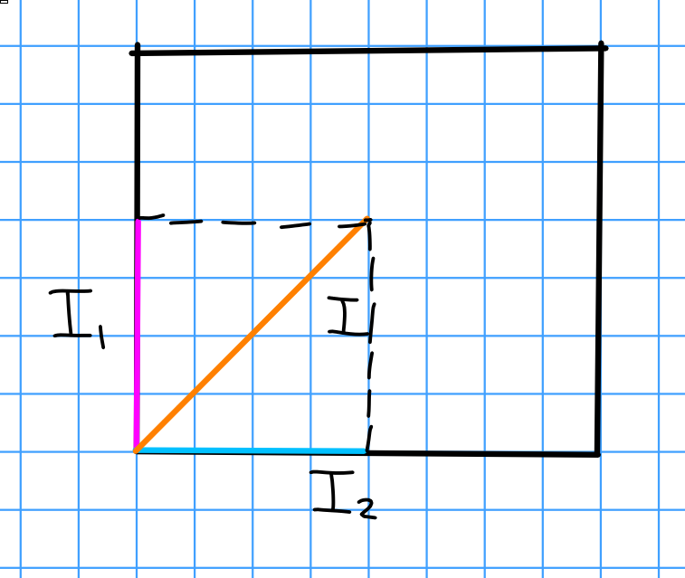

# Friday January 24th

Recall: 
Prime and maximal ideals.

Fact:
If $I \normal R$ then there exists a maximal ideal $I \subset \mfm \normal R$.

Proof:
Use Zorn's lemma.

Corollary:
$\maxspec R \neq \emptyset \iff R \neq 0$.

Later:
Multiplicative avoidance, if $S \subset R$ is nonempty with $SS\subset S$, let $I \normal R$ with $I\intersect S = \emptyset$, then

a. There exists an ideal $J \supseteq I$ with $J \intersect S =\emptyset$ which is maximal with respect to being disjoint from $S$.

b. Any such ideal $J$ is prime.

Taking $S = \theset{1}$ recovers the previous fact.

Exercise:
Let $f: R\to S$ be a ring homomorphism and $\pr \in \spec(R)$.
Show that $f_*(\pr)$ need not be prime in $S$.

We can consider products of rings, and correspondingly $\mci(R_1 \cross R_2)$.

Exercise:
Show that if $\phi$ is surjective, $\phi(I)$ is an ideal.

Proposition:
Let $I \in \mci(R_1 \cross R_2)$.
Take $\pi_i \to R_i$ the projections, and let $I_i$ be the corresponding images of $I$.
Then $I = I_1 \cross I_2$.

> Note: a suspiciously strong result! Not every group is the cartesian product of some subgroups.

It's clear that $I \subset I_1 \cross I_2$.

Proof:
Showing $I_1 \cross I_2 \normal R_1 \cross R_2$ is an ideal, since it equals $\generators{ I_1 \cross \theset{0}, \theset{0} \cross I_2 }$.

To show $I_1 \cross I_2 \subseteq I$, show that $I_1 \cross 0, 0 \cross I_2 \subseteq I$.
E.g. $I_1 \cross 0 \subseteq I$: take $(x, 0) \in I_1 \cross 0$ such that there exists a $y\in R_2$ with $(x, y) \in I$.
