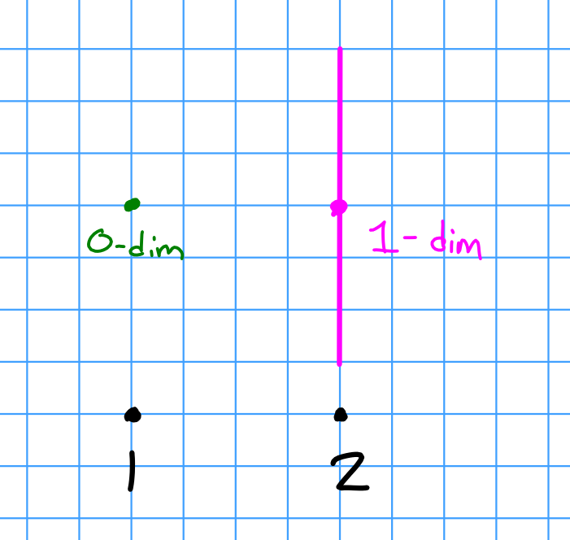

# Friday February 7th

## Projective Modules

For $X$ a topological space and $\pi:E\to X$ a real vector bundle on $X$.
Then $\Gamma(E, X) = \theset{\sigma: X\to E \suchthat \pi \circ \sigma = \id_X}$ is naturally a module over the ring $C(X, \RR)$ of continuous real-valued functions.
For $p\in X$, the fibers $\sigma(p) \in \pi\inv(p)$ are vector spaces, and we can consider $f(p)\sigma(p)$ for any $f\in C(X, \RR)$.
For trivial bundles $\RR^n \cross X \mapsvia{\pi} X$ with a global section

\begin{align*}
\sigma: X &\to \RR^n \cross X \\
p &\mapsto (\tilde\sigma(p), p)
.\end{align*}

Then $\tilde\sigma: X \to \RR^n$, or equivalently a collection of $n$ continuous functions $\tilde\sigma_j \to \RR$.
Thus $\Gamma(X, E) \cong C(X, \RR)^n$.

Theorem (Swan):
Suppose $X$ is compact. 
Then

a. $\Gamma(X, E)$ is a finitely generated projective $C(X, \RR)\dash$module, i.e. $\pi$ is a direct summand of a trivial vector bundle on $X$, and

b. There is an equivalence of categories between vector bundles on $X$ and finitely generated projective $C(X, \RR)\dash$modules.

*Example:*
Let $X$ be the two points space $\theset{1, 2}$.
Take a 0-dimensional vector space over $1$ and a 1-dimensional vector space over $2$.

\

*Remark:*
Such cheap examples exist on $X$ iff $X$ is disconnected.

**Definition:**
Recall that it $0 \to A \to B \mapsvia{f} C \to 0$ is exact, then a *splitting* is a map $\sigma: C\to B$ such that $f\circ \sigma = \id_C$.
Then $B = A \oplus \sigma(C) \cong A \oplus C$.

*Exercise:*
Take $R=\ZZ$ and find a SES such that $B\cong_\ZZ A \oplus B$ but the sequence is *not* split.

**Definition:**
A module $P$ is projective iff $0 \to M \to N \to P \to 0$ is split.

> Exercise: show that free implies projective.
> Lift basis and use universal property.

**Theorem:**
If $P$ is projective, then there exists a $K$ such that $P\oplus K$ is free.

> Idea: summands can be *both* a submodule and a quotient module.

*Proof:*
Choose a free $F$ and an $R\dash$module surjection $q:F \surjects P$ with $K = \ker q$ to obtain $0 \to K \to F \to P \to 0$.
Since $P$ is projective, this sequence splits and thus $F \cong K \oplus P$ is free.

$\qed$

*Comment:*
If $P$ is finitely generated, then we can take $K$ (and hence $F$) to be finitely generated module. 
A quotient of a finitely-generated module is also finitely generated, and $F \cong K \oplus P$.

**Theorem:**
If there exists a $K$ such that $P\oplus K$ is free, then $P$ satisfies this lifting property:

\begin{tikzcd}
             &  & P \arrow[dd, "f"] \arrow[lldd, "\exists \tilde f", dotted] &  &   \\
             &  &                                                            &  &   \\
M \arrow[rr] &  & N \arrow[rr]                                               &  & 0
\end{tikzcd}

*Proof:*
Choose $K$ such that $P \oplus K$ is free, and let $\theset{f_i}_{i\in I}$ be a basis for $F$.
Then write $F = P \oplus K$ and $f_i = p_i + k_i$ where $p_i \in P, k_i \in K$.
Then we can construct a unique $g: F\to M$  by sending $f_i$ to $m_i$.

\begin{tikzcd}
                  &  & \{f_i\}                                                               &  &   \\
                  &  & F = P\oplus K \arrow[dd, "\pi"] \arrow[lldddd, "\exists! g"', dotted] &  &   \\
                  &  &                                                                       &  &   \\
                  &  & P \arrow[dd, "f"] \arrow[uu, "{\iota(p) = (p, 0)}"', bend right=60]   &  &   \\
                  &  &                                                                       &  &   \\
M \arrow[rr, "q"] &  & N \arrow[rr]                                                          &  & 0 \\
\{m_i\}           &  & \{n_i\}                                                               &  &  
\end{tikzcd}

Then $q\circ g\circ \iota = (q\circ g) \circ \iota = (f\circ \pi) \circ \iota = f \circ (\pi \circ \iota) = f$ since $\iota$ is a section.

> Todo: Revisit!

$\qed$

This $P$ is projective iff

- Every length 2 resolution of $P$ splits.
- $P$ is a direct summand of a free module.
- $P$ satisfies this lifting property.

If $P$ satisfies this lifting property, we have:

\begin{tikzcd}
             &  &              &  &              &  & P \arrow[lldd, "\exists \sigma"'] &  &   \\
             &  &              &  &              &  &                                   &  &   \\
0 \arrow[rr] &  & M \arrow[rr] &  & N \arrow[rr] &  & P \arrow[uu, "\id_P"'] \arrow[rr] &  & 0
\end{tikzcd}

*Exercise:*
Show free implies projective in as many ways as you can (using any of these properties).

*Remark:*
The functor $M \mapsto \hom_R(P, M)$ is exact.
