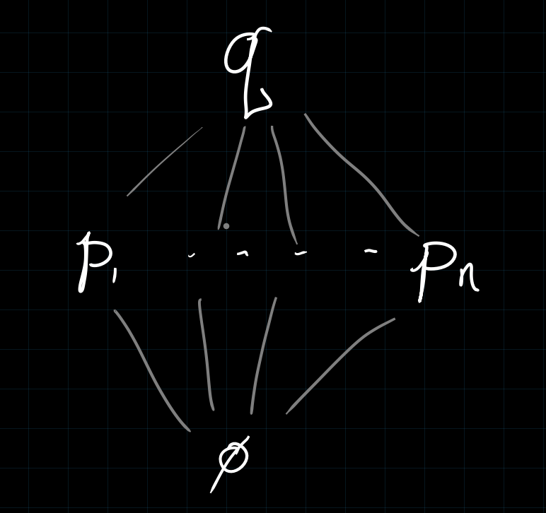

# Friday April 10th

Last time: prime avoidance, for $\mfp, \ts{\mfq_i} \in \spec R$, if $\mfp \subset \union \mfq_i$, then $\mfp \subset \mfq_i$ for some $\mfq_i$.

Theorem
: For $R$ Noetherian and $\mfp \subsetneq \mfq \in \spec R$, then $(\mfp, \mfq) \definedas \theset{\mfn \in \spec R \st \mfp \subsetneq \mfn \subsetneq \mfq}$ is either empty or infinite.

Proof
:   Wlog by passing from $R$ to $R/\mfp$, assume $\mfp = (0)$, and toward a contradiction assume that the theorem doesn't hold.
    Then $(\emptyset, \mfq) = \theset{\mfp_i}$, and by prime avoidance, there exists an $x\in \mfq \setminus \union \mfp_i$ and thus $\mfq$ is a minimal prime over $x$.
    By Hauptfidealsatz, $\ht(\mfq) \leq 1$, but this is a contradiction because $\ht(\mfq) \geq 2$.

   \

Proposition (Generalized Hauptfidealsatz)
: For $R$ Noetherian, $I = \gens{x_1, \cdots, x_n} \normalneq R$, if $\mfp \in \spec R$ is minimal over $I$, then $\ht(\mfp) \leq n$.

Corollary
: If $\mfp \in \spec(R)$ for $R$ Noetherian, then $R$ needs at least $\ht(\mfp)$ generators.

> Complete intersection: minimal number of defining equations.

Last item on Noetherian rings, used to prove Nullstellensatz:

Lemma (Artin-Tate Lemma)
: If $R$ is Noetherian and $R \subset T \subset S$ with $S$ finitely generated as a $T\dash$module and finitely-generated as an $R\dash$algebra, then $T$ is finitely generated as an $R\dash$algebra.
