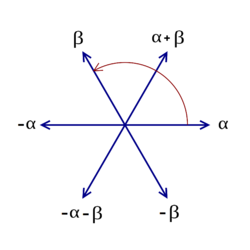

$\Phi$

%

The **root system**.

$\alpha \in \Phi \subset \mathfrak{h}^* \iff [h, x] = \alpha(h) x$ for all $h\in \mathfrak{h}$.

- Span a Euclidean space $E$
- $\alpha, c\alpha \in \Phi \implies c=-1$
- $s_\alpha \Phi \subseteq \Phi$ for all $\alpha$

%

lie algebra

---
