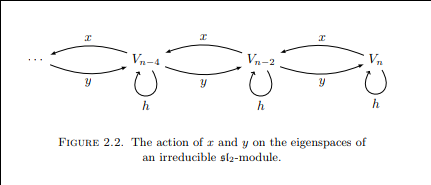

# Definitions

- Indecomposable: doesn't decompose as $A oplus B$. Weaker than irreducible.
- Irreducible: simple, i.e. no nontrivial proper submodules. Implies indecomposable.
- Solvable: Obtained as a tower of extensions of abelian groups; derived series terminates; composition series has cyclic sections;
- Borel: maximal solvable subalgebra
- Radical: Largest solvable ideal.
- Semisimple: Direct sum of simple; radical equals 0.
  - Acts diagonalizably.
- Reductive: Radical equals center.
- Artinian: ?
- Completely reducible: ?

# List of Notation

- $M(\lambda)$: Verma Modules

- $L(\lambda)$: Unique simple quotients of Verma modules.

# SL2 Theory

Definition
: The group and the algebra:
  \begin{align*}
  \sl(n, \CC)     &= \theset{M \in \gl(n, \CC) \suchthat \det(M) = 1} \\
  \liesl(n, \CC)  &= \theset{M \in \liegl(n, \CC) \suchthat \tr(M) = 0}
  .\end{align*}

Generated by
\begin{align*}
x =
\begin{bmatrix}
0 & 1 \\
0 & 0
\end{bmatrix}
,\quad
h =
\begin{bmatrix}
1 & 0 \\
0 & -1
\end{bmatrix}
,\quad
y =
\begin{bmatrix}
0 & 0 \\
1 & 0
\end{bmatrix}
\end{align*}

with relations

\begin{align*}
[xy] &= h \\
[hx] &= 2x \\
[hy] &= -2y
.\end{align*}

The Weyl group is given by $W \cong \ZZ/2\ZZ$ where $

Facts:

- $\dim_\CC \liesl(n, \CC) = n^2 - 1$.
- $\liesl(n, \CC) \sim A_{n-1}$
- $\liels(2, \CC)$ is simple.
  - Proof: show that if $I \normal \lieg$ then any of $x,y,h \in I$, using commutation relations.

Irreducible (?) representations (i.e. simple modules) of $\liesl(2, \CC)$ are parameterized by $L(\lambda),~n\in \ZZ^+$ and have basis given by
\begin{align*}
h \cdot v_{i} &= (\lambda-2 i) v_{i}\\
x \cdot v_{i} &= (\lambda-i+1) v_{i-1}\\
y \cdot v_{i} &= v_{i+1}
.\end{align*}

- The usual representation on $\CC^2$: $h$ has eigenvalues $\pm 1$, yields $L(1)$.
- The adjoint representation on $\CC^3$: $\ad h = \mathrm{diag}(2, 0, -2)$ with eigenvalues $0, \pm 2$, yields $L(2)$.
- Each $L(\lambda)$ has 1-dimensional weight spaces, parameterized by weights $\lambda, \lambda - 2, \cdots, -\lambda$.
- $\dim L(\lambda) = \lambda + 1$.

\

Basis
