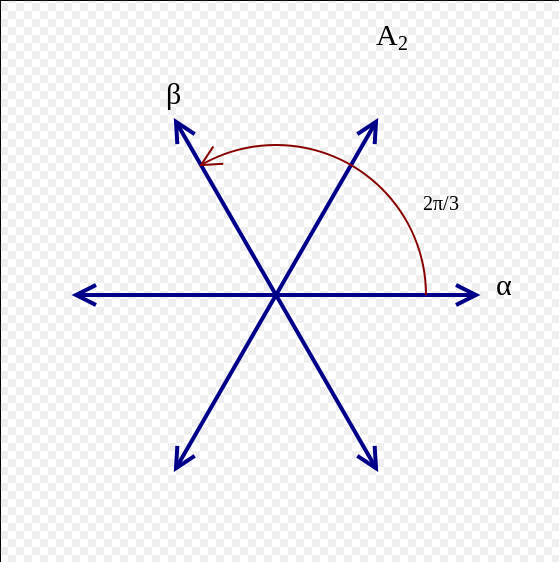

# Definitions

- Indecomposable: doesn't decompose as $A \oplus B$. Weaker than irreducible.
- Irreducible: simple, i.e. no nontrivial proper submodules. Implies indecomposable.
- Completely reducible: Direct sum of irreducibles.
- Solvable: Derived series terminates.
- Borel: maximal solvable subalgebra.
- Radical: Largest solvable ideal.
- Semisimple: Direct sum of simple modules.
  - Acts in a diagonalizable way.
- Reductive: Radical equals center.
- Artinian: Descending chain condition on submodules.
- Antidominant weight: $\inner{\lambda + \rho}{\alpha\dual} \not\in\ZZ^{>0}$, equivalently $M(\lambda) = L(\lambda)$.
- Dominant weight: $\inner{\lambda + \rho}{\alpha\dual} \not\in \ZZ^{< 0}$.
- Regular weight: $\lambda$ is regular iff the isotropy/stabilizer group $\stab_W(\lambda) \definedas \theset{w\in W\suchthat w\lambda = w}= 1$, equivalently $\abs{W\lambda} = \abs{W}$ so $\inner{\lambda + \rho}{\alpha\dual} \neq 0$ for all $\alpha\in \Phi$.
- Singular weight: Not regular.
- Linked: $\mu \sim \lambda \iff \mu \in W\cdot \lambda$, the orbit of $\lambda$ under $W$, a.k.a. the linkage class of $\lambda$.
- Socle: Direct sum of all simple submodules.
- Radical: Intersection of all maximal submodules, smallest submodule such that quotient is semisimple.
- Head: $M / \mathrm{rad}(M)$.

# List of Notation

- $M(\lambda)$: Verma Modules

- $L(\lambda)$: Unique simple *quotient* of $M(\lambda)$.

- $N(\lambda)$ the maximal *submodule* of $M(\lambda)$

- The root system $$\Phi = \ts{\alpha \in \lieh\dual \suchthat [hx] = \alpha(h)x ~\forall h\in \lieh}$$ containing roots $\alpha$
  - Abstractly: spans a Euclidean space, $\lambda \alpha \in \phi \implies \lambda = \pm 1$, and closed under reflections about orthogonal hyperplanes.
- $\Phi^+$ the corresponding positive system (choose a hyperplane not containing any root), $\Phi \definedas \Phi^+ \disjoint \Phi^-$.
- $$s_\alpha(\wait) \definedas(\wait) - 2\inner{\wait}{\alpha} \frac{\alpha}{\norm{\alpha}^2}$$ the corresponding reflection about the hyperplane $H_\alpha$
- $\lieg_\alpha \definedas \theset{x\in \lieg \suchthat [hx] = \alpha(h)x ~\forall h\in \lieh}$ the corresponding root space
- The triangular decomposition $$\lieg = \bigoplus_{\alpha\in \Phi^+} \lieg_{\alpha} \oplus \lieh \oplus \bigoplus_{\alpha \in \Phi^-} \lieg_{-\alpha} \definedas \lien^{-} \oplus \lieh \oplus \lien^{+}$$
- $\Delta$ the corresponding simple system of size $\ell$, i.e $\alpha = \sum_{\delta_k \in\Delta} c_\delta \delta_k$ with $c_\delta \in \ZZ^{\geq 0}$. 
- $\Lambda = \theset{\lambda \in E \suchthat \inner{\lambda}{\alpha\dual} \in \ZZ ~\forall \alpha\in\Phi }$ the integral weight lattice
- $\Lambda^+ = \ZZ^+\Omega$ the dominant integral weights
  - $\Omega \definedas \theset{\bar \omega_1, \cdots, \bar \omega_\ell}$ the fundamental weights
- $[A: B]$ the composition factor multiplicity of $B$ in a composition series for $A$.
- $(A: B)$ the composition factor multiplicity of $B$ in a *standard filtration* for $A$.
- $\phi_{[\lambda]}$ the integral root system of $\lambda$
- $\Delta_{[\lambda]}$ the corresponding simple system
- $W_{[\lambda]}$ the integral Weyl group of $\lambda$
- $\mu \uparrow \lambda$: strong linkage of weights
- $\OO_{\chi_\lambda}$: the block corresponding to $\lambda$.

# Useful Facts

- $\lambda$ dominant integral $\implies w\lambda \leq \lambda$ for all $W$.
- The dot action is given by $w\cdot \lambda = w(\lambda + \rho) - \rho$.

# SL2 Theory

Definition
:   The group and the algebra:

    \begin{align*}
    \liesl(n, \CC)     &= \theset{M \in \gl(n, \CC) \suchthat \det(M) = 1} \\
    \liesl(n, \CC)  &= \theset{M \in \gl(n, \CC) \suchthat \tr(M) = 0}
    .\end{align*}

- The usual representation on $\CC^2$: $h$ has eigenvalues $\pm 1$, yields $L(1)$.
- The adjoint representation on $\CC^3$: $\ad h = \mathrm{diag}(2, 0, -2)$ with eigenvalues $0, \pm 2$, yields $L(2)$.

Generated by
\begin{align*}
x =
\begin{bmatrix}
0 & 1 \\
0 & 0
\end{bmatrix}
,\quad
h =
\begin{bmatrix}
1 & 0 \\
0 & -1
\end{bmatrix}
,\quad
y =
\begin{bmatrix}
0 & 0 \\
1 & 0
\end{bmatrix}
\end{align*}

with relations

\begin{align*}
[hx] &= 2x \\
[hy] &= -2y \\
[xy] &= h \\
.\end{align*}

\begin{align*}
\Phi &= A_1 \\
\dim \lieh &= 1\\
\Lambda &\cong \ZZ \\
\Lambda_r & \cong \ZZ/2\ZZ \\
W &= \theset{1, s_0} \quad \lambda-2i \overset{s_0}\iff -\qty{\lambda-2i} \\
\Pi(M(\lambda)) &= \theset{\lambda, \lambda-2, \cdots, -\lambda} \\
\dim \qty{L(\lambda)}_\mu &= 1 ~\forall \mu \\
\chi_\lambda = \chi_\mu &\iff \mu = \lambda, -\lambda-2 \qtext{(linked)}
.\end{align*}

- $M(\lambda)$ is simple $\iff \lambda \not\in\ZZ^{\geq 0} = \Lambda^+ \iff \dim L(\lambda) = \infty$
  - If $\dim L(\lambda) < \infty$ then $N(\lambda) \cong L(-\lambda - 2)$.

\

Finite-dimensional irreducible representations (i.e. simple modules) of $\liesl(2, \CC)$ are in bijection with dominant integral weights $n\in \Lambda$, i.e. $n\in \ZZ^{\geq 0}$, are denoted $M(n)$, and each admits a basis $\theset{\vector v_i\suchthat 0\leq i \leq n}$ where
\begin{align*}
h \cdot v_{i} &= (n-2 i) v_{i}\\
x \cdot v_{i} &= (n-i+1) v_{i-1}\\
y \cdot v_{i} &= (i+1)v_{i+1}
,\end{align*}
setting $v_{-1} = v_{n + 1}=0$ and letting $v_0$ be the unique vector in $L(n)$ annihilated by $x$.

- $\mathrm{rad}~M(\lambda) = N(\lambda)$
- $\mathrm{hd}~M(\lambda) = L(\lambda)$.
- $M(\lambda)$ for $\lambda > 0$ not integral is simple, however $-\lambda-2\not\in W\cdot \lambda$.
- $\lambda \geq 0 \implies \ch L(\lambda) = \ch M(\lambda) - \ch M(s_\alpha \cdot \lambda)$ where $s_\alpha \cdot \lambda = -\lambda - 2$.
- For $\lambda \geq 0$, $\dim L(\lambda) = \lambda + 1$ and so $\ch L(\lambda) = e^\lambda + e^{\lambda-2} + \cdots + e^{-\lambda} = {e^{\lambda + 1} - e^{\lambda - 1} \over e^1 - e^{-1}}$.
- For $\lambda \neq \rho\in \ZZ$, the composition factors of $M(\lambda)$ are $M(\lambda), L(-\lambda - 2)$.

# SL3

$\liesl(3, \CC)$ has root system $A_2$:

\

\begin{align*}
\Delta &= \theset{\alpha, \beta} \\
W &= \theset{1, s_\alpha, s_\beta, s_\alpha s_\beta, s_\beta s_\alpha, w_0}\\
.\end{align*}

For $\lambda$ regular, integral, and antidominant:

- $M(\lambda) = L(\lambda)$
- No $M(w\cdot \lambda)$ is simple, all have $L(\lambda) = M(\lambda)$ as unique simple submodule.
-  $[M(w\cdot \lambda) : L(\lambda)] = [M(w\cdot \lambda) : L(w\cdot \lambda)] = 1$ for all $w$.
- $\ch L(s_\alpha \cdot \lambda) = \ch M(s_\alpha \cdot \lambda) - \ch M(\lambda)$.
- The Jantzen filtration is given by
\begin{align*}
M(w\cdot \lambda)^0 &= ? \\
M(w\cdot \lambda)^1 &= ? \\
M(w\cdot \lambda)^2 &= ? \\
.\end{align*}
