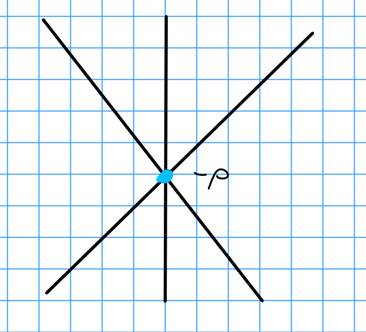

# Wednesday February 5th

Recall the Harish-Chandra morphism $\xi$:

\begin{tikzcd}
\mcz(\lieg) \arrow[rr, hook] \arrow[rrdd, "\xi", dashed] &  & U(\lieg) = U(\lieg \oplus \lien^- U(\lieg) + U(\lieg)\lien) \arrow[dd, "\pr"] \\
                                                         &  &                                                                               \\
                                                         &  & U(\lieh)                                                                     
\end{tikzcd}

If $M$ is a highest weight module of highest weight $\lambda$ then $z\in \mcz(\lieg)$ acts on $M$ by scalar multiplication.
Note that if we have $\chi_\lambda(z)$ where $z\cdot v = \chi_\lambda(z) v$ for all $v\in M$, we can identify $\lambda(\pr(z)) = \lambda(\xi(z))$.

## Central Characters and Linkage

The $\chi_\lambda$ are not all distinct -- for example, if $M(\mu) \subset M(\lambda)$, then $\chi_\mu = \chi_\lambda$.
More generally, if $L(\mu)$ is a subquotient of $M(\lambda)$ then $\chi_\mu = \chi_\lambda$.
So when do we have equality $\chi_\mu = \chi_\lambda$?

Given $\lieg \supset \lieh$ with $\Phi \supset \Phi^+ \supset \Delta$, then define $\rho = \frac 1 2 \sum_{\beta \in \Phi^+} \beta \in \lieh\dual$.
Note that $\alpha \in \Delta \implies s_\alpha \rho = \rho - \alpha$.

**Definition:**
The *dot action* of $W$ on $\lieh\dual$ is given by $w\cdot \lambda = w(\lambda + \rho) - \rho$, which implies $(\rho, \alpha\dual) = 1$ for all $\alpha \in \Delta$.
Then $\rho = \sum_{i=1}^\ell w$.

**Exercise:** 
Check that this gives a well-defined group action.

**Definition:**
$\mu$ is *linked* to $\lambda$ iff $\mu = w\cdot \lambda$ for some $w\in W$.
Note that this is an equivalence relation, with equivalence classes/orbits where the orbit of $\lambda$ is $\theset{w\cdot \lambda \suchthat w\in W}$ is called the *linkage class* of $\lambda$.

> Note that this is a finite subset, since $W$ is finite.

Note that orbit-stabilizer applies here, so bigger stabilizers yield smaller orbits and vice-versa.

*Example:*
$w\cdot (-\rho) = w(-\rho + \rho) - \rho = -\rho$, so $-\rho$ is in its own linkage class.

**Definition:**
$\lambda \in \lieh\dual$ is *dot-regular* iff $\abs{W\cdot \lambda } = \abs{W}$, or equivalently if $(\lambda + \rho, \beta\dual) \neq 0$ for all $\beta \in \Phi$.

> To think about: does this hold if $\Phi$ is replaced by $\Delta$?

We also say $\lambda$ is *dot-singular* if $\lambda$ is not dot-regular, or equivalently $\stab_{W\cdot}\lambda \neq \theset{1}$.

> I.e. lying on root hyperplanes.

Exercise:
If $0\in \lieh\dual$ is regular, then $-\rho$ is singular.

\

Proposition:
If $\lamdba \in \Lambda$ and $\mu \in W\cdot \lambda$, then $\chi_\mu = \chi_\lambda$.

Proof:
Start with $\alpha \in \Delta$ and consider $\mu = s_\alpha \cdot \lambda$.
Since $\lambda \in \Lambda$, we have $n\definedas (\lambda ,\alpha\dual) \in \ZZ$ by definition.
There are three cases:

1. $n\in \ZZ^+$, then $M(s_\alpha \cdot \lambda) \subset M(\lambda)$.
  By Proposition 1.4, we have $\chi_\mu =\chi_\lambda$.

2. For $n=-1$, $\mu = s_\alpha \cdot \lambda = \lambda + \rho -(\lambda + \rho, \alpha\dual)\alpha - \rho = \lambda + n+1 = \lambda + 0$.
  So $\mu = \lambda$ and thus $M_\mu = M_\lambda$.

3. For $n\leq -2$, 

\begin{align*}
(\mu, \alpha\dual) 
&= (s_\alpha \cdot \lambda , \alpha\dual) \\
&= (\lambda i (n+1)\alpha, \alpha\dual) \\
&= n - 2(n+1_ \\
&=-n-2 \\
&\geq 0
,\end{align*}
  
  so $\chi_\mu = \chi_{s_\alpha \cdot \mu} = \chi_{s\alpha \cdot (s_\alpha \cdot \lambda)} = \chi_\lambda$.
  Since $W$ is generated by simple reflections and the linkage property is transitive, the result follows by induction on $\ell(w)$.

$\qed$

**Exercise 1.8 (do but don't turn in):**
See book, show that certain properties of the dot action hold (namely nonlinearity).

## 1.9: Extending the Harish-Chandra Morphism

We want to extend the previous proposition from $\lambda \in \Lambda$ to $\lambda \in \lieh\dual$.
