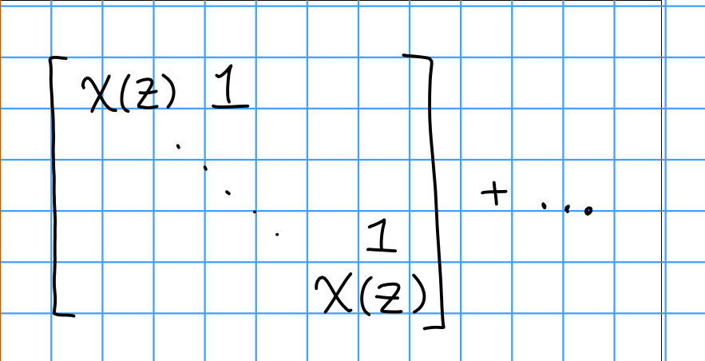

# Wednesday February 12th

## Infinitesimal Blocks

We'll break up category $\OO$ into smaller subcategories (blocks).

Recall theorem 1.1 (e):
$\mcz(\lieg)$ acts locally finitely on $M\in \OO$, and $M$ has a *finite* filtration with highest weight sections, so $M$ should involve only a finite number of central characters $\chi_\lambda$ (where $\lambda \in\lieh\dual$).

> Note: an analog of Jordan decomposition works here because of this finiteness condition.
> This discussion will parallel the JCF of a simple operator on a finite dimensional $\CC\dash$vector space.
> However, this involves the *entire* center instead of just scalar matrices, so the analogy is diagonalizing a family of operators simultaneously.

Let $\chi \in \hat \mcz(\lieg)$ and $M\in \OO$.
Let 
$$
M^\chi = \theset{v\in M \suchthat ~\forall z\in \mcz(\lieg),~\exists n>0 \st (z- \chi(z))^n \cdot v = 0$}
$$

Idea: write $z = \chi(z) \cdot 1 + (z-\chi(z)\cdot 1)$, where the first is a scalar operator and the second is (locally) nilpotent on $M^\chi$.
Thus we can always arrange for $z$ to act by a sum of "Jordan blocks":

\

*Observations:*

- $M^\chi$ are $U(\lieg)\dash$submodules of $M$.
- The subspaces $M^\chi$ are linearly independent
- $\mcz(\lieg)$ stabilizes each $M_\mu$ since $\mcz(\lieg)$ and $U(\lieh)$ are a commuting family of operators on $M_\mu$.
- We can write $M_\mu = \bigoplus_{\chi \in \hat\mcz(\lieg)} (M_\mu \intersect M^\chi)$, and since $M$ is generated by a finite sum of weight spaces, $M = \bigoplus_{\chi \in \hat\mcz(\lieg)} M^\chi$. 
- By Harish-Chandra's theorem, every $\chi$ is $\chi_\lambda$ for some $\lambda \in \lieh\dual$.

Let $\OO_\chi$ be the full subcategory of modules $M$ such that $M = M^\chi$; we refer to this as a *block*.

> Note: full subcategory means keep all of the hom sets.

**Proposition:**
$\OO = \bigoplus_{\lambda \in \lieh\dual} \OO_{\chi_\lambda}$.
Each indecomposable module in $\OO$ lies in a *unique* $\OO_\chi$.
In particular, any highest weight module of highest weight $\lambda$ lies in $\OO_{\chi_\lambda}$.

> Thus we can reduce to studying $\OO_{\chi_\lambda}$.

*Remark:*
$\OO_{\chi_\lambda}$ has a finite number of simple modules $\theset{L(w\cdot \lambda) \suchthat w\in W}$ and a finite number of Verma modules $\theset{M(w\cdot \lambda) \suchthat w\in W}$.

## Blocks

Let $\mcc$ be a category with is artinian and noetherian, with $L_1, L_2$ simple modules.
We say $L_1 \sim L_2$ if there exists a non-split extension $0 \to L_1 \to M \to L_2 \to 0$, i.e. $\ext^1_\OO(L_2, L_1) \neq 0$.
In particular, $M$ equivalently needs to be indecomposable.
We then extend $\sim$ to be reflexive/symmetric/transitive to obtain an equivalence relation.

> $L_1$ ends up being the socle here.

This partitions the simple modules in $\mcc$ into *blocks* $\mcb$.

