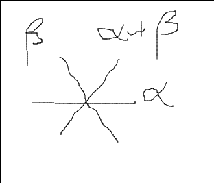
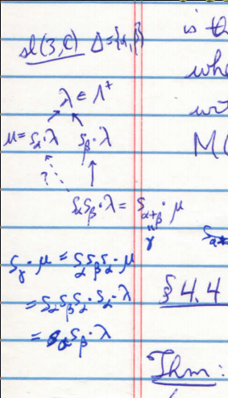

# Monday March 16th

Proposition
: Suppose $\lambda + \rho$ is dominant integral, then

- $M(w\cdot \lambda) \subset M(\lambda)$ for all $w\in W$
- $[M(\lambda): L(w\cdot \lambda)] > 0$ for all $w\in W$

  More precisely, if $w = s_1 \cdots s_\ell$ is reduced with $s_i = s_{\alpha_i}$ and $\lambda_k = s_k \cdots s_1 \cdot \lambda$, then

  ...

  Proof
  : By induction on $n = \ell(w)$.
    The $n=0$ case is obvious.
    For $\ell(w) = k+1$, write $w'= s_k \cdots s_1$.
    From section 0.3, $(w')\inv \alpha_{k+1} > 0$.
    We can compute
    \begin{align*}
    (\lambda_k + \rho, \alpha_{k+1}\dual)
    &= (w' \cdots \lambda + \rho, \alpha_{k+1}\dual) \\
    &= (w'(\lambda + \rho), \alpha_{k+1}\dual) \\
    &= (\lambda + \rho, (w')\inv \alpha_{k+1}\dual) \\
    &= (\lambda + \rho, ((w')\inv \alpha_{k+1})\dual) \\
    &\in \ZZ^{+}
    \end{align*}
    since $\lambda + \rho \in \Lambda^+$ and $(w')\inv \alpha_{k+1} \in \Phi^+$.

    This means that $\lambda_{k+1} = s_{k+1} \lambda_k \leq \lambda_k$.
    By proposition 1.4, reformulated in terms of the dot action, we have a map $M(\lambda_{k+1}) \injects M(\lambda_k)$, and nonzero morphisms are injective by 4.2a.

Exercise (4.3)
: If $\lambda + \rho \in \Lambda^+$, $\soc M(\lambda) = M(w_o \cdot \lambda)$, and moreover if $\lambda \in \Lambda_0^+$ then the inclusions in the proposition are all proper.

Remark
: For general $\mu \in \Lambda$, it is not so easy to decide when $M(w\cdot \mu) \subset M(\mu)$.
  The basic problem is that Proposition 1.4 only works for *simply* roots, whereas we can have $s_\gamma \cdot \mu < \mu$ for $\gamma \in \Phi^+\setminus \Delta$ with no obvious way to constrct an embedding
  $M(s_\gamma \cdot \mu) \subset M(\mu)$.
  See the following example.

Example
: Let $\lieg = \liesl(3, \CC)$.

  \

  We don't know if there's a diagonal map indicated by the question mark in the following diagram:

  \

Next few sections: any root reflection that moves downward through the ordering induces a containment of Verma modules.

## (4.4) Simplicity Criterion: The Integral Case

Theorem
: Let $\lambda \in \lieh\dual$ be any weight.
  Then $M(\lambda) = L(\lambda) \iff \lambda$ is antidominant.

The proof for $\lambda$ integral is fairly easy, because antidominance reduces to a condition involving simple roots, where we can use our Verma module embedding criterion from Proposition 1.4.

### Proof (Integral Case)

Assume $\lambda \in \Lambda$.

$\implies$:
Assume $M(\lambda)$ is simple but $\lambda$ is not antidominant.
Then since $\lambda \in \Lambda$, $(\lambda + \rho, \alpha\dual)$ is a positive integer for some $\alpha \in \Delta$.
But then $s_\alphga \lambda < \lambda$ so $M(s_\alpha \cdot \lambda) \subset M(\lambda)$ by 1.4 and 4.2.
But then $N(\lambda) \neq 0$, which contradicts irreducibility.

$\impliedby$:
Assume $\lambda$ is antidominant.
By proposition 3.5, $\lambda < w\cdot \lambda$ for all $w\in W$.
Since all composition factors of $M(\lambda)$ and $L(w\cdot \lambda)$ where $w\cdot \lambda \leq \lambda$.
This can only happen if $w\cdot \lambda = \lambda$, and so the only possible composition factor is $L(\lambda)$.
Since $[M(\lambda) : L(\lambda)]$ is always equal to one, $M(\lambda)$ is simple.

$\qed$

Remark
: The reverse implication still works in general if $W$ is replaced by $W_{[\lambda]}$.
To extend the forward implication, we need to understand embeddings $M(s_\beta \cdots \lambda) \injects M(\lambda)$ when $\beta$ is not simple.

Lemma
: Let $\mfa$ be a nilpotent Lie algebra (e.g. $\lien^-$) and $x\in \mfa, u\in U(\mfa)$, then for every $n\in \ZZ^+$ there exists a $t\in \ZZ^+$ such that $x^t u \in U(\mfa) x^n$.
