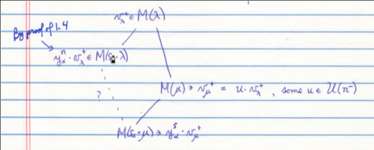

# Monday March 30th

Reminder of what we did already: we started on chapter 4, going into more detail on the strucutre of Verma modules and morphisms between them.
We showed that the socle is an irreducible Verma modules, any nonzero morphism is injective, and the dimension of the hom space is at most 1.
We ended showing a proposition about how to commute elements.

Proposition (Key Result)
:   Let $\lambda, \mu \in \lieh\dual$ and $\alpha\in\Delta$ be simple.
    Assume that $n\definedas (\lambda + \rho, \alpha\dual) \in \ZZ$ and $M(s_\alpha \cdot \mu) \subset M(\mu) \subset M(\lambda)$.
    Then either

    a. $n\leq 0$ and $M(\lambda) \subset M(s_\alpha \cdot \lambda)$, or
    b. $n>0$ and $M(s_\alpha \cdot \mu) \subset M(s_\alpha \cdot \lambda) \subset M(\lambda)$.

    In either case, $M(s_\alpha \cdot \mu) \subset M(s_\alpha \cdot \lambda)$.

Proof (of (a))
: Use proposition 1.4 (exchanging $\lambda$ and $s_\alpha \cdot \lambda$).

## Proof (of (b))

Assume $n>0$.
Then $M(s_\alpha \cdot \lambda) \subset M(\lambda)$ by proposition 1.4.
Set $s = (\mu + \rho, \alpha\dual) \in \ZZ^+$.
Denote maximal vectors as follows:

\

Apply the lemma about nilpotent lie algebras to $\lien^-, y_\alpha, u$, and $n$, then there exists a $t>0$ such that $y_\alpha^t u \in U(\lien^-) y_\alpha^n$.
Then
\begin{align*}\label{star}
y_\alpha^t \cdot v_\lambda^+ = y_\alpha^t u \cdot v_\lambda^+ \in U(\lien^-) y_\alpha^n \cdot v_\lambda^+ \subseteq M(s_\alpha \cdot \lambda)
.\end{align*}

Now there are two cases.

**Case 1**:

If $t\leq s$, we can apply $y_\alpha^{s-t}$ to equation star to obtain $y_\alpha^s \cdot v_\lambda^+ \in M(s_\alpha \cdot \lambda)$.
Thus we have the containment we wanted to prove.

**Case 2**:

Suppose $t > s$.
We can't divide in the enveloping algebra, but recall the identity in lemma 1.4(c):
\begin{align*}
[x_\alpha y_\alpha^t] = t y_\alpha^{t-1} \qty{ h_\alpha - t + 1}
.\end{align*}

Thus
\begin{align*}
[x_\alpha y_\alpha^t] \cdot v_\mu^+ = t(s-t) y_\alpha^{t-1} \cdot v_\mu^+
.\end{align*}

Calculating the bracket another way, the LHS is equal to $x_\alpha y_\alpha^t \cdot v_\mu^+ - y_\alpha^t x_\alpha \cdot v_\mu^+$ and the second term is zero, so this is in $M(s_\alpha \cdot \lambda)$ by equation star.

