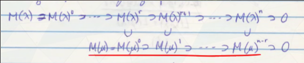
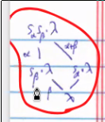

# Friday April 3rd

Recall from last time that we defined a new partial order for all positive roots generated by "reflecting down", namely *strong linkage*.
We had a theorem: $\mu \uparrow \lambda \implies M(\mu)$ occurs as a composition factor of $M(\lambda)$.
We also have a side-arrow notation $w' \mapsvia{s_\alpha} w$ indicates that $w' = s_\alpha w$ and $w'$ is shorter than $w$.
We conclude that $x\cdot \lambda \uparrow w\cdot \lambda \iff x\leq w$ for $x, w\in W$, where the RHS is the usual Bruhat order and is notably independent of $\lambda$.

Corollary
:   Let $\lambda \in \Lambda$ be antidominant and $\rho\dash$regular and $x, w\in W$.
    Then
    $$
    [M(w\cdot \lambda) : L(x\cdot \lambda)] \neq 0 \iff M(x\cdot \lambda) \injects M(w\cdot \lambda) \iff x \leq w
    $$
Note that this statement is why we use antidominant instead of dominant, since this equation now goes in the right direction.

## Jantzen Filtration

Theorem
:   Given $\lambda \in \lieh\dual$, $M(\lambda)$ has a terminating descending filtration satisfying

    a. Each nonzero quotient has a certain nondegenerate contravariant form (3.14)

    b. $M(\lambda)^i = N(\lambda)$

    c. $\sum_{i > 0} \ch M(\lambda)^i = \sum_{\alpha > 0, s_\alpha \cdot \lambda < \lambda} \ch M(s_\alpha \cdot \lambda)$ (the Integer sum formula, very important)

Note that the sum on the RHS is over $\theset{ \alpha\in\Phi^+_{[\lambda]} \suchthat s_\alpha \cdot \lambda < \lambda } \definedas \Phi^+_\lambda$.

Fact
:   $\soc M(\lambda) = L(\mu)$ for the unique antidominant $\mu$ in $W_{[\lambda]}\cdot \lambda$.
    Moreover, $[M(\lambda) : L(\mu)] = 1$.

Now suppose $M(\lambda)^n \neq 0$ but $M(\lambda)^{n+1} = 0$.
Each $M(\lambda)^i \supset \soc M(\lambda) = L(\mu)$, since they're submodules, and each $M(s_\alpha \cdot \lambda) \supset L(\mu)$, using the uniqueness of $\mu$.
By looking at coefficients of $\ch L(\mu)$ on each side of the sum formula, we obtain $n = \abs{\Phi^+}$.

Exercise (5.3)
:   When $\lambda$ is antidominant, integral, and $\rho\dash$regular, then $n = \ell(w)$.
    More generally, for nonintegral, $n = \ell_\lambda(w)$ where $\ell_\lambda$ is the length function of the system $(W_{[\lambda]}, \Delta_{[\lambda]})$.

Some natural questions:

1. Is the Jantzen filtration unique for properties (a)-(c)?
2. What are the "layer multiplicites" $[M(\lambda): L(\mu)]$?
3. Are the layer $M(\lambda)$ semisimple?
    If so, is the Jantzen filtration the same as the canonical filtrations with semisimple quotients (the radical or socle filtrations)?
4. When $M(\mu) \subset M(\lambda)$, how to the respective Jantzen filtrations compare?

A guess for (4):
Assume $\mu \up \lambda$, set $r = \abs{\Phi^+_\lambda} - \abs{\Phi_\mu^+}$, which is the difference in lengths of the two Jantzen filtrations.

Is it true that:

\

with $M(\mu) \intersect M(\lambda)^i = M(\mu)^{i-r}$ for $i\geq r$?

This is called the *Jantzen conjecture* and turns out to be true.

> Thought equivalent to KL-conjecture, but turned out to be deeper.
> See decomposition theorem, sheaves on flag varieties, no simple algebraic proof until recently.
> See chapter 8.

Recall that we obtained a hexagon:

\

We have
\begin{align*}
\Phi_{w\cdot \lambda}^{+}=\left\{\gamma \in \Phi^{+} | s_{\gamma} \cdot(w\cdot \lambda)<w \cdot \lambda\right\}=\{\alpha, \alpha+\beta\}
\end{align*}

with corresponding weights $s_\gamma(w\cdot \lambda) = s_|beta \cdot \lambda, s_\alpha \cdot \lambda$.

