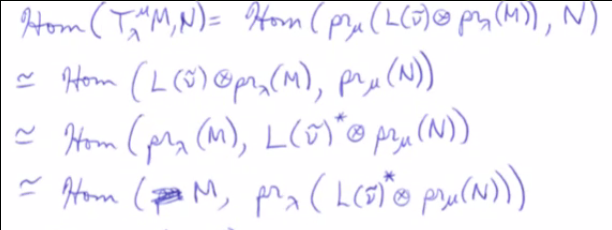
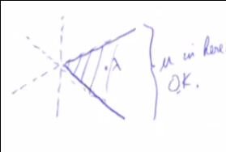

# Friday April 10th

## Translation Functors

Extremely important, allow mapping functorially between blocks (recalling $\OO = \bigoplus \OO_{\chi_\lambda}$) and in good situations gives an equivalence of categories.

Definition
: A *projection functor* $\pr_\lambda: \OO \to \OO_{\chi_\lambda}$ where $M = \bigoplus_\mu M^{\chi_\mu} \mapsto M^{\chi_\lambda}$.

Convention:
From now on, all weights will be integral

Proposition
:   \hfill

    1. $\pr_\lambda$ is an exact functor
    2.$\hom(M, N) \cong \bigoplus_\lambda \hom(\pr_\lambda M, \pr_\lambda N)$
    3. $\pr_\lambda (M\dual) = (\pr_\lambda M)\dual$
    4. $\pr_\lambda$ maps projectives to projectives
    5. $\pr_\lambda$ is self-adjoint

Proof
:   \hfill

    1. Given $0 \mapsvia f N \mapsvia g P \to 0$, we can decompose this as $0 \to \bigoplus_\lambda M^{\chi_\lambda} \mapsvia{\oplus f_\lambda} \bioplus_\lambda N^{\chi_\lambda} \mapsvia {\oplus g_\lambda} \bigoplus_\lambda P^\lambda \to 0$, which gives exactness on each factor.
    2. We can move direct sums out of homs.
    3. Write $\pr_\lambda \qty{ \qty{\bigoplus M^{\chi_\lambda} }\dual }$ and use theorem 3.2b to write as $(M^{\chi_\lambda})\dual$.
    4. $\pr_\lambda(P)$ is a direct summand of a projective and thus projective.
    5. We have $\hom(\pr_\lambda M, N) = \hom(\pr_\lambda M, \pr_\lambda N) = \hom(M, \pr_\lambda N)$.

Definition
:   Let $\lambda, \mu \in \Lambda$ with $\nu = \mu - \lambda$ integral.
    Then there exists $w\in W$ such that $\tilde \nu \definedas w\nu \in \Lambda^+$ is in the dominant chambed.
    Define the *translation functor* $T_\lambda^\mu = \pr_\mu(L(\tilde \nu) \tensor_\CC \pr_\lambda(M))$, where we use the fact that $\tilde \nu$ dominant makes $L(\tilde \nu)$ finite-dimensional.

This is a functor $\OO^{\chi_\lambda} \to \OO^{\chi_\mu}$.

Proposition
:   \hfill

    1. The translation functor is exact.
    2.  $T_\lambda^\mu (M\dual) = \qty{T_\lambda^\mu M}\dual$
    3. It maps projects to projectives.

Proof
:   \hfill

    1. It is a composition of exact functors, noting that tensoring over a field is always exact.
    2. Use proposition 12, $L(\tilde \nu)$ is self-dual, and $A\dual \tensor B\dual \cong (A\tensor B)\dual$.
    3. Use proposition 1 and previous results, e.g. $L \tensor_\CC \wait$ preserves projectives if $\dim L < \infty$ (Prop 3.8b).

Proposition
: $\hom(T_\lambda^\mu M, N) \cong \hom(M, T_\mu^\lambda N)$, which also holds for every $\ext^n$.

Proof
:   We have

    \

    But $L(\tilde \nu)\dual \cong L(-w_0 \tilda \nu)$ and $-w_0 \tilde \nu = w_0 w(\lambda - \mu)$ is the dominant weight in the orbit of $\lambda - \mu$ used to define $T_\mu^\lambda$.

    For the second part, use a long exact sequence -- if two functors are isomorphic, then their right-derived functors are isomorphic.

Does this functor take Vermas to Vermas?
I.e. do we have $M(w\cdot \lambda) \mapsto M(w\codt \mu)$ when $T_\lambda^\mu \OO_{\chi_\lambda} \to \OO_{\chi_\mu}$?

Picture for $\liesl(3, \CC)$:

\

