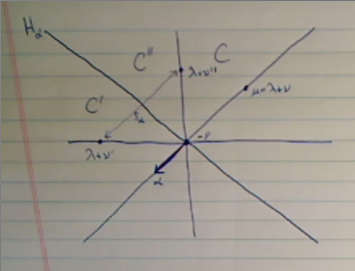

# Monday April 13th

Reviewing the definition of *facets*.
We partitioned $\Phi$ into 3 sets $\Phi_F^{0, \pm}$, some of which could be empty.
We had notion of upper and lower closure given by replacing the strict inequalities with inequalities in condition (3) and (2) respectively.

\

Definition
: If $F$ is a facet with $\Phi_F^0=\emptyset$, then $F$ is called a *chamber*.

A facet with exactly 1 root in $\Phi_F^0$, then this is called a *wall*.

Observations:

1. $\Phi^+ = \Phi_F^+$ always defines a chamber called the *fundamental chamber* and is denoted $C_0$.
2. If $F$ is any chamber, then $F = w\cdot C_0$ for some $w\in W$.

Proposition
:   \hfill
    
    a. Every facet $F$ is the upper closure of some unique chamber $C$.
    b. If $F \subset \hat C$ then $\hat F \subset \hat C$.

Proof
:   \hfill

    a. If $F$ is given by $\Phi_F^0 \union \Phi_F^+ \union \Phi_F^-$ and $C$ pairs with $\Phi_C^+ = \Phi_F^+$ and thus $\Phi_C^- = \Phi_F^- \union \Phi_F^0$.
      To see that $C\neq \emptyset$, use remark (1) on page 132.
    b. Obvious from above description of $C$.

## Key Lemma from 7.5

We're focusing only on integral weights, and we want to calculate the translation functor of a Verma $T_\lambda^\mu M(\lambda)$.
First step: project onto $\lambda$ block, but $M(\lambda)$ is in that block already.
Then tensor with $L(\tilde \nu)$, then the product has a standard filtration with certain Verma section $M(\lambda + w\tilde \nu)$, each occurring with multiplicity one.
The weight $\tilde \nu$ is the unique dominant weight in the orbit of $\mu - \lambda$, one of the Verma sections is in $M(\mu)$.
We plan to show that $T_\lambda^\mu M(\lambda) = M(\mu)$ in "good" situations.

Lemma
:   Let $\lambda, \mu \in \Lambda$ be integral weights and $\nu = \mu - \lambda$ and $\tilde \nu \in \Lambda^+ \intersect W \nu$ (which is unique).
    Assume there is a facet $F$ with $\lambda \in F, \mu \in \bar F$.
    Then for all weights $\nu' \neq \nu$ of $L(\tilde\nu)$, the weight $\lambda + \nu'$ is *not* linked to $\lambda + \nu = \mu$ under $W$.

Proof:

Toward a contradiction, suppose there exists $\nu \neq \nu$ in $\Pi(L(\tilde \nu))$ with $\lambda + \nu' \in W\cdot (\lambda + \nu)$.
Define the *distance* between two chambers $C, C'$ as the number of root hyperplanes separating them.
Under the correspondence between chambers and $W$ given by picking a fundamental chamber, the distance corresponds to the difference in lengths between the corresponding Weyl group elements.

So choose chambers $C, C'$ with $F \subset \bar C$, $\lambda + \nu' \in \bar C'$, and $d(C, C')$ is minimal.
We now go through 14 easy steps.

1. The case $d(C, C') = 0$ is impossible, since this would force $C =C'$/
    But $C$ is a fundamental domain for the dot action, where $C' \ni \lambda + \nu' \neq \lambda + \nu = \mu \in \bar F \subset \bar C$.
    This contradicts $C$ being a fundamental domain, since each ? will be conjugate to a *unique* element.
2. The case $d(C, C') > 0$ implies there's a hall $H_\alpha \intersect \bar C '$ of $C'$ separating $C'$ from $C$.
    Wlog assume $C'$ is on the positive side of $H_\alpha$ and $\alpha > 0$ and $C$ is on the negative side.
    Since $\bar F \subset \bar C$, we have $(\xi + \phi, \alpha\dual) \leq 0$ for all $\xi \in \bar F$.

