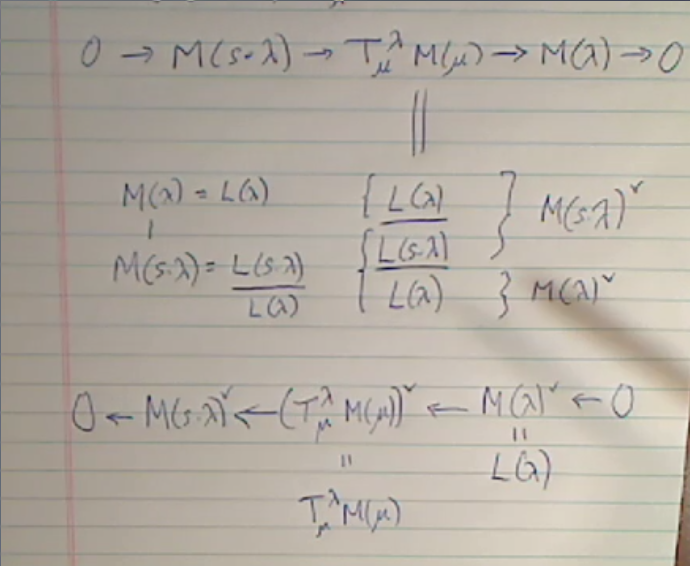

# Friday April 24th

Chapter 11: Tilting Modules.

Recall that these are defined by modules with both a standard and a costandard filtration.

Theorem (7.14)
:   Let $\lambda, \mu \in \Lambda$ be antidominant with $\lambda$ regular (so in the antidominant chamber $C$) and $\mu$ lies on a single simple root wall $H_\alpha \intersect \bar C$ (i.e. the stabilizers $W_\mu^0)$ of $\mu$ under the dot action is $\theset{1, s}$ with $s = s_\alpha$ for some $\alpha \in \Delta$.)\
    Assume that $w\in W$ with $ws > w$, then

    a. There is a SES (singular to regular, translation off the wall): $$ 0 \to M(ws \cdot \lambda ) \to T_{\mu}^\lambda M(w\cdot \mu) \to M(w\cdot \lambda) \to 0.$$
    b. The head is given by $\text{Head} T_{\mu}^\lambda M(w\cdot \mu) = L(w\cdot \lambda)$, and in particular the LHS is indecomposable and the sequence in (a) is non-split.

The SES here represents starting at the RHS, translating to get to a wall to get the middle term, then translating off the wall and picking up an $s$ term.

To see that standard and costandard filtrations exist, we can consider:

\

Also recall Proposition 3.7a: If $M\in \OO$ has a standard filtration and $\lambda \in \Pi(M)$ is maximal, then $M(\lambda) \injects M$ and $M/M(\lambda)$ has a standard filtration.
