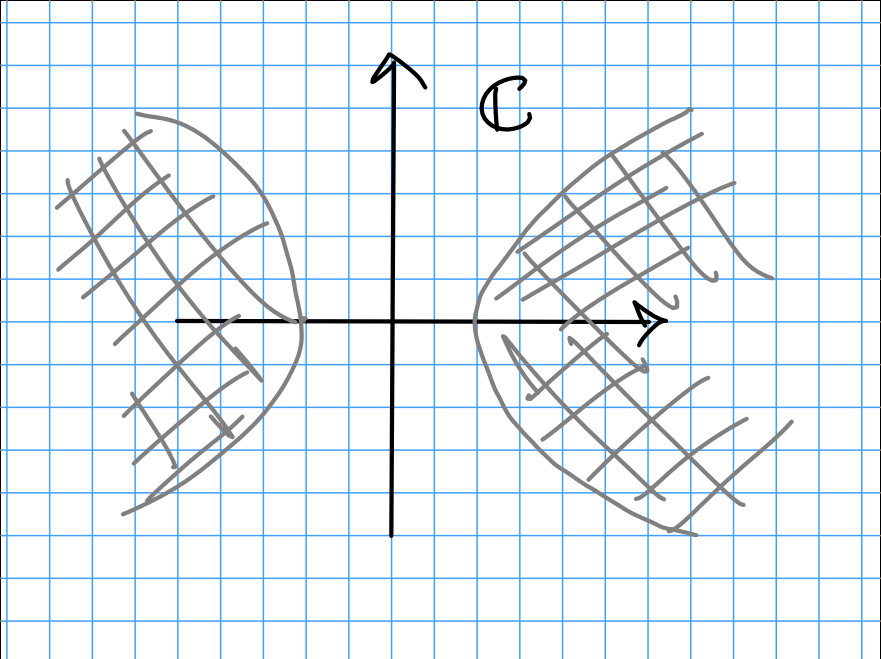

# 1

## a 
On the real plane: a circle of radius 1 centered at $(1, 0)$.

## b
Let $z = x+iy$. 
Then

\begin{align*}
\abs{z-1} = 2\abs{z-2}
&\iff \abs{z-1}^2 = 4\abs{z-2}^2 \\
&\iff (x-1)^2 - y^2 = 4( (x-2)^2  - y^2) \\
&\iff x^2 - \frac {14}{3} x - y^2 = -5 \\
&\iff \qty{ x - \frac{14}{6} } - y^2 = -5 + \qty{ \frac{14}{6} }^2 = \frac 4 9 \\
&\iff \qty{ \frac{x - 14/6 }{ 2/3 }}^2 - \qty{ \frac{y}{2/3} }^2 = 1
,\end{align*}

which describes a horizontally shifted hyperbola.

## c. 
Equivalently, $z\bar z = 1 = \abs{z}^2$, so this is the circle $S^1 = \theset{z\in \CC \suchthat \abs{z} = 1}$.

## d. 
On the real plane: A vertical line passing through $(3, 0)$ and $(3, t)$ for every $t\in \RR$.

## e. 
On the real plane: A horizontal line passing through $(0, a)$ and $(t, a)$ for every $t\in \RR$.

## f. 
On the real plane: A right half-plane $H = \theset{(x, y) \in \RR^2 \suchthat x \geq a, y\in \RR}$.

## g. 
The two regions "inside" the branches of the hyperbola given in $b$, i.e.

\

# 2
?

# 3

By part 2, we have

\begin{align*}
\abs{z} \leq 1 \implies \abs{f(z)} = \abs{z^3 + 2z + 4} \geq \abs{z}^3 + 2\abs{z} + 4 \geq 6
,\end{align*}

so $f(z) = 0$ is not possible for any $z$ in the unit disk.

# 4

## a

## b

# 5

# 6

# 7

# 8

# 9

# 10

# 11
