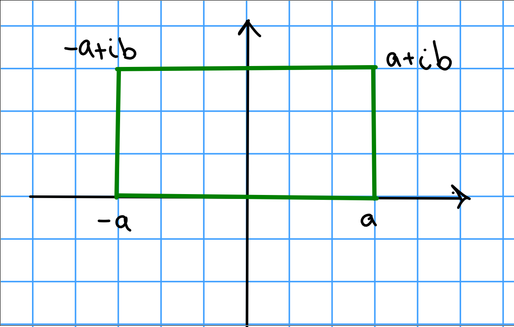

# Friday January 24th

**Corollary:**
If $\gamma$ is a closed curve on $\Omega$ an open set and $f$ is continuous with a primitive in $\Omega$ (i.e. an $F$ holomorphic in $\Omega$ with $F'=f$) then $\int_\gamma f ~dz = 0$.

*Proof (easy):*
\begin{align*}
\int_\gamma f ~dz = \int_\gamma F' = F'(z) z(t) ~dt  = F(z(b)) - F(z(a)) = 0
.\end{align*}

Corollary:
If $f$ is holomorphic with $f'=0$ on $\Omega$, then $f$ is constant.

*Proof (easy):*
Pick $w_0 \in \Omega$; we want to fix $w_0 \in \Omega$ and show $f(w) = f(w_0)$ for all $w\in \Omega$.

Take any path $\gamma: w_0 \to w$, then 

\begin{align*}
0 = \int_\gamma f' = f(w) - f(w_0)
.\end{align*}

Example:
Let $f(z) = e^{-z^2}$, this is holomorphic.
Write $f(z) = \sum (-1)^n z^{2n}/n!$, so $\int f = \sum (-1)^n z^{2n+1}/(n! (2n+1))$.
Since $f$ is entire, $\int f$ is entire, and $(\int f)' = f$ so this function has a primitive.
Thus $\int_\gamma f(z) = 0$ for *any* closed curve.
So take $\gamma$ a rectangle with vertices $\pm a , \pm a + ib$.

