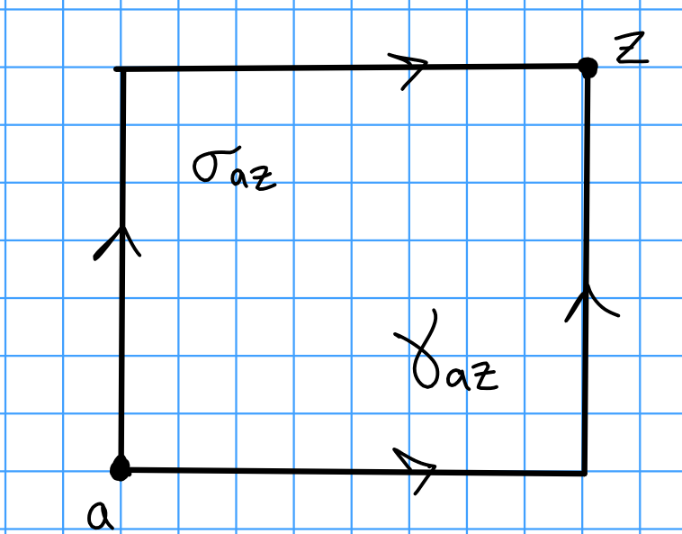
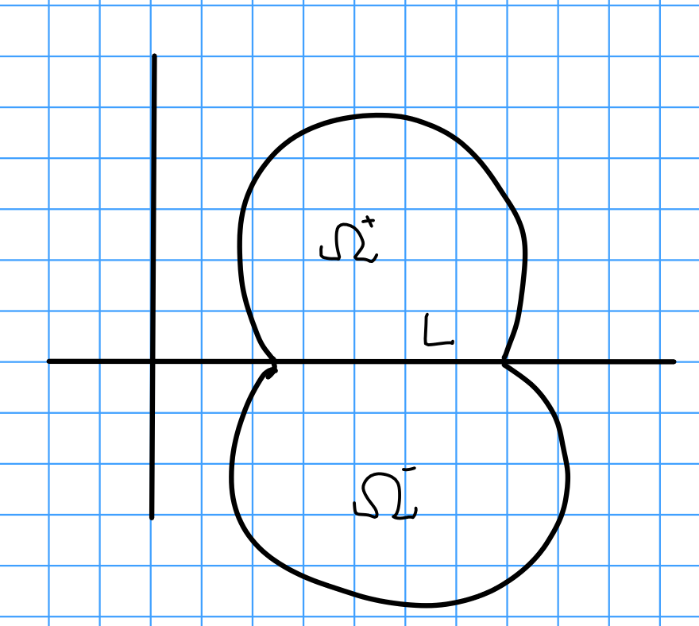
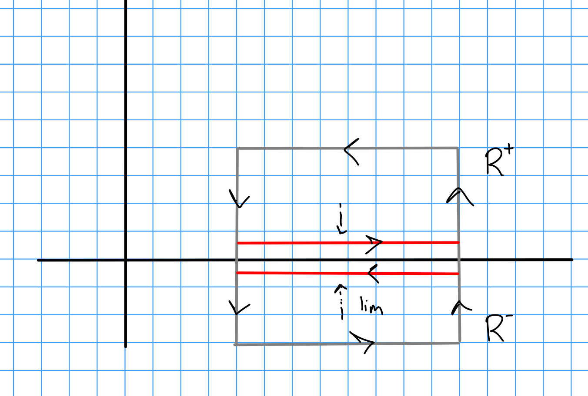
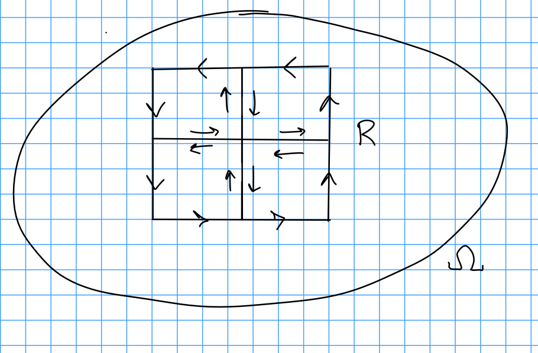

# Wednesday February 5th

Recall last time:
We have Cauchy's theorem, which says that if $f: \Omega \to \CC$ is holomorphic then $\int_\gamma f~dz = 0$.

We have a partial converse, Morera's theorem: If $g: \Omega \to \CC$ is continuous and $\int_R g~dz = 0$ for every rectangle $R\subset \Omega$ with sides parallel to the axes, then $g$ is holomorphic.

Proof:
Fix a point $a\in\Omega$, then for any $z\in\Omega$ define $f(z) = \int_{\gamma_{a, z}} g(\xi) d\xi = \int_{\sigma_{a, z}} g(\xi) d\xi$.

\

Then $\dd{f}{z} = \dd{f}{x} = \frac 1 i \dd{f}{y} = g(z)$, making $g$ holomorphic.

$\qed$

**Theorem (Schwarz Reflection):**
Let $\Omega = \Omega^+ \union L \union \Omega^-$ be a region of the following form:

\

I.e., $L = \theset{z\in \Omega \suchthat \im z = 0}$, $\Omega^{\pm} = \theset{\pm \im z > 0}$ where $\Omega$ is symmetric about the real axis, i.e. $z\in \Omega \implies \bar z \in \Omega$.

Assume that $f: \Omega^+ \union L \to \CC$ is continuous and holomorphic in $\Omega^+$ and real-valued on $L$.
Define

\begin{align*}
g(z) = 
\begin{cases}
f(z) & z\in \Omega^+ \union L \\
\bar{f(z)} & z\in \Omega^-
\end{cases}
.\end{align*}

Then $g(z)$ is defined and holomorphic on $\Omega$.

Proof:
Since $g$ is $C^1$ in $\Omega^-$, check that $g$ satisfies the Cauchy-Riemann equations on $\Omega^-$ and thus holomorphic there.
To see that $g$ is holomorphic on all of $\Omega$, we'll show the integral over every rectangle is zero.

It's clear that if $R\subset \Omega^{\pm}$, $\int_R g = 0$ since $g$ is holomorphic there, so it suffices to check rectangles intersecting the real axis.
Write $R = R^+ \union R^-$:

\

We then have $R^+ = \lim_{\eps\to 0} R_\eps$  and $R^- = \lim_{\eps \to 0} R_{-\eps}$, and $\int_{R_{\pm \eps}} g = 0$ for all $\eps > 0$.
By continuity of $f$ on $L$, we have $\lim \int_{R_{\eps}} g(z) ~dz = 0$.

$\qed$

**Theorem (Goursat):**
If $f: \Omega \to \CC$ is complex differentiable at each point of $\Omega$, then $f$ is holomorphic.

> I.e. $f\in C^1(\Omega) \implies f\in C^\infty(\Omega)$.

*Proof:*
We have $\int_R f ~dz = 0$ for all rectangles $R$.
Write $I = \int_R f ~dz$.
Break $R$ into 4 sub-rectangles:

\

Then rewriting the integral and applying the triangle inequality yields

\begin{align*}
I = \int_R f = \sum_{j=1}^4 \int_{R_j} f  = \sum_{j=1}^4 I_j \implies \abs{I} \leq \sum_j \abs{I_j}
.\end{align*}

So for at least one $j$, we have $\abs{I_j} \geq \frac 1 4 \abs{I}$; wlog call it $R_1$.
By continuing to subdivide, we can write 

\begin{align*}
\abs I \leq 4 \abs {I_k} = 4 \abs{\int_{R_1} f} \leq 4\qty{4 \abs{ \int_{R_2} f }  } \cdots \leq 4^k \abs{\int_{R_k} f}
.\end{align*}

This is a sequence of nested compact intervals, so there is some $z_0 \in \intersect R_k$.

