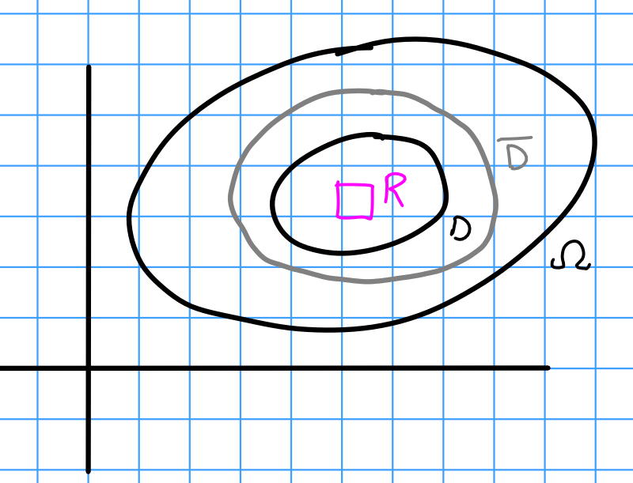

# Friday February 7th

**Theorem:**
Suppose $\theset{f_n}\to f$ is a sequence of holomorphic functions converging uniformly on any compact subset $K \subset \Omega$.
Then $f$ is holomorphic.

Proof:
Let $D$ be any disc such that $\bar D \subset \Omega$.
For any rectangle $R \subset D$, we have $\int_R f_n ~dz = 0$.
Since $f_n \to f$ uniformly, $\int_R f ~dz = 0$ and thus $f$ is holomorphic in $D$.

\

Theorem:
Under the same hypotheses, $f_n' \to f$ uniformly on any compact subset $K \subset \Omega$.

Proof:
See Stein.

**Corollary:**
Suppose $F(z, s): \Omega \cross [a, b] \to \CC$ and

1. $F(z, s)$ is holomorphic in $z$ for each fixed $s \in [a, b]$.

2. $F(z, s)$ is continuous in $\Omega \cross [a, b]$.

Then $f(z) = \int_a^b F(z, s) ~ds$ is holomorphic on $\Omega$.

*Proof:*
Define $f_n(z) = \qty{ \sum_{k=1}^n F(z, s_k) } \frac{b-a}{n}$ where each $s_k = a + \frac{b-a}{n} k \in [a, b]$.
Need to show $f_n(z)$ converges uniformly on any compact $K \subset \Omega$, i.e. it's uniformly Cauchy.
Fix $K$ compact, then by a theorem in topology $K \cross [a,b]$ is again compact.
Using the fact that $F$ is continuous on a compact set and thus uniformly continuous, fix $\eps > 0$ and find $\delta>0$ such that $\max_{z\in K} \abs{F(z, s) - F(z, t)} < \eps$ for all $s,t \in [a, b]$ with $\abs{t-s} < \delta$.
