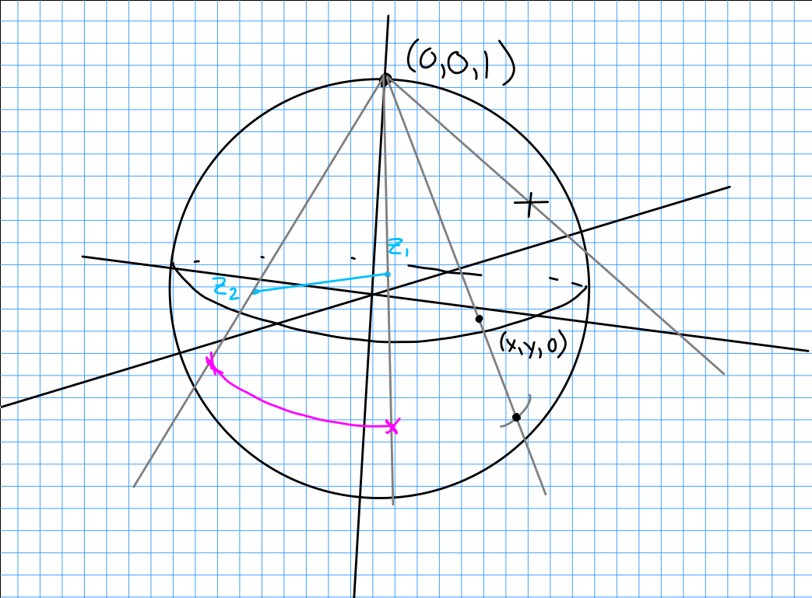

# Wednesday February 12th

## Chapter 3: Meromorphic Functions and the Logarithm

Let $f(z)$ be holomorphic on $\Omega$, then we have Cauchy's integral formula:

\begin{align*}
f(z) = \frac{1}{2\pi i} \int_\gamma \frac{f(\xi)}{\xi - z} ~d\xi
.\end{align*}

*Example:*
Note that $f(z) = \frac 1 z$ is holomorphic on $\CC\setmins 0$.

Let $\Omega$ be an open set containing a disk $D$ and $\Omega\setminus p$ be a punctured domain.

**Definition:**
We say $f$ has an *isolated singularity* at $p$ iff $f$ is defined and holomorphic on some deleted neighborhood of $p$.

Classification of singularities:

1. Removable: $\abs{f(z)}$ is bounded on some $D_r(p) \setminus p$.

  Example: $f(z) = \sin(z)/z$.

2. Poles: $\lim_{z\to p} \abs{f(z)} = \infty$.
  
  Example: $f_n(z) = \frac{1}{z^n}$ at $p=0$

3. Neither 1 nor 2.

  Example: $f(z) = e^{\frac 1 z}$ at $z=0$.

> Note: for singularities at $\infty$, we can just make the change of variables $z\mapsto \frac 1 z$.
> Define $F(z) = f(\frac 1 z)$, then singularities at 0 of $f$ correspond to singularities at infinity for $F$.

Note that we can solve for a spherical projection map.
Let $(0,0,1)$ be the North pole of the sphere; then to map to $(x, y, 0)$ on the plane we can take the parameterization $\ell: (tx, ty, 1-t)$.
This yields

\begin{align*}
t \mapsto \qty{ \frac{2\Re z}{1 + \abs z^2} , \frac{2\Im z}{1 + \abs z^2}, 1 - \frac{2}{1 + \abs z^2}}
.\end{align*}

\

From this we can induce a spherical metric:

\begin{align*}
\phi(z_1, z_2) &= \frac{z \ans{z_1 - z_2}} { \sqrt{\abs z_1^2 + 1} \sqrt{\abs z_2^2 + 1}  }
.\end{align*}

**Proposition:**
Let $p$ be a removable singularity of $f$.
Then

1. $\lim_{z\to p} f(z)$ exists.

2. The function $\tilde f(z) = f(z) \iff z\neq p, \lim_{z\to p} f(z) \iff z=p$ is holomorphic on $D_r(p)$.

*Example:*
Consider $\sin(z)/z \converges{z\to 0} 1$.

*Proof:*
Take $p=0$ and consider $g(z) = z^2 f(z)$.
We can verify directly that $g$ satisfies the Cauchy-Riemann equations on $D_r(0)$.
Then $g$ is holomorphic on $D_r(0)$ and vanishes to order 2 at $z=0$.
Then $f(z) = \frac{g(z)}{z^2}$ is holomorphic on $D_r(0)$.

If $f(z)$ has a pole at $z_0$, then $\lim_{z\to z_0} \abs{f(z)} \to \infty$ by definition, iff $\lim_{z\to z_0} \frac{1}{\abs{f(z)}} = 0$ and thus the reciprocal has a zero at $z=z+0$.
If $z_0$ is a zero of a nontrivial holomorphic function $f$, then $z_0$ is isolated, i.e. there exists a punctured disc $D_r(z_0)\setminus z_0$ $f$ on which $f$ is nonzero.

**Theorem:**
If $f$ is holomorphic in a connected domain $\Omega$ with a zero $z_0$, then there exists a non-vanishing holomorphic function $g(z)$ and some $n\in \NN$ such that $f(z) = (z-z_0)^n g(z)$.

*Proof:*
Since $f$ is holomorphic, expand its power series $f(z) = \sum a_k (z-z_0)^k$.
Since $f(z_0) = 0$, we have $a_0 = 0$.

