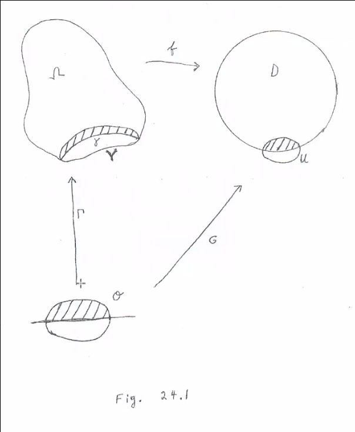
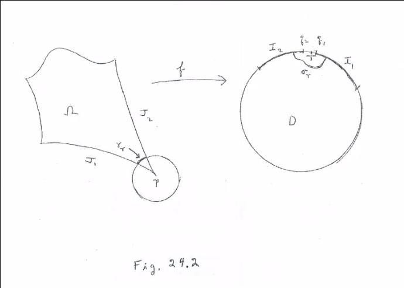

# Friday April 17th

Last time: extending a real-analytic function into $\CC$.

\

Theorem
:   Assume \Omega$ is bounded and $\bd \Omega$ is a finite union of simple closed curves.
    Then the Riemann mappying function $f$ extends to a homeomorphism $\bar f: \bar \Omega \to \bar \DD$.

Proof:
Apply the previous theorem to the real analytic part of $\bd \Omega$, then map these diffeomorphically onto open arcs in $\bd \DD$.
Let $J_1, J_2$ be real analytic curves in $\bd \Omega$ meeting at $p$ and let $I_1, I_2$ denote their images in $\bd \DD$:

\

We want to show that $I_1$ meets $I_2$ and their endpoints $q_1, q_2$ coincide.
We have $\ell(r) = \int_{\gamma_r} \abs{f'}$, where $\gamma_r$ is as in the figure, and applying Cauchy-Schwarz yields
\begin{align*}
\abs{\ell(r)}^2 
&\leq_{CS} \int 1^2 \cdot \int \abs{f'}^2 \\
&\leq 2\pi r \int \abs{f'}^2 \\
\implies {\ell(r)^2 \over r} \leq 2\pi \int \abs{f'}^2
.\end{align*}

Then taking $\ell(r) \geq \delta$ for $\eps \leq r \leq R$  and integrating over $r\in (\eps, R)$ yields
\begin{align*}
\delta^2 \log\qty{R \over \eps} \leq 2\pi \iint_{\Omega(\eps, R)} \abs{f'}^2 = 2 \pi ~\mathrm{Area}(f(\Omega(\eps, R))) \leq 2\pi
\end{align*}
where $\Omega(\eps, R) = \Omega \intersect \theset{\eps \leq \abs{z-p} \leq R}$.

Since $\log\qty{R\over \eps} \converges{\eps\to 0}$ there exists a small $r>0$ such that $\ell(r) < \delta$.
Then $\abs{q_1 - q_2} < \delta$, so $q_1 = q_2$.

> Note that the classification of domains is nontrivial in higher dimension.

Next goal: Picard's theorem. 
Best proof is Picard's original, which comes from Ahlfors.

Recall the notion of covering maps from topology: for $\pi: E\to X$ is a covering map iff for every $p\in X$ there is a $U_x$ such that $\pi\inv(U) = \disjoint S_j \subset E$, where $\pi(S_j) = U$ is a homeomorphism.

Proposition
: If $E, X, Y$ are connected and locally path-connected and $E\mapsvia{\pi} X$ is a covering map, then if $Y$ is simply connected then any $f: Y\to X$ lifts to $\tilde f: Y\to E$.

Proposition
: Any continuous lift of a holomorphic map is also continuous.
