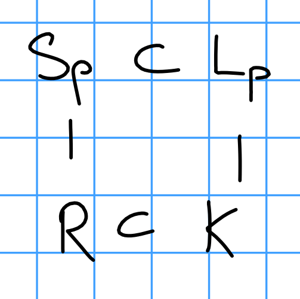

# Friday January 24th

Let $K$ be a field, $n\geq 2$ with $\ch k$ not dividing $n$, and $A/K$ a commutative algebraic group (includes abelian varieties, additive/multiplicative groups, etc).
Assume that $K$ contains all $n$th roots of unity (we showed that this can be assumed).

Let $L \definedas K([n] \inv A(K)) = K(\theset{Q \in A(K\sep) \suchthat [n] Q \in A(K))$.
We've shown that $L/K$ is Galois, and moreover abelian of exponent dividing $n$ and $L/K$ is finite iff $A(K) / n A(K)$ is finite.

> Take $K = \QQ$, then $\QQ[p]$ for every $p$ gives infinite extensions.

We want to show that if $A=E$ is an elliptic curve (or an abelian variety) and $K$ is the fraction field of some Dedekind domain $R$ with some finiteness condition on $\pic(R)$ and $R\units$, then $L/K$ is finite.

Step 3:

Let $\pr \in \maxspec(R)$ with $\pr$ not dividing $n$ such that $E$ has good reduction at $\pr$.

> Take an $R\dash$integral Weierstrass equation $W/R$ for $E$, then the discriminant satisfies $\Delta(W) \neq 0$.
> So just exclude the (finitely many) primes where $\pr \divides \Delta(W)$.
> For abelian varieties, reducing the equations mod $p$ can result in singularities for only finitely many $p$.

Then $L/K$ is unramified at $\pr$ (i.e. it's ramified at only finitely many primes).

Proof:
We have $L = \prod_{Q \suchthat n[Q] = P \in E(K)} L(Q)$ as a compositum of extensions, so it's enough to show that
$L_p \definedas \prod_{[n] Q = p, p \in E(K)} K(Q)$ is unramified over $K$.

Take integral closures:

Take the inertia group $I \definedas I(\pr \mid p) = \theset{\sigma \in g_{L_p/k} \sigma(\pr) = \pr, \sigma\actosn S_p/\pr = \id} \in \aut(L_p/K)$.
Want to show that $\forall \sigma \in I$, $\sigma(Q) = Q$.
We have $0 = \sigma(P) - P = \sigma([n]Q) = [n]Q = [n](\sigma Q - Q)$ and thus $\sigma Q - Q \in E[n] = E[n](K)$.

We now introduce the reduction map

\begin{align*}
r: E(L_p) \to \tilde E(S/\pr) \\
,\end{align*}

where we use the fact that we can complete at $\pr$ and then take a reduction to obtain a map $E(L_p) \to E(\hat L_p) \to \tilde E(S/p)$, which is where we use the fact that the reduction is good.

We know $\sigma Q - Q$ is $n\dash$torsion.
Then $r$ is a homomorphism, so $r(\sigma Q - Q) = r(\sigma Q) - r(Q) = 0$ by the definition of the inertia group.

