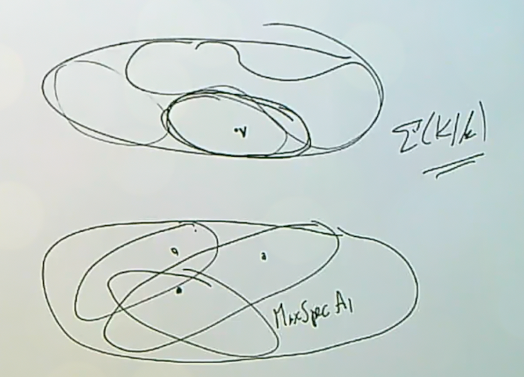

# Lecture 6: Affine Domains and Places $\Sigma(K/k)$

The aim of this lecture is to explain the difference (including some technicalities) between $\Sigma(K/k)$ and affine Dedekind domains $R$ such that $K = \ff(R)$.

Recall that

- An **affine domain** over a field $k$ is a domain that is finitely generated as a $k\dash$algebra,[^rich_but_easy]

- An **affine Dedekind domain** is an affine domain that is also a Dedekind domain, so it is integrally closed and of Krull dimension 1,

- An **affine $k\dash$order** is a one-dimensional affine domain. [^order_is_noetherian]

[^order_is_noetherian]: These will be Noetherian by the Hilbert basis theorem, but may not be integrally closed.

[^rich_but_easy]: These are very rich but easier to understand: take a polynomial ring in finitely many variables and mod out by a prime ideal.

:::{.example title="?"}
If $f \in k[x, y]$ is irreducible, then $k[x, y]/\gens{f}$ is an affine $k\dash$order. 
It is an affine Dedekind domain if $f$ is *nonsingular* over $k$, i.e. for all $a, b\in \bar k$ such that $f(a, b) = 0$, the usual partial derivatives in the sense of Calculus $\dd{f}{x}$ and $\dd{f}{y}$ do not simultaneously vanish at $(a, b)$.
This is a sufficient condition, although it's not far from being necessary as well.
:::

:::{.remark}
Let $A/k$ be an affine Dedekind domain such that $\ff(A) = K$.
Then $\mspec(A) = \Sigma(K/A) \injects \Sigma(K/k)$.
This follows because $\Sigma(K/A)$ are the valuations that are not just regular on $k$, but also on $A$, (i.e. $A\dash$regular valuations) so the valuation ring contains the entirety of $A$.
It's thus natural to ask what its complement is, i.e. those valuations which are not regular on $A$ and give its elements negative valuation.
So define
\[  
\Sigma(A, \infty) \da \Sigma(K/k) \sm \Sigma(K/A)
,\]
the set of places at infinity with respect to $A$.

:::

:::{.example title="?"}
$\Sigma(k[t], \infty) = \ts{v_ \infty}$, which is the infinite place, so the terminology at least matches up!
:::

:::{.proposition title="Key"}
For any affine Dedekind domain $A$, $\Sigma(A, \infty)$ is finite and nonempty.
:::

:::{.remark}
This is striking!
This says that one affine Dedekind domain is giving almost all of this infinite set of places, but never all of it.
:::

:::{.proof title="?"}
By Noether Normalization [^noether_note]

there exists a $t\in A$ that that $A$ is a finitely generated (and thus integral) $k[t]\dash$module, and $A$ is the integral closure of $k[t]$ in $K$.
Why must this be the integral closure?
Any ring finitely generated over a subring will be an integral extension, and $A$ is a Dedekind domain and thus integrally closed.
So let
\[  
r: \Sigma(K/k) \to \Sigma(k(t)/k)
\]
denote the restriction map; then by the regularity property we established in [@lemma:regularity], we have
\[  
\Sigma(K/A) = r^{-1}\qty{\Sigma(k(t)/k[t])}
.\]
Why?
A valuation upstairs in the NT1 square is regular with respect to the integral extension upstairs iff it's regular with respect to the ring it is the integral extension *of*.
So regularity is preserved both ways by integral extensions.
This means you can check regularity either upstairs or downstairs, allowing us to identify the above preimage.

This means that the places where are *not* $A\dash$regular upstairs are precisely those which are not $k[t]\dash$regular downstairs, and so we have
\[  
\Sigma(A, \infty) = r^{-1}\qty{\Sigma(k[t], \infty)} = r^{-1}(v_ \infty)
,\]
since we now there is exactly one such non-regular valuation.
But we showed that $r$ was surjective with finite nonempty fibers, so we're done since our set is one of the fibers.

[^noether_note]: This says that if you have an affine domain $R$ of a certain Krull dimension, then it is finitely generated as a module over a subring which is a polynomial ring in $\trdeg(R)$ variables.
This is like a stronger integral version of taking a finitely generated field extension and writing it as a finite degree field extension of a purely transcendental extension.

:::

:::{.remark}
Thus is $K/k$ is a one variable function field and $A$ is an affine Dedekind domain with fraction field $K$, then $\Sigma(K/k) = \mspec(A) \disjoint S$ where $S$ is finite and nonempty.
Earlier we saw by affine grounding that for each $v\in \Sigma(K/k)$ there exists an affine Dedekind domain $A$ with $v\in \Sigma(K/A)$, and thus $\Sigma(K/k)$ admits a *finite* covering by $\mspec$ of affine Dedekind domains.
The picture of what's happening is that we have $\Sigma(K/k)$ which is quasicompact with respect to the Zariski topology, which contains many $\mspec$, at least one of which contains $v$.
Note that these $\mspec(A_j)$ for affine Dedekind domains $A_j$ is literally an open cover in this topology.
But the open sets are so large that they all have finite complement.
However, this means that instead of just an arbitrary open covering, one can choose a finite open covering: one $\mspec(A_j)$ will cover all but finitely many, and we can always find at least one $\mspec(A_{j'})$ covering all of the remaining points.

It will in fact turn out that we only need **two** domains to cover everything.
:::

:::{.definition title="Holomorphy Rings"}
For a set $S \subseteq \Sigma(K/k)$, define the **Holomorphy** ring as
\[  
R^s \da \Intersect_{v\in \Sigma(K/k)\sm S} R_v
.\]
::: 

:::{.remark}
This is the intersection of a bunch of valuation rings, so this contains elements that are simultaneously regular for this subset of valuations.
If $S \subseteq S'$, then $R^S \subseteq R^{S'}$, due to the fact that we're taking complements and $\Sigma(K/k) \sm S \supset \Sigma(K/k)\sm S'$, so we're removing bigger sets and thus intersecting over fewer things.
This can be thought of as relaxing some regularity conditions.
:::

:::{.remark}
How to think about holomorphy rings: if you take $S = \emptyset$, you intersect over all $R_v$ and obtain $R^\emptyset = \kappa(k)$.
You get a field that is algebraic over $k$, so it's very small compared to the other types of field extensions that arise.
We'll see that this is "unrepresentably" small.
:::

:::{.exercise title="Every affine Dedekind domain is a unique holomorphy ring"}
If $A$ is an affine Dedekind domain with fraction field $k$, then
\[  
A = R^S && S = \Sigma(K/k) \sm \mspec(A)
.\]
This is also equal to $\Intersect_{v\in \mspec(A)} R_v$.

:::

:::{.remark}
This is a fact for any Dedekind domain, which is the intersection over all of its DVRs.
You obtain the integral closure for a Dedekind domain by intersecting all of the valuation rings, but here it is already integrally closed.
Its tautological that $A \subset R^S$ here, so $R^S$ is an *overring* of a Dedekind domain:  for $R$ a domain, an **overring** is any ring $T$ such that $R \subseteq T \subseteq \ff(R)$.
When $R$ is a PID, the overrings 
:::

