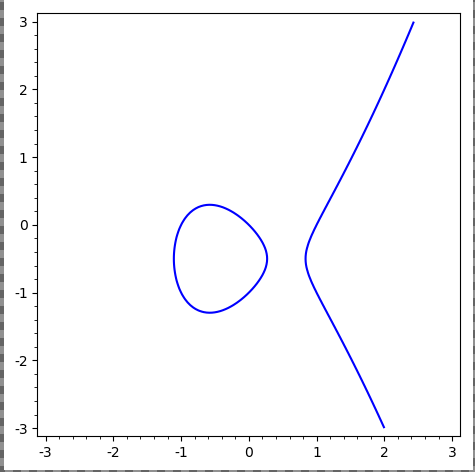

# Friday, August 21

> Reference: 
>
> <https://www.mathematik.uni-kl.de/~gathmann/class/alggeom-2019/alggeom-2019.pdf>

General idea: functions a coordinate ring $R[x_1, \cdots, x_n]/I$ will correspond to the geometry of the variety cut out by $I$.

:::{.example}
\hfill
- $x^2 + y^2 - 1$ defines a circle, say, over $\RR$

- $y^2 = x^3-x$ gives an elliptic curve:
  
  

- $x^n+y^n-1$: does it even contain a $\QQ\dash$point? (Fermat's Last Theorem)

- $x^2 + 1$, which has no $\RR\dash$points.

- $x^2 + y^2 + 1/\RR$has vanishes nowhere, 

- $x^2 - y^2 = 0$ over $\CC$ is not a manifold (no chart at the origin):
  
  

- $x+y+1/\FF_3$, which has 3 points over $\FF_3^2$, but $f(x, y) = (x^3 - x)(y^3-y)$ vanishes at every point

  - Not possible when algebraically closed (is there nonzero polynomial that vanishes on every point in $\CC$?)

  - $V(f) = \FF_3^2$, so the coordinate ring is zero instead of $\FF_3[x, y]/\gens{f}$ (addressed by scheme theory)

:::

:::{.theorem title="Harnack Curve Theorem"}
If $f \in \RR[x, y]$ is of degree $d$, then 
\[  
\pi_1 V(f) \subseteq \RR^2 \leq 1 + {(d-1)(d-2) \over 2}
\]

> Actual statement: the number of connected components is bounded above by this quantity.
:::

:::{.example}
Take the curve
\[  
X = \theset{(x, y, z) = (t^3, t^4, t^5) \in \CC^3 \suchthat t\in \CC}
.\]

Then $X$ is cut out by three equations:

- $y^2 = xz$
- $x^2 = yz$
- $z^2 = x^2 y$

:::

:::{.exercise}
Show that the vanishing locus of the first two equations above is $X\union L$ for $L$ a line.
:::

Compare to linear algebra: codimension $d$ iff cut out by exactly $d$ equations.

