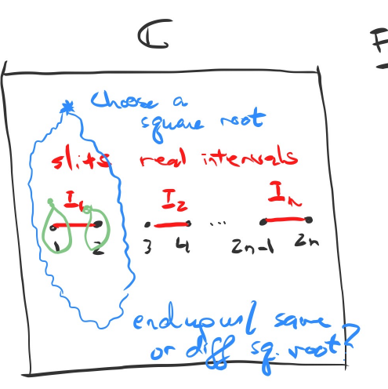

---
title: Algebraic Geometry
todos: true
book: true
---

These are notes live-tex'd from a graduate course in Algebraic Geometry taught by Philip Engel at the University of Georgia in Fall 2020.
As such, any errors or inaccuracies are almost certainly my own.

\medskip
\begin{flushright}
  D. Zack Garza, \today \\
  \currenttime
\end{flushright}

# Friday, August 21

> Reference: 
>
> <https://www.mathematik.uni-kl.de/~gathmann/class/alggeom-2019/alggeom-2019.pdf>

General idea: functions a coordinate ring $R[x_1, \cdots, x_n]/I$ will correspond to the geometry of the variety cut out by $I$.

:::{.example}
\hfill
- $x^2 + y^2 - 1$ defines a circle, say, over $\RR$

- $y^2 = x^3-x$ gives an elliptic curve:
  
  

- $x^n+y^n-1$: does it even contain a $\QQ\dash$point? (Fermat's Last Theorem)

- $x^2 + 1$, which has no $\RR\dash$points.

- $x^2 + y^2 + 1/\RR$ vanishes nowhere, so its ring of functions is not $\RR[x, y] / \gens{x^2 + y^2 + 1}$ (problem: $\RR$ is not algebraically closed)

- $x^2 - y^2 = 0$ over $\CC$ is not a manifold (no chart at the origin):
  
  

- $x+y+1/\FF_3$, which has 3 points over $\FF_3^2$, but $f(x, y) = (x^3 - x)(y^3-y)$ vanishes at every point

  - Not possible when algebraically closed (is there nonzero polynomial that vanishes on every point in $\CC$?)

  - $V(f) = \FF_3^2$, so the coordinate ring is zero instead of $\FF_3[x, y]/\gens{f}$ (addressed by scheme theory)

:::

:::{.theorem title="Harnack Curve Theorem"}
If $f \in \RR[x, y]$ is of degree $d$, then 
\[  
\pi_1 V(f) \subseteq \RR^2 \leq 1 + {(d-1)(d-2) \over 2}
\]

> Actual statement: the number of connected components is bounded above by this quantity.
:::

:::{.example}
Take the curve
\[  
X = \theset{(x, y, z) = (t^3, t^4, t^5) \in \CC^3 \suchthat t\in \CC}
.\]

Then $X$ is cut out by three equations:

- $y^2 = xz$
- $x^2 = yz$
- $z^2 = x^2 y$

:::

:::{.exercise}
Show that the vanishing locus of the first two equations above is $X\union L$ for $L$ a line.
:::

Compare to linear algebra: codimension $d$ iff cut out by exactly $d$ equations.

:::{.example}
Given the Riemann surface 
\[  
y^2 = (x-1)(x-2)\cdots(x-2n)
,\]
how to visualize the solution set?

Fact: on $\CC$ with some slits, you can consistently choose a square root of the RHS.

Away from $x=1, \cdots, 2n$, there are two solutions for $y$ given $x$.

After gluing along strips, obtain:

:::

# Tuesday, August 25

Let $k = \bar k$ and $R$ a ring containing ideals $I, J$.

:::{.definition title="Radical"}
Recall that the *radical* of $I$ is defined as
\[  
\sqrt{I} = \ts{r\in R \st r^k\in I \text{ for some } k\in \NN}
.\]
:::

:::{.example}
Let $I = (x_1, x_2^2) \subset \CC[x_1, x_2]$, so $I = \ts{ f_1 x_1 + f_2 x_2 \st f_1, f_2 \in \CC[x_1, x_2]}$.
Then $\sqrt{I} = (x_1, x_2)$, since $x_2^2 \in I \implies x_2 \in \sqrt{I}$.
:::

Given $f\in k[x_1, \cdots, x_n]$, take its value at $a = (a_1, \cdots, a_n)$ and denote it $f(a)$.
Set $\deg(f)$ to be the largest value of $i_1 + \cdots + i_n$ such that the coefficient of $\prod x_j ^{i_j}$ is nonzero.

:::{.example}
$\deg(x_1 + x_2^2 + x_1 x_2^3 = 4)$
:::

:::{.definition title="Affine Variety"}
\hfill

1. Affine $n\dash$space $\AA^n = \AA_k^n$ is defined as $\theset{(a_1, \cdots, a_n) \suchthat a_i \in k}$.

> Remark: not $k^n$, since we won't necessarily use the vector space structure (e.g. adding points).

2. Let $S\subset k[x_1, \cdots, x_n]$ to be a set of polynomials.
  Then define $V(S) = \ts{x\in \AA^n \st f(x) = 0} \subset \AA^n$ to be an *affine variety*. 

:::

:::{.example}
\hfill

- $\AA^n = V(0)$.
- For any point $(a_1, \cdots, a_n)\in \AA^n$, then $V(x_1 - a_1, \cdots, x_n - a_n) = \theset{a_1, \cdots, a_n}$ uniquely determines the point.
- For any finite set $r_1, \cdots, r_k \in \AA^1$, there exists a polynomial $f(x)$ whose roots are $r_i$.
:::

:::{.remark}
We may as well assume $S$ is an ideal by taking the ideal it generates, $S\subseteq \gens{S} = \ts{\sum g_i f_i \suchthat g_i \in k[x_1, \cdots, x_n],\, f_i\in S}$.
Then $V(\gens{S}) \subset V(S)$.

Conversely, if $f_1, f_2$ vanish at $x\in \AA^n$, then $f_1 + f_2, gf_1$ also vanish at $x$ for all $g\in k[x_1, \cdots, x_n]$.
Thus $V(S) \subset V(\gens{S})$.
:::

:::{.proposition title="Properties and Definitions of Ideal Operations"}
\hfill

- $I+J \da \ts{f+g \st f\in I,\, g\in J}$.
- $IJ \da \ts{\sum_{i=1}^N f_i g_i \st f_i\in I,\, g_i\in J, N\in \NN}$.
- If $I+J = \gens{1}$ then $I\intersect J = IJ$ (coprime or comaximal)

:::

:::{.proposition title="Properties of $V$"}
\hfill

1. If $S_1 \subseteq S_2$ then $V(S_1) \supseteq V(S_2)$.
2. $V(S_1) \union V(S_2) = V(S_1 S_2) = V(S_1 \intersect S_2)$.
3. $\bigcap V(S_i) = V\qty{\bigcup  S_i}$.

:::

We thus have a map
\[  
V: \ts{\text{Ideals in } k[x_1, \cdots, x_n]} \to \ts{\text{Affine varieties in } \AA^n}
.\]

:::{.definition title="The Ideal of a Set"}
Let $X\subset \AA^n$ be any set, then *the ideal of $X$* is defined as
\[  
I(X) \da\ts{f\in k[x_1, \cdots, x_n] \st f(x) = 0\, \forall x\in X}
.\]
:::

:::{.example}
Let $X$ be the union of the $x_1$ and $x_2$ axes in $\AA^2$, then $I(X) = (x_1 x_2) = \ts {x_1 x_2 g\st g\in k[x_1, x_2]}$.
:::

Note that if $X_1 \subset X_2$ then $I(X_1) \subset I(X_2)$.

:::{.proposition title="The Image of $V$ is Radical"}
$I(X)$ is a radical ideal, i.e. $I(X) = \sqrt{I(X)}$.

This is because $f(x)^k = 0 \forall x\in X$ implies $f(x) = 0$ for all $x\in X$, so $f^k \in I(X)$ and thus $f\in I(X)$.
:::

Our correspondence is thus
\[  
\correspond{\text{Ideals in } k[x_1, \cdots, x_n]} &\mapsvia{V} \correspond{\text{Affine Varieties}} \\
\correspond{\text{Radical Ideals}} &\xleftarrow{I} \correspond{\text{?}}
.\]

:::{.proposition title="Hilbert Nullstellensatz (Zero Locus Theorem)"}
\hfill

a. For any affine variety $X$, $V(I(X)) = X$.

b. For any ideal $J \subset k[x_1, \cdots, x_n]$, $I(V(J)) = \sqrt{J}$.
:::

Thus there is a bijection between radical ideals and affine varieties.

## Proof of Nullstellensatz

:::{.remark}
Recall the Hilbert Basis Theorem: any ideal in a finitely generated polynomial ring over a field is again finitely generated.
:::

We need to show 4 inclusions, 3 of which are easy.

a: $X \subset V(I(X))$:

- If $x\in X$ then $f(x) = 0$ for all $f\in I(X)$.
- So $x\in V(I(X))$, since every $f\in I(X)$ vanishes at $x$.

b: $\sqrt{J} \subset I(V(J))$:

- If $f\in \sqrt{J}$ then $f^k \in J$ for some $k$.
- Then $f^k(x) = 0$ for all $x\in V(J)$.
- So $f(x) = 0$ for all $x\in V(J)$.
- Thus $f\in I(V(J))$.

c: $V(I(X)) \subset X$:

- Need to now use that $X$ is an affine variety.
  - Counterexample: $X = \ZZ^2 \subset \CC^2$, then $I(X) = 0$.
    But $V(I(X)) = \CC^2$, but $\CC^2 \not\subset \ZZ^2$.

- By (b), $I(V(J)) \supset \sqrt{J} \supset J$.
- Since $V(\wait)$ is order-reversing, taking $V$ of both sides reverses the containment.
- So $V(I(V(J))) \subset V(J)$, i.e. $V(I(X)) \subset X$.

d: $I(V(J)) \subset \sqrt{J}$ (hard direction)

:::{.theorem title="1st Version of Nullstellensatz"}
Suppose $k$ is algebraically closed and uncountable (still true in countable case by a different proof).

Then the maximal ideals in $k[x_1, \cdots, x_n]$ are of the form $(x_1 - a_1, \cdots, x_n - a_n)$.
:::

:::{.proof}
Let $\mfm$ be a maximal ideal, then by the Hilbert Basis Theorem, $\mfm = \gens{f_1, \cdots, f_r}$ is finitely generated.

Let $L = \QQ[\ts {c_i}]$ where the $c_i$ are all of the coefficients of the $f_i$ if $\ch(K) = 0$, **or** $\FF_p[\ts {c_i}]$ if $\ch(k) = p$.
Then $L\subset k$.

Define $\mfm_0 = \mfm\intersect L[x_1, \cdots, x_n]$.
Note that by construction, $f_i \in \mfm_0$ for all $i$, and we can write $\mfm = \mfm_0 \cdot k[x_1, \cdots, x_n]$.

**Claim**: $\mfm_0$ is a maximal ideal.

If it were the case that 
\[  
\mfm_0 \subsetneq \mfm_0' \subsetneq L[x_1, \cdots, x_n]
,\]
then
\[  
\mfm_0\cdot k[x_1, \cdots, x_n] \subsetneq \mfm_0'\cdot k[x_1, \cdots, x_n]  \subsetneq k[x_1, \cdots, x_n]
.\]

> So far: constructed a smaller polynomial ring and a maximal ideal in it.

Thus $L[x_1, \cdots, x_n]/\mfm_0$ is a field that is finitely generated over either $\QQ$ or $\FF_p$.

:::{.theorem title="Noether Normalization"}
Any finitely-generated field extension $k_1 \injects k_2$ is a finite extension of a purely transcendental extension, i.e. there exist $t_1, \cdots, t_\ell$ such that $k_2$ is finite over $k_1(t_1, 
\cdots, t_\ell)$.
:::

> Note: this theorem is perhaps more important than the Nullstellensatz!

Thus $L[x_1, \cdots, x_n]/\mfm_0$ is finite over some $\QQ(t_1, \cdots, t_n)$, and since $k$ is uncountable, there exists an embedding $\QQ(t_1, \cdots, t_n) \injects k$.

> Use the fact that there are only countably many polynomials over a countable field.

This extends to an embedding of $\phi: L[x_1, \cdots, x_n]/\mfm_0 \injects k$ since $k$ is algebraically closed.
Letting $a_i$ be the image of $x_i$ under $\phi$, then $f(a_1, \cdots, a_n) = 0$ by construction, $f_i \in (x_i - a_i)$ implies that $\mfm = (x_i - a_i)$ by maximality.
:::

# Thursday, August 27

Recall Hilbert's Nullstellensatz:

a. For any affine variety, $V(I(X)) = X$.

b. For any ideal $J\normal k[x_1, \cdots, x_n]$, $I(V(J)) = \sqrt{J}$.

So there's an order-reversing bijection
\[  
\correspond{\text{Radical ideals } k[x_1, \cdots, x_n]} \to{V(\wait)}{I(\wait)}
\correspond{\text{Affine varieties in } \AA^n}
.\]

In proving $I(V(J)) \subseteq \sqrt{J}$, we had an important lemma (Noether Normalization): the maximal ideals of $k[x_1, \cdots, x_n]$ are of the form $\gens{x-a_1, \cdots, x-a_n}$.

:::{.corollary title="?"}
If $V(I)$ is empty, then $I = \gens{1}$.

> Slogan: the only ideals that vanish nowhere are trivial.
> No common vanishing locus $\implies$ trivial ideal, so there's a linear combination that equals 1.

:::

:::{.proof}
By contrapositive, suppose $I\neq \gens{1}$.
By Zorn's Lemma, these exists a maximal ideals $\mfm$ such that $I \subset \mfm$.
By the order-reversing property of $V(\wait)$, $V(\mfm) \subseteq V(I)$.
By the classification of maximal ideals, $\mfm = \gens{x-a_1, \cdots, x-a_n}$, so $V(\mfm) = \theset{a_1, \cdots, a_n}$ is nonempty.
:::

Returning to the proof that $I(V(J)) \subseteq \sqrt{J}$: let $f\in V(I(J))$, we want to show $f\in \sqrt{J}$.
Consider the ideal $\tilde J \da J + \gens{ft - 1} \subseteq k[x_1, \cdots, x_n, t]$.

Observation: $f = 0$ on all of $V(J)$ by the definition of $I(V(J))$.
But $ft-1 \neq 0$ if $f=0$, so $V(\tilde J) = V(G) \intersect V(ft-1) = \emptyset$.

Applying the corollary $\tilde J = (1)$, so $1 = \gens{ft-1} g_0(x_1, \cdots, x_n, t) + \sum f_i g_i(x_1, \cdots, x_n, t)$ with $f_i \in J$.
Let $t^N$ be the largest power of $t$ in any $g_i$.
Thus for some polynomials $G_i$, we have
\[  
f^N \da (ft-1) G_0(x_1, \cdots, x_n, ft) + \sum f_i G_i(x_1, \cdots, x_n, ft)
\]
noting that $f$ does not depend on $t$.

Now take $k[x_1, \cdots, x_n, t]/\gens{ft-1}$, so $ft=1$ in this ring.
This kills the first term above, yielding
\[  
f^N = \sum f_i G_i(x_1, \cdots, x_n, 1) \in k[x_1, \cdots, x_n, t]/\gens{ft-1}
.\]

Observation: there is an inclusion
\[  
k[x_1, \cdots, x_n] \injects
k[x_1, \cdots, x_n, t]/\gens{ft-1}
.\]

:::{.exercise}
Why is this true?
:::

Since this is injective, this identity also holds in $k[x_1, \cdots, x_n]$.
But $f_i\in J$, so $f\in \sqrt{I}$.  

:::{.example}
Consider $k[x]$.
If $J\subset k[x]$ is an ideal, it is principal, so $J = \gens{f}$.
We can factor $f(x) = \prod_{i=1}^k (x-a_i)^{n_i}$ and $V(f) = \ts{a_1, \cdots, a_k}$.
Then $I(V(f)) = \gens{(x-a_1)(x-a_2)\cdots(x-a_k)} = \sqrt{J} \subsetneq J$.
Note that this loses information.
:::

:::{.example}
Let $J = \gens{x-a_1, \cdots, x-a_n}$, then $I(V(J)) = \sqrt{J} = J$ with $J$ maximal.
Thus there is a correspondence
\[  
\correspond{\text{Points of } \AA^n} \iff 
\correspond{\text{Maximal ideals of }k[x_1, \cdots, x_n]}
.\]
:::

:::{.theorem title="Properties of $I$"}
\hfill
a. $I(X_1 \union X_2) = I(X_1) \intersect I(X_2)$.

b. $I(X_1) \intersect I(X_2) = \sqrt{I(X_1) + I(X_2)}$.
:::

:::{.proof}
We proved (a) on the variety side.

For (b), by the Nullstellensatz, $X_i = V(I(X_i))$, so
\[  
I(X_1\intersect X_2) 
&=
I\qty{ VI(X_1) \intersect VI(X_2)} \\
&=
IV\qty{I(X_1) + I(X_2)} \\
&= \sqrt{I(X_1) + I(X_2)}
.\]
:::

:::{.example}
Example of property (b):

Take $X_1 = V(y-x^2)$ and $X_2 = V(y)$, a parabola and the $x\dash$axis.

Then $X_1 \intersect X_2 = \ts{(0, 0)}$, and $I(X_1) + I(X_2) = \gens{y-x^2, y} = \gens{x^2, y}$, but $I(X_1 \intersect X_2) = \gens{x, y} = \sqrt{\gens{x^2, y}}$.
:::

:::{.proposition title="?"}
If $f, g\in k[x_1, \cdots, x_n]$, and suppose $f(x) = g(x)$ for all $x\in \AA^n$. 
Then $f = g$.
:::

:::{.proof}
Since $f-g$ vanishes everywhere, $f-g \in I(\AA^n) = I(V(0)) = \sqrt{0} = 0$.
:::

More generally suppose $f(x) = g(x)$ for all $x\in X$, where $X$ is some affine variety.
Then by definition, $f-g \in I(X)$, so a "natural" space of functions on $X$ is $k[x_1,\cdots, x_n]/I(X)$.

:::{.definition title="Coordinate Ring"}
For an affine variety $X$, the *coordinate ring of $X$* is 
\[  
A(X) \da k[x_1, \cdots, x_n]/ I(X)
.\]

Elements $f\in A(X)$ are called *polynomial* or *regular* functions on $X$.
:::

Observation:
The constructions $V(\wait), I(\wait)$ work just as well for $A(X)$ and $X$.

Given any $S\subset A(Y)$ for $Y$ an affine variety,
\[  
V(S) = V_Y(S) \da\ts{x\in Y \st f(x) = 0\,\,\forall f\in S}
.\]

Given $X\subset Y$ a subset,
\[  
I(X) = I_Y(X) \da\ts{f\in A(Y) \st f(x) = 0\,\,\forall x\in X} \subseteq A(Y)
.\]

:::{.example}
For $X\subset Y \subset \AA^n$, we have $I(X) \supset I(Y) \supset I(\AA^n)$, so we have maps
\begin{center}
\begin{tikzcd}
A(\AA^n) \ar[rr, twoheadrightarrow, "\wait/I(X)", bend left] \ar[r, "\wait/I(Y)", twoheadrightarrow] &A(Y)\ar[r, twoheadrightarrow, "\wait/I(X)"] &A(X) \\
\end{tikzcd}
\end{center}
\[  
.\]

:::

:::{.theorem title="?"}
Let $X\subset Y$ be an affine subvariety, then

a. $A(X) = A(Y) / I_Y(X)$

b. There is a correspondence
\[  
\correspond{\text{Affine subvarieties of }Y} 
&\iff \correspond{\text{Radical ideals in }A(Y)} \\
X &\mapsto I_Y(X) \\
V_Y(J) &\mapsfrom J
.\]

:::

:::{.proof}
Properties are inherited from the case of $\AA^n$, see exercise in Gathmann.
:::

:::{.example}
Let $Y = V(y-x^2) \subset \AA^2/\CC$ and $X = \ts{(1, 1)} = V(x-1, y-1)\subset \AA^2/\CC$.

Then there is an inclusion $\gens{y-x^2} \subset \gens{x-1, y-1}$ (e.g. by Taylor expanding about the point $(1, 1)$), and there is a map

\begin{center}
\begin{tikzcd}
A(\AA^n)\ar[r]\ar[d, equal] & A(Y) \ar[r]\ar[d, equal] & A(X)\ar[d, equal] \\
k[x, y]\ar[r] & k[x, y]/\gens{y-x^2}\ar[r] & k[x, y]/\gens{x-1, y-1}
\end{tikzcd}
\end{center}
:::

# Tuesday, September 01

Last time: $V(I) = \ts{x\in \AA^n \st f(x) = 0 \, \forall x\in I}$ and $I(X) = \ts{f\in k[x_1, \cdots, x_n] \st f(x) = 0\, \forall x\in X}$.
We proved the Hilbert Nullstellensatz $I(V(J)) = \sqrt{J}$, defined the coordinate ring of an affine variety $X$ as $A(X) \da k[x_1, \cdots, x_n] / I(X)$, the ring of "regular" (polynomial) functions on $X$.

Recall that a *topology* on $X$ can be defined as a collection of "closed" subsets of $X$ that are closed under arbitrary intersections and finite unions.
A subset $Y\subset X$ inherits a subspace topology with closed sets of the form $Z\intersect Y$ for $Z\subset X$ closed.

:::{.definition title="Zariski Topology"}
Let $X$ be an affine variety.
The closed sets are affine subvarieties $Y\subset X$.
:::

We have $\emptyset, X$ closed, since 

1. $V_X(1) = \emptyset$,
2. $V_X(0) = X$

Closure under finite unions:
Let $V_X(I), V_X(J)$ be closed in $X$ with $I, J \subset A(X)$ ideals.
Then $V_X(IJ) = V_X(I) \union V_X(J)$.

Closure under intersections:
We have $\bigcap_{i\in \sigma} V_X(J) = V_X\qty{ \sum_{i\in \sigma} J_i}$.

:::{.remark}
There are few closed sets, so this is a "weak" topology.
:::

:::{.example}
Compare the classical topology on $\AA^1/\CC$ to the Zariski topology.

Consider the set 
$A\da \ts{x\in \AA^1/\CC \st \norm{x} \leq 1}$, 
which is closed in the classical topology.

But $A$ is not closed in the Zariski topology, since the closed subsets are finite sets or the whole space.

> Here the topology is in fact the cofinite topology.

:::

:::{.example}
Let $f: \AA^1/k\to \AA^1/k$ be any injective map.
Then $f$ is necessarily continuous wrt the Zariski topology.
:::

Thus the notion of continuity is too weak in this situation.

:::{.example}
Consider $X\cross Y$ a product of affine varieties.
Then there is a product topology where open sets are of the form $\bigcup_{i=1}^n U_i \cross V_i$ with $U_i, V_i$ open in $X, Y$ respectively.

This is the wrong topology!
On $\AA^1 \cross \AA^1 = \AA^2$, the diagonal $\Delta \da V(x-y)$ is closed in the Zariski topology on $\AA^2$ but not in the product topology.
:::

:::{.example}
Consider $\AA^2/\CC$, so the closed sets are curves and points.
Observation: $V(x_1 x_2 ) \subset \AA^2/\CC$ decomposed into the union of the coordinate axes $X_1 \da V(x_1)$ and $X_2 \da V(x_2)$.
The Zariski topology can detect these decompositions.
:::

:::{.definition title="Irreducibility and Connectedness"}
Let $X$ be a topological space.

a. $X$ is *reducible* iff there exist nonempty proper closed subsets $X_1 ,X_2 \subset X$ such that $X = X_1 \union X_2$.
  Otherwise, $X$ is said to be *irreducible*.

b. $X$ is *disconnected* if there exist $X_1, X_2 \subset X$ such that $X = X_1 \disjoint X_2$.
  Otherwise, $X$ is said to be *connected*.
:::

:::{.example}
$V(x_1 x_2)$ is reducible but connected.
:::

:::{.remark}
$\AA^1/\CC$ is *not* irreducible, since we can write $\AA^1/\CC = \ts{\norm{x} \leq 1} \union \ts{\norm{x} \geq 1}$.
:::

:::{.proposition title="?"}
Let $X$ be a disconnected affine variety with $X = X_1 \disjoint X_2$.
Then $A(X) \cong A(X_1) \cross A(X_2)$.
:::

:::{.proof}
We have $X_1 \union X_2 = X$, so $I(X_1) \intersect I(X_2) = I(X) = (0)$ in the coordinate ring $A(X)$ (recalling that it is a quotient by $I(X)$.)

Since $X_1 \intersect X_1  \emptyset$, we have 
\[  
I(X_1 \intersect X_2) = \sqrt{I(X_1) + I(X_2) } = I(\emptyset) = \gens{1}
.\]

Thus $I(X_1) + I(X_2) = \gens{1}$, and by the Chinese Remainder Theorem, the following map is an isomorphism:
\[  
A(X) \to A(X)/I(X_1) \cross A(X) / I(X_2)
.\]

But the codomain is precisely $A(X_1) \cross A(X_2)$.
:::

:::{.proposition title="?"}
An affine variety $X$ is irreducible $\iff$ $A(X)$ is an integral domain.
:::

:::{.proof}
$\implies$:
By contrapositive, suppose $f_1, f_2 \in A(X)$ are nonzero with $f_1 f_2 = 0$.
Let $X_i = V(f_i)$, then $X= V(0) = V(f_1 f_2) = X_1 \union X_2$ which are closed and proper since $f_i \neq 0$.

\

$\impliedby$:
Suppose $X$ is reducible with $X = X_1 \union X_2$ with $X_i$ proper and closed.
Define $J_i \da I(X_i)$, and note $J_i \neq 0$ because $V(J_i) = V(I(X_i)) = X_i$ by part (a) of the Nullstellensatz.

So there exists a nonzero $f_i \in J_i = I(X_i)$, so $f_i$ vanishes on $X_i$.
But then $V(f_1) \union V(f_2) \supset X_1 \union X_2 = X$, so $X= V(f_1 f_2)$ and $f_1 f_2 \in I(X) = \gens{0}$ and $f_1 f_2 = 0$.
So $A(X)$ is not a domain. 
:::

:::{.example}
Let $X = \ts{p_1, \cdots, p_d}$ be a finite set in $\AA^n$.
The Zariski topology on $X$ is the discrete topology, and $X = \disjoint \ts{p_i}$.
So 
\[  
A(X) = A(\disjoint \ts{p_i}) = \prod_{i=1}^d A({\ts{p_i}}) = \prod_{i=1}^d k[x_1, \cdots, x_n] / \gens{x_j - a_j(p_i)}_{j=1}^d
.\]
:::

:::{.example}
Set $V(x_1 x_2) = X$, then $A(X) = k[x_1, x_2]/ \gens{x_1 x_2}$.
This not being a domain (since $x_1 x_2 = 0$) corresponds to $X = V(x_1) \union V(x_2)$ not being irreducible.
:::

:::{.example}
$\AA^2/k$ is irreducible since $k[x_1, \cdots x_n]$ is a domain.
:::

:::{.example}
Let $X_1$ be the $xy$ plane and $X_2$ be the line parallel to the $y\dash$axis through $\thevector{0,0,1}$, and let $X= X_1 \disjoint X_2$.
Then $X_1 = V(z)$ and $X_2 = V(x, z-1)$, and $I(X) = \gens{z} \cdots \gens{x, z-1}=  \gens{xz, z^2 - z}$.

Then the coordinate ring is given by $A(X) = \CC[x, y, z] / \gens{xz, z^2 - z} = \CC[x, y, z] / \gens{z} \oplus \CC[x, y,z] / \gens{x, z-1}$.

:::

# Thursday, September 03

Recall that the Zariski topology is defined on an affine variety $X = V(J)$ with $J \normal k[x_1, \cdots, x_n]$ by describing the closed sets.

:::{.proposition title="?"}
$X$ is irreducible if its coordinate ring $A(X)$ is a domain.
:::

:::{.proposition title="?"}
There is a 1-to-1 correspondence
\[  
\correspond{\text{Irreducible subvarieties} \\ \text{of }X}
\iff
\correspond{\text{Prime ideals} \\ \text{in }A(X)}
.\]
:::

:::{.proof}
Suppose $Y\subset X$ is an affine subvariety.
Then 
\[  
A(X) / I_X(Y) = A(Y)
.\]

By NSS, there is a bijection between subvarieties of $X$ and radical ideals of $A(X)$ where $Y\mapsto I_X(Y)$.
A quotient is a domain iff quotienting by a prime ideal, so $A(Y)$ is a domain iff $I_X(Y)$ is prime.
:::

Recall that $\mfp \normal R$ is prime when $fg\in \mfp \iff f\in \mfp$ or $g\in \mfp$.
Thus $\bar f \bar g = 0$ in $R/\mfp$ implies $\bar f = 0$ or $\bar g = 0$ in $R/\mfp$, i.e. $R/\mfp$ is a domain.

Finally note that prime ideals are radical (easy proof).

:::{.example}
Consider $\AA^2/\CC$ and some subvarieties $C_i$:

Then irreducible subvarieties correspond to prime ideals in $\CC[x, y]$.
Here $C_1, C_3$ correspond to $V(f), V(g)$ for $f,g$ irreducible polynomials, whereas $C_2$ corresponds to a maximal ideal, i.e. $V(x_1 - a_1, x_2 - a_2)$.

Note that $I(C_1 \union C_2 \union C_3)$ is not a prime ideal, since the variety is reducible as the union of 3 closed subsets.
:::

:::{.example}
A finite set is irreducible iff it contains only one point.
:::

:::{.example}
Any irreducible topological space is connected, since irreducible requires a union but connectedness requires a *disjoint* union.
:::

:::{.example}
$A^n/k$ is irreducible: by prop 2.8, its irreducible iff the coordinate ring is a domain.
However $A(\AA^n)  = k[x_1, \cdots, x_n]$, which is a domain.
:::

:::{.example}
$V(x_1 x_2)$ is not irreducible, since it's equal to $V(x_1) \union V(x_2)$.
:::

:::{.definition title="Noetherian Space"}
A *Noetherian* topological space $X$ is a space with no infinite strictly decreasing sequence of closed subsets.
:::

:::{.proposition title="?"}
An affine variety $X$ with the zariski topology is a noetherian space.
:::

:::{.proof}
Let $X_0 \supsetneq X_1 \supsetneq \cdots$ be a decreasing sequence of closed subspaces.
Then $I(X_0) \subsetneq I(X_1) \subsetneq$.
Note that these containments are strict, otherwise we could use $V(I(X_1)) = X_1$ to get an equality in the original chain.

Recall that a ring $R$ is Noetherian iff every ascending chain of ideals terminates.
Thus it suffices to show that $A(X)$ is Noetherian.

We have $A(X) = \kx{n} / I(X)$, and if this had an infinite chain $I_1 \subsetneq I_2 \subsetneq \cdots$ lifts to a chain in $\kx{n}$, which is Noetherian.
A useful fact: $R$ noetherian implies that $R[x]$ is noetherian, and fields are always noetherian.
:::

:::{.remark}
Any subspace $A\subset X$ of a noetherian space is noetherian.
To see why, suppose we have a chain of closed sets in the subspace topology,
\[  
A\intersect X_0 \supsetneq A\intersect X_1 \supsetneq \cdots
.\]

Then $X_0 \supsetneq X_1 \supsetneq \cdots$ is a strictly decreasing chain of closed sets in $X$.
Why strictly decreasing: $\intersect^n X_i = \intersect^{n+1} X_i \implies A\intersect^n X_i = A\intersect^{n+1} X_i$, a contradiction.
:::

:::{.proposition title="Important"}
Every noetherian space $X$ is a finite union of irreducible closed subsets, i.e. $X = \Union_{i=1}^k X_i$.
If we further assume $X_i \not\subset X_j$ for all $i, j$, then the $X_i$ are unique up to permutation.

:::

:::{.remark}
The $X_i$ are the **components** of $X$.
In the previous example $C_1 \union C_2 \union C_3$ has three components.
:::

:::{.proof}
If $X$ is irreducible, then $X=X$ and this holds.

Otherwise, write $X = X_1 \union X_2$ with $X_i$ proper closed subsets.
If $X_1$ and $X_1'$ are irreducible, we're done, so otherwise suppose wlog $X_1'$ is not irreducible.

Then we can express $X = X_1 \union \qty{X_2 \union X_2'}$ with $X_2, X_2' \subset X_1'$ closed and proper.

Thus we can obtain a tree whose leaves are proper closed subsets:

This tree terminates because $X$ is Noetherian: if it did not, this would generate an infinite decreasing chain of subspaces.

We now want to show that the decomposition is unique if no two components are contained in the other. 

Suppose 
\[  
X= \Union_{i=1}^k X_i = \Union_{j=1}^\ell X_j'
.\]

Note that $X_i \subset X$ implies that $X_i = \Union_{j=1}^\ell X_i \intersect X_j'$.
But $X_i$ is irreducible and this would express $X_i$ as a union of proper closed subsets, so some $X_i \intersect X_j'$ is *not* a proper closed subset.

Thus $X_i = X_i \intersect X_j'$ for some $j$, which forces $X_i \subset X_j'$.
Applying the same argument to $X_j'$ to obtain $X_j' \subset X_k$ for some $k$.

Then $X_i \subset X_j' \subset X_k$, but $X_ i \not\subset X_j$ when $j\neq i$.
Thus $X_i = X_j' = X_k$, forcing the $X_i$ to be unique up to permutation.
:::

Recall from ring theory: for $I\subset R$ and $R$ noetherian, $I$ has a *primary decomposition* $I = \Intersect_{i=1}^k Q_i$ with $\sqrt{Q_i}$ prime.
Assuming the $Q_i$ are minimal in the sense that $\sqrt{Q_i} \not\subset \sqrt{Q_j}$ for any $i, j$, this decomposition is unique.

Applying this to $I(X) \normal \kx{n} = R$ yields 
\[  
I(X) = \Intersect_{i=1}^k Q_i 
\implies
X  = V(I(X)) = \Union_{i=1}^k V(Q_i)
.\]

Letting $P_i = \sqrt{Q_i}$, noting that the $P_i$ are prime and thus radical, we have $V(Q_i) = V(P_i)$.
Writing $X = \Union V(P_i)$, we have $I(V(P_i)) = P_i$ and thus $A(V(P_i)) = R/P_i$ is a domain, meaning $V(P_i)$ are irreducible affine varieties.

Conversely, if we express $X = \Union X_i$, we have $I = I\qty{\Union X_i} = \Intersect I(X_i) = \Intersect P_i$ which are irreducible since they are prime.

:::{.remark}
There is a correspondence
\[  
\correspond{\text{Irreducible components} \\ \text{of } X} 
\iff
\correspond{\text{Minimal prime ideals} \\ \text{in } A(X)}
,\]
where here *minimal* is the condition that no pair of ideals satisfies a subset containment.
:::

:::{.remark}
Let $X$ be an irreducible topological space.

:::{.proposition title="1"}
The intersection of nonempty two open sets is *never* empty.
:::

:::{.proof}
Let $U, U'$ be open and $X\setminus U, X\sm U'$ closed.
Then $U\intersect U' = \emptyset \iff (X\sm U) \union (X\sm U') = X$, but this is not possible since $X$ is irreducible.
:::

> Irreducible iff any two nonempty open sets intersect.

:::{.proposition title="?"}
Any nonempty open set is dense, i.e. if $U\subset X$ is open then its closure $\cl_X(U)$ is dense in $X$.
:::

:::{.proof}
Write $X = \cl_X(U) \union (X\sm U)$.
Since $X\sm U \neq X$ and $X$ is irreducible, we have $\cl_X(U) = X$.
:::

:::

# Tuesday, September 08

Review: we discussed irreducible components.
Recall that the *Zariski topology* on an affine variety $X$ has affine subvarieties as closed sets, and a *noetherian space* has no infinitely decreasing chains of closed subspaces.

We showed that any noetherian space has a decomposition into irreducible components $X = \union X_i$ with $X_i$ closed, irreducible, and unique such that no two are subsets of each other.
Applying this to affine varieties, a descending chain of subspaces $X_0 \supsetneq X_1 \cdots$ in $X$ corresponds to an increasing chain of ideals $I(X_0) \subsetneq I(X_1) \cdots$ in $A(X)$.
Since $\kx{n}$ is a noetherian ring, this chain terminates, so affine varieties are noetherian.

## Dimension

:::{.definition title="Dimensions"}
Let $X$ be a topological space.

1. The *dimension* $\dim X \in \NN\union\ts{\infty}$ is either $\infty$ or the length $n$ of the longest chain of **irreducible** closed subsets $\emptyset \neq Y_0 \subsetneq \cdots \subsetneq Y_n \subset X$ where $Y_n$ need not be equal to $X$.

2. The *codimension* of $Y$ in $X$, $\codim_X(Y)$, for an irreducible subset $Y\subseteq X$ is the length of the longest chain $Y\subset Y_0 \subsetneq Y_1 \cdots \subset X$.
:::

:::{.example}
Consider $\AA^1/k$, what are the closed subsets?
The finite sets, the empty set, and the entire space.

What are the irreducible closed subsets? 
Every point is a closed subset, so sets with more than one point are reducible.
So the only irreducible closed subsets are $\ts{a}, \AA^1/k$, since an affine variety is irreducible iff its coordinate ring is a domain and $A(\AA^1/k) = k[x]$.
We can check
\[  
\emptyset \subseteq Y_0 = \ts{a} \subseteq Y_1 = \AA^1/k
,\]

which is of length $1$, so $\dim(\AA^1/k) = 1$.

> Note that we count the number of nontrivial strict subset containments in this chain.

:::

:::{.example}
Consider $V(x_1 x_2) \subset \AA^2/k$, the union of the $x_i$ axes.
Then the closed subsets are $V(x_1), V(x_2)$, along with finite sets and their unions.
What is the longest chain of irreducible closed subsets?

Note that $k[x_1, x_2] / \gens{x_1} \cong k[x_2]$ is a domain, so $V(x_i)$ are irreducible.
So we can have a chain
\[  
\emptyset \subsetneq \ts{a} \subsetneq V(x_1) \subset X
,\]
where $a$ is any point on the $x_2\dash$axis, so $\dim(X) = 1$.

The only closed sets containing $V(x_1)$ are $V(x_1)\union S$ for $S$ some finite set, which can not be irreducible.
:::

:::{.remark}
You may be tempted to think that if $X$ is noetherian then the dimension is finite.
However, finite dimension requires a bounded length on descending/ascending chains, whereas noetherian only requires "termination", which may not happen in a bounded number of steps.
So this is **false**!
:::

:::{.example}
Take $X = \NN$ and define a topology by setting closed subsets be the sets $\ts{0, \cdots, n}$ as $n$ ranges over $\NN$, along with $\NN$ itself.
Is $X$ noetherian? 
Check descending chains of closed sets:

\[  
\NN \supsetneq \ts{0, \cdots, N} \supsetneq \ts{0, \cdots, N-1} \cdots
,\]

which has length at most $N$, so it terminates and $X$ is noetherian.

But note that all of these closed subsets $X_N \da \ts{0, \cdots, N}$ are irreducible.
Why?
If $X_n = X_i \union X_j$ then one of $i, j$ is equal to $N$, i.e $X_i, X_j = X_N$.

So for every $N$, there exists a chain of irreducible closed subsets of length $N$, implying that
$\dim(\NN) = \infty$.
:::

:::{.remark}
Let $X$ be an affine variety. 
There is a correspondence
\[  
\correspond{\text{Chains of irreducible closed subsets} \\ Y_0 \subsetneq \cdots \subsetneq Y_n \text{ in } X}
\correspond{\text{Chains of prime ideals} \\ P_0\supsetneq \cdots \supsetneq P_n \text{ in } A(X)}
.\]
Why?
We have a correspondence between closed subsets and radical ideals.
If we specialize to irreducible, we saw that these correspond to radical ideals $I\subset A(X)$ such that $A(Y) \da A(X) / I$ is a domain, which precisely correspond to prime ideal in $A(X)$.
:::

We thus make the following definition:

:::{.definition title="Krull Dimension"}
The *krull dimension* of a ring $R$ is the length $n$ of the longest chain of prime ideals
\[  
P_0 \supsetneq P_1 \supsetneq \cdots \supsetneq P_n
.\]

:::

:::{.remark}
This uses the key fact from commutative algebra: a finitely generated $k\dash$algebra $M$ satisfies

1. $M$ has finite $k\dash$dimension
2. If $M$ is a domain, every maximal chain has the same length.
:::

:::{.remark}
From scheme theory: for any ring $R$, there is an associated topological space $\spec R$ given by the set of prime ideals in $R$, where the closed sets are given by 
\[  
V(I) = \ts{\text{Prime ideals } \mfp \normal R \st I\subseteq \mfp }
.\]

If $R$ is a noetherian ring, then $\spec(R)$ is a noetherian space.
:::

:::{.example}
Using the fact above, let's compute $\dim \AA^n/k$.
We can take the following chain of prime ideals in $\kx{n}$:
\[  
0 \subsetneq \gens{x_1} \subsetneq \gens{x_1, x_2} \cdots \subsetneq \gens{x_1, \cdots, x_n}
.\]

By applying $V(\wait)$ we obtain
\[  
\AA^n/k \supsetneq \AA^{n-1}/k \cdots \supsetneq \AA^0/k = \ts{0} \supsetneq \emptyset
,\]
where we know each is irreducible and closed, and it's easy to check that these are maximal:

If there were an ideal $\gens{x_1, x_2} \subset P \subset \gens{x_1, x_2, x_3}$, then take $P\intersect k[x_1, x_2, x_3] / \gens{x_1, x_2}$ which would yield a polynomial ring in $k[x_1]$.
But we know the only irreducible sets in $\AA^1/k$ are a point and the entire space.

So this is a chain of maximal length, implying $\dim \AA^n/k = n$.
:::

# Thursday, September 10

Recall that the dimension of a ring $R$ is the length of the longest chain of prime ideals.
Similarly, for an affine variety $X$, we defined $\dim X$ to be the length of the longest chain of irreducible closed subsets.

These notions of dimension of the same when taking $R = A(X)$, i.e. $\dim \AA^n/k = n$.

:::{.proposition title="Dimensions"}
Let $k = \bar k$.

a. The dimension of $k[x_1, \cdots, x_n]$ is $n$.
b. All maximal chains of prime ideals have length $n$.
:::

## Proof of Dimension Proposition

The case for $n=0$ is trivial, just take $P_0 = \gens{0}$.
For $n=1$, easy to see since the only prime ideals in $k[x]$ are $\gens{0}$ and $\gens{x-a}$, since any polynomial factors into linear factors.
\

Let $P_0 \subsetneq \cdots \subsetneq P_m$ be a maximal chain of prime ideals in $\kx{n}$; we then want to show that $m=n$.
Assume $P_0 = \gens{0}$, since we can always extend our chain to make this true (using maximality).
Then $P_1$ is a minimal prime and $P_m$ is a maximal ideal (and maximals are prime).

:::{.claim}
$P_1$ is principle, i.e. $P_1 = \gens{f}$ for some irreducible $f$.
:::

### Proof That $P_1$ is Principle

:::{.claim}

$\kx{n}$ is a unique factorization domain.
This follows since $k$ is a UFD since it's a field, and $R$ a UFD $\implies R[x]$ is a UFD for any $R$.

> See Gauss' lemma.

:::

:::{.claim}
In a UFD, minimal primes are principal.
Let $r \in P$, and write $r = u \prod p_i^{n_i}$ with $p_i$ irreducible and $u$ a unit.
So some $p_i\in P$, and $p_i$ irreducible implies $\gens{p_i}$ is prime.
Since $0 \subsetneq \gens{p_i} \subset P$, but $P$ was prime and assumed minimal, so $\gens{p_i} = P$.
:::

The idea is to now transfer the chain $P_0 \subsetneq \cdots \subsetneq P_m$ to a maximal chain in $k[x_1, \cdots, x_{n-1}]$.
The first step is to make a linear change of coordinates so that $f$ is monic in the variable $x_n$.

:::{.example}
Take $f=x_1x_2 + x_3^2 x_4$ and map $x_3 \mapsto x_3 + x_4$.
:::

So write
\[  
f(x_1, \cdots, x_n) = x_n^d + f_1(x_1, \cdots, x_{n-1}) x_n^{d-1} + \cdots + f_d(x_1, \cdots, x_{n-1})
.\]

We can then descend to $\kx{n}$ to $\kx{n}/\gens{f}$:
\begin{center}
\begin{tikzcd}
P_0 \ar[r] & P_1 \ar[r]\ar[d] & \cdots \ar[r]\ar[d] & P_m\ar[d] \\
 & P_1/P_1 \ar[r]\ar[d] & \cdots \ar[r]\ar[d] & P_m/P_1\ar[d] \\
 & P_1/P_1 \intersect \kx{n-1} \ar[r] & \cdots \ar[r] & (P_m / P_1) \intersect \kx{n-1}
\end{tikzcd}
\end{center}

The first set of downward arrows denote taking the quotient, and the upward is taking inverse images, and this preserves strict inequalities.

:::{.definition title="Integral Extension"}
An *integral* ring extension $R\injects R'$ of $R$ is one such that all $r' \in R'$ satisfying a monic polynomial with coefficients in $R$, where $R'$ is finitely generated.

> In this case, also implies that $R'$ is a finitely-generated $R$ module.

:::

In this case, $\kx{n-1} \injects \kx{n} /\gens{f}$ is an integral extension.
We want to show that the intersection step above also preserves strictness of inclusions, since it preserves primality.

:::{.lemma}
Suppose $P', Q' \subset R'$ are distinct prime ideals with $R\injects R'$ an integral extension. 
Then if $P'\intersect R = Q'\intersect R$, neither contains the other, i.e. $P'\not\subset Q'$ and $Q'\not\subset P'$.
:::

:::{.proof}
Toward a contradiction, suppose $P' \subset Q'$, we then want to show that $Q'\supset P'$.
Let $a\in Q'\sm P'$ (again toward a contradiction), then
\[  
R/\qty{P'\intersect R} \injects R'/P'
\]
is integral.

Then $\bar a \neq 0$ in $R'/P'$, and there exists a monic polynomial of minimal degree that $\bar a$ satisfies, $p(x) = x^n + \sum_{i=2}^n \bar c_i x^{n-i}$.
This implies $\bar c_n \in Q'/P'$ (which will contradict $c_n \in P'$), since if $\bar c_n = 0$ then factoring out $x$ yields a lower degree polynomial that $\bar a$ satisfies.

But then $\bar a_n \in Q'\intersect R$, so ???
:::

Question: 
Given $R\injects R'$ is an integral extension, can we lift chains of prime ideals?

Answer: 
Yes, by the "Going Up" Theorem: given $P\subset R$ prime, there exists $P'\subset R'$ prime such that $P'\intersect R = P$.
Furthermore, we can lift $P_1 \subset P_2$ to $P_1' \subset P_2'$, as well as "lifting sandwiches":

In this process, the length of the chain decreased since $\gens{0}$ was deleted, but otherwise the chains are in bijective correspondence.
So the inductive hypothesis applies.
$\qed$

## Using Dimension Theory

Key fact used: the dimension doesn't change under integral extensions, i.e. if $R\injects R'$ is integral then $\dim R = \dim R'$.

:::{.claim}
Any affine variety has finite dimension.
:::

:::{.proof}
We have $\dim X = \dim A(X)$, where $A(X) \da \kx{n} I$ for some $I(X)=\sqrt{I(X)}$.

The noether normalization lemma (used in proof of nullstellensatz) shows that a finitely generated $k\dash$algebra is an integral extension of some polynomial ring $k[y_1, \cdots, y_d]$.
I.e., the following extension is integral:
\[  
k[y_1, \cdots, y_d] \injects k[x_1, \cdots, x_n]/I
.\]

We can conclude that $\dim A(X) = d < \infty$.
:::

:::{.proposition title="?"}
Let $X, Y$ be irreducible affine varieties.
Then

a. $\dim X\cross Y = \dim X + \dim Y$.
b. $Y\subset X \implies \dim X = \dim Y + \codim_X Y$.
c. If $f\in A(X)$ is nonzero, then any component of $V(f)$ has codimension 1.
:::

:::{.proof}
:::{.remark}
Why is $X\cross Y$ again an affine variety?
If $X\subset \AA^n/k$, $Y\subset \AA^m/k$ with $X = V(I), Y = V(J)$, then $X\cross Y \subset \AA^n/k \cross \AA^m/k = \AA^{n+m}/k$ can be given by taking $I+J \normal k[x_1, \cdots, x_n, y_1, \cdots, y_m]$ using the natural inclusions of $\kx{\ell}$.

Note that we can write
\[  
k[x_1, \cdots, x_n, y_1, \cdots, y_m] = \kx{n} \tensor_k k[y_1, \cdots, y_n]
\]
where we think of $x_i = x_i \tensor 1, y_j = 1 \tensor y_j$.
We thus map $I, J$ to $I\tensor 1 + 1\tensor J$ and obtain $V(I\tensor 1 + 1\tensor J) = X\cross Y$ and $A(X\cross Y) = A(X)\tensor_k A(Y)$.

In general, for $k\dash$algebras $R,S$,
\[  
R/I \tensor_k S/J \cong R\tensor_k S / \gens{I\tensor 1 + 1\tensor J}
.\]
:::

:::{.remark}
For $R,S$ finitely generated $k\dash$algebras, $\dim R\tensor_k S = \dim R + \dim S$.
:::
Part (a) is proved by the above remarks.

For part (b), the statement is equivalent to $P\subset A(X)$ with $I(Y) \subset P$ is a member of some maximal chain, along with the statement that all maximal chains are the same length.

:::

