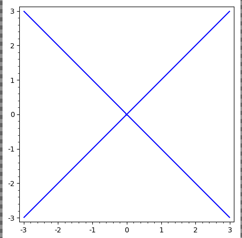
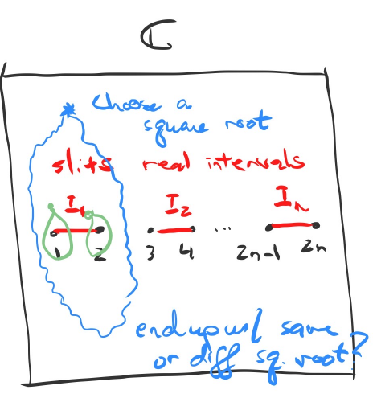
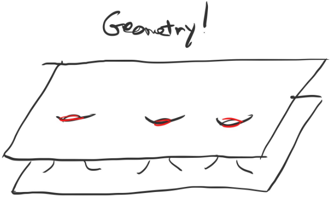

# Friday, August 21

General idea: functions in a *coordinate ring* $R[x_1, \cdots, x_n]/I$ will correspond to the geometry of the *variety* cut out by $I$.

:::{.example}
\hfill
- $x^2 + y^2 - 1$ defines a circle, say, over $\RR$

- $y^2 = x^3-x$ gives an elliptic curve:
  
{width=350px}

- $x^n+y^n-1$: does it even contain a $\QQ\dash$point? (Fermat's Last Theorem)

- $x^2 + 1$, which has no $\RR\dash$points.

- $x^2 + y^2 + 1/\RR$ vanishes nowhere, so its ring of functions is not $\RR[x, y] / \gens{x^2 + y^2 + 1}$.
  The problem: $\RR$ is not algebraically closed.

- $x^2 - y^2 = 0$ over $\CC$ is not a manifold (no chart at the origin):
  
{width=350px}

- $x+y+1/\FF_3$, which has 3 points over $\FF_3^2$, but $f(x, y) = (x^3 - x)(y^3-y)$ vanishes at every point

  - Not possible when algebraically closed (is there nonzero polynomial that vanishes on every point in $\CC$?)

  - $V(f) = \FF_3^2$, so the coordinate ring is zero instead of $\FF_3[x, y]/\gens{f}$ (addressed by scheme theory)

:::

:::{.theorem title="Harnack Curve Theorem"}
If $f \in \RR[x, y]$ is of degree $d$, then[^actual_statement]
\[  
\pi_1 V(f) \subseteq \RR^2 \leq 1 + {(d-1)(d-2) \over 2}
\]
[^actual_statement]: 
Actual statement: the number of connected components is bounded above by this quantity.

:::

:::{.example}
Take the curve
\[  
X = \theset{(x, y, z) = (t^3, t^4, t^5) \in \CC^3 \suchthat t\in \CC}
.\]

Then $X$ is cut out by three equations:

- $y^2 = xz$
- $x^2 = yz$
- $z^2 = x^2 y$

:::

:::{.exercise}
Show that the vanishing locus of the first two equations above is $X\union L$ for $L$ a line.
:::

Compare to linear algebra: codimension $d$ iff cut out by exactly $d$ equations.

:::{.example}
Given the Riemann surface 
\[  
y^2 = (x-1)(x-2)\cdots(x-2n)
,\]
how does one visualize its solution set?
:::

:::{.fact}
On $\CC$ with some slits, you can consistently choose a square root of the RHS.

{width=350px}

Away from $x=1, \cdots, 2n$, there are two solutions for $y$ given $x$.

After gluing along strips, obtain:

{width=350px}

:::

