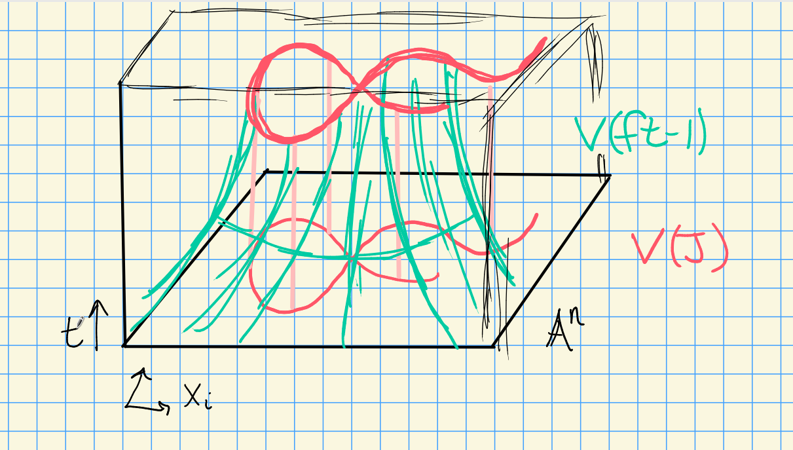

# Thursday, August 27

Recall Hilbert's Nullstellensatz:

a. For any affine variety, $V(I(X)) = X$.

b. For any ideal $J\normal k[x_1, \cdots, x_n]$, $I(V(J)) = \sqrt{J}$.

So there's an order-reversing bijection
\[  
\correspond{\text{Radical ideals } k[x_1, \cdots, x_n]} \to{V(\wait)}{I(\wait)}
\correspond{\text{Affine varieties in } \AA^n}
.\]

In proving $I(V(J)) \subseteq \sqrt{J}$, we had an important lemma (Noether Normalization): the maximal ideals of $k[x_1, \cdots, x_n]$ are of the form $\gens{x-a_1, \cdots, x-a_n}$.

:::{.corollary title="?"}
If $V(I)$ is empty, then $I = \gens{1}$.

> Slogan: the only ideals that vanish nowhere are trivial.
> No common vanishing locus $\implies$ trivial ideal, so there's a linear combination that equals 1.

:::

:::{.proof}
By contrapositive, suppose $I\neq \gens{1}$.
By Zorn's Lemma, these exists a maximal ideals $\mfm$ such that $I \subset \mfm$.
By the order-reversing property of $V(\wait)$, $V(\mfm) \subseteq V(I)$.
By the classification of maximal ideals, $\mfm = \gens{x-a_1, \cdots, x-a_n}$, so $V(\mfm) = \theset{a_1, \cdots, a_n}$ is nonempty.
:::

Returning to the proof that $I(V(J)) \subseteq \sqrt{J}$: let $f\in V(I(J))$, we want to show $f\in \sqrt{J}$.
Consider the ideal $\tilde J \da J + \gens{ft - 1} \subseteq k[x_1, \cdots, x_n, t]$.

Observation: $f = 0$ on all of $V(J)$ by the definition of $I(V(J))$.
But $ft-1 \neq 0$ if $f=0$, so $V(\tilde J) = V(G) \intersect V(ft-1) = \emptyset$.

Applying the corollary $\tilde J = (1)$, so $1 = \gens{ft-1} g_0(x_1, \cdots, x_n, t) + \sum f_i g_i(x_1, \cdots, x_n, t)$ with $f_i \in J$.
Let $t^N$ be the largest power of $t$ in any $g_i$.
Thus for some polynomials $G_i$, we have
\[  
f^N \da (ft-1) G_0(x_1, \cdots, x_n, ft) + \sum f_i G_i(x_1, \cdots, x_n, ft)
\]
noting that $f$ does not depend on $t$.

Now take $k[x_1, \cdots, x_n, t]/\gens{ft-1}$, so $ft=1$ in this ring.
This kills the first term above, yielding
\[  
f^N = \sum f_i G_i(x_1, \cdots, x_n, 1) \in k[x_1, \cdots, x_n, t]/\gens{ft-1}
.\]

Observation: there is an inclusion
\[  
k[x_1, \cdots, x_n] \injects
k[x_1, \cdots, x_n, t]/\gens{ft-1}
.\]

:::{.exercise}
Why is this true?
:::

Since this is injective, this identity also holds in $k[x_1, \cdots, x_n]$.
But $f_i\in J$, so $f\in \sqrt{I}$.  

:::{.example}
Consider $k[x]$.
If $J\subset k[x]$ is an ideal, it is principal, so $J = \gens{f}$.
We can factor $f(x) = \prod_{i=1}^k (x-a_i)^{n_i}$ and $V(f) = \ts{a_1, \cdots, a_k}$.
Then $I(V(f)) = \gens{(x-a_1)(x-a_2)\cdots(x-a_k)} = \sqrt{J} \subsetneq J$.
Note that this loses information.
:::

:::{.example}
Let $J = \gens{x-a_1, \cdots, x-a_n}$, then $I(V(J)) = \sqrt{J} = J$ with $J$ maximal.
Thus there is a correspondence
\[  
\correspond{\text{Points of } \AA^n} \iff 
\correspond{\text{Maximal ideals of }k[x_1, \cdots, x_n]}
.\]
:::

