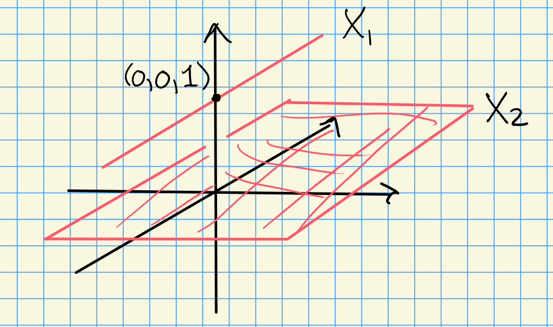

# Tuesday, September 01

Last time: $V(I) = \ts{x\in \AA^n \st f(x) = 0 \, \forall x\in I}$ and $I(X) = \ts{f\in k[x_1, \cdots, x_n] \st f(x) = 0\, \forall x\in X}$.
We proved the Hilbert Nullstellensatz $I(V(J)) = \sqrt{J}$, defined the coordinate ring of an affine variety $X$ as $A(X) \da k[x_1, \cdots, x_n] / I(X)$, the ring of "regular" (polynomial) functions on $X$.

Recall that a *topology* on $X$ can be defined as a collection of "closed" subsets of $X$ that are closed under arbitrary intersections and finite unions.
A subset $Y\subset X$ inherits a subspace topology with closed sets of the form $Z\intersect Y$ for $Z\subset X$ closed.

:::{.definition title="Zariski Topology"}
Let $X$ be an affine variety.
The closed sets are affine subvarieties $Y\subset X$.
:::

We have $\emptyset, X$ closed, since 

1. $V_X(1) = \emptyset$,
2. $V_X(0) = X$

Closure under finite unions:
Let $V_X(I), V_X(J)$ be closed in $X$ with $I, J \subset A(X)$ ideals.
Then $V_X(IJ) = V_X(I) \union V_X(J)$.

Closure under intersections:
We have $\bigcap_{i\in \sigma} V_X(J) = V_X\qty{ \sum_{i\in \sigma} J_i}$.

:::{.remark}
There are few closed sets, so this is a "weak" topology.
:::

:::{.example title="Closedness differs in the analytic topology"}
Compare the classical topology on $\AA^1/\CC$ to the Zariski topology.

Consider the set 
$A\da \ts{x\in \AA^1/\CC \st \norm{x} \leq 1}$, 
which is closed in the classical topology.
However, $A$ is *not* closed in the Zariski topology, since the closed subsets are finite sets or the whole space.

> Here the topology is in fact the cofinite topology.

:::

:::{.example}
Let $f: \AA^1/k\to \AA^1/k$ be any injective map.
Then $f$ is necessarily continuous wrt the Zariski topology.
Thus the notion of continuity is too weak in this situation.
:::

:::{.example}
Consider $X\cross Y$ a product of affine varieties.
Then there is a product topology where open sets are of the form $\bigcup_{i=1}^n U_i \cross V_i$ with $U_i, V_i$ open in $X, Y$ respectively.

This is the wrong topology!
On $\AA^1 \cross \AA^1 = \AA^2$, the diagonal $\Delta \da V(x-y)$ is closed in the Zariski topology on $\AA^2$ but not in the product topology.
:::

:::{.example}
Consider $\AA^2/\CC$, so the closed sets are curves and points.
Observation: $V(x_1 x_2 ) \subset \AA^2/\CC$ decomposed into the union of the coordinate axes $X_1 \da V(x_1)$ and $X_2 \da V(x_2)$.
The Zariski topology can detect these decompositions.
:::

:::{.definition title="Irreducibility and Connectedness"}
Let $X$ be a topological space.

a. $X$ is **reducible** iff there exist nonempty proper closed subsets $X_1 ,X_2 \subset X$ such that $X = X_1 \union X_2$.
  Otherwise, $X$ is said to be *irreducible*.

b. $X$ is **disconnected** if there exist $X_1, X_2 \subset X$ such that $X = X_1 \disjoint X_2$.
  Otherwise, $X$ is said to be *connected*.
:::

:::{.example}
$V(x_1 x_2)$ is reducible but connected.
:::

:::{.remark}
$\AA^1/\CC$ is *not* irreducible, since we can write $\AA^1/\CC = \ts{\norm{x} \leq 1} \union \ts{\norm{x} \geq 1}$.
:::

:::{.proposition title="?"}
Let $X$ be a disconnected affine variety with $X = X_1 \disjoint X_2$.
Then $A(X) \cong A(X_1) \cross A(X_2)$.
:::

:::{.proof}
We have $X_1 \union X_2 = X$, so $I(X_1) \intersect I(X_2) = I(X) = (0)$ in the coordinate ring $A(X)$ (recalling that it is a quotient by $I(X)$.)

Since $X_1 \intersect X_1 = \emptyset$, we have 
\[  
I(X_1 \intersect X_2) = \sqrt{I(X_1) + I(X_2) } = I(\emptyset) = \gens{1}
.\]

Thus $I(X_1) + I(X_2) = \gens{1}$, and by the Chinese Remainder Theorem, the following map is an isomorphism:
\[  
A(X) \to A(X)/I(X_1) \cross A(X) / I(X_2)
.\]

But the codomain is precisely $A(X_1) \cross A(X_2)$.
:::

:::{.proposition title="?"}
An affine variety $X$ is irreducible $\iff$ $A(X)$ is an integral domain.
:::

:::{.proof}
$\implies$:
By contrapositive, suppose $f_1, f_2 \in A(X)$ are nonzero with $f_1 f_2 = 0$.
Let $X_i = V(f_i)$, then $X= V(0) = V(f_1 f_2) = X_1 \union X_2$ which are closed and proper since $f_i \neq 0$.

\

$\impliedby$:
Suppose $X$ is reducible with $X = X_1 \union X_2$ with $X_i$ proper and closed.
Define $J_i \da I(X_i)$, and note $J_i \neq 0$ because $V(J_i) = V(I(X_i)) = X_i$ by part (a) of the Nullstellensatz.

So there exists a nonzero $f_i \in J_i = I(X_i)$, so $f_i$ vanishes on $X_i$.
But then $V(f_1) \union V(f_2) \supset X_1 \union X_2 = X$, so $X= V(f_1 f_2)$ and $f_1 f_2 \in I(X) = \gens{0}$ and $f_1 f_2 = 0$.
So $A(X)$ is not a domain. 
:::

:::{.example}
Let $X = \ts{p_1, \cdots, p_d}$ be a finite set in $\AA^n$.
The Zariski topology on $X$ is the discrete topology, and $X = \disjoint \ts{p_i}$.
So 
\[  
A(X) = A\qty{\disjoint \ts{p_i}} = \prod_{i=1}^d A({\ts{p_i}}) = \prod_{i=1}^d k[x_1, \cdots, x_n] / \gens{x_j - a_j(p_i)}_{j=1}^d
.\]
:::

:::{.example}
Set $V(x_1 x_2) = X$, then $A(X) = k[x_1, x_2]/ \gens{x_1 x_2}$.
This not being a domain (since $x_1 x_2 = 0$) corresponds to $X = V(x_1) \union V(x_2)$ not being irreducible.
:::

:::{.example}
$\AA^n/k$ is irreducible since $k[x_1, \cdots x_n]$ is a domain.
:::

:::{.example}
Let $X_1$ be the $xy$ plane and $X_2$ be the line parallel to the $y\dash$axis through $\thevector{0,0,1}$, and let $X= X_1 \disjoint X_2$.
Then $X_1 = V(z)$ and $X_2 = V(x, z-1)$, and $I(X) = \gens{z} \cdots \gens{x, z-1}=  \gens{xz, z^2 - z}$.

Then the coordinate ring is given by $A(X) = \CC[x, y, z] / \gens{xz, z^2 - z} = \CC[x, y, z] / \gens{z} \oplus \CC[x, y,z] / \gens{x, z-1}$.

:::

