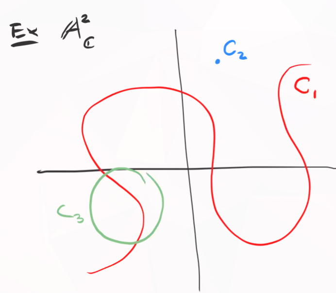
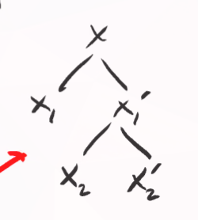

# Thursday, September 03

Recall that the Zariski topology is defined on an affine variety $X = V(J)$ with $J \normal k[x_1, \cdots, x_n]$ by describing the closed sets.

:::{.proposition title="?"}
$X$ is irreducible if its coordinate ring $A(X)$ is a domain.
:::

:::{.proposition title="?"}
There is a 1-to-1 correspondence
\[  
\correspond{\text{Irreducible subvarieties} \\ \text{of }X}
\iff
\correspond{\text{Prime ideals} \\ \text{in }A(X)}
.\]
:::

:::{.proof}
Suppose $Y\subset X$ is an affine subvariety.
Then 
\[  
A(X) / I_X(Y) = A(Y)
.\]

By NSS, there is a bijection between subvarieties of $X$ and radical ideals of $A(X)$ where $Y\mapsto I_X(Y)$.
A quotient is a domain iff quotienting by a prime ideal, so $A(Y)$ is a domain iff $I_X(Y)$ is prime.
:::

Recall that $\mfp \normal R$ is prime when $fg\in \mfp \iff f\in \mfp$ or $g\in \mfp$.
Thus $\bar f \bar g = 0$ in $R/\mfp$ implies $\bar f = 0$ or $\bar g = 0$ in $R/\mfp$, i.e. $R/\mfp$ is a domain.

Finally note that prime ideals are radical (easy proof).

:::{.example}
Consider $\AA^2/\CC$ and some subvarieties $C_i$:

Then irreducible subvarieties correspond to prime ideals in $\CC[x, y]$.
Here $C_1, C_3$ correspond to $V(f), V(g)$ for $f,g$ irreducible polynomials, whereas $C_2$ corresponds to a maximal ideal, i.e. $V(x_1 - a_1, x_2 - a_2)$.

Note that $I(C_1 \union C_2 \union C_3)$ is not a prime ideal, since the variety is reducible as the union of 3 closed subsets.
:::

:::{.example}
A finite set is irreducible iff it contains only one point.
:::

:::{.example}
Any irreducible topological space is connected, since irreducible requires a union but connectedness requires a *disjoint* union.
:::

:::{.example}
$A^n/k$ is irreducible: by prop 2.8, its irreducible iff the coordinate ring is a domain.
However $A(\AA^n)  = k[x_1, \cdots, x_n]$, which is a domain.
:::

:::{.example}
$V(x_1 x_2)$ is not irreducible, since it's equal to $V(x_1) \union V(x_2)$.
:::

:::{.definition title="Noetherian Space"}
A *Noetherian* topological space $X$ is a space with no infinite strictly decreasing sequence of closed subsets.
:::

:::{.proposition title="?"}
An affine variety $X$ with the zariski topology is a noetherian space.
:::

:::{.proof}
Let $X_0 \supsetneq X_1 \supsetneq \cdots$ be a decreasing sequence of closed subspaces.
Then $I(X_0) \subsetneq I(X_1) \subsetneq$.
Note that these containments are strict, otherwise we could use $V(I(X_1)) = X_1$ to get an equality in the original chain.

Recall that a ring $R$ is Noetherian iff every ascending chain of ideals terminates.
Thus it suffices to show that $A(X)$ is Noetherian.

We have $A(X) = \kx{n} / I(X)$, and if this had an infinite chain $I_1 \subsetneq I_2 \subsetneq \cdots$ lifts to a chain in $\kx{n}$, which is Noetherian.
A useful fact: $R$ noetherian implies that $R[x]$ is noetherian, and fields are always noetherian.
:::

:::{.remark}
Any subspace $A\subset X$ of a noetherian space is noetherian.
To see why, suppose we have a chain of closed sets in the subspace topology,
\[  
A\intersect X_0 \supsetneq A\intersect X_1 \supsetneq \cdots
.\]

Then $X_0 \supsetneq X_1 \supsetneq \cdots$ is a strictly decreasing chain of closed sets in $X$.
Why strictly decreasing: $\intersect^n X_i = \intersect^{n+1} X_i \implies A\intersect^n X_i = A\intersect^{n+1} X_i$, a contradiction.
:::

:::{.proposition title="Important"}
Every noetherian space $X$ is a finite union of irreducible closed subsets, i.e. $X = \Union_{i=1}^k X_i$.
If we further assume $X_i \not\subset X_j$ for all $i, j$, then the $X_i$ are unique up to permutation.
:::

:::{.proof}
If $X$ is irreducible, then $X=X$ and this holds.

Otherwise, write $X = X_1 \union X_2$ with $X_i$ proper closed subsets.
If $X_1$ and $X_1'$ are irreducible, we're done, so otherwise suppose wlog $X_1'$ is not irreducible.

Then we can express $X = X_1 \union \qty{X_2 \union X_2'}$ with $X_2, X_2' \subset X_1'$ closed and proper.

Thus we can obtain a tree whose leaves are proper closed subsets:

This tree terminates because $X$ is Noetherian.
:::

