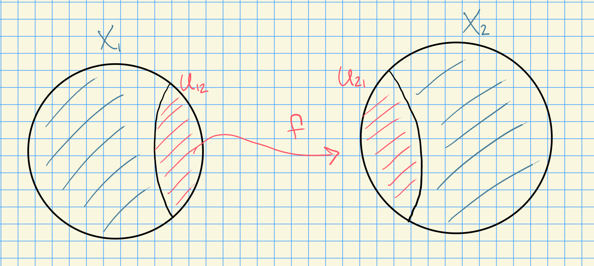
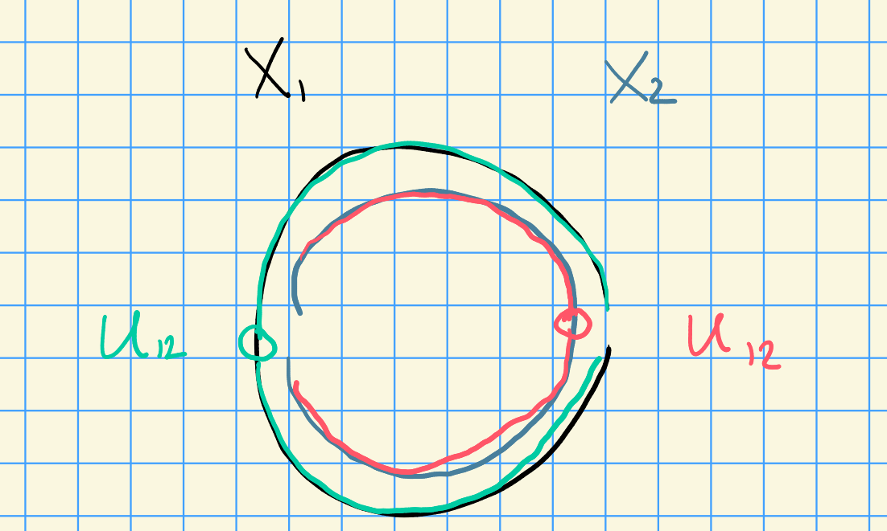
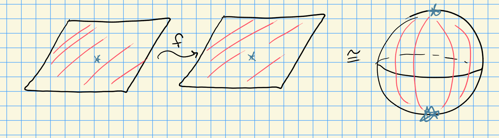

# Thursday, October 15

## End of Chapter 4

Recall the proposition: morphisms between affine varieties are in bijection with $k\dash$algebra morphisms between their coordinate rings.
As a result, we'll redefine an affine variety to be a ringed space isomorphic to an affine variety.

This allows you to say that affine varieties embedded in different ways are the same.

:::{.example}
$\AA^2$ vs $V(x) \subset  \AA^n$.
In fact, the map
\[  
f: \AA^2 &\to \AA^3
(y,z) &\mapsto (0, y, z)
.\]
This is continuous and the pullback of regular functions are again regular.
:::

:::{.remark}
With the new definition, there is a bijection between affine varieties up to isomorphisms and finitely generated $k\dash$algebras up to algebra isomorphism.
:::

:::{.proposition title="?"}
Let $D(f) \subset X$ be a distinguished open, then $D(f)$ is a ringed space since $(X, \OO_X)$ is and we can restrict the structure sheaf.
:::

:::{.proof}
Set
\[  
Y \da \ts{(x, t) \in X\cross \AA^1 \st tf(x) = 1} \subset X\cross \AA^1
.\]
This is an affine variety, since $Y = V(I + \gens{ft-1})$.
This is isomorphic to $D(f)$ by the map
\[  
Y &\to D(f)
(x, t) &\mapsto x
.\]
with inverse $x \mapsto (x, {1\over f(x)})$.

Note that $\pi: X\cross \AA^1 \to X$ is regular, using prop 3.8: if the coordinates of a map are regular functions, then the entire map is a morphism of ringed spaces.
We can then note that $1\over f(x)$ is regular on $D(f)$, since $f\neq 0$ there.
:::

:::{.example}
$\AA^2 \smz$ is not an affine variety.
Note that this is also not a distinguished open.

We showed on a HW problem that the regular functions on $\AA^2\smz$ are $k[x, y]$, which are also the regular functions on $\AA^2$.
So there is a map inducing a pullback
\[  
\iota: \AA^2\smz &\to \AA^2 \\
\iota^* k[x, y] \mapsvia{\sim} k[x, y]
.\]
Note that $\iota^*$ is an isomorphism on the space of regular functions, but $\iota$ itself is not an isomorphism of topological spaces.
Why? $i^{-1}$ is not defined at zero.
:::

## Chapter 5

:::{.definition title="Prevariety"}
A *prevariety* is a ringed spaced $X$ with a finite open cover by affine varieties.
This is a topological space $X$ with an open cover $\ts{U_i}_{i=1}^n \covers X$ such that $(U_i, \ro{\OO_X}{U_i} )$ is isomorphic to an affine variety.
We'll call $\OO_X$ the sheaf of *regular functions* and $U_i\subset X$ *affine open sets*.
:::

One way to construct prevarieties from affine varieties is by *gluing*:

:::{.definition title="Glued Spaces"}
let $X_1, X_2$ be prevarieties which are themselves actual varieties.
Let $U_{12} \subset X_1, U_{21} \subset X_2$ be opens and $f: U_{12} \to U_{21}$ an isomorphism of ringed spaces.

As a set, take $X = X_1 \disjoint X_2/\sim$ where $a\sim f(a)$ for all $a\in U_{12}$.
As a topological space, $U \subset X$ is open iff $U_i \da U\intersect X_i$ are open in $X_i$.
As a ringed space, we take $\OO_X(U) \da \ts{\phi: U\to k \st \ro{\phi}{U_i} \in \OO_{X_i}}$.
:::

:::{.example}
The prototypical example is $\PP^1/k$ constructed from two copies of $\AA^1/k$.
Set $X_1 = \AA^1, X_2 = \AA^2$, with $U_{12} \da D(x) \subset X_1$ and $U_{21} \da D(y) \subset X_2$.
Then let
\[  
f: U_{12} &\to U_{21} \\
x & \mapsto {1\over x}
.\]
This defines a regular function on $U_{12}$ so defines a morphism $U_{12} \mapsvia{\sim} \AA^1$.

Over $\CC$, topologically this yields a sphere

Given a ringed space $X = X_1\union X_2$ with a structure sheaf $\OO_X$, what is $\OO_X(X)$? 
By definition, it's 

\[  
\OO_X(X) \da \ts{\phi: X\to k \st \ro{\phi}{X_1}, \ro{\phi}{X_2} \text{ are regular} }
.\]

Then if $\ro{\phi}{X_1} = f(x)$ and $\ro{\phi}{X_2} = g(y)$, we have $y=1/x$ on the overlap and so $\ro{f(x)}{D(x)} = \ro{g(1/x)}{D(x)}$.
Since $f, g$ are rational functions agreeing on an infinite set, $f(x) = g(1/x)$
:::

