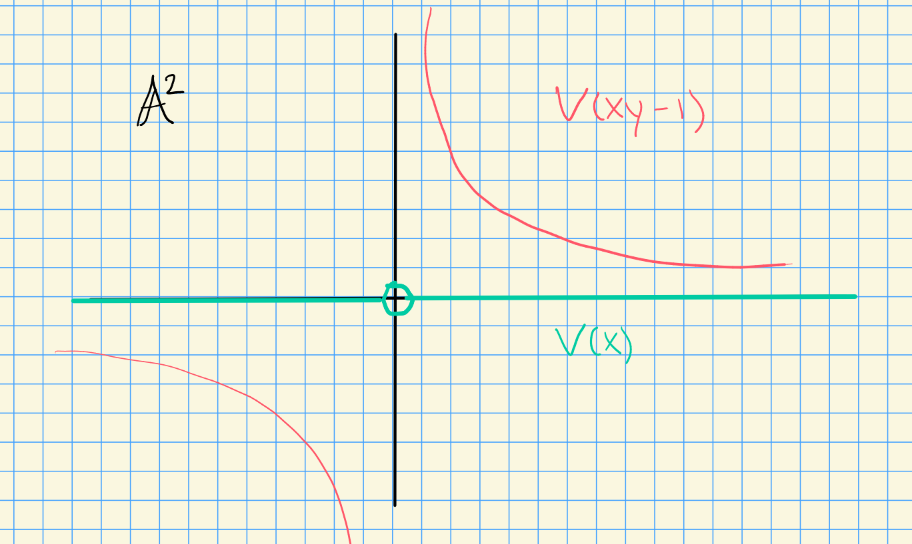

# Thursday, October 15

Recall the proposition: morphisms between affine varieties are in bijection with $k\dash$algebra morphisms between their coordinate rings.
As a result, we'll redefine an affine variety to be a ringed space isomorphic to an affine variety.

This allows you to say that affine varieties embedded in different ways are the same.

:::{.example}
$\AA^2$ vs $V(x) \subset  \AA^n$.
In fact, the map
\[  
f: \AA^2 &\to \AA^3
(y,z) &\mapsto (0, y, z)
.\]
This is continuous and the pullback of regular functions are again regular.
:::

:::{.remark}
With the new definition, there is a bijection between affine varieties up to isomorphisms and finitely generated $k\dash$algebras up to algebra isomorphism.
:::

:::{.proposition title="?"}
Let $D(f) \subset X$ be a distinguished open, then $D(f)$ is a ringed space since $(X, \OO_X)$ is and we can restrict the structure sheaf.
:::

:::{.proof}
Set
\[  
Y \da \ts{(x, t) \in X\cross \AA^1 \st tf(x) = 1} \subset X\cross \AA^1
.\]
This is an affine variety, since $Y = V(I + \gens{ft-1})$.
This is isomorphic to $D(f)$ by the map
\[  
Y &\to D(f)
(x, t) &\mapsto x
.\]
with inverse $x \mapsto (x, {1\over f(x)})$.

Note that $\pi: X\cross \AA^1 \to X$ is regular
:::

