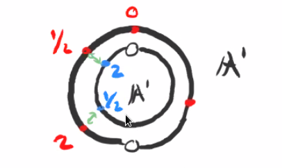
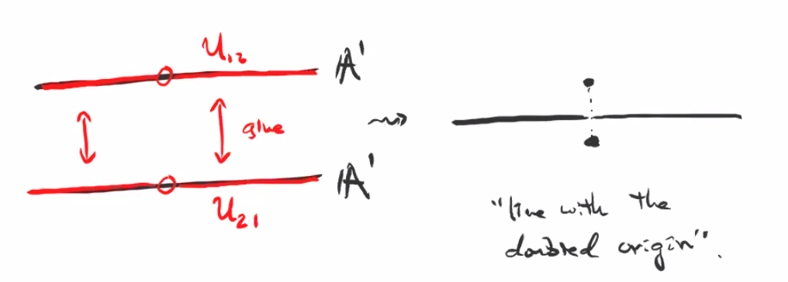

# Tuesday, October 20

Recall that a *prevariety* is a ringed space that is locally isomorphic to an affine variety, where we recall that $(X, \OO_X)$ is *locally isomorphic* to an affine variety iff there exists an open cover $U_i \covers X$ such that $(U_i, \OO_{U_i})$.

We found one way of producing these: the gluing construction. 
Given two ringed spaces $(X_1, \OO_{X_1})$ and $(X_2, \OO_{X_2})$ and open sets $U_{12} \in X_1$ and $U_{21} \in X_2$ and an isomorphism $(U_{12}, \OO_{U_{12}}) \mapsvia{f} (U_{21}, \OO_{U_{21}})$,
we defined 

- The topological space as $X_1 \disjoint_f X_2$
- The sheaf of rings as $\OO_X = \ts{\phi:U\to k \st\ro{\phi}{U\intersect X_i} \text{ is regular for } i=1,2 }$.

:::{.example}
$\PP^1/k = X_1 \union X_2$ where $X_1 \cong \AA^1, X_2 \cong \AA^2$.
Take $U_{12} = D(x)$ and $U_{21} = D(y)$ with
\[  
f: U_{12} &\to U_{21} \\
x &\mapsto {1\over x} = y
.\]

:::

:::{.example}
Let $X_i = \AA^1$ and $U_{12} = D(x), U_{21} = D(y)$ with
\[  
f: U_{12} &\to U_{21} \\
x &\mapsto x=y
.\]

Then $\OO_X = \ts{\phi: X\to k \st \ro{\phi}{X_i} \text{ is regular}}$.

:::

