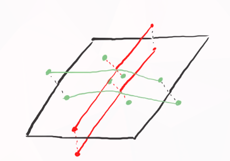
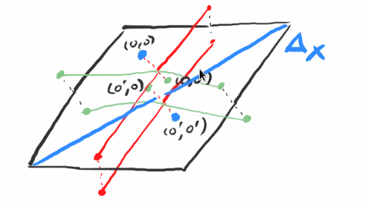
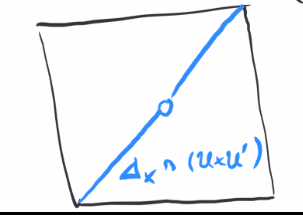

# Tuesday, October 27

Recall that an affine variety is given by $X = V(I) \subset \AA^n/k$, and we have sheaves of rings of regular functions $\OO_X$ on $X$.
A prevariety is a ringed space that is covered by finitely many affine spaces.
A morphism of prevarieties $f:X\to Y$ is a continuous map such that the pullbacks of regular functions are regular, i.e. for all $\phi \in \OO_X(U)$ we have $f^* \phi \in \OO_X(f^{-1} (U) )$.
We can form a category $\operatorname{PreVar}_k$ of prevarieties over $k$, where we have several important constructions

1. Gluing

2. Products:
  Given $X, Y$, there is a unique prevariety $X\cross Y$ such that
  \begin{tikzcd}
  Z\ar[drr, bend left , "f_x"] \ar[rdd, bend right, "f_y"] \ar[rd, "\exists ! h", dotted] &                                         & \\
                                                                                          & X\cross Y\ar[r, "\pi_X"]\ar[d, "\pi_Y"] & X \\
                                                                                          & Y                                       &
  \end{tikzcd}

We had an analogue of being Hausdorff: the diagonal $\Delta_X$ is closed.

:::{.example}
Glue $D(x) \subset \AA^1$ to $D(y) \subset \AA^1$ by the isomorphism 
\[  
D(x) & \mapsvia{\sim} D(y) \\
x &\mapsto y
.\]
This yields an affine line with two origins:

{width=250px}

Consider the product:

{width=250px}

Since the diagonal is given by $\Delta_X = \ts{(x, x) \st x\in X}$, we have the following situation in blue:

{width=250px}

We claim that $\Delta_X$ is not closed, and for example $(0, 0') \in \bar{\Delta}_X$.
Consider $U\cross U' \subset X\cross X$ where $U, U'$ are the two copies of $\AA^1$ in $X$.
This is an affine open set, since it's isomorphic to $\AA^1\cross \AA^1$.

If $\Delta_X$ were closed, then $S \da \Delta_X \intersect (U\cross U') = \ts{(x, x) \st x\neq 0}$ would be closed in $U\cross U'$.

{width=250px}

This is because any polynomial vanishing on $S$ must vanish at $(0, 0)$, so $S$ is an affine variety.
But then $V(I(S)) = \Delta_{\AA^1}$.
:::

:::{.lemma title="?"}
\envlist

a. Any affine variety is a variety.

b. Open and closed subprevarieties of a variety $X$ are themselves varieties.

Thus it makes since to consider *open* and *closed subvarieties*.
:::

:::{.proof title="of a"}
We need to check that $\Delta_X \subset X^2$ is closed for any affine $X\subset \AA^n$.
Note that we can write.
\[
\Delta_X = X^2 \intersect V\qty{ \ts{x_j - y_j \st 1\leq j \leq n}} \subset \AA^n \cross \AA^2
\]
:::

:::{.proof title="of b"}
Let $\iota:Y\to X$ be the inclusion of either an open or closed subset.
Then we have a morphism $(\iota, \iota): Y^2 \to X^2$ by the universal property.
Then $\Delta_Y = (\iota, \iota)^{-1} (\Delta_X)$, so is closed by the continuity of $(\iota, \iota)$ and the fact that $\Delta_X$.
Thus $Y$ is a variety.
:::

## Properties of Varieties

:::{.proposition title="Properties of Varieties"}
Let $f, g: X\to Y$ be morphisms of prevarieties and assume $Y$ is a variety.

a. The graph of $f$, given by $\Gamma_f \da \ts{(x, f(x)) \st x\in X}$, is closed in $X\cross Y$.

b. The set $\ts{x\in X\st f(x) = g(x)}$ is closed in $X$.
:::

:::{.proof title="of a"}
Consider the product morphism $(f, \id): X\cross Y \to Y^2$.
Since $\Delta_Y$ is closed, $(f, \id)^{-1} (\Delta_Y)$ is closed, and is the locus where $f(x) = y$, so this is $\Gamma_f$.
:::

:::{.proof title="of b"}
Consider $(f, g): X\to Y^2$.
Since $\Delta_Y \subset Y^2$ is closed, 
\[
(f, g)^{-1}(\Delta_Y) = \ts{x\in X \st f(x) = g(x)} \subset X
\]

is closed.
:::

## Chapter 6: Projective Varieties

Note that affine varieties of positive dimension over $\CC$ are not compact in the classical topology, but *are* compact in the Zariski topology.
Similarly, they are Hausdorff classically, but not in the Zariski topology.
We want to find notions equivalent to Hausdorffness and compactness in the classical setting, which end up also applying to varieties.
The fix in the latter case was considering "separatedness".
:q
The fix for compactness will be the following:

:::{.definition title="Complete"}
A variety $X$ is **complete** iff for any variety $Y$ the projection map $\pi_Y:X\cross Y\to Y$ is a closed map, i.e. $\pi_Y(U)$ is closed whenever $U$ is closed.
:::

:::{.example}
$\AA^1$ is not complete.
Let $Y=\AA^1$ and $Z = V(xy-1)\subset X\cross Y$.
Then $\pi_Y(Z) = D(y) \subset Y \subset \AA^1$ is not closed.
:::

