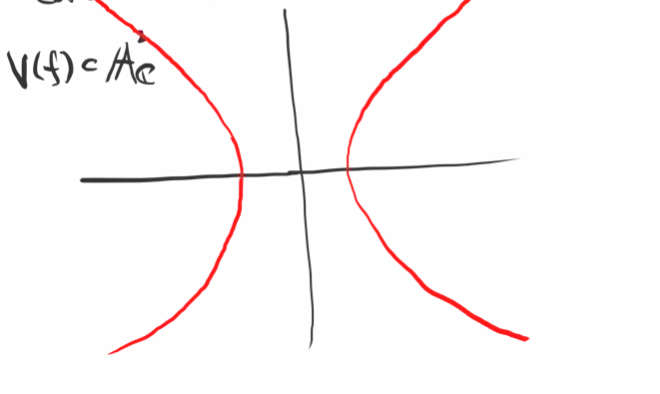
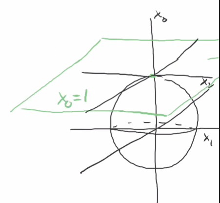
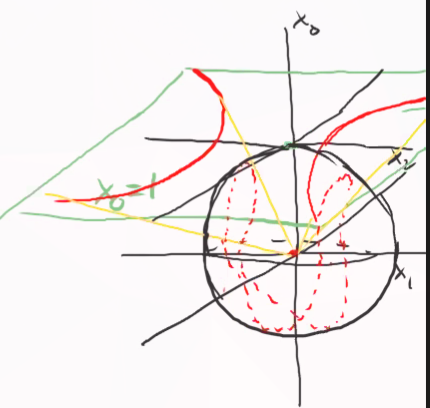
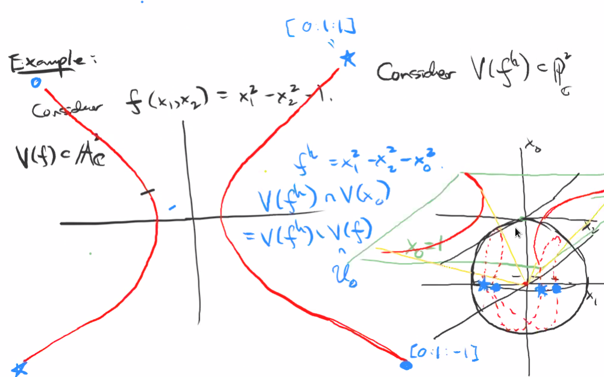

# Tuesday, November 10

Last time: projective varieties $V(f_i) \subset \PP^n_{/k}$ with $f_i$ homogeneous.
We proved the projective nullstellensatz: for any projective variety $X$, we have $V_p(I_p(X))$ and for any homogeneous ideal $I$ with $\sqrt{I} \neq I_0$ the irrelevant ideal, $I_p(V_p(I)) = \sqrt{I}$.
Recall that $I_0 = \gens{x_0, \cdots, x_n}$.
We had a notion of a projective coordinate ring, $S(X) \da \kx{n} / I_p(X)$, which is a graded ring since $I_p(X)$ is a homogeneous ideal.

Note that $S(X)$ is not a ring of functions on $X$: e.g. for $X= \PP^n$, $S(X) = \kx{n}$ but $x_0$ is not a function on $\PP^n$.
This is because $f\qty{\tv{x_0: \cdots : x_n}} = f\qty{\tv{\lambda x_0: \cdots : \lambda x_n}}$ but $x_0\neq \lambda x_0$.
It still makes sense to ask if $f$ is zero, so $V_p(f)$ is a well-defined object.

:::{.definition title="Dehomogenization of functions and ideals"}
Let $f\in \kx{n}$ be a homogeneous polynomial, then we define its dehomogenization as
\[  
f^i \da f(1, x_1, \cdots, x_n) \in k[x_1,\cdots, x_n]
.\]

For a homogeneous ideal, we define
\[  
J^i \da \ts{f^i \st f\in J}
.\]
:::

:::{.example}
This is usually not homogeneous. 
Take
\[  
f &= x_0^3 + x_0 x_1^2 + x_0 x_1 x_2 + x_0^2 + x_1 \\
\implies f^i &= 1  +x_1^2 + x_1 x_2 + x_1
,\]
where has terms of mixed degrees.
:::

:::{.remark}
\envlist

- $(fg)^i = f^i g^i$,
- $(f+g)^i = f^i + g^i$

In other words, evaluating at $x_0 = 1$ is a ring morphism.
:::

:::{.definition title="Homogenization of a function"}
Let $f\in \kx{n}$, then the **homogenization** of $f$ is defined by
\[  
f^h \da x_0^d f\qty{ {x_1 \over x_0}, \cdots, {x_n \over x_0} }
\]
where $d\da \deg(f)$.
:::

:::{.example title="?"}
Let $f(x_1, x_2) =  1 + x_1^2 + x_1 x_2 + x_2^3$, then
\[  
f^h(x_0, x_1, x_2) = x_0^3 + x_0 x_1^2 + x_0 x_1 x_2 + x_2^3
,\]
which is a homogeneous polynomial of degree $3$.
Note that $(f^h)^i = f$.
:::

:::{.example title="?"}
It need not be the case that $(f^i)^h = f$.
Take $f = x_0^3 + x_0 x_1 x_2$, then
$f^i = 1 + x_1 x_2$ and $(f^i)^h = x_0^2 + x_1 x_2$.
Note that the total degree dropped, since everything was divisible by $x_0$.
:::

:::{.remark}
\[  
(f^i)^h = f \iff x_0 \notdivides f
.\]
:::

:::{.definition title="Homogenization of an ideal"}
Given $J\subset \kx{n}$, define its **homogenization** as 
\[  
J^h \da \ts{f^h \st f\in J}
.\]

:::

:::{.example}
This is not a ring morphism, since $(f+g)^h \neq f^h + g^h$ in general.
Taking $f = x_0^2 + x_1$ and $g= -x_0^2 + x_2$, we have $f^h + g^h = x_0 x_1 + x_0 x_2$ while $(f+g)^h = x_12 + x_2$.
:::

:::{.remark}
What is the geometric significance?
Set $U_0 \da \ts{\tv{x_0: \cdots :x_n} \in \PP^n_{/k} \st x_0 \neq 0 } \cong \AA^n_{/k}$ with coordinates $\tv{{x_1\over x_0} : \cdots : {x_n \over x_0}}$.
:::

:::{.proposition title="?"}
The conclusion is thus that $U_0$ with the subspace topology is equal to $\AA^n$ with the Zariski topology.
:::

:::{.proof title="?"}

If we define the Zariski topology on $\PP^n$ as having closed sets $V_p(I)$, we would want to check that $\AA^n\cong U_0 \subset \PP^n$ is closed in the subspace topology.
This amounts to showing that $V_p(I) \intersect U_0$ is closed in $\AA^n \cong U_0$.
We can check that
\[  
V_p(f, f\in I) = \ts{\tv{x_0:\cdots:x_n} \st f(\vector x) = 0 \, \forall f\in I}
.\]
Intersecting with $U_0$ yields 
$\ts{\tv{x_1:\cdots:x_n} \st f(\vector x) = 0,\, x_0\neq 0}$.
Equivalently, we can rewrite this set as 
\[
\ts{\tv{x_1:\cdots:x_n} \st f\qty{\tv{1, {x_1 \over x_0}, \cdots,{x_n \over x_0} }} = 0,\, f \text{ homogeneous}}
\]
Since these are coordinates on $\AA^1$, we have $V_p(I) \intersect U_0 = V_a(I^i)$ which is closed.

Conversely, given a closed set $V(I)$, we can write this as $V(I) = U_0 \intersect V_p(I^h)$.
:::

:::{.corollary title="?"}
$\PP^n$ is irreducible of dimension $n$, where the proof is that its covered by irreducible topological spaces of dimension $n$ with nonempty intersection combined with a fact from the exercises.
:::

:::{.example title="?"}
Consider $f(x_1, x_2) = x_1^2 - x_2^2 - 1$ and consider $V(f) \subset \AA^2_{/\CC}$:

{width=350px}

Note that for real projective space, we can view this as a sphere with antipodal points identified. 
We can thus visualize this in the following way:

{width=350px}

We can normalize the $x_0$ coordinate to one, hence the plane.
We can also project $V(f)$ from the plane onto the sphere, mirroring to antipodal points:

{width=350px}

This misses some points on the equator, since we aren't including points where $x_0 = 0$.
Consider the homogenization $V(f^h) \subset \PP^2_{/\CC}$.
It's given by $f^h = x_1^2 - x_2^2 - x_0^2$, then
\[  
V(f^h) \intersect V(x_0) = \ts{\tv{0:x_1:x_2} \st f^h(0, x_1, x_2) = 0 } = \ts{\tv{0:1:1}, \tv{0:1:-1}}
,\]
which can be seen in the picture as the points at infinity:

{width=450px}

Note that the equator is $V(x_0) = \PP^2_{/\CC}\sm U_0 \cong \PP^2\sm \AA^2$.
So we get a circle of points at infinity, i.e. $V(x_0) = \PP^1 = \ts{\tv{0:v_1:v_2}}$.
:::

:::{.example title="?"}
Consider $V(f)$ where $f$ is a line in $\AA^2_{/\CC}$, say $f = ax_1 + bx_2 + c$.

:::
