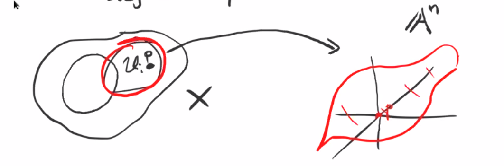

# Tuesday, December 01

Last time: we started discussing smoothness.

:::{.definition title="Tangent Space"}
The **tangent space** $T_p X$ of a variety $X$ at a point $p\in X$ is defined as $V(\ts{f_1 \st f\in I(U_i),\, U_i \ni p = 0 \text{ affine } })$ where $f_1$ denotes the degree 1 part.

:::

:::{.remark}
We've really only defined it for affine varieties and $p=0$, but this is a local definition.
Note that this is also not a canonical definition, since it depends on the affine chart $U_i$.
:::

:::{.example title="?"}
Consider $T_0 V(xy) = V(f_1 \st f\in \gens{xy}) = V(0) = \AA^2$, since every polynomial in this ideal has degree at least 2.
Letting $X = V(xy)$, note that we could embed $X\injects \AA^3$ as $X\cong V(xy, z)$.

:::
