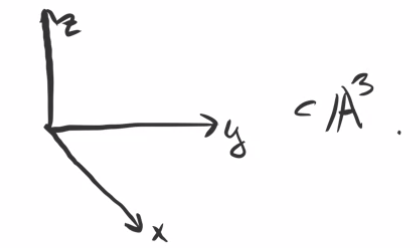

# Tuesday, December 01

Last time: we started discussing smoothness.

:::{.definition title="Tangent Space"}
The **tangent space** $T_p X$ of a variety $X$ at a point $p\in X$ is defined as $V(\ts{f_1 \st f\in I(U_i),\, U_i \ni p = 0 \text{ affine } })$ where $f_1$ denotes the degree 1 part.

:::

:::{.remark}
We've really only defined it for affine varieties and $p=0$, but this is a local definition.
Note that this is also not a canonical definition, since it depends on the affine chart $U_i$.
:::

:::{.example title="?"}
Consider $T_0 V(xy) = V(f_1 \st f\in \gens{xy}) = V(0) = \AA^2$, since every polynomial in this ideal has degree at least 2.
Letting $X = V(xy)$, note that we could embed $X\injects \AA^3$ as $X\cong V(xy, z)$.
In this case we have $T_0 X = V(f_1 \st f\in \gens{xy, z}) = V(z) \cong \AA^2$.
So we get a vector space of a different dimension from this different affine embedding, but $\dim T_0 X$ is the same.

:::

:::{.example title="?"}
Let $X = V_p(xy-z^2) \subset \PP^2$, which is a projective curve.
What is $T_p X$ for $p = [0:1:0]$?
Take an affine chart $\ts{y\neq 0} \intersect X$, noting that $\ts{y\neq 0} \cong \AA^2$.
We could dehomogenize the ideal $\ro{\gens{xy-z^2}}{y=1} = \gens{x-z^2}$.
Thus $X \intersect D(y) = V(x-z^2) \subset \AA^2$ and the point $[0:1:0] \in X$ gives $(0, 0)$ in this affine chart.
Then $T_p X = V(f_1 \st f\in \gens{x-z^2}) = V(x)$.
Then $f = (x-z^2)g$ implies that $f_1 = (xg)_1 = g_0 x$, the constant term of $g$ multiplied by $x$, since $z^2$ kills any degree 1 part of $g$.
So $T_p X$ is a line.
:::

:::{.example title="?"}
Take $X$ to be the union of the coordinate axes in $\AA^3$.

Then $I(X) = \gens{xy, yz, xz}$ and $T_0 X = V(f_1 \st f\in I(X)) = V(0) = \AA^3$, since the minimal degree of any such polynomial is 2.
Note that $\dim X = 1$ but $\dim T_0 X = 3$
:::
