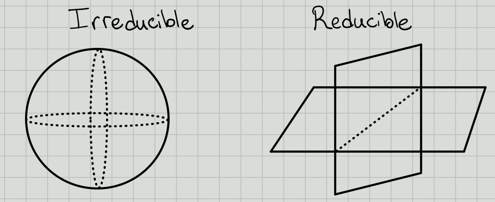

# Prologue {-}

## References

- Carter's "Finite Groups of Lie Type"[@carter_1985]

- Humphreys' "Linear Algebraic Groups"[@humphreys_2004]

## Notation

\todo[inline]{Todo}

\newpage

# Friday, August 21

## Intro and Definitions
:::{.definition title="Affine Variety"}
Let $k=\bar{k}$ be algebraically closed (e.g. $k = \CC, \bar{\FF_p}$).
A variety $V\subseteq k^n$ is an *affine $k\dash$variety* iff $V$ is the zero set of a collection of polynomials in $k[x_1, \cdots, x_n]$.
:::

Here $\AA^n\definedas k^n$ with the Zariski topology, so the closed sets are varieties.

:::{.definition title="Affine Algebraic Group"}
An *affine algebraic $k\dash$group* is an affine variety with the structure of a group, where the multiplication and inversion maps 
\[  
\mu: G\cross G &\to G \\
\iota: G&\to G
\]
are continuous.
:::

:::{.example}
$G = \GG_a \subseteq k$ the *additive group* of $k$ is defined as $\GG_a \definedas (k, +)$.
We then have a *coordinate ring* $k[\GG_a] = k[x] / I = k[x]$.
:::

:::{.example}
$G = \GL(n, k)$, which has coordinate ring $k[x_{ij}, T] / \gens{\det(x_{ij})\cdot T = 1}$.
:::

:::{.example}
Setting $n=1$ above, we have $\GG_m \definedas \GL(1, k) = (k\units, \cdot)$.
Here the coordinate ring is $k[x, T] / \gens{xT = 1}$.
:::

:::{.example}
$G = \SL(n, k) \leq \GL(n, k)$, which has coordinate ring $k[G] = k[x_{ij}] / \gens{\det(x_{ij}) = 1}$.
:::

:::{.definition title="Irreducible"}
A variety $V$ is *irreducible* iff $V$ can not be written as $V = \union_{i=1}^n V_i$ with each $V_i \subseteq V$ a proper subvariety.

:::

:::{.proposition title="?"}
There exists a unique irreducible component of $G$ containing the identity $e$. Notation: $G^0$.
:::

:::{.proposition title="?"}
$G$ is the union of translates of $G^0$, i.e. there is a decomposition
\[  
G = \disjoint_{g\in \Gamma} \, g\cdot G^0
,\]
where we let $G$ act on itself by left-translation and define $\Gamma$ to be a set of representatives of distinct orbits.
:::

:::{.proposition title="?"}
One can define solvable and nilpotent algebraic groups in the same way as they are defined for finite groups, i.e. as having a terminating derived or lower central series respectively.
:::

## Jordan-Chevalley Decomposition

:::{.proposition title="Existence and Uniqueness of Radical"}
There is a maximal connected normal solvable subgroup $R(G)$, denoted the *radical of $G$*.

- $\theset{e} \subseteq R(G)$, so the radical exists.
- If $A, B \leq G$ are solvable then $AB$ is again a solvable subgroup.

:::

:::{.definition title="Unipotent"}
An element $u$ is *unipotent* $\iff$ $u = 1+n$ where $n$ is nilpotent $\iff$ its the only eigenvalue is $\lambda = 1$.
:::

:::{.proposition title="JC Decomposition"}
For any $G$, there exists a closed embedding $G\injects \GL(V) = \GL(n , k)$ and for each $x\in G$ a unique decomposition $x=su$ where $s$ is semisimple (diagonalizable) and $u$ is unipotent.
:::

Define $R_u(G)$ to be the subgroup of unipotent elements in $R(G)$. 

:::{.definition title="Semisimple and Reductive"}
\hfill
Suppose $G$ is connected, so $G = G^0$, and nontrivial, so $G\neq \theset{e}$. Then 

- $G$ is semisimple iff $R(G) = \theset{e}$.
- $G$ is reductive iff $R_u(G) = \theset{e}$.
:::

:::{.example}
$G = \GL(n, k)$, then $R(G) = Z(G) = kI$ the scalar matrices, and $R_u(G) = \theset{e}$.
So $G$ is reductive and semisimple.
:::

:::{.example}
$G = \SL(n , k)$, then $R(G) = \theset{I}$.

:::{.exercise}
Is this semisimple? 
Reductive?
What is $R_u(G)$?
:::

:::

:::{.definition title="Torus"}
A *torus* $T\subseteq G$ in $G$ an algebraic group is a commutative algebraic subgroup consisting of semisimple elements.
:::

:::{.example}
Let
\[  
T \definedas 
\gens{
\begin{bmatrix}
a_1 &  & \mathbf 0\\
 & \ddots &  \\
\mathbf 0 &  & a_n
\end{bmatrix} \subseteq \GL(n ,k)
}
.\]
:::

:::{.remark}
Why are torii useful?
For $g = \mathrm{Lie}(G)$, we obtain a root space decomposition
\[  
g = 
\qty{\bigoplus_{\alpha \in \Phi_- }g_\alpha} \oplus 
t \oplus
\qty{\bigoplus_{\alpha \in \Phi_+ }g_\alpha} 
.\]

When $G$ is a simple algebraic group, there is a classification/correspondence:
\[  
(G, T) \iff (\Phi, W)
.\]
where $\Phi$ is an irreducible root system and $W$ is a Weyl group.

:::

# Monday, August 24

## Review and General Setup

- $k = \bar k$ is algebraically closed
- $G$ is a reductive algebraic group
- $T\subseteq G$ is a *maximal split torus*

> Split: $T\cong \bigoplus \GG_m$.

We'll associate to this a root system, not necessarily irreducible, yielding a correspondence
\[  
(G, T) \iff (\Phi, W)
\]
with $W$ a Weyl group.

This will be accomplished by looking at $\lieg = \mathrm{Lie}(G)$.
If $G$ is simple, then $\lieg$ is "simple", and $\Phi$ irreducible will correspond to a Dynkin diagram.

There is this a 1-to-1 correspondence
\[  
G \text{ simple}/\sim \iff A_n, B_n, C_n, D_n, E_6, E_7, E_8, F_4, G_2
\]
where $\sim$ denotes *isogeny*.

Taking the Zariski tangent space at the identity "linearizes" an algebraic group, yielding a Lie algebra.

We have the coordinate ring $k[G] = k[x_1, \cdots, x_n] / \mathcal{I}(G)$ where $\mathcal{I}(G)$ is the zero set.
This is equal to $\ts{f:G\to k}$,

## The Associated Lie Algebra

:::{.definition title="The Lie Algebra of an Algebraic Group"}
Define *left translation* is
\[  
\lambda_x: k[G] &\to k[G] \\
y &\mapsto f(x^{-1} y)
.\]

Define *derivations* as
\[  
\mathrm{Der} ~k[G] = \ts{D: k[G] \to k[G] \suchthat D(fg) = D(f) g + f D(g) }
.\]

We can then realize the Lie algebra as
\[  
\lieg = \mathrm{Lie}(G) = \theset{D\in \mathrm{Der} k[G] \suchthat \lambda_x \circ D = D\circ \lambda_x}
,\]
the left-invariant derivations.
:::

:::{.example}
\hfill
- $G = \GL(n, k) \implies\lieg = \liegl(n, k)$
- $G = \SL(n, k) \implies\lieg = \liesl(n, k)$
:::

Let $G$ be reductive and $T$ be a split torus.
Then $T$ acts on $\lieg$ via an *adjoint action*.
(For $\GL_n, \SL_n$, this is conjugation.)

There is a decomposition into eigenspaces for the action of $T$, 
\[  
\lieg = \qty{\bigoplus_{\alpha\in \Phi} g_\alpha} \oplus t
\]
where $t = \mathrm{Lie}(T)$ and $g_\alpha \da \ts{x\in \lieg\st t.x = \alpha(t) x\,\, \forall t\in T}$ with $\alpha: T\to K\units$ a rational function (a *root*).

In general, take $\alpha\in\hom_{\text{AlgGrp}}(T, \GG_m)$.

:::{.example}
Let $G = \GL(n, k)$ and 
\[  
T = \ts{
\begin{bmatrix}
a_1 & 0 & 0 \\
0 & \ddots & 0 \\
0 & 0 & a_n
\end{bmatrix}
\st a_j\in k\units
}
.\]

Then check the following action:

which indeed acts by a rational function.

Then 
\[  
g_\alpha = \spanof \ts{
\begin{bmatrix}
0 & 1 & 0 \\
0 & 0 & 0\\
0 & 0 & 0
\end{bmatrix}
} = g_{(1, -1, 0)}
.\]

For $\lieg = \liegl(3, k)$, we have
\[  
\lieg = t 
&\oplus g_{(1, -1, 0)}
\oplus g_{(-1, 1, 0)}  \\
&\oplus g_{(0, 1, -1)} 
\oplus g_{(0, -1, 1)}  \\
&\oplus g_{(1, 0, -1)} 
\oplus g_{(-1, 0, 1)} 
.\]
:::

## Representations

Let $\rho: G\to \GL(V)$ be a group homomorphisms, then equivalently $V$ is a (rational) $G\dash$module.

For $T\subseteq G$, $T\actson G$ semisimply, so we can simultaneously diagonalize these operators to obtain a *weight space decomposition* $V = \bigoplus_{\lambda \in X(T)} V_\lambda$, where
\[  
V_\lambda &\da\ts{v\in V\st t.v = \lambda(t)v\,\, \forall t\in T} \\\
X(T) &\da \hom(T, \GG_m)
.\]

:::{.example}
Let $G = \GL(n, k)$ and $V$ the $n\dash$dimensional natural representation as column vectors,
\[  
V = \ts{\thevector{v_1, \cdots, v_n} \suchthat v_j \in k}
.\]

Then
\[  
T = \ts{
\begin{bmatrix}
a_1 & 0 & 0 \\
0 & \ddots & 0\\
0 & 0 & a_n
\end{bmatrix} \suchthat a_j \in k\units
}
.\]

Consider the basis vectors $\vector{e}_j$, then 
\[  
\begin{bmatrix}
a_1 & 0 & 0 \\
0 & \ddots & 0\\
0 & 0 & a_n
\end{bmatrix} 
\begin{bmatrix}
0  \\
1  \\
0
\end{bmatrix}
=
a_j
\begin{bmatrix}
0  \\
1 \\
0
\end{bmatrix}
= a_1^0 a_2^0 \cdots a_j^0 \cdots a_n^0
\begin{bmatrix}
0  \\
1 \\
0
\end{bmatrix}
.\]

Here the weights are of the form $\eps_j\da \thevector{0, 0, \cdots, 1, \cdots, 0}$ with a $1$ in the $j$th spot, so we have
\[  
V = V_{\eps_1} \oplus V_{\eps_2} \oplus \cdots \oplus V_{{\eps_n}}
.\]
:::

:::{.example}
For $V = \CC$, we have $t.v = (a_1^0 \cdots a_n^0)v$ and $V = V_{(0, 0, \cdots, 0)}$.
:::

## Classification

Let $G$ be a simple algebraic group (ano closed, connected, normal subgroups other than $\ts{e}, G$) that is nonabelian that is nonabelian.

:::{.example}
Let $G = \SL(3, k)$.
Then
\[  
T = \ts{
t = 
\begin{bmatrix}
a_1 & 0 & 0 \\
0 & a_1 a_2^{-1}  & 0\\
0 & 0 & a_2^{-1} 
\end{bmatrix}
\st
a_1, a_2\in k\units
}
\]
and
\[  
t.
\begin{bmatrix}
0 & 1 & 0 \\
0 & 0 & 0 \\
0 & 0 & 0 \\
\end{bmatrix}
= 
a_1^2 a_2^{-1} 
\begin{bmatrix}
0 & 1 & 0 \\
0 & 0 & 0 \\
0 & 0 & 0 \\
\end{bmatrix}
.\]
and $\alpha_1 = (2, -1)$.

\todo[inline]{What is $\alpha_1$? Note that you can recover the Cartan something here?}

Then
\[  
\lieg = 
\lieg_{(2, -1)} \oplus \lieg_{(-2, 1)} \oplus
\lieg_{(-1, 2)} \oplus \lieg_{(1, -2)} \oplus
\lieg_{(1, 1)} \oplus \lieg_{(-1, -1)}
.\]

Then $\alpha_2 = (-1, 2)$ and $\alpha_1 + \alpha_2 = ( 1, 1)$.

This gives the root space decomposition for $\liesl_3$:

Then the Weyl group will be generated by reflections through these hyperplanes.

:::

# Wednesday, August 26

## Review

- $G$ a reductive algebraic group over $k$
- $T = \prod_{i=1}^n \GG_m$ a maximal split torus
- $\lieg = \mathrm{Lie}(G)$
- There's an induced root space decomposition $\lieg = t\oplus \bigoplus_{\alpha\in \Phi}\lieg_\alpha$
- When $G$ is simple, $\Phi$ is an *irreducible* root system
  - There is a classification of these by Dynkin diagrams

:::{.example}
$A_n$ corresponds to $\liesl(n+1, k)$ (mnemonic: $A_1$ corresponds to $\liesl(2)$)
:::

- We have representations $\rho: G\to \GL(V)$, i.e. $V$ is a $G\dash$module
- For $T\subseteq G$, we have a weight space decomposition: 
  $V = \bigoplus_{\lambda \in X(T)} V_\lambda$ where $X(T) = \hom(T, \GG_m)$.

  > Note that $X(T) \cong \ZZ^n$, the number of copies of $\GG_m$ in $T$.

## Root Systems and Weights

:::{.example}
Let $\Phi = A_2$, then we have the following root system:

:::

In general, we'll have $\Delta = \ts{\alpha_1, \cdots, \alpha_n}$ a basis of *simple roots*.

:::{.remark}
Every root $\alpha\in I$ can be expressed as either positive integer linear combination (or negative) of simple roots.
:::

For any $\alpha\in \Phi$, let $s_\alpha$ be the reflection across $H_\alpha$, the hyperplane orthogonal to $\alpha$.
Then define the *Weyl group* $W = \ts{s_\alpha \st \alpha\in \Phi}$.

:::{.example}
Here the Weyl group is $S_3$:

:::

:::{.remark}
$W$ acts transitively on bases.
:::

:::{.remark}
$X(T) \subseteq \ZZ\Phi$, recalling that $X(T) = \hom(T, \GG_m) = \ZZ^n$ for some $n$.
Denote $\ZZ\Phi$ the *root lattice* and $X(T)$ the *weight lattice*.
:::

:::{.example}
Let $G = \liesl(2, \CC)$ then $X(T) = \ZZ\omega$ where $\omega = 1$, $\ZZ \Phi = \ZZ\ts{\alpha}$
Then there is one weight $\alpha$, and the root lattice $\ZZ\Phi$ is just $2\ZZ$.
However, the weight lattice is $\ZZ\omega = \ZZ$, and these are not equal in general.
:::

:::{.remark}
There is partial ordering on $X(T)$ given by $\lambda \geq \mu \iff \lambda - \mu = \sum_{\alpha\in \Delta} n_\alpha \alpha$ where $n_\alpha \geq 0$.
(We say $\lambda$ *dominates* $\mu$.)
:::

:::{.definition title="Fundamental Dominant Weights"}
We extend scalars for the weight lattice to obtain $E \da X(T) \tensor_\ZZ \RR \cong \RR^n$, a Euclidean space with an inner product $\inner{\wait}{\wait}$.

For $\alpha\in \Phi$, define its *coroot* $\alpha\dual \da {2\alpha \over \inner{\alpha}{\alpha}}$.
Define the *simple coroots* as $\Delta\dual \da \ts{\alpha_i\dual}_{i=1}^n$, which has a dual basis $\Omega \da \ts{\omega_i}_{i=1}^n$ the *fundamental weights*.
These satisfy $\inner{\omega_i}{\alpha_j\dual} = \delta_{ij}$.

\todo[inline]{What is the notation for fundamental weights? Definitely not $\Omega$ usually!}

> Important because we can index irreducible representations by fundamental weights.

A weight $\lambda\in X(T)$ is *dominant* iff $\lambda \in \ZZ^{\geq 0} \Omega$, i.e. $\lambda = \sum n_i \omega_i$ with $n_i \in \ZZ^{\geq 0}$.
:::

If $G$ is simply connected, then $X(T) = \bigoplus \ZZ \omega_i$.

> See Jantzen for definition of simply-connected, $\SL(n+1)$ is simply connected but its adjoint $PGL(n+1)$ is not simply connected.

## Complex Semisimple Lie Algebras

When doing representation theory, we look at the Verma modules $Z(\lambda) = U(\lieg) \tensor_{U(\lieb^+)} \lambda \surjects L(\lambda)$.

:::{.theorem title="?"}
$L(\lambda)$ as a finite-dimensional $U(\lieg)\dash$module $\iff$ $\lambda$ is dominant, i.e. $\lambda \in X(T)_+$.
:::

Thus the representations are indexed by lattice points in a particular region:

**Question 1**:

Suppose $G$ is a simple (simply connected) algebraic group.
How do you parameterize *irreducible* representations?

For $\rho: G\to \GL(V)$, $V$ is a *simple module* (an *irreducible representation*) iff the only proper $G\dash$submodules of $V$ are trivial.

**Answer 1**:
They are also parameterized by $X(T)_+$.
We'll show this using the induction functor $\ind_B^G \lambda =H^0(G/B, \mathcal{L}(\lambda))$ (sheaf cohomology of the flag variety with coefficients in some line bundle).

> We'll define what $B$ is later, essentially upper-triangular matrices.

**Question 2**:
What are the dimensions of the irreducible representations for $G$?

**Answer 2**:
Over $k=\CC$ using Weyl's dimension formula.

For $k = \bar{\FF}_p$: conjectured to be known for $p\geq h$ (the *Coxeter number*), but by Williamson (2013) there are counterexamples.
Current work being done!

# Friday, August 28

## Representation Theory

Review: let $\lieg$ be a semisimple lie algebra $/\CC$.
There is a decomposition $\lieg = \lieb^+ \oplus \lien^- = \lien^+ \oplus t\oplus \lien^-$, where $t$ is a torus.
We associate $U(\lieg)$ the universal enveloping algebra, and representations of $\lieg$ correspond with representations of $U(\lieg)$.

Let $\lambda \in X(T)$ be a weight, then $\lambda$ is a $U(\lieb^+)\dash$module.
We can write  $Z(\lambda) = U(\lieg) \tensor_{U(\lieb^+)} \lambda$.

:::{.remark}
There exists a unique maximal submodule of $Z(\lambda)$, say $RZ(\lambda)$ where $Z(\lambda)/RZ(\lambda) \cong L(\lambda)$ is an irreducible representation of $\lieg$.
:::

:::{.theorem title="?"}
Let $L = L(\lambda)$ be a finite-dimensional irreducible representation for $\lieg$.
Then

1. $L \cong Z(\lambda)/RZ(\lambda)$ for some $\lambda$.
2. $\lambda \in X(T)_+$ is a dominant integral weight.
:::

### Induction

Let $\lieg$ be an algebraic group $/k$ with $k = \bar{k}$, and let $H \leq G$.
Let $M$ be an $H\dash$module, we'll eventually want to produce a $G\dash$modules.

Step 1:
Make $M$ into a $G\cross H$ where the first component $(g, 1)$ acts trivially on $M$.

Taking the coordinate algebra $k[G]$, this is a $(G-G)\dash$bimodule, and thus becomes a $G\cross H\dash$module.
Let $f\in k[G]$, so $f:G\to  K$, and let $y\in G$.
The explicit action is 
\[  
[(g, h) f] (y) \da f(g^{-1} y h)
.\]

Note that we can identify $H\cong 1\cross H \leq G\cross H$.
We can form $(M\tensor_k k[G])^H$, the $H\dash$fixed points.

:::{.exercise}
Let $N$ be an $A\dash$module and $B\normal A$, then $N^B$ is an $A/B\dash$module.

> Hint: the action of $B$ is trivial on $N^B$.
> Here $N^B \da \ts{n\in N \st b.n = n\, \forall b\in B}$

:::

:::{.definition title="Induction"}
The *induced module* is defined as 
\[  
\ind_H^G(M) \da (M\tensor k[G])^H
.\]
:::

### Properties of Induction

1. $(\wait \tensor_k k[G]) = \hom_H(k, \wait \tensor_k k[G])$ is only *left-exact*, i.e.
\[  
\qty{0\to A\to B\to C\to 0}\mapsto \qty{0\to FA \to FB \to FC \to \cdots}
.\]

2. By taking right-derived functors $R^jF$, you can take cohomology.

  > Note that in this category, we won't have enough projectives, but we will have enough injectives.

3. This functor commutes with direct sums and direct limits.

4. (**Important**) Frobenius Reciprocity: there is an adjoint, *restriction*, satisfying
\[  
\hom_G(N, \ind_H^G M) = \hom_H(N\downarrow_H, M)
.\]

5. (Tensor Identity) If $M\in \Mod(H)$ and additionally $M \in \Mod(G)$, then $\ind_H^G = M \tensor_k  \ind_H^G k$.

  If $V_1, V_2 \in \Mod(G)$ then $V_1 \tensor_k V_2 \in \Mod(G)$ with the action given by $g(v_1\tensor v_2) = gv_1 \tensor gv_2$.

6. Another interpretation: we can write
\[  
\ind_H^G(M) = \ts{f\in \Hom(G, M_a)
\st
f(gh) = h^{-1} \cdot f(g)
\, \forall g\in G, h\in H} \qquad M_a = M \da \AA^{\dim M}
.\]

> I.e., equivariant wrt the $H\dash$action. 

Then $G$ acts on   $\ind_H^G M$ by left-translation: $(gf)(y) = f(g^{-1} y)$.

7. There is an evaluation map:
\[  
\eps: \ind_H^G(M) &\to M \\ 
f&\mapsto f(1)
.\]

This is an  $H\dash$module morphism.
Why?
We can check
\[  
\eps(h.f) 
&\da (h.f)(a) \\
&= f(h^{-1} ) \\
&= hf(1) \\
&= h(\eps(f))
.\]

We can write the isomorphism in Frobenius reciprocity explicitly:
\[  
\hom_G(N, \ind_H^G M) &\mapsvia{\cong} \hom_H(N, M) \\
\phi & \mapsto \eps \circ \phi
.\]

8. Transitivity of induction: for $H\leq H' \leq G$, there is a natural transformation (?) of functors:
\[  
\ind_H^G(\wait) = \ind_{H'}^G\qty{\ind_H^{H'}(\wait) }
.\]

\todo[inline]{Equality as a composition of functors?}

## Classification of Simple $G\dash$modules

Suppose $G$ is a connected reductive algebraic group $/k$ with $k = \bar k$.

:::{.example}
Let $G = \GL(n, k)$.
There is a decomposition:

:::

**Step 1**:
Getting modules for $U$.

Then there's a general fact: $U^+ T U \injects G$ is dense in the Zariski topology for any reductive algebraic group.
We can form

- $B^+ \da T\semidirect U^+$, the *positive borel*,
- $B^- \da T\semidirect U$, the *negative borel*,

Suppose we have a $U\dash$module, i.e. a representation $\rho: U \to \GL(V)$.
We can find a basis such that $\rho(u)$ is upper triangular with ones on the diagonal.
In this case, there is a composition series with 1-dimensional quotients, and the composition factors are all isomorphic to $k$.

Moral: for unipotent groups, there are only trivial representations, i.e. the only simple $U\dash$modules are isomorphic to $k$.

**Step 2**: 
Getting modules for $B$.

Modules for $B$ are solvable, in which case we can find a flag. 
In this case, $\rho(b)$ embeds into upper triangular matrices, where the diagonal action may now not be trivial (i.e. diagonal is now arbitrary).

Thus simple $B\dash$modules arise by taking $\lambda \in X(T) = \hom(T, \GG_m) = \hom(T, \GL(1, k))$, then letting $u$ act trivially on $\lambda$, i.e. $u.v = v$.
Here we have $B \to B/U = T$, so any $T\dash$module can be pulled back to a $B\dash$module.

**Step 3**: 
Getting modules for $G$.

Let $\lambda \in X(T)$, then $H^0(\lambda) = \ind_B^G \lambda = \nabla(\lambda)$.

# Monday, August 31

## Review of Representation Theory of Modules

Take $R$ a ring, then consider $M$ an $R\dash$module to be a "vector space" over $M$.
Note that $M$ is an $R\dash$module $\iff$ there exists a ring morphism $\rho: R\to \hom_{\text{AbGrp}}(M, M)$.

Now let $G$ be a group and consider $G\dash$modules $M$.
Then a $G\dash$module will be defined by taking $M/k$ a vector space and a $G\dash$action on $M$.
This is equivalent to having a group morphism $\rho: G\to \GL(M)$.

For $M$ a $G\dash$module, given a group action, define
\[  
\rho: G&\to \GL(M) \\
\rho(g)(m) &= g.m
\]
where $\rho(h): M\to M$.

Similarly, for $\rho: G\to \GL(M)$ a group morphism, define the group action $g.m \da \rho(g)m$.
Thus representations of $G$ and $G\dash$modules are equivalent.

:::{.definition title="?"}
Let $M$ be a $G\dash$module.

1. $M$ is a *simple* $G\dash$module (equivalently an *irreducible representation*) $\iff$ the only $G\dash$submodules (equiv. $G\dash$invariant subspaces) are $0, M$.

2. $M$ is *indecomposable* $\iff$ $M$ can not be written as $M = M_1 \oplus M_2$ with $M_i < M$ proper submodules.
:::

:::{.example}
For $G = \SL(n, \CC)$, there is a natural $n\dash$dimensional representation $M = V$, and this is irreducible.
:::
\todo[inline]{What is $V$?}

:::{.example}
Let $R = \ZZ$, so we're considering $\ZZ\dash$modules.
For $M=\ZZ$, $M$ is not simple since $2\ZZ < \ZZ$ is a proper submodule.
However $M$ is indecomposable.
:::

Recall from last time: we defined a functor $\ind_H^G(\wait): H\dash\text{mod} \to G\dash\text{mod}$, where $\ind_H^G = \qty{k[G] \tensor M}^H$, the $H\dash$invariants.
This functor is left-exact but not right-exact, so we have cohomology $R^j \ind_H^G$ by taking right-derived functors.

Goal: classify simple $G\dash$modules for $G$ a reductive connected algebraic group.

:::{.example}
For $G = \GL(n , k)$, we have a decomposition

:::

We have

- $B = T\semidirect U$ the negative Borel,
- $B = T\semidirect U^+$ the Borel

For $U\dash$modules: 
$k$ is the only simple $U\dash$module.
Importantly, if $V$ is a $U\dash$module, then the fixed points are never zero, i.e. $V^U = \hom_{U\dash\text{Mod}}(k, V) \neq 0$.

For $B\dash$modules: 
let $X(T) \da \hom(T, \GG_m) = \hom(T, \GL(1, k))$.
These are the simple representations for the torus $T$.
Thus $\lambda \in X(T)$ represents a simple $T\dash$module.

We have a map $B \to B/U = T$, so we can pullback $T\dash$representations to $B\dash$representations ("inflation"), since we have a map $T\to \GL(1, k)$ and we can just compose.
So $\lambda$ is a 1-dimensional (simple) $B\dash$module where $U$ acts trivially.

Lee's theorem: all irreducible representations for $B$ are one-dimensional.
Thus these are the simple $B\dash$modules.

For $G\dash$modules:
define $\nabla(\lambda) \da \ind_B^G(\lambda) = H^0(\lambda)$.

Questions:

1. When does $H^0(\lambda) = 0$?
2. What is $\dim_{k\dash\text{Vect}} H^0(\lambda)$?
3. What are the composition factors of $H^0(\lambda)$? 

  > Known in characteristic zero, wildly open in positive characteristic.

:::{.remark}
Another interpretation: look at the flag variety $G/B$ and take global sections, then $H^0(\lambda) = H^0(G/B, \mathcal{L}(\lambda))$ where $\mathcal{L}$ is given by projecting the fiber product $G \cross_B \lambda \surjects G/B$ onto the first factor.
:::

:::{.remark}
\hfill

1. $H^0(k) = H^0(\thevector{0, \cdots, 0}) = k[G/B] = k$.
2. $H^0(M) = M$ if $M$ is a $G\dash$module.
3. A $G\dash$module $M$ is *semisimple* iff $M = \bigoplus_{i\in I} M_i$ with each $M_i$ are simple.
4. Can consider the largest semisimple submodule, the *socle* $\soc_G(M)$.
:::

\begin{center}
\begin{tikzcd}
L_4 \ar[dr] & & L_5 \oplus L_7\ar[dl] \\
& \qty{L_1 \oplus L_2 \oplus L_3} = \soc_G(M)) & \\
\end{tikzcd}
\end{center}

Goal: classify simple $G\dash$modules.
Strategy: used dominant highest weights.

> As opposed to Verma modules, the irreducibles will be a dual situation where they sit at the bottom of the module.
> Indicated by the notation $\nabla$ pointing down!

:::{.proposition title="?"}
Let $\lambda \in X(T)$ with $H^0(\lambda) \neq 0$.

1. $\dim H^0(\lambda)^{U^+} = 1$ and $H^0(\lambda)^{U^+} = H^0(\lambda)_\lambda$.
2. Every weight of $H^0(\lambda)$ satisfies $w_u \lambda \leq \mu \leq \lambda$, where $w_0$ is the longest Weyl group element and $\alpha\leq \beta \iff \alpha-\beta \in \ZZ^{+}\Phi$.

> Note that in fact $\ell(w_0) = \abs{\Phi^+}$.
:::

:::{.example}
Take $A_2$ with simple reflections $s_{\alpha_1}, s_{\alpha_2}$ and $\Delta = \ts{\alpha_1, \alpha_2}$.
\begin{center}
\begin{tikzcd}
& 1\ar[ld] \ar[rd] & \\
s_{\alpha_1} \ar[d] & & s_{\alpha_2}\ar[d] \\
s_{\alpha_1}s_{\alpha_2}\ar[rd] & & s_{\alpha_2} s_{\alpha_1}\ar[ld] \\
& s_{\alpha_2} s_{\alpha_1}s_{\alpha_1} = s_{\alpha_1} s_{\alpha_2} s_{\alpha_1} = w_0 & 
\end{tikzcd}
\end{center}
:::

:::{.proof title="(Sketch)"}
We can write
\[  
H^0(\lambda) = \ts{f\in k[G] \st f(gb) = \lambda(b)^{-1} f(g) \, b\in B, g\in G}
.\]

Suppose $f\in H^0(\lambda)^{U^+}$ and $u_+ \in U^+, t\in T, u\in U$.
Then 
\[  
\qty{ u_+^{-1} f} (tu) 
&= f(tu) \\
&= \lambda(t)^{-1} f(1)
.\]
On the other hand,
\[  
\qty{ u_+^{-1} f} (tu) 
&= f(u_+ t u)
.\]

So by density, $f(1)$ is determined by $f(u_+ t u)$ and $\dim H^0(\lambda)^{U^+} \leq 1$.
But since this can't be zero, the dimension must be equal to 1.
:::

:::{.proposition title="?"}
Let 
\[  
\eps: H^0(\lambda) \to \lambda
\]
be the evaluation morphism.

This is a morphism of $B\dash$modules, and in particular is a morphism of $T\dash$modules.
Thus the image of a weight $\mu \neq \lambda$ is zero, so $\eps$ is injective.
:::

:::{.proof}
We have 
\[  
f(u_+ t u) = \lambda(t)^{-1} f(1) = \lambda(t)^{-1} \eps(f)
.\]

Suppose $f\in H^0(\lambda)^{U^+}$ and $\eps(f) = 0$.
Then $f(u_+ t u) = 0$, and by density $f\equiv 0$, showing injectivity.

Therefore $H^0(\lambda)^{U^+}\subset H^0(\lambda)_\lambda$.
Suppose $\mu$ is maximal among weights in $H^0(\lambda)$.
Then
\[  
H^0(\lambda)_{\mu} \subseteq H^0(\lambda)^{U^+}
\]
because $U^+$ raises weights.

But $H^0(\lambda)^{U^+} \subseteq H^0(\lambda)_\lambda$ implies $\mu = \lambda$.
Thus the maximal weight in $H^0(\lambda)$ is $\lambda$.

> Recall the situation in lie algebras: $g_\alpha v \in V_{\lambda + \alpha}$ when $v\\in V_{\lambda}$.

Since $\lambda$ is maximal, any other weight $\mu$ satisfies $\mu \leq \lambda$.
Thus 
\[  
H^0(\lambda)_\lambda \subseteq H^0(\lambda)^{U^+} \subseteq H^0(\lambda)_\lambda
,\]
forcing these to be equal and finishing part 1.
:::

# Friday, September 04

Some concepts used in the proof of other theorems:
Let $G$ be a reductive algebraic group and $\lieg$ its lie algebra.
There is an associative algebra $U(\lieg)$ which reflects the representation theory of $G$.

Fact: $\lieg\dash$mod $\equiv U(\lieg)\dash$modules which are unitary, i.e. $1.m = m$.

We can write a basis 
\[  
\lieg  = \gens{e_\alpha, h_i, f_\beta \st \alpha\in\Phi^+,\, \beta\in\Phi^-,\, i = 1,2,\cdots,n}
,\]
the *Chevalley basis*.
It turns out that the structure constants are all in $\ZZ$.

:::{.example}
Take $\lieg = \liesl(2, k)$, then
\[  
e = \begin{bmatrix}
0 & 0 \\
1 & 0
\end{bmatrix}
\quad 
f = \begin{bmatrix}
0 & 1 \\
0 & 0
\end{bmatrix}
\quad
h = \begin{bmatrix}
1 & 0 \\
0 & -1
\end{bmatrix}
.\]
:::

We want to form a $\ZZ\dash$lattice in $U(\lieg)$, denoted 
\[  
U(\lieg)_\ZZ
=
\gens{
e_\alpha^{[n]} = {e_\alpha^n \over n!},\, f_\beta^{[n]} = {f_\beta^n \over n!}, {h_i \choose m}
}
.\]

We then form the *distribution algebra* (or *hyperalgebra* in earlier literature) as $\mathrm{Dist})G) \da U(\lieg)_\ZZ \tensor_\ZZ k$ for $k$ any field (e.g. $\ch(k) = p$).

:::{.theorem title="?"}
$G\dash$modules $\equiv \mathrm{Dist}(G)\dash$modules which are 

- *Weight modules* 
- *Locally finite*: $\dim \mathrm{Dist}(G).m < \infty$ for all $m\in M$.

:::

:::{.remark}
In characteristic zero, $\mathrm{Dist}(G) = U(\lieg)$.
Thus there is a correspondence
\[  
\correspond{G\dash\text{modules}} \iff
\correspond{U(\lieg)\dash\text{modules}} 
.\]

If $\ch(k) = p$, e.g. $k = \bar \FF_p$, and if the Frobenius map $F:G\to G$ satisfies $G_1\da \ker F$ (thinking of $G_1$ as a group scheme), then $\mathrm{Dist}(G_1) < \mathrm{Dist}(G)$ is a proper submodule.
In this case, $\lieg \subseteq \mathrm{Dist}(G_1)$ is a finite dimensional Hopf algebra, and $k[G_1] = \mathrm{Dist}(G_1)\dual$.
Importantly, the lie algebra does *not* generate $\mathrm{Dist}(G)$ if $k = \bar\FF_p$.
:::

:::{.example}
Take $G = \GG_a$, then $\mathrm{Dist}(\GG_a) = \gens{T^k \st k=0,1,\cdots}$ is an infinite dimensional algebra.
In this case, $T^k T^\ell = {k+\ell \choose \ell}T^{k+\ell}$.
For $k=\CC$, $\mathrm{Dist}(\GG_a) = \gens{T^1}$ has one generator.

In the case $k = \bar \FF_p$, we have $\mathrm{Dist}(\qty{\GG_a}_1) = \gens{T^k \st 0\leq k \leq p-1}$.

Note that taking duals yields a truncated polynomial algebra: $k[\qty{\GG_a}_1] = k[x] / \gens{x^p}$.
:::

## Review

Recall that $H^0(\lambda) \da \ind_B^G \lambda$.
Proved in last (missed) class:

:::{.remark}
Let $H^0(\lambda) \neq 0$. Then

a. $\dim H^0(\lambda)_\lambda = 1$ where $H^0(\lambda) = H^0(\lambda)^{U^+}$.

b. Each weight $\mu$ of $H^0(\lambda)$ satisfies $w_0 \lambda \leq \mu \leq \lambda$, where $w_0$ is the longest Weyl group element.
:::

:::{.remark}
Let $H^0(\lambda)_\lambda \neq 0$, then $L(\lambda) = \soc_G H^0(\lambda)$ is simple.
:::

:::{.remark}
If $\mu$ is a weight of $L(\lambda)$, then $w_0 \lambda \leq \mu \leq \lambda$, $\dim L(\lambda)_\lambda = 1$, and $L(\lambda)_\lambda = L(\lambda)^{U+}$.
:::

:::{.remark}
Any simple $G\dash$module is isomorphic to $L(\lambda)$ where $H^0(\lambda) \neq 0$.
:::

Goal: 
We now want to classify simple $G\dash$modules.
So we need an iff criterion for when $H^0(\lambda) \neq 0$.

We look at the set of dominant weights 
\[  
X(T)_+ 
&= \ts{\lambda \in X(T) \st \inner{\lambda}{\alpha\dual}\geq 0 \forall \alpha\in\Delta}
&= \ts{\lambda \in X(T) \st \lambda = \sum_{i=1}^\ell n_i w_i,\, n_i \geq 0}
.\]

:::{.theorem title="?"}
TFAE:

1. $H^0(\lambda) \neq 0$.
2. $\lambda \in X(T)_+$, i.e. $\lambda$ is a dominant weight.
:::

:::{.proof}
$1\implies 2$:
Suppose (1), then consider a simple reflection $s_\alpha$ for some $\alpha \in \Delta$.
We know $H^0(\lambda)_\lambda \neq 0$, thus $H^0(\lambda)_{s_\alpha \lambda} \neq 0$.
Therefore
\[  
s_\alpha \lambda = \lambda - \inner{\lambda}{\alpha\dual}\alpha \leq \lambda \\
\implies 0 \leq \inner{\lambda}{\alpha\dual}\alpha \\
\implies \inner{\lambda}{\alpha\dual} \geq 0 \qquad \forall \alpha\in \Delta
.\]

$2\implies 1$:
For a detailed proof, see Jantzen 2.6 in Part II.

- Let $\lambda \in X(T)_+$, then (by the intro lie algebras course) there exists an $L(\lambda)$: a simple finite dimensional $U(\lieg)\dash$module over $\CC$.

- $L(\lambda)$ has an integral basis which is compatible with $U(\lieg)_\ZZ$ (Kostant's $\ZZ\dash$form).

- Thus we can base change to get $\tilde L(\lambda) \da L(\lambda) \tensor_\ZZ k$, which is a $\mathrm{Dist}(G)\dash$module.
  Note that $\tilde L(\lambda)$ still has highest weight $\lambda$, so consider $\hom_B(\tilde L(\lambda), \lambda) \neq 0$.

- Apply frobenius reciprocity: $\hom_B(\tilde L(\lambda), \lambda) = \hom_G(\tilde L(\lambda), \ind_B^G \lambda) = \hom_G(\tilde L(\lambda), H^0(\lambda))$.
  But then $H^0(\lambda) \neq 0$ (since otherwise this would imply the original hom was zero).
:::

:::{.theorem title="?"}
Let $G$ be a reductive connected algebraic group over $k$.
Then there exists a 1-to-1 correspondence between dominant weights and irreducible $G\dash$representations:
\[  
\correspond{\text{Dominant weights: } X(T)_+} \iff
\correspond{\text{Irreducible representations: }\ts{L(\lambda) \st \lambda \in X(T)_+} }
.\]
:::

## Characters of $G\dash$modules

Let $G$ be reductive, so (importantly) it has a maximal torus $T$.
Let $M\in G\dash\mathrm{mod}$, so (importantly) $M\in T\dash\mathrm{mod}$.

Then there is a weight space decomposition $M = \bigoplus_{\lambda \in X(T)} M_\lambda$.
We then write the character of $M$ as
\[  
\ch M \da \sum_{\lambda \in X(T)} \qty{\dim M_\lambda} e^{\lambda} \in \ZZ[X(T)]
.\]

Next time: more characters, and Weyl's dimension formula.

# Wednesday, September 09

Todo

# Wednesday, September 16

## Group Schemes

:::{.definition title="Representable Functors"}
Let $F:: \kalg \to \sets$ be a functor, then $F$ is **representable** iff $F(R)$ corresponds to "solutions to equations in $R$".
:::

:::{.example}
Let $F(\wait) = \SL(2, \wait)$, then the corresponding equations are $\det (x_{ij})  = 1$.
:::

If $F$ is representable, there is a correspondence $F(R) \cong \hom_R(A, R)$.
In the above example, $$A = k[x_{11}, x_{12}, x_{21}, x_{22}] / \gens{x_{11} x_{22} - x_{12}x_{21}},$$ which is exactly the coordinate algebra.

:::{.definition title="Affine Group Scheme"}
An *affine group scheme* is a representable functor $F:\kalg\to\Groups$.
:::

Suppose $G$ is an affine group scheme, and let $A = k[G]$ be the representing object.
Then there is a correspondence
\[  
G\dash\text{modules} \iff k[G]\dual\dash\text{modules}
.\]

For $G$ reductive, the RHS is equivalent to $\Dist(G)\dash$modules.

:::{.definition title="Finite Group Schemes"}
$G$ is a **finite** group scheme iff $k[G]$ is finite dimensional.
:::

If $G$ is finite, then $A\dual \cong k[G]\dual$ is a cocommutative Hopf algebras.
Thus representations for *finite* group schemes are equivalent to representations for finite-dimensional cocommutative Hopf algebras.

> On group scheme side: see reduction, spectral sequences, conceptual arguments.
> On the algebra side: have bases, underlying vector space, can do concrete computations.
> Can take $\spec \qty{k[G]}\dual$ to recover a group scheme.

## Hopf Algebras

For $A$ a $\kalg$, we have a multiplication and a unit, which can be defined in terms of diagrams.
To categorically reverse arrows, we can ask for a comultiplication and a counit. 
\[  
\Delta: A &\to A^{\tensor 2}
\\ \\
\epsilon: A &\to k 
.\]

We'll want another map,  an *antipode*
\[  
s: A\to A
.\]

The comultiplication should satisfy
\begin{center}
\begin{tikzcd}
A^{\tensor 3} & \ar[l, "1\tensor A"] A^{\tensor 2} \\
A^{\tensor 2}\ar[u, "\Delta \tensor 1"] & \ar[l, "\Delta"]\ar[u, "\Delta"] A
\end{tikzcd}
\end{center}

The counit should satisfy
\begin{center}
\begin{tikzcd}
k\tensor \ar[d, "\cong"] A & \ar[l, "{\eps\tensor 1}"] A^{\tensor 2}\\
A\ar[r, "\cong"] & A\ar[u, "\Delta"]
\end{tikzcd}
\end{center}

And the antipode should satisfy
\begin{center}
\begin{tikzcd}
A & A\ar[l, "{m(s\tensor 1)}"] \\
A\ar[u] & A\ar[l, "\eps"] \ar[u, "\Delta"]
\end{tikzcd}
\end{center}

### Module Constructions
Let $A$ be a Hopf algebra.

1. For $A\dash$modules $M, N$, we can form the $A\dash$module $M\tensor_k N$ with
\[  
\Delta(a) &= \sum a_i \tensor a_j \\ \\
a(m\tensor n) &= \sum a_1 m \tensor a_2 n
.\]

2. If $M$ is finite-dimensional over $A$, then $M\dual = \hom_k(M, k) \ni f$ is an $A\dash$module, and we can define $(af)(x) \da f(s(a)x)$ for $a\in A, x\in M$.

:::{.example}
$A = kG$ the group algebra on a group is a Hopf algebra:
\[  
\Delta: A &\to A^{\tensor 2} \\
g &\mapsto g\tensor g
.\]

The module action is diagonal, namely $g(m\tensor n) = gm \tensor gn$.
The antipode is given by $s(g) = g^{-1}$, and the unit is $\eps(g) = 1$ for all $g\in G$.
:::

:::{.example}
Let $A = U(\lieg)$, the universal enveloping algebra for $\lieg$ a Lie algebra.
Recall that $\lieg\dash$modules are equivalent to $U(\lieg)\dash$modules (unitary representations, some big associative algebra).
Then $A$ is a Hopf algebra, with $\Delta(\ell) = \ell\tensor 1 + 1\tensor \ell$ for $\ell \in \lieg$.
The unit is $\eps(\ell) = 0$, and the antipode is $s(\ell) = -\ell$.
:::

:::{.example}
Take the additive group $\GG_a$, then $A = k[\GG_a] \cong k[x]$ is a commutative Hopf algebra with $\Delta(x) = x\tensor 1 + 1\tensor x$, $\eps(x) = 0, s(x) = -x$.
:::

:::{.example}
For $\GG_m$, we have $A = k[\GG_m] \cong k[x, x^{-1}], \eps(x) = 1, s(x) = x^{-1}$.
:::

## Frobenius Kernels

Let $G$ be an algebraic group (scheme) over $k$, where $\ch(k) = p$.
Let $F:G\to G$ be the Frobenius, where e.g.
\[  
F:\GL(n, \wait) &\to \GL(n, \wait)\\
(x_{ij}) & \mapsto (x_{ij}^p)
.\]

Then $F$ is a map of group schemes.

:::{.definition title="Frobenius Kernels"}
$G_r \da \ker F^r$, where $F^r \da F\circ F \circ \cdots \circ F$ is the $r\dash$fold composition of the Frobenius.

This yields a nesting $G_1 \normal G_2 \normal G_3 \cdots \leq G$.
:::

Recall that
\[  
\Dist(G) = \gens{ {x_\alpha^n \over n!}, {y_\beta^m \over m!}, {H_i \choose k} }
.\]

We get a chain of finite dimensional algebras
\[  
\Dist(G_1) \leq \Dist(G_2) \leq \cdots \leq \Dist(G)
\]
where
\[  
\Dist(G_1) = \gens{ {x_\alpha^n \over n!}, {y_\beta^m \over m!}, {H_i \choose k} \st 0\leq n,m,k \leq p-1 }
,\]

where in general $\Dist(G_\ell)$ goes up to $p^{\ell} - 1$.
Recall that $G_r$ representations were equivalent to $\Dist(G_r)$ representations.

Some basic questions (Curtis, Steinberg, 1960s):

1. What are the simple modules for Frobenius kernels?
  I.e., what are the irreducible representations for $G_r$?

2. How are the representations for $G_r$ related to those for $G$?

> It turns out the representations for $G_r$ will lift to representations to $G$.
  Use "twisted tensor product" (Steinberg).

:::{.remark}
It turns out that $G_1$ is special.
\[  
\Dist(G_1) \cong u(\lieg) \da U(\lieg) / \gens{x^p - x^{[p]}}
,\]
where $\lieg = \mathrm{Lie}(G)$ is a *restricted lie algebra* (N. Jacobson).
Note that for $D\in \lieg$ a derivation, we define $D^{[p]} \da D\circ \cdots \circ D$ is the $p\dash$fold composition.

$G_1\dash$modules are equivalent to $\lieg\dash$modules which are *restricted* in the sense that
\[  
\rho: g &\to \liegl(V) \\
x^{[p]} &\mapsto \rho(x)^p
.\]
:::

# Friday, September 18

## Frobenius Kernels

Let $\ch(k)  p > 0$ and let $G$ be an algebraic group scheme.
We have a Frobenius map  $F:G\to G$ given by $F((x_{ij})) = (x_{ij}^p)$, which we can iterate to get $F^r$ for $r\in \NN$.
Setting $G_r = \ker F^r$ the $r$th Frobenius kernel, we get a normal series of group schemes
\[  
G_1 \normal G_2 \normal \cdots \normal G
.\]

There is an associated chain of finite dimensional Hopf algebras
\[  
\Dist(G_1) \leq \Dist(G_2) \leq \cdots \leq \Dist(G)
.\]

Then $k[G]\dual = \Dist(G_r)$, and we get an equivalence of representations for $G_r$ to representations for $\Dist(G_r)$.

A special case will be when $G$ is a reductive algebraic group scheme.
We'll start by finding a basis for $\Dist(G_r)$.

Recall the PBW theorem: we have a basis for $\lieg$ given by
\[  
\ts{x_\alpha \st \alpha\in \Phi^+ } &\text{ Positive root vectors} \\
\ts{h_i \st i=1,\cdots, n} &\text{ A basis for } t \\
\ts{x_\alpha \st \alpha\in \Phi^- } &\text{ Negative root vectors} \\
.\]

We can then obtain a basis for $U(\lieg)$:
\[  
U(\lieg) = \gens{ \prod_{\alpha\in\Phi^+} x_\alpha^{n(\alpha)} \prod_{i=1}^n h_i^{k_i} \prod_{\alpha\in\Phi^+} x_{-\alpha}^{m(\alpha)}  }
.\]

We can similarly obtain a basis for the distribution algebra
\[  
\Dist(G) = \gens{ 
\prod_{\alpha\in\Phi^+} { x_{\alpha}^{n(\alpha)} \over n!} 
\prod_{i=1}^n {h_i \choose k_i} 
\prod_{\alpha\in\Phi^+} { x_{-\alpha}^{n(\alpha)} \over n!} 
}
,\]
and we can similar get $\Dist(G_r)$ by restricting to $0\leq n(\alpha), k_i, m(\alpha) \leq p^r - 1$.
Above the $k_i$ are allowed to be any integers.
This yields a triangular decomposition
\[  
\Dist(G_r) = \Dist(U_r^+) \Dist(T_r) \Dist(U_r^-)
,\]
where we'll denote the first two terms $\Dist(B_r^+)$ and the last two as $\Dist(B_r)$.

## Induced and Coinduced Modules

Goal:
Classify simple $G_r\dash$modules.
We know the classification of simple $G\dash$modules, so we'll follow similar reasoning.
We started by realizing $L(\lambda) \injects \ind_B^G \lambda$ as a submodule (the socle) of some "universal" module.

Let $M$ be a $B_r\dash$module, we can then define 
\[  
\ind_{B_r}^{G_r}M = \qty{k[G_r] \tensor M }^{B_r}
,\]
where we're now taking the $B_r\dash$invariants.
We get a decomposition as vector spaces,
\[  
k[G_r] = k[U_r^+] \tensor_k k[B_r]
\]
and thus an isomorphism
\[  
\ind_{B_r}^{G_r}M = \qty{k[G_r] \tensor M }^{B_r} 
\cong k[U_r^+] \tensor \qty{ k[B_r] \tensor M}^{B_r}
\cong k[U_r^+] \tensor M
\]
since $k[B_r]\tensor M \cong \ind_{B_r}^{B_r} M \cong M$.

We then define
\[  
\coind_{B_r}^{G_r} = \Dist(G_r) \tensor_{\Dist(B_r)} \tensor M
,\]
which is an analog of $U(\lieg)\tensor_{U(\lieb)} M$.

We have $\Dist(U_r^+) \tensor \Dist(B_r) \cong \Dist(G_r)$, so

\[  
\coind_{B_r}^{G_r} = \Dist(G_r) \tensor_{\Dist(B_r)} \tensor M
\cong
\Dist(U_r^+) \tensor_k \Dist(B_r) \tensor_{\Dist(B_r)} M 
\cong
\Dist(U_r^+) \tensor_k M
,\]
which we'll define as the **coinduced module**.

We can compute the dimension:
\[  
\dim \ind_{B_r}^{G_r} M = \dim \coind_{B_r}^{G_r} M = \qty{\dim M} p^{r\abs{\Phi^+}}
.\]

> Open: don't know how to compute composition factors.

:::{.proposition title="?"}
\hfill

1. \[\coind_{B_r}^{G_r} M \equiv \ind_{B_r}^{G_r} M\tensor 2(p^r - 1)\rho,\] where the last term is a one-dimensional $B_r\dash$module and $\rho$ is the *Weyl weight*.

2. \[\coind_{B_r^+}^{G_r} M \cong \ind_{B_r^+}^{G_r} M \tensor -2\qty{p^r-1}\rho\]

where
\[  
\rho = {1\over 2}\sum_{\alpha\in\Phi^+} \alpha = \sum_{i=1}^n w_i
.\]
:::

:::{.proof title="Sketch for (1)"}
Since the tensor product satisfies a universal property, we have a map
\begin{center}
\begin{tikzcd}
M \ar[rd, "B_r"]\ar[rr] & & \Dist(G_r)\tensor_{\Dist(B_r)} M\ar[dl, "\exists \psi", dotted] \\
& N = M\ind_{B_r}^{G_r} \tensor 2(p^r-1)\rho &
\end{tikzcd}
\end{center}

1. We need to find a $B_r$ morphism $f:M\to N$.

2. We need to show that $f$ generates $N$ as a $G_r\dash$module.

Note that if (1) and (2) hold, then  $\psi$ is surjective, but since $\dim \coind_{B_r}^{G_r} M= \dim N$ this forces $\psi$ to be an isomorphism.

We can write
\[  
\ind_{B_r}^{G_r} M\tensor 2(p^r-1) \rho
&=
\qty{ k[G_r] \tensor M \tensor 2(p^r-1) \rho  }^{B_r} \\
&\cong
\hom_{B_r}\qty{\Dist(G_r), M\tensor 2(p^r-1)\rho }
.\]

Let $g_m(x) \da m\tensor 2(p^r-1)\rho$ for any $x =\prod_{\alpha\in\Phi^+} {x_\alpha^{p^r-1} \over \qty{p^r-1}! }$, and $g_m(x) = 0$ for any other $x$.

Now define $f(m) = g_m$, and check that $\im f$ generates $N$.
:::

## Verma Modules

Recall that $W(\lambda) \da U(\lieg) \tensor_{U(\lieb^+)} \lambda$ were the *Verma modules* for lie algebras.

Let $\lambda \in X(T)$, we have $T_r \leq T$ and restriction yields a map $X(T) \to X(T_r)$.
Given a weight $\lambda$,  we can write it $p\dash$adically as
\[  
\lambda = \lambda_0 + \lambda_1 p + \lambda_2 p^2 + \cdots + \lambda_{r-1} + \cdots
.\]

This yields an exact sequence
\[  
0 \to p^r X(T) \to X(T) \to X(T_r) \to 0
,\]

and thus $X(T) / p^r X(T) \cong X(T_r)$.

Let $\lambda \in X(T_r)$, then $\lambda$ becomes a $B_r\dash$module by letting $U_r$ act trivially, since we have 
\[  
\cdots U_r \to B_r \surjects T_r \to 0
.\]

Set $Z(r) = \coind_{B_r}^{G_r} \lambda$, and set $Z(r)' = \ind_{B_r}^{G_r} \lambda$.
Then $\dim Z_r(\lambda) = \dim Z_r'(\lambda) = p^{r\abs{\Phi^+}}$.
We'll then think of 

- $\coind \surjects L_r(\lambda)$ being in the head,
- $L_r(\lambda) \injects \ind$ being the socle.

> Note that the dimensions aren't known, nor are the projective covers or injective hulls.

We have a form of translation invariance, namely
\[  
Z_r(\lambda + p^r\nu) = Z_r(\lambda) \qquad &\forall \nu \in X(T) \\
Z_r'(\lambda + p^r\nu) = Z_r'(\lambda) \qquad &\forall \nu \in X(T)
.\]

:::{.proposition title="?"}
Let $\lambda \in X(T)$.

1. $Z_r(\lambda){\downarrow}_{B_r}$ is the projective cover of $\lambda$ and the injective hull of $\lambda - 2(p^r-1)\rho$.
2. $Z_r'(\lambda){\downarrow}_{B_r^+}$ is the injective hull of $\lambda$ and the projective hull of $\lambda - 2(p^r-1)\rho$.

:::

# Monday, September 21

Let $G$ be a reductive algebraic group scheme, $k=\bar \FF_p$ with $p>0$, equipped with the Frobenius map  $F:G\to G$ with $F^r$ its $r\dash$fold composition.
We defined *Frobenius kernels* $G_r \da \ker F^r$, which are in correspondence with the cocommutative Hopf algebras $\Dist(G_r)$.

Goal:
We want to classify simple $G_r\dash$modules, and to do this we'll use socles.

We have a maximal torus $T\subseteq G$ and thus $T_r \subseteq G_r$ after acting by Frobenius.
This yields a SES
\[  
0 \to p_r X(T) \to X(T) \to X(T)/p^r X(T) = X(T_r) \to 0
.\]

How to think about this: take $\lambda \in X(T_r)$, then we can write $\lambda = \lambda + p^r \sigma$ in $X(T_r)$ for some other weight $\sigma \in X(T)$.
We'll define the "baby Verma modules"
\[  
Z_r(\lambda) \da \coind_{B_r^+}^{G_r} \lambda \\
Z_r'(\lambda) \da \ind_{B_r^+}^{G_r} \lambda
,\]

and we have $\dim Z_r(\lambda) = \dim Z_r'(\lambda) = p^{r \abs{\Phi^+}}$.

:::{.proposition title="?"}
Let $\lambda\in X(T)$ be a weight.

1. $Z_r(\lambda)\downarrow_{B_r}$ is the *projective cover* of $\lambda$ and the *injective hull* of $\lambda - 2 (p^r-1) \rho$.

2. $Z_r'(\lambda)\downarrow_{B_r^+}$ is the *injective hull* of $\lambda$ and the *projective cover* of $\lambda - 2 (p^r-1) \rho$.
:::

> Note the latter are $T_r\dash$modules, so we let $U^+$ act trivially.

:::{.proof title="of 1"}
What we need to do:

1. Show $Z_r(\lambda)\downarrow_{B_r}$ is projective.
2. Show $Z_r(\lambda)$ is the smallest projective module such that $Z_r(\lambda) \surjects \lambda$.

For (1), we can write 
\[
\Dist(G_r) = \Dist(U_r^+) \Dist(B_r) = \Dist(B_r^+) \Dist(U_r),
,\]
and so
\[  
Z_r(\lambda) 
&= \coind_{B_r^+}^{G_r} \lambda \\
&= \qty{\dist(G_r) \tensor_{\Dist(B_r)} \lambda} \downarrow_{B_r^+} \\
&= \Dist(U_r^+)\tensor \lambda \\
&= \Dist(B_r^+) \tensor_{\Dist(T_r)} \lambda \\
&= \coind_{T_r}^{B_r^+} \lambda
.\]

Why is this projective? 
Look at cohomology, suffices to show that higher Exts vanish.
So consider
\[  
\ext_{B_r^+}^n(\coind_{T_r}^{B_r^+}, M) 
&= \ext_{T_r}^n (\lambda, M) \qquad\text{by Frobenius reciprocity} \\
&= 0 \qquad \text{for } n \geq 0
,\]
since representations for $T_r$ are completely reducible, and we've used the fact that $\coind_{T_r}^{B_r^+}(\wait)$ is exact.

> Note: general algebra fact that higher exts vanish for projective modules.

For (2), we can write
\[  
\hom_{B_r^+}(Z_r(\lambda), \mu)
&= \hom_{B_r^+}(\coind_{T_r}^{B_r^+} \lambda, \mu) \\
&= \hom_{T_r} (\lambda, \mu) \qquad\text{by Frobenius reciprocity} \\
&=
\begin{cases}
k \& \lambda = \mu \\
0 \& \text{else}.
\end{cases}
\]

Thus $Z_r(\lambda) / \rad Z_r(\lambda) \downarrow{B_r^+} = \lambda$.

If we now write $A= \Dist(B_r^+)$ and $\lieg = \lien^+ \oplus t \oplus \lien$ with $\lieb^+ \da \lien^+ \oplus t$,
\[
\sum_S \qty{\dim P(S)} \qty{\dim(S)} \\
&= \sum_{\lambda \in X(T_r)} \qty{\dim Z_r(\lambda)} \qty{\dim \lambda} \\
&= \sum_{\lambda \in X(T_r)} p^{r\abs{\Phi^+}} \cdot 1 \\
&= \abs{X(T_r)} p^{r\abs{\Phi^+}} \\
&= p^{rn} p^{r\abs{\Phi^+}} \qquad n = \dim t\\
&= p^{r \dim \lieb^+} \\
&= \dim A
\]

:::

## Simple $G\dash$modules

We know that after taking fixed points, $Z_r(\lambda)^{U_r}$ and $Z_r'(\lambda)^{U_r^+}$ are one-dimensional, and thus
\[  
Z_r(\lambda) / \rad Z_r(\lambda) \cong L_r(\lambda) \qquad \soc_{G_r} Z_r'(\lambda) = L_r(\lambda)
\]
following the same argument considering $H_0(\lambda)$.

For any $\lambda \in X(T_r)$ we have $0\neq L_r = \soc_{G_r} Z_r'(\lambda)$.
By the one-dimensionality above, we know 
\[  
L_r(\mu) = L_r(\lambda) \iff \lambda = \mu \in X(T_r)
.\]

Letting $N$ be a simple $G_r\dash$module, we can consider it as a $B_r\dash$module, and the simple $B_r\dash$modules are one dimensional and obtained from simple $T_r\dash$modules.
We then know that for some $\lambda \in X(T_r)$,
\[  
0 \neq \hom_{B_r}(N, \lambda) \\
&= \hom_{G_r}(N, \ind_{B_r}^{G_r} \lambda)
,\]
which implies that $N\injects \ind_{B_r}^{G_r} \lambda = Z_r'(\lambda)$ as a submodule, and thus $N = L_r(\lambda)$.

:::{.theorem title="Main Theorem"}
Let $\Lambda$ be a set of representatives of $XX(T) / p^r X(T) \cong X(T_r)$.
Then there exists a one-to-one correspondence
\[  
\Lambda \iff \ts{L_r(\lambda) \lambda \in \Lambda}
,\]
where the RHS are simple $G_r\dash$modules.

:::

How to think about this: **restricted regions**.
Choose dominant weights as representatives
\[  
X_r(T) 
&= \ts{\lambda \in X(T)_+ \st 0\leq \inner{\lambda}{\alpha\dual} < p^r\, \forall \alpha\in \Delta } \\
&= \ts{\lambda \in X(T)_+ \st \lambda = \sum_{i=1}^\ell n_i w_i,\, 0\leq n_j \leq p^r-1\, \forall j} \\
.\]

Pictures:

Some facts:

If $\lambda \in X(T)_+$, then $L(\lambda)$ is a simple $G\dash$module.

**Question 1**:
What happens when we restrict $L(\lambda)\downarrow_{G_r}$?

**Answer**:
This remains irreducible over $G_r$ iff $\lambda \in X_r(T)$, i.e. if $L(\lambda)\downarrow_{G} \cong L_r(\lambda)$ when $\lambda \in X_r(T)$.

**Question 2**:
Given $L(\lambda)$ for $\lambda \in X(T)_+$, can we express $L(\lambda)$ in terms of simple $G_r\dash$modules?

**Answer**:
Yes, can be formulated in terms of *Steinberg's twisted tensor product*.

# Friday, September 25

## Review and Proposition

From last time: Steinberg's tensor product.

Let $G$ be a reductive algebraic group scheme over $k$ with $\ch(k) > 0$.
We have a Frobenius $F:G\to G$, we iterate to obtain $F^r$ and examine the Frobenius kernels $G_r\da \ker F^r$.

If we have a representation $\rho: G\to \GL(M)$, we can "twist" by $F^r$ to obtain $\rho^{(r)}: G \to \GL(M^{(r)})$.
We have

<!--\begin{center}-->
<!--\begin{tikzcd}-->
<!--G \ar[r, "{F^r}"] \ar[rr, "{\rho^{(r)}}" & G\ar[r, "\rho"] & \GL(M)-->
<!--\end{tikzcd}-->
<!--\end{center}-->

Here $M^{(r)}$ has the same underlying vector space as $M$, but a new module structure coming from $\rho^{(r)}$.
Note that $G_r$ acts trivially on $M^{(r)}$.

- $\ts{L(\lambda) \st \lambda \in X(T)_+}$ are the simple $G\dash$modules,
- $\ts{L_r(\lambda) \st \lambda \in X_r(T)_+}$ are the simple $G_r\dash$modules,

Note that $L(\lambda)\downarrow_{G_r}$ is semisimple, equal to $L_r(\lambda)$ for $\lambda \in X_r(T)$.

> 1960's, Curtis and Steinberg.

:::{.proposition title="?"}
Let $\lambda \in X_r(T)$ and $\mu \in X(T)_+$.
Then
\[  
L(\lambda + p^r \mu) \cong L(\lambda) \tensor L(\mu)^{(r)}
.\]

:::

Recall that socle formula: letting $M$ be a $G\dash$module, we have an isomorphism of $G\dash$modules:
\[ 
\soc_{G_r} \cong \bigoplus_{\lambda \in X_r(T)} L(\lambda) \tensor \hom_{G_r}(L(\lambda), M)
.\]

## Proof

:::{.proof}
Let $M = L(\lambda + p^r \mu)$.
Then from the socle formula, only one summand is nonzero, and thus $\hom_{G_r}(L(\lambda), M)$ must be simple.
Then there exists a $\tilde \lambda \in X_r(T)$ and a $\tilde \mu \in X(T)_+$ such that
\[  
M = L(\tilde \lambda) \tensor L(\tilde\mu)^{(r)}
.\]

We now compare highest weights: 
\[  
\lambda + p^r \mu = \tilde \lambda + p^r \tilde \mu \implies \lambda = \tilde \lambda \qtext{and} \mu = \tilde \mu
.\]

:::

:::{.theorem title="Steinberg"}
Let $\lambda \in X(T)_+$, with a $p\dash$adic expansion
\[  
\lambda = \lambda_0 + \lambda_1 p + \cdots + \lambda_m p^m
.\]
where $\lambda_j \in X_1(T)$ for all $j$.
Then
\[  
L(\lambda) = L(\lambda_0) \tensor \bigotimes_{j=1}^m L(\lambda_j)^{(j)}
.\]
:::

:::{.corollary title="?"}
In order to know $\dim L(\lambda)$ for $\lambda \in X(T)_+$, it is enough to know $\dim L_1(\mu)$ for $\mu \in X_1(T)$.
Schematic:

:::

## Some History

Recall that simplie $G_1\dash$modules correspond to simple $\Dist(G_1)\dash$modules, and $\Dist(G_1) \cong U(\lieg)$.

- 1980: Lusztig proved conjecture: $\ch L(\lambda)$ for $\lambda \in X_1(T)$ is given by KL polynomials, shown for $p \geq 2(h-1)$.

- Kato showed for $p> h$, where $h$ is the *Coxeter number* satisfying $h = \inner{\rho}{\alpha_i \dual} + 1$ where $\alpha_i\dual$ is the highest short root.

- 1990's: A relation to representations of quantum groups $U_q$ and affine lie algebras $\hat \lieg$:
\begin{center}
\begin{tikzcd}
\mod u(\lieg) & \ar[l] \mod U_q(\lieg) \ar[r, "\cong"] & \mod\hat\lieg
\end{tikzcd}
\end{center}
The first map is due to Andersen-Jantzen-Soergel for $p\gg 0$ with no effective lower bounds, and the equivalence is due to Kazhdan-Lusztig, where the L conjecture holds for $\hat \lieg$.

- 2000's: Fiebig showed the L conjecture holds for $p>N$ where $N$ is an effective (but large) lower bound.

- 2013: Geordie Williamson shows L conjecture is false, with infinitely many counterexamples, and no lower bounds that are linear in $h$.

> See Donkin's Tilting Module conjecture: expected that characters may come from $p\dash$KL polynomials instead.

:::{.example}
Let $G= \SL(2)$, so $\dim T =1$.
Here the restricted region of weights is given by $X_!(T) = \ts{0,1,\cdots, p-1}$.
Then $H^0(\lambda) = S^\lambda(V)$ for $\lambda \in X(T)_+ = \ZZ_{\geq 0}$ and $L(\lambda) \subseteq H^0(\lambda)$.

:::{.theorem title="?"}
\[  
L(\lambda) =  H^0(\lambda) \qtext{for} \lambda \in X_1(T)
.\]
:::

::: {.theorem title="?"}
\[  
\dim L(\lambda) = \lambda + 1 \qtext{for} \lambda \in X_1(T)
.\]
:::

Take $p=3$.
Then $\dim L(0) = 1$, $\dim L(1) = 2$ (the natural representation), and $\dim L(2) = 3$ (the adjoint representation).
Then for $p=4$, we have to use the twisted tensor product formula.
Taking the 3-adic expansion $4 = 1\cdot 3^0 + 1\cdot 3^1$, we have
\[  
L(4) = L(1) \tensor L(1)^{(1)}
.\]

Since $\dim L(1) = 2$, we get $\dim L(4) = 4$.

Similarly, considering $7 = 1\cdot 3^0 + 2\cdot 3^1$, we get
\[  
L(7) \cong L(1) \tensor L(2)^{(1)}
\]
and so $\dim L(7) = 6$.

Take $p=5$, then

- $\dim L(0) = 1$
- $\dim L(1) = 2$
- $\dim L(2) = 3$
- $\dim L(3) = 4$
- $\dim L(4) = 5$

What is $H^0(5)$? 
We know $L(5)$ is a submodule, and we can write the character
\[  
\ch H^0(5) = e^5 + e^3 + e^1 + e^{-1} + e^{-3} + e^{-5}
.\]

We know $\ch(L(1)) = e^1 + e^{-1}$ and $L(5) = L(1)^{(1)}$, so we can write $\ch L() = e^{5} + e^{-5}$.
By quotienting, we have $\ch H^0(5) - \ch L(5) = e^3 + e^1 + e^{-1} +e^{-3} = \ch L(3)$.
Thus the composition factors of $H^0(5)$ are $L(5)$ and $L(3)$.

These correspond to an action of the affine Weyl group:

There is a **strong linkage principle** which describes the possible composition factors of $H^0(\lambda)$.

We can thus find the socle/head structure:

Thus $\ext_G^1(L(5), L(3)) \cong k$.
:::

> Note that in other types, we don't know the characters of the irreducibles in the restricted region, so we don't necessarily know the composition factors.

# Monday, September 28

## Kempf's Theorem

Next topic: Kempf's Vanishing Theorem.
Proof in Jantzen's book involving ampleness for sheaves.

Setup:

We have 

\begin{tikzcd}
G & \text{a reductive algebraic group over } k = \bar k \\
B\ar[u, "\subseteq"] & \text{the Borel subgroup} \\
T\ar[u, "\subseteq"] & \text{its maximal torus}
\end{tikzcd}

along with the weights $X(T)$.

We can consider derived functors of induction, yielding $R^n \ind_B^G \lambda = \mathcal{H}^n(G/B, \mathcal{L}(\lambda)) \da H^n(\lambda)$ where $\mathcal{L}(\lambda)$ is a line bundle and $G/B$ is the flag variety.

Recall that 

- $H^0(\lambda) = \ind_B^G(\lambda)$,
- $\lambda \not\in X(T)_+ \implies H^0(\lambda) = 0$
- $\lambda \in X(T)_+ \implies L(\lambda) = \soc_G H^0(\lambda) \neq 0$.

:::{.theorem title="Kempf"}
If $\lambda \in X(T)_+$ a dominant weight, then $H^n(\lambda) = 0$ for $n> 0$.
:::

:::{.remark}
In $\ch(k) = 0$, $H^n(\lambda)$ is known by the Bott-Borel-Weil theorem.
In positive characteristic, this is not know: the characters $\ch H^n (\lambda)$ is known, and it's not even known if or when they vanish.
Wide open problem!

> Could be a nice answer when $p>h$ the Coxeter number.
:::

## Good Filtrations and Weyl Filtrations

We define two classes of distinguished modules for $\lambda \in X(T)_+$:

- $\nabla(\lambda) \da H^0(\lambda) = \ind_B^G \lambda$ the costandard/induced modules.
- $\Delta(\lambda) = V(\lambda) \da H^0(-w_0 \lambda) = \ind_B^G \lambda$ the standard/Weyl modules
  - Here $w_0$ is the longest element in the Weyl group

We have
\[  
L(\lambda) &\injects \nabla(\lambda)
\Delta(\lambda) &\surjects L(\lambda)
.\]

We define the category $\text{Rat}\dash G$ of rational $G\dash$modules.
This is a *highest weight category* (as is e.g. Category $\OO$).

:::{.definition title="Good Filtrations"}
An (possibly infinite) ascending chain of $G\dash$modules
\[  
0 \leq V_0 \subseteq V_1 \subseteq V_2 \subseteq \cdots \subseteq V
\]
is a **good filtration** of $V$ iff

1. $V = \union_{i\geq 0} V_i$

2. $V_i/V_{i-1} \cong H^0(\lambda_i)$ for some $\lambda_i \in X(T)_+$.

> In characteristic zero, the $H^0$ are irreducible and this recovers a composition series.
> Since we don't have semisimplicity in this category, this is the next best thing.

:::

:::{.definition title="Weyl Filtration"}
With the same conditions of a good filtration, a chain is a **Weyl filtration** on $V$ iff

1. $V = \union_{i\geq 0} V_i$

2. $V_i/V_{i-1} \cong V(\lambda_i)$ for some $\lambda_i \in X(T)_+$.

> I.e. the different is now that the quotients are standard modules.
:::

:::{.definition title="Tilting Modules"}
$V$ is a **tilting module** iff $V$ has both a good filtration and a Weyl filtration.
:::

:::{.theorem title="Ringel, 1990s"}
Let $\lambda \in X(T)_+$ be a dominant weight.
Then there is a unique indecomposable highest weight tilting module $T(\lambda)$ with highest weight $\lambda$.
:::

:::{.example}
We have the following situation for type $A_2$:

And thus a decomposition:

:::

The picture to keep in mind is the following: 4 types of modules, all indexed by dominant weights:
\begin{tikzcd}
& H^0(\lambda) & \\
L(\lambda) \ar[ur, hookrightarrow] & & T(\lambda)\arrow[ul, twoheadrightarrow]\\
& V(\lambda) \arrow[ul, twoheadrightarrow] \ar[ur, hookrightarrow]
\end{tikzcd}

## Cohomological Criteria for Good Filtrations

We'll take cohomology in the following way: let $G$ be an algebraic group scheme, and define
\[  
H^n(G, M) \da 
\mathrm{Ext} G^n(k, M)
\]

where to compute $\ext_G^n(M, N)$ we take an injective resolution $N \injects I_*$, apply $\hom_G(M, \wait)$, and take kernels mod images.

Letting $\lambda \in \ZZ\Phi$ be integral, so $\lambda_{\alpha \in \Delta} = \sum n_\alpha \alpha$, define the **height** 
\[  
\height(\lambda) = \sum_{\alpha\in\Delta} n_\alpha
.\]

:::{.lemma title="?"}
There exists an injective resolution of $B\dash$modules
\[  
0\to k\to I_0 \to I_1 \to \cdots
\]
where

1. $I_0$ is the injective hull of $k$,
2. All weights of $I_j$, say $\mu$ satisfy $\height(\mu) \geq j$.
:::
\[  
k[u] \text{ an injective $B\dash$module} \\
k\injects \ind_T^B k \da I_0 = k[u]
.\]

We thus get a diagram of the form

:::{.proposition title="?"}
Let $H\leq G$, then there exists a spectral sequence 
\[  
E^{i, j}_2 = \Ext_G^i(N, R^j \ind_H^G M) \implies \Ext_H^{i+j}(N, M)
\]
for $N\in \Mod(G), M\in \Mod(H)$.
:::

:::{.example}
Let $H=B$ and take $G=G$ itself, and let $N = k$ the trivial module and $M\in \Mod(G)$ be any rational $G\dash$module.
We have
\[  
E_2^{i, j} = \Ext^{i}_B(k, R^j \ind_B^G M) \implies \ext^{i+j}_B(k, M)
.\]

Observations:

0. $R^0 \ind_B^G k = \ind_B^G k = k$.

1. The tensor identity works here, i.e. $R^j \ind_B^G M = \qty{R^j \ind_B^G k} \tensor M$.

2. $R^j \ind_B^G k = 0$ for $j> 0$ since we have a dominant weight.

The spectral sequence thus collapses on $E_2$:

Thus
\[  
E_2^{i, 0} = \ext^i_B(k, M) = H^i(B, M)
.\]
:::

:::{.corollary title="?"}
Let $G \supseteq P \supseteq B$ where $P$ is a *parabolic* subalgebra and let $M$ be a rational $G\dash$module.
Then $H^n(G, M) = H^n(P, M) = H^n(B, M)$ for all $n \geq 0$.
:::

:::{.example}
Fix a Dynkin diagram and take a subset $J\subseteq \Delta$.

Then $L_j\semidirect U_j = P_J = P$, and we have a decomposition like

:::

:::{.proposition title="?"}
Let $M\in \Mod(P)$ with $P\supseteq B$.

a. If $\dim M < \infty$ then $\dim H^n(P, M) < \infty$ for all $n$.

b. If $H^j(P, M) \neq 0$ then there exists $\lambda$ a weight of $M$ with $-\lambda \in \NN \Phi^+$ and $\height(-\lambda) \geq j$.
:::

# Wednesday, September 30

Recall that we had a dominant weight $\lambda \in X(T)_+$ with

\begin{center}
\begin{tikzcd}
& V(\lambda)\ar[dl, "\surjects"]\ar[dr, "\injects"] & \\
L(\lambda)\ar[dr, "\injects"] & &T(\lambda)\ar[dl, "\surjects"] \\
& H^0(\lambda) &
\end{tikzcd}
\end{center}

where we have a module with both a *good* and a *Weyl* filtration.

If $B\subseteq P \subseteq G$ with $P$ parabolic and $M\in \Mod(G)$, we have a "transfer theorem": maps
\[  
H^n(G; M) \mapsvia{\res} H^n(P; M) \mapsvia{\res} H^n(B; M)
\]
induced by restrictions which are isomorphisms.

:::{.proposition title="?"}
Let $M\in \Mod(P)$ with $P\supseteq B$.

a. If $\dim M < \infty$ then $\dim H^n(P; M) < \infty$.

b. If $H^j(P; M) \neq 0$ then there exists a weight $\lambda$ of $M$ such that $-\lambda \in \NN \Phi^+$ and $\height(-\lambda) \geq j$. 

:::

> Part (a) is proved in the book, we won't show it here.

:::{.proof title="of part b"}
Suppose $H^j(P; M) \neq 0$, then we have an injective resolution $I_*$ for $k$.
Tensoring with $M$ yields an injective resolution for $M$,
\[  
0 \to M \to I_0\tensor M \to I_1 \tensor M \to \cdots
.\]
Since $H^j(B; M) \neq 0$, we know that the cocycles 
$\hom_B(k, I_j\tensor M) \neq 0$
and thus
$\hom_T(k, I_j\tensor M) \neq 0$.

So there exists a weight $-\lambda$ of $I_j$ with $\height(-\lambda) \geq j$, and we know $\lambda$ is a weight of $M$ applying the previous lemma:
namely we know that $\lambda$ is invariant under the torus action, so there is a weight $-\lambda$ such that $-\lambda + \lambda = 0$.
:::
\todo[inline]{? Why the last part?}

:::{.theorem title="?"}
Let $\lambda, \mu \in X(T)_+$, then

1. The cohomology in the tensor product is zero, except in one special case:
\[  
H^i(G, H^0(\lambda) \tensor H^0(\mu))
=
\begin{cases}
0 & i>0 \\
k & i=0, \lambda = -w_0\mu
\end{cases}
.\]

2. There are only extensions in one specific situation:
\[  
\Ext_G^i(V(\mu), H^0(\lambda)) = 
\begin{cases}
0 & i> 0 \\
k & i=0, \lambda = \mu
\end{cases}
.\]

:::

The following is an important calculation!

:::{.proof}
Step 1: 
We'll use Frobenius reciprocity twice.
We can write the term of interest in two ways:
\[  
H^i(G, H^0(\lambda) \tensor H^0(\mu)) =
H^i(B, H^0(\lambda) \tensor \mu)
\\ \\
H^i(G, H^0(\lambda) \tensor H^0(\mu)) =
H^i(G, \lambda \tensor H^0(\mu))
.\]

Thus there exists a weight $\nu$ of $H^0(\lambda)$ and $\nu'$ of $H^0(\mu)$ such that
\[  
\mu + \nu, \lambda + \nu' \in - \NN \Phi^+ \quad \height(\mu+\nu), \height(\lambda + \nu') \leq -i
.\]

Since $w_0\lambda$ (resp. $w_0\mu$) is the lowest of weight of $H_0(\lambda)$ (resp. $H_0(\mu)$), it follows that 
\[  
\mu + w_0 \lambda, \lambda + w_0\mu \in -\NN \Phi^+
.\]

Since $w_0^2 = \id$, we can write $\lambda + w_0\mu = w_0(\mu + w_0 \lambda)$.
We know that the LHS is in $-\NN \Phi^+$, and the term in parentheses on the RHS is also in $-\NN \Phi^+$.
Applying $w_0$ interchanges $\Phi^\pm$, so the RHS is in $\NN \Phi^+$.
But $\NN \Phi^+ \intersect -\NN\Phi^+ = \ts 0$, forcing $\lambda + w_0 \mu = 0$ and thus $\lambda = -w_0 \mu$.

Since the height of zero is zero, we have
\[  
0 = \height(\lambda + w_0 \mu)
\leq \height(\lambda + \nu') \leq -i \implies i=0
.\]
This shows cohomological vanishing for $i>0$, the first case in the theorem statement.

For the remaining case, we can check that $H^0(\lambda)^{U} = H^0(\lambda)_{w_0 \lambda}$,
and so
\[  
\qty{H^0(\lambda) \tensor -w_0 \lambda}^{U^+} = k
.\]
This shows that $H^0(B; H^0(\lambda) \tensor -w_0\lambda ) \cong k$, since 
\[  
\qty{H^0(\lambda) \tensor -w_0 \lambda}^B = \qty{ \qty{H^0(\lambda) \tensor -w_0 \lambda }^U }^T
.\]
:::

:::{.proposition title="?"}
Let $\lambda, \mu \in X(T)_+$ with $\lambda \not> \mu$.
Then we can calculate the $i$th ext by computing the $i-1$st: for $i>0$,
\[  
\Ext^i_G(L(\lambda), L(\mu))
\cong
\Ext^{i-1}_G(L(\lambda), H^0(\mu) / \soc_G(H^0(\mu)))
.\]
:::

:::{.remark}
We showed this in a special case.
Let $i=1$ with $\lambda \not> \mu$, then
\[  
\Ext_G^1(L(\lambda), L(\mu)) \cong
\Hom_G(L(\lambda), H^0(\mu) / \soc_G(H^0(\mu)))
.\]
Thus it suffices to understand only the previous layer:

:::

:::{.proof}
Consider the SES
\[  
0 \to L(\mu) \to H^0(\mu) \to H^0(\mu) / \soc_G(H^0(\mu)) \to 0
\]
which yields a LES in homology by applying $\hom_G(L(\lambda), \wait)$.
To obtain the statement, it suffices to show $\Ext_G^1(L(\lambda), H^0(\mu)) = 0$ for $i>0$, since this is the middle column in the LES.

We can write
\[  
\Ext_G^i(L(\lambda), H^0(\mu))
=
H^i(G, L(\lambda)\dual \tensor H^0(\mu)) \quad\text{taking duals} \\
=
H^i(B, L(\lambda)\dual \tensor \mu) \quad\text{by Frobenius reciprocity}
,\]
so we can obtain a weight $\sigma$ of $L(\lambda)\dual \tensor \mu$ such that $\sigma \in - \NN \Phi^+$ and $\height(-\sigma) \geq i > 0$ by applying the previous lemma.
So $\sigma = \nu + \mu$ for $\nu$ some weight of $L(\lambda)\dual$.

By rearranging, we find that $\sigma \in \NN \Phi^-$.
Letting $\lambda$ be the lowest weight of $L(\lambda)\dual$, we find $\sigma \geq -\lambda + \mu$ (since this can only lower the weight).

But then $-\lambda + \mu \in \NN\Phi^-$, implying $-\mu + \lambda \in \NN \Phi^-$, and the LHS here is equal to $\lambda - \mu$.
This precisely says $\lambda > \mu$, which contradicts the assumption that $\lambda$ did not dominate $\mu$.
It may also be the case that $\lambda = \mu$, which is handled separately.
:::

We now want criteria for when we can find the following types of lifts:
\begin{center}
\begin{tikzcd}
 & V \\
L(\lambda) \ar[ur, "\injects"] \ar[r, "\injects"] & H^0(\lambda) \ar[u, dotted, "\injects"]
\end{tikzcd}
\end{center}

:::{.lemma title="Important!"}
Let $V$ be a $G\dash$module with $0\neq \hom_G(L(\lambda), V)$.
If

- $\hom(L(\mu), V) = 0$,

- $\Ext_G^1(V(\mu), V) = 0$ for all $\mu \in X(T)_+$ with $\mu < \lambda$,

then $V$ contains a submodule isomorphic to $H^0(\lambda)$ and such a lift/extension exists.
:::

:::{.remark}
The ext criterion will be the most important.
The idea is to quotient and continue applying it.
:::

:::{.proof}
Consider the SES
\[  
0 \to L(\lambda) \injects V \to V/L(\lambda) \to 0
\]
as well as
\[  
0 \to L(\lambda) \to H^0(\lambda) \to H^0(\lambda)/L(\lambda) \to 0
.\]

Now want to applying the LES in cohomology by applying $\hom_G(\wait, V)$, we get a LES of homs over $G$:
\[  
0 &\to \Hom(H^0(\lambda)/L(\lambda), V) \to
\Hom(H^0(\lambda) , V) \to
\Hom(L(\lambda), V)  \\
&\to \Ext^1(H^0(\lambda)/L(\lambda), V) \to \cdots
.\]
Thus it suffices to show this $\Ext^1$ is zero.

Strategy: show all of the composition factors of $H^0(\lambda)/L(\lambda)$ are zero
These are all of the form $L(\mu)$ for $\mu < \lambda$, so it now suffices to just show that $\Ext_G^1(L(\mu), V) = 0$ when $\mu < \lambda$.

Observe that we have
\[  
0 \to N \to V(\mu) \to L(\mu) \to 0
\]
where $N$ are $L(\sigma)$ composition factors for $\sigma < \mu$.
So apply $\hom(\wait, V)$:
\[  
0 
&\to
\Hom(L(\mu), V) \to
\Hom(V(\mu), V) \to
\Hom(N, V) \\
&\to
\Ext^1(L(\mu), V) \to
\Ext^1(V(\mu), V) \to \cdots
.\]

But we have $\Hom(N, V) =0$ and $\Ext^1(V(\mu), V) = 0$, which *squeezes* and forces $\Ext^1(L(\mu), V) = 0$.
:::

Next time: state and prove a cohomological criterion (Donkin, Scott, proved independently) for a $G\dash$module to admit a good filtration.
More about when tensor products of induced modules have good filtrations.

# Friday, October 02

Recall that *good filtration* is a chain $\ts{0} \subseteq V_1 \subseteq \cdots \subseteq V$ satisfying $V = \union V_i$ and $V_i/V_{i-1} \cong H^0(\lambda_i)$ for $\lambda_i$ some weight of $V$.

:::{.lemma title="?"}
Let $V$ be a $G\dash$module and $\lambda \in X(T)_+$ with $\hom_G(L(\lambda), V)$.
If $\hom_G(L(\mu), V) = 0$ for any $\mu < \lambda$ and $\Ext_G^1(V(\mu), V) = 0$ for *all* $\mu \in X(T)_+$,
then $V$ contains a submodule isomorphic to $H^0(\lambda)$.
:::

That is, we have a lift of the following form:
\begin{center}
\begin{tikzcd}
L(\lambda) \ar[d, hook] \ar[r, hook] & V \\
H^0(\lambda) \ar[ru, hook, dotted, "\exists"]
\end{tikzcd}
\end{center}

:::{.theorem title="Cohomological Condition for Good Filtrations"}
Let $V$ be a $G\dash$module.

1. If $V$ admits a good filtration, then the number of factors isomorphic to $H^0(\lambda)$, denoted $[V: H^0(\lambda)]$, is equal to $\dim \hom_G(V(\lambda), V)$.

> Analog of Jordan-Holder.
> Note that $H^0(\lambda)$ may not by irreducible, but changing the filtration can not change the number of composition factors.

2. Suppose $\hom_G(V(\lambda), V)<\infty$, then TFAE:

  - $V$ admits a good filtration.
  - $\Ext^i_G(V(\lambda), V) = 0$ for all $\lambda \in X(T)_+$ and all $i>0$.
  - $\Ext^1_G(V(\lambda), V) = 0$ for all $\lambda \in X(T)_+$.

> Much like measuring projectivity: can check all exts, or just the first.
:::

:::{.proof title="Part a"}
Suppose $V$ has a good filtration.
Idea: induct on the filtration.

Suppose $V = H^0(\lambda_1)$, then
\[  
[V: H^0(\mu) ] = 
\begin{cases}
0 & \mu \neq \lambda_1 \\
1 & \mu = \lambda_1
\end{cases}
= \dim \hom_G(V(\lambda_1), V)
,\]
since we know the dimensions of these hom spaces from a previous result.

Suppose now that we have
\[  
0 \to H^0(\mu_1) \to V H^0(\mu_2) \to 0
.\]
Applying $F \da \hom_G(V(\lambda), \wait)$, we find that $\ext^1_G$ vanishes.
So this leads a SES, and the dimensions are thus additive.
The result follows since $F$ is additive.
:::

:::{.proof title="Part b"}
$1\implies 2$:
Use the fact that $\Ext^i_G(V(\lambda), H^0(\mu)) = 0$ for all $i>0$ and all $\mu$.

$2\implies 3$:
Clear!

$3\implies 1$:
Choose a total ordering of weights $\lambda_0, \lambda_1, \cdots \in X(T)$ such that if $\lambda_i < \lambda_j$ then $i<j$.
Since $V\neq 0$, there exists a dominant weight $\lambda \in X(T)_+$ such that $\hom_G(V(\lambda), V) \neq 0$, so choose $i$ minimally in this order to produce such a $\lambda_i$.
Idea: use this to start a filtration.

Then $\hom(L(\lambda_i), V) \neq 0$, and we have
\[  
V(\lambda_i) \surjects L(\lambda_i) \injects V
.\]

We know that 
\[  
\hom_G(V(\mu), V) = 0 \quad \forall \mu < \lambda_i \\
\hom_G(L(\mu), V) = 0 \quad \forall \mu < \lambda_i \\
\Ext_G^1(L(\mu), V) = 0 \quad \forall \mu \in X(T)_+ \text{ by assumption}
.\]

So the following map must be an injection, since there is no socle:
\begin{center}
\begin{tikzcd}
          & L(\lambda_i) \ar[r, hook] \ar[d, hook] & V \\
0 \ar[r]  & H^0(\lambda_i) \ar[ur, hook] &
\end{tikzcd}
\end{center}

Set $V_1 = H^0(\lambda_i)$, so $V_1 \subseteq V$.
We then have a SES
\[  
0 \to V_1 \to V \to V/V_1 \to 0 
.\]

Applying $\hom(V(\lambda), \wait)$ we obtain

Now iterate this process to obtain a chain $V_1 \subseteq V_2 \subseteq \cdots \subseteq V$, and set $V' \da \union_{i>0} V_i$.
Then $\dim \hom_G(V(\lambda), V') = \dim \hom_G( V(\lambda), V )$ since $\dim \hom_G(V(\lambda), V) < \infty$.
But then taking the SES
\[  
0\to V' \to V \to V/V' \to 0
\]
and applying $\Hom(V(\lambda), \wait)$, we have $\Hom(V(\lambda), V/V') = 0$ and we get an isomorphism of homs.
But then $\hom(V(\lambda), V/V') = 0$ for all $\lambda \in X(T)_+$, forcing $V/V'=0$ and $V=V'$.
:::

:::{.corollary title="?"}
Let $0\to V_1 \to V \to V_2 \to 0$ be a SES of $G\dash$modules with $\dim \hom_G(V(\lambda), V_2) < \infty$ for all $\lambda \in  X(T)_+$.
If $V_1, V$ have good filtrations, then $V_2$ also has a good filtration.
:::

Note: this is likely difficult to prove without cohomology!
But here we can apply the ext criterion.

:::{.proof}
Let $\lambda \in X(T)_+$, then

:::

For $\lambda \in X(T)_+$, let $I(\lambda)$ be the injective hull of $L(\lambda)$, so we have
\[  
0 \to L(\lambda) \injects I(\lambda)
.\]

:::{.theorem title="?"}
Let $\lambda \in X(T)_+$ and $I(\lambda)$ be the injective hull of $L(\lambda)$.

a. $I(\lambda)$ has a good filtration.

b. The multiplicity $[I(\lambda): H^0(\mu)]$ is equal to $[H^0(\mu): L(\lambda)]$, the composition factor multiplicity.

  > Brauer-Humphreys Reciprocity. Same idea as in category $\OO$: multiplicity of Vermas equals multiplicity of irreducibles.

:::

:::{.proof title="of a"}
How to check that it has a good filtration? The cohomological criterion!
So consider $\Ext^1_G( V(\sigma), I(\lambda) )$ for all $\sigma \in X(T)_+$.
We want to show it's zero, but this follows because $I(\lambda)$ is injective.
:::

:::{.proof title="of b"}
By the previous result, we have
\[  
[I(\lambda): H^0(\mu) ] 
&= \dim \hom_G(V(\mu), I(\lambda)) \\
&= [V(\mu): L(\lambda) ]
.\]
Why does this second equality hold?
The functor $\hom_G(\wait, I(\lambda))$ is exact, and $\hom_G(L(\mu), I(\lambda)) = \delta_{\lambda, \mu}$.
If $\lambda = \mu$ there's only one morphism, since $L(\lambda) \injects I(\lambda)$ and $\soc_G I(\lambda) = L(\lambda)$.
This means that they have the same character, $\ch H^0(\lambda) = \ch V(\lambda)$, and this implies that they have the same composition factors.
:::

:::{.theorem title="Cohomological Criterion for Weyl Filtrations"}

Let $V$ be a $G\dash$module.

a. If $V$ admits a Weyl filtration, then 
\[
[V: V(\lambda)] = \dim \hom_G (V, H^0(\lambda))
\]

b. Suppose that $\dim \hom_G(V(\lambda), H^0(\lambda)) < \infty$ for all $\lambda \in X(T)_+$.
  Then TFAE

  - $V$ has a Weyl filtration.
  - $\Ext^i_G(V, H^0(\lambda)) = 0$ for all $\lambda \in X(T)_+$ and $i>0$. 
  - $\Ext^1_G(V, H^0(\lambda)) = 0$ for all $\lambda \in X(T)_+$.

:::

# Monday, October 05

Crelle 1988 (CPS: Cline Parshall Scott)

Let HWC denote a highest weight category.

:::{.example}

1. BGG Category $\OO$

2. $\Rat(G)$ for $G$ a reductive algebraic group

3. $\Perv_W(G/B) \cong \OO_0$
:::

See

1. Donkin: On generalized Schur algebras

2. Irving: BGG algebras

There is a equivalence between HWC and QHA (quasi-hereditary algebras).

:::{.remark}
Key Points

1. $L(\lambda) = \soc_G \nabla(\lambda)$ and $\nabla(\lambda) = A(\lambda)$.

2. All composition factors of $\nabla(\lambda)$ satisfy $\mu \leq \lambda$

3. We have cohomological vanishing:
\[
\Ext_G^i(\Delta(\lambda), \nabla(\mu)) = 
\begin{cases}
0 & i >0 \\
0 & i=0, \lambda \neq \mu \\
k & i=0. \lambda = 0
\end{cases}
\]
:::

Interval finite poset: we'll have a cone $\Lambda$ of positive weights:

> See handout!

:::{.theorem title="?"}
Let $G ,G'$ be rational $G\dash$modules admitting good filtrations.
Then the tensor product $V\tensor V'$ also admits a good filtration.
:::

- First proofs: 
  - JP Wong, Type A
  - Donkin, all but characteristic 2 and $E_7, E_8$.
  - O. Mathieu, general proof using algebraic geometry

:::{.example}
Let $G = \SL(n, k)$ and take the natural representation $V = H^0(w_1)$.
Then $V^{\tensor d}$ has a good filtration.
:::

:::{.theorem title="?"}
Let $J\subset \Delta$ be a subset of simple roots.
If $V \in \Mod(G)$ has a good filtration and $L_J$ is a Levi factor, then $V{\downarrow_{L_J}}$ has a good filtration.
:::

:::{.theorem title="?"}
Let $\lieg = \Lie(G)$ and $p$ be a *good prime* (doesn't divide any of the coefficients of the highest weight).
Then the symmetric algebra $S(\lieg)$ has a good filtration.
:::

:::{.remark}
For $p\geq 3(h-1)$, the exterior algebra $\Lambda(\lieg)$ also admits a good filtration.
Question:
Is this true for all primes $p$? Or potentially for all *good* primes $p$?
:::

## Polynomial Representation Theory

Let $G = \GL(n, k)$, then a module for $G$ is **polynomial** iff the weights $\lambda = (\lambda_1, \cdots, \lambda_n)$ satisfy $\lambda_j \geq 0$ for all $j$.

:::{.example}
For $V$ the natural representation, the weights are the unit vectors $\eps_1, \cdots, \eps_n$, so $V$ is a polynomial representation.
Then $V^{\tensor d}$ is again polynomial by a previous remark.
:::

:::{.remark}
Note that the adjoint representation $\lieg \cong V\tensor V\dual$ is not a polynomial representation. 
:::

:::{.theorem title="?"}
There is an equivalence
\[  
\mathrm{Poly}(G) \cong \bigoplus_{j\geq 0} \Mod(S(n, d))
,\]
where this Schur algebra $S(n, d)$ is given by $\endo_{\Sigma_d}(V^{\tensor d})$ where $\Sigma_d$ is the symmetric group of $d$ letters.

The theorem is that $\Mod(S(n, d))$ is a QHA, and thus a highest weight category.
:::

:::{.remark}
This is a finite-dimensional algebra, so we should be able to calculate the dimensions, index by highest weights, write the standard/costandard modules, etc.
There is a correspondence
\[ 
\correspond{\text{Simple modules for }S(n, d)}
\iff
\correspond{\Lambda^+(n, d) \text{ partitions of $d$ with at most $n$ parts}}
.\]

We can compute
\[  
\dim S(n, d) = {n^2 + d - 1 \choose n^2 - 1}
,\]
and simple modules correspond to $L(\lambda)$ for $\GL_n$ where $\lambda$ is a polynomial representation.
:::

:::{.theorem title="?"}
$S(n, d)$ is semisimple if and only if

1. $k = \CC$ or characteristic zero, or 

2. $d < p$.

> For latter condition, see Maschke's theorem

:::

:::{.example}
Consider $S(2, 3)$ for $p=2$, so $G = \GL(2)$.
Then 
\[  
\dim S(2, 3) = {4+3-1 \choose 3} = {6\choose 3} = 20
.\]

The only admissible partitions are thus

- $(3)$, and 
- $(2, 1)$.

Then $L(2, 1) = L("w")$ as an $\SL(2)\dash$module, so 
\[
\dim L(2, 1) = 2
\]
Then $L(3, 0) = L("3w")$ as an $\SL(2)\dash$module.
We can compute
\[  
L(3) = L(1, 0)^{(1)} \tensor L(1, 0)
,\]
and since each is 2-dimensional, we get $\dim L(3) = 4^2 + 2^2 = 20$.

Note that the sum of the squares of the dimensions of the irreducibles are equal to the total dimension, which shows this module is semisimple.
But this contradicts the theorem!
So it turns out there is a third condition, namely this exact case.
:::

Next time: look at structure of injective modules, then the theory of Bott-Borel-Weil for higher sheaf cohomology.

# Wednesday, October 07

## Schur Algebras

Let $G = \GL(n, k)$, then polynomial representations of $G$ are equivalent to $S(n, d)$ modules for all $d\geq 0$, where we can note that $S(n, d) = \endo_{\Sigma_d}(V^{\tensor d})$.
We'll have a correspondence
\[  
\correspond{L(\lambda) \text{ simple modules for } S(n,d)}
\iff
\Lambda^+(n, d) \text{, partitions of $d$ with at most $n$ parts}
,\]

:::{.example}

> Good example, can see all filtrations at work, tilting modules, etc.

Consider $S(3, 3)$ for $p=3$, we then have the partitions $\Lambda^+(3, 3) = \ts{(3), (2, 1), (1,1,1)}$.
We can think of these in the $\eps$ basis as $(3) = (3,0,0), (2,1) = (2,1,0)$.
Since $\SL(3, k) \subset \GL(3, k)$, we can find the $SL(3, k)$ weights by taking successive differences to yield $(3, 0), (1, 1), (0, 0)$ with the corresponding picture

We can compute

- $L(1,1,1) = H^0(1,1,1)$
- $L(2, 1) = H^0(2, 1)$
- $L(3) = H^0(3)$

We have a form of Brauer reciprocity:
\[  
[I(\lambda): H^0(\mu)] = [H^0(\mu) : L(\lambda) ] 
.\]

We can now compute the injective hulls:

What are the tilting modules?
We can use the fact that $L(1^3) = V(1^3)$.
It has a good filtration and a Weyl filtration and thus must be the tilting module for $L(1^3)$.

Using the following fact:

We can compute the following:

:::

## Simplicity of $H^0(\lambda)$

1. $k = \CC$ implies $L(\lambda) = H^0(\lambda)$ for all $\lambda \in X(T)_+$

2. $k= \bar{\FF}_p$ implies $L(\lambda) = H^0(\lambda)$ if $\inner{\lambda}{\alpha_0\dual} \leq 1$ where $\alpha_0$ is the highest short root.

Such $\lambda$ are referred to as *minuscule weights*.

:::{.example}
For type $A_n$, we have $\alpha_0 = \sum_{i=1}^n \alpha_i$.
For type $G_2$, we have $\alpha_0\dual  = 2\alpha_1\dual + 3\alpha_2\dual$.
:::

:::{.example}
In type $A_n$, set $\lambda = \sum_{j=1}^n c_j w_j$ where $c_j \geq 0$.
Then $\inner{\lambda}{\alpha_0\dual} = \sum c_j \leq 1$, so $\lambda$ is minuscule iff $\lambda = 0$ or $\lambda = w_j$ for some $j$.
:::

:::{.remark}
Quick timeline:

- 2015, Cantrell lectures by Dick Gross at UGA
- Fall 2015: email to Dan Nakano from Skip Garibaldi, conjecture from Gross without a proof

:::{.proposition title="Gross"}
The simple module is equal to the induced module, so $L(\lambda) = H^0(\lambda)$, for all $p$ iff $\lambda$ is minuscule, or if $L(\lambda) = \lieg$ for $\Phi = E_8$.
:::

- Proved by Garibaldi-Nakano-Guralnick, appeared in Journal of Algebra

:::

## Bott-Borel-Weil Theorem

We can consider the higher right-derived functors of $\lambda$, given by $H^i(\lambda) = R^i \ind_B^G \lambda$ for $\lambda \in X(T)$.
You can think of this as the higher sheaf cohomology of the flag variety, $\mathcal{H}^i(G/B, \mathcal{L}(\lambda))$.

We have **Kempf Vanishing**: $H^i(\lambda) = 0$ for all $i>0$ when $\lambda \in X(T)_+$ is dominant (although other things may happen for non-dominant weights).
There is a correspondence $(G, T) \iff (W, \Phi)$, and since $W$ is generated by simple reflections, we can write any $w\in W$ as $w=\prod s_{\alpha_i}$.
A *reduced expression* is one in which the length can not be shortened, and any two reduced expressions necessarily have the same length (number of simple reflections).

:::{.example}
For $\Phi = A_2$, we have $w_0 = s_{\alpha_1} s_{\alpha_2} s_{\alpha_1} = s_{\alpha_2} s_{\alpha_1} s_{\alpha_2}$.
:::

### Dot Action on Weights

We can let $W$ act on $X(T)$ by reflections by the formula $s_\alpha \lambda = \lambda - \inner{\lambda}{\alpha\dual}\alpha$.
We then shift the action by setting $s_\alpha \cdot \lambda = w(\lambda+\rho)-\rho$ where $\rho = {1\over 2} \sum_{\alpha\in \Phi^+} \alpha = \sum_{j=1}^n w_j$.

:::{.theorem title="Bott-Borel-Weil"}
Let $G$ be a reductive algebraic group and $k=\CC$.
For $\lambda \in X(T)_+$, we can describe the sheaf cohomology:
\[  
\mathcal{H}^i(w\cdot \lambda)
=
\begin{cases}
H^0(\lambda) & i=\ell(w) \\
0 & \text{otherwise}
\end{cases}
.\]

Moreover, if $\lambda \not\in X(T)_+$ and $\inner{\lambda+\rho}{\alpha\dual} \geq 0$ for all $\alpha \in \Delta$, then $\mathcal{H}^i(w\cdot \lambda) = 0$ for all $w\in W$.

:::

Wide open in characteristic $p$, can say some things.
We'll prove this in characteristic zero.

Recall that $k=\CC$ and $H^0(\lambda) = L(\lambda)$.
We'll want to reduce to $\SL(2, \CC)$ parabolics.
For $\alpha\in\Delta$, let $P_\alpha$ be the associated parabolic $P_\alpha = L_\alpha \semidirect U_\alpha$, which is parabolic of type $A_1$.

Idea: $\alpha$ generates an $\SL_2$ subgroup (the Levi factor), like the Borel but sticks out in one dimension:

Then 
\[ 
s_\alpha \cdot \lambda = s_\alpha(\lambda + \rho) - \rho \\
= \lambda + \rho - \inner{\lambda + \rho}{\alpha\dual}\alpha - \rho \\
= \lambda - \inner{\lambda + \rho}{\alpha\dual}\alpha
.\]

Next time: proof of Bott-Borel-Weil and its generalization to $k = \bar{\FF}_p$.
For $B\subset P_\alpha \subset G$, we'll have a spectral sequence
\[  
E_2^{i, j} = R^i \ind_{P_\alpha}^G R^j \ind_B^{P_\alpha}  \abuts R^{i+j} \ind_B^G  \lambda = H^{i+j}(\lambda)
.\]

# Friday, October 09

Last time: Bott-Borel-Weil.
Stated for characteristic zero, working toward a generalization.

Let $\Delta$ be the set of simple roots, and $\alpha\in \Delta$. 
We can form a Levi decomposition $P_\alpha \da L_\alpha \semidirect U_\alpha$:

We have $B \subseteq P_\alpha \subseteq G$.
The dot action is given by the following:
Let $W$ be the Weyl group, then $W$ acts on $X(T)$ by $w\cdot \lambda = w(\lambda + \rho) - \rho$, where
\[  
\rho = {1\over 2} \sum_{\alpha\in \Phi^+} \alpha = \sum_{i=1}^n w_n
.\]

We obtained a formula
\[  
S_\alpha \cdot \lambda = \lambda - \inner{\lambda  + \rho}{\alpha\dual} \alpha
.\]

## Bott-Borel-Weil Theory

:::{.proposition title="?"}
 Let $\alpha\in\Delta$ be simple and $\lambda \in X(T)$ be an arbitrary weight.
Then

- $U_\alpha$ acts trivially on $\ind_B^{P_\alpha} \lambda$.

- (Kempf's Vanishing for $P_\alpha$) If $\inner{\lambda}{\alpha\dual} = r \geq 0$, then 
  \[  
  R^i \ind_B^{P_\alpha} \lambda = 0 \qquad \text{for } i \geq 0
  ,\]
  and $\dim \ind_B^{P_\alpha}\lambda = r + 1$.

- If $\inner{\lambda}{\alpha\dual} = -1$, then $R^i \ind_B^{P_\alpha} \lambda = 0$ for all $i$.

- If $\inner{\lambda}{\alpha\dual} \leq -2$, then 
  
  - $R^i \ind_B^{P_\alpha} \lambda = 0$ for $i \neq 1$, and 

  - $\dim R^1 \ind_B^{P_\alpha} \lambda = r+1$ 

Note: we have
\[  
\ind_B^{P_\alpha} \lambda = S^r(V) \qquad &\text{when } \inner{\lambda}{\alpha\dual} = r \geq 0 \\
R^1 \ind_B^{P_\alpha} = S^r(V)\dual \qquad&\text{where $V$ is a 2-dim representation and } \inner{\lambda}{\alpha\dual} \leq -2 \\
&\text{and } r = \abs{\inner{\lambda}{\alpha\dual}} - 1
.\]
:::
This gives us an analog of $A_1$ or $\SL_2$ theory.
Also note that we have Serre duality:
\[  
H^1(\lambda) = H^0( - (\lambda + 2\rho) )\dual
.\]

:::{.corollary title="?"}
Let $\alpha\in \Delta$ and $\lambda\in X(T)$, and suppose $\lambda$ is dominant with respect to $\alpha$, i.e. $\inner{\lambda}{\alpha\dual} \geq 0$.

- If $\ch(k) = 0$ then
  $\ind_B^{P_\alpha}\lambda = R^1 \ind_B^{P_\alpha} s_\alpha \cdot \lambda$

- If $\ch(k) = p$ and if there exists an $s, m$ with $0<s<p$ and $\inner{\lambda}{\alpha\dual} = sp^m - 1$ (Steinberg weights), then
\[  
\ind_B^{P_\alpha} \lambda = R^1 \Ind_B^{P_\alpha} s_\alpha \cdot \lambda
.\]

:::

The proof of this will use a Grothendieck-type spectral sequence of the form
\[  
E_2^{i, j} = R^i \ind_{P_\alpha}^G \qty{ R^j \ind_B^{P_\alpha} \lambda} \abuts R^{i+j} \ind_B^G \lambda
.\]

We'll have a version of *Grothendieck vanishing*:
\[  
R^j \ind_B^{P_\alpha} \lambda = 0 \qquad\text{for } j > \dim P_\alpha/B = 1
.\]

So the resulting spectral sequence will only be supported on the first two lines, and $E_3 = E_\infty$.
Note the differential will be of bidegree $\del_r \leadsto (r, 1-r)$, and $E_2$ will look like the following, 

Recall that $R^i \ind_B^G \lambda \da H^i(\lambda)$

:::{.proposition title="?"}
Let $\alpha\in\Delta$ and $\lambda \in X(T)$.

1. If $\inner{\lambda}{\alpha\dual} = -1$, then $H^\wait(\lambda) = 0$.
2. If $\inner{\lambda}{ \alpha\dual} \geq 0$, then $H^i(\lambda) = R^i \ind_B^{P_\alpha} \lambda$ for all $i\geq 0$.
3. If $\inner{\lambda}{\alpha\dual} \leq -2$, then
\[  
H^i(\lambda) = R^{i-1} \ind_{P_\alpha}^G \qty{ R^1 \ind_B^{P_\alpha} \lambda } \qquad \forall i
.\]

4. Suppose $\inner{\lambda}{\alpha\dual} \geq 0$.
  If $\ch(k) = 0$, or $\ch(k) = p> 0$ and $\inner{\lambda}{\alpha\dual} = sp^n - 1$, then 
  \[  
  H^i(\lambda) = H^{i+1}(s_\alpha\cdot \lambda)
  .\]
:::

:::{.proof title="of a"}
If $\inner{\lambda}{\alpha\dual} = -1$, then $R^\wait \ind_B^{P_\alpha} \lambda = 0$.
But this is what appears as the "coefficients" in the spectral sequence, so $E_2^{\wait, \wait} = 0$ and this $R^\wait \ind_B^{P_\alpha} = 0$.
:::

:::{.proof title="of b"}
If $\inner{\lambda}{\alpha\dual} = 0$, then $R^j \ind_B^{P_\alpha} \lambda = 0$ for all $j>0$.
Thus only the bottom line survives, and the spectral sequence degenerates on page 2. 
Thus $E_2^{1, 0} = R^i \ind_B^G \lambda$, where the LHS is equal to $R^i \ind_{P_\alpha}^G \qty{\ind_B^{P_\alpha} \lambda }$.
:::

:::{.proof title="of c"}
If $\inner{\lambda}{\alpha\dual} = -2$, then $R^i \ind_B^{P_\alpha} \lambda = 0$ for $i\neq 1$, so only $i=1$ survives
Then
\[
R^{i-1} \ind_{P_\alpha}^G \qty{ \ind_B^{PP_\alpha} \alpha} = R^i \ind_B^G \lambda
,\]
so there is some dimension shifting.
:::

:::{.proof title="of d"}
If $\inner{\lambda}{\alpha\dual} \geq 0$, then by (b),
\[  
H^i(\lambda) 
&= R^i \ind_{P_\alpha}^G \qty{ \ind_B^{P_\alpha} \lambda } && \text{by c}\\
&= R^i \ind_{P_\alpha}^G \qty{ R^1 \ind_B^{P_\alpha} s_\alpha\cdot \lambda } && \text{by corollary}\\
&= H^{i+1}(s_\alpha\cdot \lambda)
.\]

We can then check that 
\[  
s_\alpha \cdot \lambda
&= \lambda - \inner{\lambda + \rho}{\alpha\dual}\alpha \\
&= \lambda - \qty{ \inner{\lambda}{\alpha\dual} + 1 }\alpha && \text{using } \inner{\rho}{\alpha\dual} = 1 \\ \\
\implies 
\inner{s_\alpha \cdot \lambda}{\alpha\dual}
&= \inner{\lambda}{\alpha\dual} - \qty{ \inner{\lambda}{\alpha\dual}+1 }\inner{\alpha}{\alpha\dual} \\
&= \inner{\lambda}{\alpha\dual} - \qty{ \inner{\lambda}{\alpha\dual}+1 }2 \\
&= -\inner{\lambda}{\alpha\dual} - 2 \\
&\leq -2
.\]
:::

Now define
\[  
\bar{C}_{\ZZ} 
&\da 
\ts{
\lambda \in X(T) \st 0 \leq \inner{\lambda+\rho}{\beta\dual} \,\forall \beta \in \Phi^+
} \qquad\text{ if } \ch(k) = 0 \\
&\da
\ts{
\lambda \in X(T) \st 0 \leq \inner{\lambda+\rho}{\beta\dual} \leq \ch(k) \,\forall \beta \in \Phi^+
} \qquad\text{if } \ch(k) = p
.\]

Idea:

:::{.theorem title="Bott-Borel-Weil Generalization, due to Andersen"}

a. If $\lambda \in \bar{C}_\ZZ$ and $\lambda \not\in X(T)_+$, then $H^0(w\cdot \lambda) = 0$.

b. If $\lambda \in \bar{C}_\ZZ \intersect X(T)_+$, then for all $w\in W$,
\[  
H^i(w\cdot \lambda) = 
\begin{cases}
H^0(\lambda) & i= \ell(w) \\
0 & \text{otherwise}
\end{cases}
.\]
:::

Note that this covers everything in the $\ch(k) = 0$ case, but only gives the following hexagon in the $\ch(k) = p$ case:

:::{.remark}
**Open Problem**:
Determine $\ch H^i(\lambda)$ for $\lambda\in X(T)$ in characteristic $p>0$.

Andersen provided necessary an sufficient conditions
for $H^1(\lambda) \neq 0$ and computed $\soc_G H^1(\lambda)$.
:::

# Monday, October 12

## Proof of Bott-Borel-Weil

Recall the Bott-Borel-Weil theorem: in characteristic zero, we're looking at the closure of the region containing the fundamental region $C_\ZZ$:

:::{.theorem title="due to Aandersen"}
a. If $\lambda \in \bar{C}_\ZZ$ and $\lambda \not\in X(T)_+$ then $H^0(w\circ \lambda) = 0$.

b. If $\lambda\in \bar{C}_\ZZ \intersect X(T)_+$ then for all $w\in W$, we have
\[  
H^i(w\cdot \lambda) = 
\begin{cases}
H^0(\lambda)& i = \ell(w) \\
0 & \text{otherwise}
\end{cases}
.\]
:::

:::{.proof title="of a"}
For (a): we use induction on $\ell(w)$.
For $\ell(w) = 0$, we have $w = \id$.
Let $\lambda \in \bar{C}_\ZZ$ and $\lambda\not\in X(T)_+$.
Then 
\[  
0 
&\leq \inner{\lambda + \rho}{\alpha\dual} \\
&= \inner{\lambda}{\alpha\dual} + 1 \\
\implies \inner{\lambda}{\alpha\dual} &= -1
.\]
Applying the previous proposition, we get $H^0(\lambda) = 0$.
:::

:::{.proof title="of b"}
For the base case $w=\id$, this follows from Kempf vanishing.
Assuming the result holds for any word of length $l<\ell(w)$, if $\ell(w) > 0$, there exists some simple reflection $s_\alpha$ for $\alpha\in\Delta$ such that $\ell(s_\alpha w) = \ell(w) - 1$.
Moreover, $w^{-1}(\alpha) \in -\Phi^+$, so set $\beta = -w^{-1}(\alpha) \in \Phi^+$.
We can the make the following computation:
\[  
\inner{(s_\alpha w) \cdot \lambda}{\alpha\dual}
&= \inner{(s_\alpha w)(\lambda+\rho) - \rho}{\alpha\dual}  \\
&= \inner{(s_\alpha w)(\lambda+\rho)}{\alpha\dual} - 1 \\
&= \inner{w(\lambda+\rho)}{s_\alpha \alpha\dual} - 1 \\
&= - \inner{w(\lambda+\rho)}{\alpha\dual} - 1  \\
&= \inner{\lambda + \rho}{-w^{-1}\alpha\dual} - 1 \\
&= \inner{\lambda + \rho}{\beta\dual} - 1 \\
&\geq -1
\]
and $\inner{(s_\alpha w)\cdot \lambda}{ \alpha\dual} < \rho$ since $\lambda\in \bar{C}_\ZZ$.
Note that we've used the fact that the inner product is $W\dash$invariant.
\

Now if $\inner{(s_\alpha w)\cdot \lambda}{ \alpha\dual} \geq 0$, we can apply the prior proposition part (d).
Here we use the fact that $\ind_B^{P_\alpha}(s_\alpha w)\lambda$ is simple.
Applying the inductive hypothesis yields
\[  
H^i(s_\alpha - \lambda) = H^{i+1}(w\cdot \lambda)
.\]

Now if $\inner{s_\alpha w \cdot \lambda}{\alpha\dual} = -1$, then
\[  
-1 &= \inner{\lambda + \rho}{\beta\dual} - 1 \\
\implies \inner{\lambda + \rho}{\beta\dual} &= 0 \\
\implies \inner{\lambda}{\beta\dual} &= 0 \\
& \cdots
.\]

\todo[inline]{Missing computation}

Then applying (a) yields $H^1(w\cdot \lambda)  = 0$.
:::

## Serre Duality and Grothendieck Vanishing

Let $P$ be a parabolic subgroup, i.e. $P_J = P \da L_J \semidirect U_J$ for some $J\subseteq \Delta$.
Set $n(P) = \abs{\Phi^+} - \abs{\Phi^+_J}$.

:::{.example}
Let $\Phi = A_4$, which has ten simple roots:

- $\alpha_i, 1\leq i \leq 4$
- $\alpha_i + \alpha_{i+1}$, $i=1,2,3$.
- $\alpha_1 + \alpha_2 +\alpha_3$, $\alpha_2 + \alpha_3 + \alpha_4$
- $\sum_{i=1}^4 \alpha_i$.

Then $n(P) = 10 - 3 = 7$.
:::

:::{.theorem title="Grothendieck Vanishing"}
\[  
R^i \ind_P^G M = 0 \qquad \text{for } i > n(P)
.\]
:::

:::{.theorem title="Serre Duality"}
\[  
\qty{ R^i \ind_B^G M }\dual \cong R^{n(P) -i} \ind_P^G M\dual \tensor (-2\rho_P)
.\]
where 
\[
\rho_p \da {1\over 2}\sum_{\beta \in \Phi^+ \sm \Phi_J} \beta
\]
:::

:::{.example}
Take $B = P$ and $M = \lambda$.
Then $\lambda \dual = -\lambda$, so 
\[  
\qty{ R^i \ind_B^G \lambda }\dual \cong R^{\abs{\Phi^+} -i} \ind_P^G (- \lambda) \dual \tensor (-2\rho)
.\]
From this we can conclude
\[  
H^i(\lambda) = H^{n-i} (-\lambda - 2\rho)\dual
,\]
where $n = \abs{\Phi^+}$.
:::

:::{.corollary title="?"}
Let $\lambda \in X(T)_+ \intersect \bar{C}_\ZZ$ be a dominant weight.
Then

a. The irreducible representations are given by $L(\lambda) = H^0(\lambda)$.

b. $\ext_G^1(L(\lambda), L(\mu)) = 0$ for all $\lambda, \mu$ in $\bar{C}_\ZZ$.

c. If $\ch(k) = 0$, so $X(T)_+ \subset \bar{C}_\ZZ$, then all $G\dash$modules are completely reducible.
:::

:::{.proof title="of a"}
Note that the longest element takes positive roots to negative roots, so $w_0 \rho = - \rho$, and moreover $-w_0(\bar{C}_\ZZ) = \bar{C}_\ZZ$.
We also have 
\[
w_0 \cdot ( w_0 \lambda) 
&= w_0 (-w_0 \lambda + \rho) - \rho \\
&= -\lambda + w_0 \rho - \rho \\
&= -\lambda - 2\rho
.\]
By Serre duality, if we take the Weyl module we obtain 
\[
V(-w_0 \lambda) 
&\da H^0(\lambda)\dual  \\
&= H^n(-\lambda - 2\rho) \\
&= H^n(w_0 \cdot (-w_0 \lambda)) \\
&= H^n(-w_0 \lambda) \qquad\text{by Bott-Borel-Weil}
,\]
where we've used that $\ell(w_0) = \abs{\Phi^+}$.
We know that $L(-w_0 \lambda) \subseteq \soc H^0(-w_0 \lambda) = V(-w_0 \lambda) \surjects L(-w_0 \lambda)$, where the last term is contained in the head.
But this means that this splits, so by indecomposability we must have $L(-w_0 \lambda) = H^0(-w_0 \lambda) = V(-w_0 \lambda)$.
So we can conclude
\[  
L(\mu) = H^0(\mu) = V(\mu) \qquad \forall \mu \in X(T)_+ \intersect \bar{C}_\ZZ
.\]
:::

:::{.proof title="of b and c"}
Suppose $\ext_G^1(L(\lambda), L(\mu)) \neq 0$, then 
$L(\lambda)$ is in $H^0(\mu) / \soc_G H^0(\mu) = 0$ and
$L(\mu)$ is in $H^0(\lambda) / \soc_G H^0(\lambda) = 0$, 
but this forces
$\ext_G^1(L(\lambda), L(\mu)) = 0$.
\

Part (c) follows from part (b).
:::

## Weyl's Character Formula

Problem: 
Determine $\ch H^0 \lambda$ for $\lambda \in X(T)_+$.

Solution:
Let $A(\lambda) = \sum_{w\in W} \sgn(w) e^{w\lambda} \in \ZZ[X(T)]$, where we sum over the usual Weyl group and not the affine Weyl groups, taken as a formal sum in the group algebra on the weight lattice.
We can then state Weyl's character formula:
\[  
\ch H^0(\lambda) = {A(\lambda + \rho) \over A(\rho)} \qquad \text{for }\lambda \in X(T)_+
.\]
This is a formal sum, so it's surprising that the bottom term even divides the top.
But there is a great deal of cancellation, we'll see this in examples such as $\GL_3$.

### Formal Characters

Let $M$ be a $T\dash$module, then define the *character*
\[  
\ch M\da \sum_{\mu\in X(T)} \qty{\dim M_\mu} e^\mu \quad \in \ZZ[X(T)]
.\]

We then define the *Euler characteristic*
\[  
\chi(M) \da \sum_{i\geq 0} (-1)^i \ch H^i(M)
.\]
Note that by Grothendieck vanishing, $H^i(M) = 0$ for $i > \abs{\Phi^+} = \dim(G/B)$, so this is a finite sum.
In fact, if $M$ is a $G\dash$module, then this is $W\dash$invariant and thus in fact $\chi(M) \in \ZZ[X(T)]^W$.

# Wednesday, October 14

Today: 

- Weyl's character formula

- Strong linkage

- Translation functors

Recall that we defined
\[  
\ch(M) &\da \sum_{\mu \in X(T)} \qty{\dim M_\mu} e^{\mu} \in \ZZ[X(T)]\\
\chi(M) &\da \sum_{i\geq 0} (-1)^i \ch H^i(M) \in \ZZ[X(T)]^W
.\]

where $H^i(M) = R^i \ind_B^G M$, and $H^i(M) =0$ for $i> G/B = \abs{\Phi^+}$.

Note that the Euler characteristic is additive on SESs: if $0\to A\to B\to C\to 0$ then $\chi(B) = \chi(A) + \chi(B)$.
It is also multiplicative wrt the tensor product: $\chi(A\tensor B) \chi(A) \chi(B)$.

\todo[inline]{Because ?}

:::{.remark}
If $\lambda \in X(T)_+$, then $\chi(\lambda) = \ch H^0(\lambda) = \ch(V(0))$.
:::

:::{.proposition title="?"}
\hfill

1. The set $\ts{\ch L(\lambda) \st \lambda\in X(T)_+}$ is a basis for $\ZZ[X(T)]^W$.

2. If $\lambda \in X(T)$ and $\sum a_\mu e^\mu \in \ZZ[X(T)]^W$, then there is a formula:
\[  
\chi(\lambda) \qty{ \sum_\mu a_\mu e^\mu } = \sum_\mu a_\mu \chi(\lambda + \mu)
.\]
:::

:::{.proof title="of 1"}
Let 
\[
\sym(\mu) \da \sum_{\nu \in W\mu} e^\nu
\] 
be the sum over the $W$ orbit of $\mu$.
This is clearly $W\dash$invariant, so $\sym(\mu) \in \ZZ[X(T)]^W$.
Since every $\nu \in X(T)$ is $W\dash$conjugate to $\mu$ (which is dominant), the set $\ts{\sym(\mu) \st \mu \in X(T)_+}$ is a basis for $\ZZ[X(T)]^W$, since this set is linearly independent. 

> Why: conjugate to a unique weight.

Let $\lambda \in X(T)_+$, then 

\[
\ch L(\lambda) = \sym(\lambda) + \sum_{\substack{\mu < \lambda \\ \mu \in X(T)_+} } a_\mu \sym(\mu)
.\]
Thus the transition matrix is unipotent and upper-triangular, thus $\ts{\ch L(\lambda) \st \lambda \in X(T)_+}$ is a basis for $\ZZ[X(T)]^W$.
:::

:::{.proof title="of 2"}
Since $\ts{L(\lambda) \st \lambda\in X(T)_+}$ forms a basis for $\ZZ[X(T)]^W$, there is some $G\dash$module $V$ such that $\sum a_\mu e^\mu = \pm \ch V$.
We can consider a composition series of $V\tensor \lambda$, where the factor $\ts{\mu \tensor \lambda}$ appears $a_\mu = \dim V_\mu$ times.
We now compute in two different ways:
\[  
\chi(V\tensor \lambda) 
&= \ch(V) \chi(\lambda)  && \text{using the formula from earlier} \\
&= \chi(\lambda) \qty{ \sum_\mu a_\mu e^\mu }
.\]

On the other hand,
\[  
\chi(V\tensor \lambda) &=
\sum a_\mu \chi(\lambda + \mu)
.\]
:::

:::{.remark}
The formula used above was
\[  
R^i \ind_B^G (V\tensor \lambda) = V\tensor R^i \ind_B^G(\lambda)
.\]
:::

## Weyl's Character Formula

For any $\alpha\in\Delta$ and $\lambda \in X(T)$ with $\inner{\lambda + \rho}{\alpha\dual} \geq 0$.
We have an analog of Serre duality:
\[  
\ch \ind_B^{P_\alpha} \lambda = \ch R^i \ind_B^{P_\alpha} s_\alpha \cdot \lambda
,\]
i.e. the induced module coincides with the Weyl module.

By definition of the dot action, we have
\[  
s_\alpha \cdot \lambda = s_\alpha(\lambda + \rho) - \rho
.\]

As in previous calculations, we have

\[  
\inner{s_\alpha\cdot\lambda}{\alpha\dual} = -\inner{\lambda+\rho}{\alpha\dual} - 1 \leq - 1
.\]

As in the analysis of Bott-Borel-Weil, we have
\[  
H^i(s_\alpha \cdot\lambda) &= H^i( R^1 \ind_B^{P_\alpha} s_\alpha\cdot\lambda ) \\
H^i(\lambda) &= H^i( \ind_B^{P_\alpha}\lambda )
,\]
since the spectral sequence collapses.
Note that the two things appearing on the RHS have the same Euler characteristics. 

We can thus define define a modified Euler characteristic
\[  
\phi(N) = \sum_{i\geq 0} (-1)^i \ch R^i \ind_{P_\alpha}^G(N)
.\]

and obtain $\chi(\lambda) = -\chi(s_\alpha \cdot \lambda)$.
The same argument works for $\inner{\lambda + \rho}{\alpha\dual} < 0$.

:::{.remark title="Very Important Fact"}
\[  
\lambda \in X(T) \implies \chi(\lambda) = -\chi(s_\alpha \cdot \lambda)
.\]
:::

:::{.proposition title="General Formula"}
\[  
\chi(w\cdot \lambda) = \sgn(w) \chi(\lambda) && \sgn(w) \da (-1)^{\ell(w)}
,\]
with the convention that $\chi(0) = e^0 = 1$.
:::

:::{.lemma title="?"}
Let $\lambda \in X(T)$ where $\sum a_\mu e^|mu \in \ZZ[X(T)]^W$, so (as we proved) 
\[  
\chi(\lambda) \qty{ \sum_\mu a_\mu e^\mu } = \sum_\mu a_\mu \chi(\lambda + \mu)
.\]
In the special case $\lambda = 0$, we have $\chi(\lambda) = \chi(0) = e^0$, we obtain
\[  
\sum_\mu a_\mu e^\mu = \sum_\mu a_\mu \chi(\mu)
.\]

Extend this to a field by letting $\lambda \in X(T) \tensor_\ZZ \QQ$, then define
\[  
A(\lambda) \da \sum_{w\in W} \sgn(w) e^{w \lambda} \in \ZZ[ (X(T) \tensor \QQ]
.\]

Then

1. $w' A(\lambda) = \sgn(w') A(\lambda)$.

2. $A(\mu) A(\lambda) \in \ZZ[X(T) \tensor \QQ]^W$.
:::

Proof of 1: exercise.

:::{.proof title="of 2"}
We can compute
\[  
w(A(\mu) A(\lambda) ) 
&= w A(\mu)  w A(\lambda) \\
&= \sgn(w) A(\mu)  \sgn(w) A(\lambda) \\
&= \sgn(w)^2 A(\mu) A(\lambda) \\
&= A(\mu) A(\lambda)
.\]
:::

:::{.theorem title="Weyl's Character Formula"}
Let $\lambda \in X(T)$ be any weight, then
\[  
\chi(\lambda) = { A(\lambda + \rho) \over A(\rho) }
,\]
where $\rho = {1\over 2} \sum_{\alpha \in \Phi^+} \alpha$.
:::

> Note: this says that one formal sum divides another.

A corollary is an analog of Weyl's dimension formula:
:::{.corollary title="?"}
Let $\lambda \in X(T)_+$ be a dominant weight.
Then
\[  
\ch H^0(\lambda) = { A(\lambda + \rho) \over A(\rho) }
.\]
:::

Big question: suppose $k = \bar{\FF}_p$.
What are $\ch L(\lambda)$ and $\lambda \in X(T)_+$?
We know this for $p\gg 0$, but in general it's wide open.
There are expressions in terms of "$p\dash$bases", but these are hard to compute.
There are only recursive formulas, none that are closed (and these may not exist).

Next time: 

- Proof of Weyl's character formula
- Compute an example.

Idea of the proof:
we'll have some $\chi(\lambda) = \sum_\mu a_\mu e^\mu$.
Well also have $A(\rho) \qty{ \sum_\mu a_\mu e^\mu } = A(\lambda + \rho)$.
This will reduce to equating coefficients of two formal sums, which will result in a system of linear equations.

# Friday, October 16

## Example: Weyl's Character Formula

Review: suppose the following is invariant under the Weyl group, so $\sum a_\mu e^\mu \in \ZZ[X(T)]^W$.
In this case, we have an equality
\[  
\sum a_\mu e^\mu = \sum a_\mu \chi(\mu)
,\]
where
$\chi(\mu) = \sum_{i\geq 0} (-1)^i \ch H^i(\mu)$.
We also had a relation
\[  
\chi(w\cdot \mu) = (-1)^{\ell(w)} \chi(\mu) = \sgn(w) \chi(\mu)
.\]

Now let $\lambda \in X(T) \tensor \QQ$, then we defined
\[  
A(\lambda) = \sum_{w\in W} \sgn(w) e^{w\lambda} \in \ZZ[X(T) \tensor \QQ]
.\]

We obtain

1. $w' A(\lambda) = \sgn(w') A(\lambda)$

2. $A(\mu) A(\lambda) = \ZZ[X(T) \tensor \QQ]^W$.

:::{.theorem title="Weyl's Character Formula"}
\[  
\lambda\in X(T) \implies \chi(\lambda) = {A(\lambda + \rho) \over A(\lambda)}
.\]

As a special case when $\lambda \in X(T)_+$, all higher sheaf cohomology vanishes and thus
\[  
\ch H^0(\lambda) = {A(\lambda + \rho) \over A(\lambda)}
.\]
:::

:::{.proof}
We first perform a *reindexing* step:
\[  
\sum_{w, w'} \sgn(w\cdot w') e^{w(\lambda+\rho) + w'\rho}
&= \sum_{w, w'} \sgn(w^{-1} w') e^{w(\lambda+\rho) + w'\rho} \\
&= \sum_{w, y} \sgn(y) e^{w(\lambda+\rho) + wy\rho} && y = w\inv w' \implies w' = wy \\
&= \sum_{w, y} \sgn(y) e^{w(\lambda + \rho + y\rho)}
.\]

Now let $\lambda\in X(T)$, we then compute
\[  
A(\lambda + \rho) A(\rho)
&=
\sum_{w} \sgn(w) e^{w(\lambda + \rho)}
+ \sum_{w'} \sgn(w') e^{w'(\lambda + \rho)}  \\
&=
\sum_{w, w'} \sgn(ww') e^{w(\lambda + \rho) + w'\rho} \\
&= 
\sum_{w, w'} \sgn(w') e^{w(\lambda + \rho + w'\rho)} && \text{from reindexing above, setting } y\da w' \\
&= \sum_{w, w'} \sgn(w') \chi\qty{w(\lambda + \rho + w'\rho)} \\
&= \sum_{w, w'} \sgn(w') \chi\qty{w\cdot (\lambda + w'\rho + w^{-1} \rho)} && \text{definition of dot action}\\
&= \sum_{w, w'} \sgn(ww') \chi\qty{\lambda + w'\rho + w\rho }  && \text{swapping } w\leadsto w^{-1}  
.\]

Note that $\chi$ can be introduced since $A(\lambda + \rho)A(\rho) \in \ZZ[X(T) \tensor \QQ]^{W\cdot}$.

\todo[inline]{Not sure, double check.}

We can now conclude that
\[  
A(\rho)^2 = \sum_{w, w'} \sgn(ww') e^{w\rho + w' \rho}
.\]
Since this quantity is $W\dash$invariant, since it's a square, we can move the $\chi$ inside:
\[  
\chi(\lambda) \qty{ \sum a_\mu e^\mu } = \sum a_\mu \chi(\lambda + \mu) \\
\implies \chi(\lambda) A(\rho)^2 = \sum_{w, w'} \sgn(ww') \chi(\lambda + w\rho + w'\rho)
,\]
which is exactly what the first calculation resulted in.
So we can conclude
\[  
A(\lambda + \rho) A(\rho) = \chi(\lambda) A(\rho)^2
.\]
Note that $A(\rho) \neq 0$ since $w\rho \neq \rho$ unless $w=\id$.
Thus we are actually working in $\ZZ[X(T) + \ZZ\rho]$, which is an integral domain, and thus we can apply cancellation laws to obtains
\[  
A(\lambda + \rho) = \chi(\lambda) A(\rho)
.\]
:::

:::{.example}
Let $G = \GL_3(k)$, which has a natural 3-dimensional representation $V$.
Let $\lambda = (1,0,0)$, so $L(1,0,0) = V$.
This is a polynomial representation, so by permuting we can obtain
\[  
\ch V = e^{(1,0,0)} + e^{(0,1,0)} + e^{(0,0,1)} = \chi(1,0,0)
,\]
where the last equality holds since $\lambda$ is dominant.

We can write $\rho = (2,1,0)$, since the fundamental weights are given by $w_1 = (1,0,0)$ and $w_2 = (1,1,0)$ (since we're in an $\SL_2$ and/or $A_2$ situation).
We then obtain $\lambda + \rho = (3,1,0)$, and since $W= S_3$,
\[  
A(\lambda + \rho) = \sum_{w\in W} \sgn(w) e^{w(\lambda + \rho)}
=
e^{(3,1,0)} -
e^{(1,3,0)} + 
e^{(1,0,3)} - 
e^{(0,1,3)} + 
e^{(0,3,1)} - 
e^{(3,0,1)}
.\]

Thus 
\[  
A(\rho) =
e^{(2,1,0)} -
e^{(1,2,0)} + 
e^{(1,0,2)} - 
e^{(0,1,2)} + 
e^{(0,2,1)} - 
e^{(2,0,1)}
.\]

We can then compute
\[  
\chi(1,0,0) A(\rho) = &e^{(3,1,0)}
- e^{(2,2,0)} + 
e^{(2,0,2)} 
-e^{(1,1,2)} + 
e^{(1,2,1)}
- e^{(3,0,1)} + 
\\
&e^{(2,2,0)} -
e^{(1,3,0)} + 
e^{(1,1,2)} - 
e^{(0,2,2)} + 
e^{(0,3,1)} - 
e^{(2,1,1)} + 
\\
&e^{(2,1,1)} -
e^{(1,2,1)} + 
e^{(1,0,3)} - 
e^{(0,1,3)} + 
e^{(0,2,2)} - 
e^{(2,0,2)}
.\]

After cancellation, you'll find that this expression is equal to $A(\lambda + \rho)$.
:::

## Strong Linkage Principle

We'll consider representations in characteristic zero, so we can take $k=\CC$.
Let $G$ bet a complex simple group, $\lieg = \Lie(G)$, $t$ a maximal torus, $X$ the weights, and $X_+$ the dominant weights.
We have a correspondence
\Large
\[  
\correspond{(g, t)} \iff
\correspond{(\Phi, W)}
\]
\normalsize

where $\Phi$ is an irreducible root system and $W$ is the Weyl group.
We'll have a set of simple roots $\Delta\subseteq \Phi^+$.
For $\lambda\in X$, we have
\[  
Z(\lambda) = U(\lieg) \tensor_{U(\lieb^+)} \lambda \surjects L(\lambda)
.\]

Then $\lambda \in X_+ \iff L(\lambda)$ is finite dimensional.
We have $W$ acting on $X$ via reflections, which we can extend to a dot action
\[  
w\cdot \lambda = w(\lambda + \rho) - \rho, \hspace{4em} \rho = {1\over 2}\sum_{\alpha\in\Phi^+} \alpha
.\]

We define Category $\OO$ which has objects $\lieg\dash$modules with a weight space decomposition which is locally finite wrt $\lien^+$.

### Linkage in Category $\OO$

Set $Z(\lambda) = \Delta(\lambda)$, then
\[  
[Z(\lambda) : L(\mu)] \neq 0 \implies \lambda \in W\cdot \mu
.\]
The LHS is computed by evaluating certain Kazhdan-Lusztig polynomials at $x=1$.

:::{.example}
Let $\Phi= A_2$, then

$\OO_0$ is the principal block, and the irreducibles correspond to $\ts{L(w\cdot 0) \st w\in W}$, and the number of irreducibles in given by $\abs{W}$.
In this case, there is only 1 finite-dimensional module in any given block of category $\OO$.
:::

:::{.example}
For $\Phi = A_1$, we have the following situation:

In $\OO_0$, there are two irreducible representations given by the Verma modules $L(0), L(-2)$, and we find that

In this case, the projectives are given by 

:::

# Monday, October 19

\todo[inline]{Missing notes from first 10m! See phone screenshot.}

## Representations in Positive Characteristic

We have the following setup:
\[  
G && \text{a semisimple, simply connected algebraic group} \\
k && \text{an algebraically closed field of characteristic $p>0$} \\
T && \text{a maximal torus} \\
B && \text{a Borel (negative roots)} \\
X(T) = X && \text{weights} \\
X(T)_+ = X_+ && \text{dominant weights} \\
\Phi && \text{roots}
.\]

For $\lambda \in X_+$, we consider the induced module $H^0(\lambda) = \ind_B^G \lambda$.
Not that this is not a simple module in general, so we instead ask about its composition factors.

Question:
For all $\lambda, \mu \in X_+$, what are the multiplicities $[H^0(\lambda): L(\mu)]$.

:::{.example}
Let $G = \SL_2(k)$, so $\Phi = A_1$.
Then $\lambda \in X_+ = \ts{0,1,2,\cdots}$ as we know from standard facts in lie algebras.
Define $X_1 = \ts{0, 1, \cdots, p-1}$, then $\dim H^0(\lambda) = \lambda + 1$.
We can write the weight $p\dash$adically as $\lambda = \sum_{i=0}^t \lambda_i p^i$ for some $\lambda_j\in X_1$.
Thus $L(\lambda) = L(\lambda_0) \bigotimes_{i=1}^t L(\lambda_i)^{(i)}$.

Consider $p=3, \lambda = 7$, then $\dim H^0(7) = 8$.
We can write $7$ 3-adically as $7 = (1)3^0 + (2)3^1$, and so 
\[  
L(7) \cong L(1) \tensor L(2)^{(1)}
.\]
The first summand is 2-dimensional, and the second is 3-dimensional, so $L(7)$ is 6-dimensional.
Note that $L(7) \injects H^0(7)$.

We can calculate the weights in the tensor product: the first has weights $\ts{\pm 1}$, we take the adjoint weights in the second factor and multiply by the twist 3 to get $\ts{2\cdot 3, 0\cdot 3, -2\cdot 3}$.
Taking all combinations of sums from these yields $\ts{7,5,1,-1,-5,-7}$.

Since $\pm 3$ are left over, we know $[H^0(7): L(3)] \neq 0$.
We can continue with $3 = (1)3^1$ and write $L(3) = L(1)^{(1)}$. 
We get weights of the form $1\cdot 3, 1\cdot -3$, so nothing is left over and we're done.
We thus get a decomposition
\begin{center}
\begin{tikzcd}
 & & L(3) \ar[dd] \\
H^0(7): & & \\
 & & L(7)
\end{tikzcd}
\end{center}

Note the difference to Verma modules in category $\OO$: we have to consider the action of the *affine* Weyl group, where $W_a \da W \semidirect p\ZZ\Phi$.
Here we have hyperplanes at $p-1, 2p-1, 3p-1$, and 7 is *linked* to 3 (in the same orbit) for this action:

:::

> Once characters are known, can find composition factors.

## Affine Weyl Group

Letting $a\in \NN$, we have $W_a = W\semidirect a(\ZZ\Phi)$ where $\ZZ\Phi$ is the root lattice.
Note that there are other variants:

- $W_a = W\semidirect a(\ZZ\Phi\dual)$, 
- $W_{\text{ext}} = W \semidirect X(T)$.

So we set $W_p = W\semidirect p(\ZZ\Phi)$ where $p$ is a prime.
What's in this group?
We know it contains "products" of reflections with translations.
We find that $W_p$ is generated by 
\[  
s_{\beta, np}(\lambda) = \lambda - \inner{\lambda}{\beta\dual}\beta + np \beta
.\]

It is also the case that $W_p$ acts on $X(T)$ and there exists a dot action
\[  
w\cdot \lambda = w(\lambda + \rho) - \rho
.\]

:::{.example}
Consider $A_1$, so $\alpha = 2$.
We consider what the stabilizer is:
\[  
s_{\alpha, np}\cdot \lambda &= \lambda \\
s_{\alpha, np}(\lambda + \rho) - \rho &= \lambda \\
(\lambda + \rho) - \inner{\lambda _ \rho}{\alpha\dual}\alpha + np\alpha - \rho &= \lambda
.\]

After cancellation in the last line above, we obtain
\[  
\lambda = np-1
,\]
which exactly yields the $p-1, 2p-1, \cdots$ we saw before.
:::

:::{.example}
Consider $A_2$.
We obtain "alcoves":

:::

We can get a stronger version of weak linkage, which we'll just call linkage:

:::{.theorem title="Linkage"}
\[  
[H^0(\lambda): L(\mu)] \neq 0 \implies \lambda \in W_p \cdot \mu
.\]
:::

:::{.warning}
These are difficult to compute in general, or to even detect when they're zero.
For $p\gg 0$, these multiplicities are computed via Kazhdan-Lusztig polynomials.
:::

### Ordering of Weights

There is a partial ordering on the weight lattice given by
\[  
\mu \leq \lambda \iff \lambda - \mu = \sum_{\alpha\in \Phi^+} n_\alpha \alpha, \quad n_\alpha \geq 0
.\]

:::{.definition title="Strong Linkage"}
For $\mu, \lambda \in X(T)$, we say $\mu$ is **strongly linked** to $\lambda$, denoted $\mu \uparrow \lambda$, if there exists a sequence of weights $\mu_1, \cdots, \mu_r \in X(T)$ and reflections $s_1, \cdots, s_r$ such that
\[  
\mu \leq \mu_1 = s_1 \cdot \mu \leq \mu_2 = s_2\cdot \mu 1 \leq \cdots \leq s_r \mu_{r-1}
.\]
:::

:::{.remark}
Note that

- $\mu \uparrow \lambda \implies \mu \leq \lambda$, so this is stronger than the usual linkage
- $\mu \uparrow \lambda \implies \mu \in W_p \cdot \lambda$.
:::

:::{.theorem title="Strong Linkage Principle"}
\[  
[H^0(\lambda): L(\mu)] \neq 0 \implies \lambda \in \mu \uparrow \lambda
.\]

Moreover, there is a version of strong linkage for $H^i(\lambda)$ for $i> 1$.
:::

> Next time: history of strong linkage, and translation functors.

# Wednesday, October 21

## Strong Linkage

Let $G$ be a semisimple algebraic group and $k = \bar{\FF_p}$.
We found that the *affine Weyl group* $W_p$ played an important role here.

:::{.theorem title="Strong Linkage I"}
Suppose we have a nonzero composition factor in the induced/Weyl module. 
Then 
\[
[H^0 \lambda : L(\mu)] \neq 0]\implies \mu \uparrow \lambda
.\]

In other words, there's a series of reflections sending $\mu$ to $\lambda$ which doesn't increase it's value in the ordering.
:::

:::{.theorem title="Strong Linkage II"}
Let $\lambda \in X(T)$ with $\inner{\lambda + \rho}{\alpha\dual} \geq 0$ for all $\alpha\in \Delta$.
Suppose $\mu \in X(T)_+$.
\[
[H^i w\cdot \lambda : L(\mu)] \neq 0 \text{ for some } i\geq 0 \implies \mu \uparrow \lambda
.\]
:::

:::{.remark}
Note that this is tells us slightly more than Bott-Borel-Weil.
:::

:::{.remark}
There is some history here:

1. Verma conjectured the first theorem in 1971.

2. Humphreys (1971) proved it for $Z_r(\lambda) = \ind_{B_r}^{G_r} \lambda$.

3. Strong Linkage II proved by Andersen in 1980.

4. Jantzen proved strong linkage for $Z_r$, which implies strong linkage for $V(\lambda)$.

5. Doty (1987) proved strong linkage for $Z_r(\lambda)$ as a $G_rT\dash$modules, which implies strong linkage for $V(\lambda)$.
:::

:::{.remark}
One application is the following: let $\lambda, \mu \in X(T)_+$, then $\ext_G^n(L(\lambda), L(\mu)) \neq 0$ for some $n \geq 0$.
This implies that $\lambda \in W_p \cdot \mu$.

We can consider some cases

- If $n=0$, we're reduced to previous situations.
- If $n=1$, we can conclude that $L(\lambda)$ is in the second socle layer of $H^0 \mu$, or vice-versa.
  In either case, $\lambda \in W_p \cdot \mu$.

We can compute this ext by considering an minimal injective resolution
\[  
0 \to L(\mu) \to I_0 = I(\mu) \to I_1 \to \cdots
.\]

We can conclude that 
\[
[I(\mu) : H^0(\sigma)] = [H^0(\sigma): L(\mu)] \neq 0
.\] 
by Brauer-Humphreys reciprocity, so $\sigma \in W_p \cdot \mu$.
Similarly $[I(\mu): L(\gamma)] \neq 0$ implies that $\gamma \in W_p \cdot \mu$, and continuing in this way we can write 
\[
I_1 = \bigoplus_{j=1}^t I(\gamma_j) 
\text{ with each } 
\gamma_j \in W_p \cdot \mu
.\]
So all of these weights are strongly linked to $\mu$.

But then we know $\ext_G^n (L(\lambda), L(\mu)) \neq 0$ is a subquotient of $\hom_G(L(\lambda), I_n)$, which thus can not be zero.
So $\lambda \in W_p \cdot \mu$ 
:::

## Translation Functors

Consider the case from category $\OO$, e.g. by taking $\lieg = \liesl_3(\CC)$:

For $\lambda$ a regular weight, the principal block $\mathcal{B}_0$ is Morita-equivalent to $\mathcal{B}_\lambda$.
If $\mu$ is a singular weight, then by Jantzen there are translation functors

\[  
T_\lambda^\mu: \mathcal{B}_\lambda &\to \mathcal{B}_\mu \\
T_\mu^\lambda: \mathcal{B}_\mu &\to \mathcal{B}_\lambda
.\]

In the case where $G$ is a semisimple algebraic group and $k = \bar{\FF}_p$, we have the following picture instead:

### Blocks

Two simple modules $S, T$ are in the same *block* if we have a sequence $T_1, \cdots, T_n$ such that $S=T_1$ and $T_n = T$ where $\ext^1(T_i, T_{i+1}) \neq 0$.

:::{.lemma title="?"}
Let $M, M'$ be $H\dash$modules and $\mathcal{B}(H)$ be the blocks of $H$.
Then

1. $M = \bigoplus_{b\in \mathcal{B}(H)} M_b$ where $M_b = \sum_{M'\leq M} M'$ the sum of all submodules such that $M$ has composition in the block $b$.

2. \[ \ext_H^i(, M') = \prod_{b\in\mathcal{B}(H)} \ext_H^i (M_b, M_b') \]

:::

So the question becomes, what are the blocks of $H$?
Let $\lambda \in X(T)_+$, so we can define $L(\lambda)$, and let $b(\lambda)$ be the $G\dash$block containing $L(\lambda)$.

We have $b(\lambda) \in \mathcal{B}(G)$ and $b(\lambda)$ $\subseteq X(T)_+ \intersect W_p \cdot \lambda$, i.e. we have strong linkage.

> Here we refer to $b(\lambda)$ as both the block and the weights it contains.

:::{.theorem title="Donkin"}
Let $\lambda \in X(T)_+$ be a dominant weight and let $r\in \ZZ$ be the largest integer such that $p^r \divides \inner{ \lambda + \rho}{\alpha\dual}$ for all $\alpha\in \Phi$.
Then 
\[
b(\lambda) = W_p^{(r)} \cdot \lambda \intersect X(T)_+ \text{ where } W_p^{(r)} = W\semidirect p^r \ZZ\Phi
.\]
:::

:::{.proposition title="?"}
Let $B$ be a $G\dash$module and $\lambda \in X(T)$.
Set $\pr_\lambda V$ to be the sum of all submodules of $V$ with composition factors of the form $L(\mu)$ where $\mu \in W_p \cdot \lambda$.
Then

- $V = \bigoplus_{\lambda \in Z} \pr_\lambda V$ where $Z$ are representatives of the $W_p$ orbits, i.e. one representative from each alcove in the weight lattice.

- \[ \ext_G^i(V, V') = \prod_{\lambda \in Z} \ext_G^i (\pr_\lambda V, \pr_\lambda V') \]

- The projection functors $\pr_\lambda(\wait)$ are exact.

> Note that this still works for singular weights, not just regular weights.

:::

:::{.example}
We can compute
\[  
\pr_\lambda L(\mu) = 
\begin{cases}
0 &= \lambda \not\in W_p \cdot \mu \\
L(\mu) &= \lambda \in W_p \cdot \mu
\end{cases}
.\]

Similarly, by strong linkage, 
\[  
\pr_\lambda H^i(\mu) =
\begin{cases}
0 &= \lambda \not\in W_p \cdot \mu \\
H^i(\mu) &= \lambda \in W_p \cdot \mu
\end{cases}
.\]
:::

Recall that 
\[  
\bar{C}_\ZZ \da \ts{
\lambda \in X(T) \st
0 \leq \inner{\lambda + \rho}{\beta\dual} \leq p \,\, \forall \beta\in\Phi^+
}
.\]
For every $\mu, \lambda \in \bar{C}_\ZZ$, consider $\mu - \lambda \in X(T)$.
Then there is a way to conjugate it under the ordinary $W$ action to land in the dominant region, i.e. some unique $\nu$ such that $\nu \in X(T)_+ \intersect W(\mu - \lambda)$.

:::{.definition title="Translation Functors"}
Define
\[  
T_\lambda^\mu V = 
\pr_\mu
\qty{
L(\nu) \tensor
\pr_\lambda V
}
.\]

So project to $\lambda$, tensor with an irreducible representation, then project to $\mu$.
This is an exact functor
\[  
T_{\lambda}^\mu: G\dash\mathrm{mod} &\to G\dash\mathrm{mod}
.\]
:::

Next time: we'll show that $T_\lambda^\mu$ and $T_\mu^\lambda$ form an adjoint pair.
Note that if $\mu, \lambda$ are in the same block, these are the exact functor which product the categorical equivalence.

# Friday, October 23

## Facets

$W_p$ has a dot action on $E \da X(T) \tensor_\ZZ \RR$.

:::{.definition title="Facet"}
We can write $\Phi^+ = \Phi_0^+ \union \Phi_1^+$, and define the *facet* as
\[  
F \da \ts{
\lambda \in E \st \inner{\lambda + \rho}{\alpha\dual} = n_\alpha p\,\, \forall\alpha\in \Phi_0^+(F),\,\,
(n_\alpha - 1)p < \inner{\lambda + \rho}{\alpha\dual} < n_\alpha p \,\,\forall \alpha\in \Phi_1^+(F)
}
.\]
The first condition corresponds to being on a vertex in the following diagram, while the second corresponds to being in the interior of a triangle:

:::

:::{.definition title="Closure of a Facet"}
The *closure* of a facet is defined by replacing the second condition with an inequality.
\[  
\bar F \da \ts{
\lambda \in E \st \inner{\lambda + \rho}{\alpha\dual} = n_\alpha p\,\, 
\forall\alpha\in \Phi_0^+(F),\,\,
n_\alpha - 1 \leq  \inner{\lambda + \rho}{\alpha\dual} \leq n_\alpha p 
\,\,\forall \alpha\in \Phi_1^+(F)
}
.\]
This includes all of the walls of the triangle.
:::

:::{.definition title="Upper Closure of a Facet"}
Finally, we define the *upper closure* by replacing one inequality with a strict inequality:
\[  
\hat F \da \ts{
\lambda \in E \st \inner{\lambda + \rho}{\alpha\dual} = n_\alpha p\,\, \forall\alpha\in \Phi_0^+(F),\,\,
n_\alpha - 1 < \inner{\lambda + \rho}{\alpha\dual} \leq n_\alpha p \,\,\forall \alpha\in \Phi_1^+(F)
}
.\]

:::

:::{.definition title="Alcove"}
A facet is called an **alcove** for $W_p$ iff $\Phi_0^+(F) = \emptyset$.
:::

:::{.remark}
Note that if $F$ is an alcove for $W_p$, then $\hat F$ is a fundamental domain for $W_p\actson E$ with the dot action.
:::

## Translation Functors

Let $\lambda, \mu\in \bar{C}_\ZZ$, and define
\[  
T_\lambda^\mu(\wait) \da 
\pr_\mu \qty{ L(\nu_1) \tensor \pr_\lambda(\wait) }\\
\text{where } 
\nu_1 \in X(T)_+ \intersect W(\mu-\lambda)
.\]

This is exact as a composition of exact functors, since we're tensoring over a field and taking projections (which are themselves exact).

:::{.lemma title="?"}
Let $\lambda,\mu\in X(T)$ and $M$ be a finite-dimensional $G\dash$module.
Then the functors 
\[  
F(\wait) &\da \pr_\mu \circ \qty{M\tensor_k \wait} \circ \pr_\lambda \\
G(\wait) &\da \pr_\lambda \circ \qty{M\dual \tensor_k \wait} \circ \pr_\mu \\
\]
define an adjoint pair, i.e.
\[  
\hom_\mathcal{C}(G(\wait), A) &= \hom_\mathcal{D}(\wait, F(A)) \\
\hom_\mathcal{C}(\wait, G(A)) &= \hom_\mathcal{D}( F(\wait), \wait) \\
.\]
:::

:::{.proof}
Let $V, V'$ be $G\dash$modules.
Then
\[  
\hom_G(FV, V') 
&= \hom_G( \pr_\mu\qty{ M\tensor \pr_\lambda V  }, V') \\
&= \hom_G(  M\tensor \pr_\lambda V  , \pr_\mu V') \\
&= \hom_G(  \pr_\mu \qty{ M\tensor \pr_\lambda V }  , \pr_\mu V') \\
&= \hom_G(  \pr_\lambda V  , M\dual \tensor_k \pr_\mu V') \\
&= \hom_G(  \pr_\lambda V  , \pr_\lambda\qty{ M\dual \tensor_k \pr_\mu V'} ) \\
&= \hom_G(  V  , \pr_\lambda\qty{ M\dual \tensor_k \pr_\mu V'} ) \\
&= \hom_G(V, GV')
.\]

Here we've used the fact that there no nontrivial homs between distinct blocks.
:::

:::{.theorem title="?"}
Let $\lambda, \mu \in \bar{C}_\ZZ$ are in the closure of the bottom alcove.
Then $T_\lambda^\mu \adjoint T_\mu \lambda$ form an adjoint pair.
:::

:::{.proof}
Applying the previous corollary, we just need to show the last equality in the following:
\[  
T_\lambda^\mu(\wait) 
&= \pr_\mu \qty{ L(\nu_1) \tensor \pr_\lambda(\wait) } \\
&= \pr_\lambda \qty{ L(\nu_1)\dual \tensor \pr_\mu(\wait) } \\
&=_? T_\mu^\lambda
.\]

This requires checking the highest weight condition on $L(\nu_1)\dual = L(-w_0 \nu_1)$.
We know $\nu_1 \in X(T)_+ \intersect W(\mu-\lambda)$, so if $\nu_1 = w(\mu-\lambda)$, we have $-w_0 \nu_1 = w_0 w (\lambda - \mu) \in W(\lambda - \mu)$.
Since $-w_0 \nu_1 \in X(T)_+$, this verifies the condition.
:::

:::{.remark}
The adjointness can be extended from homs to exts:
\[  
\ext_G^i(T_\mu^\lambda V, V' ) \cong \ext_G^i(V, T_\lambda^\mu V')
.\]
:::

## Technical Preliminaries

1. If $\lambda \in X(T)$ and
  \[  
  \sum_\mu a(\mu) e^\mu \in \ZZ[X(T)]^W
  \]
  is $W\dash$invariant, then we proved that
  \[  
  \chi(\lambda)
  \qty{
  \sum_\mu a(\mu) e^{\mu}
  }
  = \sum_\mu a(\mu) \chi(\lambda + \mu)
  .\]

2. If $\pr_\lambda V = V$, then we have
\[  
\ch(M\tensor V) 
&= \ch(M) \ch(V) \\
&= \ch(M) \qty{\sum_{w\in W_p} a_w \chi(w\cdot\lambda) } \\
&= \qty{ \sum_{\nu \in X(T)} \dim M_\nu e^\nu } \qty{\sum_{w\in W_p} a_w \chi(w\cdot\lambda) }
.\]

:::{.proposition title="?"}
Let $V$ be a finite dimensional $G\dash$module with $\pr_\lambda V = V$.
Write
\[  
\ch(V) = \sum_{w\in W_p} a_w \chi(w\cdot \lambda) \quad
a_w\in \ZZ,\, \text{cofinitely zero}
.\]
Then
\[  
\ch\qty{\pr_\lambda \qty{ M\tensor V } } = 
\sum_{w\in W} a_w  \qty{ \sum_{\substack{ \nu \in X(T) \\ \lambda + \nu \in W_p\cdot \mu} } \dim M_\nu } \chi(w\cdot (\lambda + \nu) )
.\]
:::

:::{.proof}
Using (1) and (2), we can write
\[  
\ch(M\tensor V) = 
\sum_{w\in W_p} a_w \sum_\nu \dim M_\nu \chi(w\cdot \lambda + \nu)
.\]
Note that $w\cdot \lambda + \nu = w\cdot (\lambda + w_1 \nu)$ where $w_1 \da w^{-1}$, using the fact that the dot action acts linearly on the second term.
This comes from the following computation:
\[  
w\cdot(\mu_1 + \mu_2)
&= w(\mu_1 + \mu_2 - \rho) + \rho \\
&= w(\mu_1 + \rho) - \rho + w\mu_2 \\
&= w\cdot \mu_1 + w\mu_2
.\]

We can thus write
\[  
\ch(M\tensor V) = 
\sum_{w\in W_p} a_w \qty{ \sum_\nu \dim M_\nu \chi(w\cdot \qty{\lambda + \nu})}
,\]
since summing over $\nu$ is the same as summing over $w\nu$ for any $w$.

To get $\ch(\pr_\mu(M\tensor V))$, take $\chi(w(\lambda + \nu))$ and note that $\lambda + \nu \in W_p \cdot \mu$.
:::

:::{.remark}
Given $\ch V$, one can write $\ch T_\lambda^\mu V$.
What will be important here are stabilizers.
If $\lambda$ is on a wall, the stabilizer fixes the corresponding hyperplane.

:::

# Monday, October 26

## Review

Let $V$ be a finite dimensional $G\dash$module with $\pr_\lambda V = V$, and write 
$\ch(V) = \sum_{w\in W_p} a_w \chi(w\cdot \lambda)$ 
where $a_w\in \ZZ$ and only finitely many are nonzero.
We can then write
\[  
\ch\qty{\pr_\mu(M\tensor V)} = \sum_{w\in W_p} a_w \qty{\sum_{\substack{\nu \in X(T) \\ \lambda+\nu \in W_p\cdot \mu} } \dim M_\nu \, \chi(w\cdot(\lambda + \nu))   }
,\]
where we sum over all weights linked to $\mu$

:::{.lemma title="Technical"}
Let $\lambda,\mu \in \bar{C}_\ZZ$ and $\nu_1 \in X(T)_+ \cap W(\mu-\lambda)$.
Then

a. $\lambda + w\nu \not\in W_p\cdot \mu$ for any $w\in W$ and $\nu < \nu_1$.
  
b. If $w\in W$ and $\lambda + w\nu_1 \in W_p \cdot \mu$ (which can happen), then there exists some $w_1\in W_p$ such that

- $w_1\cdot \lambda = \lambda$, so it stabilizes $\lambda$,
- $w_1\cdot \mu = \lambda + w\nu_1$
:::

## Characters of Translated Modules

Goal: find $\ch T_\lambda^\mu V$.

:::{.theorem title="?"}
Let $\lambda, \mu \in \bar{C}_\ZZ$ and $V$ be a finite-dimensional module with $\pr_\lambda V = V$.
Write 
\[
\ch(V) = \sum_{w\in W_p} a_w \chi(w\cdot \lambda)
,\]
where $a_w\in \ZZ$ and this is a finite sum.
Then
\[  
\ch(T_\lambda^\mu V) = 
\sum_{w\in W_p} a_w \qty{ 
  \sum_{w_1\in S} \chi(ww_1\cdot \mu)
},
\]
where $S$ is a set of coset representatives for the group 
\[
\stab_{W_p}(\lambda) \over \stab_{W_p}(\mu) \cap \stab_{W_p}(\lambda)
\]
:::

:::{.proof}
We can write
\[  
\ch(T_\lambda^\mu V)
&= \ch\qty{\pr_\mu\qty{L(\nu_1) \tensor \pr_\lambda V } } \\
&= \ch\qty{\pr_\mu\qty{L(\nu_1) \tensor V } } \\
&= \sum_{w\in W_p} a_w \qty{\sum_\nu \dim L(\nu_1)_\nu \chi(w\cdot(\lambda + \nu)) }\\
&= \sum_{w\in W_p} a_w  \qty{ \sum_\nu \dim L(\nu_1)_\nu \chi(w\cdot\lambda + \nu)  }
.\]

We need $\lambda + \nu\in W_p\cdot \mu$ and $\nu \leq \nu_1$ to apply the technical lemma.

{width=250px}

The last step can be written because the only contributions are $\nu \in W\nu_1$ and $\dim L(\nu_1)_\nu = 1$, i.e. we're on the outer shell in the figure above.

We can apply (a) and (b) from the technical lemma to write
\[  
\cdots 
&= \sum_{w\in W_p} a_w \sum_{w_1} \chi(w(w_1\cdot \mu))
.\]

By (b), $w_1 \in \stab_{W_p}(\lambda)$.
We don't want duplication, so we can check that $w_1\cdot\mu = w_2 \cdot\mu  = \lambda+ w\nu_1$ implies that $w_1 \in w_2 \stab_{W_p}(\mu)$.
Thus we need to take the coset representatives stated in the theorem.

> Thus we don't need to consider any weights in the inner shell.

:::

## Equivalence of Categories

Goal: show that a pair of functors each admit a natural transformation to the identity.

:::{.definition title="Natural transformations, isomorphisms, and equivalence of categories"}
Let $\mathcal{C}, \mathcal{D}$ be categories and $S, T:\mathcal{C} \to \mathcal{D}$ be two functors.
A **natural transformation** $\alpha:S\to T$ is a function that assigns to each object $c\in \mathcal{C}$ a morphism $\alpha_c:S(c) \to T(c)$ in such a way that for every $f:c\to c'$, we have a commuting square
\begin{tikzcd}
S(c) \ar[r, "{\alpha_c}"] \ar[d, "S(f)"] & T(c)\ar[d, "T(f)"] \\
S(c') \ar[r, "{\alpha_c}"] & T(c')
\end{tikzcd}

If $\alpha_c$ is an equivalence for all $c\in \mathcal{C}$, then $\alpha$ is said to be a **natural isomorphism**.
Two categories are said to be **equivalent** iff $S\circ T$ and $T\circ S$ are naturally isomorphic to the identity functor.
:::

:::{.theorem title="?"}
Suppose $\lambda, \mu \in \bar{C}_\ZZ$ belong to the same facet.
Then $T_\lambda^\mu$ induces an equivalence of categories from
\[  
\mathcal{B}_\lambda \da \mathcal{C} \da \ts{V\in \mods{G} \st \pr_\lambda V = V} \leadsto
\mathcal{B}_\mu \da \mathcal{D} \da \ts{V\in \mods{G} \st \pr_\mu V = V}
.\]
where $T_\mu^\lambda \circ T_\lambda^\mu \cong \pr_\lambda$.
:::

:::{.proof}
Using the adjointness of $T_\lambda^\mu$ and $T_\mu^\lambda$< we can write
\[  
\hom_G(V, T_\mu^\lambda T_\lambda^\mu V) \equiv
\hom_G(T_\lambda^\mu V,  T_\lambda^\mu V)
.\]

So consider the identity map on the latter $\id: T_\lambda^\mu V\selfmap$, and let $f_V: V\to T_\mu^\lambda T_\lambda^\mu V$ be the corresponding map in the former.
We can a natural transformation in the following way

\begin{tikzcd}
V \ar[r, "{f_V}"]\ar[d, "\id"] & T_\mu^\lambda T_\lambda^\mu V \ar[d, "\id'"] \\
V' \ar[r, "{f_{V'}}"] & T_\mu^\lambda T_\lambda^\mu V'
\end{tikzcd}

It suffices to show that the $f_V$ are isomorphism as maps of $G\dash$modules, so one proceeds by

- Showing it works for simple $G\dash$modules, and

- Applying induction to composition length, using the five lemma.

Suppose $V$ is simple, then by the prior theorem we can write
\[  
\ch T_\mu^\lambda T_\lambda^\mu V = 
\sum_{w\in W_p} a_w \qty{\sum_{w_1, w_2} \chi\qty{w(w_2 w_1)\cdot \lambda } }
.\]
We know that 

- $w_1\in \stab_{W_p}(\mu) / \sim$
- $w_2\in \stab_{W_p}(\lambda) / \sim$

Note that if $\mu, \lambda$ are in the same facet, then the stabilizers are the same.

So $\lambda, \mu$ are in the same facet, so $w_1 = \id, w_2 = \id$ and $f_V$ is an isomorphism.
We thus obtain 
$T_\mu^\lambda T_\lambda^\mu =\cong \pr_\lambda$ 
and
$T_\lambda^\mu T_\mu^\lambda =\cong \pr_\mu$.
Thus $B_\lambda \cong B_\mu$.
:::

*Question*:
What happens when translating from an alcove onto a wall?
A similar formula will hold in this case: we will get either induced modules or zero, depending on the dominance of the weights.
This will lead into the Lusztig conjectures.

# Wednesday, October 28

## Review of Last Time

Suppose we have two weights in the same facet, i.e. they're in the same stabilizer under the action of the affine Weyl group:

We had a theorem: if $\lambda, \mu$ are in the same facet, then $\mathcal{B}_\lambda \cong \mathcal{B}_\mu$ is an equivalence of categories, where the map is via the translation functors.

## Description of $T_\lambda^\mu {H^i(w\cdot \lambda) }$

We can write
\[  
T_\lambda^\mu \qty{H^i(w\cdot \lambda)} 
&= \pr_\mu \qty{L(\nu_1) \tensor \pr_\lambda\qty{H^i(w\cdot \lambda)} } \\
&= \pr_\mu \qty{L(\nu_1) \tensor {H^i(w\cdot \lambda)} } \\
&= \pr_\mu \qty{L(\nu_1) \tensor {R^i \ind_B^G w\cdot \lambda} } \\
&= \pr_\mu\qty{R^i \ind_B^G \qty{L(\nu_1) \tensor w\cdot \lambda } }
.\]

Take a composition series by $B\dash$modules of $L(\nu_1) \tensor w\cdot \lambda$, say
\[  
0 = M_0 \subseteq M_1 \cdots \subseteq M_r = L(\nu_1) \tensor w\cdot \lambda
.\]
where $M_j / M_{j-1} \cong \lambda+j + w\cdot \lambda$ and $\lambda_j < \lambda_{j'} \implies j < j'$, i.e. we can order them in a decreasing way.

Consider the SES

\begin{tikzcd}
0 \ar[r] & M_{j-1} \ar[r] & M_j \ar[r] & M_{j} / M_{j-1} \ar[r] & 0
\end{tikzcd}

where applying $\pr_\mu(\wait)$ induces the LES
\begin{tikzcd}
\cdots \ar[r] & \pr_\mu M_{j-1} \ar[r] & \pr_\mu M_j \ar[r] & \pr_\mu \left( M_{j} / M_{j-1} \right) \ar[r] & \cdots
\end{tikzcd}

We know that
\[  
\pr_\mu H^i\qty{\lambda_j + w\cdot \lambda} = 
\begin{cases}
H^i(\lambda_j + w\cdot \lambda ) & \lambda+j + w\cdot \lambda \in W_p\cdot \mu \\
0 & \text{else}
\end{cases}
,\]
i.e. this projection is the identity for weights linked to $\mu$ and zero otherwise.
We also have
\[  
\pr_\mu H^i(M_r) = T_\lambda^\mu H^i(w\cdot \lambda)
.\]

:::{.theorem title="?"}
Let $\lambda, \mu \in \bar{C}_\ZZ$ and $F$ be a facet with $\lambda \in F$.
If $\mu \in \bar{F}$, then we have
\[  
T_\lambda^\mu\qty{H^i(w\cdot \lambda)} = H^i(w\cdot \mu) \qquad \forall w\in W_p
.\]
:::

:::{.example title="?"}

Here consider $H_0(\lambda) \mapsvia{T_\lambda^\mu} H_0(\mu) = 0$, since $\mu$ is outside of the dominant region (in orange.)
We also have $H^0(w\cdot \lambda) \to H^0(w\cdot \mu) \neq 0$, since this falls *into* the dominant region.
:::

:::{.proof title="?"}
Let $\lambda \in F$ and $\mu\in\bar{F}$.
Then $\stab_{W_p}(\lambda) \subseteq \stab_{W_p}(\mu)$.
By a previous technical lemma, we had a formula for computing $\ch T_\lambda^\mu V$, which involved considering 
\[  
w_1 \in {\stab_{W_p}(\lambda) \over \stab_{W_p}(\lambda) \intersect \stab_{W_p}(\mu)}
.\]
In this case, we get $w_1 = \id$, since the top and bottom are equal.

By that lemma, there exists a unique $\ell$ such that $w\cdot \lambda + \lambda_\ell \in W_p\cdot \mu$, where $\lambda_\ell$ is a weight of $L(\nu_1)$.
From the LES, we have

\begin{tikzcd}
\cdots \ar[r] & \pr_\mu M_{j-1} \ar[r] & \pr_\mu M_j \ar[r] & \pr_\mu \left( M_{j} / M_{j-1} \right) = \lambda_j + w\cdot \lambda \ar[r] & \cdots
\end{tikzcd}
where the last term will only be nonzero in restricted cases.
We can thus conclude that
\[  
\pr_\mu(H^i(M_j))  =
\begin{cases}
0 & j< \ell \\
H^i(w\cdot \mu) & j\geq \ell.
\end{cases}
\]
Setting $j=r$, we have 
\[  
T_\lambda^\mu \qty{H^i(w\cdot\lambda)} = \pr_\mu H^j(M_r) = H^i(w\cdot \mu)
.\]
:::

Suppose $\lambda \in \bar{C}_\ZZ$ and $\mu \in C_\ZZ$.
What happens when you translate $\lambda$ (blue) off of a wall?
$T_\lambda^\mu\qty{H^0(w\cdot \lambda)}$ has a filtration with factors $H^0(w_1\cdot \mu)$ and $H^0(w_2\cdot \mu)$ (shown in green).

{width=350px}

If $w\lambda$ is a vertex with $\mu \in C_\ZZ$, then $T_\lambda^\mu(H^0(w\cdot \lambda))$ has six factors:

{width=350px}

:::{.proposition title="?"}
Suppose $\lambda \in \bar{C}_\ZZ$ and $\mu \in C_\ZZ$, and let $w\in W_p$ where $w\cdot \lambda \in X(T)_+$.
Then $T_\lambda^\mu (H^0(w\cdot \lambda))$ has a filtration such that all of the composition factors are of the form $H^0(ww_1 \cdot \mu)$ where $w_1\in \stab_{W_p}(\lambda)$ and each of the factors occurs at most once.
:::

Recall that $\hat F$ denotes the *upper closure*.

:::{.proposition title="?"}
Let $\lambda, \mu \in \bar{C}_\ZZ$ be in the bottom alcove, where $\mu \in \bar{F}_1$ but $\lambda\in F_1$.
Let $F$ be the facet containing $w\cdot\lambda$, then
\[  
T_\lambda^\mu(L(w\cdot \lambda)) = 
\begin{cases}
L(w\cdot \mu)  & w\cdot \mu \in \hat{F} \\
0 & \text{else}.
\end{cases}
\]
:::

:::{.example title="?"}
In this situation, we have $T_\lambda^\mu(L(\lambda)) = 0$:

{width=350px}

If instead $\mu \in \hat{C}_\ZZ$, we have $T_\lambda^\mu( L(\lambda)) = L(\mu)$:

{width=350px}

:::

**Big Question**:
What happens to $L(w\cdot \lambda)$ when translating away from a wall?

:::{.definition title="Walls"}
A facet $F$ is a **wall** $\iff \abs{ \Phi_0^+(F) } = 1$.
In this case, there exists a unique $\alpha$ such that $\inner{\lambda + \rho}{\alpha\dual} = n_\alpha p$.

:::

:::{.remark}
Note that $s_F = s_{\beta, n_p}$ where $n_p = \inner{\lambda + \rho}{\beta\dual}$ acts on the wall as the identity and reflects across it:

Here $\stab_{W_p}(\lambda) = \ts{1, s_F}$.
:::

:::{.proposition title="?"}
Consider the following situation:

1. $[T_\mu^\lambda (L(w\cdot \mu)) : L(w\cdot \lambda)] = 2$, appearing once in the socle and once in the head.

2. $L(w\cdot \lambda) = \soc_G T_\mu^\lambda(L(w\cdot \mu)) = T_\mu^\lambda(L(w\cdot \mu)) / \rad T_\mu^\lambda (L(w\cdot \mu))$.

:::

**Big Problems**:

1. When is the heart semisimple?

2. Determine the composition factors in the heart?

Given these, you could compute dimensions of irreducible representations.

# Monday, November 02

Today: Lusztig conjectures, but first some alcove geometry.

## Alcove Geometry

### Length Function for Alcoves

Let $A, B$ be alcoves, and recall that a hyperplane is give by
\[  
H_{\alpha, m} \da \ts{ \lambda \in X(T) \st \inner{\lambda + \rho}{\alpha\dual} = mp }
.\]

These are codimension 1 objects:

We can also divide these into positive and negative sides:

\[  
H_{\alpha, m}^+ &\da \ts{   \lambda \in X(T) \st \inner{\lambda + \rho}{\alpha\dual} > mp } \\
H_{\alpha, m}^- &\da \ts{   \lambda \in X(T) \st \inner{\lambda + \rho}{\alpha\dual} < mp } 
.\]

Let $S(A, B)$ be the set of hyperplanes separating $A$ and $B$.

If $H\in S(A, B)$, then define a function
\[  
\eps(H) \da
\begin{cases}
1 & A\in H_{\alpha, m}^- \\
-1 & A\in H_{\alpha, m}^+
\end{cases}
,\]
and from it construct a **distance function**
\[  
d(A, B) \da \sum_{H\in S(A, B)} \eps(H)
.\]

Recall that we can define 
\[  
C_\ZZ = \ts{\lambda \in X(T) \st 0 < \inner{\lambda+\rho}{\alpha\dual}<p \,\, \forall \alpha\in\Phi^+ }
,\]
and for $\lambda \in C_\ZZ$

\[  
d(w\cdot \lambda) = d(C_\ZZ, wC_\ZZ)
.\]

for $w\in W_p$.

Now consider the following situation:

Recall that computing $\ch L(\lambda)$ is equivalent to finding $[H^0(w\cdot \lambda): L(w_2\cdot \lambda)]$.
We know that
\[  
[T_\mu^\lambda (L(w\cdot\mu)) : L(w\cdot \mu)] = 2
,\]
where the $w$s are now the same, and the structure of the module is

where knowing the structure of the heart of the module is an open problem.

The setup is the following:
Let $\lambda\in X(T) \intersect C_\ZZ$ where $\mu \in \bar{C}_\ZZ$.
Since it's on a wall, there is a nontrivial stabilizer $\stab_{W_p}(\mu) = \gens{s}$.
We can write
\[  
\ch L(w\cdot \lambda) = \sum_{w'} a_{w, w'} \chi(w' \cdot \lambda)
.\]

The sum is over $w'\in W_p$ where $w'\cdot \lambda \in X(T)_+$, and we have strong linkage $w'\cdot \lambda \uparrow w\cdot \lambda$.
Now consider translating from $\lambda$ to the wall $\mu$.
We can write
\[  
\ch L(w\cdot \lambda) = \sum_{w'} a_{w, w'} \chi(w' \cdot \mu)
.\]

Since $\gens{s}$ is the stabilizer, we have
\[  
\ch T_\mu^\lambda L(w\cdot \mu)
&= \sum_{w'} a_{w, w'} \chi(w' \cdot \lambda)
+ \sum_{w'} a_{w, w'} \chi(w's \cdot \mu) \\
&= \ch L(w\cdot \lambda)
+ \sum_{w'} a_{w, w'} \chi(w's \cdot \mu)
,\]

We can now check that
\[  
\ch T_\mu^\lambda T_\lambda^\mu L(w\cdot \lambda) = 
\ch L(w\cdot \lambda) + \chi(ws\cdot \lambda ) + \sum_{w'} b_{w'} \chi(w'\cdot\lambda)
.\]

Note that in the last sum, the $b_{w'}$ with $w'\in W_p$ satisfy $w'\cdot \lambda \in X(T)_+$ and $d(w'\cdot\lambda) < d(w\cdot \lambda)$.
We would like to compute
\[  
[H^0(w_1\cdot \lambda) : L(w_2\cdot \lambda)
.\]
using induction on $d(w_1\cdot \lambda)$.

Suppose that for all $w_1$ with $d(w_1\cdot\lambda) < d(w\cdot \lambda)$, we know all of the $b_{w'}$.
In this case, we know $\chi(ws\cdot \lambda)$ by Weyl's character formula.
We'd then only need to know the translated character
\[  
T_\mu^\lambda T_\lambda^\mu L(w\cdot \lambda)
.\]
Note that it's sufficient to know all of its composition factors
\[  
[T_\mu^\lambda T_\lambda^\mu L(w\cdot \lambda): L(w_2\cdot \lambda)
,\]

and since we know the head and the socle, it suffices to understand the composition factors in its heart:

:::{.remark title="Question (Vogan, Beilinson-Bernstein)"}
Is the heart semisimple for 
\[  
\inner{w(\lambda + \rho)}{\alpha\dual} \leq p(p-h-2) && \forall \alpha\in \Phi^+
.\]
where $w\cdot\lambda = w(\lambda + \rho) - \rho$?
:::
:::{.definition title="Coxeter Number"}
Define $h$ to be the **Coxeter number**, defined by 
\[  
h \da \inner{\rho}{\alpha_0\dual} + 1
\]
where $\alpha_0$ is the highest short root.
:::

:::{.example title="?"}
Let $\Phi = A_n$, then $\alpha_0 = \alpha_1 + \alpha_2 + \cdots + \alpha_n$.
Then $h=n+1$.
:::

:::{.example title="?"}
Let $\Phi = G_2$, then $\alpha_n = 3\alpha_1 + 2\alpha_2$, and $h = 5+1 = 6$.
:::

:::{.remark}
Andersen showed that this question is equivalent to the Lusztig conjecture.
To state this conjecture, we'll need a few more definitions.
:::

:::{.definition title="Jantzen Region"}
Define the **Jantzen region** by
\[  
\operatorname{Jan} \da \ts{\lambda \in X(T) \st 
0 \leq \inner{\lambda + \rho}{\alpha\dual} \leq p(p-h-2) \,\, \forall \alpha\in \Phi^+
}
.\]
:::

:::{.proposition title="Lusztig Conjecture"}
Let $\lambda \in X(T) \intersect C$ and $w\cdot\lambda \in \jan$ with $w\in W_p$.
Then
\[  
\ch L(w\cdot \lambda) = \sum_{w'} (-1)^{d(w\cdot \lambda) - d(w'\cdot \lambda)} P_{w'w_0, ww_0} (1) \chi(w'\cdot \lambda)
.\]
where $w'\in W_p$ with $w'\cdot\lambda \in X(T)_+$.
The polynomials $P$ appearing here are the KL-polynomials for $W_p$ and $w_0$ is the longest element in $W$.
:::

:::{.remark}
Note that the Lusztig conjecture is similar to the Kazhdan-Lusztig conjectures: in that setting, we're in category $\OO$, we have the Weyl group instead of the affine Weyl group, and we're concerned with the characters of Verma modules.
Note that this conjecture is true for category $\OO$ and in the case of quantum groups.
In the quantum group setting, you can only iterate Frobenius once, but for algebraic groups it can be iterated.
The presence of the affine Weyl group also makes these settings very different.
:::

:::{.remark}
Some remarks on the conjecture:

- This is true for $p\gg 0$, by Andersen-Jantzen-Soergel (1994) and Kazhdan-Lustzig, Koshiwana-Tanisaki.

- It was unknown if there was an effective lower bound until it was found by Fiebig (possibly in 2000s)

- Williamson demonstrated a counterexample by looking at Steinberg weights.
:::

If we know $\ch L(\lambda)$ for $\lambda \in X_1(T)$ in the restricted region, by Steinberg's twisted tensor product formula we can compute $L(\mu)$ for $\mu \in X(T)_+$.
So when is the restricted region contained in the Jantzen region, so $X_1(T) \subseteq \jan$?
Assume that $\lambda \in X_1(T)$, then compute
\[  
\inner{\lambda+\rho}{\alpha_0\dual} = \inner{\lambda}{\alpha_0\dual} + (h-1)
.\]
Note that by extending scalars to $\QQ$, we get an inequality in the ordering of the form $\lambda \leq_\QQ (p-1_\rho)$.
We can then write

\[  
\inner{\lambda+\rho}{\alpha_0\dual} 
&= \inner{\lambda}{\alpha_0\dual} + (h-1) \\
\leq \inner{(p-1) \rho}{\alpha_0\dual} + (h-1)  \\
&= (p-1)(h-1) + (h-1) \\
&= p(h-1) 
.\]
When is this less than or equal to $p(p-h-2)$?
We can check that this happens iff 
\[  
p(h-1) &\leq p(p-h-2) \\
\iff h-1 &\leq p-h-2 \\
\iff 2h+1 &\leq p
,\]
so the conjecture (as stated in its original form) reads
\[  
p\geq 2h+1 \implies X_1(T) \subseteq \jan
.\]

:::{.remark}
Kato conjectured that this bound could be lowered to $p\geq h$, but Williamson produced counterexamples around 2013.
Essentially, the calculation of $\ch L(\lambda)$ is still open.
:::

Next time: we'll define $G_rT\dash$modules.
We'll define a graded category to prevent the weights from collapsing mod $p$.
These turn out to be easier to work with than $G_r\dash$modules, and results can be pushed down.

# Wednesday, November 04

Today: $G_r\dash T$ modules.

Note that $G_r\normal G_r T$, with $G_r T/G_r \cong T^{(r)}$.
We consider $G_r T\dash$modules, which are $G_r\dash$modules with a $T$ action given by
\[  
G_r \cross M &\to M \\
(g, m) &\mapsto g\cdot m
\]
which are $T\dash$equivariant, i.e. $t(g\cdot m) = (t\cdot g)(t\cdot m)$ for $t\in T, g\in G_r$, and $m\in M$ is a $G_r T\dash$module.
This essentially induces a grading on $G_r$.

## Representations for $G_r T$ and $G_r B$

Recall that we have a Frobenius map, for which we take the scheme-theoretic kernel:
\[  
F&: G \to G \\ 
F^r &\da F\circ F \circ \cdots \circ F \\
G_r &\da \ker F^r
,\]
and we then define
\[  
G_r T \da (F^r)^{-1} (T) \\
G_r B \da (F^r)^{-1} (B) 
\]
taken as scheme-theoretic objects.

Noting that $B\subset G_r B$, for $\lambda \in X(T)$ we define
\[  
\hat{Z}_r' (\lambda) &\da \ind_B^{G_r B} \lambda \\
\hat{Z}_r (\lambda) &\da \coind_B^{G_r B} \lambda
.\]

These are enhancements of the baby Verma modules, in the sense that if we take restrictions we get
\[  
\hat{Z}_r' (\lambda) \downarrow_{G_r} = \ind_{B_r}^{G_r} \lambda
.\]

We similarly have 
\[  
{Z}_r' (\lambda) \downarrow_{G_r T} &= \ind_{B_r T}^{G_r T} \lambda \\
\hat{Z}_r' (\lambda) \downarrow_{G_r T} &= \coind_{B_r T}^{G_r T} \lambda
.\]

:::{.proposition title="?"}
\envlist

1. $\hat{Z}_r(\lambda + p^r \mu) \cong \hat{Z}_r(\lambda) \tensor p^r \mu$
2. $\hat{Z}_r' (\lambda + p^r \mu) \cong \hat{Z}_r' (\lambda) \tensor p^r \mu$
3. $\ch \hat{Z}_r(\lambda) = \ch \hat{Z}_r' (\lambda) = e^\lambda \prod_{\alpha\in\Phi^+} {1 - e^{-p^r\mu} \over 1 - e^{-\alpha}}$.

:::

:::{.proof title="of 1 and 2"}
From the definition, we have
\[  
\hat{Z}_r'(\lambda + p^r \mu)
&= \ind_{B}^{G_r B} (\lambda + p^r \mu) \\
&= \ind_{B}^{G_r B} (\lambda \tensor  p^r \mu) \\
\cong \qty{\ind_B^{G_r B} \lambda} \tensor p^r\mu
.\]
Where in the last equality we've applied the tensor identity, noting that $p^r\mu$ is a 1-dimensional $G_r B\dash$module, since
\[  
G_r B \to G_r B/G_r = B^{(r)} = B/B_r
,\]
making it a representation by pullback.
:::

:::{.proof title="of 3"}
We can write
\[  
\hat{Z}_r(\lambda) = \dist(U_r) \tensor \lambda
,\]
and thus
\[  
\ch \hat{Z}_r(\lambda) 
&= e^{\lambda} \ch \dist(U_r)  \\
&= e^{\lambda} \prod_{\alpha\in \Phi^+}\qty{ 1 + e^{-\alpha} + \cdots + e^{-(p^r-1)\alpha} } \\
&= e^\lambda {1 - e^{-p^r \alpha} \over 1 - e^{-\alpha}} && \text{as a geometric series}
.\]
:::

The next theorem is related to the fact that when comparing these categories of modules, one is essentially a graded version of the other.

:::{.theorem title="?"}
Let $M\in\mods{G_rT}$, then TFAE:

1. $M$ is an injective $G_r T\dash$module.
2. $M$ is an injective $G_r\dash$module.

:::

Note that $G_r \normal G_r T$, where the quotient is $T^{(r)}$ which is twisted by Frobenius $r$ times.

:::{.proof title="?"}
We'll apply the Lydon-Hoschild-Serre spectral sequence: for $N$ a $G_r T\dash$module, 
\[  
E_2^{i, j} = \ext_{T^{(r)}}^{i}\qty{K, \ext_{G_r}^j\qty{N, M} } \abuts \ext_{G_r T}^{i+j}(N, M)
.\]

$2\implies 1$:

We first note that 2 implies $\ext_{G_r}^{>0}(N, M) = 0$, so the spectral sequence collapses and we have
\[  
\ext_{T^{(r)}}^i (k, \hom_{G_r}(M, N) ) \cong \ext_{G_r T}^i(N, M)
.\]
Since modules over $T^{(r)}$ are completely reducible, we have 
\[  
\ext_{T^{(r)}}^{>0} ( k, \hom_{G_r}(N, M) ) = 0
,\]

and thus $\ext_{G_r T}^{>0}(N, M) = 0$, making $M$ an injective $G_r T\dash$module.
$\qed$
\

$1\implies 2$:

The simple $G_r T\dash$modules are of the form $N\da L_r(\lambda) \tensor p^r\sigma$ where $\lambda\in X_r(T)$ and $\sigma\in X(T)$.
Note that $L_r(\lambda)$ is simple $G_r\dash$module.
Applying the spectral sequence, there is a 5 term exact sequence.
Letting $E_t \da \ext_{G_rT}^t (N, M)$.

\begin{tikzcd}
0 \ar[r] &
E_2^{1, 0} \ar[r] &
E_1         \ar[r] &
E_2^{0, 1} \ar[r] &
E_2^{2, 0} \ar[r] &
E_2
\end{tikzcd}

Everything is zero here except for the middle term:
$E_1, E_2 = 0$ by assumption?
$E_2^{1, 0}, E_2^{2, 0} = 0$ by ?.

We can thus conclude that
\[  
0 = E_2^{0, 1}
&= \hom_{T^{(r)}}(k, \ext_{G_r}^1 (L_r(\lambda) \tensor p^r\sigma, M)  ) \\ 
&= \hom_{T^{(r)}}(p^r\sigma, \ext_{G_r}^1 (L_r(\lambda), M)  ) 
,\]
which holds for all $p^r \sigma$, and thus $\ext_{G_r}^1 (L_r(\lambda), M) = 0$ for all $\lambda\in X_1(T)$.
So $M$ is injective as a $G_r\dash$module.
:::

:::{.proposition title="?"}
Let $\lambda \in X(T)$, then

1. $\hat{Z}_r (\lambda) \downarrow_{B_r T}$ is the projective cover of $\lambda$ and the injective hull of $\lambda - 2(p^r-1)\rho$.

2. $\hat{Z}_r' (\lambda) \downarrow_{B_r^+}$ is the projective cover of $\lambda - 2(p^r-1)\rho$ and the injective hull of $\lambda$.

:::

## Summary: Classification of Simple $G_r T\dash$Modules

- $\soc_{B_r^+} \hat{Z}_r '(\lambda) = \lambda$
- $\hat{Z}_r ' (\lambda) ^{U^+} = \lambda$, where the RHS denotes the $U^+$ invariants.
- Let $\hat{L}_r(\lambda) \da \soc_{G_r T} \hat{Z}_r' (\lambda)$.
- Each simple $G_r T\dash$module is isomorphic to $\hat{L}_r (\lambda)$ for some $\lambda\in X(T)$.
- $\hat{L}_r(\lambda) \downarrow_{G_r} \cong L_r (\lambda)$ for all $\lambda \in X_1(T)$.
- Translation invariance: $\hat{L}_r(\lambda + p^r\sigma) = \hat{L}_r (\lambda) \tensor p^r\sigma$
- $\hat{L}_r (\lambda + p^r \sigma) \downarrow_{G_r} = L_r(\lambda)$ for all $\lambda \in X_r(T)$.

> This essentially allows you to replace working mod $p$ in characteristic $p$ with working with integers instead, allowing the usual weight theory to be used.

:::{.proposition title="?"}
Let $\lambda \in X(T)$, then there exists an isomorphism of $G\dash$modules
\[  
H^i(\lambda) = R^i \ind_{G_r B}^G \hat{Z}_r ' (\lambda)
,\]
where $\hat{Z}_r'(\lambda) = \ind_B^{G_r B}(\lambda)$.
:::
