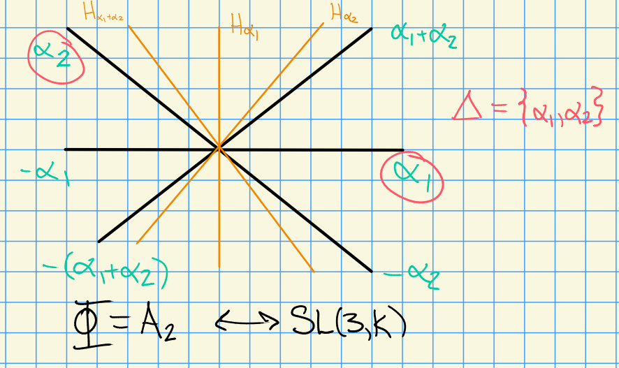

# Wednesday, August 26

## Review

- $G$ a reductive algebraic group over $k$
- $T = \prod_{i=1}^n \GG_m$ a maximal split torus
- $\lieg = \mathrm{Lie}(G)$
- There's an induced root space decomposition $\lieg = t\oplus \bigoplus_{\alpha\in \Phi}\lieg_\alpha$
- When $G$ is simple, $\Phi$ is an *irreducible* root system
  - There is a classification of these by Dynkin diagrams

:::{.example}
$A_n$ corresponds to $\liesl(n+1, k)$ (mnemonic: $A_1$ corresponds to $\liesl(2)$)
:::

- We have representations $\rho: G\to \GL(V)$, i.e. $V$ is a $G\dash$module
- For $T\subseteq G$, we have a weight space decomposition: 
  $V = \bigoplus_{\lambda \in X(T)} V_\lambda$ where $X(T) = \hom(T, \GG_m)$.

  > Note that $X(T) \cong \ZZ^n$, the number of copies of $\GG_m$ in $T$.

## Root Systems

:::{.example}
Let $\Phi = A_2$, then we have the following root system:

:::

In general, we'll have $\Delta = \ts{\alpha_1, \cdots, \alpha_n}$ a basis of *simple roots*.

:::{.remark}
Every root $\alpha\in I$ can be expressed as either positive integer linear combination (or negative) of simple roots.
:::

For any $\alpha\in \Phi$, let $s_\alpha$ be the reflection across $H_\alpha$, the hyperplane orthogonal to $\alpha$.
Then define the *Weyl group* $W = \ts{s_\alpha \st \alpha\in \Phi}$.

:::{.example}
Here the Weyl group is $S_3$:

:::

:::{.remark}
$W$ acts transitively on bases.
:::

:::{.remark}
$X(T) \subeteq \ZZ\Phi$, recalling that $X(T) = \hom(T, \GG_m) = \ZZ^n$ for some $n$.
Denote $\ZZ\Phi$ the *root lattice* or the *weight lattice*.
:::

:::{.example}
Let $G = \liesl(2, \CC)$
:::

