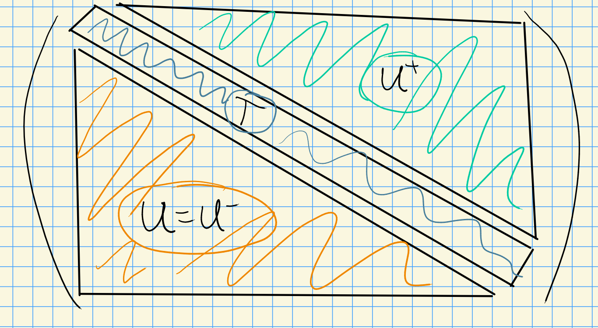

# Friday, August 28

## Representation Theory

Review: let $\lieg$ be a semisimple lie algebra $/\CC$.
There is a decomposition $\lieg = \lieb^+ \oplus \lien^- = \lien^+ \oplus t\oplus \lien^-$, where $t$ is a torus.
We associate $U(\lieg)$ the universal enveloping algebra, and representations of $\lieg$ correspond with representations of $U(\lieg)$.

Let $\lambda \in X(T)$ be a weight, then $\lambda$ is a $U(\lieb^+)\dash$module.
We can write  $Z(\lambda) = U(\lieg) \tensor_{U(\lieb^+)} \lambda$.

:::{.remark}
There exists a unique maximal submodule of $Z(\lambda)$, say $RZ(\lambda)$ where $Z(\lambda)/RZ(\lambda) \cong L(\lambda)$ is an irreducible representation of $\lieg$.
:::

:::{.theorem title="?"}
Let $L = L(\lambda)$ be a finite-dimensional irreducible representation for $\lieg$.
Then

1. $L \cong Z(\lambda)/RZ(\lambda)$ for some $\lambda$.
2. $\lambda \in X(T)_+$ is a dominant integral weight.
:::

### Induction

Let $\lieg$ be an algebraic group $/k$ with $k = \bar{k}$, and let $H \leq G$.
Let $M$ be an $H\dash$module, we'll eventually want to produce a $G\dash$modules.

Step 1:
Make $M$ into a $G\cross H$ where the first component $(g, 1)$ acts trivially on $M$.

Taking the coordinate algebra $k[G]$, this is a $(G-G)\dash$bimodule, and thus becomes a $G\cross H\dash$module.
Let $f\in k[G]$, so $f:G\to  K$, and let $y\in G$.
The explicit action is 
\[  
[(g, h) f] (y) \da f(g^{-1} y h)
.\]

Note that we can identify $H\cong 1\cross H \leq G\cross H$.
We can form $(M\tensor_k k[G])^H$, the $H\dash$fixed points.

:::{.exercise}
Let $N$ be an $A\dash$module and $B\normal A$, then $N^B$ is an $A/B\dash$module.

> Hint: the action of $B$ is trivial on $N^B$.
> Here $N^B \da \ts{n\in N \st b.n = n\, \forall b\in B}$

:::

:::{.definition title="Induction"}
The *induced module* is defined as 
\[  
\ind_H^G(M) \da (M\tensor k[G])^H
.\]
:::

### Properties of Induction

1. $(\wait \tensor_k k[G]) = \hom_H(k, \wait \tensor_k k[G])$ is only *left-exact*, i.e.
\[  
\qty{0\to A\to B\to C\to 0}\mapsto \qty{0\to FA \to FB \to FC \to \cdots}
.\]

2. By taking right-derived functors $R^jF$, you can take cohomology.

  > Note that in this category, we won't have enough projectives, but we will have enough injectives.

3. This functor commutes with direct sums and direct limits.

4. (**Important**) Frobenius Reciprocity: there is an adjoint, *restriction*, satisfying
\[  
\hom_G(N, \ind_H^G M) = \hom_H(N\downarrow_H, M)
.\]

5. (Tensor Identity) If $M\in \Mod(H)$ and additionally $M \in \Mod(G)$, then $\ind_H^G = M \tensor_k  \ind_H^G k$.

  If $V_1, V_2 \in \Mod(G)$ then $V_1 \tensor_k V_2 \in \Mod(G)$ with the action given by $g(v_1\tensor v_2) = gv_1 \tensor gv_2$.

6. Another interpretation: we can write
\[  
\ind_H^G(M) = \ts{f\in \Hom(G, M_a)
\st
f(gh) = h^{-1} \cdot f(g)
\, \forall g\in G, h\in H} \qquad M_a = M \da \AA^{\dim M}
.\]

> I.e., equivariant wrt the $H\dash$action. 

Then $G$ acts on   $\ind_H^G M$ by left-translation: $(gf)(y) = f(g^{-1} y)$.

7. There is an evaluation map:
\[  
\eps: \ind_H^G(M) &\to M \\ 
f&\mapsto f(1)
.\]

This is an  $H\dash$module morphism.
Why?
We can check
\[  
\eps(h.f) 
&\da (h.f)(a) \\
&= f(h^{-1} ) \\
&= hf(1) \\
&= h(\eps(f))
.\]

We can write the isomorphism in Frobenius reciprocity explicitly:
\[  
\hom_G(N, \ind_H^G M) &\mapsvia{\cong} \hom_H(N, M) \\
\phi & \mapsto \eps \circ \phi
.\]

8. Transitivity of induction: for $H\leq H' \leq G$, there is a natural transformation (?) of functors:
\[  
\ind_H^G(\wait) = \ind_{H'}^G\qty{\ind_H^{H'}(\wait) }
.\]

\todo[inline]{Equality as a composition of functors?}

## Classification of Simple $G\dash$modules

Suppose $G$ is a connected reductive algebraic group $/k$ with $k = \bar k$.

:::{.example}
Let $G = \GL(n, k)$.
There is a decomposition:

:::

**Step 1**:
Getting modules for $U$.

Then there's a general fact: $U^+ T U \injects G$ is dense in the Zariski topology for any reductive algebraic group.
We can form

- $B^+ \da T\semidirect U^+$, the *positive borel*,
- $B^- \da T\semidirect U^$, the *negative borel*,

Suppose we have a $U\dash$module, i.e. a representation $\rho: U \to \GL(V)$.
We can find a basis such that $\rho(u)$ is upper triangular with ones on the diagonal.
In this case, there is a composition series with 1-dimensional quotients, and the composition factors are all isomorphic to $k$.

Moral: for unipotent groups, there are only trivial representations, i.e. the only simple $U\dash$modules are isomorphic to $k$.

**Step 2**: 
Getting modules for $B$.

Modules for $B$ are solvable, in which case we can find a flag. 
In this case, $\rho(b)$ embeds into upper triangular matrices, where the diagonal action may now not be trivial (i.e. diagonal is now arbitrary).

Thus simple $B\dash$modules arise by taking $\lambda \in X(T) = \hom(T, \GG_m) = \hom(T, \GL(1, k))$, then letting $u$ act trivially on $\lambda$, i.e. $u.v = v$.
Here we have $B \to B/U = T$, so any $T\dash$module can be pulled back to a $B\dash$module.

**Step 3**: 
Getting modules for $G$.

Let $\lambda \in X(T)$, then $H^0(\lambda) = \ind_B^G \lambda = \nabla(\lambda)$.

