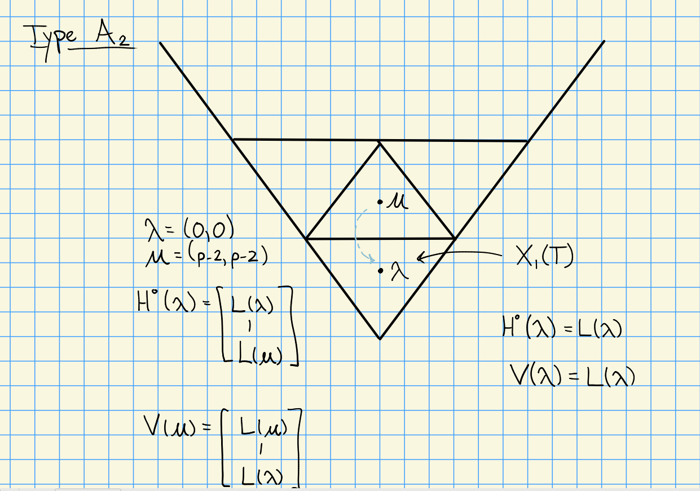
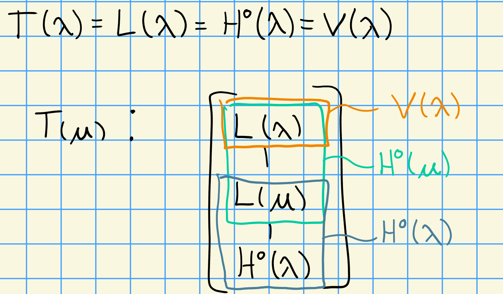

# Monday, September 28

## Kempf's Theorem

Next topic: Kempf's Vanishing Theorem.
Proof in Jantzen's book involving ampleness for sheaves.

Setup:

We have 

\begin{center}
\begin{tikzcd}
G & \text{a reductive algebraic group over } k = \bar k \\
B\ar[u, "\subseteq"] & \text{the Borel subgroup} \\
T\ar[u, "\subseteq"] & \text{its maximal torus}
\end{tikzcd}
\end{center}
along with the weights $X(T)$.

We can consider derived functors of induction, yielding $R^n \ind_B^G \lambda = \mathcal{H}^n(G/B, \mathcal{L}(\lambda)) \da H^n(\lambda)$ where $\mathcal{L}(\lambda)$ is a line bundle and $G/B$ is the flag variety.

Recall that 

- $H^0(\lambda) = \ind_B^G(\lambda)$,
- $\lambda \not\in X(T)_+ \implies H^0(\lambda) = 0$
- $\lambda \in X(T)_+ \implies L(\lambda) = \soc_G H^0(\lambda) \neq 0$.

:::{.theorem title="Kempf"}
If $\lambda \in X(T)_+$ a dominant weight, then $H^n(\lambda) = 0$ for $n> 0$.
:::

:::{.remark}
In $\ch(k) = 0$, $H^n(\lambda)$ is known by the Bott-Borel-Weil theorem.
In positive characteristic, this is not know: the characters $\ch H^n (\lambda)$ is known, and it's not even known if or when they vanish.
Wide open problem!

> Could be a nice answer when $p>h$ the Coxeter number.
:::

## Good Filtrations and Weyl Filtrations

We define two classes of distinguished modules for $\lambda \in X(T)_+$:

- $\nabla(\lambda) \da H^0(\lambda) = \ind_B^G \lambda$ the costandard/induced modules.
- $\Delta(\lambda) = V(\lambda) \da H^0(-w_0 \lambda) = \ind_B^G \lambda$ the standard/Weyl modules
  - Here $w_0$ is the longest element in the Weyl group

We have
\[  
L(\lambda) &\injects \nabla(\lambda)
\Delta(\lambda) &\surjects L(\lambda)
.\]

We define the category $\text{Rat}\dash G$ of rational $G\dash$modules.
This is a *highest weight category* (as is e.g. Category $\OO$).

:::{.definition title="Good Filtrations"}
An (possibly infinite) ascending chain of $G\dash$modules
\[  
0 \leq V_0 \subseteq V_1 \subseteq V_2 \subseteq \cdots \subseteq V
\]
is a **good filtration** of $V$ iff

1. $V = \union_{i\geq 0} V_i$

2. $V_i/V_{i-1} \cong H^0(\lambda_i)$ for some $\lambda_i \in X(T)_+$.

> In characteristic zero, the $H^0$ are irreducible and this recovers a composition series.
> Since we don't have semisimplicity in this category, this is the next best thing.

:::

:::{.definition title="Weyl Filtration"}
With the same conditions of a good filtration, a chain is a **Weyl filtration** on $V$ iff

1. $V = \union_{i\geq 0} V_i$

2. $V_i/V_{i-1} \cong V(\lambda_i)$ for some $\lambda_i \in X(T)_+$.

> I.e. the different is now that the quotients are standard modules.
:::

:::{.definition title="Tilting Modules"}
$V$ is a **tilting module** iff $V$ has both a good filtration and a Weyl filtration.
:::

:::{.theorem title="Ringel, 1990s"}
Let $\lambda \in X(T)_+$ be a dominant weight.
Then there is a unique indecomposable highest weight tilting module $T(\lambda)$ with highest weight $\lambda$.
:::

:::{.example}
We have the following situation for type $A_2$:

And thus a decomposition:

:::

The picture to keep in mind is the following: 4 types of modules, all indexed by dominant weights:
<!--\begin{center}-->
<!--\begin{tikzcd}-->
<!--& H^0(\lambda) & \\-->
<!--L(\lambda) \ar[ur, hookrightarrow] & & T(\lambda)\arrow[ul, twoheadrightarrow]\\-->
<!--& V(\lambda) \arrow[ul, twoheadrightarrow] \ar[ur, hookrightarrow]-->
<!--\end{tikzcd}-->
<!--\end{center}-->

## Cohomological Criteria for Good Filtrations

We'll take cohomology in the following way: let $G$ be an algebraic group scheme, and define
\[  
\H^n(G, M) \da \Ext_G^n(k, M)
.\]
where to compute $\Ext_G^n(M, N)$ we take an injective resolution $N \injects I_*$, apply $\hom_G(M, \wait)$, and take kernels mod images.

Letting $\lambda \in \ZZ\Phi$ be integral, so $\lambda_{\alpha \in \Delta} = \sum n_\alpha \alpha$, define the **height** 
\[  
\ht(\lambda) = \sum_{\alpha\in\Delta} n_\alpha
.\]

:::{.lemma title="?"}
There exists an injective resolution of $B\dash$modules
\[  
0\to k\to I_0 \to I_1 \to \cdots
\]
where

:::
